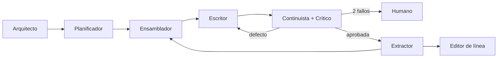

# CLAUDE.md

Instrucciones de proyecto para Claude Code y para cualquier agente de código que trabaje en este repositorio. **Este fichero es el único manual operativo:** léelo entero antes de escribir o modificar código.

`AGENTS.md` no contiene especificaciones: solo apunta aquí.

---

## 1. Qué es este proyecto

Sistema de generación asistida de novela larga (80.000–120.000 palabras), con el romance como género de referencia.

**Principio rector:** la unidad atómica de generación es la **escena**. Todo gira alrededor de ensamblar el contexto correcto para una escena, escribirla, validarla y extraer de ella los hechos que alimentan la siguiente.

| Necesitas… | Ve a |
| --- | --- |
| Qué significa un término | `docs/definitions.md` — **fuente de verdad** |
| Cómo funciona una novela (estructura, género, arcos) | `docs/domain-knowledge.md` |
| Cómo se construye el sistema, agentes, proceso, diagramas y árboles | `docs/architecture.md` |
| Cómo se trabaja: `docs/`, spec, plan, código | §3 de este fichero |
| Stack, límites técnicos, convenciones, agentes, checklist | este fichero |

---

## 2. Regla primera: el vocabulario no se improvisa

> **Si necesitas la definición de cualquier término del dominio, ve a [`docs/definitions.md`](docs/definitions.md).**

Aplica siempre que aparezca uno de estos conceptos: escena, beat, giro de valor, canon, hecho de canon, plantado, pago, revelación, hilo narrativo, estado en T, ledger, paquete de contexto, muestra ancla, deriva, perfil de voz, beat de género, tropo, nivel de calor, HEA/HFN, puerta de calidad, defecto, biblia, outline, ficha de escena.

- No inventes sinónimos ni traduzcas términos por tu cuenta: el mismo concepto se llama igual en el esquema de datos, en los prompts, en las rúbricas y en la interfaz.
- Si un término que necesitas **no está** en `docs/definitions.md`, no lo introduzcas: propón la definición y espera confirmación antes de escribir código con él.
- Si el código y `docs/definitions.md` se contradicen, **gana el documento**.

---

## 3. Cómo trabajar en este repositorio

1. **Lee antes de escribir.** Ante una tarea de dominio: `docs/definitions.md` → la feature afectada → sus tests.
2. **Respeta las fronteras.** Backend: una feature solo importa de `commons/` y del `__init__.py` de otra feature. Frontend: solo hacia capas inferiores, nunca entre features, siempre por `index.ts`. Detalle en §5. Si una tarea te obliga a saltarte una frontera, **para y pregunta**: casi siempre significa que el corte está mal.
3. **Cambios pequeños y verificables.** Un cambio por commit, con su test. Nada de refactorizaciones de oportunidad mezcladas con funcionalidad.
4. **Los tests son el contrato.** Toda regla de dominio de §8 tiene un test que la comprueba. No se borra un test para que pase el código.
5. **No llames al modelo en los tests.** El cliente de LLM se inyecta; en pruebas se usa un doble con respuestas fijas.
6. **Determinismo.** Cualquier ejecución debe poder reproducirse: prompt versionado, semilla, IDs recuperados.
7. **Pregunta ante:** añadir una dependencia, cambiar el esquema de la base de datos, tocar el presupuesto de contexto o crear una feature nueva.

El resto de esta sección es el **proceso**: de dónde sale una funcionalidad y qué la deja entrar en el código. Son cuatro puertas y ninguna se salta.

| Puerta | No se pasa hasta que… | Qué la abre |
| --- | --- | --- |
| **Spec** | no queda ninguna pregunta abierta | una persona, en un commit suyo |
| **Plan** | `spec.md` está en `estado: aprobada` | una persona, en un commit suyo |
| **Código** | `plan.md` está en `estado: aprobado` | un test en rojo, antes de la primera línea |
| **Cierre** | la spec y `docs/` reflejan lo implementado | el checklist de §15 |

Tres sitios, tres cosas distintas. Confundirlos es justo el error que este proceso evita:

| Dónde | Qué contiene | Vida |
| --- | --- | --- |
| `docs/` | lo que **es verdad hoy**: vocabulario, dominio, arquitectura, verificación | permanente |
| `specs/<id>/spec.md` | lo que **queremos que sea verdad**: una funcionalidad con criterios de aceptación | nace, se aprueba, se implementa, se archiva |
| `specs/<id>/plan.md` | **cómo** se llega hasta ahí, paso a paso y test a test | muere con la implementación |

**Excepciones.** No necesitan spec: erratas, formato, lint, y actualizaciones de dependencia que no cambian comportamiento. Sí la necesita todo lo que altere comportamiento observable, esquema, prompts o fronteras. En la duda, spec.

### 3.1 Actualizar `docs/`

- `docs/` describe **el presente**, nunca una intención. Si algo todavía no es cierto, su sitio es una spec, no un documento.
- Jerarquía cuando dos documentos discrepan: `docs/definitions.md` manda sobre el vocabulario, `docs/architecture.md` sobre estructura y decisiones, este fichero sobre cómo se trabaja. El código nunca gana a un documento: o se corrige el código, o se cambia el documento a propósito.
- Un documento se actualiza **en el mismo commit** que el cambio que lo vuelve cierto. Un commit que deja `docs/` desfasado está incompleto, no «pendiente de documentar».
- Nada se duplica entre documentos: se enlaza. Dos copias de una regla divergen.
- Un término nuevo no entra sin pasar antes por `docs/definitions.md` (§2).
- Al cerrar una spec se revisan los cuatro documentos: definiciones, dominio, arquitectura y verificación. Lo normal es que cambie uno; lo peligroso es no mirar.

### 3.2 Crear o actualizar una spec

Toda funcionalidad empieza aquí. Una spec dice **qué** debe ocurrir y **cómo se sabrá que ocurrió**; no dice cómo se implementa.

> **Antes de escribir una spec, pregunta.** No rellenes huecos por tu cuenta ni deduzcas el alcance del código existente. Una spec con suposiciones no declaradas no se aprueba.

Vive en `specs/NNN-slug/spec.md`, con `NNN` correlativo de tres dígitos. Plantilla en `specs/_plantilla-spec.md`.

Antes de salir de borrador, una spec cierra:

1. **Problema y actor.** Qué no se puede hacer hoy y para quién.
2. **Alcance y fuera de alcance.** Lo segundo importa tanto como lo primero.
3. **Criterios de aceptación observables.** Cada uno acabará siendo un test; si no se puede comprobar, no es un criterio.
4. **Reglas de dominio de §8 afectadas** y cómo se respetan.
5. **Impacto técnico.** Qué capa del presupuesto de §4.1 crece, si hay migración de esquema y si el cambio funciona con y sin extensión vectorial.
6. **Vocabulario.** Todos los términos usados existen en `docs/definitions.md`.

Lo que no puedas cerrar preguntando se escribe en **Preguntas abiertas**. Mientras quede una, la spec no se aprueba: no se aprueba a medias ni se deja «para decidir durante la implementación».

**Estados:** `borrador` → `en-revision` → `aprobada` → `implementada`. Un agente **no se aprueba a sí mismo una spec**. Si una persona la aprueba, el cambio de estado va en un commit propio que no contenga nada más, para que la aprobación sea localizable en el historial.

### 3.3 Plan de implementación

Vive en `specs/NNN-slug/plan.md`. Plantilla en `specs/_plantilla-plan.md`.

**No se escribe un plan si `spec.md` no está en `estado: aprobada`.** Si te piden el plan y la spec no lo está, para y dilo; no lo redactes «mientras tanto».

El plan traduce cada criterio de aceptación en pasos. Cada paso lleva:

- el test que fallará primero, nombrado;
- el cambio mínimo que lo pone en verde;
- los ficheros que toca, por feature;
- y cabe en un commit verificable por separado.

Además, el plan declara las fronteras de §5 implicadas, la migración de Alembic si el esquema cambia, el desglose de tokens por capa si se toca el ensamblado (§4.1), el orden de los pasos y qué queda fuera. Si el plan necesita cruzar una frontera o crear una feature nueva, eso es una pregunta (punto 7 de esta sección), no un paso.

**Estados:** `borrador` → `en-revision` → `aprobado` → `completado`, con la misma mecánica de aprobación que la spec.

### 3.4 Escribir código: TDD

**No hay código de producción sin `plan.md` en `estado: aprobado`.**

Cada paso del plan, en este orden:

1. **Rojo.** Se escribe el test y se comprueba que falla. Un test que nunca se vio fallar no prueba nada.
2. **Verde.** El cambio mínimo que lo pasa.
3. **Refactor.** Con el test en verde, y sin añadir comportamiento.

- El test entra **en el mismo commit** que el código.
- El test se escribe contra el criterio de aceptación de la spec, no contra la implementación que ya tienes en la cabeza.
- Si al implementar descubres que la spec está equivocada o incompleta, **para**: se corrige la spec, se vuelve a aprobar y se rehace el paso del plan si hace falta. No se ajusta la spec a lo que resultó cómodo de programar.
- Cualquier desvío respecto al plan se anota en el plan **antes** de seguir. El plan es un documento vivo hasta el cierre.

### 3.5 Cierre

- `spec.md` pasa a `estado: implementada`, citando los commits.
- `docs/` queda al día en el mismo commit que el cambio (§3.1).
- El plan no se borra: queda como registro de cómo se hizo.
- Se pasa el checklist de §15.

---

## 4. Requisitos técnicos (no negociables)

| Requisito | Decisión | Implicación |
| --- | --- | --- |
| Backend | **FastAPI** (Python 3.12+), Pydantic v2 | Async por defecto, OpenAPI como contrato |
| Frontend | **React 19 + TypeScript + Vite** | SPA; cliente de API generado del OpenAPI |
| Contexto del modelo | **Límite duro de 100.000 tokens** | Presupuesto por capa, contador obligatorio, fallo antes de llamar |
| Persistencia | **SQLite**, con o sin extensión vectorial | El código debe funcionar en ambos modos |

### 4.1 El límite de 100.000 tokens

Es la restricción de diseño más importante del proyecto.

- **Nunca se llama al modelo sin haber contado los tokens del paquete.** El contador es una dependencia inyectada, no una estimación por caracteres.
- El presupuesto se reparte por capas y cada capa tiene tope propio. Si una se pasa, se recorta **esa** capa, no el resto:

  | Capa | Tope | Qué se recorta primero |
  | --- | --- | --- |
  | Constitucional | 5.000 | Nunca se recorta |
  | Estructural | 10.000 | Detalle de beats lejanos |
  | Canon relevante | 20.000 | Personajes mencionados, no presentes |
  | Estado en T | 15.000 | Conocimientos antiguos ya usados |
  | Continuidad local | 20.000 | Escena N-2 antes que N-1 |
  | Memoria recuperada | 10.000 | Resultados de menor puntuación |
  | Instrucción | 10.000 | Nunca se recorta |
  | Reserva | 10.000 | Reservado para reparación y reintento |

- El ensamblador devuelve siempre el desglose por capa junto al paquete; se guarda en la tabla `ejecucion`.
- Si tras recortar no cabe, se lanza `ContextBudgetExceeded`. **Nunca se trunca por el final en silencio.**
- La reserva del 10 % existe para que el reintento con el defecto añadido siga cabiendo.
- Ese tope es **por llamada**. Hay además un **techo agregado de 100.000 tokens en vuelo** —el mismo número— para todas las llamadas simultáneas del proceso (`docs/architecture.md` §2.2). Consecuencia: una llamada grande satura el sistema entero, y las demás esperan. Si no hay hueco, la llamada espera; **nunca se recorta el paquete para hacerla caber**.

### 4.2 SQLite con y sin vectores

- La búsqueda semántica vive detrás de la interfaz `VectorStore`, con dos implementaciones: `SqliteVecStore` (extensión `sqlite-vec` cargada) y `BruteForceStore` (NumPy sobre embeddings en BLOB).
- En arranque se detecta si la extensión carga; si no, se degrada y se registra un aviso. **El sistema nunca falla por falta de extensión vectorial.**
- Recuperación **híbrida y en este orden**: filtro estructural (presentes, lugar, hilos abiertos, rango de capítulos) → similitud semántica sobre el conjunto ya filtrado → fusión con recencia.
- WAL activado, `foreign_keys=ON`, `busy_timeout`. Migraciones con Alembic desde el primer commit.
- Toda escritura de estado pasa por el ledger *append-only*; `estado_en_t` es una vista derivada, **jamás** una tabla que se edita.

---

## 5. Arquitectura del código

Ambos lados se organizan **por feature**, no por tipo de fichero. La arquitectura completa y sus alternativas descartadas están en `docs/architecture.md`.

### 5.1 Backend: features + commons

```
src/backend/app/
  features/<feature>/   router.py · schemas.py · service.py · repository.py
                        agents.py · prompts/ · index → __init__.py · tests/
    obra · outline · escena · contexto · escritura
    calidad · canon · manuscrito · auditoria
  commons/              domain/ db/ llm/ errors/ jobs/ config/
  main.py               composición: monta routers y dependencias
```

Reglas (test de arquitectura con import-linter; falla la build):

1. Una feature solo importa de `commons/` y del `__init__.py` de otra feature. **Nunca** de sus ficheros internos.
2. `commons/` **no importa de ninguna feature**.
3. `commons/domain/` no importa FastAPI, SQLAlchemy ni clientes HTTP. Se prueba sin base de datos.
4. Código repetido: **se duplica primero**; sube a `commons/` al tercer uso real. `commons/` no es el cajón de sastre.
5. Un ciclo entre features es un error de diseño: se extrae el concepto a `commons/domain/` o se invierte con un evento.

### 5.2 Frontend: feature-first (Bulletproof React + 3 reglas de frontera)

```
src/frontend/src/
  app/                  router, providers, estilos globales
  features/
    escena/             api/ components/ hooks/ types/ index.ts
    revision/  outline/  canon/  manuscrito/  auditoria/
  shared/
    ui/primitives/      Button, Input, Select, Dialog, Badge
    ui/patterns/        DataTable, FormField, EmptyState, Toolbar
    api/                cliente generado del OpenAPI
    lib/  hooks/  types/
```

Reglas (ESLint `import/no-restricted-paths`; no se revisan a mano):

1. **`shared/` nunca importa de `features/`.** Un import en esa dirección es siempre un error.
2. **Las features no se importan entre sí.** Si dos lo necesitan, lo común baja a `shared/`.
3. **Se entra a una feature solo por su `index.ts`.** Nunca a un fichero interno.

No usamos Atomic Design: `primitives` = sin lógica de negocio, reutilizable en cualquier app; `patterns` = composición de primitivos para un patrón recurrente.

---

## 6. Convenciones de backend

- **Los endpoints no contienen lógica.** Validan entrada, llaman a un servicio de su feature, devuelven un modelo de respuesta.
- Una funcionalidad nueva es una feature nueva o un caso de uso dentro de una existente; nunca un fichero suelto en una carpeta global.
- Modelos de entrada y de salida separados; nunca se expone el modelo de base de datos.
- `async def` en todo lo que hace IO. Librería síncrona y bloqueante → *thread pool*, no *event loop*.
- Dependencias por `Depends()`, incluidos reloj, contador de tokens y cliente de modelo: es lo que permite probar sin llamar al proveedor.
- Errores de dominio: excepciones propias traducidas a HTTP por el handler central de `commons/errors/`. Nada de `HTTPException` dentro de los servicios.
- Operaciones largas (escribir un capítulo, auditar el manuscrito) son trabajos en segundo plano con estado consultable, no peticiones HTTP que esperan.
- Herramientas: `ruff` (lint + formato), `mypy` estricto sobre `commons/domain/` y los `service.py`, `pytest` con `pytest-asyncio`.

## 7. Convenciones de frontend

- TypeScript estricto. Nada de `any` en código de producción.
- El cliente de API se **genera** desde el OpenAPI del backend; no se escriben tipos de respuesta a mano.
- Estado de servidor con TanStack Query; estado de UI con `useState`/`useReducer`. No se mezclan en un store global.
- Ningún `fetch` dentro de un componente: vive en `shared/api/` o en el `api/` de la feature, y se consume por hook.
- Componentes funcionales, exportaciones nombradas, test colocado junto al componente.
- El editor del manuscrito trabaja sobre versiones inmutables: editar crea versión nueva y marca la vigente.
- Accesibilidad mínima: foco visible, etiquetas en formularios, contraste AA.

## 8. Reglas de dominio que el código debe respetar

1. Una escena tiene exactamente un POV y un giro de valor no nulo.
2. Un personaje no puede usar información sin `sabe_desde` con escena anterior.
3. El estado en T se **deriva** del ledger; no se escribe a mano.
4. Todo hecho de canon cita la escena que lo estableció.
5. Ninguna escena puede exceder el `nivel_de_calor` declarado en la obra.
6. Ningún contenido romántico o sexual con personajes menores de 18 años: **validación de esquema**, no instrucción de prompt.
7. Cada ejecución guarda prompt, versión de biblia, IDs recuperados, modelo, semilla y coste.

Si el código y `docs/definitions.md` no coinciden, **gana el documento**.

---

## 9. Agentes narrativos del sistema

Cada rol tiene prompt propio, contexto propio y criterio de éxito propio. Están separados a propósito: quien escribe no ve sus contradicciones, y quien juzga no debe reparar.

| Agente | Entrada | Salida | Criterio de éxito | Escribe prosa |
| --- | --- | --- | --- | --- |
| **Arquitecto** | Brief | Premisa, biblia, outline | Estructura completa y beats cubiertos | No |
| **Planificador de escena** | Outline + estado en T | Ficha de escena | Objetivo, obstáculo y giro de valor definidos | No |
| **Ensamblador de contexto** | Ficha + almacenes | Paquete de contexto | Dentro de presupuesto, trazable | No (es código) |
| **Escritor** | Paquete de contexto | Prosa de escena | Voz consistente, escena dramatizada | Sí |
| **Continuista** | Prosa + canon | Defectos con código | Cero falsos negativos en CAN y CON | No |
| **Crítico** | Prosa + rúbrica | Puntuaciones y diagnóstico | Correlación con el editor humano | No |
| **Editor de línea** | Prosa aprobada | Prosa pulida | Mejora métricas de prosa sin tocar hechos | Sí, frase a frase |
| **Extractor** | Prosa aprobada | Hechos, estado, resumen, hilos | Todo hecho nuevo capturado y con origen | No |
| **Auditor de manuscrito** | Manuscrito + outline | Informe de auditoría | Cobertura de beats y cabos sueltos | No |

### 9.1 Reglas transversales

- **El Ensamblador es código, no modelo.** Debe ser determinista y auditable; si fuera un modelo, no se podría reproducir un fallo.
- **El Escritor solo ve lo que hay en el paquete.** Nunca accede a la base de datos: si le falta un dato, es un fallo del ensamblado, no del escritor. Esto hace que los defectos sean atribuibles.
- **El Continuista devuelve códigos** (`CAN-01`, `CON-03`, `VOZ-02`…) con cita del pasaje, nunca prosa corregida.
- **El Crítico no repara.** Puntúa y diagnostica; la reparación vuelve al Escritor con el defecto concreto en el prompt.
- **Máximo dos reintentos dirigidos** por escena; después, escalado a revisión humana.
- **El Extractor cierra el bucle:** cada hecho nuevo entra al grafo citando su escena de origen. Sin esto la memoria no crece y la coherencia se pierde hacia el capítulo 10.

### 9.2 Flujo



### 9.3 Dónde vive cada agente

Cada agente narrativo pertenece a la feature que lo orquesta: su código en `features/<feature>/agents.py` y sus prompts en `features/<feature>/prompts/`.

| Agente | Feature |
| --- | --- |
| Arquitecto | `obra`, `outline` |
| Planificador de escena | `escena` |
| Ensamblador de contexto | `contexto` |
| Escritor, Editor de línea | `escritura` |
| Continuista, Crítico | `calidad` |
| Extractor | `canon` |
| Auditor de manuscrito | `auditoria` |

## 10. Prompts

- Viven en `features/<feature>/prompts/`, uno por rol, versionados (`escritor.v3.md`). **No se editan en sitio:** versión nueva y se cambia la referencia.
- Todo prompt declara: rol, restricciones duras (POV, tiempo verbal, nivel de calor), formato de salida y qué **no** debe hacer.
- Las restricciones duras se repiten al principio y al final: el centro del prompt es donde más información se pierde.
- Ninguna regla de seguridad depende solo del prompt. Edad, nivel de calor y consentimiento se validan además en código.

## 11. Definición de «hecho» para un agente

Un agente solo puede afirmar algo si procede de: `docs/definitions.md`, el grafo de canon, el paquete de contexto recibido o una instrucción explícita del usuario. Todo lo demás se marca como propuesta, no como hecho.

---

## 12. Skills del proyecto

Las skills instaladas viven en `.claude/skills/` (compartidas, commiteadas) o llegan por plugin. Procedencia, commit exacto y licencia de cada una: `.claude/skills/SOURCES.md`. Ver `docs/architecture.md` §7.2 para el detalle por área.

Hay una skill por requisito técnico de §4, y ninguna más:

| Skill | Requisito de §4 | Área del repo |
| --- | --- | --- |
| `python-fastapi-ops` | Backend FastAPI | `src/backend/app/features/*/router.py`, `service.py` |
| `pydantic` | Pydantic v2 | `schemas.py`, `commons/domain/` |
| `sqlite-vec` | Persistencia **con** extensión vectorial | `features/contexto/`, `commons/db/` |
| `sqlite-ops` | Persistencia **sin** extensión: WAL, índices, migraciones | `commons/db/`, `repository.py`, Alembic |
| `typescript-best-practices` | Frontend TypeScript estricto | `src/frontend/src/` |
| `react-best-practices` | Frontend React 19 | `src/frontend/src/features/*/components/` |
| `feature-sliced-design` | — (referencia, no norma) | Ver aviso abajo |

**`feature-sliced-design` no es la arquitectura de este proyecto.** Está instalada como referencia para la migración descrita en `docs/architecture.md` §6.5. En cualquier decisión sobre dónde va un fichero, qué capas existen o cómo se cruzan las fronteras, **manda §5.2 de este fichero**.

Lo específico de este proyecto —presupuesto de 100.000 tokens, ontología de escena y canon, las reglas de frontera de §5, el ledger append-only— **no lo cubre ninguna skill pública**: vive en este fichero.

## 13. Comandos

```bash
# backend
uv sync
uv run uvicorn app.main:app --reload
uv run pytest
uv run ruff check --fix . && uv run ruff format .
uv run lint-imports                 # reglas de frontera entre features
uv run alembic upgrade head

# frontend
pnpm install
pnpm dev
pnpm test
pnpm typecheck
pnpm lint                            # incluye import/no-restricted-paths
```

## 14. Qué no hacer

- No llamar al modelo sin contar tokens.
- No truncar contexto por el final sin registrar qué se ha quitado.
- No guardar prosa generada sin `run_id` asociado.
- No añadir una segunda base de datos «temporalmente».
- No introducir términos de dominio que no estén en `docs/definitions.md`.
- No editar escenas en sitio: siempre versión nueva.
- No usar reintentos genéricos («mejóralo»): el reintento lleva el defecto concreto con cita del pasaje.
- No importar entre features ni desde `shared`/`commons` hacia una feature.
- No meter nada en `shared/` o `commons/` con menos de tres usos reales.
- No escribir un plan de implementación si la spec no está aprobada, ni código si el plan no lo está.
- No escribir código de producción antes que su test.
- No aprobar una spec ni un plan en nombre de la persona, ni dar por aprobado lo que nadie ha firmado en un commit.
- No cerrar una spec dejando `docs/` desfasado.
- No describir en `docs/` algo que todavía no existe: eso es una spec.

## 15. Antes de dar una tarea por terminada

- [ ] Los términos usados existen en `docs/definitions.md`.
- [ ] Hay test de la regla de dominio afectada (§8).
- [ ] Backend: `ruff`, `mypy`, `pytest` y `lint-imports` pasan.
- [ ] Frontend: `pnpm typecheck` y `pnpm lint` pasan (incluye las reglas de frontera).
- [ ] No se ha creado ningún import entre features, ni de `shared`/`commons` hacia una feature.
- [ ] Si se tocó el contexto: el desglose de tokens por capa sigue dentro de los topes de §4.1.
- [ ] Si se tocó el esquema: hay migración de Alembic y funciona con y sin extensión vectorial.
- [ ] La spec y el plan reflejan lo que de verdad se implementó, y la spec queda en `implementada`.
- [ ] `docs/` está al día si cambió el vocabulario, la arquitectura o la verificación.
- [ ] Ningún cambio de estado de aprobación lo ha hecho un agente por su cuenta.
- [ ] Ninguna clave, prompt de producción ni fragmento de manuscrito ha quedado en el repositorio.
