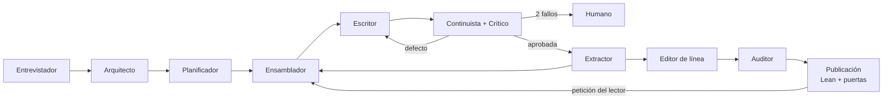

# CLAUDE.md

Instrucciones de proyecto para Claude Code y para cualquier agente de código que trabaje en este repositorio. **Este fichero es el único manual operativo:** léelo entero antes de escribir o modificar código.

`AGENTS.md` no contiene especificaciones: solo apunta aquí.

---

## 1. Qué es este proyecto

Un sistema que escribe **novelas personalizadas para regalar**: a un hijo, a la pareja, para una boda o una jubilación. Alguien encarga la novela y aporta los datos de quien la va a recibir; el sistema construye una historia que los contiene.

**Diez capítulos de 1.000–1.500 palabras.** Unas doce mil en total. La dificultad no está en la extensión: está en el proceso.

**Dos cosas se juzgan a la vez, y ninguna rescata a la otra:**

| | Qué se pregunta | Cómo falla |
| --- | --- | --- |
| **Personalización** | ¿El destinatario se reconoce? ¿Siente que se escribió para él? | La novela es correcta y podría ser de cualquiera |
| **Calidad narrativa** | ¿Se lee de principio a fin sin tropezar? | El destinatario aparece en cada página de un texto que no funciona |

**El sistema no optimiza por que los datos aparezcan.** Colocar un dato no es narrarlo, y una novela que menciona al destinatario quince veces sin sostenerse como historia ha fallado igual que una impecable en la que no está.

**Principio rector:** la unidad atómica de generación es la **escena**. A esta escala cada capítulo contiene exactamente una, pero siguen siendo dos conceptos: el capítulo es unidad de **lectura** —donde el lector decide si sigue— y la escena unidad de **generación** —lo que cabe en una llamada—.

| Necesitas… | Ve a |
| --- | --- |
| Qué significa un término | `docs/definitions.md` — **fuente de verdad** |
| Cómo funciona una novela: estructura, género, arcos, personalización | `docs/domain-knowledge.md` |
| Cómo se construye el sistema: agentes, proceso, diagramas, esquema | `docs/architecture.md` |
| Cómo se gana confianza: métodos, validadores, puntos ciegos y riesgos | `docs/verification.md` |
| **Cómo se llegó hasta aquí**: spec inicial, *trade-offs*, *explainers*, diagramas, registro de iteraciones y *red-team log* | `docs/proceso/` — la documentación de proceso que pide el encargo |
| **Qué pide el encargo, sin interpretar** | `docs/entregable/examen-final.md` |
| Cómo se trabaja: `docs/`, spec, plan, código | §3 de este fichero |
| Stack, límites técnicos, convenciones, agentes, checklist | este fichero |

---

## 2. Regla primera: el vocabulario no se improvisa

> **Si necesitas la definición de cualquier término del dominio, ve a [`docs/definitions.md`](docs/definitions.md).**

Aplica siempre que aparezca uno de estos conceptos: **comprador, destinatario, autor**, escena, beat, giro de valor, canon, hecho de canon, plantado, pago, revelación, hilo narrativo, estado en T, ledger, paquete de contexto, muestra ancla, deriva, perfil de voz, beat de género, tropo, nivel de calor, HEA/HFN, puerta de calidad, defecto, cita, biblia, outline, ficha de escena, **destinatario, comprador, dedicatoria, texto aportado, palabra prohibida, registro de auditoría, versión publicada, petición de cambio, ficha de lectura, cronología, rúbrica, puntuación**.

- No inventes sinónimos ni traduzcas términos por tu cuenta: el mismo concepto se llama igual en el esquema de datos, en los prompts, en las rúbricas y en la interfaz.
- Si un término que necesitas **no está** en `docs/definitions.md`, no lo introduzcas: propón la definición y espera confirmación antes de escribir código con él.
- **Los actores tienen un nombre y solo uno** (`docs/definitions.md`, tabla de actores): **Comprador**, **Destinatario**, **Autor**. No se escribe ~~cliente~~ ni ~~usuario~~ por «comprador», ni ~~lector~~ por «destinatario» —prohibido **como nombre del actor, no como palabra**: si la frase seguiría siendo cierta en una novela que nadie regaló, es el lector narratológico y se queda—, ni ~~operador~~ o ~~el equipo~~ por «autor». `cliente` queda **reservado para software**: cliente de modelo, cliente OpenAPI, clientes HTTP.
- Si el código y `docs/definitions.md` se contradicen, **gana el documento**.

---

## 3. Cómo se trabaja

1. **Lee antes de escribir.** Ante una tarea de dominio: `docs/definitions.md` → la feature afectada → sus tests.
2. **Respeta las fronteras.** Backend: una feature solo importa de `commons/` y del `__init__.py` de otra feature. Frontend: solo hacia capas inferiores, nunca entre features, siempre por `index.ts`. Detalle en §5. Si una tarea te obliga a saltarte una frontera, **para y pregunta**: casi siempre significa que el corte está mal.
3. **Cambios pequeños y verificables.** Un cambio por commit, con su test. Nada de refactorizaciones de oportunidad mezcladas con funcionalidad.
4. **Los tests son el contrato.** Toda regla de dominio de §8 tiene un test que la comprueba. No se borra un test para que pase el código.
5. **No llames al modelo en los tests.** El cliente de LLM se inyecta; en pruebas se usa un doble con respuestas fijas.
6. **Determinismo.** Cualquier ejecución debe poder reproducirse: plantilla de prompt versionada, semilla, IDs recuperados.
7. **Pregunta ante:** añadir una dependencia, cambiar el esquema de la base de datos, tocar el presupuesto de contexto o crear una feature nueva.

### 3.1 Qué lleva spec y qué no

**Decisión de `maujimenez4`, 2026-09-23.** El repositorio tendrá **exactamente dos specs**, una por lado, y ninguna más:

| Spec | Qué cubre | Estado |
| --- | --- | --- |
| `specs/001-backend-v1/` | Cómo se **escribe** una novela: el ciclo completo de una escena | **Existe**, `aprobada`, sin plan |
| `specs/002-frontend/` | Cómo se **lee**: portada, índice, ficha, petición de cambio del comprador | **Existe**, `borrador`, sin plan |

La columna de estado no es decoración: dice dónde está cada una de verdad, y **ninguna de las dos tiene plan aprobado**, así que hoy no se escribe código de producto (§3.2).

*La carpeta es `002-frontend`, sin sufijo de versión, por decisión de `maujimenez4` del 2026-09-23. Difiere de `001-backend-v1` y se deja así a propósito: renombrar la 001 después de firmarla habría roto las citas del commit de aprobación.*

**El resto del entregable se construye sin ceremonia de spec**, y se documenta en `docs/`: personalización y entrevista, guardarraíles, observabilidad, evaluación, verificación formal y el paquete de entrega.

**Por qué, y conviene que esté escrito porque contradice lo que este fichero decía antes.** Cuatro puertas por área, con sus rondas de revisión, no caben en el plazo — y el encargo **no pide una spec por área**: pide `docs/` con la documentación de proceso, y dice que se corrige el razonamiento y no el resultado. Mantener la ceremonia habría significado recortar alcance del entregable para que cupiera el proceso.

**Lo que no se relaja con esta decisión:** las reglas 1 a 7 de arriba, el TDD de §3.4, las fronteras de §5, el vocabulario de §2 y el checklist de §16. Se retira la exigencia de spec previa, no la de trabajar bien.

### 3.2 Las cuatro puertas, cuando hay spec

| Puerta | No se pasa hasta que… | Qué la abre |
| --- | --- | --- |
| **Spec** | no queda ninguna pregunta abierta | una persona, en un commit suyo |
| **Plan** | `spec.md` está en `estado: aprobada` | una persona, en un commit suyo |
| **Código** | el plan **de esa fase** está en `estado: aprobado` | un test en rojo, antes de la primera línea |
| **Cierre** | la spec y `docs/` reflejan lo implementado | el checklist de §16 |

Tres sitios, tres cosas distintas. Confundirlos es justo el error que este proceso evita:

| Dónde | Qué contiene | Vida |
| --- | --- | --- |
| `docs/` | lo que **es verdad hoy**: vocabulario, dominio, arquitectura, verificación | permanente |
| `docs/proceso/` | **cómo se llegó hasta aquí**: decisiones con su alternativa, qué lo destapó y qué cambió. Es historia, no norma: si discrepa de un documento de contexto, **gana el de contexto** | permanente |
| `docs/entregable/` | lo que **pide el encargo**: requisito externo, no decisión nuestra | hasta la entrega |
| `specs/<id>/spec.md` | lo que **queremos que sea verdad**: una funcionalidad con criterios de aceptación | nace, se aprueba, se implementa, se archiva |
| `specs/<id>/plan-N-<slug>.md` | **cómo** se llega hasta ahí, paso a paso y test a test | muere con la implementación |

### 3.3 Actualizar `docs/`

- `docs/` describe **el presente**, nunca una intención. Si algo todavía no es cierto, su sitio es una spec o `docs/entregable/`, no un documento de contexto.
- Jerarquía cuando dos documentos discrepan: `docs/definitions.md` manda sobre el vocabulario, `docs/architecture.md` sobre estructura y decisiones, este fichero sobre cómo se trabaja. El código nunca gana a un documento: o se corrige el código, o se cambia el documento a propósito.
- Un documento se actualiza **en el mismo commit** que el cambio que lo vuelve cierto.
- Nada se duplica entre documentos: se enlaza. Dos copias de una regla divergen.
- Un término nuevo no entra sin pasar antes por `docs/definitions.md` (§2).
- **Al invertir una decisión ya razonada, se escribe por qué.** No basta con cambiar la línea: el que la escribió tenía un motivo, y quien venga después necesita saber si el motivo dejó de valer o si la pregunta era otra. `definitions.md` §15 y `verification.md` §10 son el ejemplo.

### 3.3 bis · Una spec puede tener varios planes

**Decisión de `maujimenez4`, 2026-09-23.** Hasta hoy este fichero decía `specs/<id>/plan.md`, en singular. La 001 cubre el backend entero —125 requisitos— y un plan único a la granularidad que exige `writing-plans` —cada paso de dos a cinco minutos, con su código de test escrito— habría pasado de tres mil líneas.

Un plan así tiene dos problemas, y el segundo es el que decide:

1. **No se lee.** Se aprueba de una firma un documento que nadie recorre entero, que es el fallo que acabamos de evitar en la spec.
2. **Se escribe demasiado pronto.** Un plan **muere con la implementación** (§3.2): detallar hoy, paso a paso, la fase que se implementará dentro de semanas produce sobre todo desviaciones. El plan que se escribe con el código delante es mejor que el que se escribe adivinando.

Por eso: `specs/<id>/plan-N-<slug>.md`, **uno por fase, escrito cuando le toca**, cada uno con su `estado` y su firma. Una fase no empieza sin su plan aprobado, y **cada plan entrega software que funciona y se puede probar solo** — que es el criterio con el que se decide dónde cortar, no el número de requisitos.

Lo que **no** cambia: las cuatro puertas, el TDD de §3.4, y que **ningún agente aprueba un plan**.

### 3.4 Escribir código: TDD

Cada paso, en este orden:

1. **Rojo.** Se escribe el test y se comprueba que falla. Un test que nunca se vio fallar no prueba nada.
2. **Verde.** El cambio mínimo que lo pasa.
3. **Refactor.** Con el test en verde, y sin añadir comportamiento.

- El test entra **en el mismo commit** que el código.
- El test se escribe contra el criterio de aceptación, no contra la implementación que ya tienes en la cabeza.
- Si al implementar descubres que la spec está equivocada, **para**: se corrige, se vuelve a aprobar y se rehace el paso. No se ajusta la spec a lo que resultó cómodo de programar.

---

## 4. Requisitos técnicos (no negociables)

**El stack es fijo.** La columna de origen dice quién lo impone, y no es un adorno: lo que viene del encargo **no se reinterpreta**, y lo que es nuestro se cambia con ceremonia pero se puede cambiar. Confundir las dos cosas produjo el error de §4.1.

| Requisito | Decisión | Origen | Implicación |
| --- | --- | --- | --- |
| Backend | **FastAPI** (Python 3.12+), Pydantic v2 | **Nuestro**, presupuesto por el encargo | Async por defecto, OpenAPI como contrato. El encargo lo nombra una vez, en una sección opcional: «el FastAPI que ya tienen» |
| Frontend | **React 19 + TypeScript + Vite** | **Nuestro** | El encargo §2 dice «web o PDF» y **no nombra tecnología**. Elegir web y elegir React fue decisión de `maujimenez4` |
| Contexto del modelo | **Dos techos de 100.000 tokens**: por llamada y sobre la suma en vuelo | El concurrente, **encargo §7, literal**; el otro, nuestro | Presupuesto por capa, contador obligatorio, fallo antes de llamar. Ver §4.1 |
| Modelo | **Anthropic**, por **consumo de cuenta, sin clave de API**. Haiku 4.5 escribe; Opus 5 juzga | **Nuestro** | **Haiku 4.5** escribe y edita; **Opus 5** juzga —Crítico y Continuista—. Separarlos es deliberado: un juez que comparte modelo con quien escribió tiende a aprobar su propio estilo, y ese punto ciego está declarado en la spec. El juez corre una o dos veces por capítulo frente a las muchas del escritor, así que el consumo apenas sube. Sin cargo por llamada, el **coste se deriva** de los tokens y la tarifa declarada |
| Persistencia | **SQLite — obligatorio** | **Encargo §4, literal** | Es la *story bible* del encargo. **Una sola base y un solo motor**; ninguna obra vive en un fichero aparte (`specs/001-backend-v1/spec.md`, P-07) |
| Observabilidad | **Langfuse** | **Encargo §6** | Una sesión por novela; cada rol y cada tool, un span; cada validador, un *score* |
| Verificación formal | **Lean 4** sobre la cronología · **TLA+ / TLC** sobre el harness | **Encargo §5c y §5d** | Lean bloquea la publicación; TLC corre en desarrollo |
| Guardarraíles | Vetos en SQLite + registro de auditoría | **Encargo §7** | Se aplican **en código** sobre cada capítulo, antes de aceptarlo |

**La extensión vectorial `sqlite-vec` es opcional y es decisión nuestra.** El encargo obliga a SQLite y **no menciona vectores en ninguna parte**. Mantener `VectorStore` con dos implementaciones cuesta una interfaz y una suite que corre en dos modos; a cambio, el sistema arranca en una máquina sin la extensión. Si ese coste deja de pagarse, se retira y **no se incumple nada**.

### 4.1 El límite de 100.000 tokens

Es la restricción de diseño más importante del proyecto.

- **Nunca se llama al modelo sin haber contado los tokens del paquete.** El contador es una dependencia inyectada, no una estimación por caracteres.
- El presupuesto se reparte por capas y cada capa tiene tope propio. Si una se pasa, se recorta **esa** capa, no el resto:

  | Capa | Tope | Qué se recorta primero |
  | --- | --- | --- |
  | Constitucional | 5.000 | Nunca se recorta |
  | Estructural | 10.000 | Detalle de beats lejanos |
  | Canon relevante | 20.000 | Personajes mencionados, no presentes |
  | Estado en T | 15.000 | Conocimientos antiguos ya usados |
  | Continuidad local | 20.000 | Escena N-2 antes que N-1 |
  | Memoria recuperada | 10.000 | Resultados de menor puntuación |
  | Instrucción | 10.000 | Nunca se recorta |
  | Reserva | 10.000 | Reservado para reparación y reintento |

- El ensamblador devuelve siempre el desglose por capa junto al paquete; se guarda en `ejecucion`.
- Si tras recortar no cabe, se lanza `ContextBudgetExceeded`. **Nunca se trunca por el final en silencio.**
- **Hay un segundo techo, y es del encargo.** Su §7 dice literalmente «uso de un máximo de 100.000 tokens **concurrentes**»: eso es la **suma** de las llamadas en vuelo, no el tope de una. Este fichero decía hasta hoy que el tope por llamada era «el único techo de tokens», y eso **reinterpretaba el encargo** en vez de cumplirlo.
- **Hoy los dos números coinciden porque la concurrencia es 1**, y ahí está el peligro: se cumple **por consecuencia, no por regla**. Nada cuenta la suma, así que subir la concurrencia a dos incumpliría el encargo **sin que fallara ningún test**. Por eso el techo concurrente se aplica y se comprueba aunque hoy sea trivial.
- **Se permite el paralelismo dentro del techo sumado** (decisión de `maujimenez4`, 2026-09-23): varias llamadas a la vez mientras sus paquetes sumen 100.000 o menos. El turno lo da el orquestador **contando tokens, no llamadas**. Si admitir una llamada pasaría del techo, esa llamada **espera**; **nunca se recorta el paquete para hacerla caber**.
- **Eso no acorta una novela.** Los diez capítulos siguen siendo secuenciales porque cada uno necesita integrado el anterior, no por el límite de concurrencia (`docs/architecture.md` §2.3). Lo que se solapa son **obras distintas**, y el **Continuista con el Crítico** sobre el mismo capítulo.

### 4.2 Persistencia

- WAL activado, `foreign_keys=ON`, `busy_timeout`. Migraciones con Alembic desde el primer commit.
- Recuperación **híbrida y en este orden**: filtro estructural (presentes, lugar, hilos abiertos, rango de capítulos) → similitud semántica sobre el conjunto ya filtrado → fusión con recencia. Ordenar por parecido sin filtrar antes trae escenas parecidas, no pertinentes.
- La búsqueda por **afinidad de vectores** vive detrás de `VectorStore`, con `SqliteVecStore` y `BruteForceStore`. En arranque se detecta si la extensión carga; si no, se degrada con un aviso.
- **Y no es búsqueda semántica, aunque se le pareciera en el nombre** *(corregido el 2026-09-24)*. Anthropic no publica un extremo de *embeddings* y P-02 fija consumo de cuenta **sin clave de API**, así que el vector se calcula **local y léxicamente**: palabras normalizadas repartidas con `blake2b` sobre 256 componentes. **Dos fragmentos que dicen lo mismo con otras palabras no se reconocen.** Llamarlo semántico prometía algo que el sistema no hace; el filtro estructural que va delante (§4.2) es quien de verdad aporta la pertinencia. Cambiarlo exige un proveedor de *embeddings*, con su dependencia y su credencial, y eso contradiría P-02: **es una decisión de producto, no de implementación**.
- Toda escritura de estado pasa por el ledger *append-only*; `estado_en_t` y la cronología son **vistas derivadas**, jamás tablas que se editan.
- **Corregir no edita.** Un hecho equivocado no se modifica: se registra uno nuevo que lo sustituye y cita al anterior (`architecture.md` §4.7). Así se puede encontrar la escena que se apoyó en el hecho viejo.

### 4.3 Observabilidad

- Una **sesión por novela**, que abarca la entrevista, la generación y **todas las regeneraciones posteriores**. No una sesión por ejecución: si no, una regeneración aparece desconectada de la novela que modifica.
- Cada rol y cada llamada a tool, un **span** con nombre identificable.
- Cada validador —programático, semántico y Lean— emite un **score** asociado a su traza. TLC no: corre en desarrollo.
- **Suben el prompt y la traza.** Decisión de `maujimenez4`: los datos del comprador pueden llegar al servicio externo, porque sin eso el *tuning* que pide el encargo no se puede documentar.
- **Y con ellos sube el manuscrito**, porque cinco de los diez roles reciben la prosa como entrada (§9): su prompt renderizado **es** el capítulo. Separarlos no es posible, así que se dice y no se promete lo contrario.
- **Fuera de Langfuse no sale nada:** ni prompts ni fragmentos en logs, y la base de datos de la obra no abandona la máquina.

---

## 5. Arquitectura del código

Ambos lados se organizan **por feature**, no por tipo de fichero. La arquitectura completa y sus alternativas descartadas están en `docs/architecture.md`.

### 5.1 Backend: features + commons

```
src/backend/app/
  features/<feature>/   router.py · schemas.py · service.py · repository.py
                        agents.py · prompts/ · index → __init__.py · tests/
    obra · outline · escena · contexto · escritura
    calidad · canon · manuscrito · auditoria
  commons/              domain/ db/ llm/ errors/ jobs/ config/
  main.py               composición: monta routers y dependencias
```

Reglas (test de arquitectura con import-linter; falla la build):

1. Una feature solo importa de `commons/` y del `__init__.py` de otra feature. **Nunca** de sus ficheros internos.
2. `commons/` **no importa de ninguna feature**.
3. `commons/domain/` no importa FastAPI, SQLAlchemy ni clientes HTTP. Se prueba sin base de datos.
4. Código repetido: **se duplica primero**; sube a `commons/` al tercer uso real.
5. Un ciclo entre features es un error de diseño: se extrae el concepto a `commons/domain/` o se invierte con un evento.

### 5.2 Frontend: feature-first (Bulletproof React + 3 reglas de frontera)

```
src/frontend/src/
  app/                  router, providers, estilos globales
  features/
    manuscrito/         portada, índice, capítulo, petición de cambio
    canon/              ficha de personajes y lugares
    escena/  revision/  outline/  auditoria/
  shared/
    ui/primitives/      Button, Input, Select, Dialog, Badge
    ui/patterns/        DataTable, FormField, EmptyState, Toolbar
    api/                cliente generado del OpenAPI
    lib/  hooks/  types/
```

Reglas (ESLint `import/no-restricted-paths`; no se revisan a mano):

1. **`shared/` nunca importa de `features/`.** Un import en esa dirección es siempre un error.
2. **Las features no se importan entre sí.** Si dos lo necesitan, lo común baja a `shared/`.
3. **Se entra a una feature solo por su `index.ts`.** Nunca a un fichero interno.

No usamos Atomic Design: `primitives` = sin lógica de negocio, reutilizable en cualquier app; `patterns` = composición de primitivos para un patrón recurrente.

---

## 6. Convenciones de backend

- **Los endpoints no contienen lógica.** Validan entrada, llaman a un servicio de su feature, devuelven un modelo de respuesta.
- Una funcionalidad nueva es una feature nueva o un caso de uso dentro de una existente; nunca un fichero suelto en una carpeta global.
- Modelos de entrada y de salida separados; nunca se expone el modelo de base de datos.
- `async def` en todo lo que hace IO. Librería síncrona y bloqueante → *thread pool*, no *event loop*.
- Dependencias por `Depends()`, incluidos reloj, contador de tokens y cliente de modelo: es lo que permite probar sin llamar al proveedor.
- Errores de dominio: excepciones propias traducidas a HTTP por el handler central de `commons/errors/`. Nada de `HTTPException` dentro de los servicios.
- Operaciones largas (escribir una novela, auditar el manuscrito) son trabajos en segundo plano con estado consultable **legible por capítulo**, no peticiones HTTP que esperan.
- Herramientas: `ruff` (lint + formato), `mypy` estricto sobre `commons/domain/` y los `service.py`, `pytest` con `pytest-asyncio`.

## 7. Convenciones de frontend

- TypeScript estricto. Nada de `any` en código de producción.
- El cliente de API se **genera** desde el OpenAPI del backend; no se escriben tipos de respuesta a mano.
- Estado de servidor con TanStack Query; estado de UI con `useState`/`useReducer`. No se mezclan en un store global.
- Ningún `fetch` dentro de un componente: vive en `shared/api/` o en el `api/` de la feature, y se consume por hook.
- Componentes funcionales, exportaciones nombradas, test colocado junto al componente.
- La lectura trabaja sobre **versiones publicadas inmutables**: una regeneración crea otra y conserva la anterior.
- Accesibilidad mínima: foco visible, etiquetas en formularios, contraste AA. **Renderizar no es ser accesible**, y se comprueban por separado.

## 8. Reglas de dominio que el código debe respetar

1. Una escena tiene exactamente un POV y un giro de valor no nulo.
2. Un personaje no puede usar información sin `sabe_desde` con escena anterior.
3. El estado en T se **deriva** del ledger; no se escribe a mano. La cronología también.
4. Todo hecho de canon con `origen: escena` cita la escena que lo estableció. **Los de `origen: brief` no la tienen y no deben inventarla:** existían antes del texto.
5. Ninguna escena puede exceder el `nivel_de_calor` declarado en la obra.
6. Ningún contenido romántico o sexual con personajes menores de 18 años: **validación de esquema**, no instrucción de prompt.
7. Cada ejecución guarda plantilla de prompt, versión de biblia, IDs recuperados —de memoria **y de canon**—, modelo, semilla y coste.
8. La `cita` de un defecto es subcadena exacta de la versión de texto que señala, en el desplazamiento declarado.
9. Todo defecto con código `CAN-01` declara un `hecho_canon_id` que existe en el grafo de canon.
10. La prosa de una escena usa la `persona` y el `tiempo_verbal` declarados en la obra: se comprueba en el texto, no solo se pide en el prompt.
11. **Todo elemento obligatorio del brief aparece en al menos un capítulo**, comprobado contra la tabla de hechos. Un dato que el comprador pidió y no está no es una omisión: es el producto sin entregar.
12. **Ninguna palabra prohibida** de los tres ámbitos aparece en un capítulo, comparando sobre **texto normalizado**: mayúsculas, acentos, plurales y variantes simples.
13. **La edad que un evento atribuye a un personaje concuerda con su fecha de nacimiento**, cuando ambas existen. Y nadie aparece después de un evento que lo excluye.
14. **Ningún capítulo de una versión publicada puede haber quedado fuera de su puerta de calidad.** Publicar es afirmar que pasó, no que se escribió.
15. **La dedicatoria no es prosa del manuscrito.** No entra en el ensamblado, ni en el PDF como capítulo, ni en la lista negra de n-gramas.

Las reglas 8 a 10 son los axiomas 11 a 13 de `docs/definitions.md` §11. Las reglas 4 y 11 a 15 entraron con su v2.0, al cruzar el proyecto contra el encargo.

Si el código y `docs/definitions.md` no coinciden, **gana el documento**.

---

## 9. Agentes narrativos del sistema

Cada rol tiene prompt propio, contexto propio y criterio de éxito propio. Están separados a propósito: quien escribe no ve sus contradicciones, y quien juzga no debe reparar.

| Agente | Entrada | Salida | Criterio de éxito | Escribe prosa |
| --- | --- | --- | --- | --- |
| **Entrevistador** | Respuestas del comprador y su texto aportado | Brief validado, destinatario, vetos | Ningún dato obligatorio sin recoger, ninguna contradicción sin detectar | No |
| **Arquitecto** | Brief | Premisa, biblia, outline | Estructura completa y beats cubiertos | No |
| **Planificador de escena** | Outline + estado en T | Ficha de escena | Objetivo, obstáculo y giro de valor definidos | No |
| **Ensamblador de contexto** | Ficha + almacenes | Paquete de contexto | Dentro de presupuesto, trazable | No (es código) |
| **Escritor** | Paquete de contexto | Prosa de escena | Voz consistente, escena dramatizada | Sí |
| **Continuista** | Prosa + canon | Defectos con código y cita | Cero falsos negativos en CAN y CON | No |
| **Crítico** | Prosa + rúbrica | Puntuaciones con justificación | Correlación con la revisión humana | No |
| **Editor de línea** | Prosa aprobada | Prosa pulida | Mejora métricas de prosa sin tocar hechos | Sí, frase a frase |
| **Extractor** | Prosa aprobada | Hechos, estado, resumen, hilos, **uso por capítulo** | Todo hecho nuevo capturado y con origen | No |
| **Auditor de manuscrito** | Manuscrito + outline | Informe de auditoría | Cobertura de beats, cabos sueltos y de los elementos obligatorios | No |

### 9.1 Reglas transversales

- **El Ensamblador es código, no modelo.** Debe ser determinista y auditable; si fuera un modelo, no se podría reproducir un fallo.
- **El Escritor solo ve lo que hay en el paquete.** Nunca accede a la base de datos: si le falta un dato, es un fallo del ensamblado, no del escritor. Esto hace que los defectos sean atribuibles.
- **El Entrevistador es el único cuya entrada no controla el sistema.** Todo lo que recibe viene de una persona. Su salida se valida con esquema antes de persistirse, y el texto que el comprador pega entra **marcado como dato**: nunca concatenado a un prompt sin esa marca.
- **El Continuista devuelve códigos** con cita del pasaje, nunca prosa corregida.
- **El Crítico no repara.** Puntúa y diagnostica, **con justificación por criterio**; la reparación vuelve al Escritor con el defecto concreto.
- **Máximo dos reintentos dirigidos** por capítulo; después, escalado a revisión humana.
- **El Extractor cierra el bucle:** cada hecho nuevo entra al grafo con su origen, y cada hecho usado se anota **en qué capítulo se usó**. Sin lo segundo, una petición de cambio del lector no se puede atender.

### 9.2 Flujo



### 9.3 Dónde vive cada agente

Cada agente narrativo pertenece a la feature que lo orquesta: su código en `features/<feature>/agents.py` y sus prompts en `features/<feature>/prompts/`.

| Agente | Feature |
| --- | --- |
| Entrevistador | `obra` |
| Arquitecto | `obra`, `outline` |
| Planificador de escena | `escena` |
| Ensamblador de contexto | `contexto` |
| Escritor, Editor de línea | `escritura` |
| Continuista, Crítico | `calidad` |
| Extractor | `canon` |
| Auditor de manuscrito | `auditoria` |

---

## 10. Prompts

- Viven en `features/<feature>/prompts/`, uno por rol, versionados (`escritor.v3.md`). **No se editan en sitio:** versión nueva y se cambia la referencia.
- Todo prompt declara: rol, restricciones duras (POV, tiempo verbal, nivel de calor), formato de salida y qué **no** debe hacer.
- Las restricciones duras se repiten al principio y al final: el centro del prompt es donde más información se pierde.
- Ninguna regla de seguridad depende solo del prompt. Edad, nivel de calor, consentimiento y vetos se validan además en código.
- **La plantilla se versiona en Langfuse**; el prompt renderizado va en la traza (§4.3).

## 11. Guardarraíles

Se aplican **en código**, antes de aceptar un capítulo. No son instrucciones de prompt.

- **Palabras y temas vetados**, en tres ámbitos: `global` (insultos, términos ofensivos), `obra` y `brief` (lo que este comprador no quiere leer). La comparación es sobre **texto normalizado**: un veto que solo caza la forma exacta no es un veto, porque basta con escribir el plural.
- Si hay coincidencia, el capítulo **vuelve al escritor** con el término concreto, con límite de intentos. Agotado el límite, **la generación se detiene y se informa**: no se publica una novela con una palabra que el comprador pidió no leer, aunque el resto esté bien.
- Cada coincidencia queda en el **registro de auditoría** y en Langfuse.
- El registro de auditoría es *append-only* y dice **qué se permitió y qué se bloqueó, y por qué**. No es un log de errores.
- **El texto que aporta el comprador es contenido no confiable, siempre.** La defensa no es pedirle al modelo que no haga caso: es que ese texto no llegue nunca a la posición donde una instrucción se obedece.
- **Dos hooks**, fuera del bucle del modelo: uno de validación de capítulo y otro de policy. Un guardarraíl que vive dentro del código que vigila se puede saltar cambiando ese código; un hook es un punto de enganche declarado, y su ausencia **se ve**.

## 12. Definición de «hecho» para un agente

Un agente solo puede afirmar algo si procede de: `docs/definitions.md`, el grafo de canon, el paquete de contexto recibido o una instrucción explícita del usuario. Todo lo demás se marca como propuesta, no como hecho.

---

## 13. Skills del proyecto

Las skills instaladas viven en `.claude/skills/`, commiteadas. Procedencia, commit exacto y licencia: `.claude/skills/SOURCES.md`. Detalle por área en `docs/architecture.md` §7.2.

**Una skill no entra sin tres filas:** en `SOURCES.md`, en esta tabla y en `architecture.md` §7.2. Sin las tres, no está instalada: está copiada.

| Skill | Para qué | Área del repo |
| --- | --- | --- |
| `python-fastapi-ops` | Backend FastAPI | `features/*/router.py`, `service.py` |
| `pydantic` | Pydantic v2 | `schemas.py`, `commons/domain/` |
| `sqlite-ops` | Persistencia: WAL, índices, migraciones | `commons/db/`, `repository.py`, Alembic |
| `sqlite-vec` | Persistencia **con** extensión vectorial (opcional, §4) | `features/contexto/`, `commons/db/` |
| `typescript-best-practices` | Frontend TypeScript estricto | `src/frontend/src/` |
| `react-best-practices` | Frontend React 19 | `src/frontend/src/features/*/components/` |
| `frontend-design` | Que la lectura **no parezca una plantilla**: dirección estética, tipografía, color | `src/frontend/src/` · spec 002 |
| `brainstorming` | La puerta **Spec** de §3.2, escrita como skill | `specs/` |
| `clarificar-spec` | Barrido de ambigüedad antes de aprobar una spec | `specs/` |
| `writing-plans` | La puerta **Plan**: pasos del tamaño de un commit | `specs/*/plan-*.md` |
| `test-driven-development` | §3.4: rojo → verde → refactor | Todo el código |
| `verification-before-completion` | El checklist de §16: evidencia antes de afirmar | Todo |
| `verification-methods` | Metodologías y la clasificación T/A/I/D/U | `docs/verification.md` |
| `coherencia-docs` | Coherencia entre los documentos de contexto | `docs/`, este fichero |
| `feature-sliced-design` | — **referencia, no norma** | Ver aviso abajo |

**`feature-sliced-design` no es la arquitectura de este proyecto.** Está como referencia de la migración descrita en `docs/architecture.md` §6.5. En cualquier decisión sobre dónde va un fichero o cómo se cruzan las fronteras, **manda §5.2 de este fichero**.

**`coherencia-docs` no decide nada por su cuenta.** Produce informe, plan y edición en tres pasos separados, con parada en cada uno; solo aplica lo aprobado.

Lo específico de este proyecto —presupuesto de 100.000 tokens, ontología de escena y canon, las reglas de frontera de §5, el ledger *append-only*, la personalización— **no lo cubre ninguna skill pública**: vive en este fichero.

## 14. Comandos

```bash
# backend
uv sync
uv run uvicorn --factory app.main:crear_app --reload --app-dir src/backend
uv run pytest
uv run ruff check --fix . && uv run ruff format .
uv run lint-imports                 # reglas de frontera entre features
uv run alembic upgrade head

# frontend
pnpm install
pnpm dev
pnpm test
pnpm typecheck
pnpm lint                            # incluye import/no-restricted-paths

# verificación formal (instalación y versiones: formal/README.md)
cd formal/lean && lake build         # Lean: invariantes de la cronología
cd formal/tla && java -cp tla2tools.jar tlc2.TLC -config harness.cfg Harness.tla  # TLA+: invariantes del flujo
```

## 15. Qué no hacer

- No llamar al modelo sin contar tokens.
- No truncar contexto por el final sin registrar qué se ha quitado.
- No guardar prosa generada sin `run_id` asociado.
- No añadir una segunda base de datos «temporalmente».
- No introducir términos de dominio que no estén en `docs/definitions.md`.
- No editar escenas en sitio: siempre versión nueva. **Ni hechos de canon: siempre uno que sustituye.**
- No usar reintentos genéricos («mejóralo»): el reintento lleva el defecto concreto con cita del pasaje.
- No importar entre features ni desde `shared`/`commons` hacia una feature.
- No meter nada en `shared/` o `commons/` con menos de tres usos reales.
- No escribir código de producción antes que su test.
- No aprobar una spec ni un plan en nombre de la persona, ni dar por aprobado lo que nadie ha firmado en un commit.
- No describir en `docs/` algo que todavía no existe: eso es una spec o `docs/entregable/`.
- **No publicar un capítulo que no pasó su puerta.**
- **No concatenar a un prompt el texto que aportó el comprador sin marcarlo como dato.**
- **No dar por buena una comparación de vetos sobre texto sin normalizar.**
- No escribir prompts ni fragmentos de manuscrito en logs. **A Langfuse sí van**, con su traza y por decisión declarada (§4.3); a cualquier otro sitio, no.

## 16. Antes de dar una tarea por terminada

- [ ] Los términos usados existen en `docs/definitions.md`.
- [ ] Hay test de la regla de dominio afectada (§8).
- [ ] Backend: `ruff`, `mypy`, `pytest` y `lint-imports` pasan.
- [ ] Frontend: `pnpm typecheck` y `pnpm lint` pasan (incluye las reglas de frontera).
- [ ] No se ha creado ningún import entre features, ni de `shared`/`commons` hacia una feature.
- [ ] Si se tocó el contexto: el desglose por capa sigue dentro de los topes de §4.1.
- [ ] Si se tocó el esquema: hay migración de Alembic y funciona con y sin extensión vectorial.
- [ ] Si se tocó la cronología: `lake build` pasa.
- [ ] Si se tocó la máquina de estados: la especificación TLA+ **sigue correspondiendo al código**, y TLC pasa.
- [ ] Cada validador nuevo emite su *score* a Langfuse y figura en la tabla de `docs/verification.md`.
- [ ] `docs/` está al día si cambió el vocabulario, el dominio, la arquitectura o la verificación.
- [ ] Ningún cambio de estado de aprobación lo ha hecho un agente por su cuenta.
- [ ] **Ninguna clave, prosa generada ni fragmento de manuscrito ha quedado en el repositorio.**
