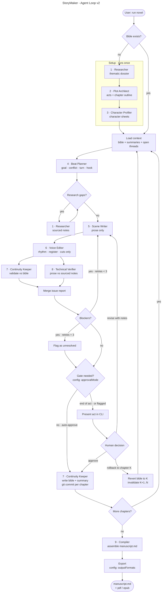

# ciberpunk-storymaker

Sistema agéntico que escribe novelas largas, capítulo a capítulo, con investigación web
y supervisión humana configurable. El género inicial es thriller tecnológico ciberpunk
de registro neo-noir.

El problema que resuelve no es la calidad de la prosa: es la **gestión de estado**. Un
modelo escribiendo treinta capítulos olvida lo que estableció en el tercero, inventa un
hermano y suaviza al villano. StoryMaker trata la novela como un proceso de larga
duración, con estado explícito en disco y puntos de control humanos.

El flujo está en [`docs/architecture/agent-loop.mmd`](docs/architecture/agent-loop.mmd) y
la especificación completa —inventario de agentes y skills, contrato de handoff, formato
del reporte de incidencias, inputs, outputs, reanudación, criterios de aceptación y
limitaciones— en [`docs/spec.md`](docs/spec.md).

> **Esta rama** (`refactor/subagentes-nativos`) usa a **Claude como orquestador**, con los
> nueve especialistas como subagentes nativos. La rama `main` conserva la variante con
> orquestador determinista en Node. Misma spec, mismo diagrama, mismas invariantes: cambia
> quién recorre el bucle. La comparación está en [`docs/spec.md` §17](docs/spec.md).

---

## El flujo



Fuente única del diagrama: [`docs/architecture/agent-loop.mmd`](docs/architecture/agent-loop.mmd).
El bloque de arriba es una copia literal de ese fichero. Verificado con el parser de
Mermaid: `flowchart-v2`, sin errores.

---

## Dónde entra el input y dónde sale el output

### Input — dos ficheros escritos a mano

El usuario no conversa con el sistema: lo configura y lo lanza. Antes de `START` existen
dos artefactos, y solo dos:

1. **El brief de la novela.** Premisa, tono, restricciones de la historia. Es lo que
   alimenta a `RES0` (dossier temático) y, a través de él, a `ARCH` y `PROF`. Se escribe
   una vez por novela.
2. **La configuración de la corrida.** Número de capítulos y actos, extensión, modo de
   supervisión, qué validaciones corren, topes de coste y de reescritura, formatos de
   salida. Es lo que leen `GATE` (`approvalMode`) y `EXPORT` (`outputFormats`).

El diagrama no cambia entre una prueba de tres capítulos y una novela completa. Lo que
cambia es el segundo fichero. Esa es la razón de que la configuración esté separada del
flujo y de los prompts.

### Output — tres momentos distintos

1. **Por capítulo aprobado**, en `COMMIT`: el texto del capítulo, su resumen, la biblia
   narrativa actualizada y un commit de git. El commit por capítulo no es una convención
   de estilo, es lo que hace viable el `ROLL`: revertir es un revert, no una
   reconstrucción.
2. **Al terminar los capítulos**, en `COMP`: `manuscript.md`, el manuscrito ensamblado.
   Markdown es el formato canónico.
3. **Al final**, en `EXPORT`: PDF y EPUB según configuración. Son derivados
   regenerables, y por eso el `.gitignore` los excluye.

### Dónde para el sistema y te pregunta

`GATE` es el único punto donde el bucle cede el control. Lee `approvalMode` y decide si
presenta el acto en la CLI o sigue solo. El humano puede aprobar, pedir revisión con
notas, o hacer rollback a un capítulo K. Las tres salidas están en el diagrama.

---

## Estructura del repositorio

```
README.md
CLAUDE.md                         quién es el orquestador y las reglas duras
docs/
  architecture/agent-loop.mmd     fuente única del flujo
  spec.md                         la especificación ejecutable
.claude/
  agents/                         los nueve especialistas, un subagente por fichero
  skills/<id>/SKILL.md            procedimientos compartidos por más de un agente
  commands/novela.md              el bucle
  hooks/                          las guardas que imponen las invariantes
  settings.json                   registro de hooks y permisos
genres/
  cyberpunk-thriller/             convenciones del pack + términos prohibidos
config/
  run.base.json                   todas las claves, valores de novela completa
  profiles/full-novel.json        overlay casi vacío: la novela completa es el caso base
  profiles/smoke-3ch.json         el delta de la prueba de 3 capítulos
novels/
  <slug>/                         estado de una novela concreta
    brief.md                      escrito a mano por el usuario
    bible/  chapters/  notes/  research/  out/  attic/
tools/
  check-invariants.mjs            valida el reparto de permisos sin correr nada
  config.js                       funde `run.base.json` con el overlay del perfil
  assemble-context.mjs            arma el contexto de cada nodo en un solo fichero
  dashboard.mjs                   servidor local del panel: estado, historial y arranque
  dashboard/                      el panel en sí (React + Vite); `dist/` no se versiona
```

Solo existen los directorios con contenido. `novels/<slug>/` se llena al correr.

### Por qué así

**Los tres ejes de crecimiento tienen un directorio cada uno.** Otros géneros van a
`genres/`; otras novelas a `novels/<slug>/`; otros formatos a `novels/<slug>/out/`.
Ninguno de los tres obliga a tocar los otros dos.

**`genres/` es dato, no código.** Un pack de género codifica convenciones —identidad
sintética, soberanía corporativa, la memoria como evidencia— y su lista de términos
prohibidos. Añadir un género es añadir un directorio, no editar el bucle.

**`novels/<slug>/` aísla el estado.** Cada novela lleva su biblia, sus capítulos, sus
notas y sus salidas. Es lo que permite que un rollback en una novela no toque a las
demás, y lo que hace que la reanudación de una corrida interrumpida sea una cuestión de
leer un directorio.

**`.claude/agents/` y `.claude/skills/` están separados a propósito.** `agents/` define
*quién es* cada rol; `skills/` recoge los procedimientos que comparten varios. La
distinción es fácil de dejar podrida —todo acaba duplicado en nueve prompts— y mantenerla
en el árbol de ficheros la hace visible. Si algo lo usa un solo agente, va en su prompt.

**El comportamiento vive en texto, no en código.** `.claude/`, `genres/` y `config/` son
ficheros editables, y no queda código que ejecutar para correr el bucle. `tools/` se
reduce a dos utilidades: validar permisos y fundir la configuración.

---

## Invariantes

El diseño se apoya en nueve invariantes. Las dos que más condicionan la estructura:

- **Una sola fuente de verdad.** La biblia narrativa contiene el canon. Si no está ahí,
  no es canon.
- **Un solo escritor del estado.** Solo `Continuity Keeper` escribe en la biblia, y solo
  después de aprobación. Todos los demás leen.

La lista completa está en [`docs/spec.md`](docs/spec.md#0-las-nueve-invariantes), y cada
sección de la spec señala cuál hace cumplir. Las desviaciones respecto al diagrama están
recogidas, sin disimular, en
[`docs/spec.md §16`](docs/spec.md#16-desviaciones-respecto-al-diagrama-y-a-las-invariantes).

---

## Cómo se configura una corrida

Un cambio de comportamiento no toca la spec ni los prompts: toca un JSON.
`config/run.base.json` tiene todas las claves con los valores de novela completa, y un
perfil de `config/profiles/` solo lleva las que cambia. El delta entre «prueba pequeña» y
«novela completa» es, por tanto, el contenido literal de
[`config/profiles/smoke-3ch.json`](config/profiles/smoke-3ch.json).

La prueba objetivo —3 capítulos de 3 o 4 párrafos sobre
[`novels/neon-smoke/`](novels/neon-smoke/brief.md)— está configurada y lista para correr,
con `dryRun` activado: primero se verifica el bucle vacío, y solo después se gasta en
llamadas reales. Si el bucle falla vacío, falla gratis. El razonamiento de qué se apaga en
esa prueba, y por qué, está en
[`docs/spec.md §13`](docs/spec.md#13-perfil-de-prueba--3-capítulos).

---

## Cómo se lanza

Esta rama usa a **Claude como orquestador**. No hay comando de shell que arranque el
bucle: se abre Claude Code en el repositorio y se escribe

```
/novela smoke-3ch
```

`.claude/commands/novela.md` lleva el recorrido del diagrama. Los nueve especialistas son
subagentes de [`.claude/agents/`](.claude/agents/) y los procedimientos compartidos, skills
de [`.claude/skills/`](.claude/skills/). Todo es texto editable: cambiar el sistema es
editar un `.md`.

```bash
npm run invariantes          # valida el reparto de permisos sin correr nada
npm run config smoke-3ch     # imprime la configuración fundida
```

### El panel

Hay un panel local para lanzar corridas, seguir el bucle, responder compuertas y leer lo
que ya se ha escrito. Escucha solo en `127.0.0.1` a propósito: este proceso puede arrancar
corridas, así que no se expone.

```bash
npm install                  # la primera vez
npm run panel                # construye el panel y lo sirve en http://127.0.0.1:4173
```

Tres pestañas: **Corrida** (arranque, compuerta y monitor del bucle), **Historial** (todas
las novelas de `novels/`, terminadas o no) y el detalle de una novela, con sus capítulos,
el resumen que `continuity-keeper` dejó en la biblia y el texto.

El panel se compila con Vite y el build no se versiona, así que `npm run panel` lo
construye antes de servir. Para trabajar en la interfaz con recarga en caliente:

```bash
npm run panel:serve          # el servidor, en una terminal
npm run panel:dev            # Vite en :5173, con /api hacia el servidor, en otra
```

### Permisos

Cada subagente declara sus herramientas en su frontmatter, y solo `researcher` tiene
`WebSearch`. Pero el prompt de un agente no es una garantía: es una petición. Lo que
manda son tres hooks de `PreToolUse`, que corren **fuera** del modelo y no se pueden
persuadir:

- Ninguna escritura bajo `bible/` que no venga de `continuity-keeper`.
- Ninguna escritura fuera de las rutas de [`ownership.json`](.claude/hooks/ownership.json).
- Ninguna búsqueda web que no venga de `researcher` — el orquestador incluido.
- Ningún término prohibido en disco, y ninguna edición de voz más larga que su borrador.
- Ningún ciclo que gire pasado su tope.

No hay control de gasto: nada aborta una corrida por consumo.

---

## Estado

- [x] **Commit 1** — Diagrama, estructura y README.
- [x] **Commit 2** — Especificación y configuración.
- [x] **Commit 3** — Harness determinista (rama `main`), verificado en seco.
- [ ] **Refactor** — Claude como orquestador y subagentes nativos (esta rama). Falta la corrida real.
