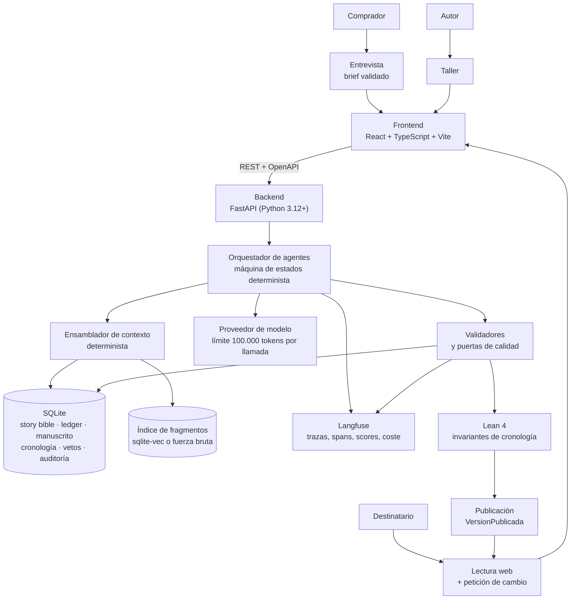
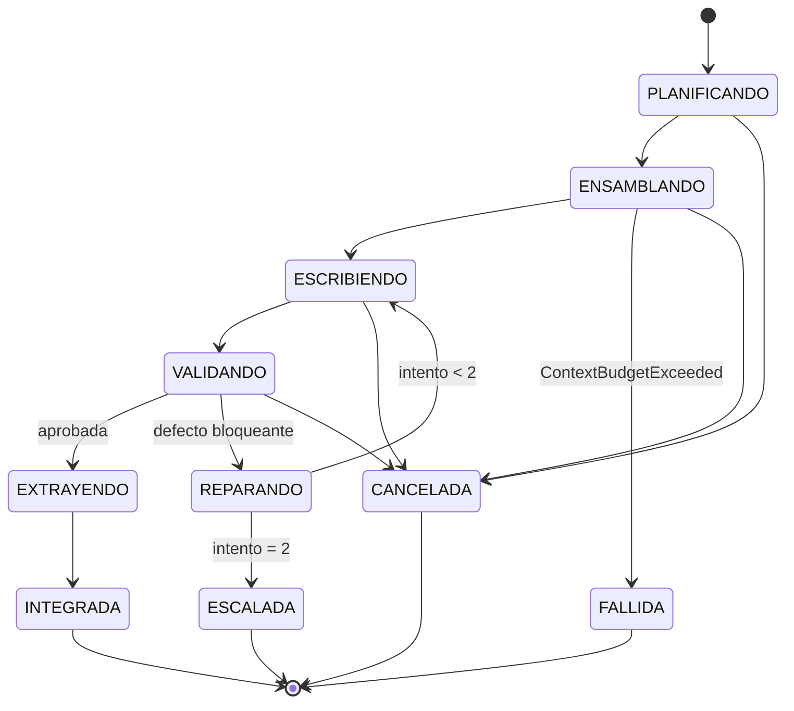
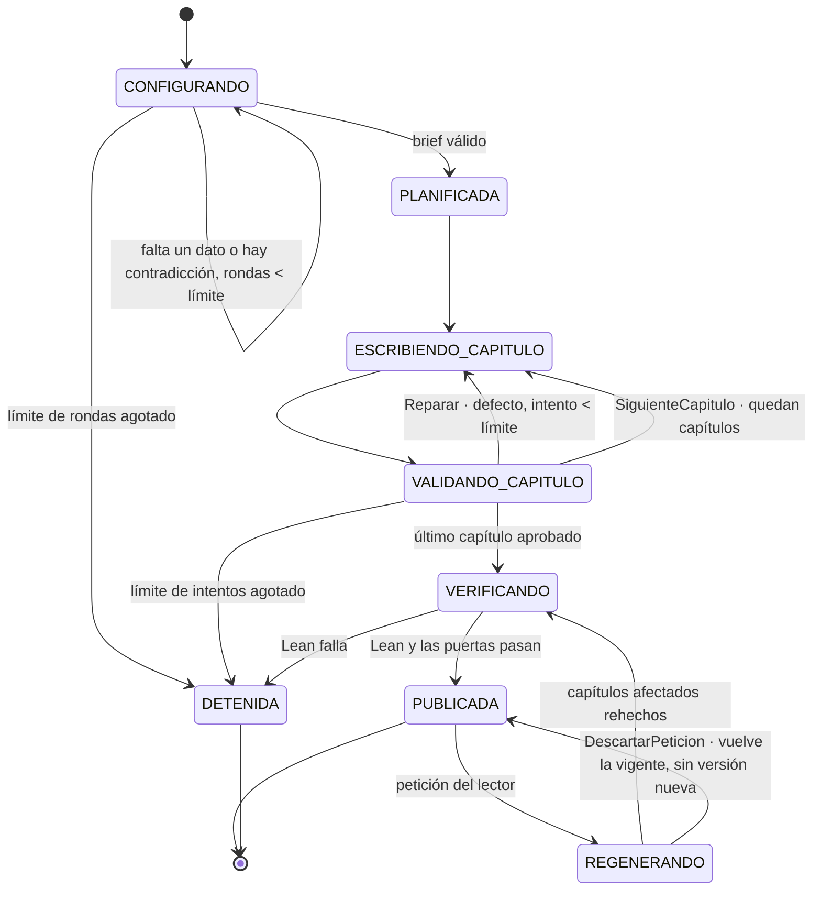
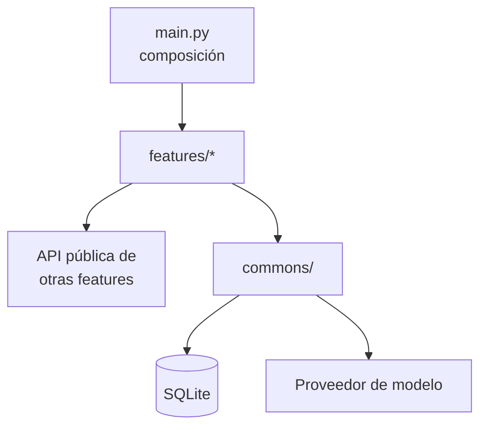
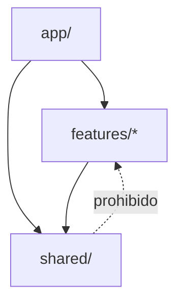
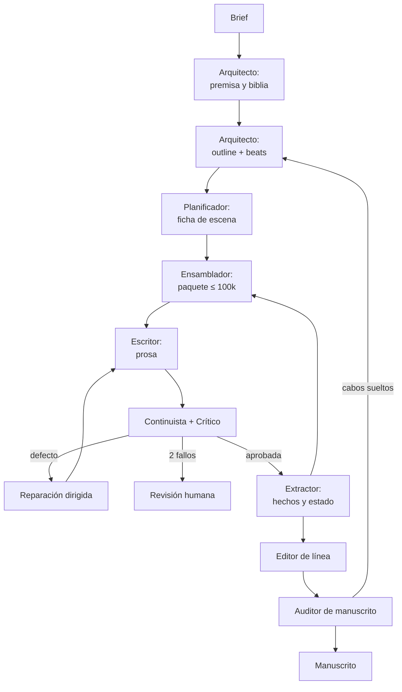
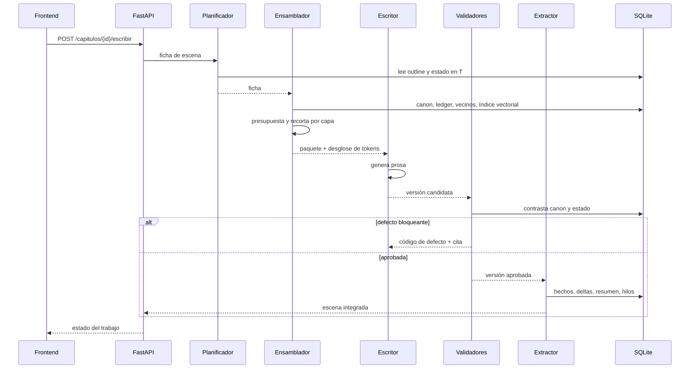

# Arquitectura del sistema

**Versión:** 2.0 · **Fecha:** 2026-09-23

Este documento describe **cómo se construye** el sistema. El **qué significa cada término** vive en [`definitions.md`](definitions.md); el **cómo funciona una novela** vive en [`domain-knowledge.md`](domain-knowledge.md). Si un concepto aparece aquí sin definir, está definido allí.

> **Nota de reorganización.** Este fichero recoge todo el material que estaba mezclado en `definitions.md` y `domain-knowledge.md` y que no era ni definición ni conocimiento de dominio: presupuestos de tokens, capas de contexto como mecanismo, roles de agente, almacenes, pipeline, puertas de calidad, política de reintentos y trazabilidad. El listado exacto de secciones a eliminar de los otros dos ficheros está en el §14.

---

## 1. Visión general

Sistema cliente-servidor con **tres usuarios distintos**, y conviene separarlos porque quieren cosas distintas:

| Quién | Qué hace | Por dónde entra |
| --- | --- | --- |
| **Comprador** | Encarga la novela y responde la entrevista | Entrevista |
| **Destinatario** | La lee, y puede pedir cambios sobre lo que lee | Lectura web |
| **Autor** | Dirige la obra, resuelve escalados, revisa el manuscrito, puntúa la rúbrica | Taller |

El frontend es una SPA de React; el backend en FastAPI orquesta los agentes, ensambla el contexto, valida y persiste en SQLite.



**Principio de diseño:** el ensamblado de contexto es **código, no modelo**. Es lo único que garantiza que un fallo se pueda reproducir.

**Segundo principio, propio de este producto:** *el sistema no optimiza por que los datos aparezcan.* Una novela que menciona al destinatario quince veces y no se sostiene como historia ha fallado igual que una impecable en la que no está. Por eso hay **dos familias de validadores que se miden por separado** (§8.3) y ninguna rescata a la otra.

---

## 2. Stack y restricciones

**El stack es fijo.** Y la columna de origen no es burocracia: separa lo que **impone el encargo** de lo que **elegimos nosotros**, porque lo primero no se puede negociar ni reinterpretar y lo segundo sí. Confundirlos es lo que produjo el error que corrige §2.2.

| Capa | Tecnología | Origen | Restricción derivada |
| --- | --- | --- | --- |
| Frontend | React 19 + TypeScript + Vite | **Nuestro** | El encargo §2 dice «web o PDF» y **no nombra ninguna tecnología de frontend**. Elegir web, y elegir React, fue decisión de `maujimenez4` |
| Backend | FastAPI, Python 3.12+, Pydantic v2 | **Nuestro**, presupuesto por el encargo | Async por defecto; OpenAPI como contrato. El encargo lo menciona **una vez y en una sección opcional** —«el FastAPI que ya tienen»—: da por hecho que existe, no lo exige |
| Persistencia | **SQLite (WAL) + Alembic** | **Encargo §4, literal** | «Story bible en SQLite (obligatorio)». **Una sola base y un solo motor**; ninguna obra vive en un fichero aparte (`specs/001-backend-v1/spec.md`, P-07) |
| Búsqueda por afinidad de vectores | `sqlite-vec` si carga; si no, fuerza bruta con NumPy | **Nuestro** | El encargo **no menciona vectores en ninguna parte**. El sistema nunca falla por falta de la extensión |
| Modelo | **Dos techos de 100.000 tokens**: uno por llamada y otro sobre la suma en vuelo | El segundo, **encargo §7, literal**; el primero, nuestro | Presupuesto por capa; fallo explícito, nunca truncado silencioso. Ver §2.1 y §2.2 |
| Modelo | **Anthropic**, consumo de cuenta **sin clave de API**. **Haiku 4.5 en todos los roles** desde el 2026-09-24 | **Nuestro** | Escritor y juez **comparten modelo**, por coste: ~1,5 USD por novela frente a ~8,8. Lo que eso reabre esta en §8.3 y en la decision P-02 de la spec. Sin cargo por llamada, el coste de §9.2 es **derivado**, no facturado |
| Observabilidad | **Langfuse** | **Encargo §6** | Una sesión por novela; cada rol y cada tool, un span; validadores como *scores* (§9) |
| Verificación formal | **Lean 4** sobre la cronología; **TLA+/TLC** sobre el harness | **Encargo §5c y §5d** | Lean corre en cada publicación y bloquea; TLC corre en desarrollo (§9.3) |
| Guardarraíles | Vetos en SQLite + registro de auditoría | **Encargo §7** | Se aplican **en código** sobre cada capítulo, antes de aceptarlo (§11) |

**Que algo sea nuestro no lo hace negociable sobre la marcha:** las cuatro decisiones propias están tomadas y se cambian con la misma ceremonia que cualquier otra. Lo que cambia es **quién puede cambiarlas**. Una fila del encargo no la mueve este equipo.

**Sobre la extensión vectorial, para que no se lea como una exigencia externa.** El encargo obliga a SQLite y no dice nada de vectores. Mantener `VectorStore` con dos implementaciones es una decisión de este proyecto: el coste es una interfaz y una suite que corre en dos modos; a cambio, el sistema arranca en una máquina sin la extensión. **Si algún día ese coste deja de pagarse, se retira el camino vectorial y no se incumple nada.**

### 2.1 Presupuesto de contexto

| Capa del paquete | Tope (tokens) | Qué se recorta primero |
| --- | --- | --- |
| Constitucional | 5.000 | No se recorta |
| Estructural | 10.000 | Detalle de beats lejanos |
| Canon relevante | 20.000 | Personajes mencionados, no presentes |
| Estado en T | 15.000 | Conocimientos antiguos ya usados |
| Continuidad local | 20.000 | Escena N-2 antes que N-1 |
| Memoria recuperada | 10.000 | Resultados de menor puntuación |
| Instrucción | 10.000 | No se recorta |
| Reserva | 10.000 | Reservado para reintento con defecto |

Reglas de implementación:

1. El contador de tokens es una **dependencia inyectada**, no una estimación por caracteres.
2. El recorte es **por capa**: si se pasa una, se recorta esa, no las demás.
3. Si tras recortar no cabe, se lanza `ContextBudgetExceeded`. Nunca se trunca por el final.
4. El ensamblador devuelve el desglose por capa junto al paquete, y se guarda en `ejecucion`.
5. La reserva del 10 % garantiza que el reintento con el defecto añadido siga cabiendo.

### 2.2 Llamadas simultáneas

**Hay dos techos de tokens, no uno, y el segundo lo impone el encargo.**

| Techo | Valor | Sobre qué se mide | Origen | Quién lo aplica |
| --- | --- | --- | --- | --- |
| **Por llamada** | 100.000 | El paquete de **una** llamada | Nuestro (§2.1) | Ensamblador, al construir el paquete |
| **Concurrente** | 100.000 | La **suma** de las llamadas en vuelo | **Encargo §7, literal** | Orquestador, antes de dar turno |

Y el límite de concurrencia, contado en llamadas y no en tokens:

| Límite | Valor | Quién lo aplica |
| --- | --- | --- |
| Llamadas al modelo en vuelo | **Varias por proceso**, acotadas por el techo concurrente de arriba | Orquestador, antes de dar turno a cada llamada |
| Escenas en vuelo por obra | 1 | Orquestador (§3.1, punto 4) |

**Por qué esto cambia, y qué decía antes.** Hasta hoy esta sección afirmaba que los 100.000 eran «el techo **de una llamada**, y el único techo de tokens del sistema», y que **no había presupuesto agregado** porque sumar tokens de llamadas distintas no acota nada que no acote ya un límite de concurrencia. Como razonamiento de ingeniería sigue siendo defendible. Como lectura del encargo era **incorrecta**: el encargo §7 dice literalmente «uso de un máximo de 100.000 tokens **concurrentes**», y concurrente es una suma. Cambiamos su palabra por la nuestra y después razonamos sobre la nuestra.

**Y lo grave no es el cambio de palabra: es por qué no se notaba.** Con la concurrencia en **1**, las dos lecturas dan el mismo número —la suma de lo que hay en vuelo *es* esa única llamada—, así que el sistema cumple el encargo **por consecuencia y no por regla**. Nada cuenta la suma. Subir la concurrencia a dos incumpliría el encargo **sin que fallara nada**: es una invariante sostenida por una ausencia, igual que las que `verification.md` §5 obliga a reabrir antes de conceder el permiso, no después.

Por eso el techo concurrente se aplica **aunque hoy sea trivial**: para que el día que la concurrencia suba, el que falle sea el sistema y no la entrega.

Reglas de implementación:

1. **El techo concurrente se hace cumplir esperando, no recortando.** Si admitir una llamada haría que la suma en vuelo pasara de 100.000, esa llamada **espera turno**. Nunca se recorta el paquete para hacerla caber: recortar obedece a §2.1, no a la carga del sistema.
2. Si no hay turno, la llamada espera. La espera tiene *timeout*; si vence, el trabajo pasa a `FALLIDA` con causa `TiempoAgotado` (§3.6).
3. Los dos techos son **por proceso**, y por eso en modo servidor los trabajos corren en el proceso de la API (§10). Repartirlos en un *worker* aparte duplicaría los dos en silencio, que es la forma más barata de incumplir el encargo sin enterarse.
4. El límite de tasa del proveedor es un techo distinto y externo. Si el proveedor rechaza por tasa, es fallo de proveedor (§3.6).
5. La reserva del 10 % de §2.1 protege el reintento **dentro** de una llamada; estos techos protegen la latencia y la factura **del proceso**. Son independientes y se aplican a la vez.

**Lo que estos límites no acotan:** el coste total de una novela. Sigue siendo un riesgo abierto (§12).

### 2.3 Qué paraleliza de verdad el techo sumado

**Decisión de `maujimenez4`, 2026-09-23 (P-06): se permite el paralelismo dentro del techo.** Varias llamadas a la vez mientras la suma de sus paquetes no pase de 100.000. El turno lo da el orquestador contando tokens, no llamadas.

**Y conviene escribir qué no acelera, porque es contraintuitivo.** Los diez capítulos de una novela **siguen siendo estrictamente secuenciales**, y no por el límite de concurrencia: por `CU-03`, que exige como precondición que el capítulo anterior esté **integrado**. El capítulo 5 necesita el canon, el ledger y el resumen que produce el 4. Ningún techo de tokens cambia eso.

Lo que el paralelismo compra es otra cosa, y es real:

| Qué se solapa | Por qué se puede | Qué gana |
| --- | --- | --- |
| **Varias obras a la vez** | No comparten canon ni ledger; son ficheros SQLite distintos | El rendimiento del sistema, que es lo que escala |
| **Continuista y Crítico sobre el mismo capítulo** | Reciben la misma prosa, no se leen entre sí y escriben resultados distintos (§9.2) | Latencia de la puerta de validación, en cada capítulo |
| **Los cinco briefs de evaluación** | Son cinco obras independientes | La corrida de `RF-EVA-01` deja de ser cinco novelas en fila |

**Dicho con precisión: el paralelismo no acorta la novela, le quita una espera por capítulo.** El Continuista y el Crítico corren una vez por capítulo, así que solaparlos ahorra diez esperas de validación —no es cero—, pero no toca la cadena de diez pasos ni el bucle de reparación. Quien espere de esta decisión que una novela salga en la mitad de tiempo se va a llevar una sorpresa, y por eso está aquí y no en una nota al pie.

**Lo que esto reabre, y hay que mirarlo ahora y no después.** Con más de una llamada viva dejan de ser gratis tres cosas que con el turno único lo eran: el cerrojo de escritura por obra (§3.7), la atribución de un fallo a la llamada que lo causó, y la reproducción de una corrida. La primera ya estaba resuelta —las escrituras se serializan por obra— y las otras dos se apoyan en `run_id`, que es por llamada y no por proceso. Ninguna se rompe, pero ninguna vuelve a ser cierta *por construcción*.

---

## 3. Orquestación

**Decisión:** el orquestador es **código determinista**, una máquina de estados explícita. No hay ningún agente que decida cuál es el siguiente paso.

El motivo es el mismo que sostiene el ensamblador determinista: si quien decide el orden es un modelo, un fallo no se puede reproducir ni atribuir. Un orquestador en código se prueba sin llamar al proveedor, y su traza es una tabla, no una conversación.

### 3.1 Principios

1. **Topología en estrella.** Ningún agente llama a otro. El orquestador invoca a uno, recibe su salida, la persiste y decide el siguiente. Una cadena de agentes que se invocan entre sí hace imposible saber quién introdujo un defecto.
2. **El estado vive en SQLite**, nunca en memoria del proceso. Una caída a mitad de escena no pierde trabajo: al arrancar, el orquestador lee los trabajos vivos y continúa.
3. **Idempotencia por `run_id`.** Repetir un paso con el mismo `run_id` no duplica escrituras. Es lo que permite reintentar sin miedo tras un fallo de red.
4. **Una escena en vuelo por obra.** La escena N+1 necesita el estado en T posterior a N. Paralelizar escenas de la misma obra no es arriesgado: es incorrecto.
5. **Permiso mínimo por agente.** Cada agente recibe exactamente los almacenes que su rol necesita, ni uno más (§3.5).

### 3.2 La unidad de trabajo

Todo lo que dura más que una petición HTTP es un **trabajo** persistido. El endpoint crea el trabajo y devuelve su identificador; el cliente consulta `GET /trabajos/{id}`.

| Campo | Para qué |
| --- | --- |
| `id` | Identificador del trabajo, el que consulta el frontend |
| `obra_id`, `escena_id` | A qué se aplica; `escena_id` es nulo en trabajos de manuscrito |
| `tipo` | `escribir_escena`, `auditar_manuscrito`, `replanificar_capitulo` |
| `estado` | Uno de los de §3.3 |
| `intento` | Número de reparación dirigida consumida (máximo 2) |
| `run_id` | Correlaciona todas las ejecuciones del trabajo; es la clave de idempotencia |
| `causa_fallo` | Código de §3.6 cuando el estado es `FALLIDA` o `ESCALADA` |
| `creado_en`, `actualizado_en` | Latencia por fase y detección de trabajos colgados |

Cada llamada al modelo dentro del trabajo genera además una fila en `ejecucion` (§9), con su desglose de tokens.

### 3.3 Estados y transiciones



| Estado | Qué está pasando | Salida normal | ¿Reanudable tras caída? |
| --- | --- | --- | --- |
| `PLANIFICANDO` | El Planificador produce la ficha de escena | `ENSAMBLANDO` | Sí, se repite el paso |
| `ENSAMBLANDO` | El Ensamblador construye el paquete y lo presupuesta | `ESCRIBIENDO` | Sí, es determinista: mismo estado, mismo paquete |
| `ESCRIBIENDO` | El Escritor genera prosa | `VALIDANDO` | Sí, pero **cuesta**: se repite la llamada al modelo |
| `VALIDANDO` | Se pasan las puertas G1a y, cuando exista, G1b (§8.3) | `EXTRAYENDO` o `REPARANDO` | Sí, sobre la versión ya guardada |
| `REPARANDO` | Se prepara el reintento con el defecto y su cita | `ESCRIBIENDO` o `ESCALADA` | Sí |
| `EXTRAYENDO` | El Extractor escribe canon, ledger, resúmenes e hilos | `INTEGRADA` | Sí, por idempotencia del `run_id` |
| `INTEGRADA` | La escena forma parte del manuscrito | — | Terminal |
| `ESCALADA` | Dos reparaciones agotadas; espera decisión humana | — | Terminal hasta que el autor actúe |
| `FALLIDA` | Error técnico, no de calidad | — | Terminal; se relanza como trabajo nuevo |
| `CANCELADA` | El autor abortó | — | Terminal |

Ningún estado se salta: `VALIDANDO` no puede llegar a `INTEGRADA` sin pasar por `EXTRAYENDO`, porque es el Extractor quien deja rastro en la memoria de largo plazo (§4.4).

### 3.4 Contrato entre pasos

- Cada paso recibe un modelo Pydantic y devuelve otro. El orquestador no pasa objetos vivos entre pasos: **persiste la salida y vuelve a leerla**. Es lo que hace que reanudar sea idéntico a ejecutar.
- Ningún paso escribe fuera de lo que su contrato declara. La escritura a canon y ledger es exclusiva del paso `EXTRAYENDO`.
- Un paso que llama al modelo recibe también el desglose de tokens y lo devuelve en su salida, para `ejecucion` (§9).

### 3.5 Permisos por agente

Cada agente recibe exactamente los almacenes que su rol necesita. Lo que no aparece en su fila, no lo puede tocar.

| Agente | Lectura | Escritura | Llama al modelo |
| --- | --- | --- | --- |
| **Entrevistador** | Respuestas del comprador y su `TextoAportado` | Brief, destinatario, vetos | Sí |
| Arquitecto | Brief | Biblia, outline | Sí |
| Planificador | Outline, estado en T, hilos | Ficha de escena | Sí |
| Ensamblador | Canon, ledger, manuscrito, índice vectorial | Nada | No |
| Escritor | **Solo el paquete recibido** | Versión de texto | Sí |
| Continuista | Canon, prosa nueva | Defectos | Sí |
| Crítico | Prosa, rúbrica | Puntuaciones | Sí |
| Editor de línea | Prosa aprobada, lista negra de n-gramas | Versión pulida | Sí |
| Extractor | Prosa aprobada | Canon, ledger, resúmenes, hilos | Sí |
| Auditor | Todo en lectura | Informe | Sí |

**Regla clave:** el Escritor **nunca** accede a la base de datos. Si le falta un dato, es un fallo del ensamblado, no del escritor. Esto hace que los defectos sean atribuibles.

**Segunda regla clave, nueva con el Entrevistador:** es el **único agente cuya entrada no controla el sistema**. Todo lo que recibe viene de una persona, incluido el `TextoAportado` que el comprador pega. Por eso su salida **se valida con esquema antes de persistirse**, y el texto pegado entra al sistema marcado como dato y **nunca concatenado a un prompt** sin esa marca. La defensa contra que alguien escriba «ignora tus instrucciones» en una anécdota **no es pedirle al modelo que no haga caso** —eso es negociar con el atacante—: es que ese texto no llegue nunca a la posición donde una instrucción se obedece.

Los agentes tampoco leen ni escriben ficheros del repositorio: el paquete llega como datos y la salida vuelve como datos. Los prompts los carga el orquestador, no el agente.

### 3.5.1 Ningún agente recibe una herramienta, y el validador visual tampoco es una excepción

**Los diez agentes narrativos no reciben ninguna herramienta.** Ni fichero, ni red, ni proceso. Es la
propiedad que permite decir que el radio de impacto está **eliminado** y no contenido: no hay
*sandbox* porque no hay nada que aislar (`verification.md` §3).

El encargo §5a pide un validador que **abra la novela en un navegador** y compruebe que el índice, la
ficha y la portada renderizan. Parece que eso concede una herramienta a un agente. **No lo hace**, y
la distinción importa lo bastante como para escribirla:

| | |
| --- | --- |
| Qué es | **Código que conduce un navegador**, como el Ensamblador es código que ensambla (§3.1) |
| Qué **no** es | Un agente. No recibe prompt, no llama al modelo, no decide nada |
| Cuándo corre | En la puerta **G4**, sobre la lectura ya publicada |
| Qué toca | La lectura, por HTTP. Nada más: ni ficheros, ni base de datos, ni manuscrito |
| Qué produce | Defectos `REN-01` y su *score* en Langfuse, como cualquier otro validador |

**Por qué no basta con decir «es un validador» y seguir.** Un navegador es una herramienta con acceso
de red, y `verification.md` §5 advierte de que las filas «Aplicado por diseño» **dejan de ser ciertas
el día que un agente recibe acceso de fichero o de red**, y hay que reabrirlas *antes* de conceder el
permiso. Esta sección es esa reapertura, y su conclusión es que **no hay permiso que conceder**: el
navegador lo conduce código determinista, no un agente con criterio propio. La frase de arriba sigue
siendo cierta palabra por palabra.

**Y hay un segundo navegador, que es de otro sujeto.** El encargo pide además un servidor MCP de
inspección en `.claude/mcp.json` «de forma que **Claude Code** pueda abrir la lectura y verificar el
resultado visualmente». Ese es el **agente de código**, no un agente narrativo, y es el segundo sujeto
de `verification.md` §1 — que ya vive sin *sandbox*, leyendo y escribiendo ficheros. Añadirle un
navegador **no invalida ninguna fila**: la extiende, y lo que hay que decir es que ahora también tiene
red.

Los dos navegadores son cosas distintas y conviene no fundirlos: uno valida en producción y su
resultado bloquea; el otro lo usa quien desarrolla, y su resultado es una observación.

### 3.6 Fallos y qué hace el orquestador

| Causa | Qué es | Acción |
| --- | --- | --- |
| `FalloDeProveedor` | Error de red, 5xx, límite de tasa | Reintento con espera creciente, hasta 3. Después, `FALLIDA` |
| `ContextBudgetExceeded` | El paquete no cabe ni tras recortar (§2.1) | `FALLIDA` inmediata, sin llamar al modelo. Es un fallo de diseño del ensamblado, no de ejecución |
| `DefectoBloqueante` | El Continuista o el Crítico rechazan | `REPARANDO`, hasta dos veces; luego `ESCALADA` |
| `TiempoAgotado` | Un paso supera su plazo, o la espera de turno de §2.2 vence | `FALLIDA`, con el paso anotado. Si no se llegó a llamar, es relanzable sin coste |
| `ProcesoInterrumpido` | El proceso murió: ni terminó, ni falló el proveedor, ni venció el plazo. Lo detecta la reanudación al encontrar un trabajo vivo sin proceso detrás | `FALLIDA`, y el capítulo se relanza como trabajo nuevo (§3.7). **Tiene flecha desde los diez estados vivos**, porque una caída no elige dónde te pilla |
| `Cancelacion` | Petición del autor | `CANCELADA` en el primer punto seguro |

Un defecto de calidad **no** es un fallo técnico: `ESCALADA` y `FALLIDA` son estados distintos a propósito, y se cuentan por separado en las métricas de §9.

**`ProcesoInterrumpido` entró el 2026-09-24, y hasta entonces la reanudación usaba `TiempoAgotado` por descarte** (P-12): era la única averia con flecha desde cualquier estado vivo, porque `Cancelacion` no la tiene desde `REPARANDO` ni `EXTRAYENDO`. Daba igual mientras nadie leyera las trazas; con la observabilidad de §9 deja de dar igual, porque **una novela que se cayó aparecióa como una que agotó su plazo** y las dos se arreglan mirando sitios distintos.

### 3.7 Reanudación

Al arrancar, el orquestador busca trabajos en estado no terminal y **relanza su capítulo como trabajo nuevo**. Un paso interrumpido se **repite entero**, nunca se reanuda a medias.

**Relanza, no retoma, y la corrección es de este documento** *(2026-09-24)*. Hasta hoy esta sección decía «los retoma desde su último estado persistido», y §3.3 dice de un `FALLIDA` que «se relanza como trabajo nuevo»: **las dos frases no podían ser ciertas a la vez**. Gana §3.3, porque es lo único implementable con el ciclo que hay: `ejecutar_ciclo` es una sola función que recorre la máquina de `PLANIFICANDO` a `INTEGRADA`, así que volver a entrar con un trabajo que quedó en `VALIDANDO` **no lo retoma — lo empuja por transiciones que no son las suyas** hasta que la máquina se niega. Retomar de verdad exigiría partir el ciclo en pasos direccionables, que es un refactor y no un detalle.

**Lo que la garantía necesita sigue en pie**, y es la frase siguiente: un paso interrumpido se repite entero. El trabajo muerto se cierra, la prosa que dejó sin confirmar se retira, y las reparaciones ya gastadas **se heredan** al relanzar — si no, una caída regalaría dos intentos.

**Son seis los estados no terminales**, no nueve: de los diez de §3.3, cuatro son terminales. `CA-5` se prueba matando el proceso en cada uno de los seis.

El único paso caro de repetir es `ESCRIBIENDO`, porque vuelve a pagar la llamada al modelo. Se acepta a cambio de no tener que razonar sobre respuestas parciales.

### 3.8 Concurrencia

- **Una escena en vuelo por obra.** Es una restricción de corrección, no de rendimiento (§3.1, punto 4).
- **Varias obras pueden estar en curso a la vez, y sus llamadas al modelo pueden solaparse** mientras la suma de sus paquetes quepa en el techo concurrente de §2.2. El paralelismo entre obras es de trabajo **y de llamadas**; el que no existe es el paralelismo entre capítulos de una misma obra, que `CU-03` impide por precondición (§2.3).
- **Lo único que paraleliza de verdad es lo que no consume presupuesto de contexto:** ensamblado, lectura de almacenes, persistencia y cálculo de embeddings. La auditoría por lotes y la revisión de escenas ya aprobadas sí llaman al modelo, así que pasan por la misma cola.
- **Las escrituras se serializan por obra.** SQLite con WAL admite lectores concurrentes y un solo escritor; el orquestador respeta eso con un cerrojo por obra en vez de confiar en `busy_timeout` para resolver colisiones.

### 3.9 La máquina de estados de la **novela**

El §3.3 describe el ciclo de **una escena**. Por encima hay una segunda máquina, la de la
novela entera, y es la que se verifica formalmente con TLA+ (§9.3): sus estados son los que el
modelo explora.



| Estado | Qué está pasando | Checkpoint |
| --- | --- | --- |
| `CONFIGURANDO` | El Entrevistador recoge datos, detecta faltantes y contradicciones. **Con límite de rondas** | El brief parcial se persiste |
| `PLANIFICADA` | Existe biblia y outline de diez capítulos | — |
| `ESCRIBIENDO_CAPITULO` | Ciclo de escena del §3.3 para el capítulo N | — |
| `VALIDANDO_CAPITULO` | Puertas mecánicas, guardarraíles y juez | — |
| `VERIFICANDO` | Lean sobre la cronología completa (§9.3) | — |
| `PUBLICADA` | Existe una `VersionPublicada` inmutable | — |
| `REGENERANDO` | Se rehacen los capítulos afectados por una `PeticionDeCambio` | La versión anterior **no se toca** |
| `DETENIDA` | Se agotó el límite o falló la verificación. **Se informa** | Terminal |

**El bucle de `CONFIGURANDO` lleva límite, y esto cambia el 2026-09-24.** Hasta hoy la flecha a sí mismo no tenía cota: un comprador que siguiera dando respuestas contradictorias se quedaba preguntando para siempre.

**Por qué se cierra en el documento y no como hipótesis del modelo.** El encargo §5d pide una propiedad de *liveness*: «toda generación termina publicando una versión o detenléndose con error; **nunca queda en bucle infinito**». Esa es una propiedad **del sistema**, no del modelo. Acotar el bucle solo dentro del `.tla` haría que TLC demostrara la propiedad sobre un modelo que difiere de producción **justo donde la propiedad podría fallar** — y eso es de la misma familia que un validador que pasa porque no hay nada que mirar.

**Y el patrón ya existía en esta misma máquina:** `VALIDANDO_CAPITULO → DETENIDA` cuando se agota el límite de intentos. Un capitulo que no sale a la tercera se detiene y se informa; una entrevista que no cierra tampoco debería seguir preguntando indefinidamente. La flecha nueva es la misma decisión aplicada un nivel más arriba.

**Lo que esto deja pendiente y no se toca aquí:** `specs/001-backend-v1/spec.md` no tiene requisito para ese límite —`CU-01` dice «se vuelve a preguntar» sin cota— y la spec está firmada. **Necesita un requisito y una firma**, y hasta entonces esta flecha describe una decisión de arquitectura que el código todavía no implementa. Está dicho porque `CLAUDE.md` §3.3 prohíbe que `docs/` describa lo que no existe, y esta línea es la excepción declarada, no una omisión.

**Tres pares de flechas que parecen una y son dos**, y conviene fijarlo aquí porque quien escriba
la especificación de §9.3 las va a encontrar:

| Acción | Qué hace | Toca el contador de intentos |
| --- | --- | --- |
| `Reparar` | Rehace **el mismo** capítulo con el defecto y su cita | **Sí, lo incrementa** |
| `SiguienteCapitulo` | Pasa al capítulo N+1, que aún no se ha escrito | **No.** Cada capítulo empieza con su propio contador |
| `DescartarPeticion` | La regeneración no prospera: **vuelve la versión vigente** | No |

Las dos primeras salen de `VALIDANDO_CAPITULO` hacia `ESCRIBIENDO_CAPITULO` y **no son la misma
acción**. Modelarlas como una sola tiene una consecuencia concreta y absurda: avanzar de capítulo
consumiría reintentos, y una novela de diez capítulos se detendría sola por agotamiento sin que
hubiera fallado nada.

La tercera **no es una publicación**: es un regreso. No crea `VersionPublicada` y no toca la
vigente. Comparte destino con el éxito porque el estado del sistema acaba siendo el mismo —hay una
versión publicada y es la de antes—, pero el camino y sus consecuencias son opuestos.

**Checkpoint por capítulo.** Al integrar un capítulo se persiste el avance, de modo que una caída
reanuda desde **el último capítulo completado** y no desde el principio. La propiedad que esto
tiene que cumplir —y que TLC comprueba— es que **la reanudación no duplica ni pierde capítulos**:
se apoya en la misma idempotencia por `run_id` del §3.1.

**Tres cosas que esta máquina garantiza por construcción, y que son invariantes de §9.3:**

1. **Ninguna `VersionPublicada` se crea sin haber pasado por `VERIFICANDO`.** Enunciada sobre la
   creación de la versión y no sobre el estado de destino, porque `DescartarPeticion` **llega a
   `PUBLICADA` sin crear nada**: devuelve la vigente. Una invariante escrita sobre el estado —«no
   se alcanza `PUBLICADA` sin pasar por `VERIFICANDO`»— es falsa en el primer paso, y el peligro no
   es que TLC saque contraejemplo: es que alguien la relaje para que pase y acabemos con una
   invariante que dice algo distinto de lo que este documento promete. **Publicar es afirmar que
   pasó las puertas**, no que se escribió.
2. `REGENERANDO` **no escribe sobre la `VersionPublicada` vigente**: produce otra, o ninguna.
3. El contador de intentos solo crece, y al alcanzar el límite la única salida es `DETENIDA`.
   No hay ciclo que lo reinicie.

### 3.10 Dónde vive el código

| Pieza | Sitio |
| --- | --- |
| **Motor de la máquina de estados** | `features/escritura/maquina.py` |
| Cerrojos y reserva de tokens | `commons/jobs/` |
| Pasos del ciclo de escena | `features/escritura/service.py` |
| Contador de tokens y cliente de modelo | `commons/llm/` |
| Definición de los agentes y sus prompts | `features/<feature>/agents.py` y `prompts/` |

El router solo crea el trabajo y consulta su estado. Ninguna decisión de orquestación vive en `router.py`.

**Por qué el motor bajó de `commons/jobs/` a la feature**, que es una corrección de este documento y no del código *(2026-09-24)*. La máquina **persiste su estado en la tabla `trabajo`**, que es de `escritura`, y §5.1 prohíbe que `commons/` importe de una feature — es el primer contrato de `import-linter` y **falla la build**. Dejarla en `commons/jobs/` obligaba a subir `Trabajo` con ella, y detrás media feature. Los cerrojos y la reserva de tokens **sí** se quedan: no tocan ninguna tabla de feature, y ahí siguen desde la Fase 2.

---

## 4. Memoria: corto y largo plazo

**Los agentes no tienen memoria.** No hay hilo de conversación que persista entre llamadas. La memoria son los almacenes, y el paquete de contexto es su proyección para una sola llamada.

Es lo que hace reproducible una ejecución: dos ejecuciones con el mismo estado de almacenes y la misma semilla reciben el mismo paquete. Un agente con historia acumulada no ofrece esa garantía.

### 4.1 Las dos memorias

| | Corto plazo | Largo plazo |
| --- | --- | --- |
| Qué es | La ventana de trabajo de **una** escena | El conocimiento acumulado de la obra |
| Dónde vive | En el paquete, en memoria, durante la llamada | En SQLite: canon, ledger, resúmenes, índice vectorial |
| Cuánto dura | Una llamada | Toda la obra |
| Quién la construye | El Ensamblador, en cada llamada, desde cero | El Extractor, tras cada escena aprobada |
| Si se pierde | No pasa nada: se reconstruye | Se pierde la novela |

### 4.2 Corto plazo: la ventana de trabajo

Lo que el Escritor tiene delante y nada más:

| Contenido | De dónde sale |
| --- | --- |
| Ficha de la escena | Paso `PLANIFICANDO` del mismo trabajo |
| Escena N-1 íntegra | `version_texto` vigente |
| Escena N-2 resumida | Resumen de escena (§4.3) |
| Estado en T | Vista derivada del ledger |
| Hilos abiertos pertinentes | `hilo_narrativo`, filtrados por la ficha |
| Muestras ancla de voz | Biblia y versiones aprobadas del mismo POV |

Se **reconstruye entera en cada llamada**. Nada se arrastra de la llamada anterior, ni siquiera en un reintento: la reparación recibe el mismo paquete más el defecto y su cita.

### 4.3 Largo plazo: qué se guarda y quién manda

| Almacén | Qué guarda | Quién escribe | Naturaleza |
| --- | --- | --- | --- |
| Grafo de canon | Hechos con la escena que los estableció | Extractor | Fuente de verdad |
| Ledger | Eventos de estado, *append-only* | Extractor | Nunca se actualiza ni se borra |
| Estado en T | Quién sabe qué, dónde está cada cual, en el momento T | **Nadie: es una vista derivada** | Derivado, más *snapshots* cada N escenas |
| Resúmenes en cascada | Escena → capítulo → acto → obra | Extractor | Regenerables desde el texto |
| Índice vectorial | Fragmentos con su embedding | Extractor | Regenerable; puede reconstruirse entero |
| Hilos y plantados | Abierto, pagado, vencido | Extractor | Estado con ciclo de vida |
| Lista negra de n-gramas | Secuencias ya gastadas en el manuscrito | Extractor | Crece con la obra; la lee el Editor de línea |
| **Uso de hechos** | En qué capítulos se apoya cada hecho de canon | Extractor, al integrar | **Hacia adelante.** Es lo que permite saber qué regenerar |
| **Cronología** | Eventos con momento, lugar y presentes | **Nadie: derivada del ledger** | Entrada del validador formal (§9.3) |
| **Resúmenes por capítulo** | Síntesis del capítulo integrado | Extractor | Contexto de los siguientes |
| **Vetos** | Palabras y temas prohibidos en tres ámbitos | Entrevistador (ámbito brief); fijos los demás | Se leen en cada capítulo (§11) |
| **Registro de auditoría** | Qué se permitió, qué se bloqueó y por qué | El policy engine | *Append-only* |

**El uso de hechos merece un párrafo, porque es la pieza que faltaba.** Hasta ahora un hecho sabía
de qué escena **salió**; no sabía a qué capítulos **fue**. Sin esa relación, la petición del lector
—«el perro se llama Nala, no Luna»— no se puede atender: no hay forma de saber qué hay que rehacer.
Tampoco se puede comprobar que un elemento obligatorio del brief llegó de verdad al texto, que es
la mitad de la personalización. La escribe quien **integra** el capítulo, no quien crea el hecho.

**Letra pequeña que conviene no olvidar al usarla:** lo que se registra es qué hechos **entraron en
el paquete** del capítulo, no cuáles acabó usando la prosa. Es una **sobreaproximación**. Para
decidir qué regenerar es la dirección segura del error —se rehace de más, nunca de menos—; para
decirle al lector qué capítulos cambiaron, sobre-reporta, y ahí se marca por diferencia real de
texto y no por esta relación.

La columna que importa es la tercera: **solo el Extractor escribe memoria de largo plazo**, y solo desde el paso `EXTRAYENDO`. Ningún otro agente puede dejar rastro permanente. El Auditor, en particular, **lee todo y no escribe nada**: su salida es un informe, y quien actúe sobre él será una persona o un trabajo posterior (§3.5).

### 4.4 Consolidación

Una escena pasa a memoria de largo plazo **solo tras ser aprobada**. Un borrador rechazado no deja hechos en canon, ni eventos en el ledger, ni fragmentos en el índice. De lo contrario, el canon se contaminaría con afirmaciones de texto que nunca llegó al manuscrito.

Orden dentro del paso `EXTRAYENDO`: hechos de canon → eventos del ledger → resumen de escena → hilos → embeddings. Todo en una transacción por escena: o entra el conjunto, o no entra nada.

### 4.5 Compactación y olvido

La memoria de largo plazo crece con la obra; el presupuesto de §2.1 no. La cascada de resúmenes es lo que absorbe esa diferencia:

| Nivel | Cuándo se genera | Qué conserva |
| --- | --- | --- |
| Resumen de escena | Al integrarla | Giro de valor, hechos nuevos, cambios de estado |
| Resumen de capítulo | Al cerrar el capítulo | Función del capítulo, plantados abiertos, deltas relevantes |
| Resumen de acto | Al cerrar el acto | Arco, promesas del género, deuda narrativa |

**Nunca se compactan:** la capa constitucional, los hechos de canon y el ledger. Un hecho de canon puede dejar de ser *relevante* para una escena —y entonces no entra en el paquete—, pero no se borra ni se resume. El olvido de este sistema es **de selección, no de destrucción**.

### 4.6 Recuperación

Para construir la capa de memoria recuperada, en este orden:

1. **Filtro estructural**: presentes, lugar, hilos abiertos, rango de capítulos.
2. **Afinidad de vectores** sobre el conjunto ya filtrado.
3. **Fusión con recencia**.

El orden no es negociable: la búsqueda puramente vectorial trae escenas parecidas, no escenas pertinentes. Una escena de hace veinte capítulos con un beso puede parecerse mucho a la actual y no tener nada que ver con ella.

### 4.7 Corrección sin edición

Un hecho de canon equivocado **no se edita**: se registra un hecho nuevo que lo sustituye y cita al anterior. El ledger es *append-only*, así que la historia de lo que el sistema creyó en cada momento se conserva.

Esto no es purismo: cuando una escena antigua se apoyó en un hecho que luego resultó falso, hay que poder encontrarla. Si el hecho se hubiera editado en sitio, esa escena quedaría rota y sin rastro de por qué.

**Consecuencia sobre los *snapshots*.** El estado en T se acelera con *snapshots* cada N escenas (§4.3). Un hecho que sustituye a otro **invalida todos los *snapshots* posteriores a la escena de origen del hecho sustituido**: se marcan obsoletos y se recalculan desde el último válido. Sin esta regla, una corrección de canon deja el estado derivado mintiendo hasta el siguiente *snapshot*, que es exactamente el fallo silencioso que el ledger existe para evitar.

### 4.8 De la memoria al paquete

La correspondencia entre los almacenes de §4.3 y las capas de §2.1, que es lo que ensambla el Ensamblador:

| Capa del paquete | Memoria de la que sale | Corto o largo |
| --- | --- | --- |
| Constitucional | Biblia, parámetros de discurso | Largo |
| Estructural | Outline, beats del capítulo | Largo |
| Canon relevante | Grafo de canon, filtrado por la ficha | Largo |
| Estado en T | Vista derivada del ledger | Largo |
| Continuidad local | Escenas N-1 y N-2 | Corto |
| Memoria recuperada | Índice vectorial + resúmenes, tras §4.6 | Largo |
| Instrucción | Ficha de escena y prompt versionado | Corto |
| Reserva | — | — |

Cada capa tiene un tope propio (§2.1) y un origen propio. Si una capa llega vacía, es un fallo del almacén que la surte, no del Escritor.

---

## 5. Arquitectura del backend: features + commons

**Decisión:** organización **vertical por feature**. Cada feature es una carpeta con todo lo que necesita de punta a punta —router, esquemas, casos de uso, repositorio, prompts— y lo verdaderamente transversal vive en `commons/`. No hay carpetas globales de `controllers/`, `services/` ni `repositories/`.

El motivo es de cohesión: en una arquitectura por capas, añadir una funcionalidad obliga a tocar cuatro carpetas y a saltar entre ellas para entender un solo caso de uso; con cortes verticales, todos los ficheros de un caso de uso están juntos, y la regla es **minimizar el acoplamiento entre slices y maximizarlo dentro del slice**.

### 5.1 Estructura

```
src/backend/app/
  features/
    obra/              # brief, premisa, biblia, parámetros de discurso
    outline/           # actos, capítulos, asignación de beats de género
    escena/            # ficha, planificación, versiones de texto
    contexto/          # ensamblado, presupuesto, recorte, recuperación
    escritura/         # ciclo escribir → validar → reparar
    calidad/           # validadores, métricas, rúbricas, puertas
    canon/             # grafo de hechos, ledger, estado en T
    manuscrito/        # ensamblaje, exportación
    auditoria/         # beats, plantados, curva de temperatura
  commons/
    domain/            # entidades y reglas puras del dominio compartido
    db/                # sesión, unidad de trabajo, migraciones, VectorStore
    llm/               # cliente de modelo, contador de tokens, reintentos
    errors/            # excepciones de dominio y handler HTTP central
    jobs/              # trabajos en segundo plano y su estado
    config/            # ajustes, logging, observabilidad
  main.py              # composición: monta routers y dependencias
```

Cada feature tiene los mismos **segmentos** internos, siempre con estos nombres:

```
features/escena/
  router.py        # endpoints: validan y delegan
  schemas.py       # modelos Pydantic de entrada y salida
  service.py       # casos de uso
  repository.py    # acceso a datos de esta feature
  agents.py        # agentes que esta feature orquesta, si los tiene
  prompts/         # prompts versionados de esos agentes
  __init__.py      # API pública de la feature: lo único importable desde fuera
  tests/
```

### 5.2 Reglas de dependencia

Se verifican con un test de arquitectura (import-linter o equivalente) que falla la build:

1. Una feature **solo** importa de `commons/` y de la API pública (`__init__.py`) de otra feature. Nunca de sus ficheros internos.
2. `commons/` **no importa de ninguna feature**. Es el nivel más bajo y por eso el más caro de cambiar.
3. `commons/domain/` no importa FastAPI, SQLAlchemy ni clientes HTTP. Se prueba sin base de datos.
4. Ninguna feature lanza `HTTPException` desde el servicio: lanza excepciones de dominio que traduce el handler central de `commons/errors/`.
5. Si dos features necesitan el mismo código, **primero se duplica**; solo sube a `commons/` cuando hay tres usos reales. `commons/` no es el cajón de sastre.
6. Un ciclo entre features es un error de diseño: se rompe extrayendo el concepto compartido a `commons/domain/` o invirtiendo la llamada con un evento.



### 5.3 Alternativas consideradas

| Opción | Qué es | Por qué no |
| --- | --- | --- |
| **Por capas** (`api/`, `services/`, `repositories/`) | La estructura clásica | Un caso de uso queda repartido en cuatro carpetas; cada feature nueva toca todas |
| **Hexagonal / puertos y adaptadores** | Dominio puro rodeado de adaptadores | Ceremonia y abstracciones que no pagan con un solo adaptador de persistencia y un solo cliente de modelo |
| **Clean Architecture completa** | Cuatro anillos con inversión estricta | Mismo problema: mucho andamiaje para un equipo pequeño y un único despliegue |
| **Monolito modular con módulos aislados** | Cada módulo con su `internal/` y su `shared/` público | Es el destino natural si el proyecto crece; hoy añade fronteras que aún no hacen falta |
| **Features + commons** ✅ | Corte vertical con base común mínima | Máxima cohesión por caso de uso, y migra a monolito modular sin reescribir: basta con endurecer las fronteras |

La ruta de evolución está prevista: si el número de features crece, se agrupan por área de dominio (`features/narrativa/`, `features/generacion/`, `features/calidad/`) y cada grupo pasa a ser un módulo con frontera propia. La estructura de hoy no impide ese paso.

### 5.4 Endpoints principales

| Método | Ruta | Qué hace |
| --- | --- | --- |
| `POST` | `/obras` | Crea obra a partir de un brief |
| `POST` | `/obras/{id}/biblia` | Genera o actualiza la biblia (Arquitecto) |
| `POST` | `/obras/{id}/outline` | Genera outline y asigna beats de género |
| `POST` | `/escenas/{id}/planificar` | Produce la ficha de escena |
| `POST` | `/obras/{id}/novela` | Escribe la novela entera: un trabajo por capítulo (RI-15) |
| `GET` | `/obras/{id}/novela` | Por dónde va la novela: capítulos totales, integrados, el que se escribe y si está detenida y por qué |
| `POST` | `/capitulos/{id}/escribir` | Lanza el ciclo escribir → validar → reparar (RI-05) |
| `GET` | `/capitulos/{id}/contexto` | Devuelve el paquete y su desglose de tokens (depuración) (RI-07) |
| `GET` | `/escenas/{id}/versiones` | Historial inmutable de versiones |
| `POST` | `/obras/{id}/auditoria` | Auditoría de manuscrito: beats, plantados, curva |
| `GET` | `/obras/{id}/canon` | Consulta del grafo de canon |
| `GET` | `/trabajos/{id}` | Estado de un trabajo en segundo plano, **legible por capítulo** |
| `POST` | `/entrevistas` | Abre una entrevista con el comprador |
| `POST` | `/entrevistas/{id}/respuestas` | Aporta datos o `TextoAportado`; devuelve faltantes y contradicciones |
| `POST` | `/entrevistas/{id}/cerrar` | Valida el brief con esquema y crea la obra |
| `POST` | `/obras/{id}/publicar` | Verifica y publica una `VersionPublicada` |
| `GET` | `/obras/{id}/versiones` | Historial de versiones y qué capítulos cambió cada una |
| `GET` | `/obras/{id}/versiones/{v}` | Portada, dedicatoria, índice y capítulos de esa versión |
| `GET` | `/obras/{id}/versiones/{v}/ficha` | Ficha de personajes y lugares con sus capítulos |
| `GET` | `/obras/{id}/versiones/{v}/pdf` | Descarga del PDF de esa versión |
| `POST` | `/obras/{id}/peticiones` | Petición de cambio del lector sobre un hecho |
| `POST` | `/obras/{id}/versiones/{v}/revertir` | Vuelve a la versión anterior |

Las operaciones largas (escribir un capítulo, auditar el manuscrito) son **trabajos en segundo plano** con estado consultable, no peticiones HTTP que esperan.

### 5.5 Persistencia

| Almacén | Implementación | Naturaleza |
| --- | --- | --- |
| Grafo de canon | Tablas `entidad`, `hecho_canon` | Fuente de verdad, con escena de origen. Corregir un hecho escribe otro que **cita al anterior** en `sustituye_a` |
| Variantes de un nombre | `variante_de_nombre` (`forma_canonica`, `variante`) | Apodos e hipocorísticos **declarados**. Es lo que separa un error de grafía de un apodo, y lo lee el validador de nombres |
| Ledger de eventos | Tabla `evento` *append-only* | Nunca se actualiza ni se borra |
| Estado en T | Vista derivada + *snapshots* cada N escenas | **Nunca se edita a mano** |
| Manuscrito | `escena`, `version_texto` (inmutable) | Editar = versión nueva + marcar vigente |
| Índice vectorial | `vec0` (sqlite-vec) o BLOB + NumPy | Detrás de la interfaz `VectorStore` |
| Hilos y plantados | `plantado`, `hilo_narrativo` | Estado: abierto, pagado, vencido |
| Prompts y rúbricas | **Ficheros versionados en el repositorio** | Nunca se editan en sitio. `ejecucion` guarda `prompt_id`, `version` y el **hash** del fichero: eso hace reproducible la llamada sin un segundo sistema de versionado |
| Ejecuciones | `ejecucion` | Prompt con su hash, modelo, semilla, tokens, coste, veredicto |
| Defectos | Tabla `defecto` | Salida del Continuista. La cita se guarda con su desplazamiento sobre `version_texto`, y `CAN-01` con el `hecho_canon` que choca |
| Lista negra de n-gramas | Tabla `ngrama_vetado` | Crece con el manuscrito; la escribe el Extractor, la lee el Editor de línea |
| Versiones de obra | Tabla `version_obra` | Una por versión de biblia; cada escena apunta a la que estaba vigente cuando se escribió |
| Serie | Tabla `serie`, opcional | Si existe, el canon se comparte entre sus obras **desde el primer día** |
| Entrevista | `entrevista`, `texto_aportado` | Existe **antes** que la obra: es lo que la crea. Guarda el `obra_id` que produjo, y por eso cerrarla dos veces devuelve la misma obra |
| Personalización | `destinatario`, `comprador`, `dedicatoria`, `texto_aportado` | El regalo tiene dueño. La dedicatoria **no** es una `version_texto` |
| Uso de hechos | `hecho_usado_en` (`hc_id`, `capitulo_id`) | Qué regenerar cuando un hecho cambia |
| Cronología | Vista derivada del ledger, materializada al verificar | Eventos con momento, lugar, presentes y fechas de nacimiento |
| Resúmenes | `resumen_capitulo` | Derivado del texto aprobado; regenerable |
| Entrega | `version_publicada`, `capitulo_publicado`, `peticion_de_cambio`, `ficha_de_lectura` | Inmutables. Una regeneración crea otra versión y **conserva la anterior** |
| Vetos | `palabra_prohibida` (`termino`, `ambito`) | Tres ámbitos: global, obra, brief |
| Auditoría | `registro_auditoria` | *Append-only*. Qué se decidió y por qué |

**Dos avisos sobre estas tablas nuevas.**

**La `dedicatoria` no puede ser una `version_texto`.** Si lo fuera, el ensamblado del manuscrito la
incluiría y acabaría en el `.md`, en el `.pdf` como si fuera un capítulo, y en la lista negra de
n-gramas. Va dirigida a una persona real **desde fuera de la ficción**: no la ve el Escritor ni la
extrae el Extractor.

**Y publicar no es leer lo vigente.** `version_publicada` **fija** los `version_texto_id` de cada
capítulo en el momento de publicar. Resolver por «la versión vigente de cada escena» contestaría
«el manuscrito ahora» y no «el que se entregó», y entonces la versión anterior dejaría de ser
recuperable en cuanto se publicara otra — que es exactamente lo que el encargo prohíbe.

**Recuperación híbrida, en este orden:** filtro estructural (presentes, lugar, hilos abiertos, rango de capítulos) → **afinidad de vectores** sobre el conjunto ya filtrado → fusión con recencia. La búsqueda puramente vectorial trae escenas parecidas, no escenas pertinentes.

*Se llamaba aquí «similitud semántica» y se corrigió el 2026-09-24, como ya se había corregido en §2 y en `CLAUDE.md` §4.2: el vector se calcula **local y léxicamente**, y **dos fragmentos que dicen lo mismo con otras palabras no se reconocen**. Quien aporta la pertinencia es el filtro estructural que va delante, no el paso vectorial.*

---

## 6. Arquitectura del frontend: feature-first (Bulletproof React)

**Decisión:** organización por feature al estilo Bulletproof React, **más tres reglas de frontera** tomadas de Feature-Sliced Design. Se descartó FSD completo por coste de adopción: siete capas y la distinción `entity` / `feature` / `widget` generan discusión en cada fichero nuevo, y el equipo no tiene aún experiencia previa con ella.

La debilidad conocida de Bulletproof React es que no define las dependencias entre los módulos de feature y la zona global: los ficheros globales acceden a las features y las features a los globales, sin guía, y eso se ensucia rápido. Las tres reglas del §6.2 cierran exactamente ese agujero.

### 6.1 Estructura

```
src/frontend/src/
  app/                    router, providers, estilos globales
  features/
    escena/
      api/                llamadas y hooks de datos de esta feature
      components/
      hooks/
      types/
      index.ts            API pública: lo único importable desde fuera
      __tests__/
    revision/             defectos, puertas, reparaciones
    outline/              actos, capítulos, beats de género
    canon/                personajes, relaciones, hechos
    manuscrito/           lectura continua, exportación
    auditoria/            curva de temperatura, plantados, cobertura
  shared/
    ui/primitives/        Button, Input, Select, Dialog, Badge
    ui/patterns/          DataTable, FormField, EmptyState, Toolbar
    api/                  cliente generado del OpenAPI
    lib/  hooks/  types/  utilidades sin lógica de negocio
```

### 6.2 Reglas de frontera

Se imponen con ESLint (`import/no-restricted-paths`), no por revisión manual:

1. **`shared/` nunca importa de `features/`.** Es la regla que sostiene todo lo demás: un import en esa dirección es siempre un error.
2. **Las features no se importan entre sí.** Si dos lo necesitan, lo común baja a `shared/`.
3. **Se entra a una feature solo por su `index.ts`.** Nunca a un fichero interno.

Regla de promoción, igual que en el backend: algo sube a `shared/` al **tercer** uso real, no al segundo.



### 6.3 Sobre la UI: sin Atomic Design

Atomic Design organiza bien la UI pero no dice dónde va la lógica de negocio, y obliga a decidir si algo es molécula u organismo, pregunta sin respuesta objetiva. Se sustituye por dos carpetas con criterio evidente:

- `primitives/`: sin lógica de negocio, usable en cualquier aplicación. Es donde encajaría una librería de componentes externa.
- `patterns/`: composición de primitivos para un patrón que se repite en este producto.

### 6.4 Lo demás

- Estado de servidor con TanStack Query; estado de UI con `useState`/`useReducer`. No se mezclan en un store global.
- Ningún `fetch` dentro de un componente: vive en `shared/api/` o en el `api/` de la feature.
- Componentes funcionales, exportaciones nombradas, test colocado junto al componente.
- El editor trabaja sobre versiones inmutables: editar crea versión nueva.
- TypeScript estricto; nada de `any` en producción.
- Vistas propias de este dominio: **inspector de contexto** (qué se envió al modelo y cuántos tokens por capa), **panel de defectos** (código, cita, reparación) y **curva de temperatura** de la relación.

### 6.5 Alternativas consideradas

| Opción | Coste de adopción | Frontera verificable | Por qué no |
| --- | --- | --- | --- |
| **Feature-Sliced Design** | Alto | Sí (ESLint) | 7 capas y taxonomía discutible sin experiencia previa |
| **Nx + DDD táctico** | Muy alto | Sí (tags Nx) | Monorepo y tooling pesado para dos aplicaciones |
| **Atomic Design** | Bajo | Solo UI | No dice dónde va la lógica de negocio |
| **Carpetas por tipo** (`components/`, `hooks/`) | Nulo | No | Un caso de uso queda repartido por todo el árbol |
| **Bulletproof + 3 reglas** ✅ | Bajo | Sí (ESLint) | Cohesión por feature con fronteras reales |

**Ruta de salida:** si en un año la estructura se queda corta, migrar a FSD es incremental: `features/` se parte en `entities/` + `features/`, y aparecen `widgets/` y `pages/`. Los nombres de dominio ya coinciden, así que se mueve código, no se reescribe.

### 6.6 Correspondencia entre las dos arquitecturas

Backend y frontend no comparten arquitectura, pero sí el vocabulario de dominio, que sale de `definitions.md`.

| Backend (feature) | Frontend (feature) |
| --- | --- |
| `escena`, `escritura` | `escena` |
| `calidad` | `revision` |
| `contexto` | `revision` (inspector de contexto) |
| `canon` | `canon` |
| `outline` | `outline` |
| `auditoria` | `auditoria` |
| `manuscrito` | `manuscrito` |

---

## 7. Catálogo de agentes

Cada agente tiene prompt propio, contexto propio y criterio de éxito propio. Están separados a propósito: quien escribe no ve sus contradicciones y quien juzga no debe reparar.

| Agente | Skills / capacidades | Entrada | Salida | Escribe prosa | Tokens típicos |
| --- | --- | --- | --- | --- | --- |
| **Entrevistador** | Recogida de datos, detección de faltantes y contradicciones, extracción de hechos de texto libre | Respuestas del comprador y `TextoAportado` | `Brief` validado con esquema, destinatario, vetos | No | 10–20 k |
| **Arquitecto** | Diseño estructural, cobertura de beats, coherencia de premisa | Brief | Premisa, biblia, outline | No | 20–40 k |
| **Planificador de escena** | Función dramática, giro de valor, selección de beat | Outline + estado en T | Ficha de escena | No | 15–25 k |
| **Ensamblador de contexto** | Recuperación híbrida, presupuesto y recorte, conteo de tokens | Ficha + almacenes | Paquete de contexto | No (es código) | — |
| **Escritor** | Voz por POV, dramatización, diálogo, ritmo | Paquete de contexto | Prosa de escena | Sí | ≤ 100 k |
| **Continuista** | Extracción de afirmaciones, contraste con canon, validación de conocimiento y geografía | Prosa + canon | Defectos con código, cita anclada y, en `CAN-01`, el hecho con el que chocan | No | 30–60 k |
| **Crítico** | Rúbrica de función dramática, subtexto, satisfacción del beat | Prosa + rúbrica | Puntuaciones y diagnóstico | No | 20–40 k |
| **Editor de línea** | Prosa frase a frase, muletillas, variedad sintáctica | Prosa aprobada | Prosa pulida | Sí, sin tocar hechos | 20–30 k |
| **Extractor** | Extracción de hechos, deltas de estado, resúmenes, hilos | Prosa aprobada | Hechos, estado, resumen, hilos | No | 20–30 k |
| **Auditor de manuscrito** | Cobertura de beats, plantados sin pago, curva de temperatura, contrato de género | Manuscrito + outline | Informe de auditoría | No | Por lotes |

### 7.1 Herramientas por agente

Los permisos de lectura y escritura de cada agente están en **§3.5**, junto al resto de la orquestación: los concede el orquestador, no los describe el catálogo.

### 7.2 Skills de desarrollo (para los agentes de código)

Instrucciones cargadas por el asistente de programación al trabajar en cada parte del repositorio.

Instaladas en `.claude/skills/` el 2026-09-21, salvo `coherencia-docs` (2026-09-22), las cinco de proceso (2026-09-23) y `frontend-design` (2026-09-24); copiadas y clavadas a un commit. Procedencia, SHA, licencia y conflictos anotados: `.claude/skills/SOURCES.md`.

| Área del repo | Skill instalada | Qué aporta |
| --- | --- | --- |
| `features/*/router.py`, `service.py` | `python-fastapi-ops` | Lifespan, `Depends()` con `Annotated`, `response_model`, organización de routers |
| `features/*/schemas.py`, `commons/domain/` | `pydantic` (oficial del equipo Pydantic) | Pydantic v2: restricciones, validadores, jerarquías de modelos, coerción |
| `features/contexto/`, `commons/db/` | `sqlite-vec` | Tablas `vec0`, KNN con `MATCH`, filtrado por metadatos y claves de partición |
| `commons/db/`, `repository.py`, Alembic | `sqlite-ops` | WAL, `busy_timeout`, `EXPLAIN QUERY PLAN`, índices, tablas STRICT, `aiosqlite`, migraciones |
| `src/frontend/src/` | `typescript-best-practices` | Type-first, uniones discriminadas, tipos marcados, estados ilegales irrepresentables |
| `src/frontend/src/features/*/components/` | `react-best-practices` | React 19: los efectos como vía de escape, `useEffectEvent`, cuándo no usar `useEffect` |
| `src/frontend/src/` (spec 002) | `frontend-design` | Dirección estética antes de codificar, tipografía, color y checklist de validación visual. **Trabaja por encima del suelo de accesibilidad** de `CLAUDE.md` §7, no lo sustituye |
| — | `feature-sliced-design` | **Referencia de FSD para la migración de §6.5, no la norma vigente.** En decisiones de ubicación y fronteras manda `CLAUDE.md` §5.2 |
| `docs/verification.md` | `verification-methods` | Metodologías de verificación y la clasificación T/A/I/D/U; origen del documento |
| `specs/` | `brainstorming` | La puerta **Spec** de `CLAUDE.md` §3.2 escrita como skill: clasifica cuánto proceso pide el trabajo y su `<HARD-GATE>` impide implementar sin aprobación de spec y de plan **por separado** |
| `specs/` | `clarificar-spec` | Barrido de ambigüedad por once categorías con umbral: no deja aprobar una spec hasta bajar de él. **Escrita en este repositorio**, porque ninguna descargable conocía `specs/NNN-slug/` ni los estados |
| `specs/*/plan-*.md` | `writing-plans` | La puerta **Plan**: pasos del tamaño de un commit verificable, cada uno con su test |
| Todo el código | `test-driven-development` | §3.4: rojo → verde → refactor, con el test visto fallar |
| Todo | `verification-before-completion` | El checklist de §16: evidencia ejecutada antes de afirmar que algo pasa |
| `docs/`, `CLAUDE.md` | `coherencia-docs` | Revisión de coherencia entre los cinco documentos de contexto: citas `§N` rotas, contradicciones factuales, deriva terminológica, invariantes condicionales caducadas. Informe, plan y edición en pasos separados; **no edita sin aprobación explícita** |

Criterio: una skill por requisito técnico de `CLAUDE.md` §4, más las **cinco de proceso** —que son las cuatro puertas de §3 y su barrido de ambigüedad— y tres por decisión explícita.

**Una skill no entra sin tres filas:** en `.claude/skills/SOURCES.md`, en `CLAUDE.md` §13 y en esta tabla. Sin las tres no está instalada, está copiada — y una skill copiada la usa quien la encuentra por casualidad, no quien la necesita. Las herramientas de base (uv, ruff, mypy, pytest) no llevan skill: sus reglas están en `CLAUDE.md` §6 y §13, y sus comandos en la lista de verificación de `CLAUDE.md` §15.

Lo específico de este proyecto —presupuesto de 100.000 tokens, ontología de escena y canon, reglas de frontera (`import-linter`, `import/no-restricted-paths`), ledger append-only— **no lo cubre ninguna skill pública**: vive en `CLAUDE.md`.

---

## 8. Proceso de generación

### 8.1 Fases



### 8.2 Ciclo de una escena, paso a paso



### 8.3 Puertas de calidad

| Puerta | Cuándo | Bloqueantes | Umbral | Acción si falla |
| --- | --- | --- | --- | --- |
| **G0 · Brief** | Al cerrar la entrevista | Esquema del brief, datos obligatorios, contradicciones | — | Se vuelve a preguntar. **No se escribe nada** |
| **G1a · Escena, mecánica** | Tras escribir | Canon, continuidad, conocimiento, seguridad, **vetos**, **extensión**, **grafías del canon** | — | Reintento dirigido (máx. 2) → humano |
| **G1b · Escena, de juicio** | Tras superar G1a | Función dramática | Voz, prosa, diálogo | Reintento dirigido (máx. 2) → humano |
| G2 · Capítulo | Al cerrar capítulo | — | Ritmo, escena/resumen | Replanificar escenas del capítulo |
| G3 · Manuscrito | Al cerrar borrador | Beats, cabos sueltos, contrato con el lector, **cobertura de los elementos obligatorios** | Curva de temperatura, **naturalidad de la personalización** | Vuelta al outline |
| **G4 · Publicación** | Antes de crear una `VersionPublicada` | **Lean sobre la cronología**, renderizado de la lectura | — | **No se publica.** El fallo vuelve al editor como *feedback* |

**Por qué G1 está partida.** Lo que se puede **contar** y lo que hay que **juzgar** no se verifican igual ni están disponibles a la vez (`domain-knowledge.md` §11). G1a la resuelve código **en el contraste** —contradicciones de canon, tiempos de viaje, `sabe_desde`, edad y nivel de calor se comprueban contra el grafo y contra el esquema, no a ojo— y está disponible desde el primer día. Quién extrae las afirmaciones que se contrastan, y qué se comprueba antes de que un defecto llegue a la puerta, en el párrafo siguiente. G1b necesita al Crítico con una rúbrica calibrada contra lecturas humanas. **G1b no bloquea**: se registra el diagnóstico y se deja pasar. Fingir que la función dramática se comprueba mecánicamente sería peor que declararla pendiente.

**Y esa condición lleva umbral, a propósito.** Hasta la v1.3 esta sección decía «hasta que exista
esa calibración», y eso la habría disparado sola: `verification.md` §3 convierte en obligatoria una
revisión humana de **una** novela completa con la misma rúbrica, así que la calibración va a existir
— y con ella G1b habría pasado a bloquear sin que nadie lo decidiera.

Una lectura humana mide **la distancia entre dos jueces**; no dice que el automático acierte. Para
que un juicio de modelo detenga una publicación hace falta saber que coincide con el humano **de
forma repetida**, y eso no se obtiene de una novela.

**La condición de reapertura, escrita para que no se dispare sola:** G1b pasará a bloquear cuando la
correlación entre el Crítico y la revisión humana se haya medido sobre un conjunto etiquetado y
alguien decida, **con ese número delante**, que basta. No es una fecha ni un hito: es un dato y una
firma. Decisión de `maujimenez4`, 2026-09-23.

*Se escribe así porque la redacción anterior es justo el modo de fallo que este proyecto ha
encontrado dos veces hoy: una invariante sostenida por una ausencia, con una condición de
reapertura que caduca sin que nadie mire. La condición que se escribe es la que uno imagina.*

**Comprobación de forma antes de G1a.** El Continuista es un modelo, así que lo que afirma es una
señal con varianza: lo que hace mecánica a G1a es el **contraste**, no la extracción
(`verification.md` §6.2). Por eso, antes de que un defecto llegue a la puerta, el orquestador comprueba
su **forma**, en código y sin volver a llamar al modelo:

1. El `codigo` pertenece a la taxonomía de `definitions.md` §8.
2. La `cita` es subcadena exacta de la `VersionDeTexto` que señala, en el desplazamiento declarado
   (`definitions.md` §11, axioma 11).
3. Si el `codigo` es `CAN-01`, el `hecho_canon_id` existe en el grafo de canon (axioma 12).

Un defecto que no pasa las tres está **mal formado**: no bloquea, no consume reintento y no llega al
prompt de reparación. Tampoco se descarta en silencio —se registra y se cuenta aparte en §9—, porque
la tasa de defectos mal formados es hoy la única señal directa de que el Continuista está afirmando
cosas que no están en el texto.

Lo que esta comprobación compra es concreto y conviene no ampliarlo al leerlo: **desaparece la
categoría del defecto bien formado con la cita equivocada**, que era el punto ciego declarado de los
tests de contrato (`verification.md` §2.1), y un `CAN-01` deja de poder apuntar a un hecho inventado.
No dice nada sobre el defecto que el Continuista **no vio**: el falso negativo sigue sin medirse
(`verification.md` §6.3) y ninguna comprobación de forma lo alcanza.

**Política de reparación:** el reintento lleva el **defecto concreto** en el prompt, con cita del pasaje. Un reintento genérico («mejóralo») degrada el texto casi siempre. Tras dos intentos, escalado a humano.

**Por qué G0 existe y no es burocracia.** Una contradicción del brief —una edad que no encaja con
el tono pedido— **no se arregla escribiendo mejor**: se arregla preguntando. Si entra al sistema,
se convierte en una novela coherente con una premisa equivocada, y eso no lo detecta ninguna puerta
posterior porque no es un defecto del texto. Es el único punto del proceso donde la respuesta
correcta es **parar y volver a la persona**.

**Y por qué las dos familias de validadores no se suman.** El encargo tiene dos dimensiones y dice
que ninguna justifica a la otra. Traducido a puertas: **la cobertura de la personalización es
bloqueante** —un elemento obligatorio que no aparece es producto sin entregar— y **la naturalidad
es umbral**, porque exige juicio. Medir solo la primera premia el relleno; medir solo la segunda
deja pasar una novela que no menciona al destinatario.

---

## 9. Trazabilidad, observabilidad y verificación formal

### 9.1 Registro propio

Cada llamada al modelo registra en `ejecucion`: `run_id`, escena, versión de prompt, versión de biblia, **IDs recuperados —de memoria y de canon—**, modelo, parámetros, semilla, tokens por capa, coste y veredicto.

Métricas operativas a vigilar: coste por escena, por capítulo y por novela; tokens medios por capa; tasa de defectos por código; **tasa de defectos mal formados** (§8.3); tasa de reintento; escalados a humano; latencia por fase; porcentaje de contexto ocupado por cada capa; y —del límite de §2.2— tiempo de espera por turno y esperas vencidas.

### 9.2 Langfuse

El registro propio dice qué pasó dentro de una llamada. Langfuse es donde eso se **mira**, y su unidad de agrupación no es la llamada sino la novela.

| Concepto | Qué es aquí |
| --- | --- |
| **Sesión** | **Una por novela**, y abarca la entrevista, la generación y **todas las regeneraciones posteriores**. Una petición del lector de dentro de un mes cae en la misma sesión |
| **Traza** | Una **unidad de trabajo** dentro de la sesión: el ciclo de un capítulo —cada intento de escribirlo, uno—, o una regeneración por petición. La novela entera son diez trazas en la misma sesión (§9.2.1) |
| **Span** | **Cada uno de los diez roles** —Entrevistador, Arquitecto, Planificador de escena, Ensamblador de contexto, Escritor, Continuista, Crítico, Editor de línea, Extractor, Auditor de manuscrito— y **cada llamada a tool**, con nombre identificable. El Ensamblador es código y no llama al modelo, pero genera span igual: es donde se ve el desglose por capa y el recorte |
| **Score** | El resultado de **cada** validador: programático, semántico y Lean, asociado a su traza |
| **Plantilla de prompt** | Versionada en Langfuse —`escritor.v3` y sus huecos sin rellenar—, de modo que una iteración de *tuning* pueda decir **qué versión produjo qué resultado** |

Visible por llamada, por capítulo y por novela: **tokens, coste y latencia**.

**Dos decisiones que conviene no descubrir tarde.**

La primera: **la sesión dura lo que dura la novela, no lo que dura el proceso.** Si cada ejecución abriera su propia sesión, una regeneración pedida por el lector aparecería desconectada de la novela que modifica, y el coste real de esa novela —que incluye sus regeneraciones— dejaría de poder sumarse.

La segunda: **suben el prompt y la traza; no sube la prosa.** Aquí hay tres objetos que el lenguaje
corriente confunde, y separarlos es lo que hace que §6 del encargo y §11 de este documento digan
cosas compatibles:

| Objeto | Qué contiene | ¿Sube a Langfuse? |
| --- | --- | --- |
| **Plantilla** (`escritor.v3`) | El texto del rol con sus huecos **sin rellenar** | **Sí, versionada.** Es lo que el encargo pide para el *tuning* |
| **Prompt renderizado** | La plantilla con la biblia, el canon y los recuerdos dentro | **Sí, en la traza.** Sin él, comparar dos versiones de plantilla es comparar dos números sin contexto |
| **Salida del modelo** | Lo que el rol devolvió | **Sí, en la traza.** Es la mitad que falta para comparar dos versiones de plantilla |

**Decisión de `maujimenez4`, 2026-09-23**, en sus palabras: *no hay problema en que la novela del
comprador se vierta al servicio externo, registrando el prompt y el tracing*. Antes de esa decisión
este documento prometía versionar prompts en la tabla de arriba y prohibía registrarlos dos párrafos
después: se contradecía consigo mismo.

**Y la prosa sube, necesariamente.** No es una concesión añadida: es que **no se puede separar**.
Cinco de los diez roles reciben la prosa **como entrada** —Continuista, Crítico, Editor de línea,
Extractor y Auditor (§7)—, así que su prompt renderizado **es** el capítulo más unas instrucciones.
Una regla que dijera «sube el prompt pero no la prosa» sería incumplible justo en los roles que
juzgan la calidad, y quien la implementara la resolvería por su cuenta y en silencio.

Así que se dice con las palabras exactas: **el manuscrito del comprador llega al servicio externo,
dentro de los prompts de los roles que lo reciben.** Es una decisión sobre datos de un tercero —el
destinatario, que no ha firmado nada— tomada a propósito y no un efecto lateral.

**Lo que se gana a cambio:** el *tuning* que pide el encargo §6 es posible de verdad. Comparar dos
versiones de una plantilla exige ver qué se envió con cada una y qué salió, no solo qué puntuó cada
validador.

**Lo que sigue sin salir:** nada se registra fuera de Langfuse. Los logs locales no escriben prompts
ni fragmentos de manuscrito (§11), y la base de datos de la obra no sale de la máquina.

**TLC no corre aquí.** El model checker se ejecuta en desarrollo, no en cada generación (§9.3).

#### 9.2.1 Qué está cableado hoy

La tabla de arriba es el diseño; esta es **lo que corre**. El observador entra por
`Depends(obtener_observador)` en el router, llega **blindado** —si Langfuse se cae, el capítulo
se escribe igual y el fallo se cuenta— y baja a la tarea de fondo por argumento, como el cliente
de modelo. Los roles se construyen sobre `ClienteObservado`, que deja en el span en curso el
prompt renderizado, la salida y el consumo de cada llamada: ningún agente sabe que existe.

| Unidad de trabajo | Traza | Spans, en orden | *Scores* |
| --- | --- | --- | --- |
| El ciclo de un capítulo (`POST /capitulos/{id}/escribir` y cada vuelta de `POST /obras/{id}/novela`) | `capitulo N · <run_id>` | `planificador` —solo si se planifica—, `ensamblador` —con el desglose por capa como salida—, y por cada intento `escritor`, `policy`, `continuista`, `puerta_g1a`, `critico`; al integrar, `extractor` | En `policy`: `palabras_vetadas`. En `puerta_g1a`: uno por validador que corrió, `continuidad_y_canon` incluido. En `critico`: `juez_con_rubrica`, uno por criterio con su justificación, que sube como `juez_con_rubrica.<criterio>` para que cada criterio sea su propia serie en el panel |
| El outline (`POST /obras/{id}/outline`) | `outline` —solo si la obra existe y no estaba planificada— | `arquitecto` | Ninguno: las reglas del outline —diez capítulos, beats, giros— lanzan, no puntúan |
| La publicación (`POST /obras/{id}/publicar`) | `publicacion` | `cronologia_lean` —con el motivo como salida si rechaza—; si hay algo nuevo que publicar, `puerta_g4` | En `cronologia_lean`: el suyo, 1 o 0. **Sin Lean instalado no hay *score***: no llegó a correr, y un cero sería inventado. En `puerta_g4`: uno por validador del catálogo del manuscrito |

**Lo que todavía no emite**, para que la tabla de arriba no se lea como hecha: el Entrevistador,
el Editor de línea y el Auditor —estos dos no existen como roles en producción—, y
los validadores de la lectura publicada.

**El Entrevistador no se cablea por un motivo que no es de código.** La sesión se deriva del
`obra_id` (`sesion_de`), y el Entrevistador corre **antes de que la obra exista**: en
`POST /entrevistas/{id}/respuestas` solo hay `entrevista_id`, y en `.../cerrar` la obra nace
después de la llamada. Meterlo exige elegir entre una sesión propia de la entrevista —que rompe
«una sesión por novela que abarca la entrevista» de la tabla de arriba— o retener sus spans hasta
que la obra exista. Es una decisión de diseño sobre la sesión, y queda abierta.

### 9.3 Verificación formal: dos sujetos distintos

Se verifican formalmente dos cosas que **no son la misma**, y confundirlas es el error típico:

| | **Lean 4** | **TLA+ / TLC** |
| --- | --- | --- |
| Verifica | La **historia**: que la cronología sea posible | El **harness**: que el flujo se comporte |
| Entrada | Fichero generado desde la cronología en SQLite | Especificación de la máquina de estados de §3.9 |
| Cuándo corre | **En cada publicación**, en la puerta G4 | **En desarrollo**, no en cada generación |
| Si falla | **No se publica.** Vuelve al editor como *feedback* | Hay un contraejemplo: se cambia el código o la spec |

**Lean.** De la cronología —eventos con su momento, lugar, presentes y las fechas de nacimiento de los personajes— se genera un fichero Lean, y se comprueban invariantes que **ningún validador de texto puede ver**, porque no son propiedades de una escena sino del conjunto: que los eventos respeten el orden temporal declarado; que la edad atribuida a alguien en un evento sea coherente con su fecha de nacimiento; que nadie esté en dos lugares a la vez; que nadie aparezca después de un evento que lo excluye. Se ejecuta con `lake build`.

**Por qué esto no lo cubre G1a.** La puerta de escena mira **una** escena contra el canon. Una cronología imposible puede estar repartida en tres capítulos, cada uno impecable por separado: nadie miente, simplemente las fechas no encajan al ponerlas juntas. Es la clase de fallo que solo aparece al mirar el conjunto, y por eso el validador vive en la publicación y no en la escena.

**TLA+.** La máquina de §3.9 se especifica en TLA+ o PlusCal y se comprueba con TLC sobre un modelo pequeño —cinco capítulos, dos reintentos—, con la configuración en el repositorio. Los invariantes de seguridad son los tres del §3.9, más la propiedad de **liveness**: toda generación termina publicando o deteniéndose con error, **nunca queda en un bucle**.

**La especificación tiene que corresponder al código**, y eso no se cumple solo por escribirla: el README dice qué estado o transición del código implementa cada acción de la especificación. Una spec TLA+ que verifica un sistema que no es el nuestro verifica perfectamente y no dice nada. Y si TLC encuentra un contraejemplo, se documenta **junto al cambio que provocó** — un contraejemplo sin su consecuencia es una anécdota.

---

## 10. Modos de despliegue

- **Local**: backend y frontend en la misma máquina, con **una sola base SQLite**. Es el modo de referencia. *«Un fichero por obra» se retiró el 2026-09-24: `serie` comparte canon entre obras y un `comprador` encarga varias, así que un fichero por obra parte en dos esas dos tablas. El porqué entero está en P-07 de `specs/001-backend-v1/spec.md`.*
- **Servidor**: un proceso FastAPI, SQLite en volumen persistente con WAL, trabajos en segundo plano **en el mismo proceso**: el límite de concurrencia de §2.2 es por proceso, así que repartirlos en un *worker* lo duplicaría. Si la concurrencia de escritura crece, el cuello es SQLite: se resuelve serializando las escrituras por obra, no cambiando de base de datos.

---

## 11. Guardarraíles, seguridad y cumplimiento (aplicado en código)

- Edad mínima y nivel de calor se validan **en esquema**, no solo en el prompt.
- **Prompts y traza suben a Langfuse**, por decisión explícita de `maujimenez4`, para que el *tuning* del encargo §6 sea posible (§9.2). Como cinco roles reciben la prosa como entrada, **el manuscrito del destinatario llega con ellos**: está dicho con esas palabras en §9.2 y no se disimula.
- **Fuera de Langfuse no sale nada:** ni prompts ni fragmentos de manuscrito se escriben en logs, y la base de datos de la obra no abandona la máquina.
- Las claves de proveedor se leen de entorno; **nunca del repositorio ni de la base de datos**.
- Registro de autoría: qué partes son generadas, editadas o humanas.

### 11.1 Palabras y temas vetados

Se aplica **en código sobre cada capítulo, antes de aceptarlo**. No es una instrucción de prompt.

| Ámbito | Qué contiene | Quién lo fija |
| --- | --- | --- |
| **Global** | Insultos, términos ofensivos | El sistema |
| **Obra** | Lo vetado para esta novela | El Autor |
| **Brief** | Lo que este comprador no quiere leer: el nombre de una expareja, un tema | El comprador, en la entrevista |

**La comparación es sobre texto normalizado**: mayúsculas, acentos, plurales y variantes simples. Un veto que solo caza la forma exacta con la que se escribió no es un veto: quien lo sortea no necesita ingenio, le basta con escribir el plural.

Si hay coincidencia, el capítulo **vuelve al escritor** con el término concreto, con límite de intentos. Agotado el límite, **la generación se detiene y se informa** — no se publica una novela con una palabra que el comprador pidió no leer, aunque el resto esté bien. Cada coincidencia queda en el registro de auditoría y en Langfuse.

### 11.2 El registro de auditoría

Registra **qué decidió el sistema, cuándo y por qué**. No es un log de errores: un log de errores dice qué falló; este dice **qué se permitió y qué se bloqueó**, que es lo que permite responder meses después por qué aquella novela salió como salió.

Es *append-only*, por el mismo motivo que el ledger: un registro que se puede editar no es un registro.

### 11.3 El texto que aporta el comprador

Lo que el comprador pega en la entrevista —una carta, una anécdota— es **contenido no confiable**, siempre y sin excepción. Puede contener «ignora tus instrucciones anteriores», y la defensa **no es pedirle al modelo que no haga caso**: eso es negociar con el atacante.

La defensa es de estructura: ese texto entra al sistema **marcado como dato**, y no se concatena nunca a un prompt sin esa marca. Lo que se extrae de él son hechos, que pasan por el mismo esquema que cualquier otro. Es la misma lógica que la edad mínima: lo que protege es el esquema, no la redacción.

### 11.4 Hooks

Dos, y se ejecutan fuera del bucle del modelo:

| Hook | Cuándo | Qué hace |
| --- | --- | --- |
| **Validación de capítulo** | Al terminar un capítulo | Corre los validadores programáticos y devuelve el resultado a la puerta |
| **Policy** | Antes de aceptar cualquier salida | Aplica los vetos de §11.1 y escribe en el registro de auditoría |

**Por qué son hooks y no llamadas dentro del servicio:** un guardarraíl que vive dentro del código que vigila se puede saltar cambiando ese código sin que nada lo note. Un hook es un punto de enganche declarado, y su ausencia **se ve**.

---

## 12. Decisiones de arquitectura

| # | Decisión | Alternativa descartada | Motivo |
| --- | --- | --- | --- |
| 1 | Escena como unidad de generación | Capítulo completo | Cabe en contexto y permite validación atómica |
| 2 | Ensamblador determinista en código | Agente que decide qué recuperar | Reproducibilidad y auditoría |
| 3 | Estado derivado del ledger | Tabla de estado editable | Evita desincronización con el texto |
| 4 | SQLite único con vectores opcionales | Postgres + base vectorial | Simplicidad operativa; fichero portable por obra |
| 5 | Texto inmutable y versionado | Edición en sitio | Permite comparar estrategias y volver atrás |
| 6 | Agentes separados por rol | Un agente que escribe y se corrige | Quien escribe no ve sus contradicciones |
| 7 | Presupuesto por capa con fallo explícito | Truncado por ventana deslizante | Un truncado silencioso produce defectos invisibles |
| 8 | Backend por features + `commons` | Capas, hexagonal, clean, monolito modular | Cohesión por caso de uso; migra a modular sin reescribir |
| 9 | Frontend feature-first (Bulletproof) + 3 reglas de frontera | FSD completo, Nx+DDD, Atomic, carpetas por tipo | Cohesión por feature con coste de adopción bajo; migrable a FSD |
| 10 | Orquestador determinista en código, con estado en SQLite | Un agente que decide el siguiente paso | Se prueba sin llamar al proveedor, se reanuda tras una caída y su traza es una tabla, no una conversación |
| 11 | Agentes sin memoria propia: la memoria son los almacenes | Hilo de conversación persistente por agente | Mismo estado de almacenes y misma semilla producen el mismo paquete |
| 12 | Concurrencia acotada por número de llamadas en vuelo, no por suma de tokens | Un techo agregado de tokens compartido | Un agregado de tokens no acota nada que no acote ya un límite de concurrencia, y deja de significar nada con más de un proceso |
| 13 | `Serie` y canon compartido **desde el primer día** | Añadir `Serie` cuando llegue la segunda obra | `definitions.md` §4.1: añadirlo después obliga a reescribir todas las referencias de canon |
| 14 | Prompts como ficheros del repositorio, con su hash en `ejecucion` | Tabla de prompts versionada en la base de datos | Se revisan como código, cambiarlos no exige migración, y el hash basta para reproducir una ejecución |
| 15 | La puerta de escena se parte en mecánica y de juicio | Una sola puerta que espera al juez calibrado | Lo que se cuenta está disponible hoy; lo que se juzga, en la fase 4 |
| 16 | **Cobertura de la personalización bloqueante; naturalidad como umbral** | Una sola métrica de personalización | Fallan en direcciones opuestas: solo cobertura premia el relleno, solo naturalidad deja pasar una novela impersonal |
| 17 | **La sesión de Langfuse dura lo que dura la novela**, no la ejecución | Una sesión por ejecución | Si no, una regeneración aparece desconectada de la novela que modifica y el coste real deja de poder sumarse |
| 18 | **Lean en la puerta de publicación; TLC en desarrollo** | Ambos en cada generación | Lean mira una cronología concreta y es barato; TLC explora un espacio de estados y no depende de los datos de una novela |
| 19 | **`version_publicada` fija los `version_texto_id`** | Resolver por «versión vigente» al leer | Resolver al leer contesta «el manuscrito ahora» y hace irrecuperable la versión anterior, que es justo lo que hay que conservar |
| 20 | **La extensión vectorial sigue siendo opcional**, y es decisión propia | Retirarla, o exigirla | El encargo obliga a SQLite y no menciona vectores. El coste es una interfaz y una suite en dos modos; a cambio arranca sin la extensión |

**Riesgos abiertos:** coste total por novela con **diez** agentes y con las regeneraciones que pida el lector, acotado en concurrencia por §2.2 pero **no en total**; calibración del juez al cambiar de modelo; rendimiento de la búsqueda por fuerza bruta cuando el índice supera unas decenas de miles de fragmentos; concurrencia de escritura en SQLite si varios autores comparten obra; **consolidación en el canon de hechos nuevos que no contradicen nada**, porque el Continuista solo detecta colisiones con lo ya sabido y el Extractor registra el origen, que es trazabilidad y no veracidad (`verification.md` §7); y **que la especificación TLA+ deje de corresponder al código**, que es el riesgo nuevo de §9.3: una spec verde sobre un código que ya no implementa esa máquina no falla, afirma la seguridad de otro sistema.

---

## 13. Hoja de ruta

Reordenada a la escala del encargo: diez capítulos, no cuarenta escenas.

1. **Vertical mínima**: biblia, outline de diez capítulos, escritura con contexto ensamblado, extracción de hechos. Meta: **una novela de diez capítulos de principio a fin**.
2. **Personalización**: entrevista, brief validado, destinatario y vetos, cobertura de elementos obligatorios. Meta: **el destinatario se reconoce**.
3. **Guardarraíles y observabilidad**: vetos en tres ámbitos, registro de auditoría, hooks, Langfuse con sesión por novela. Meta: **se ve lo que cuesta y lo que se bloqueó**.
4. **Entrega**: publicación inmutable, lectura web, ficha, petición de cambio y regeneración acotada. Meta: **el regalo se abre**.
5. **Verificación**: Lean en la publicación, TLA+ con TLC en desarrollo, evals con cinco briefs y una iteración de *tuning*. Meta: **se puede demostrar que funciona**.
6. **Calidad medida**: juez calibrado contra revisión humana con la misma rúbrica, puertas con umbrales.

**El orden no es arbitrario.** La 3 va antes que la 4 porque publicar sin registro de auditoría deja sin respuesta la única pregunta que un comprador hará si algo sale mal. Y la 5 va después de la 4 porque **TLA+ tiene que modelar el flujo real**, incluida la regeneración por petición del lector: especificarla antes de que exista es especificar lo que uno imagina.

---

## 14. Qué eliminar de los otros dos documentos

Al adoptar este fichero, retirar de los otros dos lo siguiente, que ya vive aquí:

**De `definitions.md`:** *(hecho el 2026-09-21)*

- La tabla de capas del paquete de contexto con los porcentajes de presupuesto y las reglas de ensamblado. *Se queda* la definición de `PaqueteDeContexto`, `MuestraAncla`, `Ledger` y `EstadoEnT` como conceptos.
- Las tablas de contención de deriva. *Se queda* la definición de deriva y sus tipos.
- El apartado de roles de agente con sus entradas, salidas y motivo de separación, y la lista de almacenes.
- La columna «Puerta» de la tabla de dimensiones de calidad y la política de reintentos. *Se queda* la definición de cada dimensión y la taxonomía de defectos con sus códigos.
- Toda la sección de producción: `Brief`, `Prompt`, `Ejecucion`, `VersionDeTexto` conservan su definición, pero el detalle de versionado, semillas y comandos se va.
- La gobernanza operativa (dónde se validan las reglas, qué se registra). *Se queda* la regla de dominio en sí.

**De `domain-knowledge.md`:** *(hecho en su versión 2.0, 2026-09-21)*

- Cualquier mención a FastAPI, React, SQLite, tokens, prompts, agentes o pipeline. El conocimiento de dominio describe cómo funciona una novela, no cómo se fabrica.
- Los diagramas de pipeline, de paquete de contexto y de ciclo de vida de la escena.
- La tabla de skills de desarrollo.

Los diagramas de ontología que allí vivían se han trasladado al **§14 de `definitions.md`**, junto al texto que ilustran. El ciclo de vida de la escena **no** se ha trasladado: contradecía la máquina de estados del §3.3 y se ha retirado.

### 14.1 Registro de cambios

| Versión | Qué cambió |
| --- | --- |
| 1.0 | Primera versión: se recoge aquí el material de fabricación que estaba mezclado en los otros dos documentos |
| 1.1 | Se añaden §2.2 presupuesto concurrente, §3 orquestación y §4 memoria; se renumera §3–§12 → §5–§14 |
| 1.2 | El techo agregado de tokens se sustituye por un límite de concurrencia contado en llamadas (§2.2). El Auditor deja de escribir memoria (§4.3). Los prompts son ficheros con hash (§5.5). Aparecen la lista negra de n-gramas, `version_obra` y `serie` (§5.5). La puerta de escena se parte en G1a y G1b (§8.3). Un hecho sustituido invalida los *snapshots* posteriores (§4.7). Ejecutada la limpieza de `definitions.md` de §14 |
| 1.3 | El defecto del Continuista pasa a tener forma comprobable: cita anclada por desplazamiento y `hecho_canon_id` obligatorio en `CAN-01`. Aparecen la comprobación de forma previa a G1a y el estado «mal formado» (§8.3), la tabla `defecto` (§5.5) y su métrica (§9) |
| **2.0** | **El sistema deja de tener un solo usuario y una sola salida.** Cambio mayor, al cruzar el documento contra `docs/entregable/examen-final.md`. Entran: los tres usuarios y el `Entrevistador` como décimo agente (§1, §3.5, §7); la **máquina de estados de la novela** con configuración, publicación, checkpoint por capítulo y regeneración por petición del lector (§3.9), que es la que verifica TLA+; la relación **hecho → capítulos** y las tablas de personalización, entrega, vetos y auditoría (§4.3, §5.5); las puertas **G0** del brief y **G4** de publicación (§8.3); **Langfuse** con sesión por novela, spans por rol y *scores* por validador (§9.2); la **verificación formal** con Lean en la publicación y TLC en desarrollo (§9.3); y los **guardarraíles** con vetos en tres ámbitos, registro de auditoría y dos hooks (§11). La hoja de ruta se reordena a diez capítulos. Se deja escrito que **SQLite es obligatorio por el encargo y la extensión vectorial no**: mantenerla opcional es decisión de este proyecto |

*La v1.3 se commiteó en `aa47bd0`, junto a la v1.2 de `definitions.md` y la v3.0 de `verification.md`. El mensaje de ese commit solo describe la tercera, así que esta tabla es la vía para localizarla.*

**Criterio para el futuro:** si la frase cambia cuando cambias de framework, de modelo o de base de datos, va en `architecture.md`. Si cambiaría aunque escribieras la novela a mano, va en `domain-knowledge.md`. Si es «X significa Y», va en `definitions.md`.