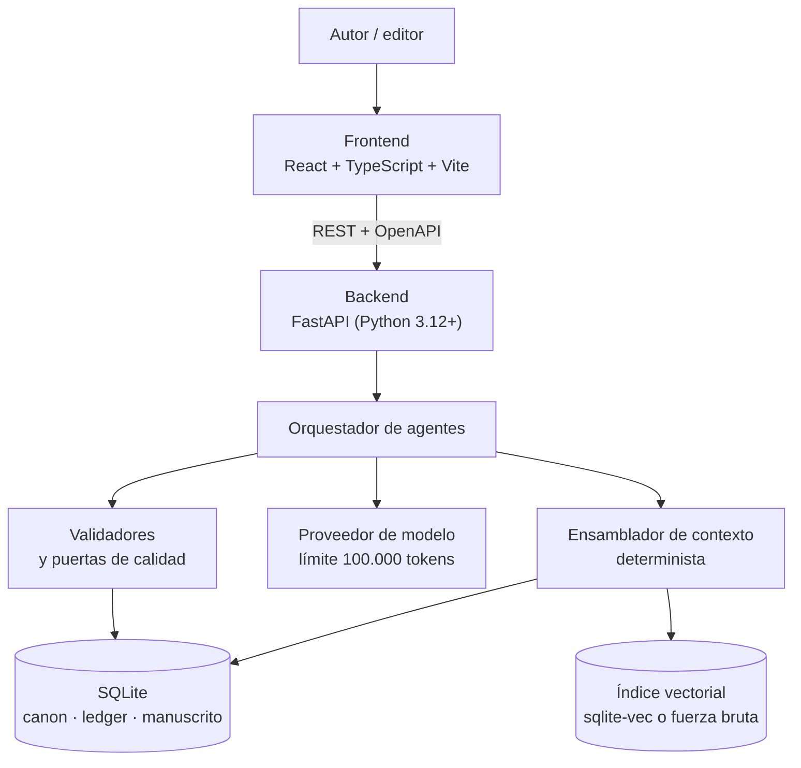
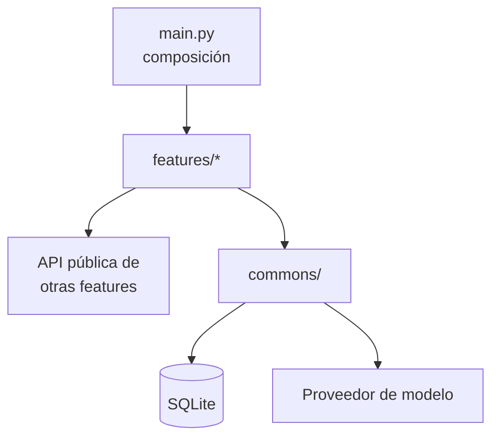
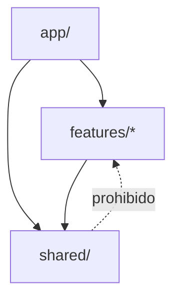
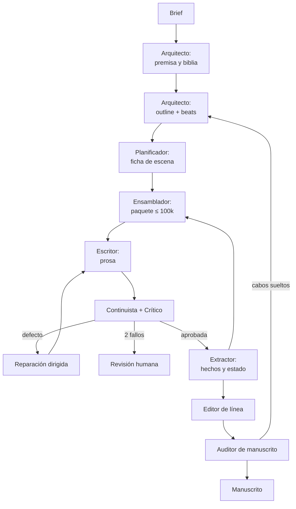
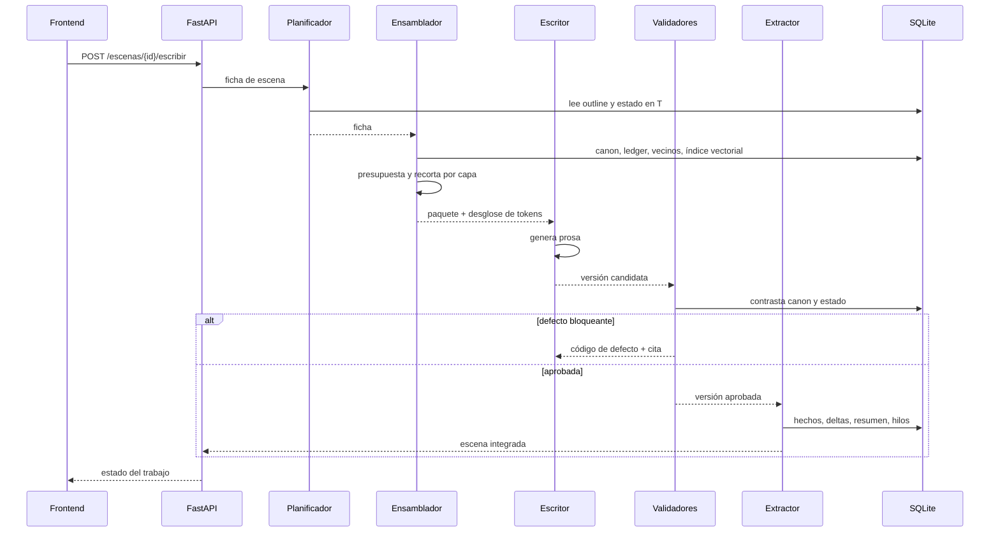

# Arquitectura del sistema

**Versión:** 1.0 · **Fecha:** 2026-09-21

Este documento describe **cómo se construye** el sistema. El **qué significa cada término** vive en [`definitions.md`](definitions.md); el **cómo funciona una novela** vive en [`domain-knowledge.md`](domain-knowledge.md). Si un concepto aparece aquí sin definir, está definido allí.

> **Nota de reorganización.** Este fichero recoge todo el material que estaba mezclado en `definitions.md` y `domain-knowledge.md` y que no era ni definición ni conocimiento de dominio: presupuestos de tokens, capas de contexto como mecanismo, roles de agente, almacenes, pipeline, puertas de calidad, política de reintentos y trazabilidad. El listado exacto de secciones a eliminar de los otros dos ficheros está en el §12.

---

## 1. Visión general

Sistema cliente-servidor. El frontend es una SPA de React donde el autor dirige la obra y revisa el manuscrito; el backend en FastAPI orquesta los agentes, ensambla el contexto, valida y persiste en SQLite.



**Principio de diseño:** el ensamblado de contexto es **código, no modelo**. Es lo único que garantiza que un fallo se pueda reproducir.

---

## 2. Stack y restricciones

| Capa | Tecnología | Restricción derivada |
| --- | --- | --- |
| Frontend | React 19 + TypeScript + Vite | SPA; cliente de API generado del OpenAPI |
| Backend | FastAPI, Python 3.12+, Pydantic v2 | Async por defecto; OpenAPI como contrato |
| Persistencia | SQLite (WAL) + Alembic | Fichero único por obra; sin segunda base de datos |
| Búsqueda semántica | `sqlite-vec` si carga; si no, fuerza bruta con NumPy | El sistema nunca falla por falta de extensión |
| Modelo | Límite **duro** de 100.000 tokens por llamada | Presupuesto por capa; fallo explícito, nunca truncado silencioso |

### 2.1 Presupuesto de contexto

| Capa del paquete | Tope (tokens) | Qué se recorta primero |
| --- | --- | --- |
| Constitucional | 5.000 | No se recorta |
| Estructural | 10.000 | Detalle de beats lejanos |
| Canon relevante | 20.000 | Personajes mencionados, no presentes |
| Estado en T | 15.000 | Conocimientos antiguos ya usados |
| Continuidad local | 20.000 | Escena N-2 antes que N-1 |
| Memoria recuperada | 10.000 | Resultados de menor puntuación |
| Instrucción | 10.000 | No se recorta |
| Reserva | 10.000 | Reservado para reintento con defecto |

Reglas de implementación:

1. El contador de tokens es una **dependencia inyectada**, no una estimación por caracteres.
2. El recorte es **por capa**: si se pasa una, se recorta esa, no las demás.
3. Si tras recortar no cabe, se lanza `ContextBudgetExceeded`. Nunca se trunca por el final.
4. El ensamblador devuelve el desglose por capa junto al paquete, y se guarda en `ejecucion`.
5. La reserva del 10 % garantiza que el reintento con el defecto añadido siga cabiendo.

---

## 3. Arquitectura del backend: features + commons

**Decisión:** organización **vertical por feature**. Cada feature es una carpeta con todo lo que necesita de punta a punta —router, esquemas, casos de uso, repositorio, prompts— y lo verdaderamente transversal vive en `commons/`. No hay carpetas globales de `controllers/`, `services/` ni `repositories/`.

El motivo es de cohesión: en una arquitectura por capas, añadir una funcionalidad obliga a tocar cuatro carpetas y a saltar entre ellas para entender un solo caso de uso; con cortes verticales, todos los ficheros de un caso de uso están juntos, y la regla es **minimizar el acoplamiento entre slices y maximizarlo dentro del slice**.

### 3.1 Estructura

```
backend/app/
  features/
    obra/              # brief, premisa, biblia, parámetros de discurso
    outline/           # actos, capítulos, asignación de beats de género
    escena/            # ficha, planificación, versiones de texto
    contexto/          # ensamblado, presupuesto, recorte, recuperación
    escritura/         # ciclo escribir → validar → reparar
    calidad/           # validadores, métricas, rúbricas, puertas
    canon/             # grafo de hechos, ledger, estado en T
    manuscrito/        # ensamblaje, exportación
    auditoria/         # beats, plantados, curva de temperatura
  commons/
    domain/            # entidades y reglas puras del dominio compartido
    db/                # sesión, unidad de trabajo, migraciones, VectorStore
    llm/               # cliente de modelo, contador de tokens, reintentos
    errors/            # excepciones de dominio y handler HTTP central
    jobs/              # trabajos en segundo plano y su estado
    config/            # ajustes, logging, observabilidad
  main.py              # composición: monta routers y dependencias
```

Cada feature tiene los mismos **segmentos** internos, siempre con estos nombres:

```
features/escena/
  router.py        # endpoints: validan y delegan
  schemas.py       # modelos Pydantic de entrada y salida
  service.py       # casos de uso
  repository.py    # acceso a datos de esta feature
  agents.py        # agentes que esta feature orquesta, si los tiene
  prompts/         # prompts versionados de esos agentes
  __init__.py      # API pública de la feature: lo único importable desde fuera
  tests/
```

### 3.2 Reglas de dependencia

Se verifican con un test de arquitectura (import-linter o equivalente) que falla la build:

1. Una feature **solo** importa de `commons/` y de la API pública (`__init__.py`) de otra feature. Nunca de sus ficheros internos.
2. `commons/` **no importa de ninguna feature**. Es el nivel más bajo y por eso el más caro de cambiar.
3. `commons/domain/` no importa FastAPI, SQLAlchemy ni clientes HTTP. Se prueba sin base de datos.
4. Ninguna feature lanza `HTTPException` desde el servicio: lanza excepciones de dominio que traduce el handler central de `commons/errors/`.
5. Si dos features necesitan el mismo código, **primero se duplica**; solo sube a `commons/` cuando hay tres usos reales. `commons/` no es el cajón de sastre.
6. Un ciclo entre features es un error de diseño: se rompe extrayendo el concepto compartido a `commons/domain/` o invirtiendo la llamada con un evento.



### 3.3 Alternativas consideradas

| Opción | Qué es | Por qué no |
| --- | --- | --- |
| **Por capas** (`api/`, `services/`, `repositories/`) | La estructura clásica | Un caso de uso queda repartido en cuatro carpetas; cada feature nueva toca todas |
| **Hexagonal / puertos y adaptadores** | Dominio puro rodeado de adaptadores | Ceremonia y abstracciones que no pagan con un solo adaptador de persistencia y un solo cliente de modelo |
| **Clean Architecture completa** | Cuatro anillos con inversión estricta | Mismo problema: mucho andamiaje para un equipo pequeño y un único despliegue |
| **Monolito modular con módulos aislados** | Cada módulo con su `internal/` y su `shared/` público | Es el destino natural si el proyecto crece; hoy añade fronteras que aún no hacen falta |
| **Features + commons** ✅ | Corte vertical con base común mínima | Máxima cohesión por caso de uso, y migra a monolito modular sin reescribir: basta con endurecer las fronteras |

La ruta de evolución está prevista: si el número de features crece, se agrupan por área de dominio (`features/narrativa/`, `features/generacion/`, `features/calidad/`) y cada grupo pasa a ser un módulo con frontera propia. La estructura de hoy no impide ese paso.

### 3.4 Endpoints principales

| Método | Ruta | Qué hace |
| --- | --- | --- |
| `POST` | `/obras` | Crea obra a partir de un brief |
| `POST` | `/obras/{id}/biblia` | Genera o actualiza la biblia (Arquitecto) |
| `POST` | `/obras/{id}/outline` | Genera outline y asigna beats de género |
| `POST` | `/escenas/{id}/planificar` | Produce la ficha de escena |
| `POST` | `/escenas/{id}/escribir` | Lanza el ciclo escribir → validar → reparar |
| `GET` | `/escenas/{id}/contexto` | Devuelve el paquete y su desglose de tokens (depuración) |
| `GET` | `/escenas/{id}/versiones` | Historial inmutable de versiones |
| `POST` | `/obras/{id}/auditoria` | Auditoría de manuscrito: beats, plantados, curva |
| `GET` | `/obras/{id}/canon` | Consulta del grafo de canon |
| `GET` | `/trabajos/{id}` | Estado de un trabajo en segundo plano |

Las operaciones largas (escribir un capítulo, auditar el manuscrito) son **trabajos en segundo plano** con estado consultable, no peticiones HTTP que esperan.

### 3.5 Persistencia

| Almacén | Implementación | Naturaleza |
| --- | --- | --- |
| Grafo de canon | Tablas `entidad`, `hecho_canon` | Fuente de verdad, con escena de origen |
| Ledger de eventos | Tabla `evento` *append-only* | Nunca se actualiza ni se borra |
| Estado en T | Vista derivada + *snapshots* cada N escenas | **Nunca se edita a mano** |
| Manuscrito | `escena`, `version_texto` (inmutable) | Editar = versión nueva + marcar vigente |
| Índice vectorial | `vec0` (sqlite-vec) o BLOB + NumPy | Detrás de la interfaz `VectorStore` |
| Hilos y plantados | `plantado`, `hilo_narrativo` | Estado: abierto, pagado, vencido |
| Prompts y rúbricas | Ficheros versionados en repo | Nunca se editan en sitio |
| Ejecuciones | `ejecucion` | Prompt, modelo, semilla, tokens, coste, veredicto |

**Recuperación híbrida, en este orden:** filtro estructural (presentes, lugar, hilos abiertos, rango de capítulos) → similitud semántica sobre el conjunto ya filtrado → fusión con recencia. La búsqueda puramente vectorial trae escenas parecidas, no escenas pertinentes.

---

## 4. Arquitectura del frontend: feature-first (Bulletproof React)

**Decisión:** organización por feature al estilo Bulletproof React, **más tres reglas de frontera** tomadas de Feature-Sliced Design. Se descartó FSD completo por coste de adopción: siete capas y la distinción `entity` / `feature` / `widget` generan discusión en cada fichero nuevo, y el equipo no tiene aún experiencia previa con ella.

La debilidad conocida de Bulletproof React es que no define las dependencias entre los módulos de feature y la zona global: los ficheros globales acceden a las features y las features a los globales, sin guía, y eso se ensucia rápido. Las tres reglas del §4.2 cierran exactamente ese agujero.

### 4.1 Estructura

```
src/
  app/                    router, providers, estilos globales
  features/
    escena/
      api/                llamadas y hooks de datos de esta feature
      components/
      hooks/
      types/
      index.ts            API pública: lo único importable desde fuera
      __tests__/
    revision/             defectos, puertas, reparaciones
    outline/              actos, capítulos, beats de género
    canon/                personajes, relaciones, hechos
    manuscrito/           lectura continua, exportación
    auditoria/            curva de temperatura, plantados, cobertura
  shared/
    ui/primitives/        Button, Input, Select, Dialog, Badge
    ui/patterns/          DataTable, FormField, EmptyState, Toolbar
    api/                  cliente generado del OpenAPI
    lib/  hooks/  types/  utilidades sin lógica de negocio
```

### 4.2 Reglas de frontera

Se imponen con ESLint (`import/no-restricted-paths`), no por revisión manual:

1. **`shared/` nunca importa de `features/`.** Es la regla que sostiene todo lo demás: un import en esa dirección es siempre un error.
2. **Las features no se importan entre sí.** Si dos lo necesitan, lo común baja a `shared/`.
3. **Se entra a una feature solo por su `index.ts`.** Nunca a un fichero interno.

Regla de promoción, igual que en el backend: algo sube a `shared/` al **tercer** uso real, no al segundo.



### 4.3 Sobre la UI: sin Atomic Design

Atomic Design organiza bien la UI pero no dice dónde va la lógica de negocio, y obliga a decidir si algo es molécula u organismo, pregunta sin respuesta objetiva. Se sustituye por dos carpetas con criterio evidente:

- `primitives/`: sin lógica de negocio, usable en cualquier aplicación. Es donde encajaría una librería de componentes externa.
- `patterns/`: composición de primitivos para un patrón que se repite en este producto.

### 4.4 Lo demás

- Estado de servidor con TanStack Query; estado de UI con `useState`/`useReducer`. No se mezclan en un store global.
- Ningún `fetch` dentro de un componente: vive en `shared/api/` o en el `api/` de la feature.
- Componentes funcionales, exportaciones nombradas, test colocado junto al componente.
- El editor trabaja sobre versiones inmutables: editar crea versión nueva.
- TypeScript estricto; nada de `any` en producción.
- Vistas propias de este dominio: **inspector de contexto** (qué se envió al modelo y cuántos tokens por capa), **panel de defectos** (código, cita, reparación) y **curva de temperatura** de la relación.

### 4.5 Alternativas consideradas

| Opción | Coste de adopción | Frontera verificable | Por qué no |
| --- | --- | --- | --- |
| **Feature-Sliced Design** | Alto | Sí (ESLint) | 7 capas y taxonomía discutible sin experiencia previa |
| **Nx + DDD táctico** | Muy alto | Sí (tags Nx) | Monorepo y tooling pesado para dos aplicaciones |
| **Atomic Design** | Bajo | Solo UI | No dice dónde va la lógica de negocio |
| **Carpetas por tipo** (`components/`, `hooks/`) | Nulo | No | Un caso de uso queda repartido por todo el árbol |
| **Bulletproof + 3 reglas** ✅ | Bajo | Sí (ESLint) | Cohesión por feature con fronteras reales |

**Ruta de salida:** si en un año la estructura se queda corta, migrar a FSD es incremental: `features/` se parte en `entities/` + `features/`, y aparecen `widgets/` y `pages/`. Los nombres de dominio ya coinciden, así que se mueve código, no se reescribe.

### 4.6 Correspondencia entre las dos arquitecturas

Backend y frontend no comparten arquitectura, pero sí el vocabulario de dominio, que sale de `definitions.md`.

| Backend (feature) | Frontend (feature) |
| --- | --- |
| `escena`, `escritura` | `escena` |
| `calidad` | `revision` |
| `contexto` | `revision` (inspector de contexto) |
| `canon` | `canon` |
| `outline` | `outline` |
| `auditoria` | `auditoria` |
| `manuscrito` | `manuscrito` |

---

## 5. Catálogo de agentes

Cada agente tiene prompt propio, contexto propio y criterio de éxito propio. Están separados a propósito: quien escribe no ve sus contradicciones y quien juzga no debe reparar.

| Agente | Skills / capacidades | Entrada | Salida | Escribe prosa | Tokens típicos |
| --- | --- | --- | --- | --- | --- |
| **Arquitecto** | Diseño estructural, cobertura de beats, coherencia de premisa | Brief | Premisa, biblia, outline | No | 20–40 k |
| **Planificador de escena** | Función dramática, giro de valor, selección de beat | Outline + estado en T | Ficha de escena | No | 15–25 k |
| **Ensamblador de contexto** | Recuperación híbrida, presupuesto y recorte, conteo de tokens | Ficha + almacenes | Paquete de contexto | No (es código) | — |
| **Escritor** | Voz por POV, dramatización, diálogo, ritmo | Paquete de contexto | Prosa de escena | Sí | ≤ 100 k |
| **Continuista** | Extracción de afirmaciones, contraste con canon, validación de conocimiento y geografía | Prosa + canon | Defectos con código | No | 30–60 k |
| **Crítico** | Rúbrica de función dramática, subtexto, satisfacción del beat | Prosa + rúbrica | Puntuaciones y diagnóstico | No | 20–40 k |
| **Editor de línea** | Prosa frase a frase, muletillas, variedad sintáctica | Prosa aprobada | Prosa pulida | Sí, sin tocar hechos | 20–30 k |
| **Extractor** | Extracción de hechos, deltas de estado, resúmenes, hilos | Prosa aprobada | Hechos, estado, resumen, hilos | No | 20–30 k |
| **Auditor de manuscrito** | Cobertura de beats, plantados sin pago, curva de temperatura, contrato de género | Manuscrito + outline | Informe de auditoría | No | Por lotes |

### 5.1 Herramientas por agente

| Agente | Lectura | Escritura | Llama al modelo |
| --- | --- | --- | --- |
| Arquitecto | Brief | Biblia, outline | Sí |
| Planificador | Outline, estado en T, hilos | Ficha de escena | Sí |
| Ensamblador | Canon, ledger, manuscrito, índice vectorial | Nada | No |
| Escritor | **Solo el paquete recibido** | Versión de texto | Sí |
| Continuista | Canon, prosa nueva | Defectos | Sí |
| Crítico | Prosa, rúbrica | Puntuaciones | Sí |
| Editor de línea | Prosa aprobada, lista negra de n-gramas | Versión pulida | Sí |
| Extractor | Prosa aprobada | Canon, ledger, resúmenes, hilos | Sí |
| Auditor | Todo en lectura | Informe | Sí |

**Regla clave:** el Escritor **nunca** accede a la base de datos. Si le falta un dato, es un fallo del ensamblado, no del escritor. Esto hace que los defectos sean atribuibles.

### 5.2 Skills de desarrollo (para los agentes de código)

Instrucciones cargadas por el asistente de programación al trabajar en cada parte del repositorio.

Instaladas el 2026-09-21 en `.claude/skills/`, copiadas y clavadas a un commit. Procedencia, SHA, licencia y conflictos anotados: `.claude/skills/SOURCES.md`.

| Área del repo | Skill instalada | Qué aporta |
| --- | --- | --- |
| `features/*/router.py`, `service.py` | `python-fastapi-ops` | Lifespan, `Depends()` con `Annotated`, `response_model`, organización de routers |
| `features/*/schemas.py`, `commons/domain/` | `pydantic` (oficial del equipo Pydantic) | Pydantic v2: restricciones, validadores, jerarquías de modelos, coerción |
| `features/contexto/`, `commons/db/` | `sqlite-vec` | Tablas `vec0`, KNN con `MATCH`, filtrado por metadatos y claves de partición |
| `commons/db/`, `repository.py`, Alembic | `sqlite-ops` | WAL, `busy_timeout`, `EXPLAIN QUERY PLAN`, índices, tablas STRICT, `aiosqlite`, migraciones |
| `frontend/src/` | `typescript-best-practices` | Type-first, uniones discriminadas, tipos marcados, estados ilegales irrepresentables |
| `frontend/src/features/*/components/` | `react-best-practices` | React 19: los efectos como vía de escape, `useEffectEvent`, cuándo no usar `useEffect` |
| — | `feature-sliced-design` | **Referencia de FSD para la migración de §4.5, no la norma vigente.** En decisiones de ubicación y fronteras manda `CLAUDE.md` §5.2 |

Criterio: una skill por requisito técnico de `CLAUDE.md` §4, y ninguna más. Las herramientas de base (uv, ruff, mypy, pytest) no llevan skill: sus reglas están en `CLAUDE.md` §6 y §13, y sus comandos en la lista de verificación de `CLAUDE.md` §15.

Lo específico de este proyecto —presupuesto de 100.000 tokens, ontología de escena y canon, reglas de frontera (`import-linter`, `import/no-restricted-paths`), ledger append-only— **no lo cubre ninguna skill pública**: vive en `CLAUDE.md`.

---

## 6. Proceso de generación

### 6.1 Fases



### 6.2 Ciclo de una escena, paso a paso



### 6.3 Puertas de calidad

| Puerta | Cuándo | Bloqueantes | Umbral | Acción si falla |
| --- | --- | --- | --- | --- |
| G1 · Escena | Tras escribir | Canon, continuidad, conocimiento, función dramática | Voz, prosa, diálogo | Reintento dirigido (máx. 2) → humano |
| G2 · Capítulo | Al cerrar capítulo | — | Ritmo, escena/resumen | Replanificar escenas del capítulo |
| G3 · Manuscrito | Al cerrar borrador | Beats, cabos sueltos, contrato con el lector | Curva de temperatura | Vuelta al outline |

**Política de reparación:** el reintento lleva el **defecto concreto** en el prompt, con cita del pasaje. Un reintento genérico («mejóralo») degrada el texto casi siempre. Tras dos intentos, escalado a humano.

---

## 7. Trazabilidad y observabilidad

Cada llamada al modelo registra: `run_id`, escena, versión de prompt, versión de biblia, IDs recuperados, modelo, parámetros, semilla, tokens por capa, coste y veredicto.

Métricas operativas a vigilar: coste por escena y por novela, tokens medios por capa, tasa de defectos por código, tasa de reintento, escalados a humano por cada cien escenas, latencia por fase y porcentaje de contexto ocupado por cada capa.

---

## 8. Modos de despliegue

- **Local**: backend y frontend en la misma máquina, un fichero SQLite por obra. Es el modo de referencia.
- **Servidor**: un proceso FastAPI, SQLite en volumen persistente con WAL, trabajos en segundo plano en el mismo proceso o en un *worker*. Si la concurrencia de escritura crece, el cuello es SQLite: se resuelve serializando las escrituras por obra, no cambiando de base de datos.

---

## 9. Seguridad y cumplimiento (aplicado en código)

- Edad mínima y nivel de calor se validan **en esquema**, no solo en el prompt.
- Los prompts de producción y los fragmentos de manuscrito no se registran en logs por defecto.
- Las claves de proveedor se leen de entorno; nunca del repositorio ni de la base de datos.
- Registro de autoría: qué partes son generadas, editadas o humanas.

---

## 10. Decisiones de arquitectura

| # | Decisión | Alternativa descartada | Motivo |
| --- | --- | --- | --- |
| 1 | Escena como unidad de generación | Capítulo completo | Cabe en contexto y permite validación atómica |
| 2 | Ensamblador determinista en código | Agente que decide qué recuperar | Reproducibilidad y auditoría |
| 3 | Estado derivado del ledger | Tabla de estado editable | Evita desincronización con el texto |
| 4 | SQLite único con vectores opcionales | Postgres + base vectorial | Simplicidad operativa; fichero portable por obra |
| 5 | Texto inmutable y versionado | Edición en sitio | Permite comparar estrategias y volver atrás |
| 6 | Agentes separados por rol | Un agente que escribe y se corrige | Quien escribe no ve sus contradicciones |
| 7 | Presupuesto por capa con fallo explícito | Truncado por ventana deslizante | Un truncado silencioso produce defectos invisibles |
| 8 | Backend por features + `commons` | Capas, hexagonal, clean, monolito modular | Cohesión por caso de uso; migra a modular sin reescribir |
| 9 | Frontend feature-first (Bulletproof) + 3 reglas de frontera | FSD completo, Nx+DDD, Atomic, carpetas por tipo | Cohesión por feature con coste de adopción bajo; migrable a FSD |

**Riesgos abiertos:** coste por novela con nueve agentes; calibración del juez al cambiar de modelo; rendimiento de la búsqueda por fuerza bruta cuando el índice supera unas decenas de miles de fragmentos; concurrencia de escritura en SQLite si varios autores comparten obra.

---

## 11. Hoja de ruta

1. **Vertical mínima**: biblia sencilla, outline de 40 escenas, escritura con contexto ensamblado, extracción de hechos. Meta: un capítulo coherente.
2. **Canon consultable**: grafo con origen, validadores de contradicción y conocimiento. Meta: cero defectos CAN y CON en diez escenas.
3. **Estado y recuperación**: ledger, resúmenes en cascada, búsqueda híbrida. Meta: coherencia más allá del capítulo 10.
4. **Calidad medida**: métricas, juez calibrado, puertas con umbrales. Meta: reparación dirigida.
5. **Género y arco**: cobertura de beats, curva de temperatura, auditoría de plantados.
6. **Producción**: versionado, comparación de estrategias de contexto, coste por novela, exportación editorial.

---

## 12. Qué eliminar de los otros dos documentos

Al adoptar este fichero, retirar de los otros dos lo siguiente, que ya vive aquí:

**De `definitions.md`:**

- La tabla de capas del paquete de contexto con los porcentajes de presupuesto y las reglas de ensamblado. *Se queda* la definición de `PaqueteDeContexto`, `MuestraAncla`, `Ledger` y `EstadoEnT` como conceptos.
- Las tablas de contención de deriva. *Se queda* la definición de deriva y sus tipos.
- El apartado de roles de agente con sus entradas, salidas y motivo de separación, y la lista de almacenes.
- La columna «Puerta» de la tabla de dimensiones de calidad y la política de reintentos. *Se queda* la definición de cada dimensión y la taxonomía de defectos con sus códigos.
- Toda la sección de producción: `Brief`, `Prompt`, `Ejecucion`, `VersionDeTexto` conservan su definición, pero el detalle de versionado, semillas y comandos se va.
- La gobernanza operativa (dónde se validan las reglas, qué se registra). *Se queda* la regla de dominio en sí.

**De `domain-knowledge.md`:**

- Cualquier mención a FastAPI, React, SQLite, tokens, prompts, agentes o pipeline. El conocimiento de dominio describe cómo funciona una novela, no cómo se fabrica.
- Los diagramas de pipeline, de paquete de contexto y de ciclo de vida de la escena.
- La tabla de skills de desarrollo.

**Criterio para el futuro:** si la frase cambia cuando cambias de framework, de modelo o de base de datos, va en `architecture.md`. Si cambiaría aunque escribieras la novela a mano, va en `domain-knowledge.md`. Si es «X significa Y», va en `definitions.md`.