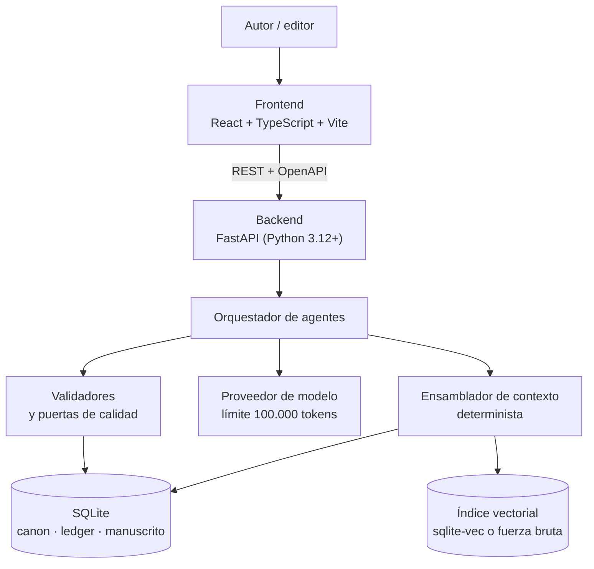
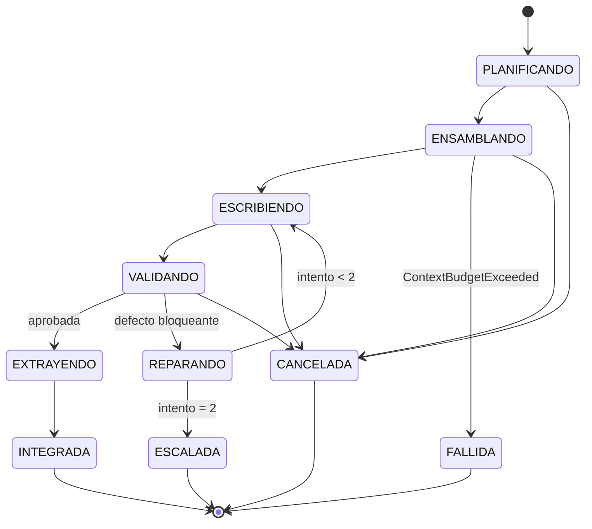
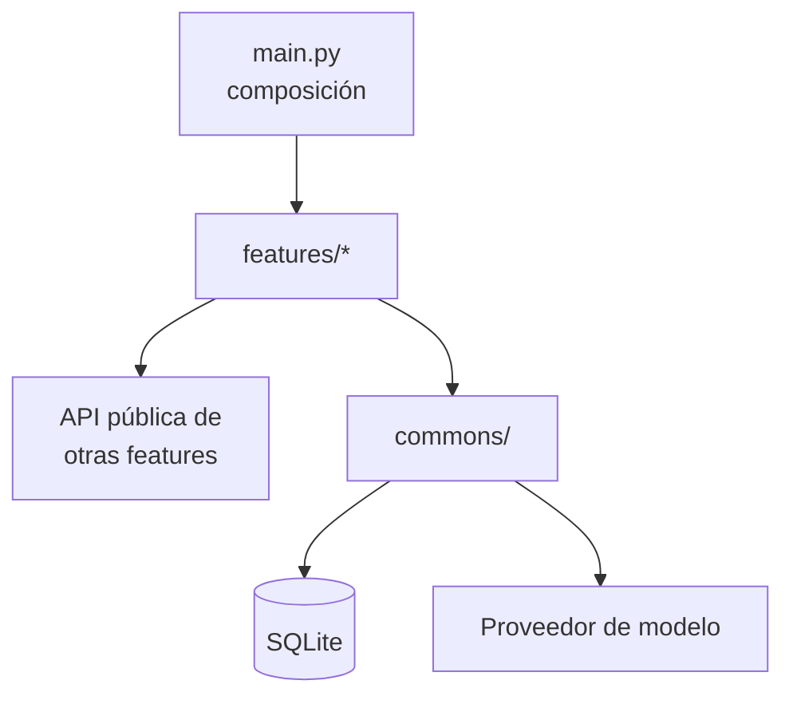
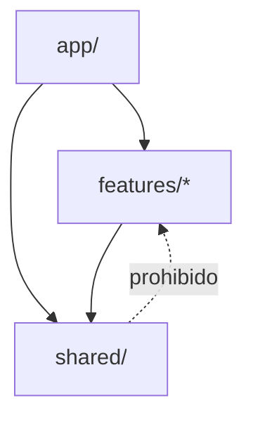
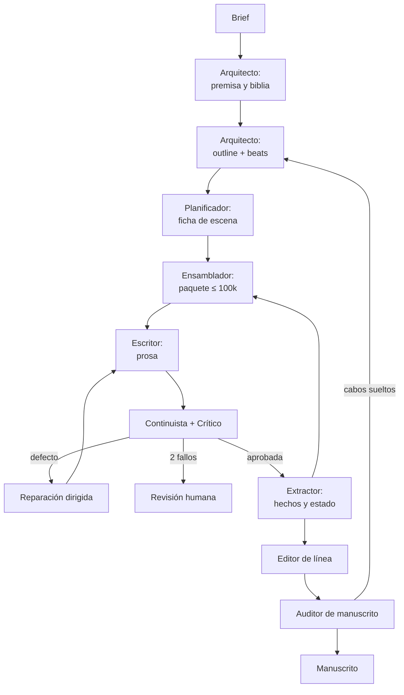
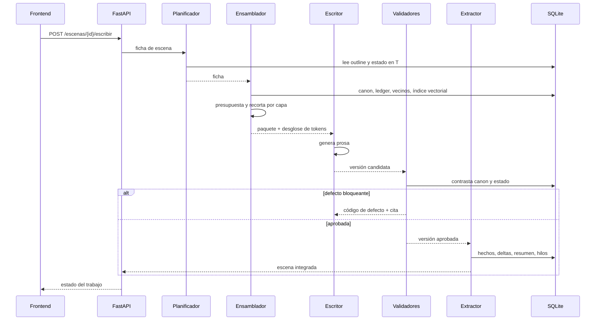

# Arquitectura del sistema

**Versión:** 1.1 · **Fecha:** 2026-09-21

Este documento describe **cómo se construye** el sistema. El **qué significa cada término** vive en [`definitions.md`](definitions.md); el **cómo funciona una novela** vive en [`domain-knowledge.md`](domain-knowledge.md). Si un concepto aparece aquí sin definir, está definido allí.

> **Nota de reorganización.** Este fichero recoge todo el material que estaba mezclado en `definitions.md` y `domain-knowledge.md` y que no era ni definición ni conocimiento de dominio: presupuestos de tokens, capas de contexto como mecanismo, roles de agente, almacenes, pipeline, puertas de calidad, política de reintentos y trazabilidad. El listado exacto de secciones a eliminar de los otros dos ficheros está en el §14.

---

## 1. Visión general

Sistema cliente-servidor. El frontend es una SPA de React donde el autor dirige la obra y revisa el manuscrito; el backend en FastAPI orquesta los agentes, ensambla el contexto, valida y persiste en SQLite.



**Principio de diseño:** el ensamblado de contexto es **código, no modelo**. Es lo único que garantiza que un fallo se pueda reproducir.

---

## 2. Stack y restricciones

| Capa | Tecnología | Restricción derivada |
| --- | --- | --- |
| Frontend | React 19 + TypeScript + Vite | SPA; cliente de API generado del OpenAPI |
| Backend | FastAPI, Python 3.12+, Pydantic v2 | Async por defecto; OpenAPI como contrato |
| Persistencia | SQLite (WAL) + Alembic | Fichero único por obra; sin segunda base de datos |
| Búsqueda semántica | `sqlite-vec` si carga; si no, fuerza bruta con NumPy | El sistema nunca falla por falta de extensión |
| Modelo | Límite **duro** de 100.000 tokens por llamada | Presupuesto por capa; fallo explícito, nunca truncado silencioso |

### 2.1 Presupuesto de contexto

| Capa del paquete | Tope (tokens) | Qué se recorta primero |
| --- | --- | --- |
| Constitucional | 5.000 | No se recorta |
| Estructural | 10.000 | Detalle de beats lejanos |
| Canon relevante | 20.000 | Personajes mencionados, no presentes |
| Estado en T | 15.000 | Conocimientos antiguos ya usados |
| Continuidad local | 20.000 | Escena N-2 antes que N-1 |
| Memoria recuperada | 10.000 | Resultados de menor puntuación |
| Instrucción | 10.000 | No se recorta |
| Reserva | 10.000 | Reservado para reintento con defecto |

Reglas de implementación:

1. El contador de tokens es una **dependencia inyectada**, no una estimación por caracteres.
2. El recorte es **por capa**: si se pasa una, se recorta esa, no las demás.
3. Si tras recortar no cabe, se lanza `ContextBudgetExceeded`. Nunca se trunca por el final.
4. El ensamblador devuelve el desglose por capa junto al paquete, y se guarda en `ejecucion`.
5. La reserva del 10 % garantiza que el reintento con el defecto añadido siga cabiendo.

### 2.2 Presupuesto concurrente

Los 100.000 tokens de §2.1 son el techo **de una llamada**. No dicen nada sobre cuántas llamadas pueden estar vivas a la vez: dos agentes en paralelo serían 200.000 tokens en vuelo sin violar ninguna regla de §2.1. Por eso hay un segundo techo, **agregado**, y es **el mismo número**: 100.000 tokens sumando todas las llamadas simultáneas del proceso.

| Techo | Valor | Quién lo aplica | Cuándo |
| --- | --- | --- | --- |
| Por llamada | 100.000 tokens | Ensamblador | Al construir el paquete |
| Agregado en vuelo | **100.000 tokens**, el mismo número | Orquestador | Antes de lanzar cada llamada |
| Llamadas simultáneas | No es un número aparte: sale del techo agregado | Orquestador | — |

**Consecuencia directa:** como el techo agregado iguala al de una llamada, **una sola llamada grande satura el sistema entero**. Dos agentes solo corren a la vez si sus paquetes suman 100.000 o menos: el Continuista (30–60 k) y el Crítico (20–40 k) a veces caben juntos; el Escritor, que puede llegar al tope, nunca comparte. El sistema es por tanto **secuencial por defecto y concurrente por excepción**. Es deliberado: acota el gasto simultáneo a lo que cuesta una sola llamada.

Reglas de implementación:

1. El orquestador **reserva** tokens antes de llamar y los **libera** al recibir respuesta o al fallar. La reserva usa el desglose que ya devuelve el ensamblador; no es una estimación.
2. Si no hay hueco en el agregado, la llamada **espera**. Nunca se recorta el paquete para hacerla caber: recortar es competencia del ensamblador y obedece a §2.1, no a la carga del sistema.
3. La espera tiene *timeout*. Si vence, el trabajo pasa a `FALLIDA` con causa `PresupuestoAgregadoAgotado`. No se encola indefinidamente.
4. El techo agregado es **por proceso**, no por obra. Dos obras generando a la vez comparten los mismos 100.000: la segunda espera.
5. El límite de tasa del proveedor es un techo distinto y externo. Si el proveedor rechaza por tasa, es fallo de proveedor (§3.6), no un problema de presupuesto.

La reserva del 10 % de §2.1 protege el reintento **dentro** de una llamada; este techo protege la factura y la latencia **del sistema entero**. Son independientes y se aplican a la vez.

---

## 3. Orquestación

**Decisión:** el orquestador es **código determinista**, una máquina de estados explícita. No hay ningún agente que decida cuál es el siguiente paso.

El motivo es el mismo que sostiene el ensamblador determinista: si quien decide el orden es un modelo, un fallo no se puede reproducir ni atribuir. Un orquestador en código se prueba sin llamar al proveedor, y su traza es una tabla, no una conversación.

### 3.1 Principios

1. **Topología en estrella.** Ningún agente llama a otro. El orquestador invoca a uno, recibe su salida, la persiste y decide el siguiente. Una cadena de agentes que se invocan entre sí hace imposible saber quién introdujo un defecto.
2. **El estado vive en SQLite**, nunca en memoria del proceso. Una caída a mitad de escena no pierde trabajo: al arrancar, el orquestador lee los trabajos vivos y continúa.
3. **Idempotencia por `run_id`.** Repetir un paso con el mismo `run_id` no duplica escrituras. Es lo que permite reintentar sin miedo tras un fallo de red.
4. **Una escena en vuelo por obra.** La escena N+1 necesita el estado en T posterior a N. Paralelizar escenas de la misma obra no es arriesgado: es incorrecto.
5. **Permiso mínimo por agente.** Cada agente recibe exactamente los almacenes que su rol necesita, ni uno más (§3.5).

### 3.2 La unidad de trabajo

Todo lo que dura más que una petición HTTP es un **trabajo** persistido. El endpoint crea el trabajo y devuelve su identificador; el cliente consulta `GET /trabajos/{id}`.

| Campo | Para qué |
| --- | --- |
| `id` | Identificador del trabajo, el que consulta el frontend |
| `obra_id`, `escena_id` | A qué se aplica; `escena_id` es nulo en trabajos de manuscrito |
| `tipo` | `escribir_escena`, `auditar_manuscrito`, `replanificar_capitulo` |
| `estado` | Uno de los de §3.3 |
| `intento` | Número de reparación dirigida consumida (máximo 2) |
| `run_id` | Correlaciona todas las ejecuciones del trabajo; es la clave de idempotencia |
| `causa_fallo` | Código de §3.6 cuando el estado es `FALLIDA` o `ESCALADA` |
| `creado_en`, `actualizado_en` | Latencia por fase y detección de trabajos colgados |

Cada llamada al modelo dentro del trabajo genera además una fila en `ejecucion` (§9), con su desglose de tokens.

### 3.3 Estados y transiciones



| Estado | Qué está pasando | Salida normal | ¿Reanudable tras caída? |
| --- | --- | --- | --- |
| `PLANIFICANDO` | El Planificador produce la ficha de escena | `ENSAMBLANDO` | Sí, se repite el paso |
| `ENSAMBLANDO` | El Ensamblador construye el paquete y lo presupuesta | `ESCRIBIENDO` | Sí, es determinista: mismo estado, mismo paquete |
| `ESCRIBIENDO` | El Escritor genera prosa | `VALIDANDO` | Sí, pero **cuesta**: se repite la llamada al modelo |
| `VALIDANDO` | Continuista y Crítico juzgan la versión | `EXTRAYENDO` o `REPARANDO` | Sí, sobre la versión ya guardada |
| `REPARANDO` | Se prepara el reintento con el defecto y su cita | `ESCRIBIENDO` o `ESCALADA` | Sí |
| `EXTRAYENDO` | El Extractor escribe canon, ledger, resúmenes e hilos | `INTEGRADA` | Sí, por idempotencia del `run_id` |
| `INTEGRADA` | La escena forma parte del manuscrito | — | Terminal |
| `ESCALADA` | Dos reparaciones agotadas; espera decisión humana | — | Terminal hasta que el autor actúe |
| `FALLIDA` | Error técnico, no de calidad | — | Terminal; se relanza como trabajo nuevo |
| `CANCELADA` | El autor abortó | — | Terminal |

Ningún estado se salta: `VALIDANDO` no puede llegar a `INTEGRADA` sin pasar por `EXTRAYENDO`, porque es el Extractor quien deja rastro en la memoria de largo plazo (§4.4).

### 3.4 Contrato entre pasos

- Cada paso recibe un modelo Pydantic y devuelve otro. El orquestador no pasa objetos vivos entre pasos: **persiste la salida y vuelve a leerla**. Es lo que hace que reanudar sea idéntico a ejecutar.
- Ningún paso escribe fuera de lo que su contrato declara. La escritura a canon y ledger es exclusiva del paso `EXTRAYENDO`.
- Un paso que llama al modelo recibe también el desglose de tokens y lo devuelve en su salida, para `ejecucion` y para el techo agregado de §2.2.

### 3.5 Permisos por agente

Cada agente recibe exactamente los almacenes que su rol necesita. Lo que no aparece en su fila, no lo puede tocar.

| Agente | Lectura | Escritura | Llama al modelo |
| --- | --- | --- | --- |
| Arquitecto | Brief | Biblia, outline | Sí |
| Planificador | Outline, estado en T, hilos | Ficha de escena | Sí |
| Ensamblador | Canon, ledger, manuscrito, índice vectorial | Nada | No |
| Escritor | **Solo el paquete recibido** | Versión de texto | Sí |
| Continuista | Canon, prosa nueva | Defectos | Sí |
| Crítico | Prosa, rúbrica | Puntuaciones | Sí |
| Editor de línea | Prosa aprobada, lista negra de n-gramas | Versión pulida | Sí |
| Extractor | Prosa aprobada | Canon, ledger, resúmenes, hilos | Sí |
| Auditor | Todo en lectura | Informe | Sí |

**Regla clave:** el Escritor **nunca** accede a la base de datos. Si le falta un dato, es un fallo del ensamblado, no del escritor. Esto hace que los defectos sean atribuibles.

Los agentes tampoco leen ni escriben ficheros del repositorio: el paquete llega como datos y la salida vuelve como datos. Los prompts los carga el orquestador, no el agente.

### 3.6 Fallos y qué hace el orquestador

| Causa | Qué es | Acción |
| --- | --- | --- |
| `FalloDeProveedor` | Error de red, 5xx, límite de tasa | Reintento con espera creciente, hasta 3. Después, `FALLIDA` |
| `ContextBudgetExceeded` | El paquete no cabe ni tras recortar (§2.1) | `FALLIDA` inmediata, sin llamar al modelo. Es un fallo de diseño del ensamblado, no de ejecución |
| `PresupuestoAgregadoAgotado` | No hubo hueco en el techo de §2.2 antes del *timeout* | `FALLIDA`. Relanzable sin coste, porque no se llegó a llamar |
| `DefectoBloqueante` | El Continuista o el Crítico rechazan | `REPARANDO`, hasta dos veces; luego `ESCALADA` |
| `TiempoAgotado` | Un paso supera su plazo | `FALLIDA`, con el paso anotado |
| `Cancelacion` | Petición del autor | `CANCELADA` en el primer punto seguro |

Un defecto de calidad **no** es un fallo técnico: `ESCALADA` y `FALLIDA` son estados distintos a propósito, y se cuentan por separado en las métricas de §9.

### 3.7 Reanudación

Al arrancar, el orquestador busca trabajos en estado no terminal y los retoma desde su último estado persistido. Un paso interrumpido se **repite entero**, nunca se reanuda a medias: es posible porque la salida solo se persiste al completarse y porque el `run_id` evita duplicados.

El único paso caro de repetir es `ESCRIBIENDO`, porque vuelve a pagar la llamada al modelo. Se acepta a cambio de no tener que razonar sobre respuestas parciales.

### 3.8 Concurrencia

- **Una escena en vuelo por obra.** Es una restricción de corrección, no de rendimiento (§3.1, punto 4).
- **Varias obras pueden estar en curso a la vez, pero sus llamadas al modelo se serializan:** comparten los 100.000 del techo agregado (§2.2). El paralelismo entre obras es de trabajo, no de llamadas.
- **Lo único que paraleliza de verdad es lo que no consume presupuesto de contexto:** ensamblado, lectura de almacenes, persistencia y cálculo de embeddings. La auditoría por lotes y la revisión de escenas ya aprobadas sí llaman al modelo, así que pasan por la misma cola.
- **Las escrituras se serializan por obra.** SQLite con WAL admite lectores concurrentes y un solo escritor; el orquestador respeta eso con un cerrojo por obra en vez de confiar en `busy_timeout` para resolver colisiones.

### 3.9 Dónde vive el código

| Pieza | Sitio |
| --- | --- |
| Motor de la máquina de estados, cerrojos, reserva de tokens | `commons/jobs/` |
| Pasos del ciclo de escena | `features/escritura/service.py` |
| Contador de tokens y cliente de modelo | `commons/llm/` |
| Definición de los agentes y sus prompts | `features/<feature>/agents.py` y `prompts/` |

El router solo crea el trabajo y consulta su estado. Ninguna decisión de orquestación vive en `router.py`.

---

## 4. Memoria: corto y largo plazo

**Los agentes no tienen memoria.** No hay hilo de conversación que persista entre llamadas. La memoria son los almacenes, y el paquete de contexto es su proyección para una sola llamada.

Es lo que hace reproducible una ejecución: dos ejecuciones con el mismo estado de almacenes y la misma semilla reciben el mismo paquete. Un agente con historia acumulada no ofrece esa garantía.

### 4.1 Las dos memorias

| | Corto plazo | Largo plazo |
| --- | --- | --- |
| Qué es | La ventana de trabajo de **una** escena | El conocimiento acumulado de la obra |
| Dónde vive | En el paquete, en memoria, durante la llamada | En SQLite: canon, ledger, resúmenes, índice vectorial |
| Cuánto dura | Una llamada | Toda la obra |
| Quién la construye | El Ensamblador, en cada llamada, desde cero | El Extractor, tras cada escena aprobada |
| Si se pierde | No pasa nada: se reconstruye | Se pierde la novela |

### 4.2 Corto plazo: la ventana de trabajo

Lo que el Escritor tiene delante y nada más:

| Contenido | De dónde sale |
| --- | --- |
| Ficha de la escena | Paso `PLANIFICANDO` del mismo trabajo |
| Escena N-1 íntegra | `version_texto` vigente |
| Escena N-2 resumida | Resumen de escena (§4.3) |
| Estado en T | Vista derivada del ledger |
| Hilos abiertos pertinentes | `hilo_narrativo`, filtrados por la ficha |
| Muestras ancla de voz | Biblia y versiones aprobadas del mismo POV |

Se **reconstruye entera en cada llamada**. Nada se arrastra de la llamada anterior, ni siquiera en un reintento: la reparación recibe el mismo paquete más el defecto y su cita.

### 4.3 Largo plazo: qué se guarda y quién manda

| Almacén | Qué guarda | Quién escribe | Naturaleza |
| --- | --- | --- | --- |
| Grafo de canon | Hechos con la escena que los estableció | Extractor | Fuente de verdad |
| Ledger | Eventos de estado, *append-only* | Extractor | Nunca se actualiza ni se borra |
| Estado en T | Quién sabe qué, dónde está cada cual, en el momento T | **Nadie: es una vista derivada** | Derivado, más *snapshots* cada N escenas |
| Resúmenes en cascada | Escena → capítulo → acto → obra | Extractor | Regenerables desde el texto |
| Índice vectorial | Fragmentos con su embedding | Extractor | Regenerable; puede reconstruirse entero |
| Hilos y plantados | Abierto, pagado, vencido | Extractor y Auditor | Estado con ciclo de vida |

La columna que importa es la tercera: **solo el Extractor escribe memoria de largo plazo**, y solo desde el paso `EXTRAYENDO`. Ningún otro agente puede dejar rastro permanente.

### 4.4 Consolidación

Una escena pasa a memoria de largo plazo **solo tras ser aprobada**. Un borrador rechazado no deja hechos en canon, ni eventos en el ledger, ni fragmentos en el índice. De lo contrario, el canon se contaminaría con afirmaciones de texto que nunca llegó al manuscrito.

Orden dentro del paso `EXTRAYENDO`: hechos de canon → eventos del ledger → resumen de escena → hilos → embeddings. Todo en una transacción por escena: o entra el conjunto, o no entra nada.

### 4.5 Compactación y olvido

La memoria de largo plazo crece con la obra; el presupuesto de §2.1 no. La cascada de resúmenes es lo que absorbe esa diferencia:

| Nivel | Cuándo se genera | Qué conserva |
| --- | --- | --- |
| Resumen de escena | Al integrarla | Giro de valor, hechos nuevos, cambios de estado |
| Resumen de capítulo | Al cerrar el capítulo | Función del capítulo, plantados abiertos, deltas relevantes |
| Resumen de acto | Al cerrar el acto | Arco, promesas del género, deuda narrativa |

**Nunca se compactan:** la capa constitucional, los hechos de canon y el ledger. Un hecho de canon puede dejar de ser *relevante* para una escena —y entonces no entra en el paquete—, pero no se borra ni se resume. El olvido de este sistema es **de selección, no de destrucción**.

### 4.6 Recuperación

Para construir la capa de memoria recuperada, en este orden:

1. **Filtro estructural**: presentes, lugar, hilos abiertos, rango de capítulos.
2. **Similitud semántica** sobre el conjunto ya filtrado.
3. **Fusión con recencia**.

El orden no es negociable: la búsqueda puramente vectorial trae escenas parecidas, no escenas pertinentes. Una escena de hace veinte capítulos con un beso puede parecerse mucho a la actual y no tener nada que ver con ella.

### 4.7 Corrección sin edición

Un hecho de canon equivocado **no se edita**: se registra un hecho nuevo que lo sustituye y cita al anterior. El ledger es *append-only*, así que la historia de lo que el sistema creyó en cada momento se conserva.

Esto no es purismo: cuando una escena antigua se apoyó en un hecho que luego resultó falso, hay que poder encontrarla. Si el hecho se hubiera editado en sitio, esa escena quedaría rota y sin rastro de por qué.

### 4.8 De la memoria al paquete

La correspondencia entre los almacenes de §4.3 y las capas de §2.1, que es lo que ensambla el Ensamblador:

| Capa del paquete | Memoria de la que sale | Corto o largo |
| --- | --- | --- |
| Constitucional | Biblia, parámetros de discurso | Largo |
| Estructural | Outline, beats del capítulo | Largo |
| Canon relevante | Grafo de canon, filtrado por la ficha | Largo |
| Estado en T | Vista derivada del ledger | Largo |
| Continuidad local | Escenas N-1 y N-2 | Corto |
| Memoria recuperada | Índice vectorial + resúmenes, tras §4.6 | Largo |
| Instrucción | Ficha de escena y prompt versionado | Corto |
| Reserva | — | — |

Cada capa tiene un tope propio (§2.1) y un origen propio. Si una capa llega vacía, es un fallo del almacén que la surte, no del Escritor.

---

## 5. Arquitectura del backend: features + commons

**Decisión:** organización **vertical por feature**. Cada feature es una carpeta con todo lo que necesita de punta a punta —router, esquemas, casos de uso, repositorio, prompts— y lo verdaderamente transversal vive en `commons/`. No hay carpetas globales de `controllers/`, `services/` ni `repositories/`.

El motivo es de cohesión: en una arquitectura por capas, añadir una funcionalidad obliga a tocar cuatro carpetas y a saltar entre ellas para entender un solo caso de uso; con cortes verticales, todos los ficheros de un caso de uso están juntos, y la regla es **minimizar el acoplamiento entre slices y maximizarlo dentro del slice**.

### 5.1 Estructura

```
src/backend/app/
  features/
    obra/              # brief, premisa, biblia, parámetros de discurso
    outline/           # actos, capítulos, asignación de beats de género
    escena/            # ficha, planificación, versiones de texto
    contexto/          # ensamblado, presupuesto, recorte, recuperación
    escritura/         # ciclo escribir → validar → reparar
    calidad/           # validadores, métricas, rúbricas, puertas
    canon/             # grafo de hechos, ledger, estado en T
    manuscrito/        # ensamblaje, exportación
    auditoria/         # beats, plantados, curva de temperatura
  commons/
    domain/            # entidades y reglas puras del dominio compartido
    db/                # sesión, unidad de trabajo, migraciones, VectorStore
    llm/               # cliente de modelo, contador de tokens, reintentos
    errors/            # excepciones de dominio y handler HTTP central
    jobs/              # trabajos en segundo plano y su estado
    config/            # ajustes, logging, observabilidad
  main.py              # composición: monta routers y dependencias
```

Cada feature tiene los mismos **segmentos** internos, siempre con estos nombres:

```
features/escena/
  router.py        # endpoints: validan y delegan
  schemas.py       # modelos Pydantic de entrada y salida
  service.py       # casos de uso
  repository.py    # acceso a datos de esta feature
  agents.py        # agentes que esta feature orquesta, si los tiene
  prompts/         # prompts versionados de esos agentes
  __init__.py      # API pública de la feature: lo único importable desde fuera
  tests/
```

### 5.2 Reglas de dependencia

Se verifican con un test de arquitectura (import-linter o equivalente) que falla la build:

1. Una feature **solo** importa de `commons/` y de la API pública (`__init__.py`) de otra feature. Nunca de sus ficheros internos.
2. `commons/` **no importa de ninguna feature**. Es el nivel más bajo y por eso el más caro de cambiar.
3. `commons/domain/` no importa FastAPI, SQLAlchemy ni clientes HTTP. Se prueba sin base de datos.
4. Ninguna feature lanza `HTTPException` desde el servicio: lanza excepciones de dominio que traduce el handler central de `commons/errors/`.
5. Si dos features necesitan el mismo código, **primero se duplica**; solo sube a `commons/` cuando hay tres usos reales. `commons/` no es el cajón de sastre.
6. Un ciclo entre features es un error de diseño: se rompe extrayendo el concepto compartido a `commons/domain/` o invirtiendo la llamada con un evento.



### 5.3 Alternativas consideradas

| Opción | Qué es | Por qué no |
| --- | --- | --- |
| **Por capas** (`api/`, `services/`, `repositories/`) | La estructura clásica | Un caso de uso queda repartido en cuatro carpetas; cada feature nueva toca todas |
| **Hexagonal / puertos y adaptadores** | Dominio puro rodeado de adaptadores | Ceremonia y abstracciones que no pagan con un solo adaptador de persistencia y un solo cliente de modelo |
| **Clean Architecture completa** | Cuatro anillos con inversión estricta | Mismo problema: mucho andamiaje para un equipo pequeño y un único despliegue |
| **Monolito modular con módulos aislados** | Cada módulo con su `internal/` y su `shared/` público | Es el destino natural si el proyecto crece; hoy añade fronteras que aún no hacen falta |
| **Features + commons** ✅ | Corte vertical con base común mínima | Máxima cohesión por caso de uso, y migra a monolito modular sin reescribir: basta con endurecer las fronteras |

La ruta de evolución está prevista: si el número de features crece, se agrupan por área de dominio (`features/narrativa/`, `features/generacion/`, `features/calidad/`) y cada grupo pasa a ser un módulo con frontera propia. La estructura de hoy no impide ese paso.

### 5.4 Endpoints principales

| Método | Ruta | Qué hace |
| --- | --- | --- |
| `POST` | `/obras` | Crea obra a partir de un brief |
| `POST` | `/obras/{id}/biblia` | Genera o actualiza la biblia (Arquitecto) |
| `POST` | `/obras/{id}/outline` | Genera outline y asigna beats de género |
| `POST` | `/escenas/{id}/planificar` | Produce la ficha de escena |
| `POST` | `/escenas/{id}/escribir` | Lanza el ciclo escribir → validar → reparar |
| `GET` | `/escenas/{id}/contexto` | Devuelve el paquete y su desglose de tokens (depuración) |
| `GET` | `/escenas/{id}/versiones` | Historial inmutable de versiones |
| `POST` | `/obras/{id}/auditoria` | Auditoría de manuscrito: beats, plantados, curva |
| `GET` | `/obras/{id}/canon` | Consulta del grafo de canon |
| `GET` | `/trabajos/{id}` | Estado de un trabajo en segundo plano |

Las operaciones largas (escribir un capítulo, auditar el manuscrito) son **trabajos en segundo plano** con estado consultable, no peticiones HTTP que esperan.

### 5.5 Persistencia

| Almacén | Implementación | Naturaleza |
| --- | --- | --- |
| Grafo de canon | Tablas `entidad`, `hecho_canon` | Fuente de verdad, con escena de origen |
| Ledger de eventos | Tabla `evento` *append-only* | Nunca se actualiza ni se borra |
| Estado en T | Vista derivada + *snapshots* cada N escenas | **Nunca se edita a mano** |
| Manuscrito | `escena`, `version_texto` (inmutable) | Editar = versión nueva + marcar vigente |
| Índice vectorial | `vec0` (sqlite-vec) o BLOB + NumPy | Detrás de la interfaz `VectorStore` |
| Hilos y plantados | `plantado`, `hilo_narrativo` | Estado: abierto, pagado, vencido |
| Prompts y rúbricas | Ficheros versionados en repo | Nunca se editan en sitio |
| Ejecuciones | `ejecucion` | Prompt, modelo, semilla, tokens, coste, veredicto |

**Recuperación híbrida, en este orden:** filtro estructural (presentes, lugar, hilos abiertos, rango de capítulos) → similitud semántica sobre el conjunto ya filtrado → fusión con recencia. La búsqueda puramente vectorial trae escenas parecidas, no escenas pertinentes.

---

## 6. Arquitectura del frontend: feature-first (Bulletproof React)

**Decisión:** organización por feature al estilo Bulletproof React, **más tres reglas de frontera** tomadas de Feature-Sliced Design. Se descartó FSD completo por coste de adopción: siete capas y la distinción `entity` / `feature` / `widget` generan discusión en cada fichero nuevo, y el equipo no tiene aún experiencia previa con ella.

La debilidad conocida de Bulletproof React es que no define las dependencias entre los módulos de feature y la zona global: los ficheros globales acceden a las features y las features a los globales, sin guía, y eso se ensucia rápido. Las tres reglas del §6.2 cierran exactamente ese agujero.

### 6.1 Estructura

```
src/frontend/src/
  app/                    router, providers, estilos globales
  features/
    escena/
      api/                llamadas y hooks de datos de esta feature
      components/
      hooks/
      types/
      index.ts            API pública: lo único importable desde fuera
      __tests__/
    revision/             defectos, puertas, reparaciones
    outline/              actos, capítulos, beats de género
    canon/                personajes, relaciones, hechos
    manuscrito/           lectura continua, exportación
    auditoria/            curva de temperatura, plantados, cobertura
  shared/
    ui/primitives/        Button, Input, Select, Dialog, Badge
    ui/patterns/          DataTable, FormField, EmptyState, Toolbar
    api/                  cliente generado del OpenAPI
    lib/  hooks/  types/  utilidades sin lógica de negocio
```

### 6.2 Reglas de frontera

Se imponen con ESLint (`import/no-restricted-paths`), no por revisión manual:

1. **`shared/` nunca importa de `features/`.** Es la regla que sostiene todo lo demás: un import en esa dirección es siempre un error.
2. **Las features no se importan entre sí.** Si dos lo necesitan, lo común baja a `shared/`.
3. **Se entra a una feature solo por su `index.ts`.** Nunca a un fichero interno.

Regla de promoción, igual que en el backend: algo sube a `shared/` al **tercer** uso real, no al segundo.



### 6.3 Sobre la UI: sin Atomic Design

Atomic Design organiza bien la UI pero no dice dónde va la lógica de negocio, y obliga a decidir si algo es molécula u organismo, pregunta sin respuesta objetiva. Se sustituye por dos carpetas con criterio evidente:

- `primitives/`: sin lógica de negocio, usable en cualquier aplicación. Es donde encajaría una librería de componentes externa.
- `patterns/`: composición de primitivos para un patrón que se repite en este producto.

### 6.4 Lo demás

- Estado de servidor con TanStack Query; estado de UI con `useState`/`useReducer`. No se mezclan en un store global.
- Ningún `fetch` dentro de un componente: vive en `shared/api/` o en el `api/` de la feature.
- Componentes funcionales, exportaciones nombradas, test colocado junto al componente.
- El editor trabaja sobre versiones inmutables: editar crea versión nueva.
- TypeScript estricto; nada de `any` en producción.
- Vistas propias de este dominio: **inspector de contexto** (qué se envió al modelo y cuántos tokens por capa), **panel de defectos** (código, cita, reparación) y **curva de temperatura** de la relación.

### 6.5 Alternativas consideradas

| Opción | Coste de adopción | Frontera verificable | Por qué no |
| --- | --- | --- | --- |
| **Feature-Sliced Design** | Alto | Sí (ESLint) | 7 capas y taxonomía discutible sin experiencia previa |
| **Nx + DDD táctico** | Muy alto | Sí (tags Nx) | Monorepo y tooling pesado para dos aplicaciones |
| **Atomic Design** | Bajo | Solo UI | No dice dónde va la lógica de negocio |
| **Carpetas por tipo** (`components/`, `hooks/`) | Nulo | No | Un caso de uso queda repartido por todo el árbol |
| **Bulletproof + 3 reglas** ✅ | Bajo | Sí (ESLint) | Cohesión por feature con fronteras reales |

**Ruta de salida:** si en un año la estructura se queda corta, migrar a FSD es incremental: `features/` se parte en `entities/` + `features/`, y aparecen `widgets/` y `pages/`. Los nombres de dominio ya coinciden, así que se mueve código, no se reescribe.

### 6.6 Correspondencia entre las dos arquitecturas

Backend y frontend no comparten arquitectura, pero sí el vocabulario de dominio, que sale de `definitions.md`.

| Backend (feature) | Frontend (feature) |
| --- | --- |
| `escena`, `escritura` | `escena` |
| `calidad` | `revision` |
| `contexto` | `revision` (inspector de contexto) |
| `canon` | `canon` |
| `outline` | `outline` |
| `auditoria` | `auditoria` |
| `manuscrito` | `manuscrito` |

---

## 7. Catálogo de agentes

Cada agente tiene prompt propio, contexto propio y criterio de éxito propio. Están separados a propósito: quien escribe no ve sus contradicciones y quien juzga no debe reparar.

| Agente | Skills / capacidades | Entrada | Salida | Escribe prosa | Tokens típicos |
| --- | --- | --- | --- | --- | --- |
| **Arquitecto** | Diseño estructural, cobertura de beats, coherencia de premisa | Brief | Premisa, biblia, outline | No | 20–40 k |
| **Planificador de escena** | Función dramática, giro de valor, selección de beat | Outline + estado en T | Ficha de escena | No | 15–25 k |
| **Ensamblador de contexto** | Recuperación híbrida, presupuesto y recorte, conteo de tokens | Ficha + almacenes | Paquete de contexto | No (es código) | — |
| **Escritor** | Voz por POV, dramatización, diálogo, ritmo | Paquete de contexto | Prosa de escena | Sí | ≤ 100 k |
| **Continuista** | Extracción de afirmaciones, contraste con canon, validación de conocimiento y geografía | Prosa + canon | Defectos con código | No | 30–60 k |
| **Crítico** | Rúbrica de función dramática, subtexto, satisfacción del beat | Prosa + rúbrica | Puntuaciones y diagnóstico | No | 20–40 k |
| **Editor de línea** | Prosa frase a frase, muletillas, variedad sintáctica | Prosa aprobada | Prosa pulida | Sí, sin tocar hechos | 20–30 k |
| **Extractor** | Extracción de hechos, deltas de estado, resúmenes, hilos | Prosa aprobada | Hechos, estado, resumen, hilos | No | 20–30 k |
| **Auditor de manuscrito** | Cobertura de beats, plantados sin pago, curva de temperatura, contrato de género | Manuscrito + outline | Informe de auditoría | No | Por lotes |

### 7.1 Herramientas por agente

Los permisos de lectura y escritura de cada agente están en **§3.5**, junto al resto de la orquestación: los concede el orquestador, no los describe el catálogo.

### 7.2 Skills de desarrollo (para los agentes de código)

Instrucciones cargadas por el asistente de programación al trabajar en cada parte del repositorio.

Instaladas el 2026-09-21 en `.claude/skills/`, copiadas y clavadas a un commit. Procedencia, SHA, licencia y conflictos anotados: `.claude/skills/SOURCES.md`.

| Área del repo | Skill instalada | Qué aporta |
| --- | --- | --- |
| `features/*/router.py`, `service.py` | `python-fastapi-ops` | Lifespan, `Depends()` con `Annotated`, `response_model`, organización de routers |
| `features/*/schemas.py`, `commons/domain/` | `pydantic` (oficial del equipo Pydantic) | Pydantic v2: restricciones, validadores, jerarquías de modelos, coerción |
| `features/contexto/`, `commons/db/` | `sqlite-vec` | Tablas `vec0`, KNN con `MATCH`, filtrado por metadatos y claves de partición |
| `commons/db/`, `repository.py`, Alembic | `sqlite-ops` | WAL, `busy_timeout`, `EXPLAIN QUERY PLAN`, índices, tablas STRICT, `aiosqlite`, migraciones |
| `src/frontend/src/` | `typescript-best-practices` | Type-first, uniones discriminadas, tipos marcados, estados ilegales irrepresentables |
| `src/frontend/src/features/*/components/` | `react-best-practices` | React 19: los efectos como vía de escape, `useEffectEvent`, cuándo no usar `useEffect` |
| — | `feature-sliced-design` | **Referencia de FSD para la migración de §6.5, no la norma vigente.** En decisiones de ubicación y fronteras manda `CLAUDE.md` §5.2 |

Criterio: una skill por requisito técnico de `CLAUDE.md` §4, y ninguna más. Las herramientas de base (uv, ruff, mypy, pytest) no llevan skill: sus reglas están en `CLAUDE.md` §6 y §13, y sus comandos en la lista de verificación de `CLAUDE.md` §15.

Lo específico de este proyecto —presupuesto de 100.000 tokens, ontología de escena y canon, reglas de frontera (`import-linter`, `import/no-restricted-paths`), ledger append-only— **no lo cubre ninguna skill pública**: vive en `CLAUDE.md`.

---

## 8. Proceso de generación

### 8.1 Fases



### 8.2 Ciclo de una escena, paso a paso



### 8.3 Puertas de calidad

| Puerta | Cuándo | Bloqueantes | Umbral | Acción si falla |
| --- | --- | --- | --- | --- |
| G1 · Escena | Tras escribir | Canon, continuidad, conocimiento, función dramática | Voz, prosa, diálogo | Reintento dirigido (máx. 2) → humano |
| G2 · Capítulo | Al cerrar capítulo | — | Ritmo, escena/resumen | Replanificar escenas del capítulo |
| G3 · Manuscrito | Al cerrar borrador | Beats, cabos sueltos, contrato con el lector | Curva de temperatura | Vuelta al outline |

**Política de reparación:** el reintento lleva el **defecto concreto** en el prompt, con cita del pasaje. Un reintento genérico («mejóralo») degrada el texto casi siempre. Tras dos intentos, escalado a humano.

---

## 9. Trazabilidad y observabilidad

Cada llamada al modelo registra: `run_id`, escena, versión de prompt, versión de biblia, IDs recuperados, modelo, parámetros, semilla, tokens por capa, coste y veredicto.

Métricas operativas a vigilar: coste por escena y por novela, tokens medios por capa, tasa de defectos por código, tasa de reintento, escalados a humano por cada cien escenas, latencia por fase, porcentaje de contexto ocupado por cada capa, y —del techo agregado de §2.2— tokens en vuelo, pico alcanzado y tiempo de espera por reserva.

---

## 10. Modos de despliegue

- **Local**: backend y frontend en la misma máquina, un fichero SQLite por obra. Es el modo de referencia.
- **Servidor**: un proceso FastAPI, SQLite en volumen persistente con WAL, trabajos en segundo plano en el mismo proceso o en un *worker*. Si la concurrencia de escritura crece, el cuello es SQLite: se resuelve serializando las escrituras por obra, no cambiando de base de datos.

---

## 11. Seguridad y cumplimiento (aplicado en código)

- Edad mínima y nivel de calor se validan **en esquema**, no solo en el prompt.
- Los prompts de producción y los fragmentos de manuscrito no se registran en logs por defecto.
- Las claves de proveedor se leen de entorno; nunca del repositorio ni de la base de datos.
- Registro de autoría: qué partes son generadas, editadas o humanas.

---

## 12. Decisiones de arquitectura

| # | Decisión | Alternativa descartada | Motivo |
| --- | --- | --- | --- |
| 1 | Escena como unidad de generación | Capítulo completo | Cabe en contexto y permite validación atómica |
| 2 | Ensamblador determinista en código | Agente que decide qué recuperar | Reproducibilidad y auditoría |
| 3 | Estado derivado del ledger | Tabla de estado editable | Evita desincronización con el texto |
| 4 | SQLite único con vectores opcionales | Postgres + base vectorial | Simplicidad operativa; fichero portable por obra |
| 5 | Texto inmutable y versionado | Edición en sitio | Permite comparar estrategias y volver atrás |
| 6 | Agentes separados por rol | Un agente que escribe y se corrige | Quien escribe no ve sus contradicciones |
| 7 | Presupuesto por capa con fallo explícito | Truncado por ventana deslizante | Un truncado silencioso produce defectos invisibles |
| 8 | Backend por features + `commons` | Capas, hexagonal, clean, monolito modular | Cohesión por caso de uso; migra a modular sin reescribir |
| 9 | Frontend feature-first (Bulletproof) + 3 reglas de frontera | FSD completo, Nx+DDD, Atomic, carpetas por tipo | Cohesión por feature con coste de adopción bajo; migrable a FSD |
| 10 | Orquestador determinista en código, con estado en SQLite | Un agente que decide el siguiente paso | Se prueba sin llamar al proveedor, se reanuda tras una caída y su traza es una tabla, no una conversación |
| 11 | Agentes sin memoria propia: la memoria son los almacenes | Hilo de conversación persistente por agente | Mismo estado de almacenes y misma semilla producen el mismo paquete |
| 12 | Techo agregado de tokens en vuelo, además del techo por llamada | Solo el límite de 100.000 por llamada | El límite por llamada no acota nada cuando hay varias llamadas simultáneas |

**Riesgos abiertos:** coste por novela con nueve agentes, acotado en latencia y gasto simultáneo por §2.2 pero no en total; calibración del juez al cambiar de modelo; rendimiento de la búsqueda por fuerza bruta cuando el índice supera unas decenas de miles de fragmentos; concurrencia de escritura en SQLite si varios autores comparten obra.

---

## 13. Hoja de ruta

1. **Vertical mínima**: biblia sencilla, outline de 40 escenas, escritura con contexto ensamblado, extracción de hechos. Meta: un capítulo coherente.
2. **Canon consultable**: grafo con origen, validadores de contradicción y conocimiento. Meta: cero defectos CAN y CON en diez escenas.
3. **Estado y recuperación**: ledger, resúmenes en cascada, búsqueda híbrida. Meta: coherencia más allá del capítulo 10.
4. **Calidad medida**: métricas, juez calibrado, puertas con umbrales. Meta: reparación dirigida.
5. **Género y arco**: cobertura de beats, curva de temperatura, auditoría de plantados.
6. **Producción**: versionado, comparación de estrategias de contexto, coste por novela, exportación editorial.

---

## 14. Qué eliminar de los otros dos documentos

Al adoptar este fichero, retirar de los otros dos lo siguiente, que ya vive aquí:

**De `definitions.md`:**

- La tabla de capas del paquete de contexto con los porcentajes de presupuesto y las reglas de ensamblado. *Se queda* la definición de `PaqueteDeContexto`, `MuestraAncla`, `Ledger` y `EstadoEnT` como conceptos.
- Las tablas de contención de deriva. *Se queda* la definición de deriva y sus tipos.
- El apartado de roles de agente con sus entradas, salidas y motivo de separación, y la lista de almacenes.
- La columna «Puerta» de la tabla de dimensiones de calidad y la política de reintentos. *Se queda* la definición de cada dimensión y la taxonomía de defectos con sus códigos.
- Toda la sección de producción: `Brief`, `Prompt`, `Ejecucion`, `VersionDeTexto` conservan su definición, pero el detalle de versionado, semillas y comandos se va.
- La gobernanza operativa (dónde se validan las reglas, qué se registra). *Se queda* la regla de dominio en sí.

**De `domain-knowledge.md`:** *(hecho en su versión 2.0, 2026-09-21)*

- Cualquier mención a FastAPI, React, SQLite, tokens, prompts, agentes o pipeline. El conocimiento de dominio describe cómo funciona una novela, no cómo se fabrica.
- Los diagramas de pipeline, de paquete de contexto y de ciclo de vida de la escena.
- La tabla de skills de desarrollo.

Los diagramas de ontología que allí vivían se han trasladado al **§14 de `definitions.md`**, junto al texto que ilustran. El ciclo de vida de la escena **no** se ha trasladado: contradecía la máquina de estados del §3.3 y se ha retirado.

**Criterio para el futuro:** si la frase cambia cuando cambias de framework, de modelo o de base de datos, va en `architecture.md`. Si cambiaría aunque escribieras la novela a mano, va en `domain-knowledge.md`. Si es «X significa Y», va en `definitions.md`.