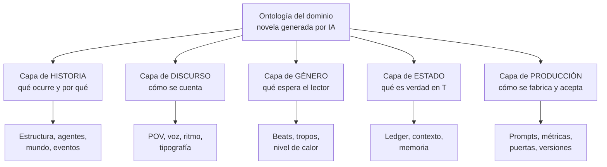
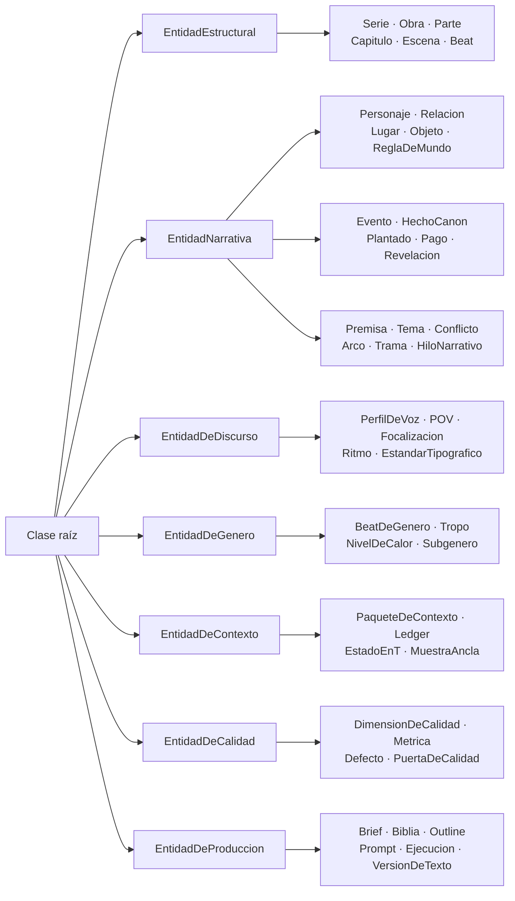
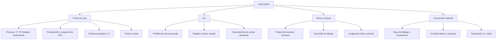
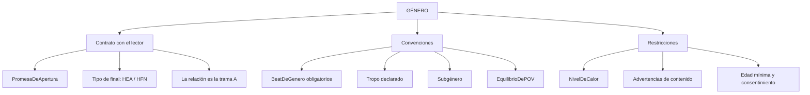
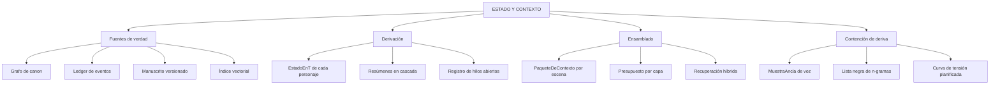
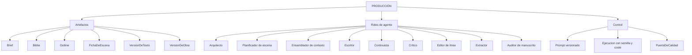
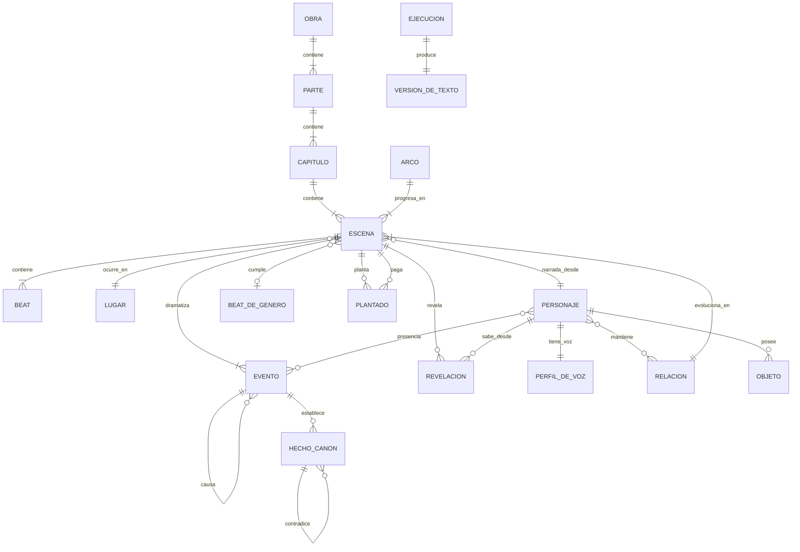
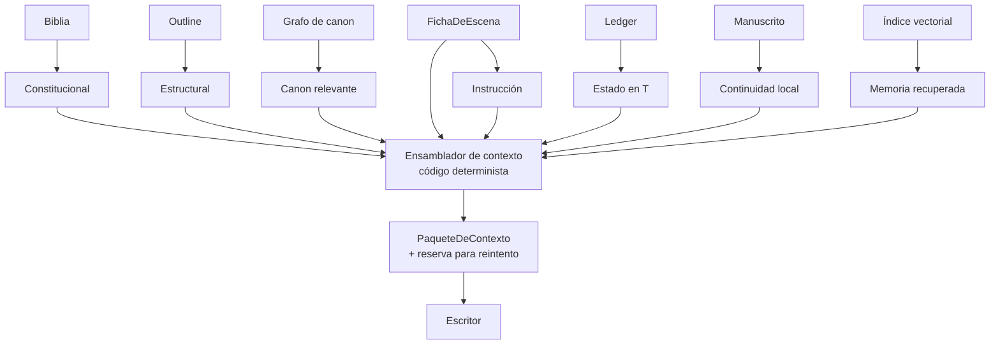
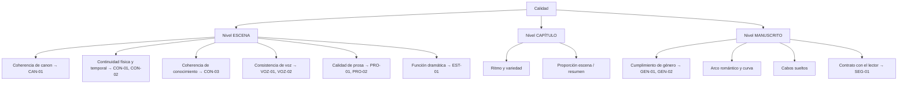

# Ontología de generación de novelas con IA — Documento de definiciones

**Versión:** 1.1 · **Fecha:** 2026-09-21 · **Dominio:** generación asistida de novela larga, género de referencia: romance

---

## 1. Propósito

Este documento define el vocabulario controlado del dominio: qué clases existen, qué atributos tiene cada una, qué relaciones las unen y qué restricciones deben cumplirse. Es la referencia normativa para el esquema de datos, los prompts, las rúbricas de evaluación y la comunicación del equipo.

Los mismos contenidos en forma de árboles y grafos Mermaid están en el **§14** de este documento.

**Registro de cambios**

| Versión | Qué cambió |
| --- | --- |
| 1.0 | Primera versión de la ontología |
| 1.1 | Entra el `Auditor de manuscrito` en los roles (§9) y `VersionDeObra` en producción. `Prompt` pasa a ser fichero con `hash`. Se retira lo que era mecanismo y vivía duplicado con `architecture.md`: topes y reglas de ensamblado del paquete, contención de deriva, columna «Puerta», política de reintentos, entradas y salidas de los roles, lista de almacenes y gobernanza operativa |

---

## 2. Convenciones de notación

| Convención | Significado |
| --- | --- |
| `NombreDeClase` | Clase (entidad) de la ontología, en PascalCase |
| `nombre_de_atributo` | Atributo, en snake_case |
| `predicado` | Relación entre dos clases, en minúscula |
| `xxx_id` | Identificador único y estable de una instancia |
| **[fijo]** | Valor establecido en la biblia; solo cambia con versión nueva de obra |
| **[móvil]** | Valor que cambia a lo largo del manuscrito; se deriva del ledger |
| **[derivado]** | Valor que nunca se escribe a mano: se calcula |
| 1, 0..1, 1..\*, 0..\* | Cardinalidad de la relación |

## 3. Las cinco capas del modelo

La ontología se organiza en cinco capas. Cada una falla de forma distinta y se controla con mecanismos distintos, por lo que no deben mezclarse en la misma estructura de datos.

| Capa | Pregunta que responde | Volatilidad | Mecanismo de control |
| --- | --- | --- | --- |
| **Historia** (fábula) | ¿Qué ocurre y por qué? | Baja | Outline aprobado |
| **Discurso** (sjuzhet) | ¿Cómo se cuenta? | Baja pero global | Restricciones duras por escena |
| **Género** | ¿Qué espera el lector? | Fija por contrato | Cobertura de beats obligatorios |
| **Estado** | ¿Qué es verdad en el instante T? | Alta | Ledger de eventos + derivación |
| **Producción** | ¿Cómo se fabrica y se acepta? | Alta | Versionado, métricas, puertas |

---

## 4. Capa de Historia

### 4.1 Estructura de la obra

#### `Serie`
Conjunto de obras que comparten canon, personajes o mundo.
- `serie_id`, `titulo`, `orden_de_lectura`, `canon_compartido`, `personajes_recurrentes`
- **Nota:** si existe `Serie`, el grafo de canon es compartido entre obras desde el primer día; añadirlo después obliga a reescribir referencias.

#### `Obra`
La novela individual. Raíz de casi todo el grafo.
- `obra_id`, `titulo`, `logline`, `premisa`, `tema`, `genero`, `subgenero`, `extension_objetivo`, `publico_objetivo`, `promesa_de_apertura`, `tipo_de_final` **[fijo]**
- Parámetros de discurso heredados por todas sus escenas: `persona`, `tiempo_verbal`, `esquema_de_pov`, `nivel_de_calor`

#### `Parte` (Acto)
Agrupación macroestructural con una función dramática propia.
- `parte_id`, `numero`, `funcion_estructural`, `giro_que_la_cierra`, `porcentaje_del_manuscrito`
- Criterio de cierre: un cambio irreversible en la situación de los protagonistas.

#### `Capitulo`
Unidad de lectura y de ritmo; es donde el lector decide si sigue.
- `capitulo_id`, `numero`, `titulo`, `pov_dominante`, `gancho_de_apertura`, `tipo_de_corte_final`, `extension_objetivo` (típicamente 2.500–4.000 palabras)
- Criterio de cierre: corta en tensión, en pregunta o en revelación.

#### `Escena`
**Unidad atómica de generación.** Es el mayor fragmento que cabe cómodamente en una llamada y el menor que tiene sentido narrativo completo: POV único, lugar continuo, tiempo continuo.
- `escena_id`, `orden_discurso`, `tiempo_historia`, `elapsed_desde_anterior`
- `pov` (1 personaje), `lugar`, `presentes[]`, `mencionados[]`
- `objetivo_del_pov`, `obstaculo`, `resultado` ∈ {sí, no, sí-pero, no-y-además}
- `valor_entrada`, `valor_salida` (el **giro de valor**)
- `extension_objetivo`, `densidad_de_dialogo_objetivo`, `distancia_psiquica`
- `beat_de_genero` (0..1), `planta[]`, `paga[]`, `revela[]`
- **Regla:** una escena sin giro de valor es relleno. Es la primera validación automática que conviene implementar.

#### `Beat`
Unidad mínima de acción–reacción dentro de la escena.
- `beat_id`, `accion`, `reaccion`, `subtexto`, `orden`
- Criterio: cada beat debe provocar el siguiente.

### 4.2 Núcleo dramático

#### `Premisa`
Frase que contiene protagonista, deseo, obstáculo y lo que hay en juego.

#### `Tema`
Pregunta moral que la novela discute. Se dramatiza, nunca se enuncia.

#### `Conflicto`
- `tipo` ∈ {interno, interpersonal, social, situacional}
- `partes_implicadas`, `incompatibilidad_central`, `escala_de_lo_que_esta_en_juego`

#### `Arco`
Serie temporal de cambio de una entidad a lo largo del manuscrito.
- `arco_id`, `tipo` ∈ {romántico, interno_A, interno_B, trama_B, trama_C}, `estado_inicial`, `estado_final`, `puntos_de_inflexion[]`
- El **arco romántico** es, operativamente, la serie temporal de `temperatura` de una `Relacion`.

#### `Trama` / `Subtrama`
- `nivel` ∈ {A (romance), B (secundaria), C (terciaria)}, `hilos[]`, `porcentaje_de_escenas`

### 4.3 Agentes

#### `Personaje`
La entidad más cara de mantener porque tiene parte fija y parte móvil. Separarlas es obligatorio.

**Parte fija [fijo]** — vive en la biblia:
- `pj_id`, `nombre`, `apodos[]`, `edad`, `fisico_invariable`, `profesion`, `familia`, `historia_previa`
- `herida_original`: el suceso pasado que explica su conducta defensiva
- `mentira_que_se_cree`: la creencia falsa que debe abandonar
- `deseo_consciente` (lo que persigue) vs. `necesidad_inconsciente` (lo que le falta)
- `miedo_central`, `competencias[]`, `limitaciones[]`
- `rol_narrativo` ∈ {protagonista, coprotagonista, antagonista, aliado, catalizador, figurante}

**Parte móvil [móvil/derivado]** — vive en el ledger de estado:
- `ubicacion_actual`, `apariencia_del_dia`, `estado_emocional`, `heridas_fisicas`
- `conocimientos[]` (qué sabe y desde qué escena), `creencias_falsas[]`, `secretos_que_oculta[]`
- `ultima_interaccion_con[]`

#### `PerfilDeVoz`
Se modela **aparte** del personaje: así se puede auditar el estilo sin tocar el canon.
- `lexico_propio[]`, `muletillas[]`, `longitud_media_de_frase`, `registro`, `uso_de_tacos`
- `temas_que_evita[]`, `modo_de_mentir`, `humor`, `ritmo_de_pensamiento`
- **Prueba de validez:** dado un párrafo sin nombres propios, ¿un clasificador identifica el POV correcto?

#### `Relacion`
Entidad de primera clase, no un atributo del personaje. En romance es el objeto central de la obra.
- `rel_id`, `personaje_a`, `personaje_b`, `tipo` ∈ {romántica, familiar, laboral, amistad, rivalidad}
- `temperatura` (0–10) **[móvil]**, `conflicto_central`, `deuda_emocional`, `historia_compartida`
- `asimetria_de_informacion`: qué sabe A de B y viceversa
- `ultima_interaccion` (escena)

### 4.4 Mundo

#### `Lugar`
- `lug_id`, `nombre`, `tipo`, `sensorialidad_fija` (olor, luz, sonido, temperatura)
- `accesos` (quién puede entrar), `distancias_a[]` con `tiempo_de_viaje`
- **Uso:** los tiempos de viaje son lo que permite detectar el defecto de teletransporte.

#### `Objeto`
- `obj_id`, `nombre`, `dueno_actual` **[móvil]**, `ubicacion_actual` **[móvil]**
- `estado` ∈ {intacto, roto, perdido, oculto, destruido} **[móvil]**
- `carga_simbolica`, `escena_de_plantado`, `escena_de_pago`
- **Regla:** todo objeto plantado con importancia alta necesita escena de pago o justificación explícita.

#### `ReglaDeMundo`
Restricción del universo ficcional (magia, tecnología, norma social, jerarquía).
- `regla_id`, `enunciado`, `alcance`, `excepciones[]`, `escena_en_que_se_establece`

#### `Cronologia`
- `tiempo_historia` (cuándo ocurre en la ficción) vs. `orden_discurso` (en qué posición se cuenta)
- **Regla de diseño:** son dos relojes distintos. Sin separarlos, cualquier analepsis rompe el cálculo de estado.

### 4.5 Eventos e información

#### `Evento`
- `evt_id`, `descripcion`, `tiempo_historia`, `lugar`, `participantes[]`, **`testigos[]`**
- `causa` (0..\*), `consecuencia` (0..\*)
- **Clave:** de `testigos[]` se deriva quién puede saber el hecho después. Es el mecanismo que evita que un personaje use información que no debería tener.

#### `HechoCanon`
Cualquier afirmación declarada verdadera: color de ojos, apellido, fecha, regla.
- `hc_id`, `entidad`, `atributo`, `valor`, `escena_de_origen`, `confianza`
- **Regla de arbitraje:** si dos hechos sobre el mismo atributo difieren, prevalece el de menor `orden_discurso`; el otro es un defecto CAN-01.

#### `Plantado`
Dato sembrado sin explicar, destinado a cobrarse más adelante.
- `escena_de_origen`, `importancia` ∈ {alta, media, decorativa}, `escena_de_pago_prevista`

#### `Pago`
Escena que cobra un plantado y satisface la expectativa creada.

#### `Revelacion`
Dato que cambia la interpretación de lo ya leído.
- `escena`, `destinatario` ∈ {personaje X, lector, ambos}, `efecto_sobre_la_relacion`

#### `HiloNarrativo`
Pregunta abierta que el lector arrastra.
- `hilo_id`, `pregunta`, `escena_de_apertura`, `escena_de_cierre`, `estado` ∈ {abierto, pagado, vencido}

#### `EstadoEnT` **[derivado]**
Conjunto de hechos móviles verdaderos justo antes de una escena. **Nunca se escribe a mano:** se recalcula aplicando en orden los eventos confirmados. Si se edita manualmente, se desincroniza del texto ya escrito.

---

## 5. Capa de Discurso

Se declara una vez a nivel de `Obra` y se impone en cada escena como restricción dura.

| Clase / atributo | Valores | Nivel de decisión | Defecto si deriva |
| --- | --- | --- | --- |
| `persona` | 1ª, 3ª limitada, 3ª omnisciente | Obra | Cambio de persona a media novela |
| `focalizacion` | POV único por escena, alternancia por capítulo | Obra + Escena | Salto de cabeza (*head-hopping*) |
| `tiempo_verbal` | pasado, presente | Obra | Mezcla dentro del párrafo |
| `distancia_psiquica` | 1 (lejana) … 5 (flujo interior) | Escena | Escena íntima narrada desde lejos |
| `proporcion_escena_resumen` | % dramatizado / % narrado | Capítulo | La novela se vuelve sinopsis |
| `densidad_de_dialogo` | % de líneas dialogadas | Escena | Bloques de introspección sin acción |
| `registro` | formal, coloquial, léxico vetado | Obra | Anacronismos, léxico fuera de país |
| `ritmo` | longitud media de frase y párrafo por tipo de escena | Escena | Clímax escrito con frases largas |

#### `EstandarTipografico`
Entidad propia por ser fuente constante de defectos cuando el modelo arrastra convenciones inglesas.
- Raya de diálogo (—), incisos del narrador, comillas latinas (« »), sangrías, tratamiento tú/usted por relación.

---

## 6. Capa de Género (romance)

El romance tiene el contrato más explícito del mercado: **la relación es la trama principal y el final debe ser emocionalmente satisfactorio.** Incumplirlo no es innovación, es devolución.

#### `BeatDeGenero`
Hito obligatorio con posición esperada en el manuscrito.

| Beat | Posición | Qué debe ocurrir |
| --- | --- | --- |
| Presentación de carencias | 0–8 % | Se ve la herida y la vida incompleta de cada protagonista |
| Encuentro | 8–12 % | Primer contacto con chispa y fricción simultáneas |
| Punto de no retorno | 20–25 % | Algo los obliga a seguir juntos |
| Diversión y juegos | 25–50 % | Se cumple la promesa del tropo; crece la intimidad |
| Punto medio | ~50 % | Beso, confesión o falsa victoria que sube lo que hay en juego |
| La grieta | 50–70 % | La mentira interna empieza a costar |
| Ruptura / noche oscura | 70–80 % | Separación creíble, causada por la herida, no por un malentendido evitable |
| Revelación interior | 80–90 % | Cada uno entiende qué debe ceder |
| Gran gesto | 90–97 % | Acto de riesgo que demuestra el cambio |
| HEA / HFN | 97–100 % | Cierre del arco romántico y del arco interno |

#### `Tropo`
Enemigos a amantes, segunda oportunidad, matrimonio de conveniencia, solo hay una cama, amigos a amantes, romance falso.
- Impone escenas obligatorias y expectativas concretas.
- **Regla:** el tropo declarado debe aparecer **dramatizado**, no solo mencionado.

#### `NivelDeCalor`
Escala declarada: puerta cerrada → sensual → abierto → explícito.
- Se aplica como restricción dura: el validador rechaza la escena que la excede aunque el texto sea bueno.

#### `Subgenero`
Contemporáneo, histórico, *romantasy*, *romcom*, romántica de suspense. Condiciona léxico, escenario y tolerancia al humor.

#### `PromesaDeApertura`
Lo que las primeras 1.000 palabras prometen al lector. Se verifica su cumplimiento al cerrar el manuscrito.

#### `EquilibrioDePOV`
En romance dual, reparto de escenas entre los dos protagonistas (habitualmente 45/55 o más equilibrado).

---

## 7. Capa de Estado y Contexto

El problema central: la novela terminada no cabe en la ventana y, aunque cupiera, meterla entera empeora el resultado — el modelo imita lo reciente y diluye lo importante.

#### `PaqueteDeContexto`
Lo que se envía al modelo para escribir **una** escena. Se ensambla por código (determinista y auditable), no por modelo.

Sus ocho capas, que son vocabulario de todo el sistema: **constitucional**, **estructural**, **canon relevante**, **estado en T**, **continuidad local**, **memoria recuperada**, **instrucción** y **reserva**.

> El tope en tokens de cada capa, el orden de recorte y las reglas de ensamblado son mecanismo, no definición: viven en `architecture.md` §2.1, y la correspondencia entre capa y almacén en su §4.8. Aquí no se repiten, para que no diverjan.

#### `MuestraAncla`
Fragmento de prosa ya aprobada que se inyecta como referencia de voz. Es la contención principal de la deriva estilística.

#### `Ledger`
Log *append-only* de eventos confirmados. Fuente de la derivación de estado. Con *snapshots* cada N escenas para acelerar la reconstrucción.

#### `Deriva`
Alejamiento progresivo del texto respecto de lo declarado. Cinco tipos:

| Tipo | Síntoma |
| --- | --- |
| De voz | El capítulo 20 no suena como el 3 |
| De hechos | Cambian ojos, apellidos, distancias |
| De ritmo | Todas las escenas duran y acaban igual |
| De tensión | La relación avanza en línea recta |
| De léxico | Reaparecen los mismos gestos y metáforas |

> Cómo se contiene cada una es mecanismo: `architecture.md` §4 y §8.3. Por qué ocurren, `domain-knowledge.md` §10.

---

## 8. Capa de Calidad

Tres piezas: **dimensiones** (qué se juzga), **métricas** (cómo se mide), **defectos** (qué se repara). Cada dimensión se evalúa en el nivel donde el fallo es visible.

#### `DimensionDeCalidad`

| Dimensión | Nivel | Medición |
| --- | --- | --- |
| Coherencia de canon | Escena | Extracción de afirmaciones vs. grafo  |
| Continuidad física y temporal | Escena | Validador de estado y tiempos de viaje  |
| Coherencia de conocimiento | Escena | ¿Existe `sabe_desde` previo?  |
| Consistencia de voz | Escena | Distancia a muestras ancla; clasificador de POV  |
| Calidad de prosa | Escena | Repetición, muletillas, variedad sintáctica, clichés  |
| Función dramática | Escena | Juez LLM con rúbrica: objetivo, obstáculo, giro  |
| Diálogo | Escena | % dialogado, subtexto, voces distinguibles sin acotación  |
| Ritmo y variedad | Capítulo | Longitud de escenas, escena/resumen, curva de tensión  |
| Arco romántico | Manuscrito | Curva de temperatura por escena  |
| Cumplimiento de género | Manuscrito | Cobertura de beats y del tropo  |
| Cabos sueltos | Manuscrito | Plantados sin pago, hilos vencidos  |
| Contrato con el lector | Manuscrito | Nivel de calor, temas sensibles, advertencias  |

#### `Metrica` — automáticas y baratas
- **Repetición:** trigramas y cuatrigramas repetidos entre escenas (detecta prosa de plantilla).
- **Tics corporales:** ojos, cejas, mandíbulas, respiraciones y estómagos por cada 1.000 palabras.
- **Variedad sintáctica:** desviación típica de longitud de frase; frases que empiezan igual.
- **Densidad de nombres propios:** repetir el nombre en vez de usar pronombres es marcador claro de texto generado.
- **Deriva de estilo:** distancia entre el vector de estilo de la escena N y la media de las aprobadas.
- **Curva emocional:** tensión e intimidad por escena, comparadas con la curva planificada.

> Las métricas automáticas detectan lo mecánico; el juez LLM con rúbrica valora función dramática y subtexto; el humano decide sobre voz y gusto. El juez debe calibrarse contra escenas etiquetadas por el editor, y recalibrarse al cambiar de modelo.

#### `Defecto` — taxonomía y reparación

| Código | Defecto | Reparación típica |
| --- | --- | --- |
| CAN-01 | Contradicción de canon | Reescritura local citando el hecho correcto |
| CON-01 | Teletransporte o salto temporal | Añadir transición o corregir el lugar |
| CON-02 | Objeto resucitado o desaparecido | Corregir inventario o plantar la recuperación |
| CON-03 | Personaje sabe lo que no debería | Reescribir el diálogo o adelantar la revelación |
| VOZ-01 | POV que percibe lo imposible | Recortar a lo perceptible por el POV |
| VOZ-02 | Salto de cabeza | Dividir en dos escenas o reencuadrar |
| PRO-01 | Muletilla o cliché recurrente | Sustitución dirigida; ampliar lista negra |
| PRO-02 | Resumen donde tocaba escena | Dramatizar el pasaje |
| EST-01 | Escena sin giro de valor | Reescribir con objetivo y obstáculo, o eliminarla |
| GEN-01 | Beat obligatorio ausente o fuera de sitio | Insertar o recolocar escena |
| GEN-02 | Ruptura por malentendido evitable | Reescribir la causa desde la herida del personaje |
| SEG-01 | Nivel de calor o tema fuera de contrato | Reescritura obligatoria, sin excepción |

#### `PuertaDeCalidad`
Condición que una unidad debe cumplir para avanzar de fase. Qué puertas existen, qué bloquea cada una y la política de reparación son mecanismo: `architecture.md` §8.3.

---

## 9. Capa de Producción

| Clase | Definición | Atributos clave |
| --- | --- | --- |
| `Brief` | Encargo inicial | Género, tropo, tono, extensión, referencias |
| `Biblia` | Conjunto de hechos fijos, decididos antes de escribir | Versionada; cambiarla crea una `VersionDeObra` |
| `Outline` | Plan jerárquico partes → capítulos → escenas | Cobertura de beats, curva de tensión |
| `FichaDeEscena` | Contrato de generación de una escena | Ver §4.1 `Escena` |
| `Prompt` | Plantilla por rol de agente, **versionada como fichero del repositorio** | `prompt_id`, `version`, `rol`, `hash` |
| `Ejecucion` | Una llamada al modelo | `run_id`, escena, prompt con su `hash`, modelo, semilla, parámetros, coste, métricas, veredicto |
| `VersionDeTexto` | Texto inmutable de una escena | `version`, `vigente`, `run_id` de origen |
| `VersionDeObra` | Estado congelado de la biblia con el que se escribió un tramo del manuscrito | `version_obra_id`, `biblia`, `vigente_desde`; cada `Escena` apunta a la suya |

**Roles de agente.** Nueve, y estos son sus nombres, que es lo que fija este documento:

`Arquitecto` · `Planificador de escena` · `Ensamblador de contexto` · `Escritor` · `Continuista` · `Crítico` · `Editor de línea` · `Extractor` · **`Auditor de manuscrito`**

> Qué recibe y qué produce cada uno, qué almacenes puede tocar y por qué están separados es mecanismo: `architecture.md` §7 y §3.5. El **Auditor de manuscrito** revisa el manuscrito cerrado —cobertura de beats, plantados sin pago, curva de temperatura, contrato de género— y **solo produce un informe: no escribe en ningún almacén**.

Los almacenes en los que vive todo esto están enumerados en `architecture.md` §5.5.

---

## 10. Catálogo de relaciones (predicados)

| Sujeto | Predicado | Objeto | Cardinalidad | Para qué sirve |
| --- | --- | --- | --- | --- |
| `Obra` | contiene | `Parte` | 1..\* | Estructura |
| `Parte` | contiene | `Capitulo` | 1..\* | Estructura |
| `Capitulo` | contiene | `Escena` | 1..\* | Ritmo y extensión |
| `Escena` | ocurre_en | `Lugar` | 1 | Coherencia geográfica y sensorial |
| `Escena` | narrada_desde | `Personaje` | 1 | Filtrar qué puede percibirse |
| `Escena` | dramatiza | `Evento` | 1..\* | Distinguir escena de resumen |
| `Escena` | cumple | `BeatDeGenero` | 0..1 | Cobertura del contrato de género |
| `Escena` | planta | `Plantado` | 0..\* | Auditoría de cabos sueltos |
| `Escena` | paga | `Plantado` | 0..\* | Cierre de expectativas |
| `Escena` | revela | `Revelacion` | 0..\* | Gestión de la información |
| `Personaje` | presencia | `Evento` | 0..\* | Derivar el estado de conocimiento |
| `Personaje` | sabe_desde | `Revelacion` @ `Escena` | 0..\* | Evitar que sepa lo que no debería |
| `Personaje` | desea / necesita | `Objetivo` | 1 / 1 | Motor del arco interno |
| `Personaje` | mantiene | `Relacion` | 0..\* | Serie temporal de temperatura |
| `Personaje` | posee | `Objeto` | 0..\* | Inventario y continuidad física |
| `Personaje` | tiene_voz | `PerfilDeVoz` | 1 | Auditoría de estilo independiente |
| `Evento` | causa | `Evento` | 0..\* | Cadena causal, no solo cronológica |
| `Evento` | establece | `HechoCanon` | 0..\* | Trazabilidad del canon |
| `HechoCanon` | contradice | `HechoCanon` | 0..\* | Alerta de continuidad |
| `Arco` | progresa_en | `Escena` | 1..\* | Curva de tensión e intimidad |
| `Relacion` | evoluciona_en | `Escena` | 1..\* | Arco romántico medible |
| `Ejecucion` | produce | `VersionDeTexto` | 1 | Trazabilidad y reproducibilidad |

---

## 11. Axiomas y restricciones de integridad

El validador debe poder comprobar mecánicamente:

1. Un personaje solo puede referirse a un hecho si existe `sabe_desde` con escena anterior a la actual.
2. Todo `Plantado` de importancia alta debe tener un `Pago` antes del final.
3. Dos `HechoCanon` sobre el mismo atributo de la misma entidad no pueden diferir; si difieren, prevalece el de menor `orden_discurso` y el otro es un defecto.
4. Un personaje no puede estar en dos lugares en el mismo tramo de tiempo, ni desplazarse entre lugares en menos del `tiempo_de_viaje` declarado.
5. Un `Objeto` en estado `perdido`, `roto` o `destruido` no puede usarse hasta un evento que lo recupere o repare.
6. Cada `BeatDeGenero` obligatorio se asigna a exactamente una `Escena`.
7. El arco romántico no puede resolverse antes del 90 % del manuscrito.
8. Toda `Escena` tiene exactamente un `pov` y un `giro_de_valor` no nulo.
9. Ningún contenido romántico o sexual con personajes menores de 18 años (validación de esquema, no instrucción de prompt).
10. Ninguna escena puede exceder el `nivel_de_calor` declarado en la `Obra`.

---

## 12. Gobernanza

- **Edad de los personajes:** regla dura, sin excepción narrativa.
- **Nivel de calor:** declarado en la obra y respetado sin excepción.
- **Consentimiento y dinámicas de poder:** consentimiento explícito y entusiasta en escenas íntimas; atención a desequilibrios (jefe/empleada, médico/paciente).
- **Advertencias de contenido:** catálogo de temas sensibles (duelo, adicción, violencia, pérdida gestacional) declarado por obra.
- **Sesgos y representación:** auditar estereotipos en físico, profesiones y acentos; el modelo tiende al promedio del corpus.
- **Originalidad:** los tropos son libres, la expresión concreta no. Detección de solapamiento léxico alto con obras conocidas.
- **Trazabilidad de autoría:** cada parte del texto es atribuible a una persona o a una generación.
- **Datos de entrada:** si se usan obras del cliente como referencia de estilo, acordar derechos y no incorporarlas a índices compartidos entre proyectos.

---

## 13. Glosario rápido

| Término | Definición operativa |
| --- | --- |
| Biblia | Hechos fijos de la obra, no modificables sin versión nueva |
| Canon | Todo hecho declarado verdadero, de la biblia o del texto aprobado |
| Escena | Unidad atómica de generación: POV único, lugar y tiempo continuos, giro de valor |
| Beat | Unidad mínima de acción–reacción |
| Beat de género | Hito obligatorio del contrato del género, con posición esperada |
| Giro de valor | Cambio de signo del estado emocional o situacional en la escena |
| Plantado / pago | Dato sembrado sin explicar y escena posterior que lo cobra |
| Estado en T | Hechos móviles verdaderos justo antes de una escena |
| Ledger | Log append-only de eventos confirmados |
| Paquete de contexto | Lo que se envía al modelo para escribir una escena concreta |
| Deriva | Alejamiento progresivo del texto respecto de las normas declaradas |
| Puerta de calidad | Condición que una unidad debe cumplir para avanzar de fase |
| HEA / HFN | *Happily ever after* / *happy for now*: finales admisibles en romance |
| Nivel de calor | Escala declarada de explicitud sexual |
| Muestra ancla | Fragmento de prosa aprobada usado como referencia de voz |

---

## 14. Árboles y grafos de la ontología

Los mismos contenidos de este documento en forma visual. **Los diagramas no declaran nada:** si un diagrama y el texto discrepan, gana el texto y el diagrama está desactualizado.

Sintaxis Mermaid; se renderiza en GitHub, GitLab, Obsidian, Notion y VS Code con la extensión de Mermaid.

### 14.1 Mapa general de las cinco capas

Cada capa falla de forma distinta y se controla con mecanismos distintos, por lo que no se mezclan en la misma estructura de datos (§3).

### 14.2 Árbol taxonómico de clases

### 14.3 Árbol de la capa de Historia

```mermaid
flowchart TD
  H["HISTORIA"]
  H --> H1["Estructura"]
  H --> H2["Núcleo dramático"]
  H --> H3["Agentes"]
  H --> H4["Mundo"]
  H --> H5["Eventos e información"]

  H1 --> H11["Serie"]
  H1 --> H12["Obra"]
  H1 --> H13["Parte / Acto"]
  H1 --> H14["Capitulo"]
  H1 --> H15["Escena"]
  H1 --> H16["Beat"]

  H2 --> H21["Premisa · Logline"]
  H2 --> H22["Tema"]
  H2 --> H23["Conflicto"]
  H2 --> H24["Arco"]
  H2 --> H25["Trama y subtramas"]

  H3 --> H31["Personaje"]
  H3 --> H32["Relacion"]

  H4 --> H41["Lugar"]
  H4 --> H42["Objeto"]
  H4 --> H43["ReglaDeMundo"]
  H4 --> H44["Cronologia"]

  H5 --> H51["Evento"]
  H5 --> H52["HechoCanon"]
  H5 --> H53["Plantado y Pago"]
  H5 --> H54["Revelacion"]
  H5 --> H55["HiloNarrativo"]
```

### 14.4 Árbol de la capa de Discurso

### 14.5 Árbol de la capa de Género

### 14.6 Árbol de la capa de Estado y contexto

### 14.7 Árbol de la capa de Producción

> Este árbol recoge qué clases existen. El catálogo operativo de los roles, con sus permisos, está en `architecture.md` §7 y §3.5.

### 14.8 Grafo de relaciones

Los mismos predicados y cardinalidades del §10, en forma de grafo.

### 14.9 Composición del paquete de contexto

> **Los topes por capa no están en el diagrama a propósito.** La tabla normativa en valores absolutos es `architecture.md` §2.1, y la correspondencia entre almacén y capa es `architecture.md` §4.8. Duplicar los números en un diagrama garantiza que se desincronicen.

### 14.10 Árbol de calidad

Qué se juzga en cada nivel y qué código de defecto produce. Detalle en el §8.

