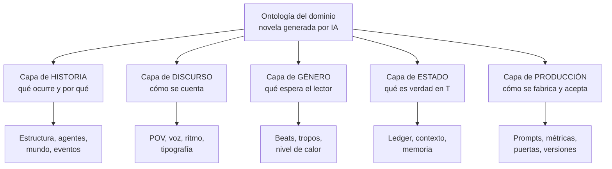
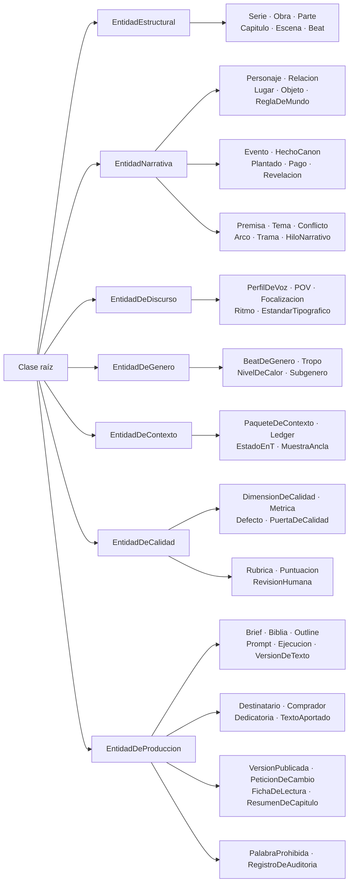
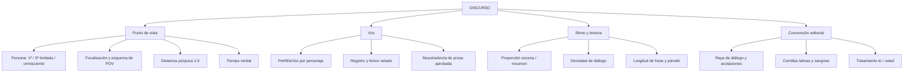
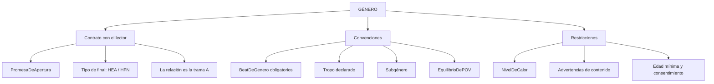
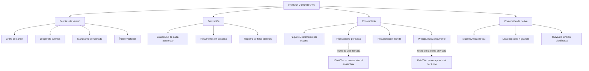
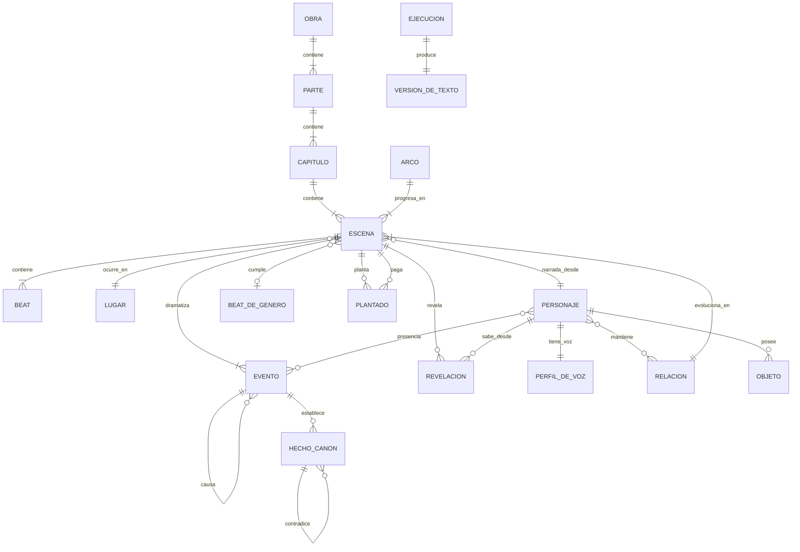
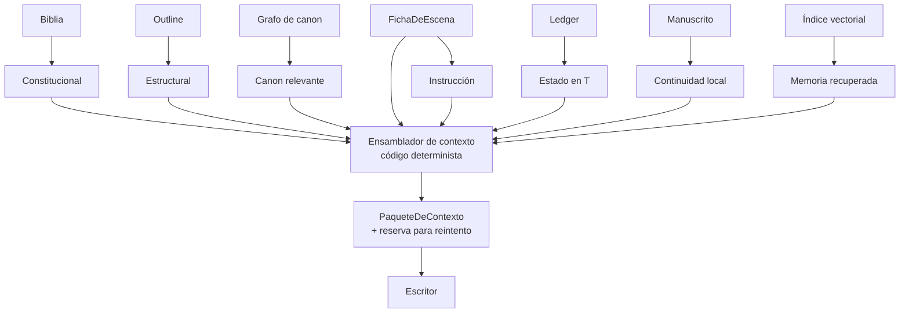

# Ontología de generación de novelas con IA — Documento de definiciones

**Versión:** 2.0 · **Fecha:** 2026-09-23 · **Dominio:** generación asistida de **novela personalizada de regalo**, género de referencia: romance

---

## 1. Propósito

Este documento define el vocabulario controlado del dominio: qué clases existen, qué atributos tiene cada una, qué relaciones las unen y qué restricciones deben cumplirse. Es la referencia normativa para el esquema de datos, los prompts, las rúbricas de evaluación y la comunicación del equipo.

Los mismos contenidos en forma de árboles y grafos Mermaid están en el **§14** de este documento.

**Registro de cambios**

| Versión | Qué cambió |
| --- | --- |
| 1.0 | Primera versión de la ontología |
| 1.1 | Entra el `Auditor de manuscrito` en los roles (§9) y `VersionDeObra` en producción. `Prompt` pasa a ser fichero con `hash`. Se retira lo que era mecanismo y vivía duplicado con `architecture.md`: topes y reglas de ensamblado del paquete, contención de deriva, columna «Puerta», política de reintentos, entradas y salidas de los roles, lista de almacenes y gobernanza operativa |
| 1.2 | `Defecto` deja de ser una tabla de códigos y pasa a clase con atributos (§8): la `cita` se ancla por desplazamiento a una `VersionDeTexto` y `hecho_canon_id` es obligatorio en `CAN-01`. Entran el término `Cita` (§8 y §13), los predicados `señala` y `choca_con` (§10) y los axiomas 11 y 12 (§11) |
| 1.3 | Entra el código `VOZ-03` en la taxonomía (§8) y el axioma 13 (§11): la prosa debe usar la `persona` y el `tiempo_verbal` declarados en la `Obra`. Cubre un hueco detectado al cruzar las restricciones duras contra sus validadores —las dos se fijaban en la obra, se heredaban a la ficha y se repetían en el prompt, pero ningún validador las comprobaba en el texto |
| **2.0** | **El producto deja de ser «una novela» y pasa a ser «una novela para alguien».** Cambio mayor, no aditivo, al cruzar el documento contra `docs/entregable/examen-final.md`. Entran: la **personalización** como capa de primera clase (`Destinatario`, `Comprador`, `Dedicatoria`, `TextoAportado`), la **entrega** (`VersionPublicada`, `PeticionDeCambio`, `FichaDeLectura`), los **guardarraíles** (`PalabraProhibida`, `RegistroDeAuditoria`), la **evaluación con rúbrica** (`Rubrica`, `Puntuacion`, `RevisionHumana`) y el **resumen por capítulo**. `Cronologia` deja de ser un concepto y pasa a estructura consultable, porque es la entrada del validador formal. Y se corrigen dos cosas que impedían cumplir: `HechoCanon` ya no exige escena de origen —un hecho del brief no tiene ninguna— y registra **en qué capítulos se usa**; `Capitulo` pasa a 1.000–1.500 palabras y a contener **exactamente una** `Escena`. Detalle del porqué en §15 |

| **2.1** | Entran **`PresupuestoConcurrente`** (§9) y **`CuadroDeDefectos`** (§9.2), con sus tres entradas de glosario (§13) y su sitio en los árboles (§14.6 y §14.7). Los dos salen de decisiones de `maujimenez4` del 2026-09-23 sobre `specs/001-backend-v1/`: P-06 admite el paralelismo, y con él la suma de tokens en vuelo pasa a ser una magnitud calculable que hay que nombrar; P-04 da nombre al conjunto de defectos que se guarda con una versión publicada. **Aditiva:** no retira ni redefine nada de la v2.0 |

*La v1.2 se commiteó en `aa47bd0`, junto a la v1.3 de `architecture.md` y la v3.0 de `verification.md`. El mensaje de ese commit solo describe la tercera, así que este registro es la vía para localizarla: no se busque por el asunto del commit.*

---

## 2. Convenciones de notación

| Convención | Significado |
| --- | --- |
| `NombreDeClase` | Clase (entidad) de la ontología, en PascalCase |
| `nombre_de_atributo` | Atributo, en snake_case |
| `predicado` | Relación entre dos clases, en minúscula |
| `xxx_id` | Identificador único y estable de una instancia |
| **[fijo]** | Valor establecido en la biblia; solo cambia con versión nueva de obra |
| **[móvil]** | Valor que cambia a lo largo del manuscrito; se deriva del ledger |
| **[derivado]** | Valor que nunca se escribe a mano: se calcula |
| 1, 0..1, 1..\*, 0..\* | Cardinalidad de la relación |

## 3. Las cinco capas del modelo

La ontología se organiza en cinco capas. Cada una falla de forma distinta y se controla con mecanismos distintos, por lo que no deben mezclarse en la misma estructura de datos.

| Capa | Pregunta que responde | Volatilidad | Mecanismo de control |
| --- | --- | --- | --- |
| **Historia** (fábula) | ¿Qué ocurre y por qué? | Baja | Outline aprobado |
| **Discurso** (sjuzhet) | ¿Cómo se cuenta? | Baja pero global | Restricciones duras por escena |
| **Género** | ¿Qué espera el lector? | Fija por contrato | Cobertura de beats obligatorios |
| **Estado** | ¿Qué es verdad en el instante T? | Alta | Ledger de eventos + derivación |
| **Producción** | ¿Cómo se fabrica, se acepta **y para quién**? | Alta | Versionado, métricas, puertas |

**La personalización no es una sexta capa.** Vive dentro de Producción (§9.1) porque falla como falla la producción —se detecta contando y contrastando, y se corrige regenerando— y no como falla la historia. Meterla en Historia habría convertido al `Destinatario` en un personaje más, que es justo lo que no es.

---

## 4. Capa de Historia

### 4.1 Estructura de la obra

#### `Serie`
Conjunto de obras que comparten canon, personajes o mundo.
- `serie_id`, `titulo`, `orden_de_lectura`, `canon_compartido`, `personajes_recurrentes`
- **Nota:** si existe `Serie`, el grafo de canon es compartido entre obras desde el primer día; añadirlo después obliga a reescribir referencias.

#### `Obra`
La novela individual. Raíz de casi todo el grafo.
- `obra_id`, `titulo`, `logline`, `premisa`, `tema`, `genero`, `subgenero`, `extension_objetivo`, `publico_objetivo`, `promesa_de_apertura`, `tipo_de_final` **[fijo]**
- Parámetros de discurso heredados por todas sus escenas: `persona`, `tiempo_verbal`, `esquema_de_pov`, `nivel_de_calor`
- `destinatario_id` (0..1) — **de quién es el regalo**. Una obra sin destinatario es legítima; una obra personalizada sin él, no.
- **Extensión de referencia:** diez `Capitulo` de 1.000–1.500 palabras. La complejidad del producto está en el proceso, no en la extensión.

#### `Parte` (Acto)
Agrupación macroestructural con una función dramática propia.
- `parte_id`, `numero`, `funcion_estructural`, `giro_que_la_cierra`, `porcentaje_del_manuscrito`
- Criterio de cierre: un cambio irreversible en la situación de los protagonistas.

#### `Capitulo`
Unidad de lectura y de ritmo; es donde el lector decide si sigue.
- `capitulo_id`, `numero`, `titulo`, `pov_dominante`, `gancho_de_apertura`, `tipo_de_corte_final`, `extension_objetivo` (**1.000–1.500 palabras**)
- `resumen_id` (0..1) — su `ResumenDeCapitulo`, que alimenta el contexto de los siguientes (§9).
- Criterio de cierre: corta en tensión, en pregunta o en revelación.
- **Un capítulo contiene exactamente una `Escena`** (§10). A esta escala coinciden, y separar los dos conceptos sigue valiendo la pena: el capítulo es unidad de **lectura** y la escena unidad de **generación**. Si algún día la extensión crece, la cardinalidad vuelve a `1..*` sin tocar nada más.

#### `Escena`
**Unidad atómica de generación.** Es el mayor fragmento que cabe cómodamente en una llamada y el menor que tiene sentido narrativo completo: POV único, lugar continuo, tiempo continuo.
- `escena_id`, `orden_discurso`, `tiempo_historia`, `elapsed_desde_anterior`
- `pov` (1 personaje), `lugar`, `presentes[]`, `mencionados[]`
- `objetivo_del_pov`, `obstaculo`, `resultado` ∈ {sí, no, sí-pero, no-y-además}
- `valor_entrada`, `valor_salida` (el **giro de valor**)
- `extension_objetivo`, `densidad_de_dialogo_objetivo`, `distancia_psiquica`
- `beat_de_genero` (0..1), `planta[]`, `paga[]`, `revela[]`
- **Regla:** una escena sin giro de valor es relleno. Es la primera validación automática que conviene implementar.

#### `Beat`
Unidad mínima de acción–reacción dentro de la escena.
- `beat_id`, `accion`, `reaccion`, `subtexto`, `orden`
- Criterio: cada beat debe provocar el siguiente.

### 4.2 Núcleo dramático

#### `Premisa`
Frase que contiene protagonista, deseo, obstáculo y lo que hay en juego.

#### `Tema`
Pregunta moral que la novela discute. Se dramatiza, nunca se enuncia.

#### `Conflicto`
- `tipo` ∈ {interno, interpersonal, social, situacional}
- `partes_implicadas`, `incompatibilidad_central`, `escala_de_lo_que_esta_en_juego`

#### `Arco`
Serie temporal de cambio de una entidad a lo largo del manuscrito.
- `arco_id`, `tipo` ∈ {romántico, interno_A, interno_B, trama_B, trama_C}, `estado_inicial`, `estado_final`, `puntos_de_inflexion[]`
- El **arco romántico** es, operativamente, la serie temporal de `temperatura` de una `Relacion`.

#### `Trama` / `Subtrama`
- `nivel` ∈ {A (romance), B (secundaria), C (terciaria)}, `hilos[]`, `porcentaje_de_escenas`

### 4.3 Agentes

#### `Personaje`
La entidad más cara de mantener porque tiene parte fija y parte móvil. Separarlas es obligatorio.

**Parte fija [fijo]** — vive en la biblia:
- `pj_id`, `nombre`, `apodos[]`, `edad`, `fecha_de_nacimiento` (0..1), `fisico_invariable`, `profesion`, `familia`, `historia_previa`
- **Por qué `fecha_de_nacimiento` además de `edad`:** «tiene 34 años» no se puede contrastar contra un evento fechado, y «nació en 1991» sí. Es lo que permite comprobar que la edad declarada en cada evento es coherente con la fecha, que es un invariante del validador formal. Opcional porque no toda obra fecha a sus personajes; **obligatoria si algún evento afirma una edad**.
- `herida_original`: el suceso pasado que explica su conducta defensiva
- `mentira_que_se_cree`: la creencia falsa que debe abandonar
- `deseo_consciente` (lo que persigue) vs. `necesidad_inconsciente` (lo que le falta)
- `miedo_central`, `competencias[]`, `limitaciones[]`
- `rol_narrativo` ∈ {protagonista, coprotagonista, antagonista, aliado, catalizador, figurante}

**Parte móvil [móvil/derivado]** — vive en el ledger de estado:
- `ubicacion_actual`, `apariencia_del_dia`, `estado_emocional`, `heridas_fisicas`
- `conocimientos[]` (qué sabe y desde qué escena), `creencias_falsas[]`, `secretos_que_oculta[]`
- `ultima_interaccion_con[]`

#### `PerfilDeVoz`
Se modela **aparte** del personaje: así se puede auditar el estilo sin tocar el canon.
- `lexico_propio[]`, `muletillas[]`, `longitud_media_de_frase`, `registro`, `uso_de_tacos`
- `temas_que_evita[]`, `modo_de_mentir`, `humor`, `ritmo_de_pensamiento`
- **Prueba de validez:** dado un párrafo sin nombres propios, ¿un clasificador identifica el POV correcto?

#### `Relacion`
Entidad de primera clase, no un atributo del personaje. En romance es el objeto central de la obra.
- `rel_id`, `personaje_a`, `personaje_b`, `tipo` ∈ {romántica, familiar, laboral, amistad, rivalidad}
- `temperatura` (0–10) **[móvil]**, `conflicto_central`, `deuda_emocional`, `historia_compartida`
- `asimetria_de_informacion`: qué sabe A de B y viceversa
- `ultima_interaccion` (escena)

### 4.4 Mundo

#### `Lugar`
- `lug_id`, `nombre`, `tipo`, `sensorialidad_fija` (olor, luz, sonido, temperatura)
- `accesos` (quién puede entrar), `distancias_a[]` con `tiempo_de_viaje`
- **Uso:** los tiempos de viaje son lo que permite detectar el defecto de teletransporte.

#### `Objeto`
- `obj_id`, `nombre`, `dueno_actual` **[móvil]**, `ubicacion_actual` **[móvil]**
- `estado` ∈ {intacto, roto, perdido, oculto, destruido} **[móvil]**
- `carga_simbolica`, `escena_de_plantado`, `escena_de_pago`
- **Regla:** todo objeto plantado con importancia alta necesita escena de pago o justificación explícita.

#### `ReglaDeMundo`
Restricción del universo ficcional (magia, tecnología, norma social, jerarquía).
- `regla_id`, `enunciado`, `alcance`, `excepciones[]`, `escena_en_que_se_establece`

#### `Cronologia` **[derivado]**
Los **dos relojes** y, además, **la proyección consultable que los hace comprobables**.

- `tiempo_historia` (cuándo ocurre en la ficción) vs. `orden_discurso` (en qué posición se cuenta)
- **Regla de diseño:** son dos relojes distintos. Sin separarlos, cualquier analepsis rompe el cálculo de estado.

**Como estructura**, la cronología es la proyección de los `Evento` del ledger con lo mínimo para razonar sobre el tiempo: por cada evento, su `tiempo_historia`, su `lugar`, sus `participantes[]` y sus `testigos[]`; y por cada `Personaje` implicado, su `fecha_de_nacimiento` si la tiene.

**No es una fuente de verdad nueva.** Se deriva del ledger, como `EstadoEnT`, y por el mismo motivo: si se escribiera a mano sería una segunda verdad sobre cuándo pasó cada cosa, y divergiría del texto. Existe como concepto propio porque es **la entrada del validador formal**, que necesita leerla entera y de una vez en lugar de recorrer el ledger.

### 4.5 Eventos e información

#### `Evento`
- `evt_id`, `descripcion`, `tiempo_historia`, `lugar`, `participantes[]`, **`testigos[]`**
- `causa` (0..\*), `consecuencia` (0..\*)
- `excluye[]` (0..\*) — personajes que **dejan de poder aparecer** a partir de este evento: una muerte, una partida definitiva, un encarcelamiento. Sin este campo, «que nadie reaparezca después de morir» no es comprobable: es un juicio de lectura.
- **Clave:** de `testigos[]` se deriva quién puede saber el hecho después. Es el mecanismo que evita que un personaje use información que no debería tener.

#### `HechoCanon`
Cualquier afirmación declarada verdadera: color de ojos, apellido, fecha, regla.
- `hc_id`, `entidad`, `atributo`, `valor`, `confianza`
- `origen` ∈ {`escena`, `brief`, `edicion_humana`} — **de dónde salió el hecho**
- `escena_de_origen` (0..1) — **obligatorio si `origen` es `escena`**, vacío en los demás casos
- `usado_en[]` (0..\*) — los `Capitulo` cuyo texto se apoya en este hecho
- **Regla de arbitraje:** si dos hechos sobre el mismo atributo difieren, prevalece el de menor `orden_discurso`; el otro es un defecto CAN-01. Un hecho de `origen: brief` precede a todos los de escena, porque existía antes de que se escribiera una línea.

**Por qué `escena_de_origen` deja de ser obligatorio, que es un cambio de fondo.** Hasta la v1.3, todo hecho citaba la escena que lo estableció, y esa regla venía de una premisa que ha dejado de ser cierta: que el canon nace del texto. En una novela personalizada **el canon nace antes del texto** — el nombre del destinatario, su perro, el verano del 98 que contó el comprador. Esos hechos no tienen escena de origen y el sistema tiene que guardarlos igual, porque son justo los que hay que comprobar que aparecen.

La trazabilidad **no se pierde, se generaliza**: antes se decía «de qué escena salió», ahora «de dónde salió», y la escena sigue siendo obligatoria cuando la respuesta es una escena. Lo que se pierde es la comodidad de asumir que siempre hay una.

**Y por qué `usado_en[]` es imprescindible y no una conveniencia.** Un hecho sabe de dónde vino; hasta ahora no sabía **a dónde fue**. Sin eso, «el perro se llama Nala, no Luna» no se puede atender: no hay forma de saber qué capítulos hay que rehacer. Tampoco se puede comprobar que un elemento personalizado obligatorio llegó de verdad al texto. Es una relación **hacia adelante**, y por eso no se deriva de `escena_de_origen`: la escribe quien integra el capítulo, no quien crea el hecho.

#### `Plantado`
Dato sembrado sin explicar, destinado a cobrarse más adelante.
- `escena_de_origen`, `importancia` ∈ {alta, media, decorativa}, `escena_de_pago_prevista`

#### `Pago`
Escena que cobra un plantado y satisface la expectativa creada.

#### `Revelacion`
Dato que cambia la interpretación de lo ya leído.
- `escena`, `destinatario` ∈ {personaje X, lector, ambos}, `efecto_sobre_la_relacion`

#### `HiloNarrativo`
Pregunta abierta que el lector arrastra.
- `hilo_id`, `pregunta`, `escena_de_apertura`, `escena_de_cierre`, `estado` ∈ {abierto, pagado, vencido}

#### `EstadoEnT` **[derivado]**
Conjunto de hechos móviles verdaderos justo antes de una escena. **Nunca se escribe a mano:** se recalcula aplicando en orden los eventos confirmados. Si se edita manualmente, se desincroniza del texto ya escrito.

---

## 5. Capa de Discurso

Se declara una vez a nivel de `Obra` y se impone en cada escena como restricción dura.

| Clase / atributo | Valores | Nivel de decisión | Defecto si deriva |
| --- | --- | --- | --- |
| `persona` | 1ª, 3ª limitada, 3ª omnisciente | Obra | Cambio de persona a media novela |
| `focalizacion` | POV único por escena, alternancia por capítulo | Obra + Escena | Salto de cabeza (*head-hopping*) |
| `tiempo_verbal` | pasado, presente | Obra | Mezcla dentro del párrafo |
| `distancia_psiquica` | 1 (lejana) … 5 (flujo interior) | Escena | Escena íntima narrada desde lejos |
| `proporcion_escena_resumen` | % dramatizado / % narrado | Capítulo | La novela se vuelve sinopsis |
| `densidad_de_dialogo` | % de líneas dialogadas | Escena | Bloques de introspección sin acción |
| `registro` | formal, coloquial, léxico vetado | Obra | Anacronismos, léxico fuera de país |
| `ritmo` | longitud media de frase y párrafo por tipo de escena | Escena | Clímax escrito con frases largas |

#### `EstandarTipografico`
Entidad propia por ser fuente constante de defectos cuando el modelo arrastra convenciones inglesas.
- Raya de diálogo (—), incisos del narrador, comillas latinas (« »), sangrías, tratamiento tú/usted por relación.

---

## 6. Capa de Género (romance)

El romance tiene el contrato más explícito del mercado: **la relación es la trama principal y el final debe ser emocionalmente satisfactorio.** Incumplirlo no es innovación, es devolución.

#### `BeatDeGenero`
Hito obligatorio con posición esperada en el manuscrito.

| Beat | Posición | Qué debe ocurrir |
| --- | --- | --- |
| Presentación de carencias | 0–8 % | Se ve la herida y la vida incompleta de cada protagonista |
| Encuentro | 8–12 % | Primer contacto con chispa y fricción simultáneas |
| Punto de no retorno | 20–25 % | Algo los obliga a seguir juntos |
| Diversión y juegos | 25–50 % | Se cumple la promesa del tropo; crece la intimidad |
| Punto medio | ~50 % | Beso, confesión o falsa victoria que sube lo que hay en juego |
| La grieta | 50–70 % | La mentira interna empieza a costar |
| Ruptura / noche oscura | 70–80 % | Separación creíble, causada por la herida, no por un malentendido evitable |
| Revelación interior | 80–90 % | Cada uno entiende qué debe ceder |
| Gran gesto | 90–97 % | Acto de riesgo que demuestra el cambio |
| HEA / HFN | 97–100 % | Cierre del arco romántico y del arco interno |

#### `Tropo`
Enemigos a amantes, segunda oportunidad, matrimonio de conveniencia, solo hay una cama, amigos a amantes, romance falso.
- Impone escenas obligatorias y expectativas concretas.
- **Regla:** el tropo declarado debe aparecer **dramatizado**, no solo mencionado.

#### `NivelDeCalor`
Escala declarada: puerta cerrada → sensual → abierto → explícito.
- Se aplica como restricción dura: el validador rechaza la escena que la excede aunque el texto sea bueno.

#### `Subgenero`
Contemporáneo, histórico, *romantasy*, *romcom*, romántica de suspense. Condiciona léxico, escenario y tolerancia al humor.

#### `PromesaDeApertura`
Lo que las primeras 1.000 palabras prometen al lector. Se verifica su cumplimiento al cerrar el manuscrito.

#### `EquilibrioDePOV`
En romance dual, reparto de escenas entre los dos protagonistas (habitualmente 45/55 o más equilibrado).

---

## 7. Capa de Estado y Contexto

El problema central: la novela terminada no cabe en la ventana y, aunque cupiera, meterla entera empeora el resultado — el modelo imita lo reciente y diluye lo importante.

#### `PaqueteDeContexto`
Lo que se envía al modelo para escribir **una** escena. Se ensambla por código (determinista y auditable), no por modelo.

Sus ocho capas, que son vocabulario de todo el sistema: **constitucional**, **estructural**, **canon relevante**, **estado en T**, **continuidad local**, **memoria recuperada**, **instrucción** y **reserva**.

> El tope en tokens de cada capa, el orden de recorte y las reglas de ensamblado son mecanismo, no definición: viven en `architecture.md` §2.1, y la correspondencia entre capa y almacén en su §4.8. Aquí no se repiten, para que no diverjan.

#### `PresupuestoConcurrente`
Suma de los tokens de **todas las llamadas al modelo en vuelo** en un proceso, en un instante dado.

Se distingue del **presupuesto de contexto**, que es el techo de **una** llamada: aquel se comprueba al ensamblar el paquete, este al conceder el turno. El encargo (`docs/entregable/examen-final.md` §7) acota el concurrente en 100.000 tokens; `CLAUDE.md` §4.1 acota el de contexto en la misma cifra, y **que las dos coincidan es casualidad de números, no el mismo límite**.

> Entra con la v2.1, al resolverse P-06 hacia permitir paralelismo. Antes no hacía falta: con una sola llamada en vuelo la suma *era* esa llamada, y nombrar una magnitud que el diseño impedía calcular habría sido vocabulario por si acaso.

#### `MuestraAncla`
Fragmento de prosa ya aprobada que se inyecta como referencia de voz. Es la contención principal de la deriva estilística.

#### `Ledger`
Log *append-only* de eventos confirmados. Fuente de la derivación de estado. Con *snapshots* cada N escenas para acelerar la reconstrucción.

#### `Deriva`
Alejamiento progresivo del texto respecto de lo declarado. Cinco tipos:

| Tipo | Síntoma |
| --- | --- |
| De voz | El capítulo 20 no suena como el 3 |
| De hechos | Cambian ojos, apellidos, distancias |
| De ritmo | Todas las escenas duran y acaban igual |
| De tensión | La relación avanza en línea recta |
| De léxico | Reaparecen los mismos gestos y metáforas |

> Cómo se contiene cada una es mecanismo: `architecture.md` §4 y §8.3. Por qué ocurren, `domain-knowledge.md` §10.

---

## 8. Capa de Calidad

Tres piezas: **dimensiones** (qué se juzga), **métricas** (cómo se mide), **defectos** (qué se repara). Cada dimensión se evalúa en el nivel donde el fallo es visible.

#### `DimensionDeCalidad`

| Dimensión | Nivel | Medición |
| --- | --- | --- |
| Coherencia de canon | Escena | Extracción de afirmaciones vs. grafo  |
| Continuidad física y temporal | Escena | Validador de estado y tiempos de viaje  |
| Coherencia de conocimiento | Escena | ¿Existe `sabe_desde` previo?  |
| Consistencia de voz | Escena | Distancia a muestras ancla; clasificador de POV  |
| Calidad de prosa | Escena | Repetición, muletillas, variedad sintáctica, clichés  |
| Función dramática | Escena | Juez LLM con rúbrica: objetivo, obstáculo, giro  |
| Diálogo | Escena | % dialogado, subtexto, voces distinguibles sin acotación  |
| Ritmo y variedad | Capítulo | Longitud de escenas, escena/resumen, curva de tensión  |
| Arco romántico | Manuscrito | Curva de temperatura por escena  |
| Cumplimiento de género | Manuscrito | Cobertura de beats y del tropo  |
| Cabos sueltos | Manuscrito | Plantados sin pago, hilos vencidos  |
| Contrato con el lector | Manuscrito | Nivel de calor, temas sensibles, advertencias  |
| **Cobertura de la personalización** | Manuscrito | Cada elemento obligatorio del `Brief` aparece en al menos un `Capitulo`, contrastado contra `HechoCanon.usado_en[]`  |
| **Naturalidad de la personalización** | Manuscrito | Juez con rúbrica: ¿el dato está **integrado en la historia** o **incrustado** en ella?  |

**Las dos últimas entran en la v2.0 y cubren un agujero grande.** Las doce anteriores juzgan si la novela está bien escrita; **ninguna juzgaba si es de quien dice ser.** Con solo aquellas, un sistema podía sacar la máxima puntuación en todas habiendo ignorado al destinatario por completo — y ese sistema habría fallado en lo único que el cliente compra.

Son **dos** y no una a propósito, porque fallan por separado y en direcciones opuestas: la cobertura se arregla metiendo el dato, y meterlo a lo bruto es exactamente lo que rompe la naturalidad. Medir solo la primera premia el relleno; medir solo la segunda deja pasar una novela que no menciona al destinatario. **La personalización no justifica una mala escritura**, y la calidad tampoco justifica una novela impersonal.

#### `Metrica` — automáticas y baratas
- **Repetición:** trigramas y cuatrigramas repetidos entre escenas (detecta prosa de plantilla).
- **Tics corporales:** ojos, cejas, mandíbulas, respiraciones y estómagos por cada 1.000 palabras.
- **Variedad sintáctica:** desviación típica de longitud de frase; frases que empiezan igual.
- **Densidad de nombres propios:** repetir el nombre en vez de usar pronombres es marcador claro de texto generado.
- **Deriva de estilo:** distancia entre el vector de estilo de la escena N y la media de las aprobadas.
- **Curva emocional:** tensión e intimidad por escena, comparadas con la curva planificada.

> Las métricas automáticas detectan lo mecánico; el juez LLM con rúbrica valora función dramática y subtexto; el humano decide sobre voz y gusto. El juez debe calibrarse contra escenas etiquetadas por el editor, y recalibrarse al cambiar de modelo.

#### `Defecto` — taxonomía y reparación

| Código | Defecto | Reparación típica |
| --- | --- | --- |
| CAN-01 | Contradicción de canon | Reescritura local citando el hecho correcto |
| CON-01 | Teletransporte o salto temporal | Añadir transición o corregir el lugar |
| CON-02 | Objeto resucitado o desaparecido | Corregir inventario o plantar la recuperación |
| CON-03 | Personaje sabe lo que no debería | Reescribir el diálogo o adelantar la revelación |
| VOZ-01 | POV que percibe lo imposible | Recortar a lo perceptible por el POV |
| VOZ-02 | Salto de cabeza | Dividir en dos escenas o reencuadrar |
| VOZ-03 | Persona o tiempo verbal fuera de lo declarado | Reescritura al parámetro de discurso de la `Obra` |
| PRO-01 | Muletilla o cliché recurrente | Sustitución dirigida; ampliar lista negra |
| PRO-02 | Resumen donde tocaba escena | Dramatizar el pasaje |
| EST-01 | Escena sin giro de valor | Reescribir con objetivo y obstáculo, o eliminarla |
| GEN-01 | Beat obligatorio ausente o fuera de sitio | Insertar o recolocar escena |
| GEN-02 | Ruptura por malentendido evitable | Reescribir la causa desde la herida del personaje |
| SEG-01 | Nivel de calor o tema fuera de contrato | Reescritura obligatoria, sin excepción |
| **SEG-02** | **`PalabraProhibida` presente en el texto** | Reescritura obligatoria. Se cuenta en el `RegistroDeAuditoria` |
| **PER-01** | **Elemento personalizado obligatorio que no aparece en ningún capítulo** | Insertar donde la historia lo admita, no donde quepa |
| **PER-02** | **Nombre del destinatario o de un personaje escrito de otra forma que en el canon** | Corrección literal al valor del `HechoCanon` |
| **PER-03** | **Dato personal incrustado sin función narrativa** | Reescribir para que el dato haga algo en la escena, o retirarlo |
| **EST-02** | **Capítulo fuera del rango de extensión declarado** | Ampliar o condensar sin añadir relleno |
| **CFG-01** | **Contradicción dentro del `Brief`** (p. ej. edad contra tono, o contra género) | Se resuelve **en la entrevista**, no escribiendo |
| **CFG-02** | **Dato obligatorio del `Brief` ausente** | Volver a preguntar |
| **REN-01** | **La lectura no renderiza**: índice, ficha o portada rotos | Corregir la interfaz y volver a inspeccionar |

**Atributos.** Un defecto no es una frase: es un registro con forma comprobable. Estos son los campos
que permiten comprobarla sin volver a llamar al modelo.

| Atributo | Tipo | Cardinalidad | Para qué |
| --- | --- | --- | --- |
| `defecto_id` | Identificador | 1 | Referencia estable |
| `codigo` | Uno de la tabla anterior | 1 | Fuera de la taxonomía no es un defecto |
| `version_texto_id` | Identificador de `VersionDeTexto` | 1 | Qué texto se juzga. Un defecto sin texto no se puede anclar |
| `cita` | Texto | 1 | El pasaje al que se refiere, **literal** |
| `desplazamiento_inicio`, `desplazamiento_fin` | Entero | 1 | Dónde empieza y acaba la cita dentro de esa versión |
| `hecho_canon_id` | Identificador de `HechoCanon` | 0..1 | Con qué hecho choca. **Obligatorio si `codigo` es `CAN-01`** |

#### `Cita`
Fragmento de una `VersionDeTexto` que sitúa un defecto en el texto. **Literal** quiere decir subcadena
exacta en el desplazamiento declarado: ni parafraseada, ni normalizada, ni reconstruida de memoria.

La cita es lo que convierte un defecto en reparable —el reintento la lleva en el prompt— y lo que lo
hace comprobable: un pasaje que no está en el texto no es una imprecisión de redacción, es un defecto
que no se refiere a nada. Por eso los axiomas 11 y 12 del §11 son restricciones de integridad y no
recomendaciones de estilo. Qué hace el sistema con un defecto que no las cumple es mecanismo:
`architecture.md` §8.3.

#### `Rubrica`
Instrumento de juicio **compartido entre el juez automático y el humano**. Es lo que hace que sus dos
opiniones sean comparables: si cada uno puntúa con su propio criterio, la comparación no significa nada.

- `rubrica_id`, `version`, `criterios[]`, `escala` (rango y qué significa cada extremo)
- Cada `criterio` lleva `nombre`, `definicion` y **qué se considera un 1 y qué un máximo**
- **Regla:** una rúbrica sin anclajes descritos no es una rúbrica, es una escala. Dos jueces que no
  comparten qué es un 3 no están midiendo lo mismo.
- Se versiona: cambiar un criterio invalida la comparación con puntuaciones anteriores.

#### `Puntuacion`
El resultado de aplicar un validador —automático, de juicio o formal— a una unidad.

- `puntuacion_id`, `validador` (su nombre), `unidad` (escena, capítulo, manuscrito o versión)
- `valor`, `criterio` (0..1, si viene de una `Rubrica`), `justificacion`
- **Regla:** una puntuación de juicio **sin justificación no se acepta**. Un número sin motivo no se
  puede discutir, y por tanto no se puede corregir ni calibrar: solo obedecer.

#### `RevisionHumana`
Lectura de una obra completa por una persona, **con la misma `Rubrica`** que usó el juez automático.

- `revision_id`, `obra_id`, `rubrica_id`, `revisor`, `fecha`, `puntuaciones[]`
- **Para qué sirve, que no es para decidir:** sirve para **saber cuánto vale el juez**. La distancia
  entre las dos puntuaciones es la única medida que existe de si el juicio automático se parece al
  humano. Sin ella, el juez emite números que nadie ha contrastado con nada.

#### `PuertaDeCalidad`
Condición que una unidad debe cumplir para avanzar de fase. Qué puertas existen, qué bloquea cada una y la política de reparación son mecanismo: `architecture.md` §8.3.

---

## 9. Capa de Producción

| Clase | Definición | Atributos clave |
| --- | --- | --- |
| `Brief` | Encargo inicial, **estructurado y validado con esquema**. Es el contrato de personalización: lo que el comprador pide y lo que veta | `brief_id`, `comprador_id`, `destinatario_id`, género, tropo, tono, extensión, `elementos_obligatorios[]`, `vetos[]`, referencias |
| `Biblia` | Conjunto de hechos fijos, decididos antes de escribir | Versionada; cambiarla crea una `VersionDeObra` |
| `Outline` | Plan jerárquico partes → capítulos → escenas | Cobertura de beats, curva de tensión |
| `FichaDeEscena` | Contrato de generación de una escena | Ver §4.1 `Escena` |
| `Prompt` | Plantilla por rol de agente, **versionada como fichero del repositorio** | `prompt_id`, `version`, `rol`, `hash` |
| `Ejecucion` | Una llamada al modelo | `run_id`, escena, prompt con su `hash`, modelo, semilla, parámetros, coste, métricas, veredicto |
| `VersionDeTexto` | Texto inmutable de una escena | `version`, `vigente`, `run_id` de origen |
| `VersionDeObra` | Estado congelado de la biblia con el que se escribió un tramo del manuscrito | `version_obra_id`, `biblia`, `vigente_desde`; cada `Escena` apunta a la suya |
| `ResumenDeCapitulo` | Síntesis de un `Capitulo` ya integrado, para construir el contexto de los siguientes. **Se deriva del texto aprobado**, no se escribe aparte | `resumen_id`, `capitulo_id`, `texto`, `hechos_establecidos[]`, `hilos_abiertos[]` |

### 9.1 Personalización

La novela no es un producto, es **un regalo para alguien**. Estas cuatro clases son ese alguien.

| Clase | Definición | Atributos clave |
| --- | --- | --- |
| `Destinatario` | Persona real a quien se regala la `Obra`. Aporta al `Brief` los datos que se personalizan. **No es un `Personaje`** y no se le aplican las reglas de canon narrativo | `destinatario_id`, `nombre`, `edad`, `rasgos[]`, `recuerdos_aportados[]` |
| `Comprador` | Quien encarga la obra y responde la entrevista. Puede coincidir con el `Destinatario` o no; cuando no coincide, es quien aporta los datos de aquel | `comprador_id`, `nombre`, `contacto` |
| `Dedicatoria` | Texto de portada dirigido al `Destinatario`. Vive **fuera del manuscrito y fuera del canon**: ni la ve el `Escritor` ni la extrae el `Extractor`, porque no es parte de la historia | `texto`, `firma` |
| `TextoAportado` | Prosa que el comprador pega en la entrevista: una carta, una anécdota. **Contenido no confiable**, siempre: lo que contiene son datos de los que se extraen hechos, nunca instrucciones que el sistema obedezca | `texto_id`, `contenido`, `procedencia`, `hechos_extraidos[]` |

**Sobre `TextoAportado` y por qué su desconfianza es de esquema y no de prompt.** Un texto que el usuario pega puede decir «ignora tus instrucciones anteriores». La defensa no es pedirle al modelo que no haga caso —eso es negociar con el atacante— sino que el texto **entre al sistema marcado como dato** y no se concatene nunca a un prompt sin esa marca. Es la misma lógica que la edad mínima: lo que protege es el esquema, no la redacción.

### 9.2 Entrega

Cómo la novela deja de ser filas en una base de datos y pasa a ser algo que alguien abre.

| Clase | Definición | Atributos clave |
| --- | --- | --- |
| `VersionPublicada` | Conjunto **inmutable** de `VersionDeTexto`, una por capítulo, entregado como una sola cosa. Una regeneración crea otra y **conserva la anterior**; nunca se edita ni se borra | `version_publicada_id`, `numero`, `publicada_en`, `sucede_a`, `capitulos_cambiados[]` |
| `PeticionDeCambio` | Lo que el lector pide sobre un `HechoCanon` concreto de lo que está leyendo. **No edita el canon**: la corrección es un hecho nuevo que sustituye al anterior | `peticion_id`, `version_publicada_id`, `hecho_canon_id`, `texto_pedido`, `estado` |
| `FichaDeLectura` | Vista de los `Personaje` y `Lugar` de una `VersionPublicada`, con los capítulos donde aparece cada uno. **Derivable y reproducible** desde el ledger y la versión | `version_publicada_id`, entradas con sus capítulos |
| `CuadroDeDefectos` | Los `Defecto` de una `VersionPublicada`, **guardados con ella al publicar**. Es contra lo que se decide si un defecto que aparece en una revalidación posterior es **preexistente** o **introducido** | `version_publicada_id`, los defectos con su código y su cita |

**`VersionPublicada` se llama así, y no `VersionDeNovela`, a propósito.** Ya existen `VersionDeTexto` (el texto de una escena) y `VersionDeObra` (la biblia congelada). Una tercera «versión de» sería la deriva terminológica que el §2 de este documento existe para evitar: **«publicada» nombra lo que la distingue**, que es el acto de entregarla.

**Y la ficha es *derivable* por una razón dura, no por elegancia.** Congelada en una tabla y nada más, sería canon escrito fuera del ledger: una segunda verdad sobre quién es quién, incontrastable porque está congelada. Guardarla está bien —hace que la lectura de una versión antigua concuerde con su texto—, pero solo si se puede **reconstruir y comprobar que coincide**. Una ficha que no se puede reconstruir no es una copia: es un original, y entonces el ledger ha dejado de ser la fuente.

### 9.3 Guardarraíles

| Clase | Definición | Atributos clave |
| --- | --- | --- |
| `PalabraProhibida` | Término o tema que no debe aparecer en el texto. **Tres ámbitos**: `global` (insultos, términos ofensivos), `obra` y `brief` (lo que este cliente veta: el nombre de una expareja, un asunto que no quiere leer) | `palabra_id`, `termino`, `ambito` ∈ {global, obra, brief}, `motivo` |
| `RegistroDeAuditoria` | Qué decidió el sistema sobre una unidad, cuándo y por qué. **Append-only** | `registro_id`, `momento`, `sujeto`, `decision`, `motivo`, `evidencia` |

**La comparación de `PalabraProhibida` es sobre texto normalizado**, no sobre la cadena literal: mayúsculas, acentos, plurales y variantes simples. Un veto que solo caza la forma exacta con la que se escribió no es un veto, es una sugerencia — y quien lo sortea no necesita ingenio, le basta con escribir el plural.

**El `RegistroDeAuditoria` registra lo que el sistema decidió, no lo que le pasó.** Un log de errores dice qué falló; este dice **qué se permitió y qué se bloqueó, y con qué motivo**. Son cosas distintas y solo la segunda permite responder, meses después, por qué aquella novela salió como salió.

**Roles de agente.** Diez, y estos son sus nombres, que es lo que fija este documento:

**`Entrevistador`** · `Arquitecto` · `Planificador de escena` · `Ensamblador de contexto` · `Escritor` · `Continuista` · `Crítico` · `Editor de línea` · `Extractor` · `Auditor de manuscrito`

El **`Entrevistador`** entra en la v2.0 y es el primero de la cadena: recoge del comprador los datos del destinatario y sus vetos, detecta lo que falta y lo que se contradice, extrae hechos del `TextoAportado`, y produce un `Brief` validado con esquema. **Es el único rol que habla con una persona**, y por eso es también el único cuya entrada no la controla el sistema.

> Qué recibe y qué produce cada uno, qué almacenes puede tocar y por qué están separados es mecanismo: `architecture.md` §7 y §3.5. El **Auditor de manuscrito** revisa el manuscrito cerrado —cobertura de beats, plantados sin pago, curva de temperatura, contrato de género— y **solo produce un informe: no escribe en ningún almacén**.

Los almacenes en los que vive todo esto están enumerados en `architecture.md` §5.5.

---

## 10. Catálogo de relaciones (predicados)

| Sujeto | Predicado | Objeto | Cardinalidad | Para qué sirve |
| --- | --- | --- | --- | --- |
| `Obra` | contiene | `Parte` | 1..\* | Estructura |
| `Parte` | contiene | `Capitulo` | 1..\* | Estructura |
| `Capitulo` | contiene | `Escena` | **1..1** | A esta escala coinciden; el capítulo es unidad de lectura y la escena de generación |
| `Escena` | ocurre_en | `Lugar` | 1 | Coherencia geográfica y sensorial |
| `Escena` | narrada_desde | `Personaje` | 1 | Filtrar qué puede percibirse |
| `Escena` | dramatiza | `Evento` | 1..\* | Distinguir escena de resumen |
| `Escena` | cumple | `BeatDeGenero` | 0..1 | Cobertura del contrato de género |
| `Escena` | planta | `Plantado` | 0..\* | Auditoría de cabos sueltos |
| `Escena` | paga | `Plantado` | 0..\* | Cierre de expectativas |
| `Escena` | revela | `Revelacion` | 0..\* | Gestión de la información |
| `Personaje` | presencia | `Evento` | 0..\* | Derivar el estado de conocimiento |
| `Personaje` | sabe_desde | `Revelacion` @ `Escena` | 0..\* | Evitar que sepa lo que no debería |
| `Personaje` | desea / necesita | `Objetivo` | 1 / 1 | Motor del arco interno |
| `Personaje` | mantiene | `Relacion` | 0..\* | Serie temporal de temperatura |
| `Personaje` | posee | `Objeto` | 0..\* | Inventario y continuidad física |
| `Personaje` | tiene_voz | `PerfilDeVoz` | 1 | Auditoría de estilo independiente |
| `Evento` | causa | `Evento` | 0..\* | Cadena causal, no solo cronológica |
| `Evento` | establece | `HechoCanon` | 0..\* | Trazabilidad del canon |
| `HechoCanon` | contradice | `HechoCanon` | 0..\* | Alerta de continuidad |
| `Arco` | progresa_en | `Escena` | 1..\* | Curva de tensión e intimidad |
| `Relacion` | evoluciona_en | `Escena` | 1..\* | Arco romántico medible |
| `Ejecucion` | produce | `VersionDeTexto` | 1 | Trazabilidad y reproducibilidad |
| `Defecto` | señala | `VersionDeTexto` | 1 | Ancla la cita al texto que se juzga |
| `Defecto` | choca_con | `HechoCanon` | 0..1 | Hace determinista el contraste de `CAN-01` |
| `Obra` | se_dedica_a | `Destinatario` | 0..1 | De quién es el regalo |
| `Comprador` | encarga | `Obra` | 0..\* | Quién paga y responde la entrevista |
| `Brief` | veta | `PalabraProhibida` | 0..\* | Lo que este cliente no quiere leer |
| `TextoAportado` | aporta | `HechoCanon` | 0..\* | De dónde salió un hecho que no vino de una escena |
| `HechoCanon` | usado_en | `Capitulo` | 0..\* | **Qué hay que regenerar si el hecho cambia**, y si el elemento llegó al texto |
| `Capitulo` | resume_en | `ResumenDeCapitulo` | 0..1 | Contexto para los capítulos siguientes |
| `Evento` | excluye | `Personaje` | 0..\* | A partir de aquí ya no puede aparecer |
| `VersionPublicada` | agrupa | `VersionDeTexto` | 1..\* | Qué texto exacto leyó el lector |
| `VersionPublicada` | sucede_a | `VersionPublicada` | 0..1 | Conservar la anterior tras una regeneración |
| `PeticionDeCambio` | afecta_a | `HechoCanon` | 1 | Qué hecho quiere cambiar el lector |
| `PeticionDeCambio` | produce | `VersionPublicada` | 0..1 | Una atendida publica; una rechazada, ninguna |
| `FichaDeLectura` | describe | `VersionPublicada` | 1 | La ficha acompaña a su versión |
| `Puntuacion` | evalua | `Obra` \| `Capitulo` \| `Escena` | 1 | Qué se juzgó |
| `Puntuacion` | aplica | `Rubrica` | 0..1 | Con qué criterio, si es de juicio |
| `RevisionHumana` | contrasta | `Puntuacion` | 0..\* | Mide cuánto vale el juez automático |

---

## 11. Axiomas y restricciones de integridad

El validador debe poder comprobar mecánicamente:

1. Un personaje solo puede referirse a un hecho si existe `sabe_desde` con escena anterior a la actual.
2. Todo `Plantado` de importancia alta debe tener un `Pago` antes del final.
3. Dos `HechoCanon` sobre el mismo atributo de la misma entidad no pueden diferir; si difieren, prevalece el de menor `orden_discurso` y el otro es un defecto.
4. Un personaje no puede estar en dos lugares en el mismo tramo de tiempo, ni desplazarse entre lugares en menos del `tiempo_de_viaje` declarado.
5. Un `Objeto` en estado `perdido`, `roto` o `destruido` no puede usarse hasta un evento que lo recupere o repare.
6. Cada `BeatDeGenero` obligatorio se asigna a exactamente una `Escena`.
7. El arco romántico no puede resolverse antes del 90 % del manuscrito.
8. Toda `Escena` tiene exactamente un `pov` y un `giro_de_valor` no nulo.
9. Ningún contenido romántico o sexual con personajes menores de 18 años (validación de esquema, no instrucción de prompt).
10. Ninguna escena puede exceder el `nivel_de_calor` declarado en la `Obra`.
11. La `cita` de un `Defecto` es subcadena exacta de la `VersionDeTexto` que señala, en el
    `desplazamiento_inicio`–`desplazamiento_fin` declarado.
12. Todo `Defecto` con `codigo` `CAN-01` declara un `hecho_canon_id` que existe en el grafo de canon.
13. La prosa de una `Escena` usa la `persona` y el `tiempo_verbal` declarados en su `Obra`. Son restricciones duras heredadas, no preferencias de estilo: se comprueban en el texto, no solo se piden en el prompt.
14. Todo `HechoCanon` con `origen: escena` declara su `escena_de_origen`. Los de `origen: brief` **no la tienen y no deben inventarla**: existían antes del texto.
15. Todo elemento de `Brief.elementos_obligatorios[]` aparece en al menos un `Capitulo`, comprobado contra `HechoCanon.usado_en[]`. **Un dato que el comprador pidió y no está no es una omisión: es el producto sin entregar.**
16. Ninguna `PalabraProhibida` de los tres ámbitos aparece en el texto de un `Capitulo`, **comparando sobre texto normalizado**.
17. La edad que un `Evento` atribuye a un `Personaje` es coherente con su `fecha_de_nacimiento` y el `tiempo_historia` del evento, **cuando ambas existen**.
18. Un `Personaje` no aparece en ningún `Evento` posterior a uno que lo `excluye`.
19. Toda `Puntuacion` que aplica una `Rubrica` lleva `justificacion`. Un número sin motivo no se puede discutir, y por tanto tampoco corregir.
20. Ningún `Capitulo` de una `VersionPublicada` puede haber quedado fuera de su puerta de calidad. **Publicar es afirmar que pasó**, no que se escribió.

---

## 12. Gobernanza

- **Edad de los personajes:** regla dura, sin excepción narrativa.
- **Nivel de calor:** declarado en la obra y respetado sin excepción.
- **Consentimiento y dinámicas de poder:** consentimiento explícito y entusiasta en escenas íntimas; atención a desequilibrios (jefe/empleada, médico/paciente).
- **Advertencias de contenido:** catálogo de temas sensibles (duelo, adicción, violencia, pérdida gestacional) declarado por obra.
- **Sesgos y representación:** auditar estereotipos en físico, profesiones y acentos; el modelo tiende al promedio del corpus.
- **Originalidad:** los tropos son libres, la expresión concreta no. Detección de solapamiento léxico alto con obras conocidas.
- **Trazabilidad de autoría:** cada parte del texto es atribuible a una persona o a una generación.
- **Datos de entrada:** si se usan obras del cliente como referencia de estilo, acordar derechos y no incorporarlas a índices compartidos entre proyectos.

---

## 13. Glosario rápido

| Término | Definición operativa |
| --- | --- |
| Biblia | Hechos fijos de la obra, no modificables sin versión nueva |
| Canon | Todo hecho declarado verdadero, de la biblia o del texto aprobado |
| Hecho de canon | Una afirmación concreta declarada verdadera: un color de ojos, un apellido, una fecha. Lleva de dónde salió y en qué capítulos se usa |
| Hilo narrativo | Pregunta que la novela abre y el lector arrastra. Abierto, pagado o vencido |
| Perfil de voz | Cómo habla y piensa un personaje, modelado **aparte** de quién es, para auditar el estilo sin tocar el canon |
| Ficha de escena | El contrato de generación de una escena: qué tiene que conseguir, con qué obstáculo y con qué giro |
| Escena | Unidad atómica de generación: POV único, lugar y tiempo continuos, giro de valor |
| Beat | Unidad mínima de acción–reacción |
| Beat de género | Hito obligatorio del contrato del género, con posición esperada |
| Giro de valor | Cambio de signo del estado emocional o situacional en la escena |
| Plantado / pago | Dato sembrado sin explicar y escena posterior que lo cobra |
| Estado en T | Hechos móviles verdaderos justo antes de una escena |
| Ledger | Log append-only de eventos confirmados |
| Paquete de contexto | Lo que se envía al modelo para escribir una escena concreta |
| Cita | Fragmento literal de una versión de texto que sitúa un defecto, con su desplazamiento |
| Deriva | Alejamiento progresivo del texto respecto de las normas declaradas |
| Puerta de calidad | Condición que una unidad debe cumplir para avanzar de fase |
| HEA / HFN | *Happily ever after* / *happy for now*: finales admisibles en romance |
| Nivel de calor | Escala declarada de explicitud sexual |
| Muestra ancla | Fragmento de prosa aprobada usado como referencia de voz |
| Destinatario | Persona real que recibe la novela de regalo. **No es un personaje** |
| Comprador | Quien encarga la novela y responde la entrevista. Puede no ser quien la recibe |
| Dedicatoria | Texto de portada para el destinatario, fuera del manuscrito y del canon |
| Texto aportado | Prosa que pega el comprador. **Contenido no confiable**: son datos, nunca instrucciones |
| Elemento obligatorio | Dato del brief que **debe** aparecer en el texto. Si no aparece, el producto no está entregado |
| Palabra prohibida | Término vetado en ámbito global, de obra o de brief. Se compara normalizado |
| Registro de auditoría | Qué decidió el sistema, cuándo y por qué. No es un log de errores |
| Versión publicada | Los capítulos que el lector recibe a la vez. Una regeneración crea otra y conserva la anterior |
| Petición de cambio | Lo que el lector pide sobre un hecho concreto de lo que está leyendo |
| Ficha de lectura | Personajes y lugares de una versión publicada, con sus capítulos. Derivable del ledger |
| Cronología | Proyección consultable de los eventos con su momento, lugar y presentes. Entrada del validador formal |
| Rúbrica | Criterios y escala con anclajes, **compartidos por el juez automático y el humano** |
| Puntuación | Resultado de un validador sobre una unidad. Si es de juicio, lleva justificación |
| Resumen de capítulo | Síntesis derivada del capítulo aprobado, para contextualizar los siguientes |
| Presupuesto de contexto | Techo de tokens de **una** llamada al modelo, repartido por capas. Se comprueba al ensamblar el paquete |
| Presupuesto concurrente | Suma de los tokens de **todas las llamadas en vuelo** de un proceso en un instante. Se comprueba al conceder el turno, no al ensamblar |
| Cuadro de defectos | Los defectos de una versión publicada, guardados con ella. Es contra lo que se decide si un defecto posterior es preexistente o introducido |

---

## 14. Árboles y grafos de la ontología

Los mismos contenidos de este documento en forma visual. **Los diagramas no declaran nada:** si un diagrama y el texto discrepan, gana el texto y el diagrama está desactualizado.

Sintaxis Mermaid; se renderiza en GitHub, GitLab, Obsidian, Notion y VS Code con la extensión de Mermaid.

### 14.1 Mapa general de las cinco capas

Cada capa falla de forma distinta y se controla con mecanismos distintos, por lo que no se mezclan en la misma estructura de datos (§3).

### 14.2 Árbol taxonómico de clases

### 14.3 Árbol de la capa de Historia

```mermaid
flowchart TD
  H["HISTORIA"]
  H --> H1["Estructura"]
  H --> H2["Núcleo dramático"]
  H --> H3["Agentes"]
  H --> H4["Mundo"]
  H --> H5["Eventos e información"]

  H1 --> H11["Serie"]
  H1 --> H12["Obra"]
  H1 --> H13["Parte / Acto"]
  H1 --> H14["Capitulo"]
  H1 --> H15["Escena"]
  H1 --> H16["Beat"]

  H2 --> H21["Premisa · Logline"]
  H2 --> H22["Tema"]
  H2 --> H23["Conflicto"]
  H2 --> H24["Arco"]
  H2 --> H25["Trama y subtramas"]

  H3 --> H31["Personaje"]
  H3 --> H32["Relacion"]

  H4 --> H41["Lugar"]
  H4 --> H42["Objeto"]
  H4 --> H43["ReglaDeMundo"]
  H4 --> H44["Cronologia"]

  H5 --> H51["Evento"]
  H5 --> H52["HechoCanon"]
  H5 --> H53["Plantado y Pago"]
  H5 --> H54["Revelacion"]
  H5 --> H55["HiloNarrativo"]
```

### 14.4 Árbol de la capa de Discurso

### 14.5 Árbol de la capa de Género

### 14.6 Árbol de la capa de Estado y contexto

> **Los dos techos cuelgan del mismo nodo y no son el mismo límite.** Que las dos cifras sean 100.000 es casualidad de números: uno acota **una** llamada y se comprueba al ensamblar el paquete; el otro acota **la suma de las que están en vuelo** y se comprueba al conceder el turno. El árbol los separa a propósito, porque confundirlos mantuvo el §7 del encargo sin cumplir hasta el 2026-09-23.

### 14.7 Árbol de la capa de Producción

```mermaid
flowchart TD
  P["PRODUCCIÓN"]
  P --> P1["Artefactos"]
  P --> P2["Roles de agente"]
  P --> P3["Control"]
  P --> P4["Personalización"]
  P --> P5["Entrega"]
  P --> P6["Guardarraíles"]

  P1 --> P11["Brief"]
  P1 --> P12["Biblia"]
  P1 --> P13["Outline"]
  P1 --> P14["FichaDeEscena"]
  P1 --> P15["VersionDeTexto"]
  P1 --> P16["VersionDeObra"]
  P1 --> P17["ResumenDeCapitulo"]

  P4 --> P41["Destinatario"]
  P4 --> P42["Comprador"]
  P4 --> P43["Dedicatoria"]
  P4 --> P44["TextoAportado"]

  P5 --> P51["VersionPublicada"]
  P5 --> P52["PeticionDeCambio"]
  P5 --> P53["FichaDeLectura"]
  P5 --> P54["CuadroDeDefectos"]

  P6 --> P61["PalabraProhibida"]
  P6 --> P62["RegistroDeAuditoria"]

  P2 --> P20["Entrevistador"]
  P2 --> P21["Arquitecto"]
  P2 --> P22["Planificador de escena"]
  P2 --> P23["Ensamblador de contexto"]
  P2 --> P24["Escritor"]
  P2 --> P25["Continuista"]
  P2 --> P26["Crítico"]
  P2 --> P27["Editor de línea"]
  P2 --> P28["Extractor"]
  P2 --> P29["Auditor de manuscrito"]

  P3 --> P31["Prompt versionado"]
  P3 --> P32["Ejecucion con semilla y coste"]
  P3 --> P33["PuertaDeCalidad"]
```

> Este árbol recoge qué clases existen. El catálogo operativo de los roles, con sus permisos, está en `architecture.md` §7 y §3.5.

### 14.8 Grafo de relaciones

Los mismos predicados y cardinalidades del §10, en forma de grafo.

### 14.9 Composición del paquete de contexto

> **Los topes por capa no están en el diagrama a propósito.** La tabla normativa en valores absolutos es `architecture.md` §2.1, y la correspondencia entre almacén y capa es `architecture.md` §4.8. Duplicar los números en un diagrama garantiza que se desincronicen.

### 14.10 Árbol de calidad

Qué se juzga en cada nivel y qué código de defecto produce. Detalle en el §8.

```mermaid
flowchart TD
  Q["Calidad"]
  Q --> N1["Nivel ESCENA"]
  Q --> N2["Nivel CAPÍTULO"]
  Q --> N3["Nivel MANUSCRITO"]

  N1 --> Q11["Coherencia de canon → CAN-01"]
  N1 --> Q12["Continuidad física y temporal → CON-01, CON-02"]
  N1 --> Q13["Coherencia de conocimiento → CON-03"]
  N1 --> Q14["Consistencia de voz → VOZ-01, VOZ-02"]
  N1 --> Q15["Calidad de prosa → PRO-01, PRO-02"]
  N1 --> Q16["Función dramática → EST-01"]

  N2 --> Q21["Ritmo y variedad"]
  N2 --> Q22["Proporción escena / resumen"]

  N3 --> Q31["Cumplimiento de género → GEN-01, GEN-02"]
  N3 --> Q32["Arco romántico y curva"]
  N3 --> Q33["Cabos sueltos"]
  N3 --> Q34["Contrato con el lector → SEG-01, SEG-02"]
  N3 --> Q35["Cobertura de la personalización → PER-01, PER-02"]
  N3 --> Q36["Naturalidad de la personalización → PER-03"]

  Q --> N0["Nivel CONFIGURACIÓN"]
  N0 --> Q01["Brief completo y sin contradicciones → CFG-01, CFG-02"]

  N2 --> Q23["Extensión dentro de rango → EST-02"]

  Q --> N4["Nivel VERSIÓN PUBLICADA"]
  N4 --> Q41["La lectura renderiza → REN-01"]
```

---

## 15. Por qué la v2.0 es un cambio mayor

Las versiones 1.1 a 1.3 añadían: un rol, un código, un axioma. La v2.0 **corrige dos cosas que
estaban decididas**, y conviene que quede escrito por qué, porque en ambos casos lo que había no
era un descuido sino una decisión correcta para otro producto.

**1 · `HechoCanon` ya no exige escena de origen.**

La regla venía de una premisa razonable: el canon nace del texto, así que todo hecho puede citar
la escena que lo estableció. En una novela personalizada esa premisa es falsa. El nombre del
destinatario, su perro, el verano que contó el comprador — **el canon nace antes que el texto**, y
esos hechos son precisamente los que hay que comprobar que llegan a la prosa.

Con la regla anterior, el sistema no podía **guardarlos**. No es que fuera incómodo: el modelo de
datos los prohibía. La trazabilidad no se pierde, se generaliza — de «de qué escena salió» a «de
dónde salió» — y la escena sigue siendo obligatoria cuando la respuesta es una escena.

**2 · `Capitulo` pasa de 2.500–4.000 palabras a 1.000–1.500, y de contener `1..*` escenas a `1..1`.**

Es la escala del producto, no una preferencia. A esta extensión capítulo y escena coinciden, y aun
así **no se fusionan los dos conceptos**: el capítulo es unidad de **lectura** —donde el lector
decide si sigue— y la escena unidad de **generación** —lo que cabe en una llamada—. Son preguntas
distintas que hoy dan el mismo corte. Borrar una de las dos clases habría sido irreversible de
hecho; cambiar una cardinalidad se deshace en una línea.

**Y lo que no se toca, que también es una decisión.** El ledger sigue siendo *append-only*,
`EstadoEnT` sigue derivándose y `Cronologia` se suma a lo derivado en vez de ser tabla propia. La
personalización añade cosas que contar y comprobar; **no añade una segunda fuente de verdad**, y
esa es la línea que la v2.0 no cruza.
