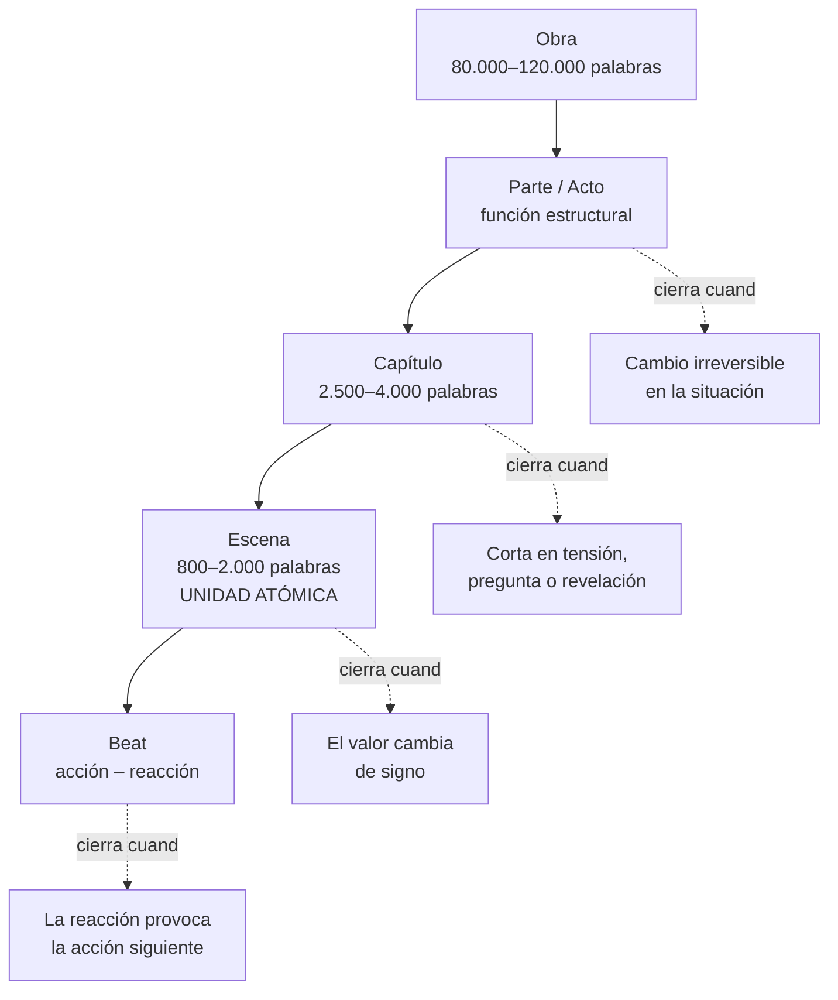
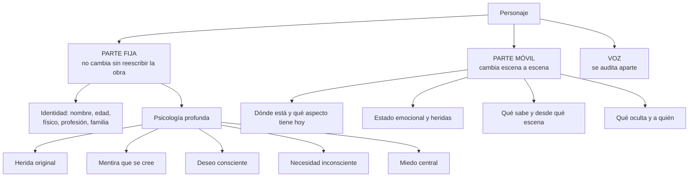
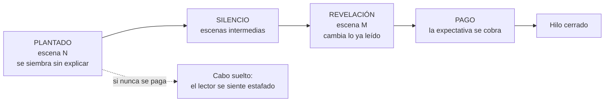
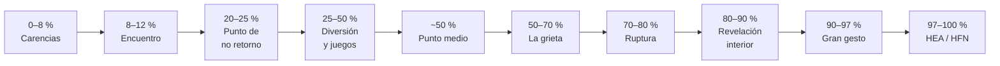
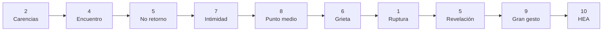

# Conocimiento de dominio: cómo funciona una novela

**Versión:** 2.0 · **Fecha:** 2026-09-21 · **Género de referencia:** romance

Este documento explica **cómo funciona una novela**: qué la sostiene, por qué se rompe y qué distingue un capítulo que funciona de uno que no. Todo lo que hay aquí seguiría siendo cierto si la novela se escribiera a mano, en un cuaderno, sin ninguna máquina de por medio.

| Necesitas… | Ve a |
| --- | --- |
| Qué significa un término, con sus atributos y cardinalidades | [`definitions.md`](definitions.md) |
| Cómo se fabrica el sistema que escribe la novela | [`architecture.md`](architecture.md) |
| Árboles y grafos de la ontología | [`definitions.md`](definitions.md) §14 |

**Criterio de pertenencia** (de `architecture.md` §14): si la frase cambia al cambiar de herramienta, va en `architecture.md`. Si cambiaría aunque escribieras la novela a mano, va aquí. Si es «X significa Y», va en `definitions.md`.

---

## 1. Una novela no es un texto largo

La diferencia entre un relato y una novela no es de extensión, es de **memoria**. En un relato, el lector retiene todo lo leído. En 100.000 palabras, no: el lector recuerda las promesas, las emociones y unos pocos hechos salientes, y olvida el resto. La novela funciona si lo que el lector recuerda y lo que el texto sostiene coinciden.

De ahí salen las tres tensiones que gobiernan todo lo demás:

| Tensión | En qué consiste | Qué pasa si se pierde |
| --- | --- | --- |
| **Coherencia** | Lo dicho en el capítulo 3 sigue siendo verdad en el 27 | El lector deja de fiarse y abandona |
| **Progresión** | Cada escena deja la situación distinta de como la encontró | La novela se siente larga aunque sea corta |
| **Promesa** | Lo prometido al principio se cumple al final | El lector se siente estafado, y lo dice |

Casi todos los defectos narrativos son un fallo de una de las tres. No son problemas de estilo: son problemas de arquitectura de la historia.

---

## 2. La escena: la unidad que de verdad importa

Una **escena** es el mayor fragmento que se sostiene de una sentada y el menor que tiene sentido narrativo completo. Tiene un punto de vista, un lugar y un tiempo continuos. Cuando cualquiera de los tres cambia, empieza otra escena.

### 2.1 El giro de valor

Lo que convierte un pasaje en escena no es que pasen cosas: es que **el valor emocional o situacional cambie de signo**. El personaje entra de una manera y sale de otra.

```
seguro → amenazado     esperanzado → derrotado     solo → acompañado
```

Una escena en la que nada cambia de signo es **relleno**, por bien escrita que esté. Es el defecto EST-01 y es el más frecuente de todos, porque una escena de relleno suele estar bien redactada: tiene diálogo, tiene ambiente, tiene ritmo. Simplemente no ha ocurrido nada.

### 2.2 Objetivo, obstáculo, resultado

La estructura interna de una escena que funciona:

1. El personaje del punto de vista **quiere algo concreto** en esta escena, no en la novela.
2. **Algo se interpone**, y ese algo tiene voluntad o peso propio.
3. La escena **se resuelve**, y el resultado no es binario:

| Resultado | Qué produce |
| --- | --- |
| **Sí** | Peligroso: cierra la tensión. Se usa poco, y solo antes de un golpe |
| **No** | Frena la trama si se repite; sirve para apretar |
| **Sí, pero** | El motor habitual: consigue lo que quería y trae un problema nuevo |
| **No, y además** | El acelerador: fracasa y empeora la situación |

Una novela cuyas escenas son casi todas «sí» o «no» avanza a trompicones. Las dos formas compuestas son las que encadenan.

### 2.3 Escena y resumen

No todo se dramatiza. El **resumen** cubre lo que hay que saber pero no merece presencia; la **escena** dramatiza lo que el lector necesita vivir. La regla de oficio: se dramatiza donde el valor cambia, se resume donde solo pasa el tiempo.

Dramatizar lo irrelevante aburre. Resumir lo decisivo deja al lector fuera del momento que había estado esperando: ese es el defecto PRO-02, y es el que más caro sale, porque destruye el pago de una promesa.

---

## 3. La arquitectura de la historia

La novela se organiza en cuatro niveles, y **cada uno tiene su propio criterio de cierre**. Confundirlos produce capítulos que no terminan y actos que no giran.



| Nivel | Qué es | Cierra cuando |
| --- | --- | --- |
| **Parte** | Movimiento macroestructural con función propia | Ocurre algo irreversible: ya no se puede volver al estado anterior |
| **Capítulo** | Unidad de lectura; donde el lector decide si sigue | Se corta en tensión, en pregunta o en revelación, **nunca** en descanso |
| **Escena** | Unidad de generación y de validación | El valor cambia de signo |
| **Beat** | Acción y reacción | La reacción provoca la acción siguiente |

El capítulo es la unidad **comercial** de la atención: es donde alguien decide apagar la luz o seguir leyendo. Por eso su criterio de cierre es distinto del de la escena, y por eso un capítulo puede terminar a mitad de escena.

### 3.1 Los dos relojes

Una novela lleva dos relojes que no marcan lo mismo:

- **Tiempo de la historia:** cuándo ocurre el hecho en la ficción.
- **Orden del discurso:** en qué posición se cuenta.

Coinciden solo en la narración estrictamente lineal. En cuanto hay una analepsis, una escena simultánea o una revelación diferida, se separan. Mezclarlos es el origen silencioso de casi todos los fallos de continuidad: un hecho ocurrido «antes» pero contado «después» se toma por posterior, y el cálculo de quién sabe qué se desmorona.

Regla de oficio: **la coherencia se calcula por tiempo de la historia; la experiencia del lector se diseña por orden del discurso.**

---

## 4. El personaje: por qué cambia y por qué se resiste

Un personaje no es una ficha de rasgos. Es un **mecanismo de resistencia al cambio**, y la novela es el proceso de vencer esa resistencia.



### 4.1 El motor interno

Cinco piezas encadenadas, y el orden importa:

1. **La herida original.** Algo le pasó antes de que empiece la novela.
2. **La mentira que se cree.** La conclusión falsa que sacó de esa herida: «no se puede confiar en nadie», «no merezco que me quieran».
3. **El miedo central.** Lo que la mentira le hace evitar.
4. **El deseo consciente.** Lo que persigue, y lo que él diría que quiere.
5. **La necesidad inconsciente.** Lo que le falta de verdad, y que casi siempre contradice al deseo.

El **arco interno** es el proceso de abandonar la mentira. Un personaje que consigue su deseo sin tocar su mentira no ha cambiado: ha ganado. No es lo mismo, y el lector lo nota.

La consecuencia práctica: **el conflicto no se inventa, se deduce.** Si dos personajes tienen heridas y mentiras bien definidas, el conflicto entre ellos ya está escrito. Cuando hay que forzar la discusión es señal de que la mentira de alguno está sin definir.

### 4.2 Fijo y móvil

Un apellido no cambia; el humor, sí. Esa distinción no es una comodidad de registro: es narrativa. Lo fijo es aquello cuyo cambio sería un error de continuidad. Lo móvil es aquello cuyo **no** cambio sería un error de progresión.

Mantenerlos juntos hace que se contaminen: se acaba «corrigiendo» un rasgo permanente porque no encajaba con el estado de ánimo de una escena.

### 4.3 La voz se audita aparte

La voz de un personaje —su léxico, su longitud de frase, qué evita nombrar, cómo miente, dónde está su humor— se describe **separada** de quién es. Así se puede revisar el estilo sin tocar los hechos, y al revés.

**Prueba de validez:** toma un párrafo, quítale los nombres propios y dáselo a alguien que conozca la novela. Si no sabe quién habla, la voz no está construida: está decorada.

---

## 5. La relación como objeto narrativo

En romance, la relación **es la trama principal**, no un atributo de los personajes. Esto tiene consecuencias que se notan enseguida:

- Una relación tiene **estado propio** que no se deduce de los dos personajes por separado: lo que se deben, lo que comparten, lo que uno sabe del otro y el otro ignora.
- La **asimetría de información** es el combustible: lo interesante casi nunca es lo que pasa, sino quién sabe qué y desde cuándo.
- La **temperatura** de la relación —de la frialdad a la intimidad— es una serie temporal, y esa serie **es** el arco romántico. No es una metáfora: es la curva que se planifica y se audita.

Un error frecuente: tratar la relación como resultado de las escenas en lugar de como la cosa que las escenas hacen avanzar o retroceder. Cuando la relación no es un objeto, el romance se convierte en dos arcos individuales que casualmente se cruzan.

---

## 6. Punto de vista y voz

### 6.1 Qué puede percibir un punto de vista

Una escena se narra desde una cabeza. Esa cabeza **no puede percibir** lo que no percibiría una persona en su lugar: no ve su propia cara, no sabe lo que el otro está pensando, no conoce el nombre de quien acaba de conocer.

Violarlo produce dos defectos distintos:

| Defecto | Qué ocurre | Por qué rompe |
| --- | --- | --- |
| VOZ-01 | El punto de vista percibe lo imposible | Rompe el pacto de la focalización: si puede saberlo todo, la tensión desaparece |
| VOZ-02 | Salto de cabeza: se cambia de mente dentro de la escena | El lector pierde con quién está, y con ello la identificación |

El salto de cabeza es especialmente dañino en romance, porque **la ignorancia mutua es la fuente de la tensión**. Si el lector sabe a la vez lo que sienten los dos, no queda nada por resolver.

### 6.2 Distancia psíquica

Es a qué distancia se coloca la narración de la conciencia del personaje, de la mirada exterior al flujo de pensamiento. No es un ajuste global: **se elige por escena**, y se mueve dentro de ella.

La regla: la distancia se **acerca** al subir la tensión emocional y se **aleja** para dar aire o mostrar el mundo. Una escena íntima narrada desde lejos es fría aunque el contenido sea intenso; una escena de acción narrada desde dentro se vuelve confusa.

### 6.3 El ritmo es sintaxis

El ritmo no se declara, se escribe. Frases cortas aceleran; frases largas ensanchan. Un clímax con frases subordinadas no es un clímax. Una escena de reflexión con frases de cinco palabras suena a telegrama.

Es la razón de que la longitud media de frase y su variación sean indicadores útiles: no porque midan calidad, sino porque un texto sin variación sintáctica es un texto sin ritmo.

---

## 7. La economía de la información

Una novela es, en buena medida, un sistema de administración de lo que el lector y los personajes saben. Tres piezas encadenadas:



- **Plantado:** un dato que se siembra sin subrayarlo, para cobrarlo después.
- **Revelación:** un dato que **cambia la interpretación de lo ya leído**. Si no reordena nada hacia atrás, es información, no revelación.
- **Pago:** la escena que cobra el plantado y satisface la expectativa creada.

La regla que lo gobierna todo: **el lector perdona un giro, pero no una trampa.** Un giro es sorprendente e inevitable a la vez: al mirar atrás, estaba todo puesto. Una trampa es sorprendente porque se ocultó información que el punto de vista tenía. Lo primero es oficio; lo segundo es deshonestidad narrativa, y se recuerda con rencor.

### 7.1 Quién sabe qué, y desde cuándo

Cada suceso tiene testigos. De los testigos se deduce quién puede saberlo después, y solo quien lo sabe puede usarlo. Un personaje que actúa sobre información que nunca recibió es el defecto CON-03, y es el más difícil de detectar a ojo, porque el texto suena perfectamente bien.

Es también el que más deteriora la confianza: cuando el lector descubre uno, empieza a desconfiar de todo lo demás.

### 7.2 Los hilos abiertos

Cada pregunta que la novela abre queda pendiente hasta que se cierra. Un hilo tiene tres estados posibles: **abierto** (el lector espera), **pagado** (se cobró) y **vencido** (se cerró tarde o nunca, y el lector ya había dejado de esperar).

Los hilos vencidos son peores que los abiertos: un hilo abierto al final es un cabo suelto reconocible; uno vencido es una promesa que se cumplió cuando ya no importaba.

---

## 8. El contrato del género

Un género no es una etiqueta de estantería: es un **contrato con expectativas concretas**. El lector de romance ha comprado el libro esperando cosas determinadas, y no cumplirlas no es innovación: es una devolución.

Las dos cláusulas irrenunciables del romance:

1. **La relación es la trama A.** No un subargumento de otra cosa.
2. **El final es emocionalmente satisfactorio.** Final feliz, o al menos feliz por ahora.

### 8.1 Los hitos obligatorios

El romance tiene el contrato más explícito del mercado, hasta en las posiciones aproximadas:



| Hito | Qué tiene que ocurrir de verdad |
| --- | --- |
| Carencias | Se ve la herida y la vida incompleta de cada protagonista **antes** de que se conozcan |
| Encuentro | Chispa y fricción **a la vez**; solo chispa es aburrido, solo fricción es antipático |
| Punto de no retorno | Algo externo los obliga a seguir juntos aunque no quieran |
| Diversión y juegos | Se cumple la promesa del tropo. Es lo que el lector vino a leer |
| Punto medio | Beso, confesión o falsa victoria que **sube** lo que está en juego |
| La grieta | La mentira interna empieza a costar dinero emocional |
| Ruptura | Separación creíble, **causada por la herida** |
| Revelación interior | Cada uno entiende qué tiene que ceder |
| Gran gesto | Un acto con riesgo real que demuestra el cambio |
| HEA / HFN | Se cierran el arco romántico **y** el arco interno |

Las posiciones son franjas, no marcas exactas. Lo que no admite excepción es el **orden** y la **presencia**: un gran gesto antes de la revelación interior no significa nada, porque el personaje no ha cambiado todavía.

### 8.2 Por qué la ruptura no puede ser un malentendido

La ruptura del 70–80 % debe nacer de **la herida del personaje**, no de un equívoco que se resolvería con una conversación de dos minutos. Ese es el defecto GEN-02, y es el más odiado por los lectores del género.

La razón es estructural: si la separación la causa un malentendido, la reconciliación no requiere que nadie cambie, solo que alguien hable. Y si nadie cambia, el arco no existe y el final no se ha ganado.

### 8.3 La curva de temperatura

El arco romántico dibuja una curva que **tiene que retroceder**:



Una curva monótona creciente produce una novela plana aunque cada escena esté bien escrita: sin caída no hay recuperación, y sin recuperación el final se regala en lugar de ganarse. **El retroceso del 70–80 % es obligatorio.**

### 8.4 Tropos: dramatizar, no mencionar

Un tropo declarado —enemigos a amantes, segunda oportunidad, solo hay una cama— crea escenas obligatorias. El lector que elige por tropo espera **verlo**, no que se lo cuenten. Decir que se odiaban no es enemigos a amantes; hacen falta escenas en las que se odien.

### 8.5 El nivel de calor es una promesa

La escala de explicitud declarada —de puerta cerrada a explícito— es una promesa al lector, y se incumple en las dos direcciones. Quedarse corto defrauda; pasarse traiciona a quien eligió el libro precisamente por eso. Por eso una escena que excede el nivel declarado se reescribe **aunque el texto sea bueno**: el defecto SEG-01 no admite el argumento de la calidad.

---

## 9. Ritmo y variedad

Una novela larga se sostiene por variación, no por intensidad constante.

| Palanca | Qué controla | Síntoma cuando falla |
| --- | --- | --- |
| Longitud de escena | La respiración del capítulo | Todas las escenas duran lo mismo: monotonía |
| Proporción escena / resumen | La velocidad de la trama | Demasiado resumen: la novela se vuelve sinopsis |
| Densidad de diálogo | La sensación de presencia | Bloques de introspección sin nadie hablando |
| Tipo de corte | Si el lector pasa de capítulo | Capítulos que cierran en calma: el libro se deja |
| Alternancia de punto de vista | El equilibrio del romance | Un protagonista con el 70 % de las escenas: el otro no existe |

El error habitual no es el exceso de una cosa, sino la **ausencia de contraste**. Una novela de escenas intensas idénticas cansa igual que una de escenas tranquilas.

---

## 10. Cómo se degrada una novela larga: la deriva

La **deriva** es el alejamiento progresivo del texto respecto de lo que se declaró al principio. No es un problema de las máquinas: le pasa a cualquiera que escriba 100.000 palabras durante meses. Solo que a escala larga se acumula sin que nadie lo note, porque cada escena por separado parece correcta.

| Tipo | Síntoma | Por qué ocurre |
| --- | --- | --- |
| **De voz** | El capítulo 20 no suena como el 3 | La referencia más reciente pesa más que la original |
| **De hechos** | Cambian los ojos, el apellido, la distancia entre dos sitios | Nadie recuerda el dato menor de hace treinta escenas |
| **De ritmo** | Todas las escenas duran y terminan igual | Se acaba repitiendo la forma que funcionó |
| **De tensión** | La relación avanza en línea recta | Cuesta escribir retrocesos: parecen pasos atrás |
| **De léxico** | Reaparecen los mismos gestos y las mismas metáforas | El repertorio propio es finito y se gasta |

La deriva es la razón de ser de casi todo el aparato de control: no se combate escribiendo mejor, se combate **midiendo contra lo declarado** y volviendo a anclar en lo aprobado.

---

## 11. Qué se puede contar y qué hay que juzgar

No todas las cualidades de un texto son de la misma naturaleza, y confundirlas lleva a exigir juicio donde bastaba contar, o a fiarse de un número donde hacía falta criterio.

| Se puede contar mecánicamente | Exige criterio |
| --- | --- |
| Repetición de secuencias de palabras | Si el subtexto funciona |
| Tics corporales por cada mil palabras | Si el diálogo suena a esa persona |
| Variación de la longitud de frase | Si la escena emociona |
| Repetición del nombre propio en vez del pronombre | Si el giro está bien ganado |
| Posición y presencia de los hitos del género | Si el gran gesto conmueve |
| Contradicciones entre hechos declarados | Si la voz es la misma que en el capítulo 3 |

La columna izquierda detecta **lo mecánico**: síntomas baratos y fiables de que algo se está torciendo. La derecha es donde vive la calidad de verdad, y no hay número que la sustituya.

Un aviso que conviene tener presente: **la columna izquierda en verde no significa que el texto sea bueno.** Significa que no está roto de las formas baratas de romperse.

---

## 12. Los errores característicos, y por qué lo son

La taxonomía completa con sus códigos está en `definitions.md` §8. Lo que sigue es por qué cada familia importa, que es lo que no se deduce del código.

| Familia | El error | Por qué es grave |
| --- | --- | --- |
| **Canon** (CAN) | Dos afirmaciones incompatibles sobre el mismo hecho | Destruye la confianza: si el color de ojos baila, ¿qué más está mal? |
| **Continuidad** (CON) | Teletransporte, objeto resucitado, saber lo que no se debería | Rompe la ilusión de un mundo con reglas |
| **Voz** (VOZ) | Percibir lo imposible, saltar de cabeza | Rompe el pacto de focalización, que es donde vive la tensión |
| **Prosa** (PRO) | Muletillas, clichés, resumen donde tocaba escena | No mata el libro de golpe; lo desgasta página a página |
| **Estructura** (EST) | Escena sin giro de valor | El lector nota que ha leído sin avanzar, aunque no sepa decir por qué |
| **Género** (GEN) | Hito ausente o fuera de sitio, ruptura por malentendido | Incumple el contrato por el que se compró el libro |
| **Seguridad** (SEG) | Contenido fuera del nivel declarado | Traiciona la expectativa explícita del lector |

Una jerarquía útil cuando hay que priorizar: **primero lo que rompe la confianza** (canon, continuidad), **después lo que rompe el contrato** (género, seguridad), **después lo que rompe la ilusión** (voz), **y al final lo que desgasta** (prosa). Una novela con prosa mediocre y canon impecable se lee. Al revés, no.

---

## 13. Lo que no se negocia

No son preferencias editoriales: son límites del oficio y del trato con el lector.

- **Edad.** Ningún contenido romántico o sexual con personajes menores de dieciocho años. Sin excepción narrativa, sin matices de contexto histórico.
- **Consentimiento.** Explícito y entusiasta en las escenas íntimas. Las dinámicas de poder desiguales —jefe y empleada, médico y paciente— exigen tratarse, no ignorarse.
- **Advertencias de contenido.** Los temas sensibles —duelo, adicción, violencia, pérdida gestacional— se declaran. El lector decide si quiere entrar; no se le embosca.
- **Representación.** Los estereotipos en físico, profesiones y acentos se auditan. La tendencia por defecto es al promedio de lo ya escrito, y el promedio de lo ya escrito está lleno de tópicos.
- **Originalidad.** Los tropos son de todos; la expresión concreta, no. Reutilizar una estructura es oficio; reutilizar frases es otra cosa.
- **Autoría.** Qué partes son generadas, cuáles editadas y cuáles escritas a mano se registra. No por trámite: porque afecta a quién firma.

---

## 14. Qué no está en este documento

Para que nadie lo busque aquí:

| Contenido | Dónde vive | Por qué allí |
| --- | --- | --- |
| Atributos, cardinalidades y axiomas formales | `definitions.md` | Es «X significa Y» |
| Presupuesto de contexto, memoria, orquestación | `architecture.md` | Cambia si cambian las herramientas |
| Roles que fabrican la novela y cómo se coordinan | `architecture.md` §3 y §7 | Es fabricación, no narrativa |
| Puertas, reintentos y políticas de reparación | `architecture.md` §8.3 | Es proceso de producción |
| Árboles de clases y grafos de relaciones | `definitions.md` §14 | Es la misma ontología en forma visual |

**Regla de oro de este documento:** si una frase menciona una tecnología, un formato de datos o un componente del sistema, está en el fichero equivocado.
