# Ontología de generación de novelas con IA — Árboles y grafos (Mermaid)

**Versión:** 1.0 · **Fecha:** 2026-09-21 · **Documento hermano:** `01-ontologia-novelas-definiciones.md`

Todos los diagramas usan sintaxis Mermaid y se renderizan en GitHub, GitLab, Obsidian, Notion y VS Code con la extensión de Mermaid.

**Índice**

1. Mapa general de capas
2. Árbol taxonómico de clases
3. Árbol por capa (historia, discurso, género, estado, producción)
4. Anatomía estructural de la obra
5. Grafo de relaciones (modelo entidad-relación)
6. Anatomía del personaje
7. Flujo de la información: plantado, revelación, pago, conocimiento
8. Beats obligatorios del romance
9. Composición del paquete de contexto
10. Árbol de calidad: dimensiones, métricas, defectos
11. Pipeline del sistema
12. Ciclo de vida de una escena

---

## 1. Mapa general de capas

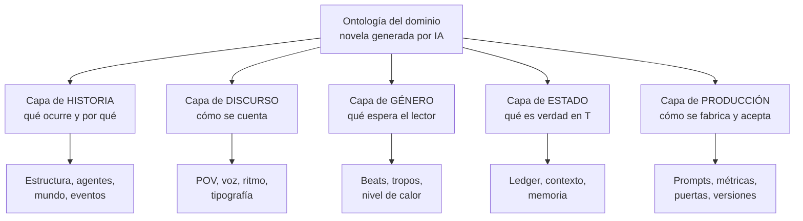

---

## 2. Árbol taxonómico de clases

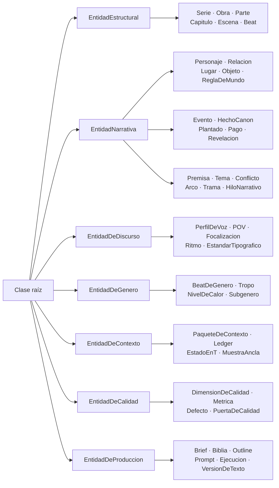

---

## 3. Árbol por capa

### 3.1 Historia

```mermaid
flowchart TD
  H["HISTORIA"]
  H --> H1["Estructura"]
  H --> H2["Núcleo dramático"]
  H --> H3["Agentes"]
  H --> H4["Mundo"]
  H --> H5["Eventos e información"]

  H1 --> H11["Serie"]
  H1 --> H12["Obra"]
  H1 --> H13["Parte / Acto"]
  H1 --> H14["Capitulo"]
  H1 --> H15["Escena"]
  H1 --> H16["Beat"]

  H2 --> H21["Premisa · Logline"]
  H2 --> H22["Tema"]
  H2 --> H23["Conflicto"]
  H2 --> H24["Arco"]
  H2 --> H25["Trama y subtramas"]

  H3 --> H31["Personaje"]
  H3 --> H32["Relacion"]

  H4 --> H41["Lugar"]
  H4 --> H42["Objeto"]
  H4 --> H43["ReglaDeMundo"]
  H4 --> H44["Cronologia"]

  H5 --> H51["Evento"]
  H5 --> H52["HechoCanon"]
  H5 --> H53["Plantado y Pago"]
  H5 --> H54["Revelacion"]
  H5 --> H55["HiloNarrativo"]
```

### 3.2 Discurso

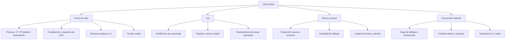

### 3.3 Género (romance)

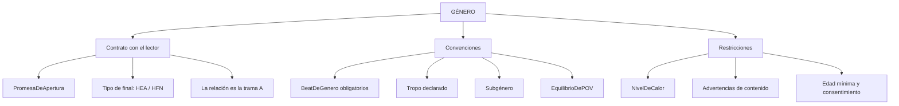

### 3.4 Estado y contexto

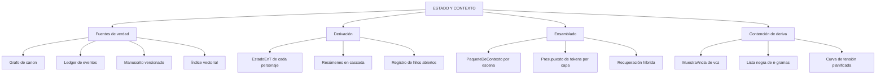

### 3.5 Producción

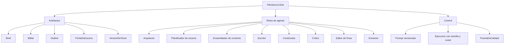

---

## 4. Anatomía estructural de la obra

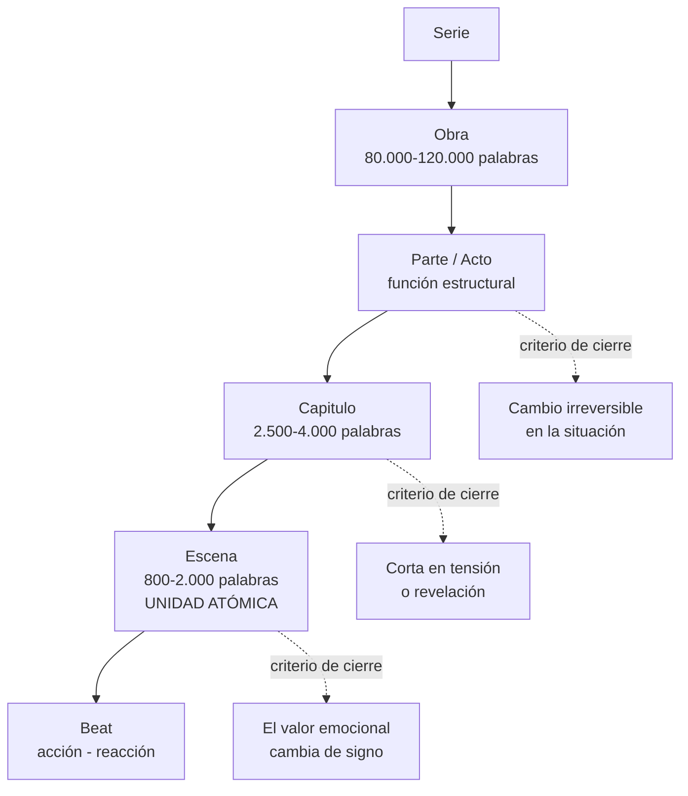

---

## 5. Grafo de relaciones

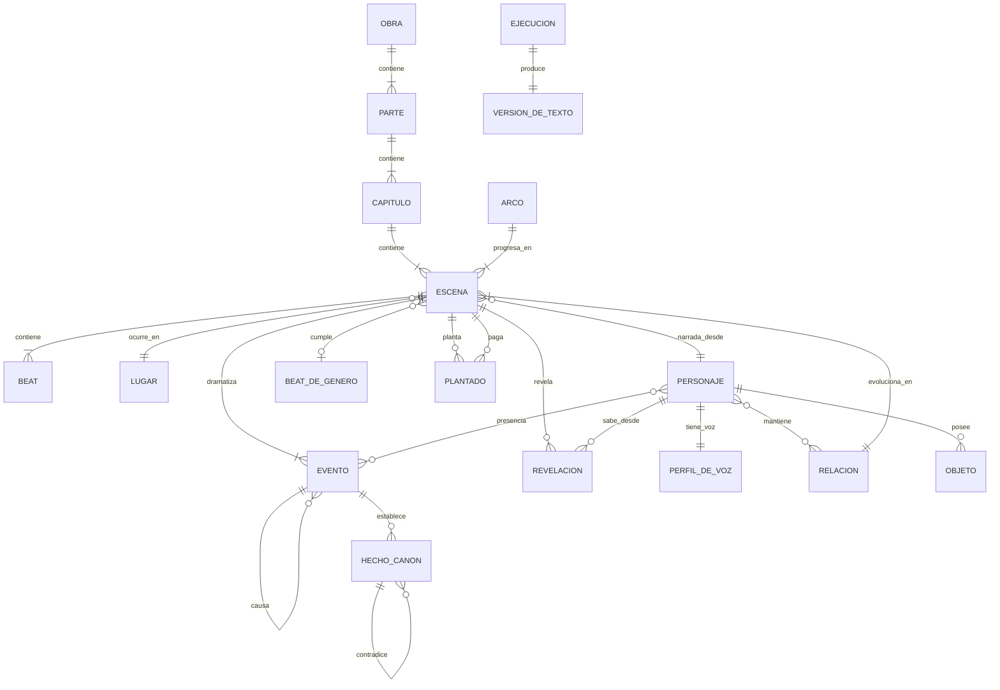

---

## 6. Anatomía del personaje

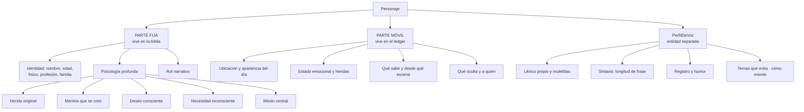

> **Prueba de validez de la voz:** dado un párrafo sin nombres propios, un clasificador debe identificar el POV correcto.

---

## 7. Flujo de la información

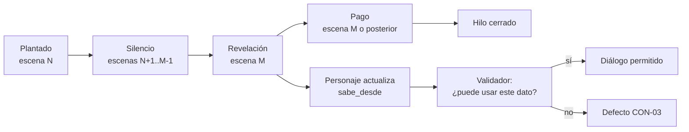

**Derivación del conocimiento:**

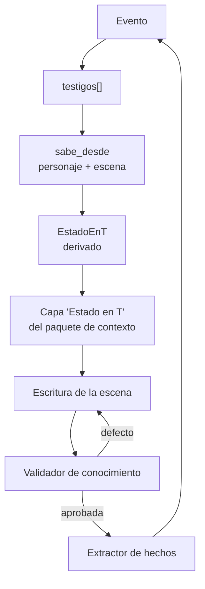

---

## 8. Beats obligatorios del romance

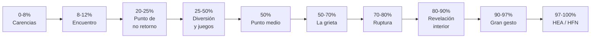

**Curva de temperatura de la relación (0-10):**

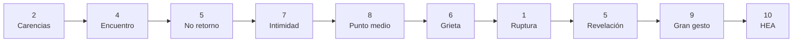

> El retroceso del 70-80 % es obligatorio: sin él, el arco romántico avanza en línea recta y el final no se gana.

---

## 9. Composición del paquete de contexto

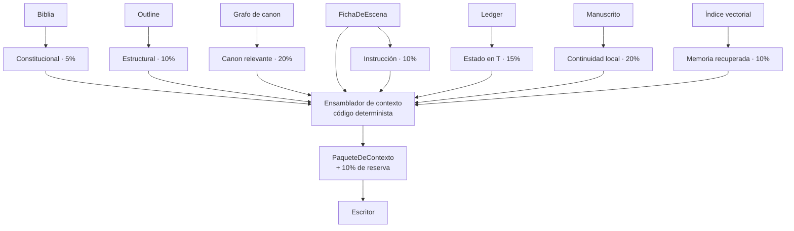

**Reglas de ensamblado:** se selecciona y no se acumula · lo importante al principio y al final · filtro estructural antes que similitud semántica · texto literal solo para lo contiguo · lo derivado nunca se escribe a mano.

---

## 10. Árbol de calidad

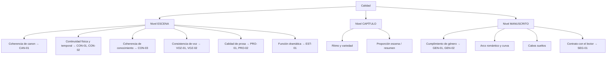

**Quién mide qué:**

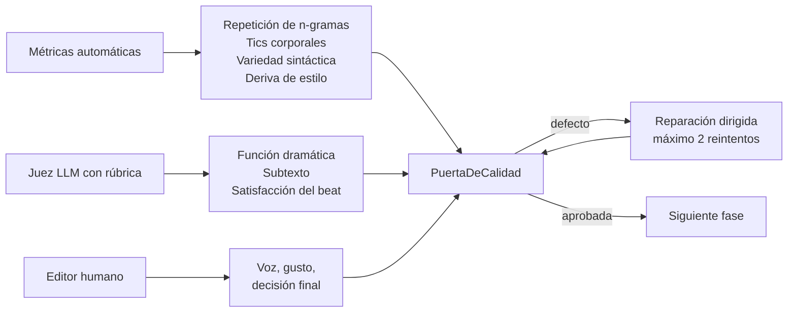

---

## 11. Pipeline del sistema

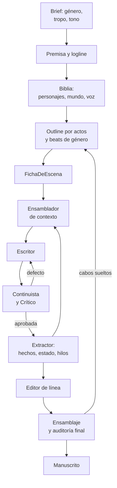

---

## 12. Ciclo de vida de una escena

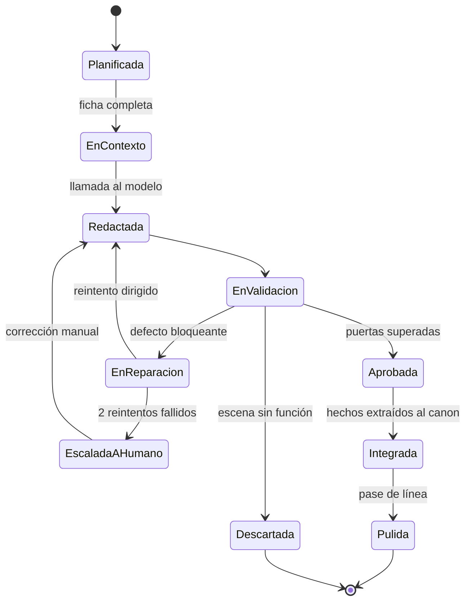