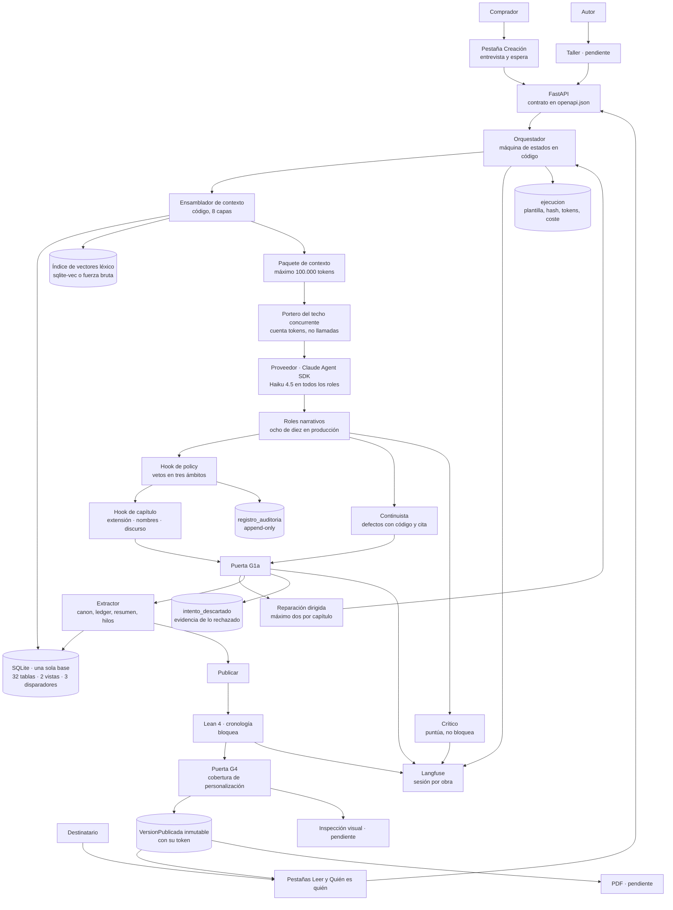
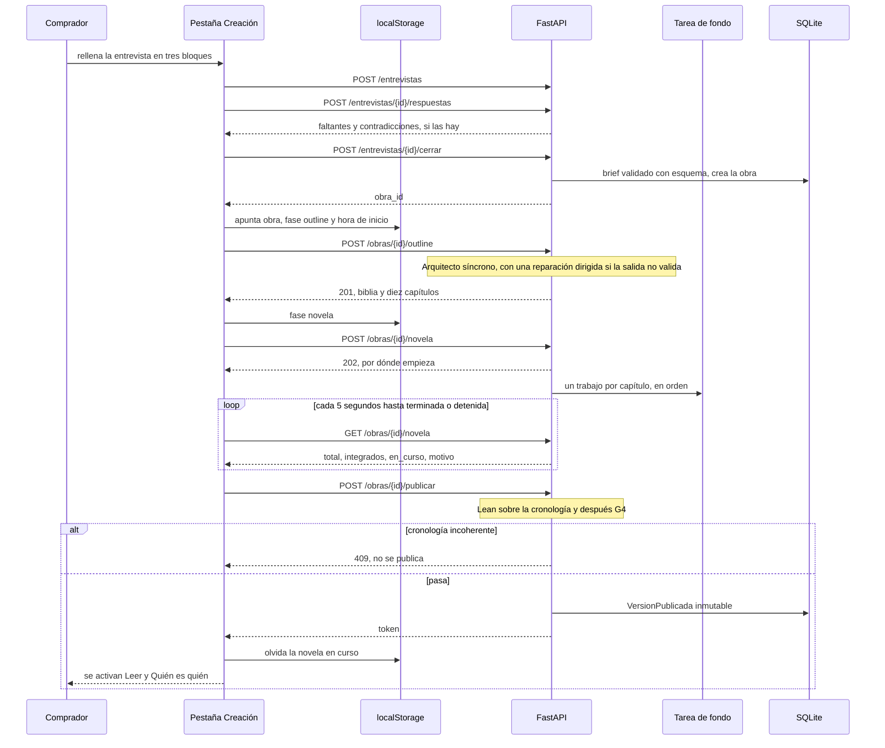
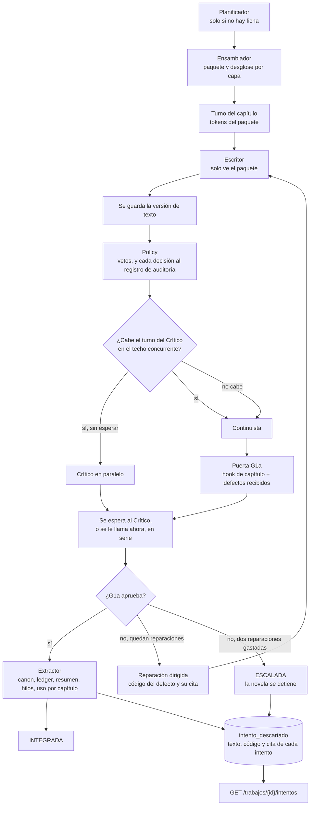
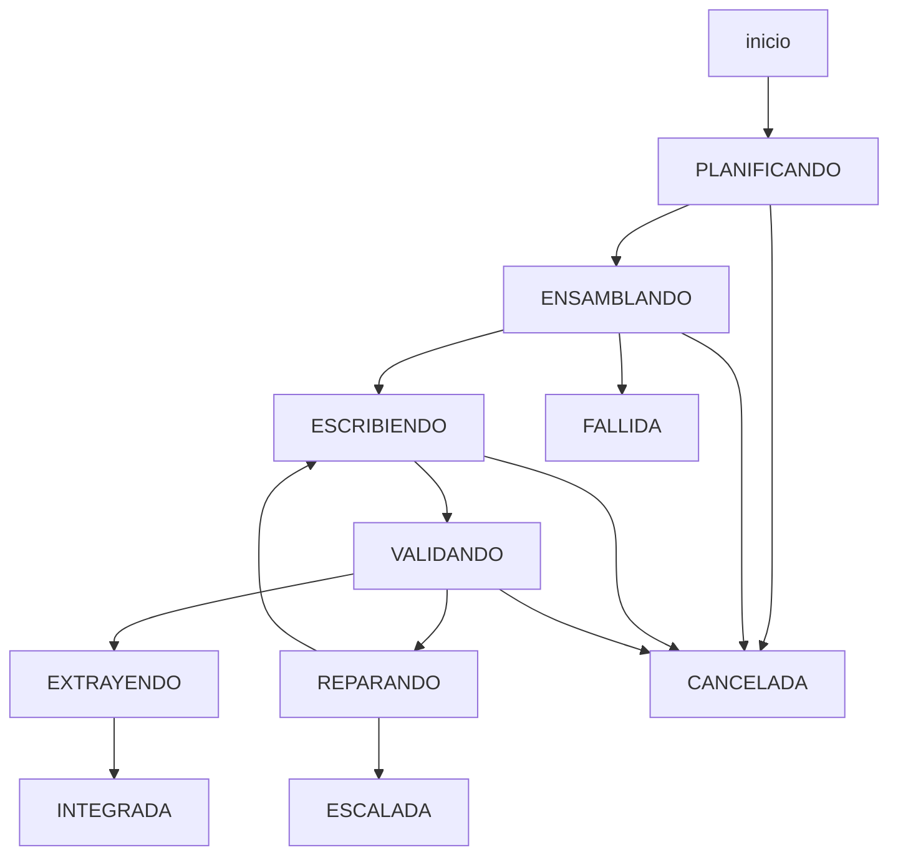
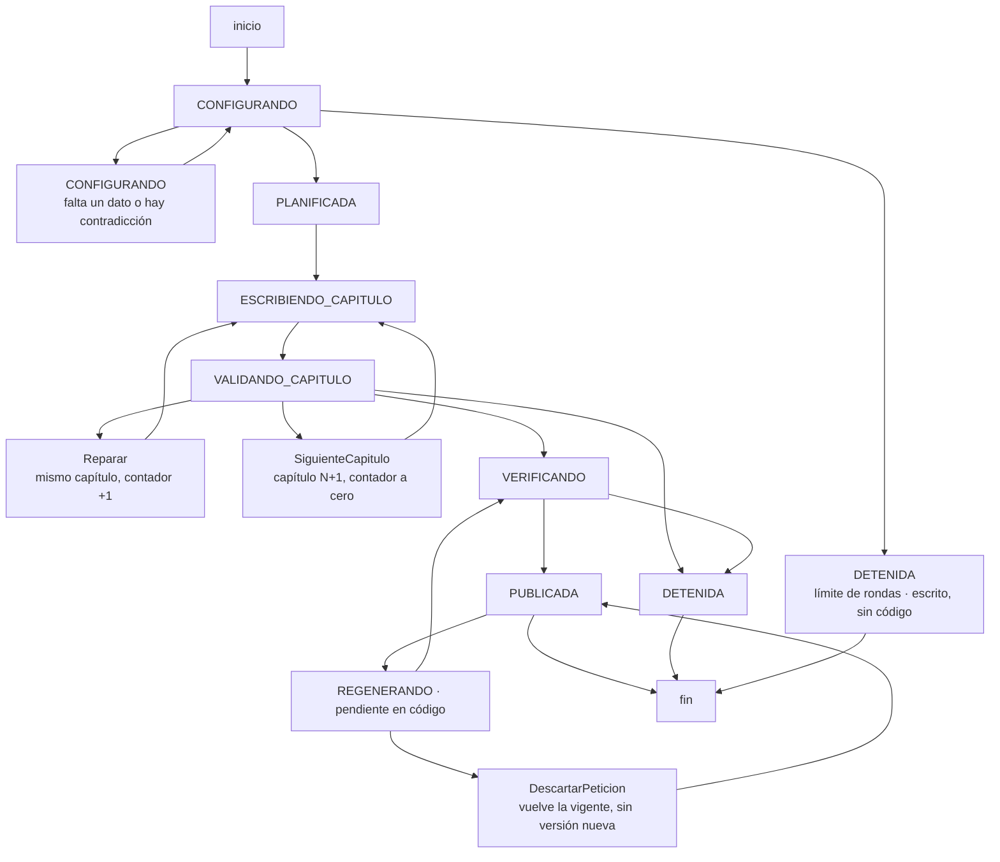
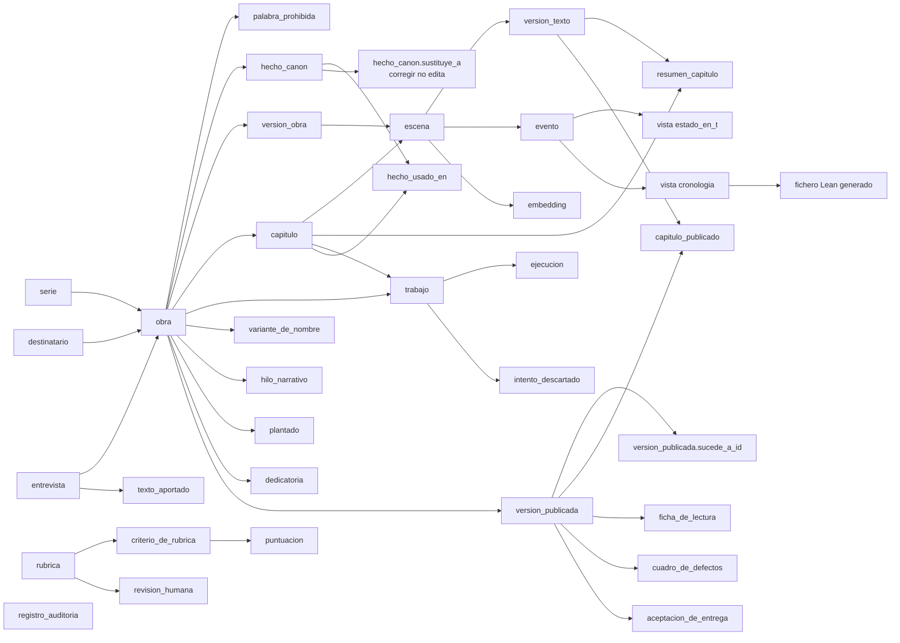
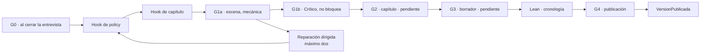
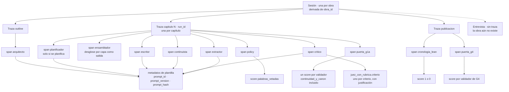

# Diagramas

**Qué es este documento.** Los cuatro diagramas que el encargo pide —arquitectura del
harness, máquina de estados de TLA+, esquema SQLite y tabla de validadores con su punto de
ejecución— reunidos en un sitio, más tres que hacen falta para leerlos: **el recorrido de
extremo a extremo** tal como hoy lo hace la pantalla, **el ciclo del capítulo** con los dos
jueces solapados, y **la observabilidad** —qué es sesión, traza, span y *score* aquí—.

**Una convención que gobierna los siete:** lo que **no está construido** se marca en el
propio diagrama con «· pendiente». Un diagrama que dibuja como hecho lo que falta no
documenta el sistema: documenta el deseo.

**Fecha de corte: 2026-09-24, sobre `bfb5396`.** La versión anterior de este fichero
(`63363e8`) daba por pendientes Lean, TLA+, Langfuse, el hook de *policy*, la versión
publicada y la lectura web. Hoy existen los seis; lo que sigue pendiente se nombra abajo.

Los diagramas de los documentos de contexto no se duplican aquí: `architecture.md` manda
sobre estructura (§3.3, §3.9, §8.2, §9.2.1) y estos se construyen **a partir de** aquellos.

---

## 1 · Arquitectura del harness

**Lo que este diagrama deja ver y las tablas no.** Las tres piezas que sostienen las
afirmaciones más fuertes del proyecto están **antes** del proveedor: el Ensamblador es
código, el portero cuenta tokens antes de conceder turno, y el paquete falla si no cabe.
Todo lo que hay **después** del modelo —hooks, puerta, extractor, Lean— es detección; lo de
antes es prevención.

**Y lo que deja ver de lo que falta.** Los «pendiente» ya no son una cadena, como en la
versión anterior —Lean, la versión publicada y la lectura existen—: son tres huecos sueltos
**en los bordes**. El Taller del Autor, la inspección visual de G4 y el PDF. Los dos roles que
no están en producción, el Editor de línea y el Auditor de manuscrito, no aparecen porque no
hay nada que dibujar: no existe su clase (`specs/estado-del-entregable.md` §3).

---

## 2 · El recorrido de extremo a extremo, como lo hace hoy la pantalla

Es la cadena que ejecuta `features/entrevista/components/Entrevista.tsx` contra las rutas del
backend. Se cerró por tramos durante la primera corrida real: el outline no se llamaba y se
publicaba en cuanto `/novela` devolvía 202 (`38a260d`), la publicación no tenía ruta
(`0231e78`, `753462e`), y una recarga perdía la novela (`3f10d77`).

**Tres detalles que el diagrama fija y que no son obvios:**

1. **El outline es síncrono y la novela no.** `POST /obras/{id}/outline` espera a la llamada
   del Arquitecto; `POST /obras/{id}/novela` responde `202` y deja la novela —unos ochenta a
   noventa minutos medidos— en una tarea de fondo. Por eso la pantalla tiene dos esperas
   distintas.
2. **La recarga sobrevive porque se apunta lo mínimo.** `localStorage` guarda la obra, la fase
   y la hora de inicio —**nada de lo que escribió el Comprador**—. Con una obra apuntada no se
   abre otra entrevista: se vuelve a consultar `GET /obras/{id}/novela` (`novelaEnCurso.ts`).
3. **Publicar es la única ruta que devuelve el token**, y por eso cierra el recorrido. Una obra
   sin capítulos no se publica y Lean ni se llama (`b0871ac`); un capítulo que no pasó su puerta
   tampoco (`CapituloSinPuerta`, `manuscrito/service.py`).

**Lo que este recorrido todavía no tiene:** la petición de cambio desde la lectura —el plan 5
del backend está aprobado y sin tareas hechas— y la descarga del PDF.

---

## 3 · El ciclo del capítulo

### 3.1 · Los pasos y los roles, con los jueces solapados

`features/escritura/ciclo.py` y `service.escribir_capitulo`. Es lo que ocurre dentro de cada
trabajo de la tarea de fondo de §2.

**Lo que este diagrama deja ver:**

- **El Crítico no decide nada**, y por eso puede solaparse: no lee lo que dice el Continuista
  y su juicio no entra en la decisión (`RF-JUZ-06`). La puerta G1a sigue esperando al
  Continuista, que sí bloquea (`92d2da7`).
- **El turno del Crítico se pide con `espera_maxima=0`.** Quien llama ya retiene el turno del
  capítulo; esperar otro con ese retenido es la receta de un interbloqueo entre dos obras. Si
  no cabe ahora, se juzga después, en serie, como antes del plan 8. El turno se cuenta con el
  prompt del Crítico más `SOBRECARGA_POR_LLAMADA` (`commons/jobs/turnos.py`).
- **Lo rechazado queda como evidencia y fuera de lo vigente.** Se escribe en
  `intento_descartado` **antes** de retirar las versiones de texto descartadas, también cuando
  un capítulo aprueba tras reparar (`d3b0d88`, `7e44901`). Ningún paquete lo lee: si lo leyera,
  la prosa rechazada contaminaría la continuidad del capítulo siguiente.

### 3.2 · La máquina de estados que está en código

`features/escritura/maquina.py`, con tabla de transiciones explícita. Diez estados: **seis
vivos y cuatro terminales**.

| Transición | Señal | Nota |
| --- | --- | --- |
| `ENSAMBLANDO → FALLIDA` | `contexto_excedido` | **Sin llamar al modelo.** Es fallo de diseño del ensamblado, no de ejecución |
| `VALIDANDO → EXTRAYENDO` | `aprobada` | No se puede saltar a `INTEGRADA`: es el Extractor quien deja rastro en la memoria |
| `VALIDANDO → REPARANDO` | `defecto_bloqueante` | El reintento lleva el defecto y su **cita** |
| `REPARANDO → ESCRIBIENDO` | intento por debajo del tope | El contador es **del capítulo**, no del trabajo |
| `REPARANDO → ESCALADA` | intento igual al tope | Dos reparaciones y se escala. `ESCALADA` es el único estado de `DETIENEN_LA_NOVELA` |
| cualquier estado vivo `→ FALLIDA` | `fallo_de_proveedor`, `tiempo_agotado`, `proceso_interrumpido` | El proveedor se cae en cualquier llamada, el plazo vence en cualquier paso y el proceso muere donde le pille |

**Un hueco que la versión anterior declaraba y ya no existe:** no había señal para «el proceso
murió», y la reanudación cerraba el trabajo muerto con `tiempo_agotado` por descarte. Desde
`2de6027` es `proceso_interrumpido` (`architecture.md` §3.6), porque con trazas una caída que
se lee como plazo vencido manda a mirar el sitio equivocado.

---

## 4 · Máquina de estados de la novela — el sujeto de TLA+

**Esta es la máquina que modela `formal/tla/Harness.tla`**, y TLC la comprueba sobre el modelo
pequeño de `harness.cfg` —cinco capítulos, dos reintentos—: 65.601 estados distintos,
profundidad 45, en verde (`formal/tla/README.md` §2).

**Las flechas que parecen una y son dos**, y que son la trampa de modelado de esta máquina:

| Acción | Qué hace | Toca el contador |
| --- | --- | --- |
| `Reparar` | Rehace **el mismo** capítulo con el defecto y su cita | **Sí, lo incrementa** |
| `SiguienteCapitulo` | Pasa al capítulo N+1, que aún no se ha escrito | **No.** Cada capítulo empieza con su contador |
| `DescartarPeticion` | La regeneración no prospera: **vuelve la versión vigente** | No |

Modelar las dos primeras como una sola tiene una consecuencia concreta y absurda: **avanzar de
capítulo consumiría reintentos**, y una novela de diez capítulos se detendría sola sin que
hubiera fallado nada.

**Lo que TLC comprueba, con los nombres del `.cfg`:**

| Propiedad | Tipo | Enunciado |
| --- | --- | --- |
| `PublicadaSoloConPuertas` | Seguridad | Ninguna versión publicada contiene un capítulo que no pasó su puerta. Enunciada sobre **las versiones creadas** y no sobre el estado, porque `DescartarPeticion` llega a `PUBLICADA` sin crear nada (`CLAUDE.md` §8, regla 14) |
| `ReanudacionIntegra` | Seguridad | La reanudación **no duplica** —no se escribe un capítulo ya integrado— **ni pierde** —no se verifica con un hueco detrás— |
| `LecturaIgualALaVigente` | Seguridad | En `PUBLICADA`, lo que se sirve es exactamente la última versión publicada, con todos sus capítulos validados |
| `TypeOK` | Seguridad | Tipos y cotas; entre ellas, que el contador de intentos no pasa de la suya |
| `VersionesAppendOnly` | De acción | Ninguna versión ya publicada cambia ni desaparece |
| `TodaGeneracionTermina` | *Liveness* | Toda generación termina publicando o detenida; **nunca queda en bucle**. Condicionada a la equidad fuerte sobre `Aprobar` |

**La correspondencia con el código ya no es solo una lectura.**
`test_correspondencia_tla.py` lee `formal/tla/correspondencia.toml` y **falla** si una
transición del código no está reclamada, si una acción no aparece en la tabla o si un símbolo
emparejado no existe (`e76ab85`). Lo que sigue siendo inspección es que la acción **haga** lo
que su nombre dice. Tres acciones —`PeticionDelLector`, `RehacerCapitulo`, `DescartarPeticion`—
están declaradas como **previstas**: la regeneración es la Fase 5 y no tiene código.

---

## 5 · Esquema SQLite

**32 tablas, 2 vistas derivadas y 3 disparadores**, en **una sola base y un solo motor**
(P-07). Contado sobre los `__tablename__` de `src/backend/app/` y los `CREATE TRIGGER` y
`CREATE VIEW` de las migraciones. El diagrama dibuja las relaciones que estructuran el
esquema; la tabla de debajo las lista todas con su feature dueña.

| Tabla | Feature | Para qué |
| --- | --- | --- |
| `serie` | `obra` | Si existe, el canon se comparte **entre** obras desde el primer día |
| `obra` | `obra` | La novela: género, tono, nivel de calor, extensión |
| `destinatario` | `obra` | A quién se regala: nombre, edad, rasgos, recuerdos aportados |
| `entrevista` | `obra` | Existe **antes** que la obra: es lo que la crea. Guarda el `obra_id` que produjo, y por eso cerrarla dos veces no crea dos |
| `texto_aportado` | `obra` | El texto libre del Comprador. **Contenido no confiable** |
| `palabra_prohibida` | `obra` | Vetos en tres ámbitos: global, obra, brief |
| `hecho_canon` | `obra` | El grafo: `entidad`, `atributo`, `valor`, `confianza`, `origen`, `sustituye_a` |
| `variante_de_nombre` | `canon` | Apodos e hipocorísticos **declarados**: lo que separa un error de grafía de un apodo |
| `hecho_usado_en` | `canon` | **En qué capítulos se usa cada hecho.** La ficha de lectura lo consume |
| `evento` | `canon` | El ledger, ***append-only***. Dos disparadores impiden `UPDATE` y `DELETE` |
| `resumen_capitulo` | `canon` | Derivado del texto aprobado; alimenta el contexto de los siguientes |
| `hilo_narrativo` | `canon` | Abierto, pagado o vencido |
| `plantado` | `canon` | Lo plantado y su pago |
| `embedding` | `canon` | El índice de vectores, detrás de `VectorStore` |
| `version_obra` | `outline` | Una por versión de biblia; cada escena apunta a la vigente cuando se escribió |
| `capitulo` | `outline` | POV, lugar, objetivo, obstáculo, giro previsto y tipo de corte |
| `escena` | `escena` | La unidad de generación. Hoy 1:1 con el capítulo |
| `version_texto` | `escritura` | **Inmutable**: un disparador impide cambiar el texto |
| `ejecucion` | `escritura` | Plantilla con su hash, biblia, IDs por capa, modelo, semilla, tokens previstos **y reales**, coste, veredicto |
| `trabajo` | `escritura` | La unidad de trabajo persistida: estado, intento, `run_id`, causa de fallo |
| `intento_descartado` | `escritura` | **Nueva** (`d3b0d88`). Texto, código y cita de cada intento rechazado. Evidencia de la escalada, fuera de lo vigente |
| `version_publicada` | `manuscrito` | La tirada inmutable, con su token y `sucede_a_id` |
| `capitulo_publicado` | `manuscrito` | **Fija** el `version_texto_id` de cada capítulo al publicar, y si cambió |
| `ficha_de_lectura` | `manuscrito` | Quién es quién, y en qué capítulos |
| `cuadro_de_defectos` | `manuscrito` | Lo que la puerta G4 encontró al publicar esa tirada |
| `dedicatoria` | `manuscrito` | Fuera de la prosa a propósito: no es una `version_texto` |
| `rubrica`, `criterio_de_rubrica`, `puntuacion` | `calidad` | La rúbrica versionada y lo que el Crítico puntúa con ella |
| `revision_humana`, `aceptacion_de_entrega` | `calidad` | Las tablas de la revisión humana. **Sin servicio ni rutas** todavía |
| `registro_auditoria` | `commons/db` | ***Append-only***. Qué se permitió, qué se bloqueó y **por qué** |

**Las dos vistas no son tablas, y esa es la decisión:** `estado_en_t` y `cronologia` se
**derivan** del ledger. Una tabla de estado editable se desincroniza del texto, y entonces hay
dos relatos de lo que pasó.

**Lo que este esquema todavía no tiene, declarado:** `peticion_de_cambio` —la Fase 5—, una
tabla `defecto` por defecto suelto —hoy viven en `intento_descartado` y en
`cuadro_de_defectos`—, `ngrama_vetado` —sin Editor de línea no la lee nadie— y `comprador`.
Y dos deudas que vencen al regenerar: **`evento` y `hecho_canon` no tienen `run_id`**, y
**`resumen_capitulo` tiene `UNIQUE(capitulo_id)`**.

---

## 6 · Validadores y su punto de ejecución

**Dónde corre un validador decide qué puede ver.** Uno que corre en el *hook* del capítulo no
puede mirar la novela entera; uno que corre en G4 mira la novela cuando ya está escrita, que
es el sitio correcto **y el más caro**.

| Validador | Punto | Qué bloquea | Estado |
| --- | --- | --- | --- |
| `esquema_de_brief` | G0 | No se planifica con un brief inválido | **Implementado** |
| `contradiccion_en_brief` | G0 | `CFG-01`: se resuelve **en la entrevista**, no escribiendo | **Implementado** |
| `texto_aportado_marcado` | Al entrar el `TextoAportado` | Que el texto del Comprador llegue a un prompt sin su marca de dato | **Implementado** |
| `esquema_de_salida_de_rol` | Tras cada llamada a un rol | Salida mal formada: es **fallo del paso**, no resultado vacío. El Arquitecto repara una vez (`0513035`) | **Implementado** |
| `palabras_vetadas` | Hook de *policy*, antes de la puerta | `SEG-02`, con tope; agotado, **se detiene la generación** | **Implementado** en `calidad/policy.py` (`168461a`); *score* en el span `policy` |
| `extension_de_capitulo` | Hook de capítulo | `EST-02`: fuera del rango declarado | **Implementado**; *score* en `puerta_g1a` |
| `nombres_literales` | Hook de capítulo | `PER-02`: un nombre escrito distinto que en el canon | **Implementado**; *score* en `puerta_g1a` |
| `discurso` | Hook de capítulo | `VOZ-03`: persona o tiempo verbal distintos de los declarados | **Implementado**; *score* en `puerta_g1a` |
| `continuidad_y_canon` | G1a | `CAN-01`, `CON-01`, `CON-03` | **Implementado**: el Continuista corre en el ciclo (`1899ccf`, `bab4dd7`) y `CON-03` se contrasta contra `estado_en_t` (`1d92785`) |
| `presupuesto_de_contexto` | Antes de **cada** llamada | `ContextBudgetExceeded`: nunca un truncado silencioso | **Implementado** |
| `techo_concurrente` | Antes de conceder turno | Que la **suma** de tokens en vuelo pase de 100.000 | **Implementado**, y desde `92d2da7` **ejercitado**: el Crítico pide su propio turno |
| `limite_de_reintentos` | Orquestador, en cada reparación | Superar el tope: la salida pasa a ser `ESCALADA` y la novela se detiene | **Implementado** |
| `hecho_usado_en` | Al integrar un capítulo | Un hecho sin registro de en qué capítulos se usa | **Implementado** |
| `checkpoint_reanudacion` | Al reanudar tras una caída | Duplicar o perder un capítulo | **Implementado** |
| `edad_minima` | Esquema, al construir el brief | Contenido con menores: **bloquea por construcción** | **Implementado** en el brief |
| `giro_de_valor` | Esquema de la ficha de escena | `EST-01`: valor de entrada y de salida iguales o nulos | **En esquema** (`escena/schemas.py`), no como validador del hook con *score* |
| `nivel_de_calor` | Hook | `SEG-01`: término por encima del nivel declarado | Pendiente. El esquema acota el nivel a 0–4; el texto no se mira |
| `juez_con_rubrica` | G1b | **No bloquea**: sin correlación medida ni firmada | **Implementado** (`0d0f4df`, `4f35669`); un *score* por criterio, `juez_con_rubrica.<criterio>` (`057eea4`) |
| `revision_humana` | El **Autor**, fuera del bucle | No bloquea: **produce el patrón** contra el que se mide el juez | Pendiente: tablas sí, servicio no |
| `cronologia_lean` | Publicación, antes de G4 | **No se publica** | **Implementado** (`4c6ff5c`); *score* 1 o 0, y sin Lean instalado ni *score* ni publicación. **Falta** que el fallo vuelva al editor (P-28) |
| `cobertura_de_personalizacion` | **G4** | `PER-01`: un elemento obligatorio que no aparece en ningún capítulo | **Implementado y puntúa**, pero **hoy no detiene la publicación**: su resultado va a `cuadro_de_defectos` (`manuscrito/service.py`) |
| `dedicatoria_fuera` | G4 | Que la dedicatoria entre como fragmento del manuscrito | **Por construcción**: tabla propia, fuera de `version_texto`. Sin validador |
| `inspeccion_visual` | G4 | Índice, ficha o portada que no renderizan | Pendiente. `.claude/mcp.json` declara Playwright MCP; el validador en código no existe |
| `no_revelado_no_se_envia` | G4, sobre la ficha | Que un personaje no revelado **llegue al navegador** | Pendiente |
| `prosa_como_texto` | G4, por capítulo renderizado | Que el manuscrito se **interprete** en vez de mostrarse | Pendiente |
| `accesibilidad` | G4, sobre las rutas publicadas | Contraste, etiquetas, foco, orden de encabezados | Pendiente |
| `rutas_estables` | G4, antes de `inspeccion_visual` | Que portada, índice, capítulo y ficha cambien de URL | Pendiente |
| `spec_tla` | **En desarrollo**, no en generación | Nada en ejecución: su resultado cambia el código o la especificación | **Implementado**: `Harness.tla`, TLC en verde y la correspondencia en un test |

**Tres cosas que esta tabla deja ver y las otras no:**

1. **Diecinueve de los veintiocho están implementados, dos se cumplen por construcción y siete
   faltan.** Los siete que faltan se concentran en G4 sobre la lectura renderizada y en la
   revisión humana: es decir, en lo que mira la novela **como la ve el Destinatario**.
2. **Un hallazgo al rehacer esta tabla:** la cobertura de personalización corre, puntúa y se
   guarda, pero `publicar` no se detiene si falta un elemento obligatorio. `CLAUDE.md` §8 la
   pone entre las reglas de dominio, así que hoy esa regla **se mide y no se hace cumplir**.
   Queda dicho aquí para que el registro de iteraciones lo recoja.
3. **Los *scores* ya se emiten** —en `policy`, `puerta_g1a`, `critico`, `cronologia_lean` y
   `puerta_g4`— pero **nunca se han visto en un Langfuse real**: los tests usan un cliente
   falso con la forma del SDK (P-22). La primera corrida es la que lo confirma.

**Y el patrón que recorre la columna de lo que no detectan**, que está en `verification.md`
§8.4: casi todos los puntos ciegos son **la misma frase dicha de veinte maneras** — el
validador comprueba **la forma y no el fondo**. Es una propiedad de lo determinista, y explica
por qué el único semántico que corre, el Crítico, es también el único que no detiene nada.

---

## 7 · Observabilidad: sesión, traza, span y *score*

`commons/observabilidad/` y `architecture.md` §9.2.1, que manda sobre este dibujo.

**Cómo leerlo:**

- **La sesión es la novela, no el proceso.** Todo lo que se hace sobre una obra —outline,
  diez capítulos, publicación y, cuando existan, sus regeneraciones— cae en la misma sesión.
- **Cada rol con modelo lleva la plantilla que lo produjo** como metadatos del span, con los
  mismos tres campos que la fila de `ejecucion` (`bfb5396`). No usa el gestor de prompts de
  Langfuse: la plantilla vive versionada en el repositorio, y lo que sube es **con cuál** se
  hizo cada llamada. Los tres roles que son código —`ensamblador`, `policy`, `puerta_g1a`— no
  llevan plantilla porque no la tienen.
- **Un observador por proceso**, y `flush` al apagar (`dced524`): sin él, lo último de una
  corrida —los spans del capítulo 10— se perdía.
- **El observador llega blindado**: si Langfuse se cae, el capítulo se escribe igual y el
  fallo se cuenta (`b5ac167`).
- **El Crítico en paralelo empieza su span antes de que termine el del Continuista.** El test
  de observabilidad del ciclo compara el orden de inicio de los spans y deja al Crítico aparte,
  diciendo por qué (`92d2da7`).

**Lo que falta, dicho:** la entrevista no tiene traza —la sesión se deriva de `obra_id`, que
no existe mientras dura, y elegir entre una sesión propia o retener sus spans es una decisión
abierta—, y **nada de esto se ha visto contra una instancia real de Langfuse**.
