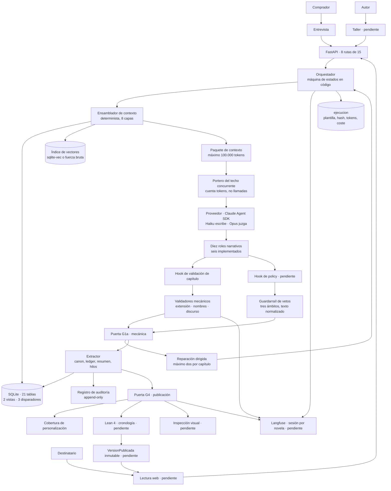
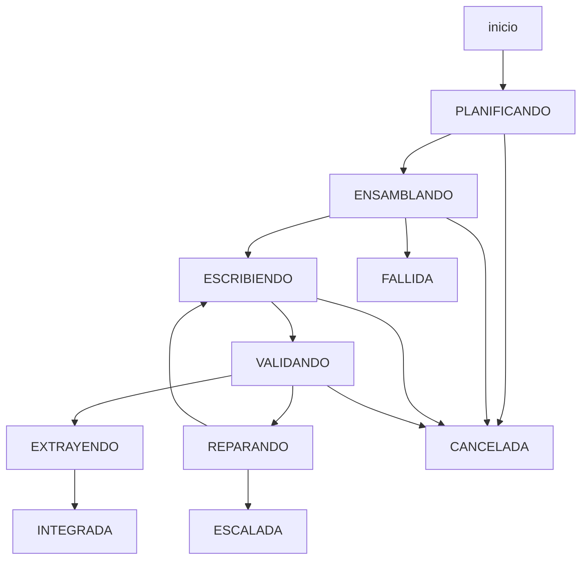
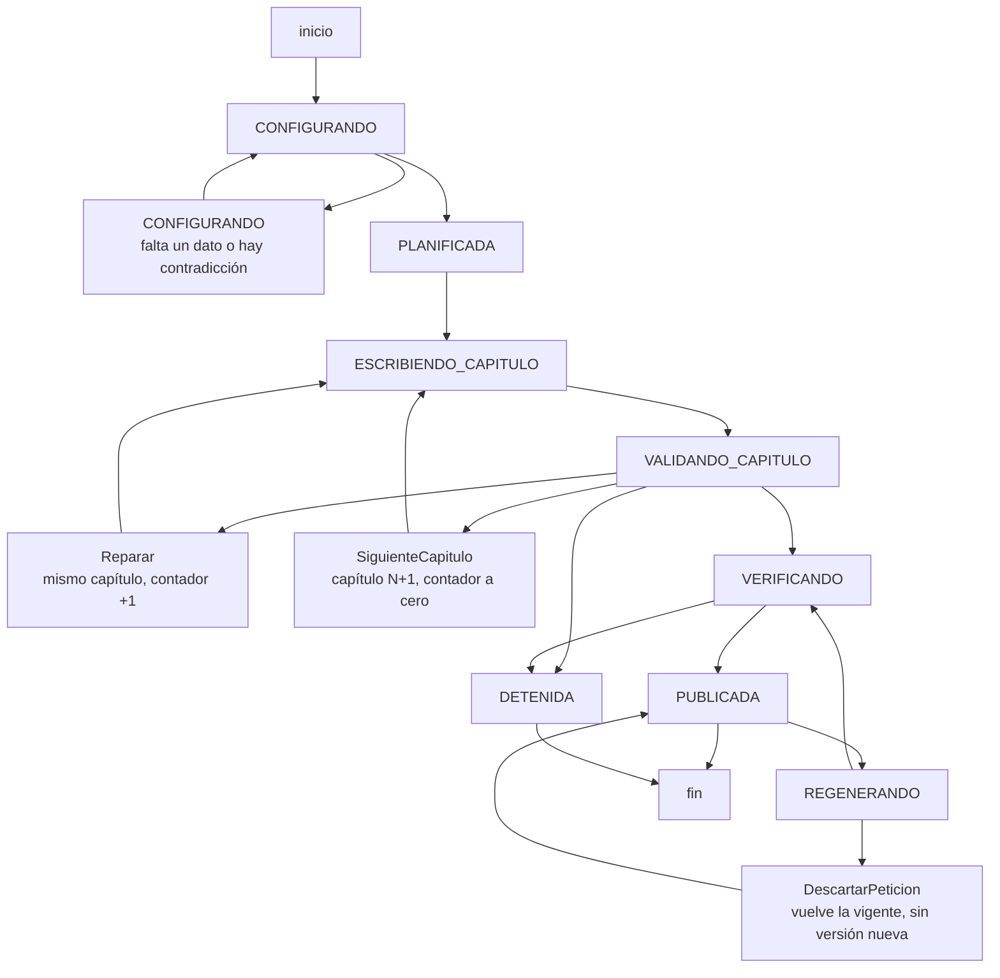
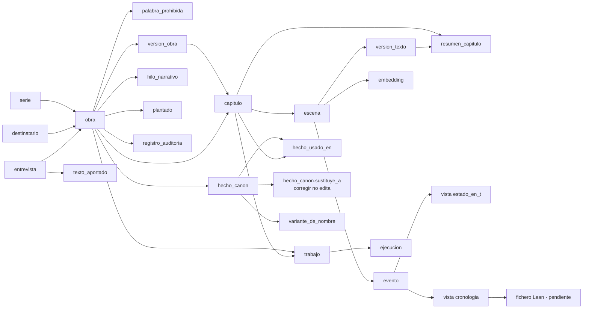
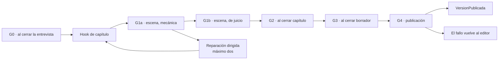

# Diagramas

**Qué es este documento.** Los cuatro diagramas que el encargo pide —arquitectura del
harness, máquina de estados de TLA+, esquema SQLite y tabla de validadores con su punto de
ejecución— reunidos en un sitio, más el ciclo del capítulo, que es la máquina que de verdad
está en código.

**Una convención que gobierna los cinco:** lo que **no está construido** se marca en el propio
diagrama con «· pendiente». Un diagrama de arquitectura que dibuja Langfuse, Lean y la lectura
web como si existieran no documenta el sistema: documenta el deseo.

Los diagramas de los documentos de contexto no se duplican aquí. `architecture.md` tiene
siete, `definitions.md` diez y `domain-knowledge.md` cinco; estos cinco son los que el
encargo nombra, y los tres primeros se construyen **a partir de** aquellos.

---

## 1 · Arquitectura del harness

**Lo que este diagrama deja ver y las tablas no.** Las tres piezas que sostienen las
afirmaciones más fuertes del proyecto están **antes** del proveedor, no después: el
Ensamblador es código, el portero cuenta tokens antes de conceder turno, y el paquete falla si
no cabe. Todo lo que hay **después** del modelo —validadores, puertas, extractor— es
detección; lo de antes es prevención.

**Y lo que deja ver de lo que falta:** los tres «pendiente» de la derecha —Lean, la versión
publicada y la lectura— son una **cadena**, no tres huecos sueltos. Por eso el orden de las
fases pone la publicación primero: sin ella, ni el frontend tiene qué mostrar ni Lean tiene
puerta donde vivir.

---

## 2 · Ciclo del capítulo — la máquina que está en código

`features/escritura/maquina.py`, con tabla de transiciones explícita y 64 tests. Diez
estados: **seis vivos y cuatro terminales**.

| Transición | Señal | Nota |
| --- | --- | --- |
| `ENSAMBLANDO → FALLIDA` | `contexto_excedido` | **Sin llamar al modelo.** Es fallo de diseño del ensamblado, no de ejecución |
| `VALIDANDO → EXTRAYENDO` | `aprobada` | No se puede saltar a `INTEGRADA`: es el Extractor quien deja rastro en la memoria |
| `VALIDANDO → REPARANDO` | `defecto_bloqueante` | El reintento lleva el defecto y su **cita** |
| `REPARANDO → ESCRIBIENDO` | intento por debajo del tope | El contador es **del capítulo**, no del trabajo |
| `REPARANDO → ESCALADA` | intento igual al tope | Dos reparaciones y se escala |
| cualquier estado vivo `→ FALLIDA` | `fallo_de_proveedor`, `tiempo_agotado` | El proveedor se cae en cualquier llamada y el plazo vence en cualquier paso |

**Un hueco del vocabulario, declarado:** no hay señal para «el proceso murió». La reanudación
cierra el trabajo muerto con `tiempo_agotado` **por descarte** — `contexto_excedido` sería un
diagnóstico falso y `cancelacion` miente sobre quién lo pidió. Una `proceso_interrumpido`
sería más honesta, y **hace que una traza mienta un poco**.

---

## 3 · Máquina de estados de la novela — el sujeto de TLA+

**Esta es la máquina que la especificación TLA+ tiene que modelar.** El `.tla` **no existe**:
es la Fase 7. Se dibuja aquí porque quien lo escriba parte de esto y de `maquina.py`, no de
una pizarra.

**Las tres flechas que parecen una y son dos**, y que son la trampa de modelado de esta
máquina:

| Acción | Qué hace | Toca el contador |
| --- | --- | --- |
| `Reparar` | Rehace **el mismo** capítulo con el defecto y su cita | **Sí, lo incrementa** |
| `SiguienteCapitulo` | Pasa al capítulo N+1, que aún no se ha escrito | **No.** Cada capítulo empieza con su contador |
| `DescartarPeticion` | La regeneración no prospera: **vuelve la versión vigente** | No |

Modelar las dos primeras como una sola acción tiene una consecuencia concreta y absurda:
**avanzar de capítulo consumiría reintentos**, y una novela de diez capítulos se detendría
sola por agotamiento sin que hubiera fallado nada. Y `DescartarPeticion` **no es una
publicación**: llega a `PUBLICADA` **sin crear nada**.

**Los invariantes que TLC tendrá que comprobar:**

| # | Tipo | Enunciado | Por qué así y no de otra forma |
| --- | --- | --- | --- |
| 1 | Seguridad | Ninguna `VersionPublicada` **se crea** sin haber pasado por `VERIFICANDO` | Enunciado sobre **la creación** y no sobre el estado: `DescartarPeticion` llega a `PUBLICADA` sin crear nada, así que «no se alcanza `PUBLICADA` sin pasar por `VERIFICANDO`» sería falsa en el primer paso — y el peligro no es el contraejemplo, es que alguien **la relaje para que pase** |
| 2 | Seguridad | La reanudación desde checkpoint **no duplica ni pierde** capítulos | Es el mismo requisito que ya cubren los tests de reanudación: dos métodos no correlacionados sobre la misma propiedad |
| 3 | Seguridad | `REGENERANDO` **no escribe sobre la versión vigente**: produce otra, o ninguna | Es lo que el encargo llama «se conserva la versión anterior» |
| 4 | Seguridad | El contador de intentos **solo crece**, y al llegar al límite la única salida es `DETENIDA` | No hay ciclo que lo reinicie |
| 5 | *Liveness* | Toda generación termina **publicando o parando con error**; nunca queda en bucle | Es la única que dice que algo **tiene** que pasar; las demás dicen qué no debe pasar |

**Y el eslabón débil, escrito antes de escribir el `.tla`:** que la especificación
**corresponda al código** es una **inspección** que nadie repite cuando el orquestador cambia.
`RF-FOR-07` obliga a que el README empareje cada acción con su transición. Una especificación
verde sobre un código que ya no implementa esa máquina **afirma la seguridad de otro
sistema**.

---

## 4 · Esquema SQLite

**21 tablas, 2 vistas derivadas y 3 disparadores**, en **una sola base y un solo motor**
(P-07). El diagrama dibuja las relaciones que estructuran el esquema; la tabla de debajo las
lista todas con su feature dueña.

| Tabla | Feature | Para qué |
| --- | --- | --- |
| `serie` | `obra` | Si existe, el canon se comparte **entre** obras desde el primer día |
| `obra` | `obra` | La novela: género, tono, nivel de calor, extensión |
| `destinatario` | `obra` | A quién se regala: nombre, edad, rasgos, recuerdos aportados |
| `entrevista` | `obra` | Existe **antes** que la obra: es lo que la crea. Guarda el `obra_id` que produjo, y por eso cerrarla dos veces no crea dos |
| `texto_aportado` | `obra` | El texto libre del Comprador. **Contenido no confiable** |
| `palabra_prohibida` | `obra` | Vetos en tres ámbitos: global, obra, brief |
| `hecho_canon` | `obra` | El grafo: `entidad`, `atributo`, `valor`, `confianza`, `origen`, `sustituye_a` |
| `variante_de_nombre` | `canon` | Apodos e hipocorísticos **declarados**: lo que separa un error de grafía de un apodo |
| `hecho_usado_en` | `canon` | **En qué capítulos se usa cada hecho.** Es lo que permite regenerar tras una corrección |
| `evento` | `canon` | El ledger, ***append-only***. Dos disparadores impiden `UPDATE` y `DELETE` |
| `resumen_capitulo` | `canon` | Derivado del texto aprobado; alimenta el contexto de los siguientes |
| `hilo_narrativo` | `canon` | Abierto, pagado o vencido |
| `plantado` | `canon` | Lo plantado y su pago |
| `embedding` | `canon` | El índice de vectores, detrás de `VectorStore` |
| `version_obra` | `outline` | Una por versión de biblia; cada escena apunta a la vigente cuando se escribió |
| `capitulo` | `outline` | POV, lugar, objetivo, obstáculo y giro previsto |
| `escena` | `escena` | La unidad de generación. Hoy 1:1 con el capítulo |
| `version_texto` | `escritura` | **Inmutable**: un disparador impide cambiar el texto |
| `ejecucion` | `escritura` | Plantilla con su hash, biblia, IDs por capa, modelo, semilla, tokens previstos **y reales**, coste, veredicto |
| `trabajo` | `escritura` | La unidad de trabajo persistida: estado, intento, `run_id`, causa de fallo |
| `registro_auditoria` | `obra` | ***Append-only***. Qué se permitió, qué se bloqueó y **por qué** |

**Las dos vistas no son tablas, y esa es la decisión:** `estado_en_t` y `cronologia` se
**derivan** del ledger. Una tabla de estado editable se desincroniza del texto, y entonces hay
dos relatos de lo que pasó.

**Lo que este esquema todavía no tiene, y está declarado:** `version_publicada`,
`capitulo_publicado`, `peticion_de_cambio`, `ficha_de_lectura`, `dedicatoria`, `defecto`,
`rubrica`, `puntuacion` y `ngrama_vetado`. Son las Fases 4, 5 y 6. Y dos deudas que vencen al
regenerar: **`evento` y `hecho_canon` no tienen `run_id`** —hoy es exacto y deja de serlo al
regenerar un capítulo ya integrado— y **`resumen_capitulo` tiene `UNIQUE(capitulo_id)` y
siempre inserta**.

---

## 5 · Validadores y su punto de ejecución

**Dónde corre un validador decide qué puede ver.** Uno que corre en el *hook* del capítulo no
puede mirar la novela entera; uno que corre en G4 mira la novela cuando ya está escrita, que
es el sitio correcto **y el más caro**.

| Validador | Punto | Qué bloquea | Estado |
| --- | --- | --- | --- |
| `esquema_de_brief` | G0 | No se planifica con un brief inválido | **Implementado** |
| `contradiccion_en_brief` | G0 | `CFG-01`: se resuelve **en la entrevista**, no escribiendo | **Implementado** |
| `texto_aportado_marcado` | Al entrar el `TextoAportado` | Que el texto del Comprador llegue a un prompt sin su marca de dato | **Implementado** |
| `esquema_de_salida_de_rol` | Tras cada llamada a un rol | Salida mal formada: es **fallo del paso**, no resultado vacío | **Implementado** |
| `extension_de_capitulo` | Hook de capítulo | `EST-02`: fuera del rango declarado | **Implementado** |
| `nombres_literales` | Hook de capítulo | `PER-02`: un nombre escrito distinto que en el canon | **Implementado** |
| `discurso` | Hook de capítulo | `VOZ-03`: persona o tiempo verbal distintos de los declarados | **Implementado** |
| `palabras_vetadas` | Hook de *policy*, antes de aceptar | `SEG-02`, con tope; agotado, **se detiene la generación** | **Implementado**, pero el hook de policy **no existe** |
| `presupuesto_de_contexto` | Antes de **cada** llamada | `ContextBudgetExceeded`: nunca un truncado silencioso | **Implementado** |
| `techo_concurrente` | Antes de conceder turno | Que la **suma** de tokens en vuelo pase de 100.000 | **Implementado** |
| `limite_de_reintentos` | Orquestador, en cada reparación | Superar el tope: la salida pasa a ser `ESCALADA` | **Implementado** |
| `hecho_usado_en` | Al integrar un capítulo | Un hecho sin registro de en qué capítulos se usa | **Implementado** |
| `checkpoint_reanudacion` | Al reanudar tras una caída | Duplicar o perder un capítulo | **Implementado** |
| `cobertura_de_personalizacion` | **G4** | `PER-01`: un elemento obligatorio que no aparece en ningún capítulo | **Implementado**, en `CATALOGO_DE_MANUSCRITO` |
| `giro_de_valor` | Hook, sobre la ficha | `EST-01`: valor de entrada y de salida iguales o nulos | Pendiente |
| `nivel_de_calor` | Hook | `SEG-01`: término por encima del nivel declarado | Pendiente |
| `edad_minima` | Esquema, al construir el brief | Contenido con menores: **bloquea por construcción** | **Implementado** en el brief |
| `continuidad_y_canon` | G1a | `CAN-01`, `CON-01`, `CON-03` contra el grafo | **A medias:** canon sí; continuidad y conocimiento **viven solo en el prompt** |
| `juez_con_rubrica` | G1b | **Hoy no bloquearía**: sin correlación medida ni firmada | Pendiente |
| `revision_humana` | El **Autor**, fuera del bucle | No bloquea: **produce el patrón** contra el que se mide el juez | Pendiente |
| `dedicatoria_fuera` | G4 | Que la dedicatoria entre como fragmento del manuscrito | Pendiente |
| `inspeccion_visual` | G4 | Índice, ficha o portada que no renderizan | Pendiente |
| `no_revelado_no_se_envia` | G4, sobre la ficha | Que un personaje no revelado **llegue al navegador** | Pendiente |
| `prosa_como_texto` | G4, por capítulo renderizado | Que el manuscrito se **interprete** en vez de mostrarse | Pendiente |
| `accesibilidad` | G4, sobre las rutas publicadas | Contraste, etiquetas, foco, orden de encabezados | Pendiente |
| `rutas_estables` | G4, antes de `inspeccion_visual` | Que portada, índice, capítulo y ficha cambien de URL | Pendiente |
| `cronologia_lean` | G4, en cada publicación | **No se publica.** El fallo vuelve al editor | Pendiente |
| `spec_tla` | **En desarrollo**, no en generación | Nada en ejecución: su resultado cambia el código o la especificación | Pendiente |

**Tres cosas que esta tabla deja ver y las otras no:**

1. **Quince de los veintiocho están implementados** —uno de ellos, `palabras_vetadas`, sin el
   hook de *policy* en el que debe correr—, y **los trece que faltan se concentran en G4 y en
   el juicio semántico**: es decir, en lo que mira la novela entera.
2. **La concentración en G4 es deliberada y cara.** Cobertura, dedicatoria, inspección visual
   y Lean bloquean al final, con la novela ya escrita. Es el sitio correcto —ninguno es
   comprobable sobre un capítulo suelto— y un fallo ahí **no cuesta un capítulo: cuesta lo
   que haya que rehacer**.
3. **Ninguno emite todavía su *score***, porque Langfuse no existe. `RF-VAL-01` lo pide para
   todos menos `spec_tla`, así que ese requisito está cerrado **por su mitad**: tienen nombre y
   punto declarado, no emiten.

**Y el patrón que recorre la columna de lo que no detectan**, que está en `verification.md`
§8.4 y conviene tener delante al leer la tabla: casi todos los puntos ciegos son **la misma
frase dicha de veinte maneras** — el validador comprueba **la forma y no el fondo**. El
esquema no juzga el contenido, la extensión no juzga el relleno, la cobertura no juzga la
integración, el renderizado no juzga la corrección. Es una propiedad de lo determinista, y
explica por qué los dos semánticos, que son los únicos que miran el fondo, son también los
únicos que hoy no detendrían nada.
