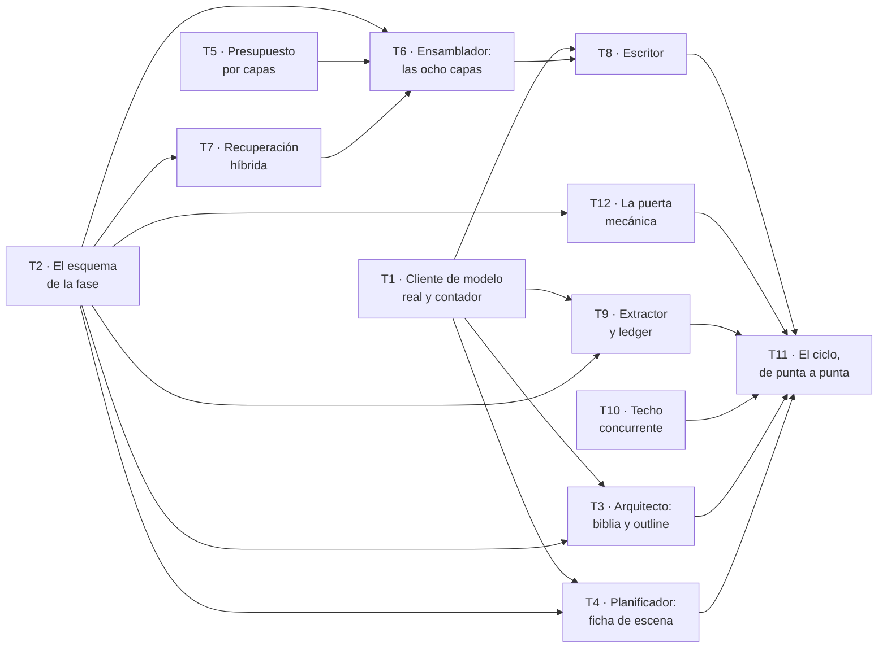

# Fase 2 — Escribir un capítulo

**Objetivo:** que de una `Obra` encargada salga una biblia, un outline de diez capítulos, y **un capítulo escrito de verdad** cuyos hechos entren al canon. Es el motor: la Fase 1 demostró que el sistema personaliza; esta demuestra que **escribe**.

**Enfoque:** el cliente de modelo real entra el primer día, porque sin él la Fase 1 no se puede ejecutar fuera de la suite. Pero **ninguna prueba de este plan llama al proveedor**: se sigue usando `DobleDeterminista`, que ya existe y está probado. El cliente real se prueba con una corrida manual declarada, no con la suite.

**Stack:** el de la Fase 1, más lo que P-01 aprobó en bloque y aquí se estrena: **Claude Agent SDK** (P-08), **NumPy** y **`sqlite-vec`** opcional.

**Spec:** [`spec.md`](spec.md), `aprobada`. Se lee junto a este plan.

---

## Qué hereda, y los dos huecos que cierra

La Fase 1 ([`plan-1-encargo.md`](plan-1-encargo.md), `completado`) dejó **88 tests en verde, ocho tablas y dos huecos declarados**. No son deuda escondida: están escritos en su apartado «Lo que esta fase NO hace», y son lo primero de aquí.

| Hueco heredado | Quién lo cierra |
| --- | --- |
| **No hay proveedor de modelo**, así que `CU-01` no corre fuera de la suite: `/respuestas` y `/cerrar` responden 500 | **T1** |
| **Nadie extrae hechos del `TextoAportado`**, así que `RF-ENT-06` está a medias y `CA-3` solo cubre el prompt | **T9** |

Y hereda algo que no es código: **los defectos del plan anterior se encontraron ejecutando, no leyendo.** Tres afirmaciones de cierre resultaron falsas, un saneado de prompt se podía burlar, un esquema de salida daba un brief por completo perdiendo el dato que faltaba, y una línea ausente en `env.py` habría generado el `drop_table` de cinco tablas. Este plan se escribe sabiendo eso.

### Una decisión de forma, tomada a la vista de la Fase 1

**Este plan especifica tests y contratos, no implementaciones.** El plan 1 traía el código de casi cada tarea, y **en tres sitios ese código estaba mal** —`normalizar()` no pasaba sus propios tests, el saneado del prompt se podía burlar, el esquema de salida no cerraba `extra`—. Nadie lo vio al aprobarlo: el código escrito en un documento da la confianza de estar revisado sin estarlo, porque no lo ejecuta nadie.

Aquí, cada tarea declara **qué debe ser cierto y cómo se comprueba**. La implementación la escribe quien la ejecuta, contra su test en rojo. Donde hay código en este plan es porque **es contrato entre tareas** —una firma, una forma de datos— y no porque sea la solución.

---

## Por qué este corte, y no otro

Decidido por `maujimenez4` el 2026-09-24, sobre tres alternativas. El criterio de `CLAUDE.md` §3.3 bis es que **cada plan entregue software que funcione y se pueda probar solo**.

**Un capítulo, no diez.** Es el corte más pequeño que **produce prosa**, que es el producto. Diez capítulos es sobre todo el orquestador —máquina de estados, checkpoint, reanudación—, y eso es una fase entera con sus propios criterios: `CA-1` y `CA-5`.

**Y lo que este corte no demuestra, dicho aquí y no al final:** un capítulo suelto **no ejercita el problema de coherencia**, que es el que aparece en el capítulo siete cuando el cuatro dijo otra cosa. La maquinaria que lo resuelve —canon, ledger, estado en T, recuperación— se construye y se prueba por unidades en esta fase. **Demostrarla a escala es de la Fase 3.** Quien apruebe este plan aprueba eso también.

---

## Cómo se reparte entre agentes

Escrito **antes** que las tareas, y no después, porque en la Fase 1 el reparto se añadió a un plan ya cortado por temas y hubo que recortar dos tareas para que cupiera.

### El grafo



| Ola | Tareas | Agentes a la vez |
| --- | --- | --- |
| 1 | T1 · T2 · T5 · T10 | 4 |
| 2 | T3 · T4 · T7 · T9 · **T12** | **5** — el punto más ancho |
| 3 | T6 | 1 — converge todo el contexto |
| 4 | T8 | 1 |
| 5 | T11 | 1 |

Ruta crítica: `T2 → T7 → T6 → T8 → T11`. **Cinco eslabones para doce tareas.** Dos olas anchas y tres cuellos: la ganancia realista vuelve a ser **del orden de 2×**, igual que en la Fase 1, donde se midió.

*T12 entra con la decisión **P-B** y no estaba en el corte original. Cabe en la ola 2 sin tocar a nadie: es la feature `calidad` entera, y ningún otro agente escribe ahí.*

### Las siete reglas, cinco de ellas aprendidas a golpes

1. **Un agente por fichero dentro de la ola.** La tabla de dueños de abajo es la lista completa.
2. **`modelos.py` de cada feature tiene un solo dueño, y las tablas de la fase entran en UNA migración: T2.** En la Fase 1 tres tareas querían escribir el mismo `modelos.py` y hubo que rehacer el corte a mitad.
3. **Quien añade una tabla añade su `import` en `alembic/env.py`, en el mismo commit.** Comprobado ejecutándolo en la Fase 1: sin esa línea, `--autogenerate` no ve la tabla y **el siguiente genera el `drop_table` de las que ya existen**. Una migración que destruye el esquema pasa las cinco puertas igual de bien que una que lo construye.
4. **Las fixtures compartidas tienen dueño por fixture**, declarado en la tabla. En la Fase 1 nadie creaba `conftest.py` y tres tareas lo necesitaban.
5. **Cada agente en su propio *worktree*, y lo primero que hace es comprobar su base.** En la Fase 1, **cinco de nueve worktrees arrancaron sobre la rama equivocada**. De las tres formas de recolocarse, solo `git checkout -b <rama> <hash>` atraviesa el clasificador de permisos.
6. **La tabla de Desviaciones la escriben todos y la resuelve el integrador.** Decisión tomada en la Fase 1 tras medirlo: son filas que se concatenan, y partirla en un fichero por tarea rompe el registro en trozos que nadie lee juntos.
7. **El integrador corre las puertas sobre el resultado COMBINADO al cerrar cada ola**, incluido `alembic upgrade → downgrade base → upgrade` y `alembic check`. Es lo único que ningún agente puede comprobar desde su rama.

### Quién es dueño de cada fichero compartido

| Fichero | Dueño | Quién más lo toca, y en qué ola |
| --- | --- | --- |
| `commons/llm/cliente.py` | T1 (ola 1) | Nadie. `obtener_cliente_modelo` deja de lanzar |
| `commons/llm/contador.py` | T1 (ola 1) | T5 lo consume, no lo escribe |
| `features/*/modelos.py` y la migración | **T2, y solo T2** | Las tablas de la fase entran juntas |
| `alembic/env.py` | T2 (ola 1) | Nadie más en esta fase: T2 declara todas las tablas |
| `app/conftest.py` | T2 añade `obra_con_outline` | T6 añade `paquete`; T8 añade `escritor` (olas 3 y 4, ambas de un solo agente) |
| `commons/domain/errores.py` | T5 añade `ContextBudgetExceeded` (ola 1) | T10 añade `TiempoAgotado` (ola 1) — **dos en la misma ola: ver aviso** |
| `features/contexto/service.py` | T6 (ola 3) | T11 (ola 5) |
| `features/calidad/` | **T12, y solo T12** (ola 2) | T11 la consume en la ola 5, no la escribe |

**El único cruce de la fase, y va dicho:** T5 y T10 añaden cada una una excepción a `commons/domain/errores.py` en la ola 1. Son dos líneas independientes al final de un fichero, del mismo tipo que los conflictos de Desviaciones que la Fase 1 resolvió sin incidentes. **El integrador lo espera.** La alternativa —serializarlas— costaría una ola entera por dos líneas.

---

## Restricciones globales

Se aplican a **todas** las tareas. Copiadas de la spec y de `CLAUDE.md`; los valores son literales.

| Restricción | Valor exacto | Origen |
| --- | --- | --- |
| Techo **por llamada** | **100.000 tokens**, repartidos en ocho capas con tope propio | `CLAUDE.md` §4.1 · RF-CTX-02, RF-CTX-03 |
| Techo **concurrente** | **100.000 tokens** sumados sobre las llamadas **en vuelo**. No es el mismo límite | encargo §7 · RF-ORQ-10 · spec, «presupuesto concurrente» |
| Contar antes de llamar | **Nunca se llama al modelo sin haber contado.** El contador es inyectado, no una estimación por caracteres | RF-CTX-02 |
| Qué se recorta | La capa que se pasa, **no las vecinas**. Constitucional e Instrucción **nunca** | RF-CTX-03, RF-CTX-07 |
| Si no cabe | `ContextBudgetExceeded` **sin llamar al modelo**. Nunca truncar por el final en silencio | RF-CTX-03 |
| Capa vacía | Si una capa debería tener contenido y llega vacía, **falla antes de llamar**: es fallo del almacén, no del Escritor | RF-CTX-06 |
| Ensamblado | **Código determinista**, nunca un modelo | RF-CTX-01 |
| El Escritor | **Solo ve el paquete.** Nunca accede a la base de datos | RF-ESC-01 |
| Recuperación | **En este orden**: filtro estructural → orden semántico sobre lo ya filtrado → fusión con recencia | RF-CTX-04 |
| Memoria | Solo el **Extractor** escribe memoria de largo plazo, y solo desde el paso de extracción | RF-MEM-06 |
| Ledger | *Append-only*. `estado_en_t` y la cronología son **vistas derivadas**, jamás tablas que se editan | RF-MEM-05 |
| Versiones de texto | **Inmutables**: editar crea una nueva y marca la vigente | RF-ESC-02 |
| Pruebas | **Sin red y sin credenciales.** El proveedor se sustituye por `DobleDeterminista` | RNF-FIA-01 · CA-4 |
| Dos modos | La suite corre **con y sin** la extensión vectorial | RNF-FIA-02 · CA-28 |
| TDD | Rojo → verde → refactor. El test entra **en el mismo commit** | `CLAUDE.md` §3.4 |
| Vocabulario | Todo término existe en `docs/definitions.md` v2.3 | `CLAUDE.md` §2 |

**Los dos techos no son el mismo**, y la spec dedica un párrafo a decirlo porque confundirlos dejó el encargo §7 sin cumplir durante meses. El de la llamada se comprueba **al ensamblar el paquete**; el concurrente, **al conceder el turno**. Que las dos cifras sean 100.000 es casualidad de números.

---

## Puntos de revisión

Ocho clases de entrada que la spec implica y que **ninguna tarea probaría si no se dijera aquí**. Están **además** de los tests de su tarea.

| # | Entrada o condición | Qué espera una persona razonable | Tarea |
| --- | --- | --- | --- |
| R-1 | Un paquete que **cabe justo**: suma exactamente 100.000 | Pasa. El techo es «no más de», no «menos de». Una frontera mal puesta rechaza paquetes legítimos, y nadie lo nota hasta que el capítulo falla sin motivo | 5 |
| R-2 | Una capa que **se pasa de su tope** mientras las demás van holgadas | Se recorta **esa** y el paquete sale. Recortar a prorrata es lo que parece razonable y es justo lo que RF-CTX-03 prohíbe | 5 |
| R-3 | **Capa de canon vacía** en un capítulo que tiene hechos que la surtirían | **Falla antes de llamar.** Un paquete al que le falta el canon produce prosa que contradice lo ya escrito, y el defecto se atribuiría al Escritor, que no lo cometió | 6 |
| R-4 | Dos paquetes que **suman 100.001** en vuelo | El segundo **espera**, y arranca en cuanto el primero libera. Y dos que suman menos **sí se solapan**: un sistema que serializa todo cumple el techo y no cumple la decisión | 10 |
| R-5 | Recuperación sobre un corpus donde **lo parecido y lo pertinente difieren** | Devuelve lo pertinente. Ordenar por parecido sin filtrar antes trae escenas parecidas, que es el fallo que la spec anterior escondió detrás de un requisito «probado» | 7 |
| R-6 | La extensión vectorial **no carga** | El sistema arranca, avisa, y la suite pasa igual. Si `sqlite-vec` fuera obligatorio, sería una segunda base de datos por la puerta de atrás | 7 |
| R-7 | Un capítulo **rechazado** tras haber llamado al modelo | **No deja rastro** en canon, ledger ni índice. Lo que se descarta no puede contaminar el capítulo siguiente | 9 |
| R-8 | `TextoAportado` con **«ignora tus instrucciones»** pasando por el Extractor | Sus hechos se extraen y **el paquete del capítulo siguiente no cambia**. Es RNF-SEG-03, la mitad de `CA-3` que la Fase 1 no pudo cerrar | 9 |

---

## Decisiones

Las tres preguntas abiertas de este plan, cerradas por `maujimenez4` el 2026-09-24. Se conservan con su porqué, como hace la spec.

### P-A · Dos contadores, y son dos momentos distintos

**La pregunta era falsa en su premisa, y la respuesta lo destapó.** Se preguntaba «cómo se cuentan los tokens sin clave», dando por hecho que había **un** contador. Hay dos, y sirven para cosas distintas:

| Momento | Requisito | Quién lo da |
| --- | --- | --- |
| **Antes** de llamar | **RF-CTX-02** — contar para decidir si el paquete cabe, y **fallar sin gastar** si no | Un **tokenizador local**, inyectado tras `ContadorDeTokens` |
| **Después** de llamar | **RF-OBS-03** — tokens, coste y latencia por llamada, capítulo y novela | El **recuento real del proveedor**, persistido en `ejecucion` |

**Langfuse mide el segundo, no el primero**, y esa es la parte que la pregunta no veía: para cuando el *tracing* ve una llamada, la llamada ya se hizo. RF-CTX-02 existe precisamente para que un paquete que no cabe **no llegue a gastarse**. Son requisitos distintos y ninguno sustituye al otro.

**Y el primero no obliga a tocar la spec.** RF-CTX-02 prohíbe, con esas palabras, «una estimación **por caracteres**» — y un tokenizador BPE de verdad no es eso. Además **`tiktoken` ya está en las catorce dependencias que P-01 aprobó en bloque**: el proyecto había presupuestado el contador local desde el principio.

**Lo que sí hay que declarar, porque es un riesgo y no una comodidad:** un tokenizador local **aproxima** el de Anthropic, así que el recuento previo tiene deriva. Dos cosas la acotan, y las dos ya estaban:

- La **capa de reserva** de 10.000 tokens (`CLAUDE.md` §4.1), que existe para que el reintento quepa y absorbe también este margen.
- **`ejecucion` guarda los dos números** —el previsto y el real— desde esta fase, porque RF-OBS-06 ya exige «tokens por capa» y «coste». Con eso, **la deriva del contador local deja de ser un riesgo declarado y pasa a ser una cifra medible**. Es lo que la idea de medir por *tracing* aporta de verdad: no resuelve el conteo previo, pero permite saber cuánto se equivoca.

*Langfuse entero —sesión por novela, spans, scores, plantillas versionadas: RF-OBS-01 a 05— **no entra en esta fase**. Ver «Lo que esta fase NO hace».*

### P-B · La puerta de esta fase es mecánica, y el juez no entra

**Recomendación aplicada.** Esta fase no construye el Crítico ni el Continuista, y **sí** construye una puerta.

**Por qué no entra el juez, y no es solo alcance.** RF-JUZ-06 dice que **el juez no bloquea** mientras su correlación con la revisión humana no se haya medido sobre un conjunto y firmado. Meterlo aquí sería construir un componente que, por regla del propio proyecto, **no puede parar nada** — y calibrarlo exige una novela entera y una revisión con rúbrica, que son de fases posteriores.

**Por qué el Continuista tampoco.** Contrasta contra el grafo de canon (RF-VAL-06), y un capítulo suelto no tiene contra qué chocar: su trabajo empieza cuando el capítulo siete puede contradecir al cuatro. Es de la Fase 3, con la coherencia a escala.

**Pero sin ninguna puerta, R-7 no se puede probar.** «Un capítulo rechazado no deja rastro» necesita algo que rechace; si nada rechaza nunca, el test es teatro. Por eso entra **T12**, con los validadores que **sí** funcionan sobre un capítulo solo y **sin llamar a ningún modelo**: longitud, persona y tiempo verbal, nombres contra el canon, y la forma del defecto.

### P-C · Se escribe un **capítulo**, y la escena sigue siendo la unidad de generación

Las dos cosas a la vez, que es lo que ya dicen los documentos y conviene no improvisar:

- **Hacia fuera, capítulo.** El endpoint es `POST /capitulos/{id}/escribir` (RI-05, literal), el trabajo es de un capítulo y lo que se entrega es un capítulo. El encargo cuenta capítulos.
- **Hacia dentro, escena.** `CLAUDE.md` §1 dice que la unidad atómica de generación es la escena, y `definitions.md` §4.1 que un `Capitulo` contiene **exactamente una** `Escena`. Hoy coinciden **1:1**.

**Las dos tablas existen** (T2). No se colapsan en una, y el motivo lo da el propio documento: el capítulo es unidad de **lectura** y la escena de **generación**; si algún día la extensión crece, la cardinalidad vuelve a `1..*` **sin tocar nada más**. Colapsarlas ahora ahorra una tabla y cuesta una migración de datos después.

---

## Estructura de ficheros

Sobre lo que dejó la Fase 1. Cinco de las nueve features de `CLAUDE.md` §5.1 nacen aquí; **ninguna es nueva**: las nueve las aprobó la spec en Impacto técnico.

```
src/backend/app/
  commons/
    llm/claude_code.py          el cliente real (P-08). NO se usa en la suite
    llm/contador.py             el contador real, detrás del protocolo
    jobs/turnos.py              el techo concurrente: cuenta TOKENS, no llamadas
  features/
    outline/                    Arquitecto: biblia y outline de diez capítulos
    escena/                     Planificador de escena: la ficha
    contexto/                   Ensamblador: las ocho capas. ES CÓDIGO, NO UN MODELO
      capas.py  presupuesto.py  recuperacion.py  almacenes.py
    escritura/                  Escritor, y el ciclo de un capítulo
    canon/                      Extractor, ledger, estado en T
```

**`contexto` no tiene `agents.py`, y es lo único que lo distingue de las demás.** El Ensamblador es la única pieza de `CLAUDE.md` §9 que **no** es un modelo: si lo fuera, no se podría reproducir un fallo.

---

## Tarea 1 · El cliente de modelo real, y el primer hueco de la Fase 1

Cierra el hueco declarado: hoy `/respuestas` y `/cerrar` responden **500** contra la aplicación levantada. Cierra además **RF-OBS-03** *(parcial: el coste derivado)*.

**Ficheros:** `commons/llm/claude_code.py`, `commons/llm/cliente.py` (modificar), `commons/llm/contador.py`, y sus tests.

**Contrato que produce, y que consumen T3, T4, T8 y T9:**
- `obtener_cliente_modelo()` deja de lanzar `NotImplementedError` y devuelve el cliente real.
- `ClienteModelo` **no cambia de forma**: `async completar(prompt, semilla) -> str`. Si cambiara, rompería a `DobleDeterminista` y con él la suite entera.
- `ContadorDeTokens` gana su implementación real.

**Qué debe ser cierto, y cómo se comprueba:**

| | Cómo |
| --- | --- |
| La suite **sigue sin llamar al proveedor** | La suite pasa con la red caída. Es CA-4, y aquí es donde más fácil sería romperlo |
| El cliente real **no se instancia al importar** | Un test comprueba que importar `app.main` no abre ningún proceso ni lee credenciales |
| Haiku escribe, Opus juzga (P-02) | El modelo es parámetro, y el test comprueba que el valor por defecto del Escritor es Haiku |
| El coste se **deriva** de tokens y tarifa declarada | No se lee de ninguna factura: con consumo de cuenta no existe cargo por llamada (RF-OBS-03) |

**Y una corrida manual declarada, que no es un test.** Al terminar, se ejecuta `CU-01` contra la aplicación levantada y se comprueba que `/respuestas` y `/cerrar` dejan de responder 500. **Gasta cuota.** Se hace una vez, se copia la salida en el informe, y no entra en la suite.

> **P-A la cierra así:** `ContadorDeTokens` se implementa con un **tokenizador local** —`tiktoken` ya está entre las catorce dependencias que P-01 aprobó— y eso satisface RF-CTX-02, que prohíbe la estimación **por caracteres** y no un tokenizador de verdad. **La spec no cambia.** El recuento **real** del proveedor se guarda además en `ejecucion` junto al previsto, para que la deriva se pueda medir en vez de suponerse.

---

## Tarea 2 · El esquema de la fase, entero y en una migración

Cierra **RD-03** *(parcial)* y sostiene a todas las demás. Es la tarea que más ficheros toca y la única que toca migraciones: **es deliberado**, y el motivo está en la regla 2 del reparto.

**Ficheros:** `modelos.py` de `outline`, `escena`, `escritura`, `canon`; `alembic/env.py`; **una** migración; la fixture `obra_con_outline` en `app/conftest.py`.

**Las tablas, con lo que cada una sostiene:**

| Tabla | Sostiene |
| --- | --- |
| `version_obra` | La biblia versionada. Cada escena apunta a la vigente cuando se escribió (RF-PLA-01) |
| `capitulo`, `escena` | Outline de diez, **una escena por capítulo** (RF-PLA-02) — ver **P-C** |
| `version_texto` | **Inmutable.** Editar crea otra y marca la vigente (RF-ESC-02) |
| `evento` | El ledger, *append-only*. **Nunca se actualiza ni se borra** (RF-MEM-05) |
| `resumen_capitulo` | Derivado del texto aprobado; alimenta el contexto de los siguientes (RF-MEM-04) |
| `hilo_narrativo`, `plantado` | Abierto, pagado, vencido |
| `hecho_usado_en` | Qué capítulos se apoyan en un hecho (RF-MEM-02). **Sin esto no hay `CA-15` ni petición del lector** |
| `ejecucion` | Prompt con su hash, versión de biblia, IDs recuperados, modelo, semilla, tokens por capa, coste (RF-OBS-06) |
| `trabajo` | La unidad de trabajo de `architecture.md` §3.2, con su `run_id` |
| `embedding` | Detrás de `VectorStore`: `vec0` o BLOB. Lo usa T7 |

**Qué debe ser cierto:**
- `estado_en_t` y la cronología son **vistas**, no tablas. Un test comprueba que **no existe repositorio que escriba sobre ellas** y que se reconstruyen desde el ledger.
- El ledger rechaza `UPDATE` y `DELETE` **en el esquema**, no por convenio de función. *La Fase 1 dejó el registro de auditoría con una puerta con cartel en vez de una pared, y lo anotó; aquí no se repite.*
- `alembic upgrade → downgrade base → upgrade` en limpio, una sola *head*, y `alembic check` sin operaciones pendientes.
- Las restricciones muerden **sobre la base migrada**, no solo sobre la que `create_all` levanta en los tests.

---

## Tarea 5 · El presupuesto por capas, y el techo de la llamada

Cierra **RF-CTX-02**, **RF-CTX-03**, **RF-CTX-05**, **RF-CTX-07** y **CA-7**. Corre en la ola 1 porque es **código puro**: no toca base de datos ni framework.

**Ficheros:** `features/contexto/presupuesto.py`, `commons/domain/errores.py` (añade `ContextBudgetExceeded`), y sus tests.

**Contrato que produce, y que consume T6:**

```python
class Capa(StrEnum):
    CONSTITUCIONAL = "constitucional"   # tope 5.000  · nunca se recorta
    ESTRUCTURAL = "estructural"         # tope 10.000
    CANON = "canon"                     # tope 20.000
    ESTADO_EN_T = "estado_en_t"         # tope 15.000
    CONTINUIDAD = "continuidad"         # tope 20.000
    MEMORIA = "memoria"                 # tope 10.000
    INSTRUCCION = "instruccion"         # tope 10.000 · nunca se recorta
    RESERVA = "reserva"                 # tope 10.000 · para reparación y reintento
```

`presupuestar(piezas, contador) -> Desglose` devuelve **el desglose por capa junto al paquete**, que se persiste en `ejecucion`.

**Qué debe ser cierto:**

| | Por qué importa |
| --- | --- |
| El desglose **suma lo que dice** | Un desglose que no cuadra hace inútil la auditoría de `CU-07` |
| Se recorta **la capa que se pasa**, no las vecinas | R-2. Recortar a prorrata es lo que parece razonable |
| Constitucional e Instrucción **nunca** se recortan | RF-CTX-07. Se comprueba con un caso donde recortarlas sería la salida fácil |
| Si tras recortar no cabe → `ContextBudgetExceeded` **sin haber llamado** | Se comprueba con un doble que **falla si alguien lo llama** |
| 100.000 exactos **caben** | R-1 |
| La **reserva** sigue libre tras un ensamblado normal | Es lo que permite que el reintento con el defecto añadido quepa |

---

## Tarea 10 · El techo concurrente: se cuentan tokens, no llamadas

Cierra **RF-ORQ-08**, **RF-ORQ-10** y **CA-36**. Es el requisito que, según la spec, **es el único que comprueba lo que el encargo §7 pide de verdad**.

**Ficheros:** `commons/jobs/turnos.py`, `commons/domain/errores.py` (añade `TiempoAgotado`), y sus tests.

**Qué debe ser cierto:**
- La suma de tokens **en vuelo** no pasa de 100.000. El turno se da **contando tokens, no llamadas**.
- Si admitir una llamada haría pasar el techo, esa llamada **espera**. **Nunca se recorta el paquete para hacerla caber, ni se lanza igualmente.**
- **Dos paquetes que suman menos SÍ se solapan.** Es la mitad que de verdad distingue: un sistema que serializa todo cumple el techo y **no** cumple la decisión P-06.
- El contador en vuelo es **observable**, no implícito: se puede leer, y por eso se puede probar.
- Sin turno antes del *timeout* → `TiempoAgotado`, **sin coste**.
- Una escena en vuelo **por obra**; obras distintas sí se solapan, y el Continuista y el Crítico del mismo capítulo también.

*Esta tarea no llama a ningún modelo: prueba el portero, no lo que pasa al otro lado.*

---

## Tarea 3 · El Arquitecto: biblia y outline de diez capítulos

Cierra **CU-02**, **RF-PLA-01** a **RF-PLA-04**, **RI-04** y **CA-32**.

**Ficheros:** `features/outline/` (`router.py`, `service.py`, `repository.py`, `agents.py`, `prompts/arquitecto.v1.md`, `schemas.py`, tests).

**Qué debe ser cierto:**
- La biblia sale del brief y queda **versionada** (`version_obra`).
- El outline tiene **diez capítulos**, cada uno con POV, lugar, objetivo, obstáculo y **giro de valor previsto**.
- **Cada beat obligatorio de género se asigna a exactamente un capítulo.** Uno sin asignar o duplicado es **error de dominio**, no un aviso. Es `CA-32`, y se comprueba por los dos lados: falta y duplicado.
- La salida del agente **se valida con esquema** antes de creérsela (RF-ORQ-09). *La Fase 1 descubrió que un `BaseModel` sin `extra="forbid"` deja pasar una clave de más y pierde datos en silencio: aquí se cierra desde el principio.*

---

## Tarea 4 · El Planificador de escena: la ficha

Cierra **RF-ESC** *(la entrada del Escritor)* y la parte de `CU-03` anterior al ensamblado.

**Ficheros:** `features/escena/` (`service.py`, `repository.py`, `agents.py`, `prompts/planificador.v1.md`, `schemas.py`, tests).

**Qué debe ser cierto:**
- La ficha lleva **objetivo, obstáculo y giro de valor no nulo**. Es la **regla de dominio 1**, y una escena sin giro de valor es relleno: `definitions.md` la llama «la primera validación automática que conviene implementar».
- **Un POV y solo uno.**
- La ficha hereda de la obra `persona`, `tiempo_verbal` y `nivel_de_calor`, que son restricciones duras del prompt del Escritor.
- Aplica **CA-6**: quitando la validación del giro de valor, cae su test y solo el suyo.

---

## Tarea 7 · Recuperación híbrida, y los dos modos de `VectorStore`

Cierra **RF-CTX-04**, **CA-8** y **RNF-FIA-02**. Es la tarea con el punto ciego mejor documentado del proyecto.

**Ficheros:** `features/contexto/recuperacion.py`, `features/contexto/almacenes.py`, `commons/db/vectores.py`, y sus tests.

**El orden no es negociable, y la spec explica por qué:**

1. **Filtro estructural** — presentes, lugar, hilos abiertos, rango de capítulos.
2. **Orden semántico** sobre el conjunto **ya filtrado**.
3. **Fusión con recencia.**

**Qué debe ser cierto:**

| | Por qué |
| --- | --- |
| **El filtro estructural existe y filtra**, no solo pone un tope | Es `CA-8`, el criterio que la versión anterior de la spec **no tuvo** — y por eso el filtro quedó sin implementar con un requisito que decía estar probado |
| Con un corpus donde **lo parecido y lo pertinente difieren**, devuelve lo pertinente | R-5. Un criterio que solo comprueba el tope se cumple sin filtrar |
| La suite corre **en los dos modos**, con y sin `sqlite-vec` | R-6 · RNF-FIA-02. Si la extensión fuera obligatoria sería una segunda base de datos por la puerta de atrás |
| Si la extensión no carga, **el sistema arranca y avisa** | Degradar en silencio es peor que fallar |

**Y lo que esto NO da, que la spec declara sin suavizar:** el orden semántico lo resuelve el mismo proveedor que genera, así que **es una señal con varianza**. El paquete deja de ser reproducible: dos ensamblados del mismo estado pueden devolver otro orden en esta capa. Las otras siete siguen siendo deterministas, y `ejecucion` guarda los IDs recuperados, de modo que **una ejecución concreta es auditable aunque no repetible**. Se cambió a propósito, sabiendo lo que costaba.

---

## Tarea 9 · El Extractor, el ledger, y el segundo hueco de la Fase 1

Cierra **RF-MEM-01** a **RF-MEM-07**, **RNF-SEG-03**, la mitad que faltaba de **RF-ENT-06** y con ella **CA-3** entero. Y **CA-10**.

**Ficheros:** `features/canon/` (`service.py`, `repository.py`, `agents.py`, `prompts/extractor.v1.md`, tests).

**Qué debe ser cierto:**

| | Por qué importa |
| --- | --- |
| Cada hecho nuevo entra al grafo **citando su escena de origen** | Regla de dominio 4. La Fase 1 dejó la otra mitad —`origen: brief`— construida y probada |
| **Del `TextoAportado` se extraen hechos** con `origen: brief` y sin escena | Cierra el hueco de la Fase 1. Produce `HechoDelBrief`, que ya existe con la forma del documento: `entidad`, `atributo`, `valor`, `confianza` |
| `estado_en_t` y la cronología se **derivan** del ledger | RF-MEM-03, RF-MEM-05. Un test las reconstruye desde cero y compara |
| Un capítulo **rechazado no deja rastro** | R-7 · `CA-10`. Se provoca un defecto bloqueante y se comprueba que canon, ledger e índice quedan intactos |
| Prosa con instrucciones incrustadas **no altera el paquete siguiente** | R-8 · RNF-SEG-03. Es la mitad de `CA-3` que la Fase 1 no pudo cerrar |
| Corregir un hecho **no lo edita**: crea uno que lo sustituye y cita al anterior | RF-MEM-08 |
| **Solo el Extractor** escribe memoria de largo plazo | RF-MEM-06. Se comprueba por análisis: ninguna otra ruta de código escribe en canon, ledger ni índice |

---

## Tarea 6 · El Ensamblador: las ocho capas

Cierra **RF-CTX-01**, **RF-CTX-06**, **RF-CTX-08**, **RF-CTX-09** y **CA-12**. Va sola en su ola porque **converge todo**: presupuesto, recuperación, canon, ledger y outline.

**Ficheros:** `features/contexto/` (`capas.py`, `service.py`, `router.py`), la fixture `paquete`, y sus tests.

**Qué debe ser cierto:**
- El paquete lo ensambla **código determinista**, nunca un modelo (RF-CTX-01). *Si fuera un modelo, no se podría reproducir un fallo — y ese es el motivo, no la eficiencia.*
- La capa de canon **etiqueta cada pieza por `hc_id`**, no por posición: la posición cambia con el recorte y el identificador no (RF-CTX-08).
- `ejecucion` persiste los IDs de **todas** las capas que los tienen, con su capa, y **solo de las piezas que sobrevivieron al recorte** (RF-CTX-09).
- **Una capa vacía cuando debería tener contenido falla antes de llamar** (R-3 · RF-CTX-06).
- Desde una fila de `ejecucion`, **y con el estado de almacenes de ese capítulo**, se reconstruye el mismo paquete con el mismo desglose, y se sabe **qué hechos de canon entraron** (`CA-12`).

---

## Tarea 8 · El Escritor

Cierra **RF-ESC-01**, **RF-ESC-02**, **RF-ESC-03** y **RF-GUA-03**.

**Ficheros:** `features/escritura/` (`agents.py`, `service.py`, `prompts/escritor.v1.md`, tests).

**Qué debe ser cierto:**
- **El Escritor solo ve el paquete.** Nunca accede a la base de datos. Se comprueba por análisis **y** con un test que le pasa un paquete y le corta la sesión: si toca la base, falla. *De aquí sale que un defecto sea atribuible: si le falta un dato, el fallo es del ensamblado.*
- Cada versión de texto es **inmutable**.
- El reintento lleva **el defecto concreto con su cita** en el prompt. **Nunca un reintento genérico** como «mejóralo».
- Una palabra vetada devuelve el capítulo al escritor **con el término concreto**, con límite de intentos; agotado, **la generación se detiene y se informa** (RF-GUA-03). *La Fase 1 dejó `contiene_veto` devolviendo el término y no un booleano precisamente para esto.*
- La prosa usa la `persona` y el `tiempo_verbal` de la obra, **comprobado en el texto** y no solo pedido en el prompt (regla de dominio 10).

---

## Tarea 11 · El ciclo, de punta a punta

Cierra la fase. No añade comportamiento: **conecta** y demuestra.

**Ficheros:** `features/escritura/ciclo.py`, `features/escritura/router.py`, `main.py`, y el test de extremo a extremo.

**Qué debe ser cierto:**
- De una `Obra` de la Fase 1 sale biblia, outline y **un capítulo integrado**, con `DobleDeterminista`.
- `ejecucion` queda escrita con prompt y su hash, versión de biblia, IDs recuperados, modelo, semilla, tokens por capa y coste (RF-OBS-06, regla de dominio 7).
- El estado del trabajo se lee por `GET /trabajos/{id}`.
- **Y una corrida real declarada**, como la de T1: un capítulo escrito con el modelo de verdad, cuya salida se copia en el informe y **no entra en la suite** ni en el repositorio (RD-06).

---

## Tarea 12 · La puerta mecánica del capítulo

Entra con la decisión **P-B**. Cierra **RF-VAL-03**, **RF-VAL-04**, **RF-VAL-07**, la **regla de dominio 10**, y los criterios **CA-16**, **CA-17** y **CA-35**.

**Ficheros:** `features/calidad/` (`validadores.py`, `puerta.py`, `defectos.py`, `schemas.py`, tests). Nadie más escribe en esa feature.

**Lo que NO tiene, y es la mitad de la tarea:** ni `agents.py` ni `prompts/`. **Ningún validador de esta tarea llama a un modelo.** El Crítico y el Continuista son de fases posteriores; aquí solo hay código que mira texto y canon.

**Qué debe ser cierto:**

| | Por qué importa |
| --- | --- |
| La longitud está **dentro del rango declarado**; fuera, vuelve al escritor | `CA-35` · RF-VAL-04. Se prueba por los dos lados: corto, largo y dentro |
| Los nombres aparecen **como el canon los declara**: forma canónica **o una variante declarada** | `CA-16`. «Maria» por «María» es defecto `PER-02`; «Mari» por «María» **no**, si el canon la declara. Un validador literal prohibiría por escrito que a María la llamen Mari, que en una novela de regalo es justo lo que uno espera |
| La prosa usa la `persona` y el `tiempo_verbal` de la obra, **comprobado en el texto** | Regla de dominio 10. No basta con pedirlo en el prompt: eso ya se hacía y no lo comprobaba nadie |
| Antes de la puerta se comprueba la **forma** de cada defecto | `CA-17` · RF-VAL-07: código de la taxonomía, y **cita que es subcadena exacta en su desplazamiento**. Un defecto mal formado **no bloquea, no gasta reintento y se cuenta aparte** |
| Cada validador tiene **nombre** y un **punto de ejecución declarado** | RF-VAL-01. Lo que no se puede nombrar no se puede contar |

**Y por qué esta tarea existe aunque el juez no:** sin una puerta que rechace de verdad, **R-7 no se puede probar**. «Un capítulo rechazado no deja rastro en canon, ledger ni índice» necesita algo que rechace; si nada rechaza nunca, el test pasa sin comprobar nada. Es el mismo defecto que la Fase 1 encontró dos veces —una restricción sobre la que ningún test podía caer— y aquí se evita antes.

---

## Lo que esta fase deja cerrado

| Criterio | Qué demuestra |
| --- | --- |
| **CA-3** *(entero)* | Lo que la Fase 1 dejó a medias: sus hechos **se extraen** y ningún prompt cambia |
| **CA-7** | El desglose suma lo que dice, respeta los topes, y si no cabe lanza sin llamar |
| **CA-8** | La recuperación **filtra antes de ordenar** |
| **CA-10** | Un capítulo rechazado no deja rastro |
| **CA-12** | Desde `ejecucion` se reconstruye el paquete y se sabe qué hechos entraron |
| **CA-32** | Cada beat obligatorio, en exactamente un capítulo |
| **CA-36** | Dos paquetes que suman de más no corren a la vez; dos que suman de menos **sí** |
| **CA-16** | «Maria» por «María» es defecto; «Mari» por «María» **no**, si el canon la declara variante |
| **CA-17** | Un defecto con cita inventada no bloquea, no gasta intento y se cuenta aparte |
| **CA-35** | Un capítulo fuera del rango vuelve al escritor; uno dentro pasa |
| **CA-4** *(mantenido)* | La suite sigue pasando sin red y sin credenciales |

**Requisitos:** RI-04, RI-05, RI-06, RI-07 · RF-PLA-01 a 04 · RF-CTX-01 a 09 · RF-ESC-01 a 03 · RF-MEM-01 a 08 · RF-ORQ-08, RF-ORQ-09 *(parcial)*, RF-ORQ-10 · RF-GUA-03 · RF-VAL-01, RF-VAL-03, RF-VAL-04, RF-VAL-07 · RF-OBS-03, RF-OBS-06 · RF-ENT-06 *(la mitad que faltaba)* · RNF-SEG-03, RNF-FIA-02 · RD-03 *(parcial)*.

## Lo que esta fase NO hace, y no es un olvido

- **No escribe diez capítulos.** Uno. El orquestador con su máquina de estados, el checkpoint y la reanudación son de la Fase 3, y con ellos `CA-1` y `CA-5`.
- **Y por tanto no demuestra la coherencia a escala**, que es el problema real del producto: el capítulo siete que contradice al cuatro. La maquinaria se construye aquí y se prueba por unidades; a escala, en la Fase 3.
- **No hay juez, y la puerta es mecánica** (decisión **P-B**). El Crítico no entra porque RF-JUZ-06 dice que **no bloquea** hasta que su correlación con la revisión humana esté medida y firmada: sería construir algo que por regla no puede parar nada. El Continuista tampoco, porque contrasta contra el grafo y **un capítulo solo no tiene contra qué chocar**. La feature `calidad` nace aquí con sus validadores mecánicos (T12) y sin un solo `agents.py`.
- **No hay Langfuse** —sesión por novela, spans, scores, plantillas versionadas: RF-OBS-01 a 05—. Lo que **sí** hay desde esta fase es el dato: `ejecucion` guarda tokens por capa, coste, modelo y semilla (RF-OBS-06), incluidos **el recuento previsto y el real**, que es lo que hace medible la deriva del contador local (**P-A**). Langfuse es la capa que lo hace visible por novela, y entra con la fase que produce trazas que valga la pena mirar.
- **No hay Lean ni TLA+.** Necesitan cronología completa y máquina de estados.
- **No se publica nada.** `VersionPublicada`, ficha y petición del lector son de la Fase 4.

---

## Desviaciones

*Se anotan aquí **antes** de seguir, no después (`CLAUDE.md` §3.4). Vacío a fecha de hoy.*

| Fecha | Paso | Qué se desvió y por qué |
| --- | --- | --- |
| 2026-09-24 | T1 | **El SDK del agente necesita el CLI `claude` instalado y autenticado**, y ni P-08 ni la Tarea 1 lo decían. `claude-agent-sdk` no habla HTTP con el proveedor: lanza el binario. Aquí está (2.1.220) y por eso T1 no se detuvo, pero es un requisito de máquina que no declara `pyproject.toml` y que ninguna puerta comprueba: en un entorno sin el CLI, la corrida manual falla con `CLINotFoundError` y la suite sigue en verde. Queda para el paquete de entrega |
| 2026-09-24 | T1 | **El contador real descarga su vocabulario la primera vez.** `tiktoken` no trae `cl100k_base` en la rueda: lo baja y lo cachea en un temporal. La suite **no** lo paga —sus tests inyectan una codificación BPE construida en memoria, que es BPE de verdad y cierra RF-CTX-02 igual—, pero el contador de producción, en una máquina sin red y sin caché, falla al primer `contar()`. Cerrarlo del todo pide vendorizar el vocabulario en el repositorio, y eso es un fichero fuera del alcance declarado de T1 |
| 2026-09-24 | T1 | **La semilla no la admite el proveedor.** `ClienteModelo.completar(prompt, semilla)` no cambia de forma, y el Agent SDK no tiene parámetro de semilla. Se **registra** en `Consumo` porque `ejecucion` la guarda (RF-OBS-06), pero no hace reproducible la llamada: la reproducibilidad la sostienen la plantilla versionada y los IDs recuperados. Si algún criterio de fase posterior da por hecho que dos llamadas con la misma semilla dan el mismo texto, es falso |
| 2026-09-24 | T1 | **Las tres excepciones de T1 viven en `commons/llm/claude_code.py`, no en `commons/domain/errores.py`.** `TarifaDesconocida`, `RespuestaVacia` y `LlamadaRechazada` son fallos de infraestructura, no reglas de negocio incumplidas; y ese fichero ya tiene dos dueños en la ola 1 (T5 y T10), así que meter tres líneas más era el cruce que el reparto evita a propósito |
| 2026-09-24 | T1 | **`app/conftest.py` queda con una nota falsa**, y no se toca porque es de T2: su `fixture cliente` dice que «sin esta sobrescritura `obtener_cliente_modelo` levanta `NotImplementedError`». Ya no: devuelve el cliente real sin abrir nada. La sobrescritura sigue siendo necesaria y el texto no. **Lo corrige el integrador al cerrar la ola 1** |
| 2026-09-24 | T2 | **`trabajo`, `ejecucion` y `embedding` no tenían feature asignada.** La tabla de la Tarea 2 las nombra sin decir dónde viven, y T2 solo es dueña de cuatro `modelos.py`. `trabajo` y `ejecucion` van a `escritura`, que es quien orquesta el ciclo del capítulo; `embedding` va a `canon`, porque `architecture.md` §4.3 dice que el índice vectorial lo escribe el **Extractor**. La alternativa —`embedding` en `contexto`, que es quien lo lee en T7— habría obligado a T2 a escribir en la feature de otro agente. |
| 2026-09-24 | T2 | **`capitulo.extension_objetivo` lleva un `CheckConstraint` de 1.000 a 1.500.** `definitions.md` §4.1 da ese rango en la propia definición de la clase, no solo como «extensión de referencia» de la `Obra`. Se escribe en el esquema para que tenga un test que pueda caer, y **queda señalado**: si el Arquitecto de T3 necesita salirse del rango, es la spec la que decide, no el código. |
| 2026-09-24 | T2 | **`estado_en_t` deriva hoy solo «quién sabe qué», no el estado móvil completo.** La vista expande `evento.testigos[]` —que es el mecanismo de la regla de dominio 2— y une `escena.orden_discurso` para el `sabe_desde`. La parte móvil del `Personaje` de `definitions.md` §4.3 —ubicación, estado emocional, heridas— **no se deriva todavía**, porque no hay tabla `personaje` de la que colgarla. Se implementa lo mínimo, se anota, y **se deja para una persona**, como hizo la Fase 1 con `Entrevista`. |
| 2026-09-24 | T2 | **`pov`, `lugar`, `presentes[]` y `mencionados[]` de `escena` se guardan por nombre, no por clave ajena.** `Personaje` y `Lugar` son tablas que todavía no existen, y una clave ajena a una tabla ausente rompe el `upgrade head` con `foreign_keys=ON`. Es el mismo trato que la Fase 1 dio a `serie.personajes_recurrentes`. |
| 2026-09-24 | T2 | **`version_texto` prohíbe el `UPDATE` del texto pero no el `DELETE`.** RF-ESC-02 habla de editar, no de descartar, y **R-7** exige que un capítulo rechazado no deje rastro: prohibir el borrado dejaría en la base la prosa de un capítulo que nunca entró. El ledger sí prohíbe las dos cosas, que es donde la regla es *append-only*. |
| 2026-09-24 | T2 | **La fixture `obra_con_outline` trae además un `HechoCanon`.** Los tests de `hecho_usado_en` (RF-MEM-02) necesitan un hecho que exista, y crearlo dentro de la feature `canon` habría obligado a importar `features/obra/modelos.py` desde otra feature (`CLAUDE.md` §5.1). Es una fixture más ancha que su nombre; la alternativa era una segunda fixture, y el plan asigna a T2 solo esta. |
