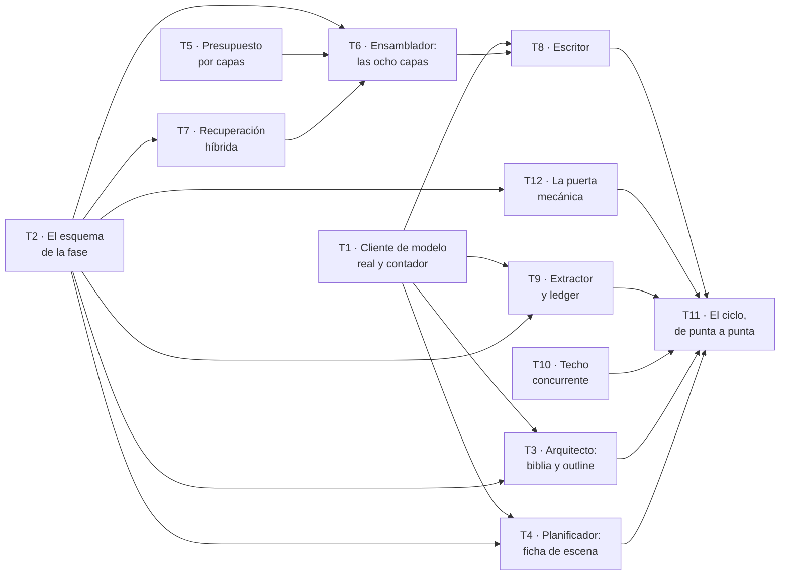

# Fase 2 — Escribir un capítulo

**Objetivo:** que de una `Obra` encargada salga una biblia, un outline de diez capítulos, y **un capítulo escrito de verdad** cuyos hechos entren al canon. Es el motor: la Fase 1 demostró que el sistema personaliza; esta demuestra que **escribe**.

**Enfoque:** el cliente de modelo real entra el primer día, porque sin él la Fase 1 no se puede ejecutar fuera de la suite. Pero **ninguna prueba de este plan llama al proveedor**: se sigue usando `DobleDeterminista`, que ya existe y está probado. El cliente real se prueba con una corrida manual declarada, no con la suite.

**Stack:** el de la Fase 1, más lo que P-01 aprobó en bloque y aquí se estrena: **Claude Agent SDK** (P-08), **NumPy** y **`sqlite-vec`** opcional.

**Spec:** [`spec.md`](spec.md), `aprobada`. Se lee junto a este plan.

---

## Qué hereda, y los dos huecos que cierra

La Fase 1 ([`plan-1-encargo.md`](plan-1-encargo.md), `completado`) dejó **88 tests en verde, ocho tablas y dos huecos declarados**. No son deuda escondida: están escritos en su apartado «Lo que esta fase NO hace», y son lo primero de aquí.

| Hueco heredado | Quién lo cierra |
| --- | --- |
| **No hay proveedor de modelo**, así que `CU-01` no corre fuera de la suite: `/respuestas` y `/cerrar` responden 500 | **T1** |
| **Nadie extrae hechos del `TextoAportado`**, así que `RF-ENT-06` está a medias y `CA-3` solo cubre el prompt | **T9** |

Y hereda algo que no es código: **los defectos del plan anterior se encontraron ejecutando, no leyendo.** Tres afirmaciones de cierre resultaron falsas, un saneado de prompt se podía burlar, un esquema de salida daba un brief por completo perdiendo el dato que faltaba, y una línea ausente en `env.py` habría generado el `drop_table` de cinco tablas. Este plan se escribe sabiendo eso.

### Una decisión de forma, tomada a la vista de la Fase 1

**Este plan especifica tests y contratos, no implementaciones.** El plan 1 traía el código de casi cada tarea, y **en tres sitios ese código estaba mal** —`normalizar()` no pasaba sus propios tests, el saneado del prompt se podía burlar, el esquema de salida no cerraba `extra`—. Nadie lo vio al aprobarlo: el código escrito en un documento da la confianza de estar revisado sin estarlo, porque no lo ejecuta nadie.

Aquí, cada tarea declara **qué debe ser cierto y cómo se comprueba**. La implementación la escribe quien la ejecuta, contra su test en rojo. Donde hay código en este plan es porque **es contrato entre tareas** —una firma, una forma de datos— y no porque sea la solución.

---

## Por qué este corte, y no otro

Decidido por `maujimenez4` el 2026-09-24, sobre tres alternativas. El criterio de `CLAUDE.md` §3.3 bis es que **cada plan entregue software que funcione y se pueda probar solo**.

**Un capítulo, no diez.** Es el corte más pequeño que **produce prosa**, que es el producto. Diez capítulos es sobre todo el orquestador —máquina de estados, checkpoint, reanudación—, y eso es una fase entera con sus propios criterios: `CA-1` y `CA-5`.

**Y lo que este corte no demuestra, dicho aquí y no al final:** un capítulo suelto **no ejercita el problema de coherencia**, que es el que aparece en el capítulo siete cuando el cuatro dijo otra cosa. La maquinaria que lo resuelve —canon, ledger, estado en T, recuperación— se construye y se prueba por unidades en esta fase. **Demostrarla a escala es de la Fase 3.** Quien apruebe este plan aprueba eso también.

---

## Cómo se reparte entre agentes

Escrito **antes** que las tareas, y no después, porque en la Fase 1 el reparto se añadió a un plan ya cortado por temas y hubo que recortar dos tareas para que cupiera.

### El grafo



| Ola | Tareas | Agentes a la vez |
| --- | --- | --- |
| 1 | T1 · T2 · T5 · T10 | 4 |
| 2 | T3 · T4 · T7 · T9 · **T12** | **5** — el punto más ancho |
| 3 | T6 | 1 — converge todo el contexto |
| 4 | T8 | 1 |
| 5 | T11 | 1 |

Ruta crítica: `T2 → T7 → T6 → T8 → T11`. **Cinco eslabones para doce tareas.** Dos olas anchas y tres cuellos: la ganancia realista vuelve a ser **del orden de 2×**, igual que en la Fase 1, donde se midió.

*T12 entra con la decisión **P-B** y no estaba en el corte original. Cabe en la ola 2 sin tocar a nadie: es la feature `calidad` entera, y ningún otro agente escribe ahí.*

### Las siete reglas, cinco de ellas aprendidas a golpes

1. **Un agente por fichero dentro de la ola.** La tabla de dueños de abajo es la lista completa.
2. **`modelos.py` de cada feature tiene un solo dueño, y las tablas de la fase entran en UNA migración: T2.** En la Fase 1 tres tareas querían escribir el mismo `modelos.py` y hubo que rehacer el corte a mitad.
3. **Quien añade una tabla añade su `import` en `alembic/env.py`, en el mismo commit.** Comprobado ejecutándolo en la Fase 1: sin esa línea, `--autogenerate` no ve la tabla y **el siguiente genera el `drop_table` de las que ya existen**. Una migración que destruye el esquema pasa las cinco puertas igual de bien que una que lo construye.
4. **Las fixtures compartidas tienen dueño por fixture**, declarado en la tabla. En la Fase 1 nadie creaba `conftest.py` y tres tareas lo necesitaban.
5. **Cada agente en su propio *worktree*, y lo primero que hace es comprobar su base.** En la Fase 1, **cinco de nueve worktrees arrancaron sobre la rama equivocada**. De las tres formas de recolocarse, solo `git checkout -b <rama> <hash>` atraviesa el clasificador de permisos.
6. **La tabla de Desviaciones la escriben todos y la resuelve el integrador.** Decisión tomada en la Fase 1 tras medirlo: son filas que se concatenan, y partirla en un fichero por tarea rompe el registro en trozos que nadie lee juntos.
7. **El integrador corre las puertas sobre el resultado COMBINADO al cerrar cada ola**, incluido `alembic upgrade → downgrade base → upgrade` y `alembic check`. Es lo único que ningún agente puede comprobar desde su rama.

### Quién es dueño de cada fichero compartido

| Fichero | Dueño | Quién más lo toca, y en qué ola |
| --- | --- | --- |
| `commons/llm/cliente.py` | T1 (ola 1) | Nadie. `obtener_cliente_modelo` deja de lanzar |
| `commons/llm/contador.py` | T1 (ola 1) | T5 lo consume, no lo escribe |
| `features/*/modelos.py` y la migración | **T2, y solo T2** | Las tablas de la fase entran juntas |
| `alembic/env.py` | T2 (ola 1) | Nadie más en esta fase: T2 declara todas las tablas |
| `app/conftest.py` | T2 añade `obra_con_outline` | T6 añade `paquete`; T8 añade `escritor` (olas 3 y 4, ambas de un solo agente) |
| `commons/domain/errores.py` | T5 añade `ContextBudgetExceeded` (ola 1) | T10 añade `TiempoAgotado` (ola 1) — **dos en la misma ola: ver aviso** |
| `features/contexto/service.py` | T6 (ola 3) | T11 (ola 5) |
| `features/calidad/` | **T12, y solo T12** (ola 2) | T11 la consume en la ola 5, no la escribe |

**El único cruce de la fase, y va dicho:** T5 y T10 añaden cada una una excepción a `commons/domain/errores.py` en la ola 1. Son dos líneas independientes al final de un fichero, del mismo tipo que los conflictos de Desviaciones que la Fase 1 resolvió sin incidentes. **El integrador lo espera.** La alternativa —serializarlas— costaría una ola entera por dos líneas.

---

## Restricciones globales

Se aplican a **todas** las tareas. Copiadas de la spec y de `CLAUDE.md`; los valores son literales.

| Restricción | Valor exacto | Origen |
| --- | --- | --- |
| Techo **por llamada** | **100.000 tokens**, repartidos en ocho capas con tope propio | `CLAUDE.md` §4.1 · RF-CTX-02, RF-CTX-03 |
| Techo **concurrente** | **100.000 tokens** sumados sobre las llamadas **en vuelo**. No es el mismo límite | encargo §7 · RF-ORQ-10 · spec, «presupuesto concurrente» |
| Contar antes de llamar | **Nunca se llama al modelo sin haber contado.** El contador es inyectado, no una estimación por caracteres | RF-CTX-02 |
| Qué se recorta | La capa que se pasa, **no las vecinas**. Constitucional e Instrucción **nunca** | RF-CTX-03, RF-CTX-07 |
| Si no cabe | `ContextBudgetExceeded` **sin llamar al modelo**. Nunca truncar por el final en silencio | RF-CTX-03 |
| Capa vacía | Si una capa debería tener contenido y llega vacía, **falla antes de llamar**: es fallo del almacén, no del Escritor | RF-CTX-06 |
| Ensamblado | **Código determinista**, nunca un modelo | RF-CTX-01 |
| El Escritor | **Solo ve el paquete.** Nunca accede a la base de datos | RF-ESC-01 |
| Recuperación | **En este orden**: filtro estructural → orden semántico sobre lo ya filtrado → fusión con recencia | RF-CTX-04 |
| Memoria | Solo el **Extractor** escribe memoria de largo plazo, y solo desde el paso de extracción | RF-MEM-06 |
| Ledger | *Append-only*. `estado_en_t` y la cronología son **vistas derivadas**, jamás tablas que se editan | RF-MEM-05 |
| Versiones de texto | **Inmutables**: editar crea una nueva y marca la vigente | RF-ESC-02 |
| Pruebas | **Sin red y sin credenciales.** El proveedor se sustituye por `DobleDeterminista` | RNF-FIA-01 · CA-4 |
| Dos modos | La suite corre **con y sin** la extensión vectorial | RNF-FIA-02 · CA-28 |
| TDD | Rojo → verde → refactor. El test entra **en el mismo commit** | `CLAUDE.md` §3.4 |
| Vocabulario | Todo término existe en `docs/definitions.md` v2.3 | `CLAUDE.md` §2 |

**Los dos techos no son el mismo**, y la spec dedica un párrafo a decirlo porque confundirlos dejó el encargo §7 sin cumplir durante meses. El de la llamada se comprueba **al ensamblar el paquete**; el concurrente, **al conceder el turno**. Que las dos cifras sean 100.000 es casualidad de números.

---

## Puntos de revisión

Ocho clases de entrada que la spec implica y que **ninguna tarea probaría si no se dijera aquí**. Están **además** de los tests de su tarea.

| # | Entrada o condición | Qué espera una persona razonable | Tarea |
| --- | --- | --- | --- |
| R-1 | Un paquete que **cabe justo**: suma exactamente 100.000 | Pasa. El techo es «no más de», no «menos de». Una frontera mal puesta rechaza paquetes legítimos, y nadie lo nota hasta que el capítulo falla sin motivo | 5 |
| R-2 | Una capa que **se pasa de su tope** mientras las demás van holgadas | Se recorta **esa** y el paquete sale. Recortar a prorrata es lo que parece razonable y es justo lo que RF-CTX-03 prohíbe | 5 |
| R-3 | **Capa de canon vacía** en un capítulo que tiene hechos que la surtirían | **Falla antes de llamar.** Un paquete al que le falta el canon produce prosa que contradice lo ya escrito, y el defecto se atribuiría al Escritor, que no lo cometió | 6 |
| R-4 | Dos paquetes que **suman 100.001** en vuelo | El segundo **espera**, y arranca en cuanto el primero libera. Y dos que suman menos **sí se solapan**: un sistema que serializa todo cumple el techo y no cumple la decisión | 10 |
| R-5 | Recuperación sobre un corpus donde **lo parecido y lo pertinente difieren** | Devuelve lo pertinente. Ordenar por parecido sin filtrar antes trae escenas parecidas, que es el fallo que la spec anterior escondió detrás de un requisito «probado» | 7 |
| R-6 | La extensión vectorial **no carga** | El sistema arranca, avisa, y la suite pasa igual. Si `sqlite-vec` fuera obligatorio, sería una segunda base de datos por la puerta de atrás | 7 |
| R-7 | Un capítulo **rechazado** tras haber llamado al modelo | **No deja rastro** en canon, ledger ni índice. Lo que se descarta no puede contaminar el capítulo siguiente | 9 |
| R-8 | `TextoAportado` con **«ignora tus instrucciones»** pasando por el Extractor | Sus hechos se extraen y **el paquete del capítulo siguiente no cambia**. Es RNF-SEG-03, la mitad de `CA-3` que la Fase 1 no pudo cerrar | 9 |

---

## Decisiones

Las tres preguntas abiertas de este plan, cerradas por `maujimenez4` el 2026-09-24. Se conservan con su porqué, como hace la spec.

### P-A · Dos contadores, y son dos momentos distintos

**La pregunta era falsa en su premisa, y la respuesta lo destapó.** Se preguntaba «cómo se cuentan los tokens sin clave», dando por hecho que había **un** contador. Hay dos, y sirven para cosas distintas:

| Momento | Requisito | Quién lo da |
| --- | --- | --- |
| **Antes** de llamar | **RF-CTX-02** — contar para decidir si el paquete cabe, y **fallar sin gastar** si no | Un **tokenizador local**, inyectado tras `ContadorDeTokens` |
| **Después** de llamar | **RF-OBS-03** — tokens, coste y latencia por llamada, capítulo y novela | El **recuento real del proveedor**, persistido en `ejecucion` |

**Langfuse mide el segundo, no el primero**, y esa es la parte que la pregunta no veía: para cuando el *tracing* ve una llamada, la llamada ya se hizo. RF-CTX-02 existe precisamente para que un paquete que no cabe **no llegue a gastarse**. Son requisitos distintos y ninguno sustituye al otro.

**Y el primero no obliga a tocar la spec.** RF-CTX-02 prohíbe, con esas palabras, «una estimación **por caracteres**» — y un tokenizador BPE de verdad no es eso. Además **`tiktoken` ya está en las catorce dependencias que P-01 aprobó en bloque**: el proyecto había presupuestado el contador local desde el principio.

**Lo que sí hay que declarar, porque es un riesgo y no una comodidad:** un tokenizador local **aproxima** el de Anthropic, así que el recuento previo tiene deriva. Dos cosas la acotan, y las dos ya estaban:

- La **capa de reserva** de 10.000 tokens (`CLAUDE.md` §4.1), que existe para que el reintento quepa y absorbe también este margen.
- **`ejecucion` guarda los dos números** —el previsto y el real— desde esta fase, porque RF-OBS-06 ya exige «tokens por capa» y «coste». Con eso, **la deriva del contador local deja de ser un riesgo declarado y pasa a ser una cifra medible**. Es lo que la idea de medir por *tracing* aporta de verdad: no resuelve el conteo previo, pero permite saber cuánto se equivoca.

*Langfuse entero —sesión por novela, spans, scores, plantillas versionadas: RF-OBS-01 a 05— **no entra en esta fase**. Ver «Lo que esta fase NO hace».*

### P-B · La puerta de esta fase es mecánica, y el juez no entra

**Recomendación aplicada.** Esta fase no construye el Crítico ni el Continuista, y **sí** construye una puerta.

**Por qué no entra el juez, y no es solo alcance.** RF-JUZ-06 dice que **el juez no bloquea** mientras su correlación con la revisión humana no se haya medido sobre un conjunto y firmado. Meterlo aquí sería construir un componente que, por regla del propio proyecto, **no puede parar nada** — y calibrarlo exige una novela entera y una revisión con rúbrica, que son de fases posteriores.

**Por qué el Continuista tampoco.** Contrasta contra el grafo de canon (RF-VAL-06), y un capítulo suelto no tiene contra qué chocar: su trabajo empieza cuando el capítulo siete puede contradecir al cuatro. Es de la Fase 3, con la coherencia a escala.

**Pero sin ninguna puerta, R-7 no se puede probar.** «Un capítulo rechazado no deja rastro» necesita algo que rechace; si nada rechaza nunca, el test es teatro. Por eso entra **T12**, con los validadores que **sí** funcionan sobre un capítulo solo y **sin llamar a ningún modelo**: longitud, persona y tiempo verbal, nombres contra el canon, y la forma del defecto.

### P-C · Se escribe un **capítulo**, y la escena sigue siendo la unidad de generación

Las dos cosas a la vez, que es lo que ya dicen los documentos y conviene no improvisar:

- **Hacia fuera, capítulo.** El endpoint es `POST /capitulos/{id}/escribir` (RI-05, literal), el trabajo es de un capítulo y lo que se entrega es un capítulo. El encargo cuenta capítulos.
- **Hacia dentro, escena.** `CLAUDE.md` §1 dice que la unidad atómica de generación es la escena, y `definitions.md` §4.1 que un `Capitulo` contiene **exactamente una** `Escena`. Hoy coinciden **1:1**.

**Las dos tablas existen** (T2). No se colapsan en una, y el motivo lo da el propio documento: el capítulo es unidad de **lectura** y la escena de **generación**; si algún día la extensión crece, la cardinalidad vuelve a `1..*` **sin tocar nada más**. Colapsarlas ahora ahorra una tabla y cuesta una migración de datos después.

---

## Estructura de ficheros

Sobre lo que dejó la Fase 1. Cinco de las nueve features de `CLAUDE.md` §5.1 nacen aquí; **ninguna es nueva**: las nueve las aprobó la spec en Impacto técnico.

```
src/backend/app/
  commons/
    llm/claude_code.py          el cliente real (P-08). NO se usa en la suite
    llm/contador.py             el contador real, detrás del protocolo
    jobs/turnos.py              el techo concurrente: cuenta TOKENS, no llamadas
  features/
    outline/                    Arquitecto: biblia y outline de diez capítulos
    escena/                     Planificador de escena: la ficha
    contexto/                   Ensamblador: las ocho capas. ES CÓDIGO, NO UN MODELO
      capas.py  presupuesto.py  recuperacion.py  almacenes.py
    escritura/                  Escritor, y el ciclo de un capítulo
    canon/                      Extractor, ledger, estado en T
```

**`contexto` no tiene `agents.py`, y es lo único que lo distingue de las demás.** El Ensamblador es la única pieza de `CLAUDE.md` §9 que **no** es un modelo: si lo fuera, no se podría reproducir un fallo.

---

## Tarea 1 · El cliente de modelo real, y el primer hueco de la Fase 1

Cierra el hueco declarado: hoy `/respuestas` y `/cerrar` responden **500** contra la aplicación levantada. Cierra además **RF-OBS-03** *(parcial: el coste derivado)*.

**Ficheros:** `commons/llm/claude_code.py`, `commons/llm/cliente.py` (modificar), `commons/llm/contador.py`, y sus tests.

**Contrato que produce, y que consumen T3, T4, T8 y T9:**
- `obtener_cliente_modelo()` deja de lanzar `NotImplementedError` y devuelve el cliente real.
- `ClienteModelo` **no cambia de forma**: `async completar(prompt, semilla) -> str`. Si cambiara, rompería a `DobleDeterminista` y con él la suite entera.
- `ContadorDeTokens` gana su implementación real.

**Qué debe ser cierto, y cómo se comprueba:**

| | Cómo |
| --- | --- |
| La suite **sigue sin llamar al proveedor** | La suite pasa con la red caída. Es CA-4, y aquí es donde más fácil sería romperlo |
| El cliente real **no se instancia al importar** | Un test comprueba que importar `app.main` no abre ningún proceso ni lee credenciales |
| Haiku escribe, Opus juzga (P-02) | El modelo es parámetro, y el test comprueba que el valor por defecto del Escritor es Haiku |
| El coste se **deriva** de tokens y tarifa declarada | No se lee de ninguna factura: con consumo de cuenta no existe cargo por llamada (RF-OBS-03) |

**Y una corrida manual declarada, que no es un test.** Al terminar, se ejecuta `CU-01` contra la aplicación levantada y se comprueba que `/respuestas` y `/cerrar` dejan de responder 500. **Gasta cuota.** Se hace una vez, se copia la salida en el informe, y no entra en la suite.

> **P-A la cierra así:** `ContadorDeTokens` se implementa con un **tokenizador local** —`tiktoken` ya está entre las catorce dependencias que P-01 aprobó— y eso satisface RF-CTX-02, que prohíbe la estimación **por caracteres** y no un tokenizador de verdad. **La spec no cambia.** El recuento **real** del proveedor se guarda además en `ejecucion` junto al previsto, para que la deriva se pueda medir en vez de suponerse.

---

## Tarea 2 · El esquema de la fase, entero y en una migración

Cierra **RD-03** *(parcial)* y sostiene a todas las demás. Es la tarea que más ficheros toca y la única que toca migraciones: **es deliberado**, y el motivo está en la regla 2 del reparto.

**Ficheros:** `modelos.py` de `outline`, `escena`, `escritura`, `canon`; `alembic/env.py`; **una** migración; la fixture `obra_con_outline` en `app/conftest.py`.

**Las tablas, con lo que cada una sostiene:**

| Tabla | Sostiene |
| --- | --- |
| `version_obra` | La biblia versionada. Cada escena apunta a la vigente cuando se escribió (RF-PLA-01) |
| `capitulo`, `escena` | Outline de diez, **una escena por capítulo** (RF-PLA-02) — ver **P-C** |
| `version_texto` | **Inmutable.** Editar crea otra y marca la vigente (RF-ESC-02) |
| `evento` | El ledger, *append-only*. **Nunca se actualiza ni se borra** (RF-MEM-05) |
| `resumen_capitulo` | Derivado del texto aprobado; alimenta el contexto de los siguientes (RF-MEM-04) |
| `hilo_narrativo`, `plantado` | Abierto, pagado, vencido |
| `hecho_usado_en` | Qué capítulos se apoyan en un hecho (RF-MEM-02). **Sin esto no hay `CA-15` ni petición del lector** |
| `ejecucion` | Prompt con su hash, versión de biblia, IDs recuperados, modelo, semilla, tokens por capa, coste (RF-OBS-06) |
| `trabajo` | La unidad de trabajo de `architecture.md` §3.2, con su `run_id` |
| `embedding` | Detrás de `VectorStore`: `vec0` o BLOB. Lo usa T7 |

**Qué debe ser cierto:**
- `estado_en_t` y la cronología son **vistas**, no tablas. Un test comprueba que **no existe repositorio que escriba sobre ellas** y que se reconstruyen desde el ledger.
- El ledger rechaza `UPDATE` y `DELETE` **en el esquema**, no por convenio de función. *La Fase 1 dejó el registro de auditoría con una puerta con cartel en vez de una pared, y lo anotó; aquí no se repite.*
- `alembic upgrade → downgrade base → upgrade` en limpio, una sola *head*, y `alembic check` sin operaciones pendientes.
- Las restricciones muerden **sobre la base migrada**, no solo sobre la que `create_all` levanta en los tests.

---

## Tarea 5 · El presupuesto por capas, y el techo de la llamada

Cierra **RF-CTX-02**, **RF-CTX-03**, **RF-CTX-05**, **RF-CTX-07** y **CA-7**. Corre en la ola 1 porque es **código puro**: no toca base de datos ni framework.

**Ficheros:** `features/contexto/presupuesto.py`, `commons/domain/errores.py` (añade `ContextBudgetExceeded`), y sus tests.

**Contrato que produce, y que consume T6:**

```python
class Capa(StrEnum):
    CONSTITUCIONAL = "constitucional"   # tope 5.000  · nunca se recorta
    ESTRUCTURAL = "estructural"         # tope 10.000
    CANON = "canon"                     # tope 20.000
    ESTADO_EN_T = "estado_en_t"         # tope 15.000
    CONTINUIDAD = "continuidad"         # tope 20.000
    MEMORIA = "memoria"                 # tope 10.000
    INSTRUCCION = "instruccion"         # tope 10.000 · nunca se recorta
    RESERVA = "reserva"                 # tope 10.000 · para reparación y reintento
```

`presupuestar(piezas, contador) -> Desglose` devuelve **el desglose por capa junto al paquete**, que se persiste en `ejecucion`.

**Qué debe ser cierto:**

| | Por qué importa |
| --- | --- |
| El desglose **suma lo que dice** | Un desglose que no cuadra hace inútil la auditoría de `CU-07` |
| Se recorta **la capa que se pasa**, no las vecinas | R-2. Recortar a prorrata es lo que parece razonable |
| Constitucional e Instrucción **nunca** se recortan | RF-CTX-07. Se comprueba con un caso donde recortarlas sería la salida fácil |
| Si tras recortar no cabe → `ContextBudgetExceeded` **sin haber llamado** | Se comprueba con un doble que **falla si alguien lo llama** |
| 100.000 exactos **caben** | R-1 |
| La **reserva** sigue libre tras un ensamblado normal | Es lo que permite que el reintento con el defecto añadido quepa |

---

## Tarea 10 · El techo concurrente: se cuentan tokens, no llamadas

Cierra **RF-ORQ-08**, **RF-ORQ-10** y **CA-36**. Es el requisito que, según la spec, **es el único que comprueba lo que el encargo §7 pide de verdad**.

**Ficheros:** `commons/jobs/turnos.py`, `commons/domain/errores.py` (añade `TiempoAgotado`), y sus tests.

**Qué debe ser cierto:**
- La suma de tokens **en vuelo** no pasa de 100.000. El turno se da **contando tokens, no llamadas**.
- Si admitir una llamada haría pasar el techo, esa llamada **espera**. **Nunca se recorta el paquete para hacerla caber, ni se lanza igualmente.**
- **Dos paquetes que suman menos SÍ se solapan.** Es la mitad que de verdad distingue: un sistema que serializa todo cumple el techo y **no** cumple la decisión P-06.
- El contador en vuelo es **observable**, no implícito: se puede leer, y por eso se puede probar.
- Sin turno antes del *timeout* → `TiempoAgotado`, **sin coste**.
- Una escena en vuelo **por obra**; obras distintas sí se solapan, y el Continuista y el Crítico del mismo capítulo también.

*Esta tarea no llama a ningún modelo: prueba el portero, no lo que pasa al otro lado.*

---

## Tarea 3 · El Arquitecto: biblia y outline de diez capítulos

Cierra **CU-02**, **RF-PLA-01** a **RF-PLA-04**, **RI-04** y **CA-32**.

**Ficheros:** `features/outline/` (`router.py`, `service.py`, `repository.py`, `agents.py`, `prompts/arquitecto.v1.md`, `schemas.py`, tests).

**Qué debe ser cierto:**
- La biblia sale del brief y queda **versionada** (`version_obra`).
- El outline tiene **diez capítulos**, cada uno con POV, lugar, objetivo, obstáculo y **giro de valor previsto**.
- **Cada beat obligatorio de género se asigna a exactamente un capítulo.** Uno sin asignar o duplicado es **error de dominio**, no un aviso. Es `CA-32`, y se comprueba por los dos lados: falta y duplicado.
- La salida del agente **se valida con esquema** antes de creérsela (RF-ORQ-09). *La Fase 1 descubrió que un `BaseModel` sin `extra="forbid"` deja pasar una clave de más y pierde datos en silencio: aquí se cierra desde el principio.*

---

## Tarea 4 · El Planificador de escena: la ficha

Cierra **RF-ESC** *(la entrada del Escritor)* y la parte de `CU-03` anterior al ensamblado.

**Ficheros:** `features/escena/` (`service.py`, `repository.py`, `agents.py`, `prompts/planificador.v1.md`, `schemas.py`, tests).

**Qué debe ser cierto:**
- La ficha lleva **objetivo, obstáculo y giro de valor no nulo**. Es la **regla de dominio 1**, y una escena sin giro de valor es relleno: `definitions.md` la llama «la primera validación automática que conviene implementar».
- **Un POV y solo uno.**
- La ficha hereda de la obra `persona`, `tiempo_verbal` y `nivel_de_calor`, que son restricciones duras del prompt del Escritor.
- Aplica **CA-6**: quitando la validación del giro de valor, cae su test y solo el suyo.

---

## Tarea 7 · Recuperación híbrida, y los dos modos de `VectorStore`

Cierra **RF-CTX-04**, **CA-8** y **RNF-FIA-02**. Es la tarea con el punto ciego mejor documentado del proyecto.

**Ficheros:** `features/contexto/recuperacion.py`, `features/contexto/almacenes.py`, `commons/db/vectores.py`, y sus tests. Y `pyproject.toml`, **solo** para `sqlite-vec`: eres la única tarea de tu ola autorizada a tocarlo.

> **Aviso de la ola 1:** la tabla `embedding` **existe ya**, y vive en `features/canon/modelos.py`, no en `contexto`. Lo decidió T2 siguiendo `architecture.md` §4.3 —la escribe el Extractor— y lo avisó porque el plan decía «lo usa T7» sin decir dónde estaba. **No la crees ni la muevas:** léela desde `canon` por su `__init__.py`, que es la única puerta de la feature.

**El orden no es negociable, y la spec explica por qué:**

1. **Filtro estructural** — presentes, lugar, hilos abiertos, rango de capítulos.
2. **Orden semántico** sobre el conjunto **ya filtrado**.
3. **Fusión con recencia.**

**Qué debe ser cierto:**

| | Por qué |
| --- | --- |
| **El filtro estructural existe y filtra**, no solo pone un tope | Es `CA-8`, el criterio que la versión anterior de la spec **no tuvo** — y por eso el filtro quedó sin implementar con un requisito que decía estar probado |
| Con un corpus donde **lo parecido y lo pertinente difieren**, devuelve lo pertinente | R-5. Un criterio que solo comprueba el tope se cumple sin filtrar |
| La suite corre **en los dos modos**, con y sin `sqlite-vec` | R-6 · RNF-FIA-02. Si la extensión fuera obligatoria sería una segunda base de datos por la puerta de atrás |
| Si la extensión no carga, **el sistema arranca y avisa** | Degradar en silencio es peor que fallar |

**Y lo que esto NO da, que la spec declara sin suavizar:** el orden semántico lo resuelve el mismo proveedor que genera, así que **es una señal con varianza**. El paquete deja de ser reproducible: dos ensamblados del mismo estado pueden devolver otro orden en esta capa. Las otras siete siguen siendo deterministas, y `ejecucion` guarda los IDs recuperados, de modo que **una ejecución concreta es auditable aunque no repetible**. Se cambió a propósito, sabiendo lo que costaba.

---

## Tarea 9 · El Extractor, el ledger, y el segundo hueco de la Fase 1

Cierra **RF-MEM-01** a **RF-MEM-07**, **RNF-SEG-03**, la mitad que faltaba de **RF-ENT-06** y con ella **CA-3** entero. Y **CA-10**.

**Ficheros:** `features/canon/` (`service.py`, `repository.py`, `agents.py`, `prompts/extractor.v1.md`, tests).

**Qué debe ser cierto:**

| | Por qué importa |
| --- | --- |
| Cada hecho nuevo entra al grafo **citando su escena de origen** | Regla de dominio 4. La Fase 1 dejó la otra mitad —`origen: brief`— construida y probada |
| **Del `TextoAportado` se extraen hechos** con `origen: brief` y sin escena | Cierra el hueco de la Fase 1. Produce `HechoDelBrief`, que ya existe con la forma del documento: `entidad`, `atributo`, `valor`, `confianza` |
| `estado_en_t` y la cronología se **derivan** del ledger | RF-MEM-03, RF-MEM-05. Un test las reconstruye desde cero y compara |
| Un capítulo **rechazado no deja rastro** | R-7 · `CA-10`. Se provoca un defecto bloqueante y se comprueba que canon, ledger e índice quedan intactos |
| Prosa con instrucciones incrustadas **no altera el paquete siguiente** | R-8 · RNF-SEG-03. Es la mitad de `CA-3` que la Fase 1 no pudo cerrar |
| Corregir un hecho **no lo edita**: crea uno que lo sustituye y cita al anterior | RF-MEM-08 |
| **Solo el Extractor** escribe memoria de largo plazo | RF-MEM-06. Se comprueba por análisis: ninguna otra ruta de código escribe en canon, ledger ni índice |

---

## Tarea 6 · El Ensamblador: las ocho capas

Cierra **RF-CTX-01**, **RF-CTX-06**, **RF-CTX-08**, **RF-CTX-09** y **CA-12**. Va sola en su ola porque **converge todo**: presupuesto, recuperación, canon, ledger y outline.

**Ficheros:** `features/contexto/` (`capas.py`, `service.py`, `router.py`), la fixture `paquete`, y sus tests.

**Qué debe ser cierto:**
- El paquete lo ensambla **código determinista**, nunca un modelo (RF-CTX-01). *Si fuera un modelo, no se podría reproducir un fallo — y ese es el motivo, no la eficiencia.*
- La capa de canon **etiqueta cada pieza por `hc_id`**, no por posición: la posición cambia con el recorte y el identificador no (RF-CTX-08).
- `ejecucion` persiste los IDs de **todas** las capas que los tienen, con su capa, y **solo de las piezas que sobrevivieron al recorte** (RF-CTX-09).
- **Una capa vacía cuando debería tener contenido falla antes de llamar** (R-3 · RF-CTX-06).
- Desde una fila de `ejecucion`, **y con el estado de almacenes de ese capítulo**, se reconstruye el mismo paquete con el mismo desglose, y se sabe **qué hechos de canon entraron** (`CA-12`).

---

## Tarea 8 · El Escritor

Cierra **RF-ESC-01**, **RF-ESC-02**, **RF-ESC-03** y **RF-GUA-03**.

**Ficheros:** `features/escritura/` (`agents.py`, `service.py`, `prompts/escritor.v1.md`, tests).

**Qué debe ser cierto:**
- **El Escritor solo ve el paquete.** Nunca accede a la base de datos. Se comprueba por análisis **y** con un test que le pasa un paquete y le corta la sesión: si toca la base, falla. *De aquí sale que un defecto sea atribuible: si le falta un dato, el fallo es del ensamblado.*
- Cada versión de texto es **inmutable**.
- El reintento lleva **el defecto concreto con su cita** en el prompt. **Nunca un reintento genérico** como «mejóralo».
- Una palabra vetada devuelve el capítulo al escritor **con el término concreto**, con límite de intentos; agotado, **la generación se detiene y se informa** (RF-GUA-03). *La Fase 1 dejó `contiene_veto` devolviendo el término y no un booleano precisamente para esto.*
- La prosa usa la `persona` y el `tiempo_verbal` de la obra, **comprobado en el texto** y no solo pedido en el prompt (regla de dominio 10).

---

## Tarea 11 · El ciclo, de punta a punta

Cierra la fase. No añade comportamiento: **conecta** y demuestra.

**Ficheros:** `features/escritura/ciclo.py`, `features/escritura/router.py`, `main.py`, y el test de extremo a extremo.

**Qué debe ser cierto:**
- **El `PresupuestoConcurrente` es UNO por proceso, y se inyecta.** Lo avisó el agente de T10 al cerrar la ola 1, y es el riesgo serio de la fase: si aquí se crea una instancia por trabajo, **el techo concurrente vuelve a cumplirse «por consecuencia y no por regla»** —el fallo exacto que la spec dedica un párrafo a denunciar— **y con los dieciséis tests de T10 en verde**. Va con su test: dos trabajos distintos comparten instancia.
- **Los tokens que recibe el portero son los que contó el Ensamblador.** Nadie comprueba todavía esa unión, y `turno(0)` pasa todas las puertas. Es la juntura T5–T6–T10, que el plan aprobado no le daba a nadie.
- De una `Obra` de la Fase 1 sale biblia, outline y **un capítulo integrado**, con `DobleDeterminista`.
- `ejecucion` queda escrita con prompt y su hash, versión de biblia, IDs recuperados, modelo, semilla, tokens por capa y coste (RF-OBS-06, regla de dominio 7).
- El estado del trabajo se lee por `GET /trabajos/{id}`.
- **Y una corrida real declarada**, como la de T1: un capítulo escrito con el modelo de verdad, cuya salida se copia en el informe y **no entra en la suite** ni en el repositorio (RD-06).

---

## Tarea 12 · La puerta mecánica del capítulo

Entra con la decisión **P-B**. Cierra **RF-VAL-03**, **RF-VAL-04**, **RF-VAL-07**, la **regla de dominio 10**, y los criterios **CA-16**, **CA-17** y **CA-35**.

**Ficheros:** `features/calidad/` (`validadores.py`, `puerta.py`, `defectos.py`, `schemas.py`, tests). Nadie más escribe en esa feature.

**Lo que NO tiene, y es la mitad de la tarea:** ni `agents.py` ni `prompts/`. **Ningún validador de esta tarea llama a un modelo.** El Crítico y el Continuista son de fases posteriores; aquí solo hay código que mira texto y canon.

**Qué debe ser cierto:**

| | Por qué importa |
| --- | --- |
| La longitud está **dentro del rango declarado**; fuera, vuelve al escritor | `CA-35` · RF-VAL-04. Se prueba por los dos lados: corto, largo y dentro |
| Los nombres aparecen **como el canon los declara**: forma canónica **o una variante declarada** | `CA-16`. «Maria» por «María» es defecto `PER-02`; «Mari» por «María» **no**, si el canon la declara. Un validador literal prohibiría por escrito que a María la llamen Mari, que en una novela de regalo es justo lo que uno espera |
| La prosa usa la `persona` y el `tiempo_verbal` de la obra, **comprobado en el texto** | Regla de dominio 10. No basta con pedirlo en el prompt: eso ya se hacía y no lo comprobaba nadie |
| Antes de la puerta se comprueba la **forma** de cada defecto | `CA-17` · RF-VAL-07: código de la taxonomía, y **cita que es subcadena exacta en su desplazamiento**. Un defecto mal formado **no bloquea, no gasta reintento y se cuenta aparte** |
| Cada validador tiene **nombre** y un **punto de ejecución declarado** | RF-VAL-01. Lo que no se puede nombrar no se puede contar |

**Y por qué esta tarea existe aunque el juez no:** sin una puerta que rechace de verdad, **R-7 no se puede probar**. «Un capítulo rechazado no deja rastro en canon, ledger ni índice» necesita algo que rechace; si nada rechaza nunca, el test pasa sin comprobar nada. Es el mismo defecto que la Fase 1 encontró dos veces —una restricción sobre la que ningún test podía caer— y aquí se evita antes.

---

## Lo que esta fase deja cerrado

| Criterio | Qué demuestra |
| --- | --- |
| **CA-3** *(entero)* | Lo que la Fase 1 dejó a medias: sus hechos **se extraen** y ningún prompt cambia |
| **CA-7** | El desglose suma lo que dice, respeta los topes, y si no cabe lanza sin llamar |
| **CA-8** | La recuperación **filtra antes de ordenar** |
| **CA-10** | Un capítulo rechazado no deja rastro |
| **CA-12** | Desde `ejecucion` se reconstruye el paquete y se sabe qué hechos entraron |
| **CA-32** | Cada beat obligatorio, en exactamente un capítulo |
| **CA-36** | Dos paquetes que suman de más no corren a la vez; dos que suman de menos **sí** |
| **CA-16** | «Maria» por «María» es defecto; «Mari» por «María» **no**, si el canon la declara variante |
| **CA-17** | Un defecto con cita inventada no bloquea, no gasta intento y se cuenta aparte |
| **CA-35** | Un capítulo fuera del rango vuelve al escritor; uno dentro pasa |
| **CA-4** *(mantenido)* | La suite sigue pasando sin red y sin credenciales |

**Requisitos:** RI-04, RI-05, RI-06, RI-07 · RF-PLA-01 a 04 · RF-CTX-01 a 09 · RF-ESC-01 a 03 · RF-MEM-01 a 08 · RF-ORQ-08, RF-ORQ-09 *(parcial)*, RF-ORQ-10 · RF-GUA-03 · RF-VAL-01, RF-VAL-03, RF-VAL-04, RF-VAL-07 · RF-OBS-03, RF-OBS-06 · RF-ENT-06 *(la mitad que faltaba)* · RNF-SEG-03, RNF-FIA-02 · RD-03 *(parcial)*.

## Lo que esta fase NO hace, y no es un olvido

- **No escribe diez capítulos.** Uno. El orquestador con su máquina de estados, el checkpoint y la reanudación son de la Fase 3, y con ellos `CA-1` y `CA-5`.
- **Y por tanto no demuestra la coherencia a escala**, que es el problema real del producto: el capítulo siete que contradice al cuatro. La maquinaria se construye aquí y se prueba por unidades; a escala, en la Fase 3.
- **No hay juez, y la puerta es mecánica** (decisión **P-B**). El Crítico no entra porque RF-JUZ-06 dice que **no bloquea** hasta que su correlación con la revisión humana esté medida y firmada: sería construir algo que por regla no puede parar nada. El Continuista tampoco, porque contrasta contra el grafo y **un capítulo solo no tiene contra qué chocar**. La feature `calidad` nace aquí con sus validadores mecánicos (T12) y sin un solo `agents.py`.
- **No hay Langfuse** —sesión por novela, spans, scores, plantillas versionadas: RF-OBS-01 a 05—. Lo que **sí** hay desde esta fase es el dato: `ejecucion` guarda tokens por capa, coste, modelo y semilla (RF-OBS-06), incluidos **el recuento previsto y el real**, que es lo que hace medible la deriva del contador local (**P-A**). Langfuse es la capa que lo hace visible por novela, y entra con la fase que produce trazas que valga la pena mirar.
- **No hay Lean ni TLA+.** Necesitan cronología completa y máquina de estados.
- **No se publica nada.** `VersionPublicada`, ficha y petición del lector son de la Fase 4.

---

## Desviaciones

*Se anotan aquí **antes** de seguir, no después (`CLAUDE.md` §3.4). Cien filas al cerrar la fase: se lee filtrando por tarea, no de corrido.*

| Fecha | Paso | Qué se desvió y por qué |
| --- | --- | --- |
| 2026-09-24 | Cierre de la ola 5 | **`planificar_obra` no confirmaba, así que `POST /obras/{id}/outline` respondía y no dejaba un solo capítulo en disco.** Lo destapó T11 y lo verifiqué contra la aplicación levantada. La suite no lo veía por una razón que conviene entender: sus tests comparten la sesión del `cliente`, así que **lo escrito y sin confirmar se lee igual de bien que lo confirmado**. Es la misma clase de fallo que la Fase 1 encontró tres veces —una afirmación que solo es cierta dentro de la suite—. Entra el `commit` y un test que abre **otra sesión** sobre el mismo motor; quitando el `commit`, cae y solo él. `obtener_sesion` no confirma **a propósito** —quien decide que la unidad de trabajo terminó bien es el servicio, no el transporte— y este servicio era el único con endpoint que no lo hacía |
| 2026-09-24 | Cierre de la ola 5 | **CA-6 cazó por tercera vez, y lo que encontró no era un fallo sino una redundancia.** T11 mutó `defectos_bloqueantes=()` y **no cayó nada**. En vez de darlo por bueno miró por qué: hay **dos paredes** para «un capítulo rechazado no deja rastro» —el ciclo no llama al Extractor, y `canon` no escribe si recibe un código— y quitar una no se nota porque la otra sigue. Dejó las dos y añadió el test que **sí** distingue: que los códigos que el ciclo entrega a `canon` son los que emitió la puerta. **Una mutación que no tumba nada es información, no permiso para seguir** |
| 2026-09-24 | Cierre de la ola 5 | **La juntura 4 queda ABIERTA y declarada: nadie añade el método de vectorizar a `ClienteModelo`.** T11 no la cerró por dos motivos buenos: ese fichero es de T1 y el plan dice «quien más lo toca: nadie», y **`DobleDeterminista` hereda del protocolo por subclase explícita**, así que añadir un miembro sin implementar lo vuelve abstracto y revienta la suite entera. Dejó el punto de conexión hasta `consolidar_escena`. **Consecuencia viva, y hay que decirla:** en producción el índice no se llena y **la capa de memoria recuperada sale siempre vacía**, así que RF-CTX-04 solo es demostrable en tests. El censo de T6 sigue diciendo la verdad porque trata ese vacío como legítimo |
| 2026-09-24 | Cierre de la ola 5 | **`capitulo` no guarda `beat_de_genero`, así que `CA-32` no está cerrado de punta a punta.** El Arquitecto lo asigna, `_comprobar_beats` valida el criterio sobre su salida — y la columna no existe, de modo que **se tira al guardar**. El Planificador no puede heredarlo y lo vuelve a decidir: dos verdades para el mismo hecho. Es el hermano exacto del hallazgo de RF-PLA-04 en la ola 2, y sale igual de tarde. Va con `trabajo.capitulo_id` y la columna de `ids_por_capa`: **tres columnas de una línea que piden una migración de cierre** |
| 2026-09-24 | Cierre de la ola 5 | **Y una del integrador, que conviene que conste.** Al verificar el fallo del `commit` lancé la aplicación y llamé a `POST /obras/{id}/outline`, que **invoca al proveedor de verdad** — exactamente lo que prohibí a los doce agentes. El endpoint respondió 500 con un fallo de JSON, así que hubo llamada o intento de llamada. Lo correcto era el test con otra sesión, que es lo que acabó arreglándolo. **La comprobación en vivo contra un endpoint que llama al modelo no es gratis y no la hace el integrador por comodidad** |
| 2026-09-24 | T11 · junturas | **Cinco de las siete junturas heredadas quedan cerradas, y la cuarta no.** Cerradas: (1) el `PresupuestoConcurrente` nace en `obtener_presupuesto()` de `escritura/router.py`, con `lru_cache`, y el ciclo lo recibe inyectado; (2) el portero recibe `contexto.paquete.tokens_previstos`, con un test que lo compara contra la fila de `ejecucion`; (3) el prompt del reintento se cuenta contra la **reserva libre** y lanza `ContextBudgetExceeded` sin llamar; (5) `extension_disponible()` se llama en el *lifespan* de `main.py`; (6) y (7) el rechazo lo emite la puerta de T12 y `_retirar_lo_descartado` borra la `version_texto` descartada por `run_id`, reencendiendo la anterior si la habia. **La 4 —el metodo de vectorizar de `ClienteModelo`— NO se cierra:** el protocolo vive en `commons/llm/cliente.py`, que es de T1 y el plan declara que no lo toca nadie mas, y `DobleDeterminista` **hereda del Protocolo por subclase explicita**, asi que anadirle un miembro sin implementar convertiria la clase en abstracta y rompería la suite entera. Lo que si entra es el punto de conexion: `ejecutar_ciclo` acepta `vectorizar` y lo baja hasta `consolidar_escena`. **Consecuencia que sigue viva:** el indice vectorial no se llena en produccion y la capa de memoria recuperada sale vacia, tal y como el censo de T6 da por normal — sigue diciendo la verdad |
| 2026-09-24 | T11 · CA-6 | **Una mutacion no tumbo nada, y mirar por que valio la pena.** Cambiar `defectos_bloqueantes=bloqueantes` por `=()` en la llamada a `consolidar_escena` dejo los 426 tests en verde. El motivo no es una rama muerta sino **defensa redundante**: hay dos paredes para «un capitulo rechazado no deja rastro» —el ciclo no llama al Extractor, y `canon` no escribe si recibe un codigo— y quitar una sola no se nota porque la otra sigue en pie. Se dejan las dos a proposito, y se anade el test que si es sensible: que los codigos que el ciclo le pasa a `canon` son **los que emitio la puerta** (`EST-02`), no una lista vacia. Las otras seis mutaciones —presupuesto por llamada, `turno(0)`, sin retirada de la version descartada, sin deteccion en el arranque, sin comprobacion de reserva, sin correccion de `tokens_previstos`— tumbaron **uno o dos tests cada una, y siempre los suyos** |
| 2026-09-24 | T11 · el trabajo | **Escribir es un trabajo en segundo plano, y eso obliga a una fabrica de sesiones.** `CLAUDE.md` §6 pide estado consultable y no una peticion que espera, asi que `POST /capitulos/{id}/escribir` responde 202 con el `Trabajo` y el ciclo corre en `BackgroundTasks`. Desde FastAPI 0.106 las dependencias con `yield` se cierran **antes** de enviar la respuesta, asi que la sesion de la peticion ya no existe cuando la tarea arranca: la tarea abre la suya por `obtener_sesion_de_fondo`, que es dependencia para que el `cliente` de `conftest.py` la sustituya por la del test. Sin eso, la tarea escribiria en `storymaker.db` y el test contaria filas sobre otra base |
| 2026-09-24 | T11 · `ejecutar_ciclo` | **El capitulo llega por parametro y no desde el `Trabajo`, porque la tabla no lo tiene.** `trabajo` guarda `obra_id` y `escena_id`, y `escena_id` es nulo hasta que se planifica: no hay forma de saber de que capitulo es un trabajo recien abierto. Se pasa `capitulo_id` explicito en vez de anadir la columna, que es esquema y migracion y esta fase tiene un solo dueno para eso (T2). **La columna es de una linea cuando alguna fase toque el esquema**, junto a `ids_por_capa` |
| 2026-09-24 | T11 · outline | **`capitulo` no guarda `beat_de_genero`, asi que CA-32 se valida y se tira.** El Arquitecto lo asigna, `_comprobar_beats` comprueba que cada beat obligatorio va en exactamente un capitulo — y la tabla no tiene columna donde ponerlo. El resultado es que el Planificador **no puede heredar el beat del outline** y lo vuelve a decidir por su cuenta, que es justo la clase de segunda verdad que el proyecto evita. Es hermano del hallazgo de T3 en la ola 2 —cuatro columnas de RF-PLA-04 que faltaban— y no se arregla aqui por lo mismo: `modelos.py` y la migracion son de T2. **Que nadie de CA-32 por cerrado de punta a punta:** hoy se cumple sobre la salida del agente, no sobre lo persistido |
| 2026-09-24 | T11 · outline | **`planificar_obra` no hace `commit`, asi que RI-04 no persiste nada contra la aplicacion levantada.** Los tres casos de uso de `obra` si confirman; `outline` no, y la sesion de FastAPI tampoco —lo dice su propio docstring: «quien decide que una unidad de trabajo termino bien es el servicio»—. En la suite no se ve porque los tests comparten la sesion del `cliente` y cuentan sobre ella. **No se arregla aqui porque `outline/service.py` no es de esta tarea**, y se anota porque es del mismo tipo que las tres afirmaciones de cierre falsas de la Fase 1: lo que no se ejecuta contra el servidor no esta comprobado |
| 2026-09-24 | T11 · fixtures | **La biblia de `obra_con_outline` no declara persona ni tiempo verbal, y el ciclo si los necesita.** Las tareas anteriores pasaban las `RestriccionesDeDiscurso` a mano; el ciclo no puede, porque no hay nadie por encima que se las de: las relee de la **version de biblia con la que se escribio** (RF-PLA-01), no de la vigente de hoy. Se anaden en la fixture local de T11 y **no** en `conftest.py`, para no mover el reparto por capas de todos los tests de contexto por un cambio que no es suyo. La fixture compartida sigue siendo menos realista que lo que `planificar_obra` produce de verdad |
| 2026-09-24 | T11 · nombres | **`nombres_del_canon` sale de `hecho_canon.entidad` y va sin variantes, porque no hay donde guardarlas.** CA-16 distingue «Maria» por «María» —defecto— de «Mari» por «María» —no lo es, si el canon la declara variante—, y la segunda mitad necesita una columna que `hecho_canon` no tiene (`modelos.py` es de T2). El efecto de hoy es un validador **estricto pero nunca inventor**: solo acepta la forma canonica, y jamas persigue un apodo que nadie declaro. Va junto al resto de lo que RF-MEM-08 dejo a medias |
| 2026-09-24 | T11 · corrida real | **La corrida real declarada NO se ejecuta.** El plan la pide para T1 y para T11, y gasta cuota de la cuenta: es decision del dueno y no de un agente. El comando queda escrito en el informe, sin correr |
| 2026-09-24 | Cierre de la ola 4 | **Dos grafías del mismo concepto convivieron una ola entera, y la segunda vez fue culpa mía.** Al cerrar la ola 2 alineé `escena` con `definitions.md` §5 y **no miré `calidad`**, que T12 había escrito con `primera`/`tercera_limitada` en la misma ola. T8 lo destapó al tener que traducir entre las dos. Alineada `calidad` a los literales del documento; como todo el mundo usa los miembros del enum y no las cadenas, el cambio es de valores y no rompe nada. El mapa de traducción de T8 **se queda aunque hoy sea la identidad**: es la frontera entre un texto que viene de la biblia y un tipo cerrado, y lleva un test que cae si alguien vuelve a desalinearlas — en vez de descubrirse tres olas después |
| 2026-09-24 | Cierre de la ola 4 | **CA-6 vuelve a cazar, y esta vez lo que encontró es que la suite tenía una sola palanca.** La mutación de vetos tumbaba **ocho** tests, entre ellos los del límite de reintentos y los de `ejecucion`, que no son de RF-GUA-03. El motivo: la palabra vetada era **la única forma de provocar un rechazo** en casi toda la suite, así que esos tests no distinguían «el límite de reparaciones funciona» de «la detección de vetos funciona». T8 separó las palancas —extensión fuera de rango para RF-ORQ-04, nombre mal escrito para RF-ESC-02— y la mutación pasó a tumbar los cuatro suyos. **Es el segundo hallazgo de la propia técnica en esta fase** |
| 2026-09-24 | Cierre de la ola 4 | **«El Escritor solo ve el paquete» no es implementable hoy, y el problema no es del Escritor sino del Ensamblador.** Las tres restricciones duras que §10 obliga a repetir al principio y al final del prompt —persona, tiempo verbal, nivel de calor— **no están en el paquete en forma legible por código**: la capa constitucional las vuelca como prosa de biblia. Construirlas desde el paquete obligaría a **parsear prosa para recuperar una restricción dura**. T8 las recibe con la ficha, sin releerlas de la base, y el test de la sesión cortada sigue pasando. **Para cerrarlo de verdad, lo que hay que cambiar es la capa de instrucción de `contexto`** |
| 2026-09-24 | Cierre de la ola 4 | **El prompt del reintento no se vuelve a presupuestar, y la reserva existe literalmente para eso.** La sección de reparación añade el capítulo anterior íntegro, así que la segunda vuelta manda un prompt mayor que el contado, y su `ejecucion` guarda como `tokens_previstos` el total del paquete. `CLAUDE.md` §4.1 dice que la reserva de 10.000 está «para que el reintento con el defecto añadido siga cabiendo» — y **hoy nadie lo comprueba**. Es la juntura T5–T6–T8 y ninguna la tenía asignada: **la hereda T11** |
| 2026-09-24 | Cierre de la ola 3 | **Lo que no existe responde 404, y hasta ahora respondía 409.** El manejador central bajaba a 404 **una** excepción concreta por `isinstance`; cada feature que añadía la suya —`ObraDesconocida` en la ola 2, `CapituloDesconocido` en la ola 3— caía en el 409 genérico, que significa «el estado actual no admite esta petición» y no «esto no existe». Lo anotaron los dos agentes y **ninguno lo podía arreglar**: el manejador vive en `commons/`, que por el primer contrato de `import-linter` no puede importar de una feature. Se invierte la dependencia con `RecursoDesconocido` en `commons/domain/errores.py`: `commons` declara el concepto y las features lo heredan. Con su test de contraste, para que «todo es 404» no lo deje verde. **Y al aplicarlo se vio que dos tests afirmaban el comportamiento equivocado**: los actualicé, con cuidado de no tocar los 409 que sí son conflicto de estado |
| 2026-09-24 | Cierre de la ola 3 | **CA-6 cazó un fallo por primera vez, en vez de declararlo.** El agente de T6 mutó el censo de memoria y cayó un test que esa mutación no debía tocar. El motivo: el filtro estructural llegaba **hasta el capítulo en curso**, y una escena comparte lugar y presentes **consigo misma**, así que era siempre candidata de su propio filtro — la rama «el filtro no deja nada» no ocurría nunca y el test estaba verde por otra cosa. Corregido el rango a `numero - 1` y añadido el test que lo guarda. Van **cinco** restricciones inalcanzables y **tres** tests que pasaban por el motivo equivocado en esta fase; este es el primero que encuentra la propia técnica en vez de la lectura |
| 2026-09-24 | Cierre de la ola 3 | **RF-CTX-09 se cumple a medias, y por el esquema.** Pide los ids de «todas las capas que los tienen, **con su capa**»; T2 cerró con dos columnas enteras (`ids_canon`, `ids_recuperados`). T6 las rellena y pone el mapa completo en `ejecucion.parametros["ids_por_capa"]` — **es el sitio equivocado y funciona**. Es la misma clase de juntura que RF-PLA-04 en la ola 2: el plan nunca cruzó el requisito con la tabla, y ninguna de las dos tareas hizo nada mal. La columna propia es de una línea cuando alguna fase toque el esquema |
| 2026-09-24 | Cierre de la ola 3 | **`ejecucion` nace ANTES de la llamada, y el plan no lo decía.** Lo implica **P-A**: `tokens_previstos` existe para decidir **si se llama**, así que una fila creada después no acreditaría que se contó antes, y el `CheckConstraint` de T2 quedaría de adorno. `tokens_reales`, `coste` y `veredicto` quedan nulos para T8. Decisión de T6, y es la correcta |
| 2026-09-24 | Cierre de la ola 2 | **`capitulo` no tenía cuatro de los cinco campos que RF-PLA-04 exige, así que el outline se producía, se validaba, la API lo devolvía entero — y se perdía al guardar.** Lo destapó T3. La tabla de T2 tenía el POV y no `lugar`, `objetivo`, `obstaculo` ni el giro previsto. No es un detalle: T6 llena la capa Estructural con «outline y beats del capítulo», y sin columnas no había de dónde leerlos salvo de `escena`, que escribe T4 leyendo el outline. Círculo. Entran las cuatro columnas con su `CheckConstraint` de no-vacío, su migración y su test, y el giro se compone del par `valor_entrada -> valor_salida` que produce el Arquitecto. **Y mordió la trampa 2 de Alembic**, la que T2 dejó anotada: `--autogenerate` emitió las columnas y **no** los `CheckConstraint`, porque `capitulo` ya existía. Escritos a mano y comprobados sobre la base migrada |
| 2026-09-24 | Cierre de la ola 2 | **La regla 1 de `CLAUDE.md` §5.1 no la guardaba nadie, y el documento afirmaba lo contrario.** §5.1 dice «test de arquitectura con import-linter; falla la build», pero los dos contratos existentes miran `commons/` y ninguno comprueba que una feature entre a otra solo por su `__init__.py`. Lo destaparon T3 y T12 por separado. Entra `app/tests/test_fronteras.py`, que lo lee del árbol de sintaxis —setenta y dos contratos de `import-linter` para nueve features no se leen— con su test de contraste, y **comprobado inyectando una infracción real: cae, y al quitarla vuelve a verde**. Los ficheros de test quedan fuera **a propósito**: la regla protege el acoplamiento del código de producción, y un test que construye una fila ajena para satisfacer una clave ajena con `foreign_keys=ON` necesita el dato, no el diseño |
| 2026-09-24 | Cierre de la ola 2 | **El vocabulario del discurso tenía tres consumidores y ningún dueño.** T3 lo escribe en la biblia, T4 lo valida en la ficha y T8 comprobará la regla 10 contra él, en tres olas distintas. T4 usó `"3a limitada"` y T3 `"3ª limitada"`. Manda `docs/definitions.md` **§5** («Capa de Discurso»): `persona` ∈ {1ª, 3ª limitada, 3ª omnisciente}, `tiempo_verbal` ∈ {pasado, presente}. Alineados los de `escena`. *Nota: al avisar a T3 en vuelo cité §7; el propio agente corrigió que es §5, y tenía razón* |
| 2026-09-24 | Cierre de la ola 2 | **Tres junturas que la ola dejó sin dueño, y que T11 hereda junto a las dos de la ola 1.** (1) **Nadie añade el método de vectorizar a `ClienteModelo`**: T1 cerró sin él y T7 recibe el vector por parámetro, así que **hoy no hay forma de obtener un vector en producción** — el índice no se llena y la capa de memoria recuperada sale vacía. (2) La detección de `sqlite-vec` **no está cableada en `main.py`**: el aviso sale en la primera recuperación, no al levantar. (3) `recuperar` devuelve `[]` tanto si el filtro no deja nada como si el índice está vacío, y **son dos cosas distintas**: si T6 no las distingue, **R-3 se cumple por consecuencia** |
| 2026-09-24 | Cierre de la ola 2 | **Mi propia resolución de conflictos rompió el código, y lo cazaron las puertas.** Concatenar los dos lados es correcto para la tabla de Desviaciones —filas que se suman— y **equivocado para Python**: en `canon/__init__.py` produjo un fichero con prosa dentro y `SyntaxError`. Reconstruido desde la versión de T9, que es el superconjunto, con la nota de T7 sobre por qué `Embedding` cruza la frontera. **La heurística de fusión vale por tipo de fichero, no por conflicto** |
| 2026-09-24 | Pendiente de una persona | **Cuatro decisiones que salieron de la ola 2 y no se toman dentro de una tarea.** (1) `architecture.md` §5.5 dice «BLOB + **NumPy**» y `BruteForceStore` usa `struct`+`math`, porque el plan solo autorizaba `sqlite-vec` en `pyproject.toml`: **hoy el documento y el código discrepan**, y §3.3 lo prohíbe. (2) **RF-MEM-08 queda a medias**: «cita al anterior» no tiene columna y «invalida los *snapshots*» no tiene tabla — que nadie lo dé por cerrado. (3) **`hecho_canon` vive en `features/obra/` y su único escritor es el Extractor**, que es `canon`: dos features escriben la misma tabla. (4) **Diez beats en diez capítulos hacen «exactamente uno» una biyección forzosa**, y `domain-knowledge.md` §8.1 recomienda un capítulo con **dos** hitos, incompatible con `beat_de_genero` de cardinalidad 0..1 |
| 2026-09-24 | Cierre de la ola 1 | **Los ocho topes suman exactamente 100.000, y eso hace inalcanzable el fallo que el plan mandaba probar.** Lo destapó el agente de T5 y lo verifiqué: 5.000+10.000+20.000+15.000+20.000+10.000+10.000+10.000 = 100.000, así que **respetar los topes por capa *es* respetar el techo por llamada** y no existe rama de «el total se pasa». `ContextBudgetExceeded` solo es alcanzable bajo dos decisiones que el plan no tomaba: que el recorte **no vacíe** una capa que tenía contenido, y que **no trocee** una pieza. Las dos se tomaron y están probadas. Es, otra vez, «una restricción sobre la que ningún test puede caer» — el defecto del que este plan presumía haberse librado. **Y esa identidad aritmética no está declarada como intencionada en ningún documento:** hoy solo la guarda un test |
| 2026-09-24 | Cierre de la ola 1 | **Dos junturas sin dueño, que pasan a T11.** (1) Nadie decía quién instancia el `PresupuestoConcurrente` **único del proceso**: si T11 crea uno por trabajo, el techo concurrente se cumple por consecuencia y no por regla, **con los tests de T10 en verde**. (2) Nada comprueba que los tokens que recibe el portero sean los que contó el Ensamblador: `turno(0)` pasa todas las puertas. Las dos entran en «Qué debe ser cierto» de T11, con su test |
| 2026-09-24 | Cierre de la ola 1 | **P-A tenía un agujero: `tiktoken` no es local del todo.** Descarga `cl100k_base` la primera vez y lo cachea. La suite no lo paga —inyecta su BPE en memoria—, pero el contador de producción en una máquina sin red y sin caché **falla al primer `contar()`**. Lo escribí yo en P-A dando por hecho que «local» significaba local; es el mismo tipo de afirmación que la Fase 1 descubrió ejecutando. Cerrarlo pide vendorizar el vocabulario (~1,6 MB). **Decidir antes de la Fase 3** |
| 2026-09-24 | Cierre de la ola 1 | **Tres cosas que P-08 daba por hechas y no lo eran.** (1) El SDK **no habla HTTP: lanza el binario `claude`**, que aquí existe (2.1.220) pero que `pyproject.toml` no declara y **ninguna puerta comprueba**: sin él la corrida manual falla y la suite sigue verde. (2) «Ya autenticado» no está definido para una máquina que no sea la del autor, y el entregable lo necesita. (3) **La semilla no la admite el proveedor**: se registra en `Consumo` por RF-OBS-06 pero **no hace reproducible la llamada**. `CA-12` se salva porque habla de reconstruir el paquete, no la prosa |
| 2026-09-24 | Cierre de la ola 1 | **`ajustes.py` sigue leyendo `ANTHROPIC_API_KEY` y desde P-08 no hay clave que leer.** Verificado. No lo tocó T1 porque no era suyo. Contradice P-08 y deja en `Ajustes` un campo que nadie puede rellenar. **Se retira o se justifica al cerrar la fase**, no dentro de una tarea |
| 2026-09-24 | T1 | **El SDK del agente necesita el CLI `claude` instalado y autenticado**, y ni P-08 ni la Tarea 1 lo decían. `claude-agent-sdk` no habla HTTP con el proveedor: lanza el binario. Aquí está (2.1.220) y por eso T1 no se detuvo, pero es un requisito de máquina que no declara `pyproject.toml` y que ninguna puerta comprueba: en un entorno sin el CLI, la corrida manual falla con `CLINotFoundError` y la suite sigue en verde. Queda para el paquete de entrega |
| 2026-09-24 | T1 | **El contador real descarga su vocabulario la primera vez.** `tiktoken` no trae `cl100k_base` en la rueda: lo baja y lo cachea en un temporal. La suite **no** lo paga —sus tests inyectan una codificación BPE construida en memoria, que es BPE de verdad y cierra RF-CTX-02 igual—, pero el contador de producción, en una máquina sin red y sin caché, falla al primer `contar()`. Cerrarlo del todo pide vendorizar el vocabulario en el repositorio, y eso es un fichero fuera del alcance declarado de T1 |
| 2026-09-24 | T1 | **La semilla no la admite el proveedor.** `ClienteModelo.completar(prompt, semilla)` no cambia de forma, y el Agent SDK no tiene parámetro de semilla. Se **registra** en `Consumo` porque `ejecucion` la guarda (RF-OBS-06), pero no hace reproducible la llamada: la reproducibilidad la sostienen la plantilla versionada y los IDs recuperados. Si algún criterio de fase posterior da por hecho que dos llamadas con la misma semilla dan el mismo texto, es falso |
| 2026-09-24 | T1 | **Las tres excepciones de T1 viven en `commons/llm/claude_code.py`, no en `commons/domain/errores.py`.** `TarifaDesconocida`, `RespuestaVacia` y `LlamadaRechazada` son fallos de infraestructura, no reglas de negocio incumplidas; y ese fichero ya tiene dos dueños en la ola 1 (T5 y T10), así que meter tres líneas más era el cruce que el reparto evita a propósito |
| 2026-09-24 | T1 | **`app/conftest.py` queda con una nota falsa**, y no se toca porque es de T2: su `fixture cliente` dice que «sin esta sobrescritura `obtener_cliente_modelo` levanta `NotImplementedError`». Ya no: devuelve el cliente real sin abrir nada. La sobrescritura sigue siendo necesaria y el texto no. **Lo corrige el integrador al cerrar la ola 1** |
| 2026-09-24 | T2 | **`trabajo`, `ejecucion` y `embedding` no tenían feature asignada.** La tabla de la Tarea 2 las nombra sin decir dónde viven, y T2 solo es dueña de cuatro `modelos.py`. `trabajo` y `ejecucion` van a `escritura`, que es quien orquesta el ciclo del capítulo; `embedding` va a `canon`, porque `architecture.md` §4.3 dice que el índice vectorial lo escribe el **Extractor**. La alternativa —`embedding` en `contexto`, que es quien lo lee en T7— habría obligado a T2 a escribir en la feature de otro agente. |
| 2026-09-24 | T2 | **`capitulo.extension_objetivo` lleva un `CheckConstraint` de 1.000 a 1.500.** `definitions.md` §4.1 da ese rango en la propia definición de la clase, no solo como «extensión de referencia» de la `Obra`. Se escribe en el esquema para que tenga un test que pueda caer, y **queda señalado**: si el Arquitecto de T3 necesita salirse del rango, es la spec la que decide, no el código. |
| 2026-09-24 | T2 | **`estado_en_t` deriva hoy solo «quién sabe qué», no el estado móvil completo.** La vista expande `evento.testigos[]` —que es el mecanismo de la regla de dominio 2— y une `escena.orden_discurso` para el `sabe_desde`. La parte móvil del `Personaje` de `definitions.md` §4.3 —ubicación, estado emocional, heridas— **no se deriva todavía**, porque no hay tabla `personaje` de la que colgarla. Se implementa lo mínimo, se anota, y **se deja para una persona**, como hizo la Fase 1 con `Entrevista`. |
| 2026-09-24 | T2 | **`pov`, `lugar`, `presentes[]` y `mencionados[]` de `escena` se guardan por nombre, no por clave ajena.** `Personaje` y `Lugar` son tablas que todavía no existen, y una clave ajena a una tabla ausente rompe el `upgrade head` con `foreign_keys=ON`. Es el mismo trato que la Fase 1 dio a `serie.personajes_recurrentes`. |
| 2026-09-24 | T2 | **`version_texto` prohíbe el `UPDATE` del texto pero no el `DELETE`.** RF-ESC-02 habla de editar, no de descartar, y **R-7** exige que un capítulo rechazado no deje rastro: prohibir el borrado dejaría en la base la prosa de un capítulo que nunca entró. El ledger sí prohíbe las dos cosas, que es donde la regla es *append-only*. |
| 2026-09-24 | T2 | **La fixture `obra_con_outline` trae además un `HechoCanon`.** Los tests de `hecho_usado_en` (RF-MEM-02) necesitan un hecho que exista, y crearlo dentro de la feature `canon` habría obligado a importar `features/obra/modelos.py` desde otra feature (`CLAUDE.md` §5.1). Es una fixture más ancha que su nombre; la alternativa era una segunda fixture, y el plan asigna a T2 solo esta. |
| 2026-09-23 | T5 · Contrato | **El plan declara `presupuestar(piezas, contador)` sin decir qué es `piezas`, y T6 lo consume.** Se fija como `Mapping[Capa, Sequence[Pieza]]`, con las piezas de cada capa **ordenadas de más a menos importante** —que es lo que hace ejecutable la tercera columna de `architecture.md` §2.1, «qué se recorta primero»— y con `Pieza(texto, identificador)`. El `identificador` no es adorno: RF-CTX-08 exige etiquetar la pieza de canon por `hc_id` **y no por posición**, y RF-CTX-09 persistir los identificadores **solo de las que sobrevivieron al recorte**. Sin él en la pieza, T6 tendría que reconstruir por posición justo lo que el requisito prohíbe |
| 2026-09-23 | T5 · Techo | **No hay una segunda comprobación de «el total pasa de 100.000», y es deliberado.** Los ocho topes suman 100.000 exactos, así que respetar el tope de cada capa **es** respetar el techo de la llamada: un `if total > TECHO` sería una rama que ningún test puede poner en rojo, es decir, código que aparenta proteger. Lo que sí entra es un test de esa identidad aritmética (`test_los_topes_son_los_literales_de_claude_md_y_agotan_el_techo`): si alguien sube un tope, cae, que es exactamente cuándo el techo dejaría de salir de la suma |
| 2026-09-23 | T5 · Recorte | **El plan no dice qué pasa cuando ni la pieza más importante de una capa cabe en su tope.** Se decide: el recorte quita **piezas enteras y nunca la última** —vaciar una capa que tenía contenido no es recortarla, es perderla, y dejaría al Ensamblador sin poder distinguirla de una que nunca se surtió (RF-CTX-06, R-3)—; si lo que queda sigue sin caber, `ContextBudgetExceeded` nombrando la capa. La alternativa cómoda era trocear la pieza, y es justo el «truncar por el final en silencio» que RF-CTX-03 prohíbe |
| 2026-09-23 | T5 · R-1 | **«100.000 exactos caben» se prueba con las ocho capas en su tope, reserva incluida**, porque solo así la suma da 100.000. El caso no es artificial: es el paquete de un reintento que ha consumido la reserva entera y sigue siendo legítimo. En el ensamblado normal la reserva **no la surte nadie** (`architecture.md` §4.8: su fila no tiene memoria de origen), y eso se prueba aparte |
| 2026-09-24 | T10 · techo concurrente | **Un paquete mayor que el techo lanza `ValueError`, no espera.** El plan solo contempla esperar o agotar el plazo, pero un paquete que no cabe *ni con el proceso vacío* no espera: se cuelga. No es un `ErrorDeDominio` a propósito — el techo **por llamada** es del Ensamblador (RF-CTX-03), que ya habría lanzado `ContextBudgetExceeded`; llegar al portero con ese paquete es un fallo de programa |
| 2026-09-24 | T10 · techo concurrente | **El reparto de turnos es FIFO estricto**, y el plan no lo fija. Si el primero de la cola no cabe, nadie de detrás se cuela aunque quepa: deja turno sin usar en algún instante, y a cambio un paquete grande no se queda esperando indefinidamente mientras pasan pequeños. Con diez capítulos secuenciales por obra la pérdida es teórica; la inanición se vería como un capítulo que no termina nunca |
| 2026-09-24 | T10 · RF-ORQ-08 | **`CerrojoDeEscena.por_obra` acepta `espera_maxima` y lanza el mismo `TiempoAgotado`.** El plan pide el plazo solo para la espera de turno; `architecture.md` §3.6 dice «un paso supera su plazo **o** la espera de turno vence», así que el cerrojo sin plazo sería el único sitio donde una escena espera para siempre |
| 2026-09-23 | T3 · RF-PLA-04 | **`capitulo` no tiene dónde guardar el plan dramático del capítulo, y es la juntura más grande que deja esta tarea.** RF-PLA-04 pide POV, **lugar, objetivo, obstáculo y giro de valor previsto** por capítulo. De los cinco, la tabla `capitulo` de T2 solo tiene el POV: los otros cuatro son columnas de `escena` (`definitions.md` §4.1), que es otra feature y otra tarea (T4), y T3 no puede tocar `modelos.py` ni crear tablas. Se implementa lo mínimo: el Arquitecto los produce, el esquema los valida, el servicio los comprueba y **la respuesta de RI-04 los devuelve enteros**; pero `guardar_outline` solo persiste las seis columnas que `capitulo` tiene, así que **el reparto de beats y el giro previsto no sobreviven a la petición**. La consecuencia es concreta y hay que decidirla: T6 llena la capa Estructural con «outline y beats del capítulo» (`architecture.md` §4.8) y hoy no hay de dónde leer el beat salvo `escena.beat_de_genero`, que lo escribe T4 — que a su vez debería leer el outline. **Para una persona:** o `capitulo` gana esas columnas, o se declara que el plan por capítulo vive en `escena` y T4 lo escribe en el mismo paso |
| 2026-09-23 | T3 · fronteras | **`outline` lee la tabla `obra` por nombre, sin importar su modelo.** El Arquitecto necesita el brief y `features/obra/__init__.py` no exporta sus tablas; importar `features/obra/modelos.py` rompería `CLAUDE.md` §5.1. Se usa una `table("obra", …)` de SQLAlchemy Core en `outline/repository.py`, que **no se declara sobre `Base.metadata`** y por tanto no la ve `create_all` ni el `--autogenerate`. Es la extensión natural de lo que T2 ya decidió para las claves ajenas —`capitulo.obra_id` apunta a `"obra.id"` por nombre—, pero conviene que esté escrito: **ningún contrato de `import-linter` comprueba la regla 1 de §5.1**, solo las dos que miran `commons/`. La regla está en el documento y la sostiene la revisión, no la build |
| 2026-09-23 | T3 · errores de dominio | **Las cinco excepciones de T3 viven en `features/outline/service.py`, no en `commons/domain/errores.py`.** `ObraDesconocida`, `ObraYaPlanificada`, `OutlineIncompleto`, `BeatsMalAsignados` y `GiroDeValorAusente` heredan de `ErrorDeDominio`, así que el manejador central las traduce sin darlas de alta; pero ese fichero no es de T3 y en la ola 2 hay cinco agentes. Mismo trato que T1 dio a las suyas. **Efecto visible: `ObraDesconocida` sale con 409 y no con 404**, porque `commons/errors/manejador.py` solo baja a 404 la `EntrevistaDesconocida` y tampoco es de T3. Se corrige al integrar o al cerrar la fase |
| 2026-09-23 | T3 · RF-ORQ-09 | **`SalidaMalFormada` se duplica: ya existía una en `features/obra/agents.py`.** Es el segundo uso, y `CLAUDE.md` §5.1 regla 4 dice que se duplica primero y sube a `commons/` al **tercer** uso real. El tercero llega en esta misma fase —T4, T8 y T9 validan salida de agente—, así que **quien escriba el tercero la sube**, y con ella el patrón de `_sin_etiquetas` para marcar como dato lo que viene de fuera, que va por la misma cuenta |
| 2026-09-23 | T3 · CA-32 | **Los diez beats y los diez capítulos hacen que «exactamente uno» sea una biyección, y eso no está escrito en ningún sitio como intencionado.** Con `beat_de_genero` de cardinalidad 0..1 por capítulo (`definitions.md` §4.1), diez beats obligatorios en diez capítulos obligan a uno por capítulo. **No se codifica así a propósito** —la regla que RF-PLA-03 enuncia es la de los beats, no la de los capítulos—, pero es la misma clase de identidad aritmética que T5 destapó con los topes del presupuesto: hoy solo la guarda un test, y si el outline pasara a doce capítulos nadie avisaría de que el reparto dejó de ser forzoso. Además, el reparto por capítulo que recomienda `domain-knowledge.md` §8.1 —donde el capítulo 1 carga **dos** hitos— **es incompatible con esa cardinalidad**, y el prompt del Arquitecto pide el reparto uno a uno. **Para una persona:** o §8.1 es orientativo, o `beat_de_genero` deja de ser 0..1 |
| 2026-09-23 | T3 · CU-02 | **Replanificar no existe, y planificar dos veces es error de dominio.** El plan no dice qué pasa al llamar a RI-04 sobre una obra que ya tiene outline. Sin decidirlo, `uq_capitulo_obra_numero` lo para con un `IntegrityError`, que es un 500 por pulsar dos veces. Se lanza `ObraYaPlanificada`. **No es idempotencia** —no devuelve el outline anterior, como sí hace R-5 con el cierre de la entrevista—, y no lo es porque RF-PLA-01 versiona la biblia: una segunda planificación legítima crearía la versión 2 y tendría que decidir qué pasa con los capítulos de la 1. Eso es una petición de cambio, y es de otra fase |
| 2026-09-23 | T3 · discurso | **La biblia es hoy el único sitio donde viven `persona` y `tiempo_verbal`, y no debería serlo.** Llegó como contrato de integración de la ola 2: T4 los necesita para validar la ficha y T8 para la regla de dominio 10, y `definitions.md` §4.1 los declara **parámetros de la `Obra`** — pero T2 no creó esas columnas y `modelos.py` no es de nadie en esta ola. T3 los escribe en `version_obra.biblia`, validados contra los literales de `definitions.md` §5 (`1ª` · `3ª limitada` · `3ª omnisciente`; `pasado` · `presente`) y expuestos como `Persona` y `TiempoVerbal` en `features/outline/__init__.py`, para que ni T4 ni T8 los reescriban a mano. **Lo que esto cuesta y hay que decidir:** los parámetros de discurso se vuelven versionados —cambian al crear una `VersionObra` nueva—, mientras que `nivel_de_calor`, que es de la misma familia, es columna de `obra` y no se versiona. Dos parámetros de discurso con dos ciclos de vida distintos. **Para una persona:** o las columnas entran en `obra`, o se declara que el discurso se versiona con la biblia a propósito |
| 2026-09-23 | T3 · discurso | **El `nivel_de_calor` de la biblia lo impone el servicio, no el Arquitecto.** Es columna de `obra`, lo declaró el comprador y es restricción dura (regla de dominio 5): `CLAUDE.md` §10 dice que ninguna depende solo del prompt. Se sobrescribe en vez de comprobarse, y tiene test. **Y `DiscursoNoDeclarado` es el mismo nombre de clase que usa T4 en su feature**: es el mismo concepto y `CLAUDE.md` §2 pide llamarlo igual, pero son dos clases distintas y `except` no las captura juntas. Va por la misma cuenta que `SalidaMalFormada`: al tercer uso, a `commons/` |
| 2026-09-23 | T3 · referencia | **El contrato de la ola citaba `definitions.md` §7 para los parámetros de discurso, y están en §5.** La tabla se titula «Capa de Discurso», no «Parámetros de discurso»; §7 es «Capa de Estado y Contexto». Los valores que llegaron son **correctos y literales**, así que solo se corrige la cita. Si alguna otra tarea de la ola copió la referencia, apunta al sitio equivocado |
| 2026-09-24 | T4 · herencia | **`persona` y `tiempo_verbal` no son columnas de `obra`, así que la ficha los hereda de la biblia.** La Tarea 4 dice que la ficha los hereda «de la obra», y `definitions.md` §4.1 los lista como atributos de `Obra`; pero la tabla que dejó la Fase 1 no los tiene y `modelos.py` es de T2, no mía. Se leen de `version_obra.biblia` —que es el documento que se congela por versión (RF-PLA-01), así que una obra que cambiara de persona tendría dos versiones y cada escena sabría con cuál se escribió— y `nivel_de_calor` sí de la columna de `obra`, porque lo declara el comprador. **Queda señalado:** si alguien esperaba columnas, no están, y si se añaden hay que quitar esta lectura |
| 2026-09-24 | T4 · contrato con T8 | **Los valores de `persona` y `tiempo_verbal` los fija esta tarea, y el plan no los fijaba.** `PERSONAS = ("1a", "3a limitada", "3a omnisciente")` y `TIEMPOS_VERBALES = ("pasado", "presente")`, en ASCII como el resto del código y con los conjuntos de `definitions.md` §5. **T8 comprobará la regla de dominio 10 contra estos literales**; si el Arquitecto de T3 escribe la biblia con otra grafía —«3ª limitada»—, la ficha no se construye. Es una juntura entre T3, T4 y T8 que nadie tenía asignada |
| 2026-09-24 | T4 · discurso ausente | **Una biblia sin `persona` o sin `tiempo_verbal` falla antes de llamar al modelo (`DiscursoNoDeclarado`), no se completa con un defecto.** El plan no dice qué hacer con ese caso. Un valor por defecto viajaría al prompt del Escritor como si lo hubiera declarado la obra, y la regla de dominio 10 lo comprobaría **en el texto** contra algo que nadie decidió: es el mismo criterio que RF-CTX-06 aplica a una capa vacía —fallo del almacén, no del que escribe— |
| 2026-09-24 | T4 · regla de dominio 1 | **«Un POV y solo uno» se hace cumplir rechazando separadores de lista en `pov`.** La columna es escalar, así que el «exactamente uno» lo da la forma; lo que hacía falta cazar es el disfraz —«Nadia y Teo» en un campo son dos POV escritos en uno— y el plan no decía cómo. Compra un falso positivo raro (un personaje llamado «Ana y Sol») a cambio de cazar el caso que sí ocurre: el modelo que no elige. El intercambio se acepta en este sentido porque dos POV en una escena son *head-hopping* y se propagan al texto entero |
| 2026-09-24 | T4 · frontera | **El servicio recibe el capítulo, el estado en T y la biblia como datos, no como filas, y no hace `commit`.** `Capitulo`, `Obra` y `VersionObra` son de otras features y una feature no importa de los ficheros internos de otra (`CLAUDE.md` §5.1). **La juntura queda abierta y es de T11:** hoy nadie dice quién construye el `estado_en_t` que recibe el Planificador ni quién trae la biblia vigente. Sin `commit` porque la ficha es un paso del ciclo de un capítulo: si commiteara, una ficha sobreviviría al fallo del paso siguiente y R-7 dejaría de cumplirse por la puerta de atrás |
| 2026-09-24 | T4 · duplicación | **`SalidaMalFormada` se duplica en `features/escena/agents.py`.** Es la misma clase que la de `features/obra/agents.py`, y no se importa porque una feature no entra a los ficheros internos de otra. Es el **segundo** uso: al tercero sube a `commons/` (regla 4 de `CLAUDE.md` §5.1). Quien escriba el tercero —el Extractor de T9 o los agentes de T12— es quien debe moverla |
| 2026-09-24 | T4 · alcance | **La feature `escena` no tiene `router.py`, y es deliberado.** Ninguna RI expone la ficha: la planificación ocurre dentro de `POST /capitulos/{id}/escribir` (RI-05), que es de `escritura`. La Tarea 4 no lo listaba entre sus ficheros y no se ha creado; la entrada a la feature es su `__init__.py` |
| 2026-09-24 | T4 · extensión | **La ficha exige `extension_objetivo > 0`, no el rango 1.000–1.500 que T2 puso en `capitulo`.** Repetir el rango aquí sería una segunda copia de un límite que ya muerde en la tabla del capítulo, y la coherencia entre los dos números —hoy la escena es 1:1 con su capítulo (P-C)— es de quien orqueste el ciclo, no del Planificador. Si el rango debe valer también para la escena, lo decide la spec |
| 2026-09-24 | T7 · `BruteForceStore` | **No lleva NumPy, y es la decision de la tarea, no un atajo.** El plan y `architecture.md` §5.5 dicen «BLOB + NumPy»; se implementa con `struct` y `math` de la biblioteca estandar. El motivo es el proposito del almacen: existe para que el sistema arranque en una maquina **sin** la extension binaria, y resolverlo con otra rueda binaria cambia de amo en vez de soltarlo. Ademas el alcance de T7 sobre `pyproject.toml` era `sqlite-vec` **y solo eso**. El coste es real y acotado: el coseno se calcula en Python sobre el conjunto **ya filtrado** —decenas de escenas, no la obra—, que es justo donde el orden de los tres pasos deja poco que ordenar. Si algun dia el corpus filtrado creciera, entra NumPy con su propia decision |
| 2026-09-24 | T7 · Contrato | **El vector de consulta llega de fuera: `recuperar(..., consulta=[...])`.** El plan dice que el paso semantico lo resuelve el mismo proveedor que genera, pero `ClienteModelo` solo tiene `completar(prompt, semilla)` y su fichero es de T1, que ya cerro. Ampliar el protocolo desde otra ola habria sido el cruce que el reparto evita. Asi que `contexto` **no llama al modelo**: recibe el vector y ordena con el. Quien lo calcule —T9 al indexar, T6 al ensamblar— hereda la decision, y con ella el unico punto donde entra la varianza del proveedor. Efecto lateral bueno: filtro y fusion se prueban sin red (RNF-FIA-01, CA-4) |
| 2026-09-24 | T7 · Fronteras | **`embedding` se lee por el `__init__.py` de `canon`; `escena`, `capitulo` e `hilo_narrativo` por SQL con su nombre de tabla.** La asimetria es deliberada y conviene que este escrita. `canon/__init__.py` lo autorizo el aviso de la ola 1 y el almacen necesita la columna tipada. Las otras tres no: sus `__init__.py` son de T4 y de T2, y ampliarlos desde aqui en plena ola 2 habria sido escribir en la feature de otro agente. Se usa el mismo trato que el esquema ya da a las claves ajenas —por nombre de tabla— y `lint-imports` sigue con 2 contratos y 0 rotos. **Si alguien prefiere el ORM, es un cambio de una linea por tabla y ningun test cae** |
| 2026-09-24 | T7 · `sqlite-vec` | **No hay tabla `vec0` ni indice vectorial aparte: se usan las funciones escalares sobre la columna que ya existe.** `AlmacenSqliteVec` calcula `vec_distance_cosine(embedding.vector, :consulta)` en SQL; `AlmacenFuerzaBruta` calcula lo mismo en Python. Consecuencias que valen mas que la velocidad de un `vec0`: **el esquema es uno solo** con extension y sin ella, **ninguna migracion depende de un binario opcional** —y por eso T7 no genera ninguna, como mandaba el aviso— y el indice no se puede desincronizar de la tabla porque **es** la tabla. Un `vec0` daria busqueda aproximada sobre millones de vectores, que no es el problema de una novela de diez capitulos |
| 2026-09-24 | T7 · R-6 | **El interruptor de los dos modos es `STORYMAKER_SIN_SQLITE_VEC`, no desinstalar la rueda.** Sin el, «la suite corre en los dos modos» solo seria comprobable en dos maquinas distintas, y en la practica no se comprobaria nunca. Con el, `uv run pytest` y `STORYMAKER_SIN_SQLITE_VEC=1 uv run pytest` corren en la misma. **No es configuracion de producto**, y por eso no entra en `Ajustes`: es lo que hace ejecutable RNF-FIA-02 |
| 2026-09-24 | T7 · Arranque | **La deteccion es de proceso, y nadie la cablea todavia en `main.py`.** `extension_disponible()` prueba la carga sobre una base **en memoria propia**, cacheada, y avisa **una vez**; `crear_almacen(sesion)` elige y vuelve a avisar si la carga falla en esa conexion concreta. Lo que falta es la llamada en el arranque de la aplicacion, y no se hace aqui porque `main.py` no es de T7 y esta en manos de la ola 2. **Hoy el aviso sale en la primera recuperacion, no al levantar el proceso**: se cumple «el sistema arranca y avisa», pero mas tarde de lo ideal. Una linea en el *lifespan*, para T6 o T11 |
| 2026-09-24 | T7 · mypy | **`pyproject.toml` lleva, ademas de la dependencia, un `[[tool.mypy.overrides]]` para `sqlite_vec.*`.** La rueda no trae `py.typed` ni hay stubs publicados, y `strict` no compila sin el. El silencio esta acotado a ese modulo; el resto sigue en estricto. Se avisa porque el alcance declarado de T7 sobre ese fichero era «solo `sqlite-vec`», y esto es sobre `sqlite-vec` pero no es la dependencia |
| 2026-09-24 | T7 · CA-6 | **Comprobado ejecutandolo, y la primera mutacion no valia.** Quitar la disyuncion de pertinencia y sustituirla por una tautologia sobre los parametros rompio el SQL (`row value misused`): los tests caian, pero por el error, no por el fallo que debian detectar. **Una mutacion que revienta no prueba que el test discrimine.** Rehecha quitando la clausula entera —queda un filtro que solo acota el rango de capitulos, que es literalmente «un criterio que comprueba el tope y no filtra»—, el test de R-5 cae con `assert 3 not in [3, 4, 5, 2]`: la escena parecida e impertinente **encabeza** el resultado. Con el filtro, no aparece |
| 2026-09-24 | T9 · regla 4 | **El grafo de canon vive en la feature `obra` y su único escritor está en `canon`.** `hecho_canon` es de la Fase 1 y lo declara `features/obra/modelos.py`; `architecture.md` §4.3 dice que quien lo escribe es el Extractor, que es `features/canon/`. T9 no puede mover la tabla —`modelos.py` tiene un solo dueño y es T2, y mover una tabla es una migración— así que **se añaden `HechoCanon` y `HechoDelBrief` al `__init__.py` de `obra`** y `canon` entra por la puerta, como manda `CLAUDE.md` §5.1. Son cuatro líneas en otra feature, que en esta ola no toca nadie. **La juntura sigue torcida** y conviene decidirla antes de la Fase 3: hoy dos features escriben la misma tabla, y solo una de las dos aparece en el análisis de RF-MEM-06. Consecuencia menor de la misma herencia: `escena_de_origen` es `String(60)` y no clave ajena —la tabla `escena` no existía cuando se declaró—, así que la cita se guarda como `str(escena_id)` |
| 2026-09-24 | T9 · RF-MEM-08 | **«Cita al anterior» no se puede guardar hoy, y la mitad del requisito queda sin cerrar.** `corregir_hecho` crea un hecho nuevo y **no toca el viejo**, que es lo que el requisito y `architecture.md` §4.7 piden primero; pero `hecho_canon` no tiene columna donde declarar a cuál sustituye, y añadirla es esquema y migración, que no son de esta tarea. El vínculo se deduce hoy por `entidad` + `atributo` + orden, que es justo la comodidad que §4.7 dice que no basta. Y el resto del requisito —«invalida los *snapshots* posteriores a su origen»— **no tiene nada que invalidar**: no hay tabla de *snapshots* en el esquema de la fase. Las dos cosas piden una columna y una tabla, es decir, una decisión de esquema: **para una persona, antes de la Fase 3** |
| 2026-09-24 | T9 · R-7 | **El defecto bloqueante llega como códigos, no como el `Defecto` de `calidad`.** `consolidar_escena` recibe `defectos_bloqueantes: Sequence[str]` y decide una sola cosa: escribir o no escribir. No importa `features/calidad/` —es de T12, misma ola, y una feature no importa de otra por sus ficheros internos—, y sobre todo **no juzga**: si juzgara, el mismo código que escribe se estaría dando permiso. **Y no borra la `version_texto` descartada:** R-7 nombra canon, ledger e índice, que son las tablas de `canon`; retirar la prosa que nunca entró es de `escritura`, que es donde T2 dejó el `DELETE` permitido. Queda sin dueño explícito hasta T11 |
| 2026-09-24 | T9 · prompts | **Dos plantillas y no una, y un `schemas.py` que el plan no listaba.** El Extractor tiene dos entradas con formatos de salida distintos: de una escena salen hechos, ledger, resumen e hilos; del `TextoAportado` salen **solo hechos**, porque no hay escena y sus hechos existían antes del texto (axioma 14). Meter los dos formatos en `extractor.v1.md` habría dejado las restricciones duras de cada uno en el centro del prompt, que es donde `CLAUDE.md` §10 dice que más información se pierde. Entra `prompts/extractor-brief.v1.md`. El `schemas.py` es el otro lado de lo mismo: `ExtraccionDelBrief` con `extra="forbid"` hace **estructural** que del brief no salga ledger, en vez de dejarlo en una promesa del prompt |
| 2026-09-24 | T9 · índice | **`canon` no implementa el índice vectorial: lo recibe ya calculado.** `consolidar_escena` acepta un `vectorizar` inyectado que devuelve un `Vector(datos, dimension, modelo)`, y **sin él no indexa y no falla**. Dos motivos: `VectorStore` y sus dos implementaciones son de T7, que trabaja en esta misma ola, y el índice es el único almacén de §4.3 regenerable entero desde el texto, así que su ausencia no puede detener una consolidación (R-6, RNF-FIA-02). Lo que sí hace `canon` es **neutralizar el fragmento antes de indexarlo**: lo indexado vuelve al paquete siguiente por la capa de memoria recuperada, y un fragmento que se llevara el cierre de la etiqueta de dato podría salirse de ella (R-8) |
| 2026-09-23 | T12 · CA-16 | **El caso de CA-16 que el criterio nombra pasa por un motivo que no es el suyo, y se descubrió con CA-6.** «Mari» por «María» no se señala — correcto — pero **también dejaba de señalarse quitando `variantes` del conjunto aceptado**: «Mari» y «María» no comparten forma normalizada, así que el validador nunca las compara y la declaración del canon no hacía ningún trabajo. Era, otra vez, una restricción sobre la que ningún test podía caer, y el test de CA-16 era el que la tapaba. Se añade `test_una_variante_declarada_que_si_colisiona_con_la_forma_canonica_no_es_defecto` con «Ivan» por «Iván» —misma forma normalizada, otra grafía—, que es el único caso en el que `variantes` decide. **Y queda dicho lo que esto significa:** un apodo fuera del radio de `normalizar` no se persigue **y tampoco se acepta por estar declarado**; simplemente no se mira. Coincide con el punto ciego de `verification.md` §8.1 y con CA-16, pero no por el mecanismo que uno leería |
| 2026-09-23 | T12 · exclusión del diálogo | **El mismo defecto, una segunda vez en la misma tarea.** El test de que el diálogo no dispara `VOZ-03` por tiempo verbal seguía en verde con la exclusión del diálogo neutralizada: la comparación es por **dominancia**, y una línea de diálogo corta no cambia quién domina. El test comprobaba la aritmética, no la exclusión. Se alarga la línea de diálogo hasta que sus marcas de presente superen a las de pasado de la narración, que es lo único que lo hace caer |
| 2026-09-23 | T12 · variantes | **El canon no tiene dónde declarar una variante de un nombre, y RF-VAL-03 la exige.** `HechoCanon` (`definitions.md` §4) es `entidad`/`atributo`/`valor`: no hay campo para apodos, hipocorísticos ni diminutivos. `nombres_literales` recibe `NombreDeCanon(forma_canonica, variantes)` **por parámetro**, como proyección de lo que el canon declara, y no lee ninguna tabla — lo que además respeta la frontera, porque `HechoCanon` vive en `features/obra/modelos.py`. **Dónde se persisten esas variantes está sin decidir** y no es de esta tarea: hoy las construye quien llama |
| 2026-09-23 | T12 · desplazamientos | **`desplazamiento_fin` es exclusivo, y el documento no lo fijaba.** `definitions.md` §8 dice «dónde empieza y acaba» sin decir si el final entra. Se toma la semántica de rebanada de Python —`texto[inicio:fin] == cita`— porque es la que hace que la comprobación del axioma 11 sea una línea y no una convención que cada llamante interpreta. **Si alguna fase posterior lo lee como inclusivo, las citas se desplazan un carácter y ningún test lo dice** |
| 2026-09-23 | T12 · la cita de lo que no tiene pasaje | **Dos defectos citan el capítulo entero: `EST-02` y el `VOZ-03` de persona ausente.** No es pereza: el defecto no está en un pasaje, está en el conjunto —el capítulo es corto, o no hay una sola marca de primera persona en toda la narración—. Citar una frase cualquiera sería señalar a un inocente, y dejar la cita vacía incumple el axioma 11. El coste es que el prompt de reparación lleva el capítulo dos veces |
| 2026-09-23 | T12 · sin tabla | **No hay tabla `defecto` en esta fase y `defecto_id` queda opcional.** T2 no la trae y T12 no crea tablas. `definitions.md` §8 le da cardinalidad 1, que es cierto del defecto **persistido**; el que produce un validador todavía no lo es. La puerta clasifica y devuelve: quien cuenta reintentos y quien escribe —o no— en el ledger es T11 |
| 2026-09-23 | T12 · Langfuse | **`CLAUDE.md` §16 pide que cada validador nuevo emita su *score* a Langfuse, y esta fase no tiene Langfuse.** El plan lo excluye con razones («Lo que esta fase NO hace»), así que los tres validadores nacen sin *score* y RF-VAL-01 queda cerrado solo por su mitad: tienen nombre y punto declarado, no emiten. **Es una casilla del checklist que esta tarea no puede marcar**, y se dice aquí en vez de darla por buena |
| 2026-09-23 | T12 · fronteras | **Ningún contrato de `import-linter` comprueba la regla 1 de `CLAUDE.md` §5.1.** Los dos que hay son «commons no importa de features» y «commons.domain no conoce el framework»; **que una feature solo entre a otra por su `__init__.py` no lo guarda nadie**, aunque §5.1 diga que lo hace un test de arquitectura que falla la build. `calidad` la cumple —solo importa `commons.domain.normalizacion`—, pero la cumple por disciplina y no por regla. No se toca `pyproject.toml` porque no es de esta tarea: **es para el integrador** |
| 2026-09-24 | T6 · CA-6 | **Un test de la capa de memoria estaba en verde por el motivo equivocado, y lo destapó la mutación.** `test_memoria_vacia_porque_el_filtro_no_deja_nada_pertinente` pasaba, pero no porque el filtro descartara nada: el rango del filtro llegaba **hasta el capítulo en curso**, y una escena comparte lugar y presentes **consigo misma**, así que siempre era candidata de su propio filtro. El censo salía 0 porque esa escena no estaba indexada, no porque no hubiera candidatos — es decir, el caso «el filtro no deja nada» **no ocurría nunca** y su rama era inalcanzable. Se corrige el rango a `numero - 1` —se recupera lo ya escrito, y la escena en curso no lo está— y entra un test propio, `test_la_escena_en_curso_no_es_candidata_de_su_propio_filtro`, que indexa **la escena en curso y solo ella**. Es el cuarto caso de esta fase de una restricción que ningún test podía poner en rojo, y el primero que caza CA-6 en vez de declararlo |
| 2026-09-24 | T6 · el censo | **`Surtido` lleva `disponibles` además de `piezas`, y sin ese segundo número R-3 no es comprobable.** El plan pide que «una capa vacía cuando debería tener contenido falle antes de llamar» y no dice cómo se sabe que *debería*. Una capa vacía es una capa vacía: el Ensamblador no puede distinguir el capítulo sin memoria pertinente —normal— del almacén que no respondió —avería— si solo recibe la lista. Se fija que **quien surte declara también cuánto tenía**, y la regla es la comparación `disponibles > 0 and not piezas`. **Lo que esto no da, y va dicho:** en cuatro de las siete capas el censo y las piezas coinciden por construcción, así que ahí la regla no puede morder desde el servicio; muerde en **canon** (censo = el grafo entero) y en **memoria** (censo = escenas pertinentes e indexadas), y en `ensamblar` para cualquier otro que surta —T11— |
| 2026-09-24 | T6 · el aviso de la ola 2 | **Los tres motivos por los que `recuperar` devuelve `[]` se separan, y solo uno es avería.** El agente de T7 avisó de que no se distinguían y de que, sin distinguirlas, R-3 se cumpliría por consecuencia. Quedan: (1) nadie trajo vector de consulta —hoy **nadie puede**: `ClienteModelo` no vectoriza, y eso no se arregla aquí porque `commons/llm/` no es de esta tarea—; (2) el filtro estructural no deja nada pertinente; (3) hay pertinentes y **ninguna indexada**. Los tres dan censo 0 y **no fallan**. El cuarto —pertinentes, indexadas, y el almacén no devuelve nada— da censo > 0 y lanza `CapaVacia`. Cada rama tiene su test y su mutación, y ninguna mutación tumba más de dos |
| 2026-09-24 | T6 · RF-CTX-09 | **`ids_por_capa` se persiste en `ejecucion.parametros`, porque el esquema solo tiene dos columnas de ids.** RF-CTX-09 pide los identificadores de **todas** las capas que los tienen, **con su capa**; T2 trajo `ids_canon` e `ids_recuperados`, que son dos, y añadir una tercera columna es esquema y migración, que no son de esta tarea. Las dos columnas se rellenan igual —son las que las consultas de CU-07 conocen— y el mapa completo va en el JSON que ya existe. **Es el sitio equivocado y funciona**: si alguna fase posterior toca el esquema, la columna propia es de una línea y este apaño se retira |
| 2026-09-24 | T6 · `ejecucion` | **La fila nace ANTES de la llamada, y `registrar_ejecucion` no la completa.** Es lo que P-A implica y el plan no dice: `tokens_previstos` lo da el contador local **para decidir si se llama**, así que una fila que se creara después no podría acreditar que se contó antes —y el `CheckConstraint` de T2 sobre `tokens_previstos` quedaría de adorno—. `tokens_reales`, `coste` y `veredicto` quedan nulos y los completa quien llame (T8). La plantilla de prompt, el modelo y la semilla llegan **por parámetro** en `DatosDeLlamada`: son de quien llama, y `contexto` es la única feature de §9 sin `agents.py` ni `prompts/` |
| 2026-09-24 | T6 · errores de dominio | **Las tres excepciones de T6 viven en `features/contexto/`, no en `commons/domain/errores.py`.** `CapaVacia` en `capas.py`, `CapituloDesconocido` y `CapituloSinEscena` en `service.py`. Heredan de `ErrorDeDominio`, así que el manejador central las traduce sin darlas de alta; ese fichero tiene dueño en el reparto —T5 y T10, ola 1— y es el mismo trato que T3 dio a sus cinco y T1 a las suyas. **`CapaVacia` no hereda de `ContextBudgetExceeded` a propósito**: un almacén que no surte y un paquete que no cabe son dos averías con dos arreglos distintos |
| 2026-09-24 | T6 · fronteras | **Seis tablas de otras features se leen por SQL con su nombre**: `capitulo` y `version_obra` de `outline`, `escena` de `escena`, `hecho_canon` y `obra` de `obra`, `version_texto` y `ejecucion` de `escritura`. Es el trato que ya daban `recuperacion.py` a `escena` y `outline/repository.py` a `obra`, y lo impone `CLAUDE.md` §5.1: ninguno de esos `__init__.py` exporta sus tablas, y ampliarlos desde aquí sería entrar por la puerta de atrás a features de otras tareas. **`ejecucion` se escribe también así**, que es el caso nuevo: un `INSERT` por `text()` en vez de importar el modelo de `escritura` |
| 2026-09-24 | T6 · RI-07 | **Un capítulo que no existe responde 409, no 404.** El manejador central mapea a 404 una sola excepción por `isinstance` (`EntrevistaDesconocida`), y `commons/errors/` no es de esta tarea. Para un `GET` de depuración es el código equivocado y se dice en vez de darlo por bueno: **la regla que falta es que el manejador distinga «no existe el recurso» de «el estado no lo admite»**, y eso es de quien sea dueño de ese fichero. Lo mismo vale para `ObraDesconocida` de T3, que ya lo padece |
| 2026-09-24 | T6 · alcance | **Los modelos de salida de RI-07 viven en `router.py` y no hay `schemas.py`.** El plan lista tres ficheros para esta tarea y son dos modelos sin validación, cuyo único trabajo es no exponer los objetos del dominio (`CLAUDE.md` §6). Se señala porque T9 sí añadió un `schemas.py` que su tarea no listaba, y las dos decisiones deben poder compararse |
| 2026-09-24 | T8 · RF-ESC-01 | **El Escritor recibe las `RestriccionesDeDiscurso` además del paquete, y el plan dice «solo ve el paquete».** No es una grieta en la regla: el paquete **no lleva la persona ni el tiempo verbal en forma legible por código**. La capa constitucional los vuelca como dos líneas más de la biblia (`persona: 3ª limitada`) y `_surtir_instruccion` no los incluye, así que construir el prompt desde el paquete obligaría a **parsear prosa** para recuperar una restricción dura. Las restricciones viajan con la ficha (`features/escena/schemas.py` lo dice literal) y **no se releen de la base**, que es lo que la regla protege: el test de la sesión cortada sigue pasando y `escribir` sigue sin recibir sesión. Si se quiere la regla al pie de la letra, lo que hay que cambiar es la **capa de instrucción**, y eso es `contexto`, no esta tarea |
| 2026-09-24 | T8 · vocabulario | **`calidad.Persona` y `escena.PERSONAS` no son la misma cadena, y las dos están en el repositorio.** `definitions.md` §5 fija `1ª`, `3ª limitada`, `3ª omnisciente`, que es lo que usan `outline` y `escena`; T12 escribió su enum como `primera`, `tercera_limitada`, `tercera_omnisciente`. La desviación de la ola 2 decía que las grafías «se alinean al cerrar la ola 2» — **y T12 entró en esa ola y quedó fuera de la alineación**. T8 no elige cuál gana, porque eso es §3.2 y no una tarea de implementación: traduce en **un solo sitio** (`PERSONA_DE_LA_OBRA`) con un test que cae si aparece una persona sin traducir. **Queda para una persona**: son dos nombres del mismo concepto y `CLAUDE.md` §2 dice que no puede haber dos |
| 2026-09-24 | T8 · RF-GUA-03 | **La palabra vetada viaja como un defecto `SEG-02`, no como un caso aparte.** `definitions.md` §8 le da ese código —«`PalabraProhibida` presente en el texto»— y eso hace que RF-GUA-03 y RF-ESC-03 sean **el mismo mecanismo**: el veto entra por `defectos_recibidos`, que es el parámetro que T12 dejó abierto «para los que no produce esta feature», pasa la comprobación de forma como cualquier otro y vuelve al prompt con su cita. El coste es que `localizar_veto` tiene que dar el **desplazamiento** y no solo el término: sin él la cita no sería subcadena exacta (regla de dominio 8), el defecto saldría **mal formado** y no bloquearía nada. Una palabra prohibida que no bloquea es peor que no comprobarla, porque parece comprobada |
| 2026-09-24 | T8 · presupuesto | **El prompt del reintento no se vuelve a presupuestar, y es el hueco que hereda T11.** La sección de reparación añade el capítulo anterior íntegro más una línea por defecto, así que el prompt de la segunda vuelta es mayor que el que se contó — y la fila de `ejecucion` de esa vuelta guarda como `tokens_previstos` el total del **paquete**, no el del prompt. La reserva de 10.000 de `CLAUDE.md` §4.1 existe exactamente «para que el reintento con el defecto añadido siga cabiendo», pero **hoy nadie lo comprueba**: contar el prompt renderizado es la juntura T5–T6–T8 y ninguna de las tres la tiene asignada. No se cierra aquí porque el contador y el presupuesto son ficheros de otras tareas |
| 2026-09-24 | T8 · RF-OBS-06 | **`ClienteModelo` no declara el consumo, así que se pregunta y puede no estar.** El protocolo de T1 tiene `completar` y nada más; `ultimo_consumo` existe solo en `ClienteClaudeCode`. Ampliar el protocolo habría sido escribir en un fichero de otra tarea ya cerrada, así que el servicio lo pide por un protocolo estructural y, **si no está, deja `tokens_reales` y `coste` nulos en vez de imputar cero**: un cero se guarda, se suma y se publica sin que nadie note que el dato no estaba. Las dos ramas tienen test. Lo correcto a plazo es que `ClienteModelo` declare el consumo, porque P-A lo necesita para medir la deriva del contador local |
| 2026-09-24 | T8 · regla de dominio 7 | **Cada llamada crea su propia fila de `ejecucion`, no una por capítulo.** T6 dejó dicho que la fila nace antes de la llamada y que T8 la completa, pero no qué pasa con las dos reparaciones. Se resuelve llamando a `registrar_ejecucion` en cada vuelta: la regla dice «**cada** ejecución guarda…», y una sola fila por capítulo dejaría sin rastro las dos llamadas que costaron cuota y no se publicaron. Los veredictos son `rechazada`, `rechazada`, `escalada` en el caso que escala, y `aprobada` en el que pasa |
| 2026-09-24 | T8 · CA-6 | **Una mutación tumbó ocho tests, y el fallo era del diseño de las pruebas.** Al anular la detección de vetos cayeron ocho, entre ellos `test_a_la_tercera_se_escala` y `test_cada_llamada_deja_su_ejecucion`, que no son de RF-GUA-03: **la palabra vetada era la única palanca de rechazo de casi toda la suite**, así que ninguno de esos tests distinguía «el límite de reparaciones funciona» de «la detección de vetos funciona». Se separaron las palancas —extensión fuera de rango para RF-ORQ-04, nombre mal escrito para RF-ESC-02— y la mutación pasó a tumbar cuatro, los cuatro de vetos. Van **seis** restricciones inalcanzables y **cuatro** tests que pasaban por el motivo equivocado en esta fase; este es el segundo que encuentra la propia técnica |
| 2026-09-24 | T8 · R-8 | **El paquete entra al prompt bajo una regla de «esto son datos», pero sin quitar etiquetas.** `render_entrevistador` sí las quita, porque lo que recibe lo acaba de pegar el comprador. Lo que va en el paquete es distinto: o lo escribió el sistema —biblia, outline, ficha, canon— o pasó por la neutralización que `canon` aplica **al indexar**, que es la ruta única que T9 eligió a propósito. Repetir aquí el podado sería una segunda copia de la misma defensa, que es lo que `CLAUDE.md` §3.3 prohíbe entre documentos y vale igual para el código. **Queda dicho porque si alguien añade una capa que no pase por `canon`, esta frase deja de ser cierta** |
| 2026-09-24 | T8 · alcance | **La feature `escritura` sigue sin `router.py`, como `escena`.** RI-05 —`POST /capitulos/{id}/escribir`— es de T11, que es quien monta el ciclo y el `Trabajo`; esta tarea no lo listaba entre sus ficheros y no se ha creado. El servicio **no toca `Trabajo`, ni el turno del presupuesto concurrente, ni consolida en canon**: devuelve un `Escritura` con sus intentos y el motivo de escalado, y quien orqueste decide qué estado le corresponde |
