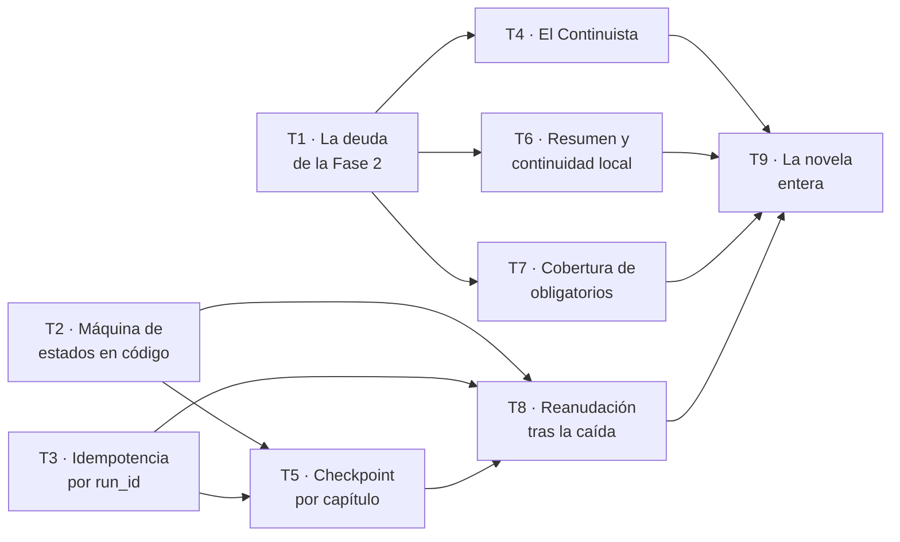

# Fase 3 — Una novela entera

**Objetivo:** que de una `Obra` encargada salgan **los diez capítulos**, integrados y coherentes entre sí, y que matar el proceso a mitad no pierda ni duplique ninguno. Cierra **`CA-1`** y **`CA-5`**: dos de los cinco criterios que, según la spec, deciden si el sistema existe.

**Enfoque:** la Fase 2 construyó el motor y lo probó sobre un capítulo. Esta lo pone a girar diez veces y **ataca el problema que un capítulo suelto no puede tener**: que el siete contradiga al cuatro.

**Spec:** [`spec.md`](spec.md), `aprobada`.

---

## Lo que hereda, y la deuda que se paga el primer día

La Fase 2 ([`plan-2-capitulo.md`](plan-2-capitulo.md), `completado`) dejó **428 tests, veinte tablas y ocho deudas declaradas**. No están escondidas: viven en su tabla de Desviaciones, que llegó a cien filas. **Siete se pagan en la Tarea 1 de esta fase**, y la razón es que todas son de esquema o de contrato, y construir diez capítulos encima de un esquema incompleto es rehacer trabajo.

| Deuda heredada | Qué impide hoy | Dónde se paga |
| --- | --- | --- |
| **Nadie añade el método de vectorizar a `ClienteModelo`** | En producción el índice no se llena y **la capa de memoria recuperada sale siempre vacía**: RF-CTX-04 solo es demostrable en tests. Y esta fase la necesita de verdad, porque es la que recupera lo escrito en los capítulos anteriores | **T1** |
| `capitulo` no guarda `beat_de_genero` | El Arquitecto lo asigna y **se tira al guardar**; el Planificador lo vuelve a decidir. **`CA-32` no está cerrado de punta a punta** | **T1** |
| `ejecucion` no tiene columna para los ids **por capa** | RF-CTX-09 se cumple con el mapa en `parametros`, que es el sitio equivocado | **T1** |
| `trabajo` no tiene `capitulo_id` | Un trabajo recién abierto no sabe de qué capítulo es | **T1** |
| `hecho_canon` no puede **citar al hecho que sustituye** | **RF-MEM-08 queda a medias**, y esta fase la usa: corregir un hecho es lo que pasa cuando el capítulo siete contradice al cuatro | **T1** |
| El canon no tiene dónde declarar **variantes de un nombre** | **`CA-16` valida estricto**: «Mari» por «María» no se acepta por declarada, se ignora porque no se compara | **T1** |
| `architecture.md` §5.5 promete **NumPy** y el código usa `struct`+`math` | Documento y código discrepan, que es lo que `CLAUDE.md` §3.3 prohíbe | **T1**, con la decisión ya tomada abajo |
| «El Escritor solo ve el paquete» no es cierto al pie de la letra | Las restricciones duras viajan con la ficha porque el paquete las lleva **como prosa de biblia, no como campos** | **No se paga aquí.** Ver «Lo que esta fase NO hace» |

**Por qué una tarea de deuda y no repartirla.** Seis de las siete son columnas o contratos: una sola migración y un solo dueño evitan exactamente lo que la Fase 2 sufrió dos veces —tres tareas queriendo escribir el mismo `modelos.py`, y una tabla que no tenía los campos que otro requisito exigía—.

---

## Por qué este corte

**Diez capítulos, y por fin la coherencia a escala.** La Fase 2 declaró sin suavizar que **un capítulo suelto no ejercita el problema real del producto**: la maquinaria de memoria —canon, ledger, estado en T, recuperación— se construyó y se probó por unidades, y demostrarla a escala quedó para aquí. Esta fase es esa demostración.

**Y entra el Continuista, que en la Fase 2 no tenía contra qué chocar.** La decisión **P-B** lo dejó fuera con este motivo exacto: «contrasta contra el grafo, y un capítulo solo no tiene contra qué chocar». Con diez, sí.

**Lo que sigue fuera:** el Crítico con rúbrica. RF-JUZ-06 dice que **el juez no bloquea** hasta que su correlación con la revisión humana esté medida sobre un conjunto y firmada, y eso exige la evaluación de §5 con sus cinco briefs. Es de la Fase 4, junto a la publicación.

---

## Cómo se reparte entre agentes

Escrito antes que las tareas, como en la Fase 2. **Y con las siete reglas que aquella dejó probadas**, más dos que aprendió a golpes.

### El grafo

| Ola | Tareas | Agentes a la vez |
| --- | --- | --- |
| 1 | T1 · T2 · T3 · T4 | **4** — el punto más ancho |
| 2 | T5 · T6 · T7 | 3 |
| 3 | T8 | 1 |
| 4 | T9 | 1 |

Ruta crítica: `T2 → T5 → T8 → T9`. **Cuatro eslabones para nueve tareas.** Medido dos veces ya: la ganancia es **del orden de 2×**.

### Las nueve reglas

Las siete de la Fase 2, que funcionaron:

1. **Un agente por fichero dentro de la ola.**
2. **`modelos.py` tiene un solo dueño y las tablas entran en UNA migración: T1.**
3. **Quien añade una tabla añade su `import` en `alembic/env.py`, en el mismo commit.**
4. **Las fixtures compartidas tienen dueño por fixture.**
5. **Cada agente en su worktree, y lo primero que hace es comprobar su base.** En la Fase 2, **los catorce worktrees arrancaron mal**; solo `git checkout -b <rama> <hash>` atraviesa el clasificador.
6. **La tabla de Desviaciones la escriben todos y la resuelve el integrador.** Nace vacía cada fase: la de la 2 llegó a cien filas y ya no se leía de corrido.
7. **El integrador corre las puertas sobre el resultado COMBINADO al cerrar cada ola**, en los dos modos de `VectorStore`.

Y dos que la Fase 2 pagó con trabajo:

8. **La resolución automática de conflictos vale por tipo de fichero, no por conflicto.** Conservar los dos lados es correcto para la tabla de Desviaciones y **rompe el código**: en la ola 2 dejó un `__init__.py` con prosa dentro y `SyntaxError`. En código se reconstruye desde el superconjunto, a mano.
9. **La verificación en vivo contra un endpoint que llama al modelo no es gratis.** El integrador la hizo una vez en la Fase 2, y lo correcto era un test. **Nadie llama al proveedor sin que lo pida el dueño.**

---

## Decisión previa: `architecture.md` gana, y NumPy entra

**Se resuelve aquí y no dentro de la Tarea 1**, porque es una divergencia entre un documento y el código, y eso no lo decide una tarea de implementación — es exactamente lo que la Fase 2 anotó cinco veces como «decisión tomada dentro de una tarea».

`architecture.md` §5.5 dice «`vec0` (sqlite-vec) **o BLOB + NumPy**» y §2 lo repite. El código de T7 usa `struct` + `math`, y su motivo era bueno: *«resolver con otra rueda binaria el único camino que existe para no depender de una rueda binaria cambia de amo»*, y su alcance sobre `pyproject.toml` era `sqlite-vec` y nada más.

**Gana el documento**, por tres razones:

1. `CLAUDE.md` §3.3: el código nunca gana a un documento — **o se corrige el código, o se cambia el documento a propósito**. Cambiarlo a propósito exigiría un motivo que no tenemos.
2. **NumPy ya está aprobado**: es una de las catorce dependencias que P-01 firmó en bloque. No hay permiso que pedir.
3. El argumento de T7 confunde dos cosas. `sqlite-vec` es una **extensión de SQLite** que puede no cargar en la máquina de destino; NumPy es **una dependencia de Python** como las otras trece. Depender de NumPy no reintroduce el problema del que `BruteForceStore` escapa.

**Y lo que esto cuesta, dicho:** la implementación de T7 funciona y está probada. Cambiarla es trabajo sin comportamiento nuevo. Se hace igual porque el coste de dejar documento y código discrepando **no se paga hoy: se paga cuando alguien lea §5.5 y construya sobre lo que dice**.

*Si al implementarlo aparece un motivo real para quedarse con `struct` —rendimiento medido, o una dependencia que estorba—, **se corrige `architecture.md` §5.5 y §2 en el mismo commit**, con el porqué escrito. Lo que no se admite es que sigan diciendo cosas distintas.*

---

## Restricciones globales

Las de la Fase 2 siguen enteras. Se repiten aquí solo las que esta fase estrena o tensa.

| Restricción | Valor exacto | Origen |
| --- | --- | --- |
| Los diez capítulos son **estrictamente secuenciales** | Cada uno necesita integrado el anterior. **No es el límite de concurrencia**: es CU-03 | spec, P-06 · `architecture.md` §2.3 |
| El orquestador es una **máquina de estados en código** | **Ningún agente decide el siguiente paso** | RF-ORQ-01 |
| El estado vive **en SQLite**, no en memoria del proceso | Si no, una caída lo pierde y CU-04 es imposible | RF-ORQ-02 |
| **Máximo dos reparaciones dirigidas** por capítulo, después `ESCALADA` | El contador **solo crece dentro del capítulo**, y **avanzar al siguiente no lo consume** | RF-ORQ-04 · `CA-9` |
| Idempotencia por `run_id` | Repetir un paso **no duplica escrituras** | RF-ORQ-03 |
| Un capítulo rechazado **no deja rastro** | Ya probado en la Fase 2 sobre uno; aquí sobre diez | RF-MEM-07 · `CA-10` |
| Una escena en vuelo **por obra** | Ya construido (T10 de la Fase 2). Aquí se usa de verdad | RF-ORQ-08 |
| TDD y CA-6 | Rojo → verde → refactor, y **quitar la validación para ver caer su test** | `CLAUDE.md` §3.4 · `CA-6` |

**Y la advertencia que la spec repite y esta fase puede desmentir por accidente:** los diez capítulos **no se paralelizan**. Lo que se solapa son obras distintas y los validadores del mismo capítulo. Un agente que «acelere» la novela rompiendo la secuencia rompe CU-03.

---

## Puntos de revisión

Siete clases de entrada que la spec implica y que **ninguna tarea probaría si no se dijera aquí**.

| # | Entrada o condición | Qué espera una persona razonable | Tarea |
| --- | --- | --- | --- |
| R-1 | **El capítulo 7 contradice un hecho del 4** | El Continuista lo señala **contra el grafo**, con código `CAN-01` y el `hecho_canon_id` que choca. Es el problema real del producto y **la Fase 2 no lo podía tener** | 4 |
| R-2 | Se mata el proceso **en cada estado no terminal** | Se reanuda desde el último capítulo completado, **sin duplicar ni perder ninguno**. Probarlo solo en un estado deja nueve sin probar | 8 |
| R-3 | Un capítulo agota sus **dos reparaciones** y el siguiente empieza limpio | **Avanzar de capítulo no consume reintentos.** Un contador global convierte la novela en un presupuesto de errores, y a la tercera escalarían capítulos sanos | 5 |
| R-4 | El **mismo paso se repite** con el mismo `run_id` | No se duplica ninguna escritura. Es lo que hace segura la reanudación, y sin ello R-2 arregla una cosa y rompe otra | 3 |
| R-5 | Un **elemento obligatorio** del brief no aparece en ningún capítulo | Se señala **cuál**, contra la tabla de hechos. Es `CA-15`, y solo es comprobable con la novela entera | 7 |
| R-6 | Un capítulo **escalado** en mitad de la novela | La novela se detiene y se informa; **no se salta al siguiente**. Publicar con un capítulo escalado lo prohíbe la regla de dominio 14, pero eso es Fase 4: aquí basta con no seguir escribiendo encima |  2 |
| R-7 | El resumen del capítulo 3 **alimenta el contexto del 4** | La capa de continuidad local trae **N-1 antes que N-2**, y la de memoria recuperada trae lo pertinente. Sin esto los diez capítulos son diez cuentos | 6 |

---

## Tarea 1 · La deuda de la Fase 2, en una migración

No entrega funcionalidad: **quita del camino siete cosas que, si se dejan, se pagan diez veces**. Por eso va primera y sola en su carril.

**Ficheros:** `modelos.py` de las features afectadas, **una** migración, `commons/llm/cliente.py`, `commons/llm/claude_code.py`, `commons/llm/doble.py`, y sus tests.

**Lo que debe ser cierto al terminar:**

| | Por qué |
| --- | --- |
| `ClienteModelo` tiene **método de vectorizar**, el real lo implementa y **`DobleDeterminista` también** | Sin él, la capa de memoria recuperada sale vacía en producción. **Cuidado:** el doble hereda del protocolo por subclase explícita, así que añadir un miembro sin implementar **lo vuelve abstracto y revienta la suite entera** — lo avisó T11 de la Fase 2 |
| `capitulo.beat_de_genero` existe y **se guarda** | `CA-32` deja de tener dos verdades: hoy el Arquitecto lo asigna y se tira |
| `ejecucion` tiene columna para los ids **por capa** | RF-CTX-09 deja de vivir en `parametros` |
| `trabajo.capitulo_id` existe | Un trabajo sabe de qué capítulo es |
| `hecho_canon` puede **citar al que sustituye** | RF-MEM-08 entera, y esta fase la usa: corregir un hecho es lo que pasa cuando el 7 contradice al 4 |
| El canon declara **variantes de un nombre** | `CA-16` pasa de «valida estricto» a lo que el criterio pide: «Mari» por «María» **no** es defecto si el canon la declara |
| `BruteForceStore` usa **NumPy**, como dice `architecture.md` §5.5 | Decidido arriba, no dentro de esta tarea. Si al hacerlo aparece un motivo real para lo contrario, **se corrige el documento en el mismo commit** |

Y la regla 3 del reparto: **los `import` de `alembic/env.py` entran con las tablas, en el mismo commit.**

---

## Tarea 2 · La máquina de estados, en código

Cierra **RF-ORQ-01**, **RF-ORQ-02** y **R-6**.

**Ficheros:** `features/escritura/maquina.py` y sus tests. La `ciclo.py` de la Fase 2 pasa a apoyarse en ella.

**Qué debe ser cierto:**
- Los estados y transiciones son los de `architecture.md` §3.3, **en código**: `PLANIFICANDO` → `ENSAMBLANDO` → `ESCRIBIENDO` → `VALIDANDO` → `EXTRAYENDO` → `INTEGRADA`, con `REPARANDO`, `ESCALADA` y `FALLIDA`.
- **Ningún agente decide el siguiente paso.** Se comprueba por análisis y con un test: la transición es una función del estado y del resultado, no del texto que devolvió un modelo.
- Una transición que no existe **es un error de dominio**, no un `else` silencioso.
- El estado **vive en SQLite**: un test lo lee de la base después de reconstruir el objeto desde cero.
- **Un capítulo `ESCALADA` detiene la novela** (R-6). No se salta al siguiente.

---

## Tarea 3 · Idempotencia por `run_id`

Cierra **RF-ORQ-03** y **R-4**. Es lo que hace segura la reanudación de T8: **sin esto, reanudar arregla una cosa y rompe otra**.

**Ficheros:** `features/escritura/idempotencia.py` y sus tests.

**Qué debe ser cierto:**
- Repetir un paso con el mismo `run_id` **no duplica escrituras** en ninguna tabla: ni `version_texto`, ni `evento`, ni `hecho_canon`, ni `ejecucion`.
- Se prueba **paso a paso**, no solo sobre el ciclo entero: un test que repite el ciclo completo pasa aunque un paso concreto duplique, si otro lo compensa.
- La idempotencia **no es «borrar y reescribir»**: el ledger es *append-only* y sus disparadores lo sujetan desde la Fase 2.

---

## Tarea 4 · El Continuista, que por fin tiene contra qué chocar

Cierra **RF-VAL-06**, **R-1** y la mitad de **`CA-9`**. Es el rol que la decisión **P-B** dejó fuera de la Fase 2 con este motivo exacto.

**Ficheros:** `features/calidad/{agents.py,prompts/continuista.v1.md}` y sus tests. Es el **primer `agents.py`** de esa feature: la Fase 2 la construyó entera sin ninguno, a propósito.

**Qué debe ser cierto:**
- Contrasta **contra el grafo de canon**, no a ojo (RF-VAL-06).
- Devuelve **códigos con cita** —`CAN-01`, `CON-03`…—, **nunca prosa corregida** (`CLAUDE.md` §9.1).
- Un `CAN-01` declara un **`hecho_canon_id` que existe** (regla de dominio 9). La puerta de la Fase 2 ya comprueba la forma: **úsala, no la reescribas**.
- **R-1 entero:** un capítulo que contradice un hecho establecido en otro anterior se señala, con el hecho que choca.
- **El Continuista no repara.** La reparación vuelve al Escritor con el defecto concreto, que ya existe desde la Fase 2.

---

## Tarea 5 · Checkpoint por capítulo, y el contador que no se hereda

Cierra **RF-ORQ-05**, **RF-ORQ-04** aplicado a diez capítulos, y **R-3**.

**Ficheros:** `features/escritura/checkpoint.py` y sus tests.

**Qué debe ser cierto:**
- Al integrar un capítulo se **persiste checkpoint**: qué capítulo fue el último completado.
- **El contador de reparaciones solo crece dentro del capítulo.** `CA-9` lo dice con todas las letras: «avanzar de capítulo **no** consume reintentos». Un contador global convierte la novela en un presupuesto de errores y **a la tercera escalarían capítulos sanos** (R-3).
- Se prueba por los dos lados: que a la tercera reparación **del mismo** capítulo se escala, y que el capítulo siguiente **empieza con el contador a cero**.

---

## Tarea 6 · El resumen y la continuidad, que es lo que une diez capítulos

Cierra **RF-MEM-04** aplicado, **R-7**, y hace que la capa de continuidad local y la de memoria recuperada digan algo de verdad.

**Ficheros:** `features/canon/resumenes.py` (o lo que `canon` exporte), y el surtido de las capas `CONTINUIDAD` y `MEMORIA` en `features/contexto/service.py`.

**Qué debe ser cierto:**
- El resumen de cada capítulo se **deriva del texto aprobado** y alimenta el contexto de los siguientes.
- La capa de **continuidad local** trae **N-1 antes que N-2**, que es el orden de recorte que `CLAUDE.md` §4.1 declara.
- La capa de **memoria recuperada** trae lo pertinente de los capítulos anteriores. **Depende de T1:** sin el método de vectorizar, el índice no se llena y esta capa sale vacía.
- **R-7 entero:** sin esto, los diez capítulos son diez cuentos.

*Y el aviso que dejó T6 de la Fase 2: cuando la juntura de vectorizar se cierre, el **censo** de la capa de memoria deja de ver el vacío como normal. **Revisa que siga diciendo la verdad.***

---

## Tarea 7 · Cobertura de los elementos obligatorios

Cierra **RF-VAL-05** y **`CA-15`**. Solo es comprobable con la novela entera, y por eso no pudo estar antes.

**Ficheros:** `features/calidad/cobertura.py` y sus tests.

**Qué debe ser cierto:**
- **Cada elemento obligatorio del brief aparece en al menos un capítulo**, comprobado **contra la tabla de hechos** y no con un `in` sobre el texto.
- Si falta uno, **se señala cuál** (R-5).
- Es la **regla de dominio 11**, y la Fase 1 ya blindó su flanco: R-6 de aquel plan rechaza el elemento obligatorio vacío **porque una cadena vacía es subcadena de cualquier capítulo y este validador daría 100 %**. Ese test sigue vivo: **no lo debilites.**

---

## Tarea 8 · Reanudación: matar el proceso y seguir

Cierra **RF-ORQ-06**, **RF-ORQ-07**, **R-2** y **`CA-5`** — uno de los cinco criterios que deciden si el sistema existe.

**Ficheros:** `features/escritura/reanudacion.py` y sus tests.

**Qué debe ser cierto:**
- Tras una caída se reanuda **desde el último capítulo completado**.
- **Ni se duplica ni se pierde ningún capítulo.**
- **R-2 es explícito y no negociable:** se prueba matando el proceso **en cada estado no terminal**, no en uno. Probarlo solo en `ESCRIBIENDO` deja ocho estados sin probar, y el criterio dice «en cualquier estado no terminal».
- Se apoya en la idempotencia de T3: **si un paso repetido duplica, la reanudación duplica**.

---

## Tarea 9 · La novela entera

Cierra la fase y **`CA-1`**: «se genera una novela completa de diez capítulos de principio a fin, desde el brief de ejemplo, con todos los capítulos integrados».

**Ficheros:** `features/escritura/novela.py`, su router, y el test de extremo a extremo.

**Qué debe ser cierto:**
- Del brief de ejemplo salen **diez capítulos integrados**, con `DobleDeterminista`.
- Los diez son **secuenciales**: cada uno con el anterior integrado.
- El estado de la novela se lee por `GET /trabajos/{id}`, **legible por capítulo** (RI-06).
- **Y una corrida real declarada**, que **no ejecuta ningún agente**: gasta cuota y la lanza el dueño. Su salida se copia en el informe y **no entra en el repositorio** (RD-06).

---

## Lo que esta fase deja cerrado

| Criterio | Qué demuestra |
| --- | --- |
| **CA-1** | Una novela completa de diez capítulos, de principio a fin |
| **CA-5** | Se mata el proceso en cualquier estado no terminal y se reanuda sin duplicar ni perder |
| **CA-9** | A la tercera reparación se escala, y **avanzar de capítulo no consume reintentos** |
| **CA-15** | Cada elemento obligatorio aparece en algún capítulo, y si falta se dice cuál |
| **CA-16** | Con las variantes declaradas que T1 hace posibles |
| **CA-32** | De punta a punta, con `beat_de_genero` persistido |
| **CA-10** | Un capítulo rechazado no deja rastro — ahora sobre diez |

**Requisitos:** RF-ORQ-01 a 07 · RF-MEM-04 aplicado, RF-MEM-08 · RF-VAL-05, RF-VAL-06 · RI-06 · y las siete deudas de la Fase 2.

## Lo que esta fase NO hace, y no es un olvido

- **No hay Crítico ni rúbrica.** RF-JUZ-06 dice que el juez **no bloquea** hasta que su correlación con la revisión humana esté medida sobre un conjunto y firmada, y eso exige la evaluación de §5 con sus cinco briefs. Fase 4.
- **No se publica nada.** `VersionPublicada`, ficha, PDF y petición del lector son de la Fase 4, con `CA-21`, `CA-24` y `CA-25`.
- **No hay Langfuse, ni Lean, ni TLA+.** Los tres necesitan lo que esta fase produce —trazas que valga la pena mirar, una cronología completa, una máquina de estados estable— y por eso van después, no antes.
- **«El Escritor solo ve el paquete» sigue siendo cierto con matiz.** Las restricciones duras viajan con la ficha porque el paquete las lleva **como prosa de biblia y no como campos**. Cerrarlo de verdad es cambiar la **capa de instrucción** del Ensamblador, y eso toca el contrato que esta fase consume diez veces: **se hace cuando no haya diez capítulos dependiendo de él.**

---

## Desviaciones

*Se anotan aquí **antes** de seguir, no después (`CLAUDE.md` §3.4). Nace vacía: la de la Fase 2 llegó a cien filas y dejó de leerse de corrido.*

| Fecha | Paso | Qué se desvió y por qué |
| --- | --- | --- |
| 2026-09-24 | Cierre de la ola 1 | **El aviso que yo mismo propagué era falso, y la verdad es peor.** Le dije a T1 que añadir un miembro al `Protocol` «lo vuelve abstracto y revienta la suite» — lo heredé de T11 de la Fase 2. **No es cierto:** `__abstractmethods__` queda vacío, la subclase hereda el cuerpo `...` y **devuelve `None` en silencio**. Verificado en este intérprete. El primer test de T1 pasó en verde con las dos implementaciones sin implementar. Lo guarda ahora un test que exige que **cada una lo defina**. **Quien añada el siguiente miembro debe saber que el peligro no es el que estaba escrito** |
| 2026-09-24 | Cierre de la ola 1 | **La búsqueda deja de llamarse «semántica», porque no lo es.** T1 cerró la deuda de vectorizar con un vectorizador **léxico local y determinista** —palabras normalizadas repartidas con `blake2b` sobre 256 componentes—, y lo declaró: da lo que la deuda pedía (el índice se llena en producción) y **no da lo que la palabra promete** — dos fragmentos que dicen lo mismo con otras palabras no se reconocen. **Decidido: se corrige la palabra, no el código.** Anthropic no publica extremo de *embeddings* y P-02 fija consumo de cuenta **sin clave de API**; meter un proveedor contradiría una decisión firmada. `CLAUDE.md` §4.2 y `architecture.md` §2 pasan a decir «afinidad de vectores», con el porqué y con lo que **no** hace escrito al lado. Quien quiera semántica de verdad abre una decisión de producto |
| 2026-09-24 | Cierre de la ola 1 | **El motor de la máquina de estados baja de `commons/jobs/` a `features/escritura/`, y se corrige `architecture.md` §3.10.** Aquí **gana el código**, al revés que con NumPy: la máquina persiste en la tabla `trabajo`, que es de `escritura`, y §5.1 **prohíbe que `commons/` importe de una feature** —primer contrato de `import-linter`, que falla la build—. Dejarla arriba obligaba a subir `Trabajo` y detrás media feature. Los cerrojos y la reserva de tokens **sí** se quedan en `commons/jobs/`: no tocan ninguna tabla de feature. Lo destapó T2 y pidió que se decidiera fuera de su tarea, que es lo correcto |
| 2026-09-24 | Cierre de la ola 1 | **El `__init__.py` de una feature no tenía dueño, y los tres agentes lo dejaron sin tocar a propósito.** T2, T3 y T4 no exportaron sus módulos porque ese fichero no está en la tabla del reparto —sí `modelos.py` y `alembic/env.py`— y tres agentes de la misma ola tocándolo habría repetido **el conflicto de código que la regla 8 describe, en el mismo fichero y en la misma ola**. Los tres hicieron lo correcto. Exportado al integrar, con la explicación dentro del propio fichero. **Para la Fase 4: el `__init__.py` entra en la tabla de dueños** |
| 2026-09-24 | Cierre de la ola 1 | **Le pasé a T4 la regla de dominio 4 en su forma antigua, y me corrigió.** Escribí «§8 reglas 2, 4 y 9» a secas; la v1.3 decía «todo hecho de canon cita la escena que lo estableció», y **el repositorio dice** «con `origen: escena`… los de `origen: brief` no la tienen y **no deben inventarla**». T4 fue a buscarlo en vez de creerme. Su frase: *«si hubiera seguido el encargo al pie de la letra, habría prohibido guardar el nombre del destinatario»*. **Segunda vez en dos fases que un agente me corrige una cita**; la primera fue §5 frente a §7 en `definitions.md` |
| 2026-09-24 | Cierre de la ola 1 | **Dos correcciones al plan que se aplican ya, y una a la Fase 4.** (1) El grafo dice `T3 → T5` y **falta `T3 → T8`**, aunque R-4 lo afirme: quien implemente la reanudación leyendo solo el diagrama no vería de qué depende. (2) «Idempotencia por `run_id`» **es un nombre que engaña**: el `run_id` solo no basta —una corrida escribe hasta tres veces en `version_texto`— y hace falta `run_id`+paso+ordinal; **quien lea solo el plan escribiría un guardia que impide el reintento dirigido**. (3) T1 avisa de que «NumPy es una de las catorce que P-01 aprobó» era cierto en la spec y **no estaba en `pyproject.toml`**: aprobada no es instalada, y en la Fase 4 esa distancia se llama Langfuse, Lean y Playwright |
| 2026-09-24 | Cierre de la ola 1 | **`RF-VAL-06` no queda cerrado entero y el plan lo daba por cerrado.** El requisito nombra canon, continuidad **y conocimiento**. El de canon sí es mecánico: contrasta contra el grafo y el `hecho_canon_id` se comprueba en código. Los otros dos **viven solo en el prompt**, porque a T4 le llega una proyección de `HechoCanon` y la regla de dominio 2 —`sabe_desde` con escena anterior— se decide contra el **ledger y `estado_en_t`**, que nadie le pasa. Ninguna tarea de esta fase lo tiene encargado. Lo destapó T4 |
| 2026-09-24 | T1 · base | **El worktree arrancó mal, por octava vez.** `HEAD` estaba en `7025869`, de otro árbol entero: ni `src/backend/` ni `specs/`. Recolocado con `git checkout -b f3-t1-deuda eeb9835`, que es lo único que atraviesa el clasificador (regla 5 del reparto). La regla funciona; lo que no funciona es la creación del worktree, y ya son catorce más uno |
| 2026-09-24 | T1 · deuda 1 | **El aviso que T11 heredó de la Fase 2 era falso, y lo que hay debajo es peor.** Decía que añadir un miembro al `Protocol` «lo vuelve abstracto y revienta la suite entera». Comprobado en este intérprete: `ClienteModelo.__abstractmethods__` queda **vacío**, y una subclase explícita que no implemente el miembro hereda el cuerpo `...`, que **devuelve `None` en silencio**. O sea que la suite no revienta: el índice se habría llenado de `None` sin que nada fallara. Lo único que lo impide es exigir que cada implementación lo **defina**, y eso es ahora un test (`test_las_dos_implementaciones_definen_vectorizar_...`). **Para quien añada el siguiente miembro:** el peligro no es el que estaba escrito |
| 2026-09-24 | T1 · deuda 1 | **`vectorizar` no llama al proveedor, y eso es una decisión de diseño que hay que leer.** Anthropic **no publica un extremo de *embeddings*** y P-02 fija el modelo por consumo de cuenta **sin clave de API**: pedir un vector al proveedor exigía o una segunda credencial o pedírselo al modelo en prosa —cuota por fragmento y una cifra distinta en cada llamada para algo que se guarda y se compara—. Lo que entra es un vectorizador **léxico local y determinista**: bolsa de palabras normalizadas, repartidas con `blake2b` sobre 256 componentes, con signo y normalizada a longitud 1. **Lo que esto da:** el índice **se llena en producción**, que era la consecuencia viva de la deuda, y comparte implementación con el doble, así que lo que la suite indexa es lo que se indexará de verdad. **Lo que NO da, dicho sin suavizar: es una señal léxica, no semántica.** Dos fragmentos que dicen lo mismo con otras palabras no se reconocen. `architecture.md` §5.5 y la spec llaman «similitud semántica» a ese paso, y hoy el código entrega menos que esa palabra. **Para una persona:** o se acepta y se corrige la palabra en los documentos, o entra un proveedor de *embeddings* —dependencia y credencial nuevas, `CLAUDE.md` §3 punto 7—. No se decide dentro de una tarea |
| 2026-09-24 | T1 · deuda 1 | El reparto es `blake2b` y **no `hash()`**: el `hash()` de una cadena está salado por proceso, así que los vectores de ayer no se podrían comparar con los de hoy y el índice se llenaría de ruido **sin que fallara nada**. Hay un test que lo comprueba **en otro proceso**, con `PYTHONHASHSEED` puesto |
| 2026-09-24 | T1 · deuda 1 | **La juntura queda abierta un tramo más, y es corto:** `ejecutar_ciclo` acepta `vectorizar` desde la Fase 2 y **nadie le pasa el del cliente todavía**, porque `features/escritura/` es de T2 y T3 en esta ola. Son dos líneas: `Vectorizacion` repite a propósito los tres campos de `canon.Vector` —`datos`, `dimension`, `modelo`— para que la traducción sea una. **Lo cierra T6, que es quien necesita la capa de memoria llena (R-7), o el integrador** |
| 2026-09-24 | T1 · deuda 3 | `ejecucion.parametros` **queda vacío** al salir `ids_por_capa` de ahí. No se retira la columna: es donde van los parámetros de la llamada —temperatura y demás—, que hoy no se envían y mañana sí. Y `ids_canon` e `ids_recuperados` **se conservan** aunque el mapa nuevo los contenga: son las dos que las consultas de CU-07 ya saben mirar, y quitarlas sería una migración de datos por comodidad |
| 2026-09-24 | T1 · deuda 6 | **`canon` pasa a importar de `calidad`**, por su `__init__.py`. `leer_nombres_del_canon` devuelve `NombreDeCanon`, que es el modelo que `calidad` ya exporta: inventar aquí una tercera representación del mismo concepto es la deriva que `CLAUDE.md` §2 evita. No hay ciclo —`calidad` no importa de ninguna feature— y `lint-imports` y `test_fronteras` pasan. **Riesgo declarado:** T4 está escribiendo `features/calidad/` en esta misma ola; si su `__init__.py` se reconstruye a mano por un conflicto, `NombreDeCanon` tiene que seguir exportado |
| 2026-09-24 | T1 · deuda 6 | **La tabla existe y el validador todavía no la lee.** `_nombres_del_canon` vive en `features/escritura/ciclo.py`, que no es de esta tarea: sigue haciendo `SELECT DISTINCT entidad` y construyendo `NombreDeCanon` sin variantes. El cambio es sustituir esa función por `leer_nombres_del_canon`. **Hasta que se haga, `CA-16` sigue validando estricto** aunque el canon ya pueda declarar variantes. **Lo cierra el integrador o T6** |
| 2026-09-24 | T1 · deuda 6 | Nadie **escribe** variantes en producción todavía: `declarar_variantes` existe y está exportada, y quien debería llamarla es el Entrevistador —el comprador es quien sabe que a María la llaman Mari— o el Extractor. No entra aquí porque `features/obra/service.py` no es de esta tarea. **Para una persona:** decidir cuál de los dos las declara |
| 2026-09-24 | T1 · deuda 6 | `variante_de_nombre.forma_canonica` es **texto y no clave ajena**: el canon no tiene tabla de entidades —los nombres salen de `hecho_canon.entidad`— y una clave ajena a una tabla que no existe no se puede escribir. Es la misma juntura torcida que ya estaba anotada: `hecho_canon` vive en `features/obra/` y su único escritor es `canon` |
| 2026-09-24 | T1 · deuda 5 | El `CheckConstraint` para el ciclo de un paso —un hecho que se sustituye a sí mismo— **no alcanza los ciclos largos**: A cita a B y B cita a A entra sin que nada lo pare. Sostenerlo en el esquema pide un disparador recursivo. Se declara en vez de disimularse |
| 2026-09-24 | T1 · deuda 7 | NumPy entra, como decidió el plan, y con él `AlmacenFuerzaBruta` compara **todos los candidatos en una operación** en vez de recorrerlos. **No apareció ningún motivo para quedarse con `struct`**, así que `architecture.md` §5.5 y §2 **no se corrigen**: ya decían NumPy y ahora el código coincide. El párrafo del `AlmacenFuerzaBruta` que argumentaba lo contrario sí se reescribe, con el porqué |
| 2026-09-24 | T1 · migración | **`--autogenerate` volvió a no emitir los `CheckConstraint` sobre tablas que ya existen** —`capitulo` y `hecho_canon`—, y sí el de `variante_de_nombre`, que es tabla nueva. Escritos a mano, con su `downgrade`, y con **un test cada uno sobre la base migrada**: sin ellos, `create_all` tenía las restricciones y la base de la instalación no, y nada lo habría dicho |
| 2026-09-24 | T1 · migración | `ejecucion.ids_por_capa` es `NOT NULL` sobre una tabla que puede tener filas: lleva `server_default='{}'`, o el modo batch recrea la tabla y las filas viejas entran con `NULL`. Tiene test sobre la base migrada, y la mutación que quita el `server_default` lo tumba |
| 2026-09-24 | T1 · migración | **`alembic/env.py` no cambia, y es correcto**: la única tabla nueva —`variante_de_nombre`— vive en `features/canon/modelos.py`, que ya estaba importado. Comprobado con `alembic check`, que no detecta operaciones nuevas: si el módulo no estuviera registrado, el siguiente `--autogenerate` propondría su `drop_table` |
| 2026-09-24 | T1 · CA-6 | **Dos mutaciones no tumbaron nada, y las dos eran tests que pasaban por el motivo equivocado.** (1) Quitar la comprobación de dimensión de `distancias_coseno` no rompía su test porque **NumPy lanza igual** su propio `ValueError` al multiplicar: lo que la guarda aporta no es el fallo sino **decir qué dimensiones eran**, y el test ahora lo exige con `match`. (2) Quitar `sustituye_a=hecho.id` del escritor no rompía nada: había test de la **columna** y ninguno del **comportamiento**. Añadidos dos, uno de ellos de una cadena de tres correcciones, que es lo que la deducción por entidad y atributo no podía dar |
| 2026-09-24 | T1 · deuda 8 | **Deuda añadida por el integrador de la ola 1, a raíz de T4.** `completar` no admitía modelo, así que la separación de P-02 —Haiku escribe, Opus juzga— **no se podía ni pedir, y ningún test podía caer por incumplirla**. Ahora `completar(prompt, semilla, modelo=None)`, con el del cliente por defecto. Tres cosas más: el `Consumo` y su **coste** se imputan al modelo que de verdad se usó —Opus cuesta cinco veces más que Haiku, y RF-OBS-03 usa esa cifra para comparar plantillas—; el doble registra el modelo en `modelos`, **una lista aparte** porque tres features desempaquetan `llamadas` de dos en dos; y hay un test sobre la firma del protocolo. **Lo que falta y no es de esta tarea:** que el Continuista y el Crítico **pidan** `MODELO_JUEZ`. La capacidad está; el cableado es de `features/calidad/`, que es de T4 |
| 2026-09-24 | T1 · vocabulario | `Vectorizacion`, `VarianteDeNombre` y `sustituye_a` **no están en `docs/definitions.md`**. No se introducen términos nuevos: «variante declarada» es de RF-VAL-03 y `NombreDeCanon.variantes` existe desde la Fase 2; «sustituye» es el verbo de RF-MEM-08 y de `definitions.md` §9.2. `architecture.md` §5.5 sí se actualiza en este commit, con la fila del nuevo almacén y la cita de `sustituye_a`. **Para una persona:** decidir si `definitions.md` §4.3 debe nombrar las variantes de un nombre como atributo de `Personaje` |
| 2026-09-24 | T2 | **`architecture.md` §3.10 dice que el motor de la máquina vive en `commons/jobs/`; la Tarea 2 lo pone en `features/escritura/maquina.py`.** Se hizo donde dice el plan, y hay un motivo que va más allá del alcance: la máquina persiste en la tabla `trabajo`, que es de `escritura`, y **`commons/` no puede importar de una feature** (primer contrato de `import-linter`). Un motor en `commons/` exigiría subir `Trabajo` también, y eso no es una decisión de una tarea de implementación. **Gana el documento o se cambia el documento a propósito (`CLAUDE.md` §3.3): lo resuelve el integrador, no T2.** |
| 2026-09-24 | T2 | **El diagrama de §3.3 dibuja una sola flecha hacia `FALLIDA` y la tabla de §3.6 nombra tres causas.** `FalloDeProveedor` y `TiempoAgotado` no son de ningún estado en particular —el proveedor se cae en cualquier llamada y el plazo vence en cualquier paso—, así que el código las admite desde cualquier estado no terminal. `ContextBudgetExceeded` sí queda atada a `ENSAMBLANDO`, que es lo que §3.6 dice. El diagrama está incompleto, no equivocado. |
| 2026-09-24 | T2 | **`CapaVacia` viaja con la misma señal que `ContextBudgetExceeded`.** Las dos son la fila de §3.6 «fallo de diseño del ensamblado, no de ejecución» y ninguna llega a llamar al modelo. El diagnóstico se distingue en `causa_fallo`; el destino es el mismo. |
| 2026-09-24 | T2 | **El ciclo de la Fase 2 saltaba de `VALIDANDO` a `ESCALADA`, y §3.3 no dibuja esa flecha.** Ahora pasa por `REPARANDO`, que es de donde sale el escalado cuando el contador se agota. No cambia el estado final de ningún test; cambia **quién decide**: antes un `if` del ciclo, ahora el contador. |
| 2026-09-24 | T2 | **`NovelaDetenida` nombra el `trabajo_id` y no el capítulo,** porque `trabajo.capitulo_id` es de T1 y no existía al escribir esto. Cuando aterrice, el mensaje puede decir qué capítulo detuvo la novela. |
| 2026-09-24 | T2 | **`maquina.py` no se exporta por el `__init__.py` de `escritura`.** No hace falta: quien la usa hoy —`ciclo.py`, y mañana T3, T5 y T8— está dentro de la misma feature. Y el `__init__.py` tiene un solo dueño dentro de la ola (regla 1 del reparto). |
| 2026-09-24 | T3 | **`evento` y `hecho_canon` no tienen columna `run_id`**, así que su rastro se pregunta por escena y no por corrida. Añadirla es esquema y migración, y `modelos.py` tiene un solo dueño en esta fase (T1). Hoy es exacto —`architecture.md` §3.4: la escritura a canon y ledger es exclusiva de `EXTRAYENDO`, una vez por escena— y deja de serlo el día que se regenere un capítulo ya integrado, que es Fase 4. Las otras dos tablas, `version_texto` y `ejecucion`, sí se preguntan por `run_id` |
| 2026-09-24 | T3 | **La clave de idempotencia no es el `run_id` solo: es `run_id` + paso + ordinal.** Con el `run_id` a secas, la primera reparación dirigida de RF-ORQ-04 sería indistinguible de una repetición y el reintento no llegaría a escribirse. `architecture.md` §3.2 dice «clave de idempotencia» del `run_id` y no se contradice —correlaciona la corrida—, pero el guardia necesita las tres partes |
| 2026-09-24 | T3 | **`idempotencia` no se exporta por `features/escritura/__init__.py`.** El alcance de T3 es `idempotencia.py` y sus tests, y el `__init__.py` lo comparten T2 (`maquina.py`) y quien integre la ola: tocarlo desde tres ramas es el conflicto de código que la regla 8 del reparto dice que no se resuelve solo. **Queda para el integrador**, y hasta entonces solo se puede usar desde dentro de la feature |
| 2026-09-24 | T4 | **`features/calidad/__init__.py` se toca, y el alcance de la tarea nombra solo `agents.py`, el prompt y los tests.** Sin exportar el Continuista por la puerta de la feature, T9 no puede usarlo sin entrar por un fichero interno, que es lo que `CLAUDE.md` §5.1 regla 1 prohíbe y `app/tests/test_fronteras.py` guarda. Se exportan cinco nombres —`Continuista`, `CapituloAContrastar`, `HechoDeCanon`, `OrigenDeHecho`, `RevisionDeContinuidad`— y `SalidaMalFormada`; el esquema con el que se valida la salida del modelo **no se exporta**, porque nadie fuera lo construye. Ningún otro agente de la ola 1 toca ese fichero |
| 2026-09-24 | T4 | **`SalidaMalFormada` y `TextoNoVacio` se duplican por cuarta vez** (`obra`, `outline`/`canon`, y ahora `calidad`). `CLAUDE.md` §5.1 regla 4 las manda a `commons/` **al tercer uso real**, así que la deuda ya estaba vencida antes de esta tarea. No se paga aquí porque `commons/llm/` es de **T1**, en esta misma ola, y la regla 1 del reparto es un agente por fichero. **Queda para el integrador de la ola 1 o para una tarea propia** |
| 2026-09-24 | T4 | **`sin_etiquetas` se duplica** desde `features/canon/agents.py` — tercera copia contando la de `features/obra/agents.py`. No se importa porque es un fichero **interno** de otra feature y §5.1 lo prohíbe; no se sube a `commons/` por el mismo motivo que la fila anterior. Es el caso de libro de la regla 4, y las tres copias ya están |
| 2026-09-24 | T4 | **La regla de dominio 4 se implementó en su forma del repositorio, no en la del encargo de la tarea.** `CLAUDE.md` §8 y el axioma 14 de `definitions.md` §11 la condicionan al origen: un `HechoCanon` de `origen: escena` declara su escena, y **uno de `origen: brief` no la tiene y no debe inventarla**. `HechoDeCanon` valida **las dos mitades**, que es lo que la v2.0 del documento corrigió a propósito: el canon de una novela personalizada nace antes del texto |
| 2026-09-24 | T4 | **El prompt admite cuatro códigos y no los veintiuno de la taxonomía**: `CAN-01`, `CON-01`, `CON-02` y `CON-03`. Son los que RF-VAL-06 pone en manos de este rol —canon, continuidad y conocimiento—; `VOZ`, `PRO` y `EST` son del Crítico o de los validadores mecánicos, `SEG` y `PER` de los guardarraíles, y `CFG` y `REN` no son del capítulo. Un Continuista que pudiera emitirlos todos solaparía con la puerta que ya existe |
| 2026-09-24 | T5 · base | **El worktree arrancó mal, y van veinte.** `HEAD` estaba en `7025869`, de otro árbol entero: ni `src/backend/` ni `specs/`. Recolocado con `git checkout -b f3-t5-checkpoint f63a3e9`, que es lo único que atraviesa el clasificador (regla 5 del reparto) |
| 2026-09-24 | T5 · el encargo de la ola 1 | **`exigir_que_la_novela_siga` ya tiene quien la llame, y R-6 tiene efecto por primera vez.** T2 la dejó escrita y probada, pero la máquina no sabe cuál es el capítulo siguiente, así que en producción nadie frenaba nada. Ahora `empezar_capitulo` la llama **la primera de sus tres comprobaciones**, y la mutación que la borra tumba `test_un_capitulo_escalado_impide_empezar_el_siguiente` y **solo ese** |
| 2026-09-24 | T5 · la pregunta de T2 | **`FALLIDA` NO entra en `DETIENEN_LA_NOVELA`, y el hueco se cierra por otro sitio.** §3.6 declara `FALLIDA` un error técnico **relanzable como trabajo nuevo**, no un juicio de calidad: meterlo en ese conjunto convertiría un remedio automático en una decisión humana —habría que «desdetener» la obra a mano tras cada 5xx del proveedor— y contradiría el documento. Lo que impide escribir el capítulo N+1 sobre un N averiado es **una regla distinta y más fuerte**, que entra con esta tarea: `empezar_capitulo` exige que **no quede ningún capítulo anterior sin integrar** (`CapituloAnteriorSinIntegrar`). Esa regla no mira la causa, así que frena igual un `FALLIDA` sin relanzar, un `CANCELADA` y un capítulo que nadie intentó; y **desbloquea sola** en cuanto el relanzamiento lo integra, que es justo lo que §3.6 pide y lo que una entrada en `DETIENEN_LA_NOVELA` no sabría expresar. Probado en las dos mitades: `test_un_capitulo_fallido_no_detiene_la_novela_pero_bloquea_el_siguiente` y `test_relanzado_e_integrado_el_fallido_desbloquea_el_siguiente`. **`maquina.py` no se toca** |
| 2026-09-24 | T5 | **No hay tabla de checkpoint, y el plan no pedía ninguna.** El avance **se deriva** de `trabajo`: el capítulo de mayor `numero` cuyo trabajo llegó a `INTEGRADA`. Es el mismo principio que `idempotencia.py` dejó escrito —*la idempotencia vive en el dato, no en la memoria del proceso*— y el que la regla de dominio 3 aplica al estado en T. Una tabla aparte sería un segundo relato de lo ocurrido, que puede divergir del primero justo tras una caída, y además es esquema y migración, que esta tarea no tiene |
| 2026-09-24 | T5 | **El contador de reparaciones es del CAPÍTULO, no del trabajo, y esa fue una decisión.** `FALLIDA` se relanza como trabajo nuevo (§3.3), así que contar por trabajo daría reparaciones infinitas: bastaría un fallo del proveedor para que las dos vueltas de RF-ORQ-04 volvieran a estar disponibles. `reparaciones_del_capitulo` toma el **máximo** de `intento` entre todos los trabajos del capítulo — el máximo y no la suma, porque `intento` es un contador y no un incremento. Es lo que hace cierta la tercera garantía de §3.9: «el contador solo crece» |
| 2026-09-24 | T5 | **`ciclo.abrir_trabajo` no rellena `trabajo.capitulo_id`, que es la columna que T1 añadió para esto.** Sin ella el avance no se puede preguntar —un trabajo recién abierto todavía no tiene escena—, así que T5 aporta `atar_al_capitulo(sesion, trabajo, capitulo_id=...)`, que persiste. **Nadie la llama todavía**: `ciclo.py` no es de esta tarea y tocarlo habría cruzado el alcance en la misma ola. **Lo cierra T8**, que es quien cablea la reanudación, **o el integrador**: son dos líneas dentro de `abrir_trabajo`. Hasta entonces, el checkpoint funciona pero solo si quien abre el trabajo ata el capítulo |
| 2026-09-24 | T5 · CA-6 | **Quince mutaciones, y una no tumbó nada: era un agujero de verdad.** Quitar el `obra_id` del filtro de `siguiente_capitulo` dejaba la suite entera en verde, y no porque la regla fuera redundante: **ninguna otra obra de la suite tenía outline**, así que el caso de §3.8 —dos obras planificadas a la vez— no estaba cubierto por ningún test. Sin esa regla, el orquestador de una obra podía recibir el capítulo 1 de otra. Añadido `test_el_siguiente_capitulo_no_es_el_de_otra_obra`, que lo mata. Las otras catorce tumbaron su test y solo el suyo, salvo dos que tumbaron varios **del mismo fichero y por el mismo motivo** (el orden del outline y `hay_avance` son transversales a esos tests) |
| 2026-09-24 | T5 · vocabulario | **«Checkpoint» no está en `docs/definitions.md`, y no se introduce aquí.** Es un término de `architecture.md` §3.9 —que titula «Checkpoint por capítulo»— y de `verification.md`, donde nombra dos invariantes. No figura en la lista de conceptos de `CLAUDE.md` §2, así que no hay definición que citar ni término nuevo que proponer. **Para una persona:** decidir si `definitions.md` debe recogerlo, ahora que hay código que lo produce |
| 2026-09-24 | T5 | **`checkpoint.py` importa `CapituloDesconocido` de `features/contexto`, por su `__init__.py`.** Es el error que ya existe para «ese capítulo no es de esta obra» y `ciclo.py` lo importa igual; inventar aquí un segundo nombre para lo mismo es la deriva que `CLAUDE.md` §2 evita. No hay ciclo, y `lint-imports` y `test_fronteras` pasan |
| 2026-09-24 | T5 | **El `__init__.py` se toca, y ya tiene dueño declarado dentro.** El integrador de la ola 1 lo dejó explicado y la Desviación de esa ola dice «para la Fase 4 entra en la tabla de dueños». Se exportan trece nombres de `checkpoint.py` y nada más; ningún otro agente de la ola 2 escribe en `features/escritura/` |
| 2026-09-24 | T5 · lo que me parece mal del plan | **El plan da por hecho que R-3 se prueba «por los dos lados» y los dos lados que nombra no son los que hacen falta.** «A la tercera reparación del mismo capítulo se escala» y «el siguiente empieza a cero» son ciertos, pero el escenario que de verdad rompe un contador global es el **capítulo sano que costó dos vueltas y se integró**: si el contador se heredara, el capítulo siguiente escalaría al primer defecto sin que hubiera fallado nada. Ese es el test que se escribió. **Y falta un tercer lado que el plan no nombra:** el relanzamiento de un `FALLIDA`, que con un contador por trabajo devuelve las dos reparaciones gastadas |
| 2026-09-24 | T6 · base | **El worktree arrancó mal, por novena vez.** `HEAD` estaba en `7025869`, de otro árbol entero: ni `src/backend/` ni `specs/`. Recolocado con `git checkout -b f3-t6-continuidad f63a3e9`, que sigue siendo lo único que atraviesa el clasificador (regla 5 del reparto). Van quince más uno |
| 2026-09-24 | T6 · encargo 1 | **La juntura de `vectorizar` se cierra hasta donde el reparto deja, y lo que queda es UNA línea en un fichero ajeno.** La traducción de `Vectorizacion` a `canon.Vector` ya no hay que escribirla a mano: vive en `features/canon/vectorizacion.py` como `vectorizador_de(cliente)` y se exporta por el `__init__.py`. Está ahí y no en quien orquesta a propósito — repetida en cada sitio que ejecute un ciclo, se escribiría mal en alguno, y el síntoma sería un `embedding.modelo` equivocado, que no rompe nada hoy y hace incomparables los vectores mañana. **Lo que falta:** `features/escritura/router.py` ya tiene el `cliente` inyectado en `escribir`, así que basta con pasar `vectorizar=vectorizador_de(cliente)` al `add_task` y aceptarlo en `_correr_el_ciclo` para dárselo a `ejecutar_ciclo`. **No lo hace T6 porque `features/escritura/` es de T5 en esta ola** (regla 1 del reparto). Lo cierra T5 o el integrador, y hasta entonces el índice solo se llena en la suite |
| 2026-09-24 | T6 · encargo 2 | **El censo dejó de decir la verdad al llenarse el índice, y por un motivo que el aviso no anticipaba: la capa pasó a tener DOS almacenes.** `architecture.md` §4.8 dice «índice vectorial **+ resúmenes**», y al entrar los resúmenes en la capa de memoria, el cuarto caso de R-3 —hay indexadas y el almacén no devuelve nada— dejó de verse desde `ensamblar`: la capa **ya no llega vacía**, la llena el otro almacén, y la avería del índice habría pasado inadvertida sin que fallara ningún test. La comprobación baja a `_surtir_recuperado`, que lanza el mismo `CapaVacia` con la misma señal —`ciclo.py` ya la captura junto a `ContextBudgetExceeded`— antes de llamar a nadie. Tiene test con el índice lleno de verdad, y la mutación que lo quita lo tumba |
| 2026-09-24 | T6 · encargo 2 | **Y queda una imprecisión declarada:** el mensaje de `CapaVacia` dice «la capa memoria llegó vacía» cuando lo que llegó vacío es **uno de sus dos almacenes**. Arreglarlo bien es una de dos cosas, y las dos viven en `capas.py`, que no es fichero de esta tarea: o `CapaVacia` gana un campo que nombre el almacén, o `Surtido` aprende a componerse de varias fuentes con censo propio y `ensamblar` las comprueba una a una. **Para una persona:** la segunda es la que hace la regla general, porque hoy la capa de memoria es la única con dos orígenes y mañana no tiene por qué serlo |
| 2026-09-24 | T6 · censo de los resúmenes | **El censo son los capítulos ya escritos, no los resúmenes encontrados**, y esa elección es la que hace alcanzable la regla: contar lo devuelto los igualaría siempre y RF-CTX-06 se cumpliría por consecuencia. Con eso, un capítulo con texto vigente y sin resumen **falla el ensamblado del siguiente**. Es correcto —la consolidación escribe el resumen en la misma transacción que los hechos— pero es comportamiento nuevo sobre una base que ya tenga capítulos escritos antes de esta tarea: **una obra a medio generar de la Fase 2 no ensambla su capítulo siguiente hasta que se consolide**. No hay migración de datos porque no hay datos que migrar (base por obra, y ninguna en producción), pero queda dicho |
| 2026-09-24 | T6 · RF-MEM-04 | **Un resumen que no cita `version_texto` vigente no alimenta nada.** El requisito dice «derivado del texto aprobado», y la columna admite nulo desde la Fase 2 «mientras el ciclo completo no exista». El ciclo existe desde la ola 1, así que la lectura exige la cita: sin ella el resumen no se puede rehacer desde el manuscrito —es una segunda verdad sobre el capítulo— y si cita una versión **descartada** describe prosa que el manuscrito ya no tiene. **No se retira el nulo de la columna:** eso es `modelos.py` y una migración, y ninguno de los dos es de esta tarea |
| 2026-09-24 | T6 · orden de la capa | **Los resúmenes van delante de los fragmentos recuperados**, y el criterio no es el de `CLAUDE.md` §4.1 para esa capa —«resultados de menor puntuación»— porque un resumen no trae puntuación. El criterio es qué se pierde al recortar: un fragmento es un párrafo entre muchos del mismo capítulo, un resumen es lo único que representa al capítulo entero. Perder un fragmento pierde un párrafo; perder el resumen pierde el capítulo |
| 2026-09-24 | T6 · CA-6 | **Una mutación no tumbó nada, y era un test que pasaba por el motivo equivocado — el séptimo de estas dos fases.** Cambiar `numero < :antes_de` por `<=` dejaba en verde a `test_el_capitulo_en_curso_no_se_resume_a_si_mismo`, porque preguntaba por `antes_de=1` y ahí la función devuelve `[]` **sin llegar a la consulta**. Reescrito sobre el capítulo 2, que es donde el corte se decide; ahora la mutación lo tumba y solo a él |
| 2026-09-24 | T6 · CA-6 | **Una mutación tumbó siete tests, seis ajenos, y está bien que lo haga.** Contar en el censo los capítulos del outline en vez de los escritos rompe los cuatro casos de la capa de memoria y el ciclo de extremo a extremo, porque **toda obra fallaría desde el capítulo 2**: es exactamente la restricción inalcanzable por el otro lado, y el destrozo es la señal de que el censo es carga y no adorno. La mutación quirúrgica de la misma regla —censo igual a lo devuelto— tumba uno y solo uno |
| 2026-09-24 | T6 · vocabulario | **La corrección de la ola 1 no llegó a dos sitios.** La búsqueda «ya no se llama semántica», y `CLAUDE.md` §4.2 y `architecture.md` §2 lo dicen; pero `architecture.md` §4.6 sigue titulando el paso 2 «**Similitud semántica**» y el docstring de `features/contexto/recuperacion.py` dice «**Orden semántico**». No se corrigen aquí: `docs/` no es fichero de esta tarea y `recuperacion.py` tampoco. **Es cambio de comentario, sin riesgo: lo cierra el integrador** |
| 2026-09-24 | T6 · deuda 6 de T1 | **Sigue abierta y no la cierra T6.** Sustituir `_nombres_del_canon` por `leer_nombres_del_canon` es en `features/escritura/ciclo.py`, que es de T5 en esta ola. La nota de T1 decía «el integrador o T6»; T6 no puede sin romper la regla 1 del reparto. **Queda para el integrador**, y hasta entonces `CA-16` sigue validando estricto |
| 2026-09-24 | T6 · para T8 | **`resumen_capitulo` tiene `UNIQUE(capitulo_id)` y `escribir_resumen_de_capitulo` siempre inserta.** Consolidar dos veces el mismo capítulo —reanudación tras caída, T8— salta la restricción con `IntegrityError` en vez de no hacer nada. El guardia de T3 cubre `version_texto` y `ejecucion`, no esta tabla. No se toca aquí porque la idempotencia es de T3 y la reanudación de T8: **va dicho para que T8 no lo descubra en la caída** |
| 2026-09-24 | T7 · base | **El worktree arrancó mal, por novena vez en esta fase.** `HEAD` estaba en `7025869`, de otro árbol entero: ni `src/backend/` ni `specs/`. Recolocado con `git checkout -b f3-t7-cobertura f63a3e9`, que sigue siendo lo único que atraviesa el clasificador (regla 5 del reparto). **Diecinueve más uno.** La regla funciona; lo que no funciona es la creación del worktree, y ya no es una anécdota: es el paso del proceso que más veces ha fallado |
| 2026-09-24 | T7 | **La guarda `hecho.usado_en and` era código muerto, y lo destapó la mutación de CA-6.** Quitarla **no tumbó ningún test**: el `for capitulo in hecho.usado_en` de dentro ya no recorre nada sobre una tupla vacía, así que el hecho del brief no aportaba capítulos con guarda o sin ella. Es la octava restricción inalcanzable de estas dos fases. **Se retira en vez de dejarla como adorno**, porque una condición que no puede fallar hace creer que algo está protegido por ella. Lo que sostiene la propiedad es `if capitulos:`, y eso **sí** está probado: sustituirlo por «si algún hecho casa» tumba `test_un_hecho_que_ningun_capitulo_usa_no_cubre_nada`, y se comprobó |
| 2026-09-24 | T7 | **Un caso parametrizado pasaba por el motivo equivocado, y también lo destapó CA-6.** `test_un_elemento_hecho_solo_de_palabras_sin_contenido...` llevaba «los unos y los otros», que **no** es solo palabras vacías: «otros» normaliza a «otro», que tiene contenido. Al quitar la guarda del elemento vacío ese caso seguía en verde, porque comprobaba que un elemento inventado no está —cosa que ya prueba otro test—, no lo que su nombre dice. Sustituido por «y el de la». **Seis tests que pasaban por el motivo equivocado** en estas dos fases, y los dos últimos los ha encontrado la mutación, no la lectura |
| 2026-09-24 | T7 | **`PER-01` no viaja como `Defecto`, y es una decisión.** Un `Defecto` lleva `version_texto_id`, `cita` y desplazamientos, y la regla de dominio 8 exige que la cita sea **subcadena exacta** del texto que señala. Un PER-01 señala una **ausencia**: no hay pasaje que citar ni versión de texto a la que anclarlo. Fabricar una cita vacía para que encajara en la forma **pasaría `comprobar_forma` por la puerta de atrás** —la cadena vacía es subcadena en cualquier desplazamiento— y es exactamente el agujero que R-6 existe para impedir, reintroducido por el otro extremo. Sale `ElementoAusente`, con el `codigo` dentro para no perder el enlace con la taxonomía. **Para quien lo enchufe al informe de manuscrito o a una puerta: no lo conviertas en `Defecto` sin resolver antes qué es su cita** |
| 2026-09-24 | T7 | **La juntura queda abierta: nadie construye todavía un `HechoUsado`.** La tabla existe —`hecho_usado_en` (`hecho_canon_id`, `capitulo_id`), en `features/canon`— y `cobertura_de_obligatorios` está probada, pero **entre las dos no hay nada**: falta la consulta que junte `hecho_canon` con `hecho_usado_en` y con `capitulo.numero`, y vive en `features/canon` (T6) o en `features/escritura` (T9), que no son de esta tarea. **Hasta que se escriba, `CA-15` está demostrado como función y no de extremo a extremo.** Y una advertencia concreta para quien la escriba: `usado_en` lleva el **`numero`** del capítulo, no el `capitulo_id`; pasar ids no rompe ningún test y produce un informe que nadie puede usar |
| 2026-09-24 | T7 | **`PALABRAS_SIN_CONTENIDO` es una lista de artículos y preposiciones decidida aquí, y no la respalda ningún documento.** Sin ella, «el perro Luna» exigiría que el hecho contuviera «el», y la cobertura fallaría por una preposición: falsos positivos que nadie puede reparar. Con ella, un elemento que sea **solo** palabras de esa lista se queda sin nada que buscar, y por eso se declara ausente y no cubierto. **El riesgo está en el otro lado y se declara:** ensanchar esa lista con una palabra que sí tiene contenido —un nombre corto, pongamos— la haría invisible para la comprobación. Si crece, crece con un test que nombre el caso |
| 2026-09-24 | T7 | **La cobertura no entra en el `CATALOGO` de `validadores.py`, y no es un olvido.** Los tres de ahí corren en el hook de capítulo (`PuntoDeEjecucion.HOOK_DE_CAPITULO`) y miran un capítulo solo; éste **solo es comprobable con la novela entera** —que el elemento no esté en el 3 no es defecto si está en el 8—, así que meterlo en ese catálogo lo haría emitir falsos positivos nueve veces de cada diez. **Le falta un punto de ejecución que hoy no existe**, del orden de «al cerrar el manuscrito», y crearlo tocaba `validadores.py`, que no es de esta tarea. Lo decide T9 o el integrador |
