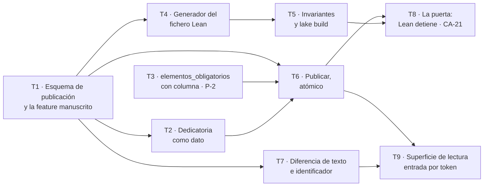

# Fase 4 — Publicar

**Objetivo:** que de diez capítulos integrados salga una **`VersionPublicada` inmutable** con su ficha, su dedicatoria y su cuadro de defectos — y que **una cronología imposible impida publicarla**.

**Cierra `CA-21`**, uno de los cinco criterios que deciden si el sistema existe, y **desbloquea los dos tracks a la vez**: sin publicación no hay qué leer en el frontend ni qué regenerar en la Fase 5.

**Spec:** [`spec.md`](spec.md), aprobada por `maujimenez4`. Requisitos: `RF-PUB-01` a `08`, `RF-FOR-01` a `04`, `RI-08`, `RI-11`. Criterios: **`CA-21`**, `CA-23`, `CA-24`, y **`CA-30`**, que hoy no tiene test.

---

## Lo que esta fase encontró antes de empezar

Tres cosas que no estaban escritas en ningún sitio y que cambian el plan. Se dicen aquí porque **cada una es un requisito que hoy no se puede cumplir**, no un detalle de implementación.

### 1 · La dedicatoria no existe, y su criterio pasaría sin comprobar nada

`RD-05` dice que la `Dedicatoria` **no es una versión de texto**, y `CA-30` que **no aparece** en el manuscrito ensamblado. Medido hoy:

```
dedicatoria en modelos.py ......... 0 columnas
dedicatoria en tests .............. 0 tests
única aparición en el código ...... el nombre de un validador, `dedicatoria_fuera`
```

**Con cero dedicatorias en el sistema, un test de `CA-30` escrito a la ligera pasa sin comprobar nada.** Es el mismo patrón que R-6 de la Fase 1 y que P-2 de `problemas-abiertos.md`: un validador que siempre pasa es peor que no tenerlo, porque ocupa su sitio.

Así que la dedicatoria **entra en esta fase como dato**, y su test se escribe **con una dedicatoria real presente** — que es la única forma de que pueda fallar.

### 2 · `Personaje` y `Lugar` no son tablas, y eso decide qué invariantes de Lean son posibles

`features/escena/modelos.py` lo dice literalmente: «`Personaje` y `Lugar` son tablas que todavía no existen». `evento.participantes` y `evento.testigos` son **listas JSON de cadenas**, no claves foráneas. Y la única `fecha_de_nacimiento` de todo el sistema es la del `destinatario`.

El encargo §5c sugiere cuatro invariantes. **Dos son comprobables hoy y dos no:**

| Invariante sugerido por §5c | ¿Hoy? | Por qué |
| --- | --- | --- |
| Un personaje **no está en dos lugares en el mismo momento** | **Sí** | `cronologia` tiene `participantes`, `lugar` y `tiempo_historia` |
| Un personaje **no aparece después de un evento que lo excluye** | **Sí** | `evento.excluye[]` existe desde la Fase 2 |
| Los eventos respetan el **orden temporal** declarado | **No** | Medido al escribir T4: `tiempo_historia` es `String(120)` —«día 1, mañana»— y **no hay en todo el esquema ninguna magnitud ordenable de tiempo de historia**. Lo único ordenable es `orden_discurso`, que es orden de **discurso**: en un salto atrás el discurso avanza mientras la historia retrocede. Un `ordenTemporal` sobre ese campo comprobaría que el discurso avanza, **que es cierto por construcción** |
| La **edad** concuerda con la **fecha de nacimiento** | **Casi vacío** | Solo el destinatario tiene fecha, y no es un `Personaje` |

**Se eligen los dos primeros**, y el primero no es una elección cómoda: es **literalmente el que `CA-21` exige probar** — «una cronología imposible a propósito —alguien en dos sitios a la vez— **falla y la versión no se publica**».

El de la edad **se escribe igualmente pero se declara condicional**: la regla de dominio 13 dice «cuando ambas existen», y hoy casi nunca existen. Escribirlo sin decir eso sería afirmar una garantía que el dato no sostiene.

### 3 · La feature `manuscrito` no existe

`CLAUDE.md` §5.1 la lista entre las nueve del backend y **no hay carpeta**. Esta fase la crea. No es una feature nueva que haya que preguntar (§3, punto 7): está declarada desde el primer día y le llegó su turno.

---

## Cómo se reparte entre agentes

Cortado **por ficheros que no se pisan**. `problemas-abiertos.md` §P-16 avisa de lo que ha pasado en las cinco olas anteriores —«la juntura vive entre dos features, ninguna tarea puede tocarla, y la cierra el integrador»—, así que aquí **cada juntura tiene dueño escrito**.



| Ola | Tareas | Agentes a la vez |
| --- | --- | --- |
| 1 | **T1** · esquema | **1** — bloquea todo |
| 2 | T2 · T3 · T4 | **3** |
| 3 | T5 · T6 · T7 | **3** |
| 4 | T8 · T9 | **2** |

**Ruta crítica:** `T1 → T4 → T5 → T8`. Cuatro eslabones para nueve tareas.

**T3 no depende de T1** —es `features/obra`, otra feature— pero se pone en la ola 2 porque **T6 la consume**: el cuadro de defectos incluye la cobertura, y la cobertura lee los elementos obligatorios.

### Las cinco reglas del reparto

1. **Un agente por fichero.** El apartado **Ficheros** de cada tarea es la lista cerrada de lo que toca.
2. **`modelos.py` de cada feature tiene un solo dueño por ola.** `manuscrito/modelos.py` es de T1; `obra/modelos.py` es de T3. **Nadie más.**
3. **Las migraciones de Alembic van en cadena y las escribe T1 primero.** Cada `revision --autogenerate` se encadena al *head* del momento: dos a la vez producen dos cabezas y un *merge* a mano. **T3 pide su revisión a T1 o espera a que su migración esté en el árbol.**
4. **Las junturas, con dueño desde aquí** — esto es lo que P-16 pide y llevamos cinco olas sin hacer:

   | Juntura | Dueño |
   | --- | --- |
   | Que el Entrevistador **recoja** la dedicatoria y el repositorio la guarde | **T2**, entera. Toca `obra/` y `manuscrito/` y se declara así a propósito |
   | Que el cuadro de defectos **incluya** la cobertura de personalización | **T6** |
   | Que `PUERTA_G4` **llame** a Lean | **T8**, y es la razón de que T8 exista como tarea y no como paso de T5 |
   | El `__init__.py` de `manuscrito` | **T1** lo crea completo, con todo lo que las demás exportan |

5. **No se commitea en paralelo.** Cada tarea deja su cambio con los tests en verde; los commits los cierra el integrador, uno por tarea y en orden.

---

## Restricciones globales

| Restricción | Valor exacto | Origen |
| --- | --- | --- |
| Publicar es **atómico** | O queda la versión entera con su ficha y su cuadro, o no queda nada | `RF-PUB-08` |
| Publicar **fija** | Los `version_texto_id` se congelan; **no se recalcula por vigencia al leer** | `RF-PUB-01` |
| Inmutabilidad | Publicar una versión **no altera ninguna anterior** | `RF-PUB-02` · `CA-24` |
| Puerta de calidad | **No se publica ningún capítulo que no pasó su puerta**. Un escalado falla con error de dominio | `RF-PUB-03` · regla 14 · `CA-23` |
| Lean | `lake build` **es una puerta**: si falla, **la versión no se publica** y el fallo vuelve al editor | `RF-FOR-03` · `CA-21` |
| Ledger | El ledger es *append-only*; `estado_en_t` y `cronologia` son **vistas derivadas** | `CLAUDE.md` §4.2 |
| Fronteras | Una feature solo importa de `commons/` y del `__init__.py` de otra. `lint-imports` falla la build | `CLAUDE.md` §5.1 |
| Errores | Excepciones de dominio propias; **ningún `HTTPException` dentro de un servicio** | `CLAUDE.md` §6 |
| Pruebas | **Sin red y sin credenciales**; el proveedor es un doble determinista | `RNF-FIA-01` |
| Migraciones | Alembic, y `upgrade → downgrade base → upgrade` **en limpio** | `RD-02` |
| TDD | Rojo → verde → refactor. El test entra **en el mismo commit** | `CLAUDE.md` §3.4 |
| Suite | **670 tests en verde** al empezar. Si tu cambio rompe uno, es tuyo | medido el 2026-09-24 |

---

## Puntos de revisión

Siete entradas que la spec implica y que **ninguna tarea probaría si no se dijeran aquí**. Cada una va asignada a la tarea que posee ese código, **además** de sus propios tests.

| # | Entrada o condición | Qué espera una persona razonable | Tarea |
| --- | --- | --- | --- |
| R-1 | **Publicar dos veces** la misma obra sin cambios en medio | La segunda no crea una versión duplicada, o la crea y **dice que no cambió nada**. Lo que no vale es dos versiones idénticas que el lector no sabe distinguir | 6 |
| R-2 | Una obra con **nueve capítulos integrados y uno escalado** | **No se publica nada**, y el error dice **cuál** falló. `CA-23` lo exige, y el matiz es «cuál»: «no se puede publicar» sin nombre obliga a buscarlo a mano | 6 |
| R-3 | Cronología **vacía**: obra sin eventos | Lean pasa, y **eso está bien** — pero el test tiene que distinguir «pasó porque no hay nada que comprobar» de «pasó porque es coherente». Si no, `CA-21` se cumple con una obra vacía | 5 |
| R-4 | Un evento con **un solo participante** y otro con **veinte** | El generador Lean produce algo válido en los dos casos. `participantes` es JSON libre: nada acota su tamaño | 4 |
| R-5 | `tiempo_historia` con **valores que no ordenan**: «una mañana», «después», «el verano del 98» | Es `String(120)`, no una fecha. El invariante de orden **se apoya en `orden_discurso`**, no en interpretar la cadena — y el plan lo dice en vez de descubrirlo | 5 |
| R-6 | **Dedicatoria vacía, o ausente** | La obra se publica igual: la dedicatoria es opcional. Y el test de `CA-30` **con dedicatoria presente** es el que de verdad comprueba algo | 2 |
| R-7 | `lake build` **no está instalado** en la máquina | La publicación falla con un error que **dice que falta Lean**, no con un `FileNotFoundError` crudo. Es lo que verá quien clone el repositorio | 8 |

---

## Estructura de ficheros

```
src/backend/app/features/manuscrito/          ← NUEVA, la crea T1
  __init__.py        la única puerta · T1
  modelos.py         VersionPublicada · FichaDeLectura · CuadroDeDefectos · Dedicatoria · T1
  repository.py      acceso a datos · T1, ampliado por T6 y T7
  service.py         publicar() · T6
  schemas.py         modelos de entrada y salida · T1
  router.py          RI-08 y RI-11 · T9
  lean/
    generador.py     cronología → fichero Lean · T4
    plantilla.lean   los invariantes · T5
  tests/

src/backend/app/features/obra/
  modelos.py         + columna de elementos obligatorios · T3
  agents.py          + la dedicatoria en la entrevista · T2

src/backend/alembic/versions/
  <rev>_publicacion.py           T1
  <rev>_elementos_obligatorios.py  T3, encadenada a la de T1

lean/                            proyecto Lean con su lakefile · T5
```

---

## Tarea 1 · El esquema de publicación, y la feature que lo aloja

Bloquea a las ocho restantes. No entrega comportamiento: entrega **dónde vive todo lo demás**.

**Ficheros:**
- Crear: `features/manuscrito/{__init__,modelos,repository,schemas}.py` y `tests/`
- Crear: la migración de publicación
- Test: `features/manuscrito/tests/test_esquema.py`

**Interfaces:**
- Produce `VersionPublicada(id, obra_id, ordinal, publicada_en, sucede_a_id, identificador_publico)`.
- Produce `CapituloPublicado(version_id, numero, titulo, version_texto_id, cambiado)` — **la fijación de `RF-PUB-01`**, más los dos campos que el índice de la 002 necesita y que la primera redacción no llevaba: **`titulo`** (`RF-IND-01` pide «los diez capítulos **con su título**») y **`cambiado`** (`RF-IND-02` dice que lo pinta el backend y **no lo calcula el navegador**).
- Produce `FichaDeLectura(version_id, entradas)` donde cada entrada lleva **los capítulos en que aparece** (`RF-PUB-05`, v3.1 de la spec).
- Produce `CuadroDeDefectos(version_id, defectos)` — contra lo que la Fase 5 clasifica preexistente frente a introducido.
- Produce `Dedicatoria(obra_id, texto)`. **Consumida por T2 y servida por T9.** Crearla sin servirla la deja inservible para la portada, que es su único uso.
- Produce el `__init__.py` **completo**, con todo lo que T2, T6, T7 y T9 van a exportar. Es la juntura número cuatro y es suya.

- [ ] **Paso 1: Escribir el test que falla**

```python
# src/backend/app/features/manuscrito/tests/test_esquema.py
import pytest
from sqlalchemy import inspect, text

from app.features.manuscrito import CapituloPublicado, VersionPublicada


async def test_las_tablas_de_publicacion_existen(sesion):
    tablas = set(await sesion.run_sync(lambda s: inspect(s.bind).get_table_names()))
    assert {"version_publicada", "capitulo_publicado", "ficha_de_lectura",
            "cuadro_de_defectos", "dedicatoria"} <= tablas


async def test_el_identificador_publico_no_es_adivinable(sesion, obra):
    """RF-PUB-07. Dos versiones seguidas no pueden tener identificadores contiguos."""
    a = await crear_version(sesion, obra.id, ordinal=1)
    b = await crear_version(sesion, obra.id, ordinal=2)
    assert a.identificador_publico != b.identificador_publico
    assert len(a.identificador_publico) >= 32
    assert not a.identificador_publico.isdigit()


async def test_un_capitulo_publicado_fija_su_version_de_texto(sesion, obra):
    """RF-PUB-01: se fija al publicar, no se recalcula por vigencia al leer."""
    cap = CapituloPublicado(version_id=1, numero=1, version_texto_id=7)
    assert cap.version_texto_id == 7


async def test_no_se_puede_publicar_dos_versiones_con_el_mismo_ordinal(sesion, obra):
    await crear_version(sesion, obra.id, ordinal=1)
    with pytest.raises(IntegrityError):
        await crear_version(sesion, obra.id, ordinal=1)
        await sesion.flush()
```

- [ ] **Paso 2: Ejecutarlo y ver que falla**

`uv run pytest src/backend/app/features/manuscrito -v` → **FAIL**: `No module named 'app.features.manuscrito'`.

- [ ] **Paso 3: Implementar** los modelos y el `__init__.py`.

`identificador_publico` se genera con `secrets.token_urlsafe(32)`. **No es el `id`**: `RF-PUB-07` pide que no sea adivinable, y un entero autoincremental lo es.

- [ ] **Paso 4: La migración**

```bash
uv run alembic revision --autogenerate -m "esquema de publicacion"
uv run alembic upgrade head
uv run alembic downgrade base && uv run alembic upgrade head
```

- [ ] **Paso 5: Verde y las cuatro puertas**

```bash
uv run pytest -q                       # 670 + los nuevos
uv run ruff check . && uv run mypy && uv run lint-imports
```

- [ ] **Paso 6: Dejar el árbol y avisar.** No commitear.

---

## Tarea 2 · La dedicatoria como dato, y el test que sí puede fallar

Cierra **`RD-05`**, **`CA-30`** y **R-6**. Es la juntura número uno y **se declara entera de esta tarea**, aunque toque dos features: recogerla es de `obra` y guardarla es de `manuscrito`, y partirla en dos es exactamente lo que P-16 dice que nos ha costado cinco olas.

**Ficheros:**
- Modificar: `features/obra/agents.py`, `features/obra/schemas.py`
- Usar: `features/manuscrito.Dedicatoria` (de T1, **por su `__init__.py`**)
- Test: `features/manuscrito/tests/test_dedicatoria.py`

- [ ] **Paso 1: Escribir los tests que fallan**

```python
async def test_la_entrevista_recoge_la_dedicatoria(cliente, sesion):
    """Es lo unico del producto que escribe una persona y no el modelo."""
    obra = await cerrar_entrevista_con(cliente, dedicatoria="Para Marta, que nunca se rinde.")
    ded = await leer_dedicatoria(sesion, obra.id)
    assert ded.texto == "Para Marta, que nunca se rinde."


async def test_la_dedicatoria_no_entra_en_el_manuscrito_ensamblado(sesion, obra_publicada):
    """CA-30, y el test SOLO vale con una dedicatoria presente.

    Con cero dedicatorias en el sistema esta asercion pasa sin comprobar nada,
    que es el defecto que R-6 de la Fase 1 existia para impedir.
    """
    await guardar_dedicatoria(sesion, obra_publicada.id, "Para Marta.")
    manuscrito = await ensamblar_manuscrito(sesion, obra_publicada.id)
    assert "Para Marta." not in manuscrito
    assert len(manuscrito) > 0          # y no pasa por estar vacio


async def test_la_dedicatoria_no_cuenta_como_capitulo(sesion, obra_publicada):
    await guardar_dedicatoria(sesion, obra_publicada.id, "Para Marta.")
    version = await publicar(sesion, obra_publicada.id)
    assert len(version.capitulos) == 10


async def test_la_dedicatoria_no_entra_en_la_lista_negra_de_ngramas(sesion, obra):
    await guardar_dedicatoria(sesion, obra.id, "Para Marta.")
    assert "Para Marta." not in await ngramas_vetados(sesion, obra.id)


@pytest.mark.parametrize("vacia", [None, "", "   "])
async def test_sin_dedicatoria_la_obra_se_publica_igual(sesion, obra_publicada, vacia):
    """R-6: es opcional. Un regalo sin dedicatoria sigue siendo un regalo."""
    await guardar_dedicatoria(sesion, obra_publicada.id, vacia)
    assert await publicar(sesion, obra_publicada.id) is not None
```

**Sobre el segundo test y su segunda aserción.** `assert len(manuscrito) > 0` parece de relleno y es lo contrario: sin ella, un `ensamblar_manuscrito` que devuelva `""` pasa el criterio. Es la tercera vez en este proyecto que un criterio se cumple por vacío —R-6 de la Fase 1, P-2 de la cobertura, y este—, y las tres veces el arreglo fue el mismo: **afirmar también que hay algo que mirar**.

- [ ] **Pasos 2-4:** falla, implementar, verde.
- [ ] **Paso 5: Quitar el guardado y ver caer los tests que dependen de él.** Restaurarlo.
- [ ] **Paso 6: Avisar.**

**Corrección de esta tarea, hecha al implementarla.** Los cuatro últimos tests de arriba usan `publicar(...)`, `ensamblar_manuscrito(...)` y `ngramas_vetados(...)`, **y ninguna de las tres existe en T2**: `publicar` la trae **T6**, que en el grafo va *después* de esta tarea, y las otras dos no las trae ninguna tarea de la fase.

**Así que `CA-30` no se cierra aquí: se cierra en T6.** En T2 todavía no hay manuscrito ensamblado contra el que comprobar que la dedicatoria no aparece. Lo que sí se puede afirmar hoy —y es lo que T2 comprueba— es que **la dedicatoria no se está modelando como prosa**: no tiene `run_id`, ni `version_texto_id`, ni `ordinal`, ni `capitulo_id`. Es `RD-05` comprobado **por la forma**, de modo que si alguien la convierte en prosa cae antes de llegar al ensamblado.

Era un error de secuencia del plan, no del árbol: se escribió el test de `CA-30` en la tarea que crea el dato en vez de en la que crea el manuscrito.

---

## Tarea 3 · `elementos_obligatorios` con columna propia · P-2

Cierra **P-2** de `problemas-abiertos.md`, que hoy abre una forma de aprobar de balde.

**Ficheros:**
- Modificar: `features/obra/modelos.py`, `features/obra/repository.py`
- Crear: migración encadenada a la de T1
- Test: `features/obra/tests/test_elementos_obligatorios.py`

**El problema, en una frase:** `BriefEntrada.elementos_obligatorios` se valida al cerrar la entrevista y **no se persiste**; la cobertura los lee del brief en bruto de `entrevista.respuestas`. Funciona por el camino de `CU-01`, y **una obra creada sin entrevista no tiene elementos que cubrir** — entonces `cobertura_de_personalizacion` dice que todo está bien **sin haber comprobado nada**.

- [ ] **Paso 1: Escribir el test que falla**

```python
async def test_los_elementos_obligatorios_viven_en_su_columna(sesion, obra):
    assert obra.elementos_obligatorios == ["el perro Luna", "el verano del 98"]


async def test_una_obra_sin_elementos_no_puede_existir(sesion):
    """P-2: si puede existir, la cobertura aprueba sin comprobar nada."""
    with pytest.raises((IntegrityError, ValueError)):
        await crear_obra(sesion, elementos_obligatorios=[])
        await sesion.flush()


async def test_la_cobertura_lee_la_columna_y_no_el_brief_en_bruto(sesion, obra):
    await borrar_respuestas_de_entrevista(sesion, obra.id)   # el brief en bruto desaparece
    resultado = await cobertura_de_personalizacion(sesion, obra.id)
    assert resultado.elementos_comprobados == 2              # y sigue comprobando
```

**El tercero es el que cierra P-2.** Los dos primeros describen la columna; el tercero comprueba que **la cobertura dejó de depender del brief en bruto**, que es donde estaba el agujero.

- [ ] **Pasos 2-5:** falla, implementar, migración encadenada, verde, y **quitar la restricción para ver caer el segundo test**.
- [ ] **Paso 6: Avisar.**

---

## Tarea 4 · De la cronología al fichero Lean

Cierra **`RF-FOR-01`** y **R-4**.

**Ficheros:** crear `features/manuscrito/lean/generador.py` y su test.

**Interfaces:** produce `generar_lean(sesion, obra_id) -> str`, que **consume T5**.

**Decisión que hay que tomar aquí y no en T5: los nombres se mapean a índices al generar.** `participantes` y `lugar` son cadenas en SQLite, y en Lean las pruebas se cierran con `decide`, que **evalúa por fuerza bruta**. Comparar igualdades de cadenas dentro de Lean es mucho más caro que comparar enteros, así que el generador emite una tabla de nombres y **usa índices en los eventos**. Lo midió quien instaló la herramienta, sobre el proyecto de ejemplo de `formal/lean/`, y es más barato decidirlo antes de escribir el generador que después.

**Lo que hay y ahorra trabajo:** la vista `cronologia` existe desde la Fase 2 —`evento_id`, `obra_id`, `tiempo_historia`, `lugar`, `participantes`, `testigos`, `excluye`, `orden_discurso`— y se deriva del ledger. Es exactamente la entrada que el encargo §5c pide.

- [ ] **Paso 1: Escribir los tests que fallan**

```python
async def test_el_fichero_lean_lleva_los_eventos_con_momento_lugar_y_presentes(sesion, obra):
    lean = await generar_lean(sesion, obra.id)
    assert "def eventos : List Evento := [" in lean
    # Indices, no cadenas: lo decide el parrafo de arriba y lo mide `decide`.
    assert "def momentos : List String := [" in lean
    assert "⟨0, 0, 0⟩" in lean          # evento 0, momento 0, lugar 0


@pytest.mark.parametrize("cuantos", [1, 20])
async def test_produce_lean_valido_con_uno_o_con_veinte_participantes(sesion, obra, cuantos):
    """R-4: participantes es JSON libre y nada acota su tamano."""
    await sembrar_evento(sesion, obra.id, participantes=[f"P{i}" for i in range(cuantos)])
    lean = await generar_lean(sesion, obra.id)
    assert lean.count("⟨") >= 1


async def test_escapa_las_comillas_y_los_acentos(sesion, obra):
    """Los nombres vienen del brief: 'O'Shea' y 'Begona' son legitimos."""
    await sembrar_evento(sesion, obra.id, participantes=["O'Shea"], lugar='el "bar"')
    lean = await generar_lean(sesion, obra.id)
    assert "\\\"" in lean or "'" not in lean.split("participantes")[1][:40]


async def test_una_obra_sin_eventos_produce_una_lista_vacia_y_no_falla(sesion, obra):
    """R-3, primera mitad: distinguir vacio de coherente es de T5."""
    assert "def eventos : List Evento := []" in await generar_lean(sesion, obra.id)
```

- [ ] **Pasos 2-4:** falla, implementar, verde. **Paso 5: Avisar.**

---

## Tarea 5 · Los invariantes, y `lake build`

Cierra **`RF-FOR-02`**, **R-3** y **R-5**.

**Ficheros:** crear `lean/` con su `lakefile`, `features/manuscrito/lean/plantilla.lean`, y el test.

**Aviso sobre el coste, medido y no supuesto.** El proyecto de ejemplo de `formal/lean/` corre `lake build` en **13,1 s en frío y 3,4 s incremental** — pero con listas de **dos** eventos. «Nadie en dos lugares a la vez» es **cuadrático**, y `decide` lo evalúa por fuerza bruta: con los eventos de diez capítulos puede crecer deprisa.

**Si esta tarea lo nota, la salida no es bajar el invariante: es cambiar `decide` por una prueba estructurada.** Midan el tiempo con una cronología real **pronto**, no al final, que es cuando se convierte en un problema de plazo en vez de uno de diseño.

**Los dos invariantes, y por qué estos.** El encargo §5c sugiere cuatro; solo dos muerden con el esquema de hoy, y está razonado arriba en «Lo que esta fase encontró».

1. **Nadie está en dos lugares en el mismo momento.** Es **literalmente** el que `CA-21` exige probar.
2. **Nadie aparece después de un evento que lo excluye.** `evento.excluye[]` existe desde la Fase 2 y hoy no lo comprueba nada.

Y un tercero **declarado condicional**: la edad concuerda con la fecha de nacimiento **cuando ambas existen** (regla de dominio 13). Hoy solo el destinatario tiene fecha y no es un `Personaje`, así que **casi siempre no aplica** — y eso se escribe, en vez de dejar que parezca una garantía.

- [ ] **Paso 1: Escribir el test que falla**

```python
async def test_una_cronologia_coherente_pasa(tmp_path, sesion, obra_coherente):
    assert (await correr_lean(tmp_path, sesion, obra_coherente.id)).ok


async def test_alguien_en_dos_sitios_a_la_vez_falla(tmp_path, sesion, obra):
    """CA-21, primera mitad, con el caso literal del criterio."""
    await sembrar_evento(sesion, obra.id, tiempo="la manana del 3", lugar="la cocina",
                         participantes=["Marta"])
    await sembrar_evento(sesion, obra.id, tiempo="la manana del 3", lugar="la playa",
                         participantes=["Marta"])
    resultado = await correr_lean(tmp_path, sesion, obra.id)
    assert not resultado.ok
    assert "Marta" in resultado.mensaje          # dice QUIEN, no solo que fallo


async def test_aparecer_despues_de_ser_excluido_falla(tmp_path, sesion, obra):
    await sembrar_evento(sesion, obra.id, orden=1, excluye=["Abuela"])
    await sembrar_evento(sesion, obra.id, orden=2, participantes=["Abuela"])
    assert not (await correr_lean(tmp_path, sesion, obra.id)).ok


async def test_una_obra_vacia_pasa_y_el_test_lo_distingue(tmp_path, sesion, obra_vacia):
    """R-3. Sin esto, CA-21 se cumple con una obra sin eventos."""
    resultado = await correr_lean(tmp_path, sesion, obra_vacia.id)
    assert resultado.ok
    assert resultado.eventos_comprobados == 0     # paso por vacio, y se sabe
```

**El cuarto test es el que impide que `CA-21` se cumpla de mentira.** «Lean pasó» sobre una obra sin eventos y «Lean pasó» sobre una cronología coherente son el mismo verde y significan cosas distintas. `eventos_comprobados` es lo que los separa.

**Sobre R-5, y va escrito en el `.lean`:** `tiempo_historia` es `String(120)` —«una mañana», «el verano del 98»—, **no una fecha**. El invariante de orden se apoya en `orden_discurso`, que es un entero, **no en interpretar la cadena**. Quien lea el fichero tiene que saberlo o creerá que ahí hay una comparación temporal que no existe.

- [ ] **Pasos 2-4:** falla, implementar, verde con `lake build` de verdad.
- [ ] **Paso 5: Romper un invariante en el `.lean` y ver caer su test.** Restaurarlo.
- [ ] **Paso 6: Avisar.**

---

## Tarea 6 · Publicar, y que sea atómico

Cierra **`RF-PUB-01`, `02`, `04`, `05`, `08`**, **`CA-24`**, **R-1** y **R-2**. Es la tarea más grande.

**Ficheros:** crear `features/manuscrito/service.py`, ampliar `repository.py`; test junto.

**Juntura de la que es dueña:** que el cuadro de defectos **incluya** la cobertura de personalización, que vive en `features/calidad`. Entra por su `__init__.py`.

- [ ] **Paso 1: Escribir los tests que fallan**

```python
async def test_publicar_fija_los_textos_y_no_los_recalcula(sesion, obra_integrada):
    v1 = await publicar(sesion, obra_integrada.id)
    texto_original = await leer_capitulo(sesion, v1.id, 3)
    await crear_version_de_texto_nueva(sesion, obra_integrada.id, capitulo=3)  # cambia la vigente
    assert await leer_capitulo(sesion, v1.id, 3) == texto_original


async def test_publicar_no_altera_ninguna_anterior(sesion, obra_integrada):
    """CA-24."""
    v1 = await publicar(sesion, obra_integrada.id)
    antes = await instantanea(sesion, v1.id)
    await publicar(sesion, obra_integrada.id)
    assert await instantanea(sesion, v1.id) == antes


async def test_la_ficha_es_reproducible_desde_el_ledger(sesion, obra_integrada):
    """RF-PUB-05, v3.1: cada entrada lleva sus capitulos."""
    v = await publicar(sesion, obra_integrada.id)
    assert await derivar_ficha(sesion, obra_integrada.id) == v.ficha
    assert v.ficha.entradas[0].capitulos == [2, 5]


async def test_publicar_es_atomico(sesion, obra_integrada, monkeypatch):
    """RF-PUB-08: o queda la version entera, o no queda nada."""
    monkeypatch.setattr("app.features.manuscrito.service.guardar_cuadro", explota)
    with pytest.raises(RuntimeError):
        await publicar(sesion, obra_integrada.id)
    assert await contar_versiones(sesion, obra_integrada.id) == 0


async def test_la_dedicatoria_no_entra_en_el_manuscrito_ensamblado(sesion, obra_integrada):
    """CA-30, movido desde T2: aqui SI hay manuscrito contra el que comprobar.

    El `len(manuscrito) > 0` no es relleno: sin el, un ensamblado que devuelva
    cadena vacia cumple el criterio sin comprobar nada.
    """
    await guardar_dedicatoria(sesion, obra_integrada.id, "Para Marta.")
    manuscrito = await ensamblar_manuscrito(sesion, obra_integrada.id)
    assert "Para Marta." not in manuscrito
    assert len(manuscrito) > 0


async def test_publicar_dos_veces_sin_cambios_no_duplica(sesion, obra_integrada):
    """R-1. Dos versiones identicas que el lector no sabe distinguir son un fallo."""
    v1 = await publicar(sesion, obra_integrada.id)
    v2 = await publicar(sesion, obra_integrada.id)
    assert v2.id == v1.id or v2.capitulos_cambiados == []


async def test_con_un_capitulo_escalado_no_se_publica_y_dice_cual(sesion, obra):
    """R-2 y CA-23. El matiz es 'cual': sin nombre hay que buscarlo a mano."""
    await escalar_capitulo(sesion, obra.id, numero=7)
    with pytest.raises(CapituloSinPuerta) as e:
        await publicar(sesion, obra.id)
    assert "7" in str(e.value)
```

- [ ] **Pasos 2-4:** falla, implementar con **una sola transacción**, verde.
- [ ] **Paso 5: Quitar la transacción y ver caer el test de atomicidad.** Restaurarla.
- [ ] **Paso 6: Avisar.**

---

## Tarea 7 · Diferencia de texto e identificador público

Cierra **`RF-PUB-06`** y **`RF-PUB-07`**.

**Ficheros:** ampliar `features/manuscrito/repository.py` —**coordinado con T6, que también lo amplía**: T7 añade funciones nuevas al final y **no toca las de T6**—; test propio.

- [ ] **Paso 1: Escribir los tests que fallan**

```python
async def test_los_capitulos_cambiados_se_calculan_por_diferencia_de_texto(sesion, obra):
    v1 = await publicar(sesion, obra.id)
    await regenerar_capitulo(sesion, obra.id, 4)
    v2 = await publicar(sesion, obra.id)
    assert v2.capitulos_cambiados == [4]
    assert v2.sucede_a_id == v1.id


async def test_un_capitulo_reescrito_con_el_mismo_texto_no_cuenta_como_cambiado(sesion, obra):
    """Diferencia de TEXTO, no de identificador de version."""
    v1 = await publicar(sesion, obra.id)
    await crear_version_de_texto_identica(sesion, obra.id, capitulo=4)
    v2 = await publicar(sesion, obra.id)
    assert v2.capitulos_cambiados == []


async def test_el_identificador_publico_no_deja_adivinar_el_siguiente(sesion, obra):
    ids = [(await publicar(sesion, obra.id)).identificador_publico for _ in range(5)]
    assert len(set(ids)) == 5
    assert all(len(i) >= 32 for i in ids)
```

**El segundo es el que da sentido a `RF-PUB-06`.** Si «cambiado» significara «tiene otra `version_texto_id`», una reescritura que produce el mismo texto marcaría el capítulo — y el lector iría a leer un cambio que no existe.

- [ ] **Pasos 2-4 y 5: Avisar.**

---

## Tarea 8 · La puerta: Lean detiene la publicación · `CA-21`

**Es la tarea que cierra el criterio**, y existe separada de T5 por una razón: T5 hace que Lean **diga** que algo está mal; T8 hace que eso **impida publicar**. Son cosas distintas y la segunda es la que el encargo exige.

**Ficheros:** modificar `features/manuscrito/service.py` —**después de T6, no a la vez**— y `features/calidad/` para enganchar `PUERTA_G4`. **Es la juntura número tres y es suya.**

- [ ] **Paso 1: Escribir los tests que fallan**

```python
async def test_si_lean_falla_la_version_no_se_publica(sesion, obra_incoherente):
    """CA-21 entero: no basta con que Lean lo detecte."""
    with pytest.raises(CronologiaIncoherente):
        await publicar(sesion, obra_incoherente.id)
    assert await contar_versiones(sesion, obra_incoherente.id) == 0


async def test_el_fallo_vuelve_al_editor_con_el_evento_concreto(sesion, obra_incoherente):
    """RF-FOR-03: 'el fallo vuelve al editor como feedback'."""
    with pytest.raises(CronologiaIncoherente) as e:
        await publicar(sesion, obra_incoherente.id)
    assert "Marta" in str(e.value) and "la cocina" in str(e.value)


async def test_sin_lake_el_error_dice_que_falta_lean(sesion, obra, monkeypatch):
    """R-7. Lo primero que vera quien clone el repositorio."""
    monkeypatch.setenv("PATH", "")
    with pytest.raises(HerramientaNoDisponible, match="lake"):
        await publicar(sesion, obra.id)
```

**El tercero importa más de lo que parece.** Un `FileNotFoundError: 'lake'` crudo en mitad de una publicación no le dice a nadie que le falta instalar Lean 4, y ese «nadie» es quien clona el repositorio para corregir el examen.

- [ ] **Pasos 2-4:** falla, implementar, verde.
- [ ] **Paso 5: Quitar la llamada a Lean de `PUERTA_G4` y ver caer el primer test.** Restaurarla.
- [ ] **Paso 6: Avisar.**

---

## Tarea 9 · La superficie de lectura, entrada por token

Cierra **`RI-08`** y **`RI-11`**, y **desbloquea la Fase 1 del frontend**, que hoy no puede generar su cliente: el OpenAPI publica **ocho rutas, todas de generación, y ni un esquema de lectura**.

**Ficheros:** crear `features/manuscrito/router.py`, montarlo en `main.py`; test propio.

### Cuatro cosas que la primera redacción de esta tarea no resolvía

Las encontró la sesión que mantiene el plan del frontend, cruzándolo contra lo que aquí se prometía. **La primera es una contradicción entre las dos specs**, no un olvido, y decide la forma de las rutas.

**1 · La entrada es el token, no el `obra_id`.** La spec 002 dice, literal: «Ninguna ruta lleva el identificador de la obra en claro… el `token` es **lo único que protege la lectura**: quien lo tiene, entra.» El frontend abre `/l/{token}` y **no conoce `obra_id` ni el ordinal**.

La primera redacción ponía rutas `/obras/{obra_id}/versiones/...` y devolvía `identificador_publico` **en el cuerpo**. Eso es al revés: así el identificador no adivinable protegería **lo que se devuelve**, y la 002 lo necesita protegiendo **lo que se pide**.

**Decisión: la superficie de lectura se indexa por el identificador público**, que pasa a ser el `token`. `RF-PUB-07` deja de ser un adorno del cuerpo y se convierte en la llave. Las rutas de publicación —que usa el Autor— siguen por `obra_id`; las de lectura, no.

**2 · Ninguna ruta devolvía prosa.** `CapituloPublicado` es una **fijación**: apunta a la versión de texto, no la lleva.

**Decisión: ruta por capítulo, no la novela entera embebida.** Embeber los diez en `VersionPublicada` son unas doce mil palabras cargadas al abrir la **portada**, donde no se lee ni una. La lectura es capítulo a capítulo y la petición también.

**3 · Faltaban el título y la marca de cambiado**, que el índice necesita y `CapituloPublicado` no llevaba. Resuelto en T1. Si no sale en el esquema, **para el cliente generado no existe**.

**4 · La dedicatoria se creaba y no se servía.** T2 la crea; aquí se sirve con la portada. Es un campo, no una tarea.

- [ ] **Paso 1: Escribir los tests que fallan**

```python
def test_la_lectura_se_indexa_por_token_y_no_por_obra_id(cliente, version):
    """La 002: «ninguna ruta lleva el identificador de la obra en claro»."""
    rutas = cliente.get("/openapi.json").json()["paths"]
    de_lectura = [r for r in rutas if r.startswith("/lectura/")]
    assert len(de_lectura) == 5
    assert not any("obra_id" in r for r in de_lectura)


def test_las_cinco_rutas_de_lectura_estan_publicadas(cliente):
    rutas = cliente.get("/openapi.json").json()["paths"]
    assert {"/lectura/{token}",
            "/lectura/{token}/capitulos/{numero}",
            "/lectura/{token}/ficha",
            "/lectura/{token}/pdf",
            "/lectura/{token}/versiones"} <= set(rutas)


def test_el_openapi_publica_los_esquemas_que_el_frontend_deriva(cliente):
    """Sin esto, `pnpm gen:api` de la 002 produce un schema.d.ts sin un solo tipo util."""
    esquemas = cliente.get("/openapi.json").json()["components"]["schemas"]
    assert {"VersionPublicada", "CapituloPublicado", "FichaDeLectura"} <= set(esquemas)


def test_la_portada_trae_la_dedicatoria_y_los_capitulos_con_titulo(cliente, version):
    cuerpo = cliente.get(f"/lectura/{version.identificador_publico}").json()
    assert cuerpo["dedicatoria"] == "Para Marta, que nunca se rinde."
    assert len(cuerpo["capitulos"]) == 10
    assert cuerpo["capitulos"][0]["titulo"]
    assert "cambiado" in cuerpo["capitulos"][0]


def test_un_capitulo_devuelve_su_prosa(cliente, version):
    cuerpo = cliente.get(f"/lectura/{version.identificador_publico}/capitulos/3").json()
    assert len(cuerpo["texto"]) > 500
    assert cuerpo["numero"] == 3


def test_la_portada_no_trae_la_prosa_de_los_diez(cliente, version):
    """Doce mil palabras al abrir la portada, donde no se lee ni una."""
    cuerpo = cliente.get(f"/lectura/{version.identificador_publico}").json()
    assert all("texto" not in c for c in cuerpo["capitulos"])


def test_un_token_que_no_existe_da_404_y_no_dice_por_que(cliente):
    r = cliente.get("/lectura/noexiste")
    assert r.status_code == 404
    assert "obra" not in r.text.lower()      # ni filtra que exista, ni cual


def test_leer_no_expone_el_modelo_de_base_de_datos(cliente, version):
    cuerpo = cliente.get(f"/lectura/{version.identificador_publico}").json()
    assert "id" not in cuerpo and "obra_id" not in cuerpo
```

**Sobre el penúltimo.** Un token inválido es el caso más probable de todos —el enlace se comparte por mensajería y se corta— y la respuesta **no puede decir por qué** falló: si distinguiera «esa obra no existe» de «ese token no vale», filtraría la existencia de obras ajenas, que es lo único que el token protege.

- [ ] **Paso 2: Ejecutarlos y ver que fallan** → **8 FAIL**.
- [ ] **Paso 3: Implementar** el router y montarlo en `main.py`. Los modelos de salida viven en `schemas.py`: **nunca se expone el modelo de base de datos** (`CLAUDE.md` §6).
- [ ] **Paso 4: Verde**, y comprobar que `pnpm gen:api` de la 002 **produce los tres tipos**. Es el contrato entre las dos specs y es lo único que lo comprueba.
- [ ] **Paso 5: Avisar.**

---

## Tarea 10 · El PDF

> **Firmada el 2026-09-24 por `maujimenez4`**, que autorizo expresamente el commit de la firma. Incluye la dependencia `playwright` (opcion A del spike) y las tres TTF de Literata con su `OFL.txt`: firmar la tarea es aceptar esos ficheros.

Cierra la ruta **`/lectura/{token}/pdf`**, que hoy existe en el OpenAPI y responde **501**, y la parte de **`RI-11`** que es el PDF. Y cumple lo que pide el encargo §2 para el PDF: **una portada con dedicatoria, un índice navegable y una página inicial de «novedades»** con los capítulos que cambiaron y **enlaces internos** a cada uno.

**Ficheros:**
- Crear `features/manuscrito/pdf.py`: la composición del HTML, que es una función pura, y la impresora.
- Crear `features/manuscrito/impresion/impresion.css` y `features/manuscrito/impresion/fuentes/Literata-{Regular,Italic,SemiBold}.ttf`, con su `OFL.txt`.
- Modificar `features/manuscrito/router.py`: la ruta deja de dar 501.
- Test nuevo `features/manuscrito/tests/test_pdf.py`.
- `pyproject.toml` y `uv.lock`: **`playwright`**.
- `CLAUDE.md` §14: el comando que instala el navegador.

### Lo que el spike midió antes de escribir esto

Chrome headless y 12.503 palabras de relleno generadas, en 10 capítulos. Todo desechable, nada en el repositorio.

| Pregunta | Medido | Qué decide |
| --- | --- | --- |
| ¿Sin red? | **Sí**, con el HTML en local y la red cortada | CA-4 se sostiene con la impresora **inyectada**. La real también corre sin red si el HTML es autocontenido |
| ¿Cuánto tarda? | **1,2–2,4 s** por novela (61 págs. A5). Con el triple de texto, entre 1,9 y 2,6 s | **Respuesta HTTP síncrona**, no trabajo en segundo plano. El tiempo es casi todo arranque del navegador, no cantidad de texto |
| ¿Sobrevive la tipografía? | **No, tal como está hoy**: `estilos.css` carga Literata desde Google y sin red sale **Georgia**. Con las TTF en local, las tres variantes quedan incrustadas | Las fuentes viajan **dentro** del HTML, como `data:` en base64 |
| ¿Reutilizar la lectura? | La página React tal cual imprime en Carta, con los capítulos seguidos y la dedicatoria pegada al capítulo 1 | **Mismo marcado y mismos tokens, plantilla de backend.** Imprimir la página React obligaría a servir el frontend, lo que rompe CA-4 y hace que el backend dependa del frontend |
| ¿Anclas internas? | **Sí**: `/Link` con `/Dest /capitulo-N`, 0 `/URI` | La página de novedades se hace con `href="#capitulo-N"` y nada más |
| ¿Accesible? | **Sale etiquetado sin pedirlo**: `/MarkInfo Marked true`, `/StructTreeRoot`, `/Lang (es)` | Es un argumento a favor de Chromium frente a las alternativas descartadas: la spec 002 exige accesibilidad, y un PDF sin estructura no lo lee un lector de pantalla |

*Una medida engañó y se dice:* la primera variante «sin red» dio Literata porque reutilizaba la caché del perfil de la ejecución con red. **Toda medida de fuente se hace con perfil limpio.** El test de integración de abajo lo garantiza cortando la red dentro del propio navegador, no fiándose del entorno.

### Cinco decisiones, con su motivo

**1 · La impresora es una dependencia inyectada.** `obtener_impresora` va por `Depends()`, igual que el cliente de modelo (`CLAUDE.md` §6). La suite usa un doble que devuelve el HTML que recibió. Así se prueba **qué** se imprime sin arrancar Chromium, y CA-4 sigue pasando sin red y sin navegador.

**2 · El HTML es autocontenido y el navegador no tiene red.** Las fuentes van en base64, `java_script_enabled=False`, y un `page.route("**/*")` aborta cualquier petición que no sea `data:`. Hay dos motivos, y el segundo es el que decide:
- que el resultado no dependa de la red;
- que **la prosa y la dedicatoria nunca salgan de la máquina** (`CLAUDE.md` §4.3). Un `@import` olvidado en la hoja lo incumpliría sin que ningún test lo viera.

**3 · Toda cadena se escapa.** La prosa, los títulos y la dedicatoria pasan por `html.escape`. La prosa la escribió un modelo y la dedicatoria viene del comprador, que es texto no confiable (`CLAUDE.md` §11). Sin escapar, un `<` en la prosa rompe la maqueta, y un `` sería una petición de red a un tercero. Con el JavaScript desactivado no se ejecutaría nada, pero la petición sí se haría.

**4 · Los tokens se duplican y un test vigila que no diverjan.** `impresion.css` repite la paleta, la medida y la escala de `src/frontend/src/app/estilos.css`.

El **código** no lee ficheros del frontend: se despliegan por separado, y `componer_html` tiene que funcionar sin el frontend delante. **El test sí los lee**, y esa asimetría es el diseño. La duplicación es deliberada (`CLAUDE.md` §5.1, regla 4); lo que no puede ser deliberado es que diverja en silencio.

**Lo que cuesta, y se asume a sabiendas:** la suite del backend falla si no está el árbol del frontend. En este monorepo siempre está. Si falta el fichero, **el test revienta y no se salta**: un `pytest.skip` lo volvería verde justo por no encontrar lo que tenía que comparar.

**5 · Si no hay navegador, 503 con motivo, no 500.** Mismo patrón que `sqlite-vec` (`CLAUDE.md` §4.2): se degrada con un aviso. `ImpresoraNoDisponible` es una excepción de dominio y la traduce el handler central de `commons/errors/`, no un `HTTPException` dentro del servicio.

### Las dos reglas de dominio que esta tarea toca

- **Regla 14: el PDF sale de la versión publicada, nunca del texto vigente.** Se compone con `texto_publicado(sesion, version.id, numero)`, lo mismo que lee la ruta del capítulo. Un PDF armado con el texto vigente podría llevar un capítulo que no pasó ninguna puerta.
- **Regla 15: la dedicatoria no es un capítulo.** Va en su propia página, con `.dedicatoria`, fuera de cualquier `<section class="capitulo">`. Hay exactamente diez secciones de capítulo.

- [ ] **Paso 0: La dependencia** (autorizada por `maujimenez4` el 2026-09-24, opción A del spike)

```bash
uv add playwright
uv run playwright install chromium
```

Añadir la segunda línea a `CLAUDE.md` §14, en el mismo commit.

- [ ] **Paso 1: Escribir los tests que fallan**

```python
"""El PDF: la tirada publicada, impresa, sin red.

`RI-11`, el encargo §2 para PDF y las reglas de dominio 14 y 15.

**Casi toda la suite no arranca Chromium.** La impresora se inyecta y el doble
devuelve el HTML que recibio: lo que se prueba es **que** se imprime. El unico
test que imprime de verdad esta marcado y se salta si no hay navegador; aun
asi corre sin red, porque es la red lo que comprueba.
"""

import re
import zlib
from pathlib import Path

import pytest
from fastapi.testclient import TestClient
from sqlalchemy import text
from sqlalchemy.ext.asyncio import AsyncSession

from app.features.manuscrito import modelos
from app.features.manuscrito.pdf import (
    ImpresoraNoDisponible,
    componer_html,
    obtener_impresora,
)
from app.features.manuscrito.tests.test_lectura import CAPITULOS, DEDICATORIA, version  # noqa: F401

REPO = Path(__file__).resolve().parents[6]
ESTILOS_LECTURA = REPO / "src/frontend/src/app/estilos.css"
ESTILOS_PDF = Path(__file__).resolve().parents[1] / "impresion/impresion.css"


class DobleDeImpresora:
    """Guarda el HTML que le llega y devuelve un PDF de mentira."""

    def __init__(self) -> None:
        self.html: str | None = None

    async def a_pdf(self, html: str) -> bytes:
        self.html = html
        return b"%PDF-1.7 doble"


@pytest.fixture
def impresora(cliente: TestClient) -> DobleDeImpresora:
    doble = DobleDeImpresora()
    cliente.app.dependency_overrides[obtener_impresora] = lambda: doble
    return doble


def _pdf(cliente: TestClient, version: modelos.VersionPublicada) -> str:
    return f"/lectura/{version.identificador_publico}/pdf"


# --- La ruta ------------------------------------------------------------


async def test_la_ruta_devuelve_un_pdf_para_descargar(
    cliente: TestClient, version: modelos.VersionPublicada, impresora: DobleDeImpresora
) -> None:
    respuesta = cliente.get(_pdf(cliente, version))

    assert respuesta.status_code == 200
    assert respuesta.headers["content-type"] == "application/pdf"
    assert respuesta.headers["content-disposition"].startswith("attachment;")
    assert respuesta.content.startswith(b"%PDF")


def test_un_token_que_no_existe_da_404_tambien_en_el_pdf(
    cliente: TestClient, impresora: DobleDeImpresora
) -> None:
    respuesta = cliente.get("/lectura/noexiste/pdf")

    assert respuesta.status_code == 404
    assert impresora.html is None        # ni siquiera se compuso


async def test_sin_navegador_es_503_con_motivo_y_no_500(
    cliente: TestClient, version: modelos.VersionPublicada
) -> None:
    class SinNavegador:
        async def a_pdf(self, html: str) -> bytes:
            raise ImpresoraNoDisponible("chromium no esta instalado")

    cliente.app.dependency_overrides[obtener_impresora] = lambda: SinNavegador()

    respuesta = cliente.get(_pdf(cliente, version))

    assert respuesta.status_code == 503
    assert "pdf" in respuesta.json()["detail"].lower()


# --- Reglas 14 y 15 -----------------------------------------------------


async def test_el_pdf_lleva_el_texto_fijado_y_no_el_vigente(
    cliente: TestClient,
    sesion: AsyncSession,
    version: modelos.VersionPublicada,
    impresora: DobleDeImpresora,
) -> None:
    """Regla 14. Se publica, se reescribe el capitulo 3 y se imprime: tiene que
    salir **el viejo**. Si saliera el nuevo, el PDF llevaria un capitulo que no
    paso por ninguna puerta."""
    fijada = (
        await sesion.execute(
            text(
                "SELECT v.id AS id, v.escena_id AS escena_id FROM capitulo_publicado AS c "
                "JOIN version_texto AS v ON v.id = c.version_texto_id "
                "WHERE c.version_id = :v AND c.numero = 3"
            ),
            {"v": version.id},
        )
    ).one()
    await sesion.execute(text("UPDATE version_texto SET vigente = 0 WHERE id = :id"), {"id": fijada.id})
    await sesion.execute(
        text(
            "INSERT INTO version_texto (escena_id, numero, texto, vigente, run_id) "
            "VALUES (:e, 2, 'TEXTO QUE NUNCA PASO SU PUERTA', 1, 'run-nuevo')"
        ),
        {"e": fijada.escena_id},
    )
    await sesion.commit()

    cliente.get(_pdf(cliente, version))

    assert impresora.html is not None
    assert "TEXTO QUE NUNCA PASO SU PUERTA" not in impresora.html
    assert "Capitulo 3." in impresora.html


async def test_la_dedicatoria_va_en_su_pagina_y_no_como_capitulo(
    cliente: TestClient, version: modelos.VersionPublicada, impresora: DobleDeImpresora
) -> None:
    """Regla 15. Diez secciones de capitulo, ni una mas, y la dedicatoria fuera
    de todas."""
    cliente.get(_pdf(cliente, version))
    html = impresora.html or ""

    assert len(re.findall(r'<section class="capitulo"', html)) == CAPITULOS
    assert html.count('class="dedicatoria"') == 1
    antes_del_primer_capitulo = html.split('<section class="capitulo"', 1)[0]
    assert "class=\"dedicatoria\"" in antes_del_primer_capitulo


# --- El encargo §2 ------------------------------------------------------


def test_el_indice_enlaza_a_los_diez_capitulos() -> None:
    html = componer_html(
        dedicatoria=None,
        capitulos=[(n, f"Titulo {n}", "texto", False) for n in range(1, 11)],
    )
    for n in range(1, 11):
        assert f'id="capitulo-{n}"' in html
        assert f'href="#capitulo-{n}"' in html


def test_con_capitulos_cambiados_abre_una_pagina_de_novedades_que_enlaza_a_ellos() -> None:
    """El encargo §2, literal: una pagina inicial de «novedades» con los
    capitulos modificados y enlaces internos a cada uno."""
    html = componer_html(
        dedicatoria=None,
        capitulos=[(n, f"Titulo {n}", "texto", n in (3, 7)) for n in range(1, 11)],
    )
    novedades = html.split('class="novedades"', 1)[1].split("</section>", 1)[0]

    assert 'href="#capitulo-3"' in novedades
    assert 'href="#capitulo-7"' in novedades
    assert 'href="#capitulo-4"' not in novedades
    assert html.index('class="novedades"') < html.index('<section class="capitulo"')


def test_la_primera_tirada_no_trae_pagina_de_novedades() -> None:
    """Sin anterior no hay novedades. Una pagina vacia que dice «novedades»
    seria una afirmacion falsa en la primera hoja del regalo."""
    html = componer_html(
        dedicatoria=None,
        capitulos=[(n, None, "texto", False) for n in range(1, 11)],
    )
    assert 'class="novedades"' not in html


# --- Lo que entra en el HTML --------------------------------------------


def test_toda_cadena_se_escapa() -> None:
    """La prosa la escribio un modelo y la dedicatoria el comprador. Ninguna de
    las dos puede meter una etiqueta, y menos una que pida algo a la red."""
    html = componer_html(
        dedicatoria='',
        capitulos=[(1, "<b>t</b>", "a < b y <script>alert(1)</script>", False)],
    )
    assert "" not in html
    assert "<b>t</b>" not in html
    assert "&lt;script&gt;" in html


def test_el_html_no_pide_nada_fuera_de_si_mismo() -> None:
    """`CLAUDE.md` §4.3. Ni una URL externa: ni Google Fonts ni nada."""
    html = componer_html(dedicatoria="d", capitulos=[(1, "t", "texto", False)])

    assert "@import" not in html
    assert not re.search(r"(src|href)=[\"']?https?://", html)
    assert not re.search(r"url\(\s*[\"']?https?://", html)
    assert "font/ttf;base64," in html     # la fuente viaja dentro


def test_los_tokens_del_pdf_son_los_de_la_lectura() -> None:
    """La regla 4 de §5.1, «se duplica primero», con alguien que vigila la copia.

    Lee el frontend a proposito, y si el fichero no esta, **revienta**: un skip
    aqui volveria verde el test por no encontrar lo que tenia que comparar."""
    def tokens(css: str) -> dict[str, str]:
        return dict(re.findall(r"(--[a-z-]+):\s*([^;]+);", css))

    lectura, pdf = tokens(ESTILOS_LECTURA.read_text("utf-8")), tokens(ESTILOS_PDF.read_text("utf-8"))
    for nombre in ("--papel", "--tinta", "--acento", "--tinta-suave"):
        assert pdf[nombre] == lectura[nombre], nombre


# --- La impresora real --------------------------------------------------


@pytest.mark.chromium
async def test_chromium_imprime_con_literata_y_sin_una_sola_peticion() -> None:
    """El unico test que arranca el navegador. Se salta si no esta instalado, y
    aun asi no toca la red: comprueba justo eso."""
    from app.features.manuscrito.pdf import ImpresoraChromium

    impresora = ImpresoraChromium()
    html = componer_html(
        dedicatoria="Dedicatoria de prueba",
        capitulos=[(n, f"Titulo {n}", "Texto de prueba. " * 300, n == 2) for n in range(1, 11)],
    )

    pdf = await impresora.a_pdf(html)

    assert pdf.startswith(b"%PDF")
    assert impresora.peticiones_bloqueadas == 0
    contenido = pdf + b"".join(
        zlib.decompress(m.group(1).rstrip(b"\r\n"))
        for m in re.finditer(rb"stream\r?\n(.*?)endstream", pdf, re.S)
        if m.group(1)[:2] == b"x\x9c"
    )
    fuentes = {f.split(b"+")[-1] for f in re.findall(rb"/BaseFont\s*/([^\s/<>\[\]]+)", contenido)}
    assert {b"Literata-Regular", b"Literata-Italic"} <= fuentes
    assert b"Georgia" not in b"".join(fuentes)
    assert re.search(rb"/Dest\s*/capitulo-2", contenido)      # la novedad enlaza
```

**Sobre `peticiones_bloqueadas == 0`.** Cuenta las peticiones que el `route` tuvo que abortar. Si fuera 1, el HTML habría intentado salir, y el test lo detecta aunque el PDF salga bien. Es la diferencia entre «no salió» y «no intentó salir».

**Sobre el test de tokens.** Sale **en rojo** mientras `impresion.css` no exista, y ese es el rojo que se quiere ver. Si `estilos.css` cambia a Literata autoalojada, este test no se ve afectado: compara colores, no la carga de la fuente.

- [ ] **Paso 2: Ejecutarlos y ver que fallan**

```bash
uv run pytest src/backend/app/features/manuscrito/tests/test_pdf.py -v
```

Esperado: **error de colección**, porque `app.features.manuscrito.pdf` no existe. Con el módulo creado con los nombres y sin cuerpo, de los 12 tests salen **10 FAIL, 1 PASS y el de Chromium en FAIL**. El navegador se instala en el paso 0 precisamente para verlo fallar a él también.

**El PASS se declara, porque es un test que nunca se vio fallar.** `test_un_token_que_no_existe_da_404_tambien_en_el_pdf` ya pasa hoy: la ruta del 501 comprueba el token antes de responder. Se queda como guardia de regresión, para que la implementación no componga el PDF antes de validar el token. No cuenta como prueba de nada nuevo.

- [ ] **Paso 3: Implementar la composición.** `componer_html(dedicatoria, capitulos)`, función pura, sin sesión ni red. `capitulos` es una lista de `(numero, titulo, texto, cambiado)`. Estructura: la portada con la dedicatoria, después la página de novedades si hay algún capítulo cambiado, después el índice, y después las diez `<section class="capitulo" id="capitulo-N">`. `@page { size: A5 }`, un salto antes de cada capítulo y `orphans`/`widows` a 2, que son los valores que midió el spike. Se crea `impresion.css`. Pasan **7 de 12**: los seis de composición, HTML y tokens, más el guardia del 404.

- [ ] **Paso 4: Implementar la impresora y la ruta.** `ImpresoraChromium.a_pdf` con `playwright.async_api`, más `set_content`, `java_script_enabled=False`, el `route` que aborta y cuenta, y `page.pdf(prefer_css_page_size=True)`. Si Playwright no puede lanzar el navegador, lanza `ImpresoraNoDisponible`. En la ruta se sustituye el 501 por la composición desde `texto_publicado` y se devuelve `Response(media_type="application/pdf")`. **No se escribe ni la prosa ni el HTML en ningún log.**

- [ ] **Paso 5: Verde** en todo el fichero y en la suite completa **sin red**, además de `ruff`, `mypy` sobre `pdf.py` y `lint-imports`. Registrar el marcador `chromium` en `pyproject.toml`.

- [ ] **Paso 6: Abrir el PDF a ojo una vez**, con texto de los dobles: portada, novedades, índice y un capítulo. **El PDF no se commitea** (`CLAUDE.md` §16, última casilla).

- [ ] **Paso 7: Avisar.**

### Lo que esta tarea NO hace

- **No cambia `estilos.css`.** El frontend también carga Literata desde Google, y eso es una fuga hacia un tercero cada vez que un destinatario abre su novela (`CLAUDE.md` §4.3). Pero es un cambio del plan 1 del frontend, no de este, y va aparte.
- **No guarda el PDF.** Se genera en cada petición: 2 s no justifican una columna nueva ni un cambio de esquema (§3.7). Si algún día se guarda, va por versión publicada, porque la versión es inmutable.
- **No resuelve la diferencia de ruta con `RI-11`.** La spec promete `…/versiones/{v}/pdf` y el código expone `/lectura/{token}/pdf`. Lo lleva Ezequiel con quien escribió la T9.

## Lo que esta fase deja cerrado

| Criterio | Qué demuestra |
| --- | --- |
| **`CA-21`** | `lake build` pasa sobre la cronología generada, y **una cronología imposible impide publicar** |
| `CA-23` | Con un capítulo escalado **no se crea ninguna versión**, y se dice cuál falló |
| `CA-24` | Publicar y regenerar: la versión antigua devuelve **el mismo texto**, y la ficha reconstruida coincide |
| **`CA-30`** | La dedicatoria existe, y **no aparece** en el manuscrito ni cuenta como capítulo |
| `P-2` | La cobertura lee una columna y **deja de aprobar sin comprobar nada** |

**Y desbloquea:** la Fase 5 del backend y la Fase 1 del frontend, que son las dos únicas cosas que esperaban a esta.

## Lo que NO hace

- **No atiende peticiones del lector.** Es la Fase 5, y con ella vencen P-6, P-7 y P-8.
- **No emite *scores* a Langfuse.** Fase 6.
- **No genera el PDF.** Necesita la corrida real, y esa depende de **P-1**, que se está arreglando aparte.
- **No crea `Personaje` ni `Lugar`.** Se dice porque limita los invariantes de Lean, y está razonado arriba.

---

## Desviaciones

*Se anotan **antes** de seguir, no después (`CLAUDE.md` §3.4).*

| Fecha | Paso | Qué se desvió y por qué |
| --- | --- | --- |
| 2026-09-24 | T5, antes de empezar | **`lake` ya está instalado**: Lean 4.34.0 vía elan, con `formal/lean/` como proyecto de ejemplo que compila y cuyos invariantes **fallan donde deben**. La desviación es a favor: esta tarea parte de un proyecto que funciona en vez de de cero |

**Se esperan al menos dos.** El formato exacto del fichero `.lean` de T4 depende de lo que T5 decida que necesitan los invariantes: es el par de tareas más acoplado del plan y el primero que va a anotar algo aquí.
