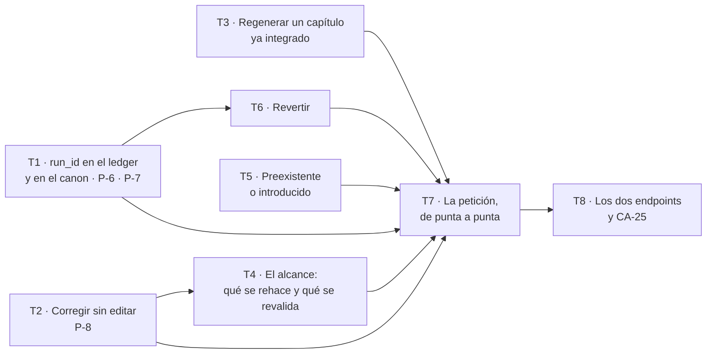

# Fase 5 — Atender al lector

**Objetivo:** que una petición de cambio sobre un hecho **regenere solo los capítulos que lo usan**, y que si esa regeneración introduce un defecto nuevo **no se publique** — mientras que uno preexistente no lo impide. Cierra **`CA-25`**: el quinto de los cinco criterios que, según la spec, deciden si el sistema existe.

**Enfoque:** la Fase 4 dejó una `VersionPublicada` inmutable con su cuadro de defectos guardado. Esta fase la pone a prueba por el único sitio por el que se puede romper: **escribiendo encima de una novela ya entregada**. Todo lo que hasta hoy se escribía una vez por escena se escribe dos, y las tres deudas que `problemas-abiertos.md` fecha aquí son exactamente las tres cosas que ese «dos» rompe.

**Spec:** [`spec.md`](spec.md), `aprobada`.

---

## Aviso primero: esta fase se cuelga entera de la Fase 4, que está en `borrador`

`CLAUDE.md` §3.3 bis dice que un plan **se escribe cuando le toca**, porque «el plan que se escribe con el código delante es mejor que el que se escribe adivinando». Aquí no hay código delante: hay **otro plan**, también sin firmar.

Hoy, en el árbol de trabajo:

- **`specs/001-backend-v1/plan-4-publicar.md` existe y está en `borrador`**, sin firmar. Este plan se escribe **contra él**, que es lo mejor que se puede hacer y no es lo mismo que escribirlo contra código.
- **`src/backend/app/features/manuscrito/` no existe**, ni `auditoria/`. Las features montadas en `main.py` son cuatro: `obra`, `outline`, `contexto`, `escritura`.
- **No hay tabla de defectos.** `calidad/schemas.py` lo dice en su primera línea: «*No hay tabla `defecto` en esta fase*», y `Defecto` es un modelo de Pydantic sin persistencia.

**Consecuencia operativa: si la Fase 4 cambia al implementarse, este plan se vuelve a leer antes de aprobarse.** La puerta Plan de §3.2 no la abre un agente, y el sitio donde se detecta una firma cambiada es la revisión, no la integración.

### El contrato que este plan consume de la Fase 4

Tomado de `plan-4-publicar.md`, tarea a tarea, **con sus nombres literales**. Donde el nombre de allí no coincide con el vocabulario de `definitions.md`, manda el plan-4: es su fichero.

| Pieza | De dónde sale | Forma exacta que este plan usa | Usado por |
| --- | --- | --- | --- |
| `VersionPublicada` | plan-4 T1, `manuscrito/modelos.py` | `(id, obra_id, ordinal, publicada_en, sucede_a_id, identificador_publico)` | T1, T6, T7 |
| `CapituloPublicado` | plan-4 T1 | `(version_id, numero, titulo, version_texto_id, cambiado)` — **fija el texto**, RF-PUB-01 | T6, T7 |
| `CuadroDeDefectos` | plan-4 T1 y T6 | `(version_id, defectos)`. El plan-4 lo describe literalmente como «contra lo que la Fase 5 clasifica preexistente frente a introducido» | T5, T7 |
| `publicar(sesion, obra_id) -> VersionPublicada` | plan-4 T6, `manuscrito/service.py` | **posicional**, atómico (RF-PUB-08) y con su puerta (RF-PUB-03) | T7 |
| `FichaDeLectura`, `Dedicatoria` | plan-4 T1 y T2 | no se usan aquí; se nombran para no reinventarlas | — |

### Y una pieza que la Fase 4 **no** trae, y que esta fase necesita: cuál versión es la vigente

`plan-4-publicar.md` no tiene ninguna noción de **versión vigente**: `VersionPublicada` lleva `ordinal` y `sucede_a_id`, y con eso «la vigente» se deduce como «la de mayor ordinal». **Eso deja de ser cierto en cuanto exista `revertir`** (RI-10): revertir devuelve a la anterior **sin borrar la revertida** (RF-PET-08), así que después de revertir la de mayor ordinal es precisamente la que ya no se lee.

Y sin «vigente» no se puede escribir la mitad de esta fase: RF-PET-07 dice «**la vigente no cambia**» y RF-PET-01 registra la petición sobre «la versión de origen», que es la que el lector tiene delante.

**Decisión: la columna `version_publicada.vigente` entra en la migración de esta fase (T1), no en la de la Fase 4.** Tres razones:

1. **La necesita quien la usa.** La Fase 4 publica siempre hacia adelante y no tiene ningún camino que la contradiga; una columna que allí sería siempre `ordinal = MAX(ordinal)` es una columna que no sostiene nada, y este proyecto lleva nueve restricciones inalcanzables.
2. **Una sola migración por fase** (regla 2 del reparto). Meterla en la Fase 4 obliga a coordinar dos planes sobre el mismo fichero.
3. **Deducirla no vale.** «La de mayor ordinal» y «la que se está leyendo» dejan de ser lo mismo el día que se revierte, y la que se rompería sería la lectura del frontend, que es el consumidor final.

*Si al implementar la Fase 4 alguien la añade allí, esta fase la quita de su migración y no pasa nada. Lo que no vale es que no esté en ninguna de las dos.*

---

## Lo que hereda, y las tres deudas que vencen el primer día

`problemas-abiertos.md` fecha **tres** deudas en esta fase, y no es casualidad que sean tres: son las tres cosas que hoy funcionan **porque nadie escribe dos veces sobre el mismo capítulo**.

| Deuda | Qué pasa hoy | Qué pasa al regenerar | Dónde se paga |
| --- | --- | --- | --- |
| **P-6** · `evento` y `hecho_canon` **no tienen `run_id`** | `RastroEnEvento` y `RastroEnHechoCanon` reconocen el paso por **escena** (`idempotencia.py`, líneas 176–213). Es **exacto**: `EXTRAYENDO` escribe una vez por escena y una escena rechazada no escribe nada | El rastro por escena dice «ya escribió» **para la corrida de ayer**, así que la consolidación de la regeneración **no corre**: el canon se queda con los hechos de la prosa que el lector pidió cambiar | **T1** |
| **P-7** · `resumen_capitulo` tiene `UNIQUE(capitulo_id)` y `escribir_resumen_de_capitulo` **siempre inserta** (`canon/repository.py`) | No se puede provocar: la consolidación y la transición a `INTEGRADA` comparten transacción, y la reanudación arranca por el primer capítulo **no** integrado | Regenerar un capítulo integrado llega **con el resumen puesto**: `IntegrityError` en mitad de la transacción de la petición | **T1** |
| **P-8** · `hecho_canon.sustituye_a` existe desde la Fase 3 y **ningún camino de producción lo usa** | La columna y `escribir_hecho_que_sustituye` están probadas con una cadena de tres correcciones, y nadie las llama | «El perro se llama Nala» **es** ese camino: es lo primero que hace una petición | **T2** |

**Y una cuarta que nadie había fechado, encontrada al leer el código para escribir esto:**

> **`una_sola_vez` no tiene ningún llamador de producción.** El guardia de idempotencia de la Fase 3 —`Paso`, los cuatro rastros, `una_sola_vez`— está escrito, probado y **exportado** en `escritura/__init__.py`, y `grep` sobre `src/backend/app` no encuentra una sola llamada fuera de su propio fichero y de esa exportación. `ejecutar_ciclo` no lo usa. Es el **mismo modo de fallo que P-8**: una pieza correcta que nadie ejercita.
>
> Esto cambia el tamaño de P-6. Arreglar la columna sin cablear el guardia deja la deuda igual de muerta que estaba. **T1 hace las dos cosas**, y limita el cableado al paso `EXTRAYENDO`, que es el único que la regeneración repite sobre datos ya escritos.

---

## Por qué este corte

**Es la primera fase que escribe encima de algo entregado.** Hasta aquí el sistema solo añadía: capítulo tras capítulo, hecho tras hecho, y lo descartado se retiraba por `run_id` antes de que nadie lo hubiera visto. Una petición del lector llega **después** de que una persona haya leído el resultado, y eso cambia dos reglas que ninguna fase anterior tuvo que respetar:

1. **Lo vigente no se toca hasta que se sabe que lo nuevo es mejor.** RF-PET-07: si no se publica, la vigente no cambia y no queda rastro de la prosa descartada.
2. **El lector no paga una deuda anterior a su petición.** RF-PET-06: un defecto preexistente **no** impide publicar. Es la mitad de `CA-25` que un sistema ingenuo rompe siempre, porque lo natural es bloquear ante cualquier defecto.

**Lo que hace difícil la segunda es que el texto es nuevo.** Un defecto se identifica por su cita y su desplazamiento sobre una `VersionDeTexto` concreta (`calidad/schemas.py`), y la regeneración produce **otra** `VersionDeTexto`. Si la identidad del defecto arrastra el `version_texto_id`, **todos** los defectos de un capítulo regenerado salen «introducidos» y `CA-25` es imposible de cumplir sin que ningún test lo delate. Eso es R-2, y es el punto de revisión más importante de la fase.

**Lo que sigue fuera:** el Crítico con rúbrica, Langfuse y el juez siguen siendo de la Fase 6, por la misma razón que en la 3 y la 4 — RF-JUZ-06 dice que el juez no bloquea hasta que su correlación esté medida y firmada, y esta fase no mide nada.

---

## Cómo se reparte entre agentes

### El grafo



| Ola | Tareas | Agentes a la vez |
| --- | --- | --- |
| 1 | T1 · T2 · T3 · T5 | **4** — el punto más ancho |
| 2 | T4 · T6 | 2 |
| 3 | T7 | 1 |
| 4 | T8 | 1 |

Ruta crítica: `T2 → T4 → T7 → T8`, y `T1 → T6 → T7 → T8` mide lo mismo. **Cuatro eslabones para ocho tareas**, y la ganancia vuelve a ser la de siempre en el backend: del orden de **2×**, porque la petición es una cadena y no un abanico.

*T6 baja a la ola 2 porque la columna `vigente` la añade T1 y no se puede revertir a una versión sobre una bandera que no existe. Es la única de las cuatro pequeñas que no es independiente de verdad.*

*T4 podría ir en la ola 1 si se le pasara `origen_del_hecho` como parámetro en vez de importarla. No se hace: inventar una segunda forma de preguntar de qué capítulo salió un hecho es la deriva que `CLAUDE.md` §2 evita, y una ola de espera cuesta menos que dos verdades.*

### Las reglas del reparto

Las nueve de la Fase 3, que funcionaron, **más las dos que su tabla de Desviaciones pidió por escrito**:

1. **Un agente por fichero dentro de la ola.**
2. **`modelos.py` tiene un solo dueño y las tablas entran en UNA migración: T1.**
3. **Quien añade una tabla añade su `import` en `alembic/env.py`, en el mismo commit.**
4. **Las fixtures compartidas tienen dueño por fixture.**
5. **Cada agente en su worktree, y lo primero que hace es comprobar su base.** Solo `git checkout -b <rama> <hash>` ha atravesado el clasificador; van quince intentos y quince fallos de creación.
6. **La tabla de Desviaciones la escriben todos y la resuelve el integrador.** Nace vacía.
7. **El integrador corre las puertas sobre el resultado COMBINADO al cerrar cada ola**, en los dos modos de `VectorStore`.
8. **La resolución automática de conflictos vale por tipo de fichero, no por conflicto.** En código se reconstruye a mano desde el superconjunto.
9. **Nadie llama al proveedor sin que lo pida el dueño.**
10. **Los `__init__.py` entran en la tabla de dueños** (Desviación de la ola 1 de la Fase 3: tres agentes los dejaron sin tocar, correctamente, y los cerró el integrador).
11. **Las junturas tienen dueño explícito desde el plan** (P-16). La tabla de abajo es esa declaración, y **no queda ninguna para el integrador**.

### La tabla de dueños, fichero a fichero

| Fichero | Dueño | Nota |
| --- | --- | --- |
| `features/canon/modelos.py` | **T1** | `Evento.run_id` |
| `features/obra/modelos.py` | **T1** | `HechoCanon.run_id` |
| `features/manuscrito/modelos.py` | **T1** | `PeticionDeCambio` y `VersionPublicada.vigente`. **Fichero de la Fase 4**: T1 lo amplía, no lo crea |
| `alembic/versions/<nueva>.py` · `alembic/env.py` | **T1** | Una sola migración en toda la fase |
| `features/canon/repository.py` | **T1** | `run_id` al escribir, y la guarda de P-7 |
| `features/escritura/idempotencia.py` | **T1** | Los dos rastros por corrida |
| `features/canon/correccion.py` *(nuevo)* · `features/canon/service.py` · `features/canon/__init__.py` | **T2** | P-8 con su llamador |
| `features/escritura/regeneracion.py` *(nuevo)* · `features/escritura/ciclo.py` · `features/escritura/__init__.py` | **T3** | Y **el `run_id` que T1 necesita que se pase**: ver juntura J-1 |
| `features/manuscrito/alcance.py` *(nuevo)* | **T4** | |
| `features/manuscrito/clasificacion.py` *(nuevo)* | **T5** | |
| `features/manuscrito/reversion.py` *(nuevo)* | **T6** | |
| `features/manuscrito/peticiones.py` · `schemas.py` · `repository.py` | **T7** | `schemas.py` y `repository.py` son **de la Fase 4**: T7 los amplía |
| `features/manuscrito/router.py` · `features/manuscrito/__init__.py` · `app/main.py` | **T8** | RI-09 y RI-10 |

### Las cuatro junturas, con dueño

P-16 dice que en las cinco olas anteriores las junturas entre features quedaron sin dueño y las cerró el integrador. **Aquí no.** Estas son las cuatro que este plan ve, y cada una tiene nombre:

| # | Juntura | Dueño | Qué pasa si nadie la cierra |
| --- | --- | --- | --- |
| **J-1** | `consolidar_escena` pasa a pedir `run_id`, y su único llamador de producción es `ejecutar_ciclo`, en `ciclo.py` | **T3** | El `run_id` llega `None`, los rastros no encuentran nada, y P-6 queda arreglada en el esquema y muerta en producción |
| **J-2** | `una_sola_vez` envuelve el paso `EXTRAYENDO` dentro de `ejecutar_ciclo` | **T3** | El guardia sigue sin llamadores, que es la cuarta deuda de arriba |
| **J-3** | `origen_del_hecho` y `corregir_por_peticion` salen por `canon/__init__.py` para que `manuscrito` los use | **T2** | T4 y T7 no compilan, o entran a un fichero interno de otra feature y `lint-imports` falla la build |
| **J-4** | `retirar_prosa_de_la_corrida` sale por `escritura/__init__.py`; hoy es `_retirar_lo_descartado`, privada de `ciclo.py` | **T3** | T7 reescribe el `DELETE` + reencendido de `vigente` a mano, y la novena copia de una regla que ya está escrita |

---

## Decisión previa: la regeneración **no consolida hasta que la petición prospera**

Se decide aquí y no dentro de una tarea, porque es la forma del flujo entero y `CLAUDE.md` §3.3 dice que una decisión razonada se escribe.

**El problema.** RF-PET-07 exige que, si la petición no prospera, «**no quede rastro de la prosa descartada**». En el manuscrito eso ya está resuelto: `ciclo._retirar_lo_descartado` borra las `version_texto` de esa corrida y **vuelve a encender la anterior** —el `DELETE` sobre `version_texto` está permitido a propósito desde la Fase 2—. En el canon y en el ledger **no se puede resolver igual**: `evento` tiene `trg_evento_sin_delete`, que aborta el borrado en la base. Un hecho o un evento escritos por una regeneración que después se descarta **no se pueden retirar**.

**Las tres salidas, y por qué gana la tercera:**

1. *Consolidar y luego corregir con `sustituye_a`.* Deja el ledger con eventos de una prosa que nadie leyó nunca, y la cronología —que es la entrada de Lean en la Fase 4— los vería. Una versión perfectamente publicable podría dejar de verificar por culpa de una petición rechazada.
2. *Una transacción abierta durante toda la petición.* Diez llamadas al modelo en serie con una transacción abierta sobre SQLite, que tiene un solo escritor. RNF-REN-01 describe ese peor caso como algo que hay que **soportar**, no como algo que haya que meter en una transacción.
3. **La regeneración escribe prosa y no toca memoria de largo plazo.** Se consolida **después**, y solo si la petición prospera.

**Lo que esto cuesta, dicho:** `ejecutar_ciclo` gana un parámetro (`consolidar: bool = True`) y `ResultadoDelCiclo` gana la `Extraccion` para que quien decida pueda consolidar más tarde. Es tocar el fichero más consumido del backend. Se hace igual porque la alternativa es un segundo orquestador de capítulo, y entonces habría **dos sitios que deciden cómo se escribe un capítulo** — que es exactamente el error que `novela.py` documenta haber evitado con `reanudar`.

**Y lo que esto NO cambia:** el orden de `architecture.md` §4.4 dentro de `consolidar_escena`, la atomicidad de su punto de guardado, y que quien juzga no es `canon`.

---

## Restricciones globales

Las de las fases 2, 3 y 4 siguen enteras. Se repiten aquí solo las que esta fase estrena o tensa, con su valor exacto.

| Restricción | Valor exacto | Origen |
| --- | --- | --- |
| **Una petición no edita el hecho** | La corrección es **un hecho nuevo que sustituye** al anterior y lo cita en `sustituye_a` | RF-PET-02 · `CLAUDE.md` §15 |
| **Los capítulos afectados salen del uso registrado** | `hecho_usado_en`, no de buscar el valor en la prosa | RF-PET-03 · RF-MEM-02 |
| **Se revalida sobre los posteriores al origen del hecho sustituido** | No sobre los regenerados, y no sobre todos | RF-PET-04 |
| **Solo un defecto introducido impide publicar** | Un preexistente **no** | RF-PET-06 · `CA-25` |
| **Si no se publica, la vigente no cambia** | Y no queda rastro de la prosa descartada, y **la petición se conserva con su resultado** | RF-PET-07 |
| **Revertir no borra** | La versión revertida sigue siendo legible con el mismo texto | RF-PET-08 · RF-PUB-02 |
| **El ledger no se borra** | `trg_evento_sin_delete` aborta el `DELETE` en la base. No es disciplina | `canon/modelos.py` |
| **Publicar es afirmar que pasó su puerta** | También la versión que produce una petición | regla de dominio 14 · RF-PUB-03 |
| **Una escena en vuelo por obra** | `CerrojoDeEscena.por_obra`. Dos peticiones sobre la misma obra **no** se solapan | RF-ORQ-08 · R-4 |
| **El peor caso son diez llamadas en serie** | Y **no se da por perdido ni por terminado** | RNF-REN-01 · R-7 |
| TDD y `CA-6` | Rojo → verde → refactor, y **quitar la validación para ver caer su test** | `CLAUDE.md` §3.4 |

---

## Puntos de revisión

Siete clases de entrada que la spec implica y que **ninguna tarea probaría si no se dijeran aquí**. Cada una lleva su test en la tarea que posee ese código.

| # | Entrada o condición | Qué espera una persona razonable | Tarea |
| --- | --- | --- | --- |
| **R-1** | La petición es sobre un hecho con **`origen: brief`** | Un hecho del brief **no tiene escena de origen** —`CheckConstraint ck_hecho_origen_coherente` lo prohíbe— así que «los capítulos posteriores al origen» no tiene ancla. Se revalida **desde el capítulo 1**. Y es el caso *normal*, no el raro: «el perro se llama Nala» es un dato del comprador, no algo que estableciera una escena | **T4** |
| **R-2** | Un defecto **preexistente** aparece en un capítulo **regenerado** | Sigue siendo preexistente. La identidad con la que se compara contra el cuadro **no puede llevar el `version_texto_id`** ni el desplazamiento: el texto es nuevo por definición, y con ellos dentro **todo** defecto de un capítulo regenerado sale introducido y `CA-25` es incumplible sin que caiga un test | **T5** |
| **R-3** | La petición es sobre un hecho que **no se usa en ningún capítulo** | No se regenera nada, **no se publica versión nueva** —RF-PUB-06 calcula los capítulos cambiados por diferencia de texto, y no hay ninguna— y la petición queda **atendida** con ese resultado escrito. Ni error ni versión vacía | **T4** |
| **R-4** | **Dos peticiones a la vez** sobre la misma obra | La segunda espera; nunca hay dos regeneraciones sobre el mismo manuscrito. Sin esto, dos correcciones del mismo hecho producen dos cadenas de `sustituye_a` y ninguna de las dos es «el valor de hoy» | **T7** |
| **R-5** | La petición es sobre un hecho **ya sustituido** por una anterior | Se rechaza nombrando el sustituto. Corregir un hecho muerto ramifica la cadena, y entonces recorrerla desde el valor de hoy hasta la escena que se apoyó en el de ayer deja de tener una sola respuesta | **T2** |
| **R-6** | La petición **no prospera** | La escena vuelve a tener **una** `version_texto` vigente —la publicada— y **cero** filas nuevas en canon y ledger. «No queda rastro» es comprobable: se cuentan las filas antes y después | **T3** |
| **R-7** | La regeneración toca **diez capítulos**, diez llamadas en serie | La petición se lee mientras corre: queda en `regenerando` **antes** de la primera llamada y con su `run_id`. Ni se da por perdida por *timeout* ni por terminada antes de tiempo (RNF-REN-01) | **T7** |

---

## Tarea 1 · `run_id` en el ledger y en el canon, y el resumen que se sobrescribe

Paga **P-6** y **P-7**, y cierra la cuarta deuda de arriba por el lado del esquema. No entrega funcionalidad visible: quita del camino tres cosas que, si se dejan, revientan la primera regeneración.

**Ficheros:**
- Modificar: `src/backend/app/features/canon/modelos.py` (clase `Evento`)
- Modificar: `src/backend/app/features/obra/modelos.py` (clase `HechoCanon`)
- Modificar: `src/backend/app/features/manuscrito/modelos.py` *(de la Fase 4)* — añade `PeticionDeCambio` y `VersionPublicada.vigente`
- Crear: `src/backend/alembic/versions/<hash>_run_id_en_el_ledger_y_la_peticion.py`
- Modificar: `src/backend/alembic/env.py`
- Modificar: `src/backend/app/features/canon/repository.py`
- Modificar: `src/backend/app/features/escritura/idempotencia.py`
- Test: `src/backend/app/features/canon/tests/test_esquema.py`, `.../test_consolidacion.py`, `src/backend/app/features/escritura/tests/test_idempotencia.py`

**Interfaces:**
- Consume: nada de esta fase. El esquema de la Fase 4 (`version_publicada`) para la clave ajena de `PeticionDeCambio`.
- Produce:
  - `Evento.run_id: str | None`, `HechoCanon.run_id: str | None`
  - `PeticionDeCambio` (tabla `peticion_de_cambio`)
  - `VersionPublicada.vigente: bool`, con **una sola vigente por obra** sostenida por índice parcial
  - `escribir_hechos_de_escena(..., run_id: str | None = None)` y `escribir_eventos(..., run_id: str | None = None)`
  - `consolidar_escena(..., run_id: str | None = None)` — **`canon/service.py` es de T2**; T1 entrega el repositorio y T2 encadena el parámetro. Ver J-1 y J-3.
  - `RastroEnEvento` y `RastroEnHechoCanon` filtrando **por corrida**

- [ ] **Paso 1: Escribir el test que falla, en `test_idempotencia.py`**

```python
async def test_dos_corridas_sobre_la_misma_escena_no_se_confunden(sesion, escena):
    """P-6. El rastro por escena da por escrita la corrida de ayer."""
    await sesion.execute(
        text(
            "INSERT INTO evento (obra_id, escena_id, descripcion, tiempo_historia, "
            "participantes, testigos, causa, consecuencia, excluye, run_id) "
            "VALUES (:obra, :escena, 'ayer', 'T1', '[]', '[]', '[]', '[]', '[]', 'corrida-1')"
        ),
        {"obra": escena.obra_id, "escena": escena.id},
    )
    rastro = RastroEnEvento(escena_id=escena.id)

    de_ayer = await rastro.tabla_escrita(sesion, Paso(run_id="corrida-1", nombre="EXTRAYENDO"))
    de_hoy = await rastro.tabla_escrita(sesion, Paso(run_id="corrida-2", nombre="EXTRAYENDO"))

    assert de_ayer == "evento"
    assert de_hoy is None, "la corrida de hoy no ha escrito nada y el rastro dice que sí"
```

- [ ] **Paso 2: Correrlo y ver que falla**

Run: `uv run pytest src/backend/app/features/escritura/tests/test_idempotencia.py -k dos_corridas -v`
Expected: FAIL — `OperationalError: table evento has no column named run_id`.

- [ ] **Paso 3: La columna, en los dos modelos**

```python
# features/canon/modelos.py, dentro de Evento
    run_id: Mapped[str | None] = mapped_column(String(60), index=True)
    """Que corrida lo escribio (P-6).

    **Nulo a proposito, y por dos motivos distintos.** Las filas escritas antes
    de esta migracion no tienen ninguno y no se les puede inventar. Y un evento
    que viene del brief no lo escribe ninguna corrida: `escena_id` ya es nulo
    por eso mismo.
    """
```

```python
# features/obra/modelos.py, dentro de HechoCanon
    run_id: Mapped[str | None] = mapped_column(String(60), index=True)
    """Que corrida lo escribio (P-6).

    Nulo para los de `origen: brief`, que existian antes del texto (regla de
    dominio 4), y para todo lo anterior a esta migracion.
    """
```

- [ ] **Paso 4: La bandera de vigencia y la tabla de la petición, en `manuscrito/modelos.py`**

```python
# Dentro de VersionPublicada, que la Fase 4 crea con (id, obra_id, ordinal,
# publicada_en, sucede_a_id, identificador_publico).
    vigente: Mapped[bool] = mapped_column(default=False)
    """Cual de las versiones publicadas es la que se esta leyendo.

    **No se deduce de `ordinal`**, y el porque esta en la cabecera del plan de
    la Fase 5: `revertir` devuelve a la anterior **sin borrar la revertida**
    (RF-PET-08), asi que despues de revertir la de mayor ordinal es justo la que
    ya no se lee. Deducirla dejaria «la vigente no cambia» (RF-PET-07)
    diciendo dos cosas distintas segun quien preguntara.
    """
```

Y el índice parcial, en el mismo modelo, por lo mismo que `version_texto` lleva el suyo desde la Fase 2:

```python
        Index(
            "uq_version_publicada_vigente",
            "obra_id",
            unique=True,
            sqlite_where=text("vigente = 1"),
        ),
```

*Una obra con dos vigentes no es un estado raro: es un estado en el que «la versión que el lector tiene delante» no tiene respuesta, y entonces RF-PET-01 no se puede cumplir. Lo sujeta el esquema y no el servicio, por lo mismo que `evento` lleva disparadores: una función que se niega solo protege de quien la llame.*

```python
class PeticionDeCambio(Base):
    """Lo que el lector pide sobre un `HechoCanon` de lo que esta leyendo.

    `definitions.md` §13. **No edita el canon**: la correccion es un hecho nuevo
    que sustituye, y `hecho_nuevo_id` es la cita a ese hecho (RF-PET-02).

    Los cuatro estados son los que `architecture.md` §3.9 ya nombra:
    `registrada`, `regenerando` —el estado `REGENERANDO` de la maquina de la
    obra—, `atendida` y `descartada` —la accion `DescartarPeticion`—. No se
    inventa vocabulario (`CLAUDE.md` §2).

    **`resultado` no es opcional por cortesia:** RF-PET-07 dice que la peticion
    se conserva **con su resultado**, asi que una peticion terminada sin el
    seria una peticion que no se puede contar.
    """

    __tablename__ = "peticion_de_cambio"
    __table_args__ = (
        CheckConstraint(
            "estado IN ('registrada', 'regenerando', 'atendida', 'descartada')",
            name="ck_peticion_estado",
        ),
        CheckConstraint("trim(texto_pedido) <> ''", name="ck_peticion_texto_no_vacio"),
        CheckConstraint(
            "estado NOT IN ('atendida', 'descartada') OR resultado IS NOT NULL",
            name="ck_peticion_terminada_con_resultado",
        ),
    )

    id: Mapped[int] = mapped_column(primary_key=True)
    obra_id: Mapped[int] = mapped_column(ForeignKey("obra.id", name="fk_peticion_obra_id"))
    version_publicada_id: Mapped[int] = mapped_column(
        ForeignKey("version_publicada.id", name="fk_peticion_version_publicada_id")
    )
    hecho_canon_id: Mapped[int] = mapped_column(
        ForeignKey("hecho_canon.id", name="fk_peticion_hecho_canon_id")
    )
    texto_pedido: Mapped[str] = mapped_column(Text)
    estado: Mapped[str] = mapped_column(String(12), default="registrada")
    hecho_nuevo_id: Mapped[int | None] = mapped_column(
        ForeignKey("hecho_canon.id", name="fk_peticion_hecho_nuevo_id")
    )
    version_producida_id: Mapped[int | None] = mapped_column(
        ForeignKey("version_publicada.id", name="fk_peticion_version_producida_id")
    )
    resultado: Mapped[str | None] = mapped_column(String(500))
    run_id: Mapped[str | None] = mapped_column(String(60), index=True)
```

- [ ] **Paso 5: La migración, y el `import` en `env.py` en el mismo commit (regla 3)**

Run: `uv run alembic heads` para leer la cabeza real. En `main` hoy es `4fddbbc8d61b`; **la Fase 4 añade la suya, así que `down_revision` es lo que devuelva ese comando, no lo que diga este plan.**

```python
def upgrade() -> None:
    op.add_column("evento", sa.Column("run_id", sa.String(length=60), nullable=True))
    op.create_index("ix_evento_run_id", "evento", ["run_id"])
    op.add_column("hecho_canon", sa.Column("run_id", sa.String(length=60), nullable=True))
    op.create_index("ix_hecho_canon_run_id", "hecho_canon", ["run_id"])
    op.add_column(
        "version_publicada",
        sa.Column("vigente", sa.Boolean(), nullable=False, server_default=sa.text("0")),
    )
    # Las publicadas antes de esta migracion: la ultima de cada obra pasa a ser
    # la vigente. Es un relleno de datos y va en la migracion **a proposito**:
    # dejarlas todas a cero haria que una obra ya publicada no tuviera version
    # que leer, y eso no es un estado del que el sistema sepa salir.
    op.execute(
        "UPDATE version_publicada SET vigente = 1 WHERE id IN ("
        "  SELECT id FROM version_publicada AS v"
        "  WHERE v.ordinal = (SELECT MAX(w.ordinal) FROM version_publicada AS w"
        "                     WHERE w.obra_id = v.obra_id)"
        ")"
    )
    op.create_index(
        "uq_version_publicada_vigente",
        "version_publicada",
        ["obra_id"],
        unique=True,
        sqlite_where=sa.text("vigente = 1"),
    )
    op.create_table(
        "peticion_de_cambio",
        sa.Column("id", sa.Integer(), primary_key=True),
        sa.Column("obra_id", sa.Integer(), nullable=False),
        sa.Column("version_publicada_id", sa.Integer(), nullable=False),
        sa.Column("hecho_canon_id", sa.Integer(), nullable=False),
        sa.Column("texto_pedido", sa.Text(), nullable=False),
        sa.Column("estado", sa.String(length=12), nullable=False, server_default="registrada"),
        sa.Column("hecho_nuevo_id", sa.Integer(), nullable=True),
        sa.Column("version_producida_id", sa.Integer(), nullable=True),
        sa.Column("resultado", sa.String(length=500), nullable=True),
        sa.Column("run_id", sa.String(length=60), nullable=True),
        sa.ForeignKeyConstraint(["obra_id"], ["obra.id"], name="fk_peticion_obra_id"),
        sa.ForeignKeyConstraint(
            ["version_publicada_id"], ["version_publicada.id"],
            name="fk_peticion_version_publicada_id",
        ),
        sa.ForeignKeyConstraint(
            ["hecho_canon_id"], ["hecho_canon.id"], name="fk_peticion_hecho_canon_id"
        ),
        sa.ForeignKeyConstraint(
            ["hecho_nuevo_id"], ["hecho_canon.id"], name="fk_peticion_hecho_nuevo_id"
        ),
        sa.ForeignKeyConstraint(
            ["version_producida_id"], ["version_publicada.id"],
            name="fk_peticion_version_producida_id",
        ),
        sa.CheckConstraint(
            "estado IN ('registrada', 'regenerando', 'atendida', 'descartada')",
            name="ck_peticion_estado",
        ),
        sa.CheckConstraint("trim(texto_pedido) <> ''", name="ck_peticion_texto_no_vacio"),
        sa.CheckConstraint(
            "estado NOT IN ('atendida', 'descartada') OR resultado IS NOT NULL",
            name="ck_peticion_terminada_con_resultado",
        ),
    )
    op.create_index("ix_peticion_run_id", "peticion_de_cambio", ["run_id"])


def downgrade() -> None:
    op.drop_index("ix_peticion_run_id", table_name="peticion_de_cambio")
    op.drop_table("peticion_de_cambio")
    op.drop_index("uq_version_publicada_vigente", table_name="version_publicada")
    op.drop_column("version_publicada", "vigente")
    op.drop_index("ix_hecho_canon_run_id", table_name="hecho_canon")
    op.drop_column("hecho_canon", "run_id")
    op.drop_index("ix_evento_run_id", table_name="evento")
    op.drop_column("evento", "run_id")
```

- [ ] **Paso 6: Correr la migración y el test de coincidencia de esquemas**

Run: `uv run alembic upgrade head && uv run pytest src/backend/app/features/canon/tests/test_esquema_migrado.py -v`
Expected: PASS. Ese test compara el esquema de `Base.metadata` con el de la migración; **si falla, es que uno de los dos se quedó atrás y no que el test sea quisquilloso.**

- [ ] **Paso 7: Los dos rastros, por corrida**

```python
@dataclass(frozen=True, slots=True)
class RastroEnEvento:
    """El ledger de **esta corrida** en esta escena.

    Hasta la Fase 5 preguntaba solo por escena, porque `evento` no tenia
    `run_id`: era exacto mientras nadie escribiera dos veces sobre la misma
    escena, y dejo de serlo el dia que una peticion del lector regenera un
    capitulo ya integrado (P-6). Con el filtro por escena, la consolidacion de
    la regeneracion **no correria**, y el canon se quedaria con los hechos de la
    prosa que el lector pidio cambiar.
    """

    escena_id: int

    async def tabla_escrita(self, sesion: AsyncSession, paso: Paso) -> str | None:
        hay = (
            await sesion.execute(
                text(
                    "SELECT COUNT(*) FROM evento "
                    "WHERE escena_id = :escena_id AND run_id = :run_id"
                ),
                {"escena_id": self.escena_id, "run_id": paso.run_id},
            )
        ).scalar_one()
        return "evento" if int(hay) > 0 else None
```

```python
@dataclass(frozen=True, slots=True)
class RastroEnHechoCanon:
    """Los hechos que **esta corrida** establecio en esta escena.

    Sigue acotando por `escena_de_origen` —los de `origen: brief` no la tienen y
    contarlos daria por consolidada una escena que no ha escrito nada— y ahora
    tambien por corrida, por lo mismo que `RastroEnEvento`.
    """

    escena_id: int

    async def tabla_escrita(self, sesion: AsyncSession, paso: Paso) -> str | None:
        hay = (
            await sesion.execute(
                text(
                    "SELECT COUNT(*) FROM hecho_canon "
                    "WHERE escena_de_origen = :escena AND run_id = :run_id"
                ),
                {"escena": str(self.escena_id), "run_id": paso.run_id},
            )
        ).scalar_one()
        return "hecho_canon" if int(hay) > 0 else None
```

Y se corrige la cabecera del fichero: la tabla de «los cuatro rastros» pasa a decir **corrida** en las cuatro filas, y el párrafo que empieza «Las dos últimas no se pueden preguntar por corrida» se sustituye por el porqué del cambio. `CLAUDE.md` §3.3: al invertir una decisión razonada se escribe por qué.

- [ ] **Paso 8: Correr el test del paso 1**

Run: `uv run pytest src/backend/app/features/escritura/tests/test_idempotencia.py -v`
Expected: PASS.

- [ ] **Paso 9: Quitar la validación y ver caer el test** (`CA-6`)

Borra ` AND run_id = :run_id` del SQL de `RastroEnEvento` y vuelve a correr el test del paso 1.
Expected: FAIL — `assert de_hoy is None`. **Si no cae, el test mide otra cosa y hay que rehacerlo antes de seguir.** Restaura.

- [ ] **Paso 10: El `run_id` al escribir, en `canon/repository.py`**

```python
async def escribir_hechos_de_escena(
    sesion: AsyncSession,
    *,
    obra_id: int,
    escena_id: int,
    hechos: Sequence[HechoExtraido],
    run_id: str | None = None,
) -> list[HechoCanon]:
    filas = [
        HechoCanon(
            obra_id=obra_id,
            entidad=hecho.entidad,
            atributo=hecho.atributo,
            valor=hecho.valor,
            confianza=hecho.confianza,
            origen="escena",
            escena_de_origen=str(escena_id),
            run_id=run_id,
        )
        for hecho in hechos
    ]
    return await _anadir(sesion, filas)
```

Lo mismo en `escribir_eventos`, con `run_id=run_id` en cada `Evento`. **El valor por omisión es `None` y no se quita:** `escribir_hechos_de_escena` se llama desde los tests de cuatro ficheros, y obligar al parámetro convierte una migración en una refactorización.

- [ ] **Paso 11: El test de P-7, que falla**

```python
async def test_consolidar_dos_veces_el_mismo_capitulo_sobrescribe_el_resumen(sesion, escena):
    """P-7. `UNIQUE(capitulo_id)` mas `INSERT` siempre es `IntegrityError`."""
    await escribir_resumen_de_capitulo(
        sesion, capitulo_id=escena.capitulo_id, version_texto_id=1,
        texto="la version que se entrego", hechos_establecidos=(), hilos_abiertos=(),
    )

    resumen = await escribir_resumen_de_capitulo(
        sesion, capitulo_id=escena.capitulo_id, version_texto_id=2,
        texto="la version regenerada", hechos_establecidos=("perro.nombre=Nala",),
        hilos_abiertos=(),
    )

    assert resumen.texto == "la version regenerada"
    assert resumen.version_texto_id == 2
    cuantos = (
        await sesion.execute(
            text("SELECT COUNT(*) FROM resumen_capitulo WHERE capitulo_id = :c"),
            {"c": escena.capitulo_id},
        )
    ).scalar_one()
    assert cuantos == 1
```

Run: `uv run pytest src/backend/app/features/canon/tests/test_resumenes.py -k dos_veces -v`
Expected: FAIL — `IntegrityError: UNIQUE constraint failed: resumen_capitulo.capitulo_id`.

- [ ] **Paso 12: La guarda, con su porqué escrito**

```python
async def escribir_resumen_de_capitulo(
    sesion: AsyncSession,
    *,
    capitulo_id: int,
    version_texto_id: int | None,
    texto: str,
    hechos_establecidos: Sequence[str],
    hilos_abiertos: Sequence[str],
) -> ResumenCapitulo:
    """RF-MEM-04: se deriva del texto aprobado, y dice de cual.

    **Sobrescribe si ya hay uno, y eso no rompe ninguna regla del proyecto**
    (P-7). El resumen **no es el ledger**: no tiene disparadores de
    inmutabilidad y `UniqueConstraint(capitulo_id)` dice justamente que hay uno
    y solo uno por capitulo, porque dos serian dos verdades sobre lo mismo. Al
    regenerar, la verdad es la nueva: el resumen describe el **texto aprobado**,
    y el texto aprobado acaba de cambiar.

    Hasta la Fase 5 esto siempre insertaba, y era inalcanzable a proposito: la
    consolidacion y la transicion a `INTEGRADA` comparten transaccion, y la
    reanudacion arranca por el primer capitulo **no** integrado. La Fase 3
    decidio no poner guarda para no anadir la decima restriccion inalcanzable
    del proyecto. **Regenerar un capitulo ya integrado llega con el resumen
    puesto**, asi que ahora es alcanzable y la guarda tiene su test.
    """
    existente = (
        await sesion.execute(
            select(ResumenCapitulo).where(ResumenCapitulo.capitulo_id == capitulo_id)
        )
    ).scalar_one_or_none()
    if existente is not None:
        existente.version_texto_id = version_texto_id
        existente.texto = texto
        existente.hechos_establecidos = list(hechos_establecidos)
        existente.hilos_abiertos = list(hilos_abiertos)
        await sesion.flush()
        return existente

    resumen = ResumenCapitulo(
        capitulo_id=capitulo_id,
        version_texto_id=version_texto_id,
        texto=texto,
        hechos_establecidos=list(hechos_establecidos),
        hilos_abiertos=list(hilos_abiertos),
    )
    sesion.add(resumen)
    await sesion.flush()
    return resumen
```

- [ ] **Paso 13: Correr toda la suite de `canon` y de `escritura`**

Run: `uv run pytest src/backend/app/features/canon src/backend/app/features/escritura -q`
Expected: PASS. **Y con los dos modos de `VectorStore`** (regla 7 del reparto).

- [ ] **Paso 14: Puertas y commit**

```bash
uv run ruff check --fix . && uv run ruff format .
uv run mypy src/backend/app/features/canon src/backend/app/features/obra
uv run lint-imports
git add src/backend/app/features/canon src/backend/app/features/obra \
        src/backend/app/features/manuscrito/modelos.py \
        src/backend/app/features/escritura/idempotencia.py src/backend/alembic
git commit -m "T1: run_id en el ledger y en el canon, y el resumen que se sobrescribe"
```

---

## Tarea 2 · Corregir sin editar: `sustituye_a` estrena llamador

Paga **P-8** y cierra **R-5**. Es lo primero que hace una petición y lo único que toca el canon antes de que se escriba una sola línea de prosa nueva.

**Ficheros:**
- Crear: `src/backend/app/features/canon/correccion.py`
- Modificar: `src/backend/app/features/canon/service.py` (docstring de `corregir_hecho`, y el `run_id` de J-1)
- Modificar: `src/backend/app/features/canon/__init__.py` (**J-3**)
- Test: `src/backend/app/features/canon/tests/test_correccion.py`

**Interfaces:**
- Consume: `escribir_hecho_que_sustituye(sesion, *, hecho, nuevo_valor, origen)` de `canon/repository.py`, ya escrita en la Fase 3.
- Produce, y sale por `canon/__init__.py`:
  - `HechoDesconocido(RecursoDesconocido)`, `HechoYaSustituido(ErrorDeDominio)`
  - `async def origen_del_hecho(sesion, *, hecho_canon_id: int) -> int | None` — el **número** de capítulo que lo estableció, `None` si el hecho no salió de una escena
  - `async def corregir_por_peticion(sesion, *, hecho_canon_id: int, nuevo_valor: str) -> HechoCanon`
  - `consolidar_escena(..., run_id: str | None = None)`

- [ ] **Paso 1: El test de R-5, que falla**

```python
async def test_no_se_corrige_un_hecho_que_ya_fue_sustituido(sesion, obra):
    """R-5. Corregir un hecho muerto ramifica la cadena de `sustituye_a`."""
    viejo = HechoCanon(
        obra_id=obra.id, entidad="perro", atributo="nombre", valor="Luna",
        origen="brief", escena_de_origen=None,
    )
    sesion.add(viejo)
    await sesion.flush()
    await corregir_por_peticion(sesion, hecho_canon_id=viejo.id, nuevo_valor="Nala")

    with pytest.raises(HechoYaSustituido) as fallo:
        await corregir_por_peticion(sesion, hecho_canon_id=viejo.id, nuevo_valor="Lola")

    assert "Nala" in str(fallo.value)
```

Run: `uv run pytest src/backend/app/features/canon/tests/test_correccion.py -v`
Expected: FAIL — `ImportError: cannot import name 'corregir_por_peticion'`.

- [ ] **Paso 2: El fichero, con los dos errores y la cadena**

```python
"""Corregir un hecho sin editarlo: el llamador que `sustituye_a` no tenia.

La columna y `escribir_hecho_que_sustituye` entraron en la Fase 3 con su test
de una cadena de tres correcciones, y **ningun camino de produccion las usaba**
(P-8). El camino es este: cuando el lector dice «el perro se llama Nala, no
Luna», lo que ocurre no es una edicion —`CLAUDE.md` §15: «ni hechos de canon:
siempre uno que sustituye»— sino un hecho nuevo que cita al anterior.

**Dos preguntas, y son distintas.** `origen_del_hecho` responde de que capitulo
salio un hecho, que es lo que RF-PET-04 llama «el origen del hecho sustituido».
`corregir_por_peticion` escribe la correccion. La primera se contesta con el
grafo; la segunda lo hace crecer.

**Las tablas de otras features se leen por SQL con su nombre** —`escena` es de
`escena` y `capitulo` de `outline`—, que es el mismo trato que
`canon/resumenes.py` da a las suyas (`CLAUDE.md` §5.1).
"""

from sqlalchemy import select, text
from sqlalchemy.ext.asyncio import AsyncSession

from app.commons.domain.errores import ErrorDeDominio, RecursoDesconocido
from app.features.canon.repository import escribir_hecho_que_sustituye
from app.features.obra import HechoCanon


class HechoDesconocido(RecursoDesconocido):
    """Se pidio corregir un hecho que no esta en el grafo."""

    def __init__(self, hecho_canon_id: int) -> None:
        self.hecho_canon_id = hecho_canon_id
        super().__init__(f"El hecho de canon {hecho_canon_id} no existe")


class HechoYaSustituido(ErrorDeDominio):
    """R-5. Ya hay una correccion sobre este hecho; la nueva iria sobre ella.

    No se redirige en silencio al sustituto **porque el lector pidio otra cosa**:
    quien escribio la peticion estaba leyendo la version anterior, y corregir
    «Luna» cuando el canon ya dice «Nala» puede ser una peticion obsoleta o una
    tercera correccion. Las dos se atienden distinto y solo una persona lo sabe.
    """

    def __init__(self, hecho_canon_id: int, sustituto_id: int, valor: str) -> None:
        self.hecho_canon_id = hecho_canon_id
        self.sustituto_id = sustituto_id
        super().__init__(
            f"El hecho {hecho_canon_id} ya fue sustituido por el {sustituto_id}, "
            f"cuyo valor es «{valor}»"
        )


async def corregir_por_peticion(
    sesion: AsyncSession, *, hecho_canon_id: int, nuevo_valor: str
) -> HechoCanon:
    """RF-PET-02. Escribe el hecho que sustituye, y solo si el viejo sigue vivo."""
    hecho = await sesion.get(HechoCanon, hecho_canon_id)
    if hecho is None:
        raise HechoDesconocido(hecho_canon_id)

    sustituto = (
        await sesion.execute(
            select(HechoCanon).where(HechoCanon.sustituye_a == hecho_canon_id)
        )
    ).scalar_one_or_none()
    if sustituto is not None:
        raise HechoYaSustituido(hecho_canon_id, sustituto.id, sustituto.valor)

    return await escribir_hecho_que_sustituye(
        sesion, hecho=hecho, nuevo_valor=nuevo_valor, origen="edicion_humana"
    )


async def origen_del_hecho(sesion: AsyncSession, *, hecho_canon_id: int) -> int | None:
    """El **numero** de capitulo que establecio el hecho, o `None` si ninguno.

    `None` no es un fallo y es el caso normal: un hecho con `origen: brief`
    existia antes del texto y el `CheckConstraint ck_hecho_origen_coherente`
    **prohibe** que tenga escena de origen (regla de dominio 4). Quien pregunta
    tiene que decidir que hacer con esa ausencia, y lo que decide RF-PET-04 esta
    en `manuscrito/alcance.py`: se revalida desde el principio (R-1).

    Se devuelve el **numero** y no el `capitulo_id` por lo que T7 de la Fase 3
    dejo avisado: los identificadores no los lee una persona, y «el capitulo 47»
    en una novela de diez es un informe que parece funcionar.
    """
    numero = (
        await sesion.execute(
            text(
                "SELECT c.numero "
                "FROM hecho_canon AS h "
                "JOIN escena AS e ON CAST(e.id AS TEXT) = h.escena_de_origen "
                "JOIN capitulo AS c ON c.id = e.capitulo_id "
                "WHERE h.id = :id AND h.escena_de_origen IS NOT NULL"
            ),
            {"id": hecho_canon_id},
        )
    ).scalar_one_or_none()
    return None if numero is None else int(numero)
```

*`CAST(e.id AS TEXT)` y no `CAST(h.escena_de_origen AS INTEGER)`: `escena_de_origen` es `String(60)` porque `hecho_canon` es de la Fase 1, cuando la tabla `escena` no existía. Convertir la columna de texto a entero haría que una fila con basura devolviera `0` en vez de nada.*

- [ ] **Paso 3: Correr el test**

Run: `uv run pytest src/backend/app/features/canon/tests/test_correccion.py -v`
Expected: PASS.

- [ ] **Paso 4: El test de la regla de dominio 4 sobre la corrección**

```python
async def test_el_hecho_que_sustituye_no_declara_escena_de_origen(sesion, obra, escena):
    """Regla de dominio 4. El hecho corregido no sale de ninguna escena."""
    viejo = HechoCanon(
        obra_id=obra.id, entidad="perro", atributo="nombre", valor="Luna",
        origen="escena", escena_de_origen=str(escena.id),
    )
    sesion.add(viejo)
    await sesion.flush()

    nuevo = await corregir_por_peticion(sesion, hecho_canon_id=viejo.id, nuevo_valor="Nala")

    assert nuevo.origen == "edicion_humana"
    assert nuevo.escena_de_origen is None
    assert nuevo.sustituye_a == viejo.id
```

- [ ] **Paso 5: Quitar la validación y ver caer el test** (`CA-6`)

En `canon/repository.py::escribir_hecho_que_sustituye`, cambia `escena_de_origen=None` por `escena_de_origen=hecho.escena_de_origen` y corre el test del paso 4.
Expected: FAIL — `IntegrityError: CHECK constraint failed: ck_hecho_origen_coherente`. **El esquema lo para antes que el test, que es donde tiene que pararlo.** Restaura.

- [ ] **Paso 6: El test de `origen_del_hecho` con un hecho del brief (R-1, la mitad de T2)**

```python
async def test_un_hecho_del_brief_no_tiene_capitulo_de_origen(sesion, obra):
    """R-1. Y es el caso normal: «el perro se llama Nala» es un dato del comprador."""
    del_brief = HechoCanon(
        obra_id=obra.id, entidad="perro", atributo="nombre", valor="Luna",
        origen="brief", escena_de_origen=None,
    )
    sesion.add(del_brief)
    await sesion.flush()

    assert await origen_del_hecho(sesion, hecho_canon_id=del_brief.id) is None
```

- [ ] **Paso 7: Cerrar J-1 por el lado de `canon`, y corregir el docstring que miente**

`corregir_hecho` en `canon/service.py` dice hoy, textualmente: *«la cita al hecho sustituido. `hecho_canon` no tiene columna donde guardarla»*. **Eso dejó de ser cierto en la Fase 3**, cuando entró `sustituye_a`. `CLAUDE.md` §3.3: el código nunca gana a un documento, pero un docstring obsoleto no es un documento, es una mentira dentro del código. Se reescribe.

Y `consolidar_escena` encadena el `run_id` hasta el repositorio:

```python
async def consolidar_escena(
    sesion: AsyncSession,
    *,
    obra_id: int,
    escena_id: int,
    capitulo_id: int,
    extraccion: Extraccion,
    prosa: str = "",
    version_texto_id: int | None = None,
    vectorizar: Callable[[str], Vector] | None = None,
    defectos_bloqueantes: Sequence[str] = (),
    run_id: str | None = None,
) -> Consolidacion:
    ...
        hechos = await escribir_hechos_de_escena(
            sesion, obra_id=obra_id, escena_id=escena_id, hechos=extraccion.hechos,
            run_id=run_id,
        )
        eventos = await escribir_eventos(
            sesion, obra_id=obra_id, escena_id=escena_id, eventos=extraccion.eventos,
            run_id=run_id,
        )
```

- [ ] **Paso 8: Exportar por la puerta (J-3)**

En `canon/__init__.py`, añadir a los `import` y a `__all__`: `HechoDesconocido`, `HechoYaSustituido`, `corregir_por_peticion`, `origen_del_hecho`. Y una línea en el docstring del módulo diciendo para qué salen: *«`manuscrito` construye con ellas el alcance de una petición y su corrección; entrar a `correccion.py` desde fuera sería saltarse §5.1»*.

- [ ] **Paso 9: Puertas y commit**

```bash
uv run pytest src/backend/app/features/canon -q
uv run ruff check --fix . && uv run ruff format .
uv run mypy src/backend/app/features/canon
uv run lint-imports
git add src/backend/app/features/canon
git commit -m "T2: corregir sin editar, y sustituye_a estrena llamador de produccion"
```

---

## Tarea 3 · Regenerar un capítulo ya integrado

Cierra **R-6**, la **decisión previa** de arriba y las junturas **J-1**, **J-2** y **J-4**. Es la tarea que hace posible escribir encima de una novela entregada sin tocar lo entregado.

**Ficheros:**
- Crear: `src/backend/app/features/escritura/regeneracion.py`
- Modificar: `src/backend/app/features/escritura/ciclo.py`
- Modificar: `src/backend/app/features/escritura/__init__.py`
- Test: `src/backend/app/features/escritura/tests/test_regeneracion.py`

**Interfaces:**
- Consume: `ejecutar_ciclo`, `abrir_trabajo`, `Agentes`, `ResultadoDelCiclo` (de `ciclo.py`); `Estado` (de `maquina.py`); `consolidar_escena` con `run_id` (T2, J-1); `una_sola_vez`, `Paso`, `RastroCompuesto`, `RastroEnEvento`, `RastroEnHechoCanon` (T1).
- Produce, y sale por `escritura/__init__.py`:
  - `ejecutar_ciclo(..., consolidar: bool = True)` y `ResultadoDelCiclo.extraccion: Extraccion | None`
  - `class CapituloNoIntegrado(ErrorDeDominio)`
  - `async def regenerar_capitulo(sesion, *, obra_id, capitulo_id, ejecutar) -> ResultadoDelCiclo`
  - `async def retirar_prosa_de_la_corrida(sesion, *, escena_id, run_id) -> None`
  - `async def consolidar_la_regeneracion(sesion, *, resultado, obra_id, escena_id, capitulo_id) -> Consolidacion`

- [ ] **Paso 1: El test de R-6, que falla**

```python
async def test_una_regeneracion_descartada_no_deja_rastro(sesion, obra_con_capitulo_integrado):
    """R-6 y RF-PET-07. Lo que no se publica no puede contaminar el canon."""
    escena_id = obra_con_capitulo_integrado.escena_id
    antes = await _censo(sesion, escena_id)

    resultado = await regenerar_capitulo(
        sesion,
        obra_id=obra_con_capitulo_integrado.obra_id,
        capitulo_id=obra_con_capitulo_integrado.capitulo_id,
        ejecutar=_ciclo_que_escribe("prosa nueva"),
    )
    await retirar_prosa_de_la_corrida(sesion, escena_id=escena_id, run_id=resultado.run_id)

    assert await _censo(sesion, escena_id) == antes
    vigentes = (
        await sesion.execute(
            text("SELECT COUNT(*) FROM version_texto WHERE escena_id = :e AND vigente = 1"),
            {"e": escena_id},
        )
    ).scalar_one()
    assert vigentes == 1, "una escena sin vigente es una escena sin manuscrito"


async def _censo(sesion, escena_id: int) -> tuple[int, int, int]:
    """Filas de canon, ledger e indice de esta escena. Las tres que R-7 nombra."""
    async def cuantas(sql: str) -> int:
        return int((await sesion.execute(text(sql), {"e": escena_id})).scalar_one())

    return (
        await cuantas("SELECT COUNT(*) FROM hecho_canon WHERE escena_de_origen = CAST(:e AS TEXT)"),
        await cuantas("SELECT COUNT(*) FROM evento WHERE escena_id = :e"),
        await cuantas("SELECT COUNT(*) FROM embedding WHERE escena_id = :e"),
    )
```

Run: `uv run pytest src/backend/app/features/escritura/tests/test_regeneracion.py -v`
Expected: FAIL — `ImportError: cannot import name 'regenerar_capitulo'`.

- [ ] **Paso 2: El interruptor en `ejecutar_ciclo`**

```python
async def ejecutar_ciclo(
    sesion: AsyncSession,
    trabajo: Trabajo,
    *,
    capitulo_id: int,
    agentes: Agentes,
    ...
    consolidar: bool = True,
) -> ResultadoDelCiclo:
    """Planifica, ensambla, escribe, valida y consolida. En ese orden.

    **`consolidar=False` es para la regeneracion, y su motivo esta en el plan de
    la Fase 5.** Si una peticion del lector no prospera, RF-PET-07 exige que no
    quede rastro de la prosa descartada; en el manuscrito eso se resuelve
    borrando por `run_id`, pero `evento` tiene `trg_evento_sin_delete` y **no se
    puede retirar del ledger lo que se escribio**. Asi que la regeneracion
    escribe prosa y **no** toca memoria de largo plazo: quien decide si prospera
    consolida despues, con la `Extraccion` que viene en el resultado.
    """
    ...
        await avanzar(sesion, trabajo, Senal.APROBADA)
        extraccion = await agentes.extractor.extraer(escritura.texto)
        consolidacion = None
        if consolidar:
            consolidacion = await una_sola_vez(
                sesion,
                Paso(run_id=trabajo.run_id, nombre=Estado.EXTRAYENDO.value),
                RastroCompuesto(
                    rastros=(
                        RastroEnEvento(escena_id=contexto.escena_id),
                        RastroEnHechoCanon(escena_id=contexto.escena_id),
                    )
                ),
                lambda: consolidar_escena(
                    sesion,
                    obra_id=trabajo.obra_id,
                    escena_id=contexto.escena_id,
                    capitulo_id=contexto.capitulo_id,
                    extraccion=extraccion,
                    prosa=escritura.texto,
                    version_texto_id=escritura.version_texto_id,
                    vectorizar=vectorizar,
                    defectos_bloqueantes=bloqueantes,
                    run_id=trabajo.run_id,
                ),
            ).valor
            await _registrar_uso(sesion, contexto)
```

**J-2 queda cerrada aquí, y solo sobre `EXTRAYENDO`.** Es el único paso que la regeneración repite sobre datos ya escritos. `ESCRIBIENDO` sigue sin guardia en producción y eso **se declara**: su rastro cuenta por `run_id`+ordinal y ya es correcto, pero cablearlo es RF-ORQ-03 entero y no es de esta fase. Va a Desviaciones.

Y `ResultadoDelCiclo` gana el campo:

```python
    extraccion: Extraccion | None = None
    """Lo que el Extractor saco de la prosa, **sin consolidar**.

    Viaja en el resultado solo cuando `consolidar=False`: es el dato que le
    falta a quien decide si la regeneracion prospera. Con `consolidar=True` es
    `None` porque ya esta en el canon, y devolverlo ademas seria una segunda
    copia de lo mismo.
    """
```

- [ ] **Paso 3: `regeneracion.py`**

```python
"""Escribir encima de un capitulo que ya forma parte del manuscrito.

**No pasa por `checkpoint.empezar_capitulo`, y eso es a proposito.** Aquella
puerta existe para la escritura de la novela y su segunda comprobacion es
exactamente la contraria de la que hace falta aqui: lanza `CapituloYaIntegrado`
—«la mitad "sin duplicar" de CA-5»—. Regenerar es, por definicion, escribir un
capitulo ya integrado, y colar la regeneracion por esa puerta habria obligado a
relajarla: un parametro que apaga la comprobacion es la forma de que una
reanudacion acabe reescribiendo un capitulo sano.

Asi que aqui hay una puerta **inversa**: se exige que el capitulo **si** este
integrado, y no se toca la otra.

## El contador de reparaciones se cuenta aparte, y es un agujero real

`checkpoint.reparaciones_del_capitulo` devuelve `MAX(intento)` de **todos** los
trabajos del capitulo. Sobre una regeneracion eso significa que un capitulo que
costo dos reparaciones cuando se escribio **empieza su regeneracion con dos
gastadas**, y se escala a la primera vuelta sin haber fallado nada. Es el mismo
error que R-3 de la Fase 3 describe entre capitulos, una capa mas abajo: aqui
el contador se heredaria entre **corridas** del mismo capitulo.

Por eso los trabajos de regeneracion llevan `tipo = 'regeneracion'` y su
contador se pregunta solo sobre ellos.
"""

TIPO_DE_REGENERACION = "regeneracion"


class CapituloNoIntegrado(ErrorDeDominio):
    """Se pidio regenerar un capitulo que todavia no forma parte del manuscrito.

    Se escribe con `escribir_novela`, no con una peticion del lector: quien
    confunda las dos vias acabaria con dos sitios que deciden como se escribe un
    capitulo por primera vez.
    """

    def __init__(self, obra_id: int, capitulo_id: int) -> None:
        self.obra_id = obra_id
        self.capitulo_id = capitulo_id
        super().__init__(
            f"El capitulo {capitulo_id} de la obra {obra_id} no esta integrado: "
            "no hay nada que regenerar"
        )


async def regenerar_capitulo(
    sesion: AsyncSession, *, obra_id: int, capitulo_id: int, ejecutar: Ejecutar
) -> ResultadoDelCiclo:
    """Abre un trabajo de regeneracion y corre el ciclo **sin consolidar**."""
    integrado = (
        await sesion.execute(
            text(
                "SELECT COUNT(*) FROM trabajo "
                "WHERE obra_id = :obra AND capitulo_id = :cap AND estado = :integrada"
            ),
            {"obra": obra_id, "cap": capitulo_id, "integrada": Estado.INTEGRADA.value},
        )
    ).scalar_one()
    if int(integrado) == 0:
        raise CapituloNoIntegrado(obra_id, capitulo_id)

    trabajo = await abrir_trabajo(sesion, capitulo_id=capitulo_id)
    trabajo.tipo = TIPO_DE_REGENERACION
    trabajo.run_id = f"reg-{trabajo.run_id}"
    await sesion.flush()
    return await ejecutar(trabajo)


async def reparaciones_de_la_regeneracion(
    sesion: AsyncSession, *, obra_id: int, capitulo_id: int
) -> int:
    """Las gastadas **por regeneraciones** de este capitulo, y por nada mas."""
    gastadas = (
        await sesion.execute(
            text(
                "SELECT COALESCE(MAX(intento), 0) FROM trabajo "
                "WHERE obra_id = :obra AND capitulo_id = :cap AND tipo = :tipo"
            ),
            {"obra": obra_id, "cap": capitulo_id, "tipo": TIPO_DE_REGENERACION},
        )
    ).scalar_one()
    return int(gastadas)


async def retirar_prosa_de_la_corrida(
    sesion: AsyncSession, *, escena_id: int, run_id: str
) -> None:
    """RF-PET-07, la parte del manuscrito. Es `ciclo._retirar_lo_descartado`
    con la puerta abierta (J-4): borra las versiones de esta corrida y vuelve a
    encender la anterior, que es la publicada.

    **Se reexporta en vez de copiarse.** Nueve copias de una regla es lo que
    `CLAUDE.md` §5.1 regla 4 lleva dos fases pidiendo que no pase, y esta regla
    tiene una sutileza que una copia perderia: apagar la vigente sin volver a
    encender una deja la escena sin manuscrito, y entonces
    `leer_resumenes_anteriores` —que exige `vt.vigente = 1`— borra el capitulo
    de la memoria de los siguientes sin que falle nada.
    """
    await _retirar_lo_descartado(sesion, escena_id, run_id)


async def consolidar_la_regeneracion(
    sesion: AsyncSession,
    *,
    resultado: ResultadoDelCiclo,
    obra_id: int,
    escena_id: int,
    capitulo_id: int,
    vectorizar: Callable[[str], Vector] | None = None,
) -> Consolidacion:
    """La memoria de largo plazo, **despues** de saber que la peticion prospera.

    Es el unico sitio del proyecto donde se consolida una escena que ya estaba
    consolidada, y por eso depende de las dos deudas que T1 pago: el `run_id` de
    los rastros (P-6) y el resumen que se sobrescribe (P-7).
    """
    if resultado.extraccion is None or resultado.escritura is None:
        raise OperacionNoPermitida(
            "no hay extraccion que consolidar: el ciclo corrio con consolidar=True"
        )
    return await consolidar_escena(
        sesion,
        obra_id=obra_id,
        escena_id=escena_id,
        capitulo_id=capitulo_id,
        extraccion=resultado.extraccion,
        prosa=resultado.escritura.texto,
        version_texto_id=resultado.escritura.version_texto_id,
        vectorizar=vectorizar,
        run_id=resultado.run_id,
    )
```

- [ ] **Paso 4: Correr el test de R-6**

Run: `uv run pytest src/backend/app/features/escritura/tests/test_regeneracion.py -v`
Expected: PASS.

- [ ] **Paso 5: El test del contador que no se hereda**

```python
async def test_la_regeneracion_no_hereda_las_reparaciones_del_capitulo(sesion, obra):
    """El capitulo costo dos reparaciones al escribirse; su regeneracion empieza a cero."""
    await _trabajo(sesion, obra, capitulo_id=1, tipo="capitulo", intento=2, estado="INTEGRADA")

    assert await reparaciones_de_la_regeneracion(sesion, obra_id=obra.id, capitulo_id=1) == 0
    assert await reparaciones_del_capitulo(sesion, obra_id=obra.id, capitulo_id=1) == 2
```

Es la mitad que se ve; la otra es que dos regeneraciones seguidas **sí** se cuentan entre ellas:

```python
    await _trabajo(sesion, obra, capitulo_id=1, tipo="regeneracion", intento=1, estado="ESCALADA")
    assert await reparaciones_de_la_regeneracion(sesion, obra_id=obra.id, capitulo_id=1) == 1
```

- [ ] **Paso 6: Quitar la validación y ver caer el test** (`CA-6`)

Cambia el `WHERE ... AND tipo = :tipo` de `reparaciones_de_la_regeneracion` por el de `reparaciones_del_capitulo` (sin el filtro de tipo) y corre el test del paso 5.
Expected: FAIL — el primer `assert` da `2`. Restaura.

- [ ] **Paso 7: El test de J-2, que es el que prueba que el guardia sirve**

```python
async def test_el_paso_de_extraer_no_corre_dos_veces_en_la_misma_corrida(sesion, obra, agentes):
    """J-2. Con el guardia cableado, repetir el ciclo no duplica canon ni ledger."""
    trabajo = await abrir_trabajo(sesion, capitulo_id=obra.capitulo_id)
    await ejecutar_ciclo(sesion, trabajo, capitulo_id=obra.capitulo_id, agentes=agentes, ...)
    hechos_tras_la_primera = await _cuantos_hechos(sesion, obra.escena_id)

    await ejecutar_ciclo(sesion, trabajo, capitulo_id=obra.capitulo_id, agentes=agentes, ...)

    assert await _cuantos_hechos(sesion, obra.escena_id) == hechos_tras_la_primera
```

Y el complementario, que es el que P-6 arregla:

```python
async def test_una_corrida_nueva_si_consolida_sobre_una_escena_ya_consolidada(sesion, obra, agentes):
    """P-6. Con el rastro por escena, esta segunda corrida no escribiria nada."""
    primero = await abrir_trabajo(sesion, capitulo_id=obra.capitulo_id)
    await ejecutar_ciclo(sesion, primero, capitulo_id=obra.capitulo_id, agentes=agentes, ...)
    tras_la_primera = await _cuantos_hechos(sesion, obra.escena_id)

    segundo = await abrir_trabajo(sesion, capitulo_id=obra.capitulo_id)
    await ejecutar_ciclo(sesion, segundo, capitulo_id=obra.capitulo_id, agentes=agentes, ...)

    assert await _cuantos_hechos(sesion, obra.escena_id) > tras_la_primera
```

- [ ] **Paso 8: Exportar por la puerta (J-4) y correr toda la suite**

En `escritura/__init__.py`: `CapituloNoIntegrado`, `TIPO_DE_REGENERACION`, `regenerar_capitulo`, `reparaciones_de_la_regeneracion`, `retirar_prosa_de_la_corrida`, `consolidar_la_regeneracion`, en los `import` y en `__all__`, con una línea en el docstring diciendo que las consume `manuscrito`.

Run: `uv run pytest src/backend/app/features/escritura -q`
Expected: PASS. **Los 670 tests de la Fase 3 corren sobre `ejecutar_ciclo`**: si alguno cae, es que el interruptor cambió el camino por omisión y hay que volver atrás, no ajustar el test.

- [ ] **Paso 9: Puertas y commit**

```bash
uv run ruff check --fix . && uv run ruff format .
uv run mypy src/backend/app/features/escritura
uv run lint-imports
git add src/backend/app/features/escritura
git commit -m "T3: regenerar un capitulo ya integrado sin tocar la memoria de largo plazo"
```

---

## Tarea 4 · El alcance: qué se rehace y sobre qué se revalida

Cierra **RF-PET-03**, **RF-PET-04**, **R-1** y **R-3**. Es la tarea donde se decide **cuánto trabajo** cuesta una petición, y donde una decisión mal tomada regenera una novela entera por cambiar el nombre de un perro.

**Ficheros:**
- Crear: `src/backend/app/features/manuscrito/alcance.py`
- Test: `src/backend/app/features/manuscrito/tests/test_alcance.py`

**Interfaces:**
- Consume: `origen_del_hecho` de `app.features.canon` (T2, J-3).
- Produce:
  - `@dataclass Alcance(hecho_canon_id: int, desde: int | None, a_regenerar: tuple[int, ...], a_revalidar: tuple[int, ...])` con `@property vacio: bool`
  - `async def alcance_de_la_peticion(sesion, *, obra_id: int, hecho_canon_id: int) -> Alcance`

- [ ] **Paso 1: El test de R-1, que falla**

```python
async def test_un_hecho_del_brief_se_revalida_desde_el_principio(sesion, novela_de_diez):
    """R-1 y RF-PET-04. Sin escena de origen no hay ancla, y la unica lectura
    honesta de «los posteriores al origen» es «todos»."""
    alcance = await alcance_de_la_peticion(
        sesion, obra_id=novela_de_diez.obra_id, hecho_canon_id=novela_de_diez.hecho_del_brief_id
    )

    assert alcance.desde is None
    assert alcance.a_revalidar == tuple(range(1, 11))
```

Run: `uv run pytest src/backend/app/features/manuscrito/tests/test_alcance.py -v`
Expected: FAIL — `ModuleNotFoundError: app.features.manuscrito.alcance`.

- [ ] **Paso 2: El fichero**

```python
"""Que capitulos rehace una peticion, y sobre cuales se vuelve a mirar.

**Son dos conjuntos distintos y la spec los separa a proposito.** RF-PET-03 dice
que los afectados salen del **uso registrado** del hecho —`hecho_usado_en`, la
relacion hacia adelante que la Fase 2 escribio justo para esto—. RF-PET-04 dice
que se revalida sobre los posteriores **al origen del hecho sustituido**, no
sobre los regenerados.

**Confundirlos tiene una consecuencia concreta.** Si se revalidara solo sobre lo
regenerado, un capitulo que no usa el hecho pero **habla de sus consecuencias**
—el perro se llama distinto tres capitulos despues— se quedaria sin mirar. Y si
se regenerara todo lo revalidado, cambiar un nombre reescribiria la novela
entera: diez llamadas donde bastaban dos, que es el peor caso que RNF-REN-01
describe como excepcion y no como norma.

**El uso registrado es una sobreaproximacion declarada** (`architecture.md`
§4.3): se anota lo que entro en el **paquete** del capitulo, no lo que la prosa
acabo usando. Se rehace de mas, nunca de menos, y esa es la direccion segura.

**Las tablas de otras features se leen por SQL con su nombre** —`hecho_usado_en`
es de `canon` y `capitulo` de `outline`— (`CLAUDE.md` §5.1).
"""

from dataclasses import dataclass

from sqlalchemy import text
from sqlalchemy.ext.asyncio import AsyncSession

from app.features.canon import origen_del_hecho


@dataclass(frozen=True, slots=True)
class Alcance:
    """Lo que una peticion va a mover, en numeros de capitulo.

    **Numeros y no identificadores**, por lo que T7 de la Fase 3 dejo avisado:
    quien lee el resultado de una peticion es una persona.
    """

    hecho_canon_id: int
    desde: int | None
    a_regenerar: tuple[int, ...]
    a_revalidar: tuple[int, ...]

    @property
    def vacio(self) -> bool:
        """R-3. Ningun capitulo se apoya en el hecho, asi que no hay prosa que rehacer.

        **No significa que la peticion sea invalida.** El canon se corrige igual
        —eso ya paso antes de llegar aqui— y lo que no hay es version nueva que
        publicar: RF-PUB-06 calcula los capitulos cambiados por diferencia de
        texto, y una version identica a la vigente no es una entrega, es ruido.
        """
        return not self.a_regenerar


async def alcance_de_la_peticion(
    sesion: AsyncSession, *, obra_id: int, hecho_canon_id: int
) -> Alcance:
    """RF-PET-03 y RF-PET-04, que son dos preguntas y una sola consulta cada una."""
    desde = await origen_del_hecho(sesion, hecho_canon_id=hecho_canon_id)

    a_regenerar = tuple(
        int(numero)
        for numero in (
            await sesion.execute(
                text(
                    "SELECT DISTINCT c.numero "
                    "FROM hecho_usado_en AS u "
                    "JOIN capitulo AS c ON c.id = u.capitulo_id "
                    "WHERE u.hecho_canon_id = :hecho AND c.obra_id = :obra "
                    "ORDER BY c.numero"
                ),
                {"hecho": hecho_canon_id, "obra": obra_id},
            )
        )
        .scalars()
        .all()
    )

    # `desde is None` es el hecho del brief, y el corte pasa a ser el cero: se
    # revalida la novela entera. No es una concesion, es lo unico correcto —un
    # dato que existia antes de la primera linea puede haber tenido efecto en
    # cualquier capitulo— y es el caso normal, no el raro (R-1).
    corte = 0 if desde is None else desde
    a_revalidar = tuple(
        int(numero)
        for numero in (
            await sesion.execute(
                text(
                    "SELECT c.numero FROM capitulo AS c "
                    "WHERE c.obra_id = :obra AND c.numero > :corte "
                    "ORDER BY c.numero"
                ),
                {"obra": obra_id, "corte": corte},
            )
        )
        .scalars()
        .all()
    )

    return Alcance(
        hecho_canon_id=hecho_canon_id,
        desde=desde,
        a_regenerar=a_regenerar,
        a_revalidar=a_revalidar,
    )
```

- [ ] **Paso 3: Correr el test de R-1**

Run: `uv run pytest src/backend/app/features/manuscrito/tests/test_alcance.py -k brief -v`
Expected: PASS.

- [ ] **Paso 4: El test de R-3**

```python
async def test_un_hecho_que_no_usa_ningun_capitulo_no_regenera_nada(sesion, novela_de_diez):
    """R-3. Ni error ni version vacia: alcance vacio y la peticion se atiende."""
    alcance = await alcance_de_la_peticion(
        sesion, obra_id=novela_de_diez.obra_id, hecho_canon_id=novela_de_diez.hecho_sin_uso_id
    )

    assert alcance.a_regenerar == ()
    assert alcance.vacio is True
```

- [ ] **Paso 5: El test de RF-PET-04, el que separa los dos conjuntos**

```python
async def test_se_revalida_desde_el_origen_y_no_desde_lo_regenerado(sesion, novela_de_diez):
    """RF-PET-04. El hecho nace en el 3 y se usa en el 7: se revalida del 4 al 10."""
    alcance = await alcance_de_la_peticion(
        sesion,
        obra_id=novela_de_diez.obra_id,
        hecho_canon_id=novela_de_diez.hecho_del_capitulo_3_usado_en_el_7,
    )

    assert alcance.desde == 3
    assert alcance.a_regenerar == (7,)
    assert alcance.a_revalidar == (4, 5, 6, 7, 8, 9, 10)
```

Los tres `assert` son tres afirmaciones distintas, y la del medio es la que evita el desastre: **regenerar no es revalidar**.

- [ ] **Paso 6: Quitar la validación y ver caer el test**

Cambia `WHERE c.numero > :corte` por `c.numero IN :regenerados` (revalidar solo lo regenerado) y corre el test del paso 5.
Expected: FAIL — `a_revalidar` sale `(7,)`. Restaura.

- [ ] **Paso 7: Puertas y commit**

```bash
uv run pytest src/backend/app/features/manuscrito -q
uv run ruff check --fix . && uv run ruff format . && uv run mypy src/backend/app/features/manuscrito
uv run lint-imports
git add src/backend/app/features/manuscrito/alcance.py src/backend/app/features/manuscrito/tests
git commit -m "T4: el alcance de una peticion, y los dos conjuntos que no son el mismo"
```

---

## Tarea 5 · Preexistente o introducido

Cierra **RF-PET-05**, **RF-PET-06** y **R-2**. Es la mitad de `CA-25` que decide si el lector paga una deuda anterior a su petición.

**Ficheros:**
- Crear: `src/backend/app/features/manuscrito/clasificacion.py`
- Test: `src/backend/app/features/manuscrito/tests/test_clasificacion.py`

**Interfaces:**
- Consume: `Defecto` de `app.features.calidad`.
- Produce:
  - `@dataclass Huella(capitulo: int, codigo: str, cita: str, hecho_canon_id: str | None)`
  - `def huella_de(defecto: Defecto, *, capitulo: int) -> Huella`
  - `@dataclass Clasificacion(preexistentes: tuple[Defecto, ...], introducidos: tuple[Defecto, ...])` con `@property impide_publicar: bool`
  - `def clasificar_contra_el_cuadro(hallados: Sequence[tuple[int, Defecto]], cuadro: Sequence[tuple[int, Defecto]]) -> Clasificacion`

- [ ] **Paso 1: El test de R-2, que falla**

```python
def test_un_defecto_preexistente_lo_sigue_siendo_aunque_el_texto_sea_nuevo():
    """R-2 y CA-25. El capitulo se regenero, asi que su `version_texto_id` es otro.

    Si la identidad del defecto lo arrastrara, este saldria «introducido» y el
    lector pagaria una deuda anterior a su peticion — que es exactamente lo que
    RF-PET-06 prohibe.
    """
    del_cuadro = Defecto(
        codigo="VOZ-02", version_texto_id="41", cita="dijo ella, secamente",
        desplazamiento_inicio=120, desplazamiento_fin=140,
    )
    tras_regenerar = Defecto(
        codigo="VOZ-02", version_texto_id="87", cita="dijo ella, secamente",
        desplazamiento_inicio=95, desplazamiento_fin=115,
    )

    clasificacion = clasificar_contra_el_cuadro(
        hallados=[(7, tras_regenerar)], cuadro=[(7, del_cuadro)]
    )

    assert clasificacion.preexistentes == (tras_regenerar,)
    assert clasificacion.introducidos == ()
    assert clasificacion.impide_publicar is False
```

Run: `uv run pytest src/backend/app/features/manuscrito/tests/test_clasificacion.py -v`
Expected: FAIL — `ModuleNotFoundError`.

- [ ] **Paso 2: El fichero**

```python
"""Preexistente o introducido: contra el cuadro guardado, no contra la memoria.

RF-PET-05 y el **cuadro de defectos** que P-04 metio en `definitions.md` con ese
nombre: los defectos vigentes de una `VersionPublicada`, guardados **con ella**
al publicar (RF-PUB-04). Es contra eso, y solo contra eso, contra lo que se
compara.

## La identidad de un defecto, y lo que NO puede llevar dentro

Un `Defecto` se identifica en `calidad` por su codigo, su cita y el
desplazamiento sobre una `VersionDeTexto` concreta. Para clasificar **eso no
sirve**, y el motivo es que la regeneracion produce **otra** `VersionDeTexto`:

- **`version_texto_id` fuera.** Es distinto por construccion en todo capitulo
  regenerado. Dentro de la huella, **todos** sus defectos saldrian introducidos,
  `CA-25` seria incumplible y ningun test caeria: el sistema bloquearia
  publicaciones legitimas y lo llamaria prudencia.
- **El desplazamiento fuera.** Una frase reescrita mas arriba mueve todo lo que
  viene detras. El pasaje es el mismo; su posicion no.
- **El numero de capitulo dentro.** Sin el, el mismo codigo con la misma cita en
  dos capitulos distintos —«dijo ella» es una muletilla, aparece en varios— se
  daria por el mismo defecto y uno de los dos desapareceria del recuento.
- **`hecho_canon_id` dentro.** Un `CAN-01` contra el hecho corregido y uno contra
  otro hecho no son el mismo defecto aunque citen el mismo pasaje.

**La cita se normaliza solo en sus espacios.** `" ".join(cita.split())` iguala un
salto de linea con un espacio, que es lo que cambia al recomponer un parrafo. No
se usa `commons/domain/normalizacion`, que quita acentos y plurales: alli eso es
correcto porque un veto tiene que cazar la variante, y aqui seria falso —
«Maria» por «María» **es** el defecto que `CA-16` persigue, y confundirlo con su
forma correcta lo haria desaparecer del cuadro.
"""

from collections.abc import Sequence
from dataclasses import dataclass

from app.features.calidad import Defecto


@dataclass(frozen=True, slots=True)
class Huella:
    """Lo que hace que dos defectos sean el mismo defecto en dos textos distintos."""

    capitulo: int
    codigo: str
    cita: str
    hecho_canon_id: str | None


def huella_de(defecto: Defecto, *, capitulo: int) -> Huella:
    return Huella(
        capitulo=capitulo,
        codigo=defecto.codigo,
        cita=" ".join(defecto.cita.split()),
        hecho_canon_id=defecto.hecho_canon_id,
    )


@dataclass(frozen=True, slots=True)
class Clasificacion:
    """Los dos montones, y los dos presentes.

    Los preexistentes **no se tiran**: RF-PET-07 dice que la peticion se conserva
    con su resultado, y «se publico con tres defectos que ya estaban» es parte de
    ese resultado. Contarlos y no decir cuales seria la version inutil.
    """

    preexistentes: tuple[Defecto, ...]
    introducidos: tuple[Defecto, ...]

    @property
    def impide_publicar(self) -> bool:
        """RF-PET-06. **Solo** un introducido. Se deriva y no es una bandera
        aparte, para que «no impide publicar y hay introducidos» no se pueda ni
        representar."""
        return bool(self.introducidos)


def clasificar_contra_el_cuadro(
    hallados: Sequence[tuple[int, Defecto]],
    cuadro: Sequence[tuple[int, Defecto]],
) -> Clasificacion:
    """Cada par es `(numero de capitulo, defecto)`. El numero viaja fuera del
    `Defecto` porque `calidad.Defecto` no lo lleva y **no se le anade**: es el
    modelo de entrada y salida de la puerta, y ensancharlo para esta fase
    obligaria a rellenarlo en los cuatro sitios que ya lo construyen."""
    conocidos = {huella_de(defecto, capitulo=capitulo) for capitulo, defecto in cuadro}
    preexistentes: list[Defecto] = []
    introducidos: list[Defecto] = []
    for capitulo, defecto in hallados:
        destino = (
            preexistentes if huella_de(defecto, capitulo=capitulo) in conocidos else introducidos
        )
        destino.append(defecto)
    return Clasificacion(preexistentes=tuple(preexistentes), introducidos=tuple(introducidos))
```

- [ ] **Paso 3: Correr el test de R-2**

Run: `uv run pytest src/backend/app/features/manuscrito/tests/test_clasificacion.py -v`
Expected: PASS.

- [ ] **Paso 4: Quitar la validación y ver caer el test** (R-2, por el lado que importa)

Añade `version_texto_id=defecto.version_texto_id` a `Huella` y a `huella_de`, y corre el test del paso 1.
Expected: FAIL — `introducidos` sale con un defecto. **Este paso no es ceremonia: es la demostración de que el test mide R-2 y no otra cosa.** Restaura.

- [ ] **Paso 5: El test del otro lado, el defecto realmente nuevo**

```python
def test_un_defecto_que_no_estaba_en_el_cuadro_es_introducido_e_impide_publicar():
    """RF-PET-06 por su lado afirmativo. Sin esto, la clasificacion podria decir
    siempre «preexistente» y CA-25 pasaria por la mitad equivocada."""
    nuevo = Defecto(
        codigo="CAN-01", version_texto_id="87", cita="el perro Luna ladro",
        desplazamiento_inicio=10, desplazamiento_fin=29, hecho_canon_id="14",
    )

    clasificacion = clasificar_contra_el_cuadro(hallados=[(7, nuevo)], cuadro=[])

    assert clasificacion.introducidos == (nuevo,)
    assert clasificacion.impide_publicar is True
```

- [ ] **Paso 6: El test del mismo código en dos capítulos**

```python
def test_el_mismo_codigo_en_otro_capitulo_no_se_da_por_conocido():
    """Sin el capitulo en la huella, una muletilla marcada en el 3 taparia la del 8."""
    en_el_3 = Defecto(codigo="VOZ-01", version_texto_id="12", cita="dijo ella",
                      desplazamiento_inicio=0, desplazamiento_fin=9)
    en_el_8 = Defecto(codigo="VOZ-01", version_texto_id="44", cita="dijo ella",
                      desplazamiento_inicio=0, desplazamiento_fin=9)

    clasificacion = clasificar_contra_el_cuadro(hallados=[(8, en_el_8)], cuadro=[(3, en_el_3)])

    assert clasificacion.introducidos == (en_el_8,)
```

- [ ] **Paso 7: Puertas y commit**

```bash
uv run pytest src/backend/app/features/manuscrito -q
uv run ruff check --fix . && uv run ruff format . && uv run mypy src/backend/app/features/manuscrito
uv run lint-imports
git add src/backend/app/features/manuscrito/clasificacion.py src/backend/app/features/manuscrito/tests
git commit -m "T5: preexistente o introducido, y la huella que no puede llevar el texto dentro"
```

---

## Tarea 6 · Revertir, y quién es la vigente

Cierra **RF-PET-08** y **RI-10**, y entrega la pregunta de la que vive media fase: **cuál de las versiones publicadas se está leyendo**.

**Ficheros:**
- Crear: `src/backend/app/features/manuscrito/reversion.py`
- Test: `src/backend/app/features/manuscrito/tests/test_reversion.py`

**Interfaces:**
- Consume: `VersionPublicada` de `manuscrito/modelos.py` — de la Fase 4, **con la columna `vigente` que añade T1**.
- Produce:
  - `class VersionDesconocida(RecursoDesconocido)`, `class VersionYaVigente(ErrorDeDominio)`
  - `async def version_vigente(sesion, *, obra_id: int) -> VersionPublicada | None`
  - `async def revertir(sesion, *, obra_id: int, version_publicada_id: int) -> VersionPublicada`

*`version_vigente` vive aquí y no en `service.py` a propósito: **leer** cuál es la vigente y **cambiar** cuál es la vigente son la misma regla vista por sus dos caras, y separarlas es cómo se llega a que una diga «la de mayor ordinal» y la otra mueva una bandera.*

- [ ] **Paso 1: El test que falla**

```python
async def test_revertir_devuelve_la_anterior_y_no_borra_la_revertida(sesion, obra_con_dos_versiones):
    """RF-PET-08. «No borra» es la mitad que un `DELETE` comodo se lleva por delante."""
    primera, segunda = obra_con_dos_versiones.versiones
    texto_de_la_segunda = await _texto_del_capitulo(sesion, segunda.id, numero=1)

    vuelta = await revertir(sesion, obra_id=obra_con_dos_versiones.obra_id,
                            version_publicada_id=primera.id)

    assert vuelta.id == primera.id
    assert vuelta.vigente is True
    recargada = await sesion.get(VersionPublicada, segunda.id)
    assert recargada is not None, "la revertida se borro"
    assert recargada.vigente is False
    assert await _texto_del_capitulo(sesion, segunda.id, numero=1) == texto_de_la_segunda
```

Run: `uv run pytest src/backend/app/features/manuscrito/tests/test_reversion.py -v`
Expected: FAIL — `ModuleNotFoundError`.

- [ ] **Paso 2: El fichero**

```python
"""Volver a la version anterior sin destruir la que se deja.

RF-PET-08 en dos frases: «revertir devuelve la anterior a vigente y **no borra**
la revertida». La segunda es la que cuesta, porque borrar es mas comodo y
porque lo que se borra deja de poder contradecir a nadie.

**Revertir no es publicar.** No crea `VersionPublicada`, no pasa por Lean y no
toca el cuadro de defectos: mueve una bandera. Es el mismo razonamiento que
`architecture.md` §3.9 hace con `DescartarPeticion` — «no es una publicacion: es
un regreso» — y por eso vive en su propio fichero y no dentro del que publica.
"""

from sqlalchemy import select, update
from sqlalchemy.ext.asyncio import AsyncSession

from app.commons.domain.errores import ErrorDeDominio, RecursoDesconocido
from app.features.manuscrito.modelos import VersionPublicada


async def version_vigente(sesion: AsyncSession, *, obra_id: int) -> VersionPublicada | None:
    """La version que el lector tiene delante. `None` si la obra no se ha publicado.

    **Se pregunta por la bandera y no por `MAX(ordinal)`.** Las dos dan lo mismo
    hasta la primera reversion, y ahi dejan de darlo para siempre: la revertida
    conserva su ordinal, que sigue siendo el mayor.
    """
    return (
        await sesion.execute(
            select(VersionPublicada).where(
                VersionPublicada.obra_id == obra_id, VersionPublicada.vigente.is_(True)
            )
        )
    ).scalar_one_or_none()


class VersionDesconocida(RecursoDesconocido):
    def __init__(self, version_publicada_id: int) -> None:
        self.version_publicada_id = version_publicada_id
        super().__init__(f"La version publicada {version_publicada_id} no existe")


class VersionYaVigente(ErrorDeDominio):
    """Se pidio revertir a la version que ya se esta leyendo.

    Se rechaza en vez de no hacer nada porque no hacer nada y responder 200 es
    indistinguible de haber revertido, y quien lo pidio se ira convencido de que
    el manuscrito cambio.
    """

    def __init__(self, version_publicada_id: int) -> None:
        self.version_publicada_id = version_publicada_id
        super().__init__(f"La version {version_publicada_id} ya es la vigente")


async def revertir(
    sesion: AsyncSession, *, obra_id: int, version_publicada_id: int
) -> VersionPublicada:
    """RF-PET-08. Apaga la vigente, enciende la pedida, y no borra ninguna."""
    version = await sesion.get(VersionPublicada, version_publicada_id)
    if version is None or version.obra_id != obra_id:
        # Una version de otra obra es «desconocida» desde aqui y no «prohibida»:
        # decir que existe pero es de otro ya es contar algo de otra obra.
        raise VersionDesconocida(version_publicada_id)
    if version.vigente:
        raise VersionYaVigente(version_publicada_id)

    await sesion.execute(
        update(VersionPublicada)
        .where(VersionPublicada.obra_id == obra_id, VersionPublicada.vigente.is_(True))
        .values(vigente=False)
    )
    version.vigente = True
    await sesion.flush()
    return version
```

- [ ] **Paso 3: Correr el test**

Run: `uv run pytest src/backend/app/features/manuscrito/tests/test_reversion.py -v`
Expected: PASS.

- [ ] **Paso 4: El test de RF-PUB-02 sobre la reversión**

```python
async def test_revertir_no_altera_ninguna_version(sesion, obra_con_dos_versiones):
    """RF-PUB-02. Lo unico que cambia es la bandera de vigencia."""
    primera, segunda = obra_con_dos_versiones.versiones
    antes = await _capitulos_publicados(sesion)

    await revertir(sesion, obra_id=obra_con_dos_versiones.obra_id,
                   version_publicada_id=primera.id)

    assert await _capitulos_publicados(sesion) == antes
```

- [ ] **Paso 5: El test de la versión ya vigente y el de la versión de otra obra**

```python
async def test_revertir_a_la_vigente_se_rechaza(sesion, obra_con_dos_versiones):
    _, segunda = obra_con_dos_versiones.versiones
    with pytest.raises(VersionYaVigente):
        await revertir(sesion, obra_id=obra_con_dos_versiones.obra_id,
                       version_publicada_id=segunda.id)


async def test_no_se_revierte_a_la_version_de_otra_obra(sesion, dos_obras_publicadas):
    with pytest.raises(VersionDesconocida):
        await revertir(sesion, obra_id=dos_obras_publicadas.primera_id,
                       version_publicada_id=dos_obras_publicadas.version_de_la_segunda_id)


async def test_la_vigente_no_es_la_de_mayor_ordinal_despues_de_revertir(
    sesion, obra_con_dos_versiones
):
    """La razon entera de que `vigente` sea una columna y no una deduccion."""
    primera, segunda = obra_con_dos_versiones.versiones
    assert segunda.ordinal > primera.ordinal

    await revertir(sesion, obra_id=obra_con_dos_versiones.obra_id,
                   version_publicada_id=primera.id)

    vigente = await version_vigente(sesion, obra_id=obra_con_dos_versiones.obra_id)
    assert vigente is not None and vigente.id == primera.id
    assert vigente.ordinal < segunda.ordinal
```

**Este último test es el que justifica la decisión de la cabecera.** Si alguien sustituye `version_vigente` por un `ORDER BY ordinal DESC LIMIT 1`, cae aquí y en ningún otro sitio.

- [ ] **Paso 6: Quitar la validación y ver caer el test**

Borra el filtro `.where(VersionPublicada.vigente.is_(True))` del `update` — deja `.where(VersionPublicada.obra_id == obra_id)` — y corre los tests.
Expected: FAIL — la pedida se apaga junto con las demás y `vuelta.vigente` es `False`. Restaura.

- [ ] **Paso 7: Puertas y commit**

```bash
uv run pytest src/backend/app/features/manuscrito -q
uv run ruff check --fix . && uv run ruff format . && uv run mypy src/backend/app/features/manuscrito
git add src/backend/app/features/manuscrito/reversion.py src/backend/app/features/manuscrito/tests
git commit -m "T6: revertir devuelve la anterior y conserva la revertida"
```

---

## Tarea 7 · La petición, de punta a punta

Cierra **RF-PET-01**, **RF-PET-02**, **RF-PET-07**, **RNF-REN-01**, **R-4** y **R-7**. Es la tarea que junta las seis anteriores y la única que decide si se publica.

**Ficheros:**
- Crear: `src/backend/app/features/manuscrito/peticiones.py`
- Modificar: `src/backend/app/features/manuscrito/schemas.py` *(de la Fase 4)*
- Modificar: `src/backend/app/features/manuscrito/repository.py` *(de la Fase 4)*
- Test: `src/backend/app/features/manuscrito/tests/test_peticiones.py`

**Interfaces:**
- Consume: `corregir_por_peticion`, `HechoYaSustituido` (T2) · `regenerar_capitulo`, `retirar_prosa_de_la_corrida`, `consolidar_la_regeneracion` (T3) · `alcance_de_la_peticion`, `Alcance` (T4) · `clasificar_contra_el_cuadro`, `Clasificacion` (T5) · `version_vigente` (T6) · `PeticionDeCambio` (T1) · `publicar(sesion, obra_id)` y `CuadroDeDefectos` (**Fase 4**, plan-4 T1 y T6) · `cruzar_g1a`, `CapituloAValidar` (`calidad`) · `CerrojoDeEscena` (`commons/jobs`).
- Produce:
  - `@dataclass ResultadoDeLaPeticion(peticion_id, estado, hecho_nuevo_id, version_producida_id, capitulos_regenerados, preexistentes, introducidos, resultado)`
  - `async def registrar_peticion(sesion, *, obra_id, hecho_canon_id, texto_pedido) -> PeticionDeCambio`
  - `async def atender_peticion(sesion, *, peticion_id, ejecutar, cerrojo, vectorizar=None) -> ResultadoDeLaPeticion`

- [ ] **Paso 1: El test de `CA-25`, mitad preexistente — falla**

```python
async def test_un_defecto_preexistente_no_impide_publicar(sesion, novela_publicada, cerrojo):
    """CA-25, primera mitad. RF-PET-06 con todas sus letras."""
    peticion = await registrar_peticion(
        sesion, obra_id=novela_publicada.obra_id,
        hecho_canon_id=novela_publicada.hecho_del_perro_id,
        texto_pedido="el perro se llama Nala, no Luna",
    )

    resultado = await atender_peticion(
        sesion, peticion_id=peticion.id,
        ejecutar=_ciclo_que_repite_el_defecto_del_cuadro(), cerrojo=cerrojo,
    )

    assert resultado.estado == "atendida"
    assert resultado.version_producida_id is not None
    assert len(resultado.preexistentes) == 1
    assert resultado.introducidos == ()
```

Run: `uv run pytest src/backend/app/features/manuscrito/tests/test_peticiones.py -v`
Expected: FAIL — `ModuleNotFoundError: app.features.manuscrito.peticiones`.

- [ ] **Paso 2: `registrar_peticion` (RF-PET-01)**

```python
async def registrar_peticion(
    sesion: AsyncSession, *, obra_id: int, hecho_canon_id: int, texto_pedido: str
) -> PeticionDeCambio:
    """RF-PET-01: el hecho afectado, **la version de origen** y el texto pedido.

    La version de origen no la elige quien pide: es la **vigente** en el momento
    de registrar. Dejarla elegir permitiria pedir un cambio sobre una version que
    ya no se lee, y entonces «la vigente no cambia» tendria dos significados.
    """
    vigente = await version_vigente(sesion, obra_id=obra_id)
    if vigente is None:
        raise OperacionNoPermitida(
            f"La obra {obra_id} no tiene ninguna version publicada sobre la que pedir un cambio"
        )
    peticion = PeticionDeCambio(
        obra_id=obra_id,
        version_publicada_id=vigente.id,
        hecho_canon_id=hecho_canon_id,
        texto_pedido=texto_pedido,
        estado="registrada",
    )
    sesion.add(peticion)
    await sesion.flush()
    return peticion
```

- [ ] **Paso 3: `atender_peticion`, el cuerpo**

```python
async def atender_peticion(
    sesion: AsyncSession,
    *,
    peticion_id: int,
    ejecutar: Ejecutar,
    cerrojo: CerrojoDeEscena,
    vectorizar: Callable[[str], Vector] | None = None,
) -> ResultadoDeLaPeticion:
    """CU-06 entero. Siete pasos, y el orden de los tres ultimos es `CA-25`.

    **El cerrojo por obra envuelve todo** (R-4): dos peticiones simultaneas sobre
    la misma obra producirian dos cadenas de `sustituye_a` sobre el mismo hecho y
    ninguna de las dos seria «el valor de hoy». Es el mismo cerrojo que RF-ORQ-08
    usa para las escenas, y por el mismo motivo.
    """
    peticion = await _peticion(sesion, peticion_id)

    async with cerrojo.por_obra(peticion.obra_id):
        # 1. La peticion queda `regenerando` **antes** de la primera llamada, y
        #    se confirma. R-7 y RNF-REN-01: diez llamadas en serie son minutos, y
        #    durante esos minutos `GET` tiene que poder decir que esta pasando.
        peticion.estado = "regenerando"
        await sesion.commit()

        # 2. La correccion del canon. No edita: escribe un hecho que sustituye
        #    (RF-PET-02). Si el hecho ya estaba corregido, `HechoYaSustituido`
        #    sube tal cual: es de dominio y el manejador central la traduce.
        nuevo = await corregir_por_peticion(
            sesion, hecho_canon_id=peticion.hecho_canon_id, nuevo_valor=peticion.texto_pedido
        )
        peticion.hecho_nuevo_id = nuevo.id

        # 3. El alcance (RF-PET-03 y RF-PET-04).
        alcance = await alcance_de_la_peticion(
            sesion, obra_id=peticion.obra_id, hecho_canon_id=peticion.hecho_canon_id
        )
        if alcance.vacio:
            # R-3. El canon queda corregido y no hay version nueva que publicar.
            return await _cerrar(
                sesion, peticion, estado="atendida",
                resultado="ningun capitulo se apoya en el hecho: no habia prosa que rehacer",
            )

        # 4. Se regenera **solo lo que usa el hecho**, sin tocar memoria larga.
        regenerados = await _regenerar(sesion, peticion, alcance, ejecutar)

        # 5. Se revalida sobre los posteriores al origen (RF-PET-04).
        hallados = await _revalidar(sesion, peticion.obra_id, alcance.a_revalidar)

        # 6. Se clasifica contra el cuadro guardado (RF-PET-05).
        clasificacion = clasificar_contra_el_cuadro(
            hallados=hallados,
            cuadro=await _cuadro(sesion, peticion.version_publicada_id),
        )

        # 7. Y solo un introducido impide publicar (RF-PET-06).
        if clasificacion.impide_publicar:
            for escena_id, run_id in regenerados.corridas:
                await retirar_prosa_de_la_corrida(sesion, escena_id=escena_id, run_id=run_id)
            return await _cerrar(
                sesion, peticion, estado="descartada",
                resultado=_motivo(clasificacion),
                clasificacion=clasificacion, capitulos=alcance.a_regenerar,
            )

        for regenerado in regenerados.resultados:
            await consolidar_la_regeneracion(
                sesion, resultado=regenerado.resultado, obra_id=peticion.obra_id,
                escena_id=regenerado.escena_id, capitulo_id=regenerado.capitulo_id,
                vectorizar=vectorizar,
            )
        # `publicar` es posicional y encadena ella sola por `sucede_a_id`
        # (plan-4, T6 y T7): esta fase no le dice a quien sucede, porque la que
        # sabe cual era la vigente es la publicacion y no la peticion.
        version = await publicar(sesion, peticion.obra_id)
        # Se apaga la anterior antes de encender la nueva, en este orden: el
        # indice parcial de T1 admite **una sola** vigente por obra, y hacerlo al
        # reves lanza `IntegrityError`. Es el mismo orden que
        # `escritura/service.py::_guardar_version` sigue con `version_texto`
        # desde la Fase 2, y por el mismo motivo.
        await sesion.execute(
            update(VersionPublicada)
            .where(VersionPublicada.obra_id == peticion.obra_id,
                   VersionPublicada.vigente.is_(True))
            .values(vigente=False)
        )
        version.vigente = True
        await sesion.flush()
        peticion.version_producida_id = version.id
        return await _cerrar(
            sesion, peticion, estado="atendida",
            resultado=f"publicada la version {version.ordinal}",
            clasificacion=clasificacion, capitulos=alcance.a_regenerar,
        )
```

*`version.vigente = True` está aquí y **no dentro de `publicar`**, y es una juntura que conviene mirar al integrar: la Fase 4 no conoce la columna. El índice parcial de T1 impide que queden dos vigentes, así que el error se vería; lo que no se vería es que nadie la encienda, y por eso el test del paso 4 comprueba la vigente y no solo la versión.*

**El orden de 4-5-6-7 no es intercambiable.** Consolidar antes de clasificar dejaría en el canon los hechos de una prosa que puede acabar descartada, y el ledger no se puede borrar. Es la decisión previa de este plan, aplicada.

- [ ] **Paso 4: Correr el test del paso 1**

Run: `uv run pytest src/backend/app/features/manuscrito/tests/test_peticiones.py -k preexistente -v`
Expected: PASS.

- [ ] **Paso 5: El test de `CA-25`, mitad introducido**

```python
async def test_un_defecto_introducido_impide_publicar_y_la_vigente_no_cambia(
    sesion, novela_publicada, cerrojo
):
    """CA-25, segunda mitad. RF-PET-06 y RF-PET-07 a la vez."""
    vigente_antes = await version_vigente(sesion, obra_id=novela_publicada.obra_id)
    peticion = await registrar_peticion(
        sesion, obra_id=novela_publicada.obra_id,
        hecho_canon_id=novela_publicada.hecho_del_perro_id,
        texto_pedido="el perro se llama Nala, no Luna",
    )

    resultado = await atender_peticion(
        sesion, peticion_id=peticion.id,
        ejecutar=_ciclo_que_introduce_un_can_01(), cerrojo=cerrojo,
    )

    assert resultado.estado == "descartada"
    assert resultado.version_producida_id is None
    assert len(resultado.introducidos) == 1
    vigente_ahora = await version_vigente(sesion, obra_id=novela_publicada.obra_id)
    assert vigente_ahora.id == vigente_antes.id
    guardada = await sesion.get(PeticionDeCambio, peticion.id)
    assert guardada.estado == "descartada"
    assert guardada.resultado is not None, "RF-PET-07: se conserva con su resultado"
```

- [ ] **Paso 6: El test de R-6 de extremo a extremo — no queda rastro**

```python
async def test_una_peticion_descartada_no_deja_rastro_en_canon_ni_ledger(
    sesion, novela_publicada, cerrojo
):
    """RF-PET-07. El censo de las tres tablas de R-7 vuelve a su valor."""
    antes = await _censo_de_la_obra(sesion, novela_publicada.obra_id)

    peticion = await registrar_peticion(...)
    await atender_peticion(sesion, peticion_id=peticion.id,
                           ejecutar=_ciclo_que_introduce_un_can_01(), cerrojo=cerrojo)

    despues = await _censo_de_la_obra(sesion, novela_publicada.obra_id)
    assert despues.eventos == antes.eventos
    assert despues.embeddings == antes.embeddings
    # El canon **si** crece en uno: el hecho que sustituye. No es rastro de la
    # prosa descartada, es la correccion que el lector pidio, y RF-PET-02 la
    # exige aunque la peticion no prospere.
    assert despues.hechos == antes.hechos + 1
```

Ese último `assert` con su comentario es el que impide que alguien «arregle» el test borrando el hecho corregido.

- [ ] **Paso 7: El test de R-4, dos peticiones a la vez**

```python
async def test_dos_peticiones_sobre_la_misma_obra_no_se_solapan(sesion, novela_publicada, cerrojo):
    """R-4. La segunda espera; nunca dos regeneraciones sobre el mismo manuscrito."""
    en_vuelo: list[str] = []

    async def ciclo_que_anota(trabajo):
        en_vuelo.append("entra")
        assert len(en_vuelo) == 1, "dos regeneraciones a la vez sobre la misma obra"
        resultado = await _ciclo_que_escribe("prosa")(trabajo)
        en_vuelo.pop()
        return resultado

    primera = await registrar_peticion(...)
    segunda = await registrar_peticion(...)
    await asyncio.gather(
        atender_peticion(sesion, peticion_id=primera.id, ejecutar=ciclo_que_anota, cerrojo=cerrojo),
        atender_peticion(sesion, peticion_id=segunda.id, ejecutar=ciclo_que_anota, cerrojo=cerrojo),
        return_exceptions=True,
    )
```

*La segunda petición acabará en `HechoYaSustituido` si es sobre el mismo hecho, y eso también es correcto (R-5). Lo que el test fija es que **no se solapan**, no cuál de las dos gana.*

- [ ] **Paso 8: El test de R-7, que la petición se lee mientras corre**

```python
async def test_la_peticion_queda_regenerando_antes_de_la_primera_llamada(
    sesion, novela_publicada, cerrojo
):
    """R-7 y RNF-REN-01. Diez llamadas en serie son minutos, y durante esos
    minutos la peticion no puede parecer perdida."""
    visto: list[str] = []

    async def ciclo_que_mira_la_peticion(trabajo):
        async with _otra_sesion() as otra:
            fila = await otra.get(PeticionDeCambio, peticion.id)
            visto.append(fila.estado)
        return await _ciclo_que_escribe("prosa")(trabajo)

    peticion = await registrar_peticion(...)
    await atender_peticion(sesion, peticion_id=peticion.id,
                           ejecutar=ciclo_que_mira_la_peticion, cerrojo=cerrojo)

    assert visto and set(visto) == {"regenerando"}
```

- [ ] **Paso 9: Quitar la validación y ver caer el test** (regla de dominio 14)

RF-PUB-03 y la regla de dominio 14 dicen que no se publica un capítulo que no pasó su puerta. La regeneración cruza `cruzar_g1a` dentro de `escribir_capitulo`, igual que la escritura original. **Comprueba que sigue siendo cierto:** haz que `_ciclo_que_introduce_un_can_01` devuelva `Escritura(aprobado=False, ...)` y corre el test del paso 5.
Expected: el capítulo no queda escrito, la petición sale `descartada` y **no se llama a `publicar`**. Si se publicara, la regla 14 estaría rota por el camino nuevo, que es justo el agujero que abre una fase que publica por una segunda vía.

- [ ] **Paso 10: Puertas y commit**

```bash
uv run pytest src/backend/app -q
uv run ruff check --fix . && uv run ruff format . && uv run mypy src/backend/app/features/manuscrito
uv run lint-imports
git add src/backend/app/features/manuscrito
git commit -m "T7: la peticion de punta a punta, y el orden que decide CA-25"
```

---

## Tarea 8 · Los dos endpoints, y `CA-25` de extremo a extremo

Cierra **RI-09**, **RI-10** y **`CA-25`**. Cierra la fase.

**Ficheros:**
- Modificar: `src/backend/app/features/manuscrito/router.py` *(de la Fase 4)*
- Modificar: `src/backend/app/features/manuscrito/__init__.py` *(de la Fase 4)*
- Modificar: `src/backend/app/main.py`
- Test: `src/backend/app/features/manuscrito/tests/test_router_peticiones.py`, `.../tests/test_ca25.py`

**Interfaces:**
- Consume: todo lo anterior, por los `__init__.py`.
- Produce: `POST /obras/{obra_id}/peticiones` y `POST /obras/{obra_id}/versiones/{version}/revertir` en el OpenAPI.

- [ ] **Paso 1: El test del contrato HTTP, que falla**

```python
async def test_la_peticion_responde_202_con_su_identificador(cliente, novela_publicada):
    """RI-09. Es una operacion larga: se responde el trabajo, no el resultado
    (`CLAUDE.md` §6, y es lo que ya hace `POST /capitulos/{id}/escribir`)."""
    respuesta = await cliente.post(
        f"/obras/{novela_publicada.obra_id}/peticiones",
        json={"hecho_canon_id": novela_publicada.hecho_del_perro_id,
              "texto_pedido": "el perro se llama Nala, no Luna"},
    )

    assert respuesta.status_code == 202
    assert respuesta.json()["estado"] == "registrada"
    assert "peticion_id" in respuesta.json()
```

Run: `uv run pytest src/backend/app/features/manuscrito/tests/test_router_peticiones.py -v`
Expected: FAIL — 404.

- [ ] **Paso 2: Los dos endpoints**

```python
@router.post("/obras/{obra_id}/peticiones", status_code=status.HTTP_202_ACCEPTED)
async def pedir_un_cambio(
    obra_id: int,
    entrada: PeticionEntrada,
    fondo: BackgroundTasks,
    sesion: Sesion,
    fabrica: FabricaDeSesion = Depends(obtener_sesion_de_fondo),
    ...
) -> PeticionAceptada:
    """RI-09. **El endpoint no contiene logica** (`CLAUDE.md` §6): registra,
    encola y devuelve el identificador.

    Se atiende en segundo plano por RNF-REN-01: el peor caso son diez llamadas
    al modelo en serie, y una peticion HTTP que espere eso se da por perdida en
    cualquier proxy del mundo.
    """
    peticion = await registrar_peticion(
        sesion, obra_id=obra_id, hecho_canon_id=entrada.hecho_canon_id,
        texto_pedido=entrada.texto_pedido,
    )
    await sesion.commit()
    fondo.add_task(_atender_en_segundo_plano, fabrica, peticion.id, ...)
    return PeticionAceptada(peticion_id=peticion.id, estado=peticion.estado)


@router.post("/obras/{obra_id}/versiones/{version}/revertir")
async def revertir_la_version(obra_id: int, version: int, sesion: Sesion) -> VersionSalida:
    """RI-10. **No es larga y no va a segundo plano:** mover una bandera no llama
    al modelo. Que RI-09 y RI-10 vivan en el mismo router y respondan distinto es
    correcto y conviene que se note."""
    vuelta = await revertir(sesion, obra_id=obra_id, version_publicada_id=version)
    await sesion.commit()
    return VersionSalida.model_validate(vuelta, from_attributes=True)
```

Y en `main.py`, `app.include_router(manuscrito.router)` si la Fase 4 no lo montó ya.

- [ ] **Paso 3: Correr el test del contrato**

Run: `uv run pytest src/backend/app/features/manuscrito/tests/test_router_peticiones.py -v`
Expected: PASS.

- [ ] **Paso 4: El test de `CA-25` de extremo a extremo, por HTTP**

```python
async def test_ca25_de_punta_a_punta(cliente, novela_publicada_con_un_defecto_en_el_cuadro):
    """CA-25. Los dos caminos, sobre la misma novela y por la API real.

    Con `DobleDeterminista`: **la suite pasa sin red y sin credenciales**
    (RNF-FIA-01, CA-4). Nadie llama al proveedor aqui.
    """
    obra = novela_publicada_con_un_defecto_en_el_cuadro

    # El preexistente no impide publicar.
    primera = await cliente.post(f"/obras/{obra.id}/peticiones",
                                 json={"hecho_canon_id": obra.hecho_del_perro_id,
                                       "texto_pedido": "el perro se llama Nala"})
    resultado = await _esperar(cliente, primera.json()["peticion_id"])
    assert resultado["estado"] == "atendida"
    assert resultado["version_producida_id"] is not None

    # El introducido si.
    vigente = await _version_vigente(cliente, obra.id)
    segunda = await cliente.post(f"/obras/{obra.id}/peticiones",
                                 json={"hecho_canon_id": obra.hecho_del_lugar_id,
                                       "texto_pedido": "la casa estaba en la costa"})
    resultado = await _esperar(cliente, segunda.json()["peticion_id"])
    assert resultado["estado"] == "descartada"
    assert await _version_vigente(cliente, obra.id) == vigente
```

- [ ] **Paso 5: El test del OpenAPI**

```python
def test_los_dos_endpoints_de_la_fase_estan_en_el_openapi(app):
    """RI-13. Es el contrato del que la 002 genera su cliente."""
    rutas = crear_app().openapi()["paths"]

    assert "/obras/{obra_id}/peticiones" in rutas
    assert "/obras/{obra_id}/versiones/{version}/revertir" in rutas
```

**Y aquí `CA-33` vuelve a descuadrar**, por tercera vez. Dice «los **catorce** endpoints»; P-3 ya cuenta quince desde que T9 de la Fase 3 añadió `POST /obras/{obra_id}/novela`; la Fase 4 añade los de RI-08 y RI-11; esta añade dos. **No se toca la spec desde aquí** —es un cambio de requisito y vuelve a firma, como P-07— pero **el número se anota en Desviaciones con la cuenta exacta** para que quien la firme no tenga que recontar.

- [ ] **Paso 6: La suite entera, en los dos modos de `VectorStore`**

```bash
uv run pytest src/backend/app -q
STORYMAKER_VECTORES=fuerza_bruta uv run pytest src/backend/app -q
uv run alembic upgrade head && uv run alembic downgrade -1 && uv run alembic upgrade head
```

- [ ] **Paso 7: Puertas y commit**

```bash
uv run ruff check --fix . && uv run ruff format .
uv run mypy src/backend/app
uv run lint-imports
git add src/backend/app
git commit -m "T8: RI-09 y RI-10, y CA-25 de punta a punta"
```

---

## Lo que esta fase deja cerrado

| Criterio | Qué demuestra |
| --- | --- |
| **CA-25** | Un defecto preexistente no impide publicar; uno introducido sí, y entonces la vigente no cambia y la petición se conserva |

**Requisitos:** `RF-PET-01` a `RF-PET-08` · `RI-09`, `RI-10` · `RNF-REN-01`.

**Y una pieza que la Fase 4 no traía:** `version_publicada.vigente`, con su índice parcial y su relleno de datos. Sin ella, «la vigente no cambia» (RF-PET-07) y «revertir devuelve la anterior» (RF-PET-08) no se pueden escribir a la vez.

**Deudas pagadas:** **P-6** (con su cableado, que era más grande que la deuda escrita), **P-7**, **P-8**, y la cuarta que este plan encontró al leer el código — `una_sola_vez` sin llamador, cerrada **sobre `EXTRAYENDO`**.

**Aportes a otras fases:** `escritura` gana `consolidar=False` y la regeneración; `canon` gana `origen_del_hecho`, que es la pregunta que la ficha de lectura (RF-PUB-05) y la auditoría también necesitan.

## Lo que esta fase NO hace, y no es un olvido

- **No mide nada.** Ni Langfuse, ni *scores*, ni juez con rúbrica: Fase 6. Las peticiones de esta fase caen en la sesión de su novela cuando esa sesión exista (RF-OBS-01 dice «y **todas las regeneraciones posteriores**»), y eso es trabajo de cablear allí, no aquí.
- **No cierra `RF-ORQ-03` entero.** `una_sola_vez` queda cableado sobre `EXTRAYENDO` y **no** sobre `ESCRIBIENDO`, que es el paso caro. Su rastro ya es correcto —cuenta por `run_id`+ordinal— y cablearlo toca el bucle de reparación de `escribir_capitulo`. Va a `problemas-abiertos.md` con fecha en la Fase 7.
- **No arregla P-9.** `hecho_canon` sigue viviendo en `features/obra` con `canon` como único escritor, y ahora también `manuscrito` lo lee. **Son tres features rozando la misma tabla**, que es justo el umbral que P-9 puso para decidir: «antes de que una tercera feature escriba ahí». Leer no es escribir, así que el umbral no se cruza — pero se roza, y conviene decirlo.
- **No toca `CA-33`.** El recuento de endpoints es un cambio de requisito y lo firma una persona (P-3).
- **No inventa un estado nuevo en la máquina de escena.** Los trabajos de regeneración recorren la misma máquina y se distinguen por `tipo`. Un estado `REGENERANDO` en `maquina.py` sería la máquina de la **obra** (`architecture.md` §3.9) metida en la de la **escena** (§3.3), y son dos.

---

## Desviaciones

*Se anotan aquí **antes** de seguir, no después (`CLAUDE.md` §3.4). Nace vacía: la de la Fase 2 llegó a cien filas y dejó de leerse de corrido.*

| Fecha | Paso | Qué se desvió y por qué |
| --- | --- | --- |
| | | |
