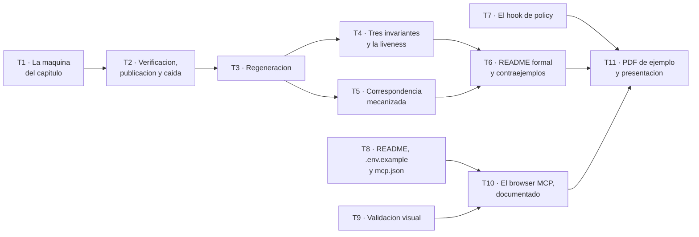

# Fase 7 — Probar el harness

**Objetivo:** que la máquina del sistema esté **verificada formalmente** —una especificación TLA+ con tres invariantes de seguridad y una propiedad de *liveness*, comprobada con TLC sobre el modelo pequeño que pide el encargo—, que exista el **segundo hook** que `RF-GUA-07` lleva tres fases pidiendo, que la lectura se compruebe **en un navegador**, y que el repositorio tenga los ficheros que el encargo nombra uno a uno.

**Enfoque:** el `.tla` **no se escribe contra una pizarra**. `features/escritura/maquina.py` es una tabla de transiciones explícita con 64 tests, `checkpoint.py` fija tres precondiciones más y `reanudacion.py` la cuarta. La especificación se escribe **contra ese código**, y la correspondencia entre los dos **no se deja en una lectura**: se mecaniza.

**Spec:** [`spec.md`](spec.md), `aprobada` por `maujimenez4`.

**Requisitos:** `RF-FOR-05` a `RF-FOR-08` · `RF-GUA-07` · `RF-VAL-08`. **Criterios:** `CA-22`, `CA-27`.

---

## Esta fase son dos mitades, y una de ellas puede empezar hoy

**La [hoja de ruta](../hoja-de-ruta.md) coloca esta fase la última «por dependencia, no por importancia», y eso es cierto solo a medias.** Conviene decirlo aquí porque cambia cuándo se puede trabajar, no qué hay que hacer.

| Mitad | Qué entrega | De qué depende | Cuándo |
| --- | --- | --- | --- |
| **A · La verificación formal y lo que no espera a nadie** | `Harness.tla`, `harness.cfg`, TLC en verde, la correspondencia con el código, el hook de policy, `README.md`, `.env.example`, `.claude/mcp.json` | **De la máquina de estados, que ya existe, y de TLC, que ya está instalado y probado.** Ni de la Fase 4, ni del frontend, ni de una corrida real | **Hoy** |
| **B · Lo que necesita que exista la lectura** | `RF-VAL-08` (validación visual), el uso real del browser MCP documentado, `/ejemplos/novela-ejemplo.pdf`, `/presentacion/` | De la publicación (Fase 4), del frontend (F1 y F2) y de **una corrida real contra el proveedor** | Después, y no antes |

**Por qué la mitad A no depende de nada.** La especificación TLA+ describe la máquina de `architecture.md` §3.9, que es **un documento cerrado**, y la comprueba contra código que **está escrito y probado desde la Fase 3**. TLC no llama al modelo, no toca la base de datos, no levanta el servidor y no necesita ni un capítulo escrito: explora estados. Y ya no hay que pelearse con la instalación: `formal/README.md` deja **TLC 2.19 con su jar en el repositorio y un modelo de juguete corriendo en 1,7 segundos**. El hook de policy es código sobre `features/calidad` y `features/escritura`, que existen. `README.md` y `.env.example` describen lo que hoy funciona.

**Qué sí espera, y por qué no se puede adelantar.** `RF-VAL-08` dice literalmente que la validación visual **abre la lectura en un navegador**: sin frontend no hay página que abrir, y escribir el validador contra una lectura imaginaria produciría un validador que pasa siempre —el defecto que este proyecto ya ha encontrado cinco veces—. El PDF de ejemplo es «la evidencia de que el sistema funciona de principio a fin»: necesita publicación, lectura y una corrida real, y hoy la corrida real **está bloqueada por P-1**.

**La consecuencia para el orden de los planes, dicha como recomendación y no como corrección.** La atadura de la hoja de ruta `Frontend 2 → Backend 7` es cierta para **la mitad B y solo para ella**. La mitad A se puede solapar con las fases 4, 5 y 6 sin tocar un fichero suyo: `formal/tla/Harness.tla` no existe, `features/calidad/policy.py` no existe, y `README.md` y `.env.example` tampoco. **Y hay un motivo para adelantarla que no es de calendario:** TLC comprueba la máquina de la novela **mientras** la Fase 4 escribe la publicación y antes de que la Fase 5 escriba la regeneración, que es el momento más barato en que un fallo de diseño puede aparecer. Encontrar en TLC que `DescartarPeticion` deja la lectura a medias cuesta una tarde; encontrarlo con la petición del lector ya implementada cuesta la Fase 5 entera.

**Lo que esto no autoriza.** Nadie mueve la hoja de ruta ni el estado de un plan: eso lo firma una persona (`CLAUDE.md` §15). Lo que este plan hace es **partir la fase por donde se puede partir** y dejar escrito el argumento.

---

## Lo que ya está instalado, y lo que eso cambia

`formal/README.md` es la fuente, y esta fase **parte de ahí**:

| | |
| --- | --- |
| TLC | **2.19**, de 08-08-2024 (rev 5a47802) |
| Java | OpenJDK **21.0.12.1+1 LTS** (Temurin, JRE) |
| El jar | `formal/tla/tla2tools.jar`, **commiteado** (2,27 MB) |
| Humo | `formal/tla/Juguete.tla` + `Juguete.cfg`: un contador acotado con **un invariante de seguridad y una propiedad de *liveness***, en verde — 7 estados, profundidad 6, **1,7 s** |
| Basura de TLC | ya ignorada: `formal/tla/.gitignore` cubre `states/`, `*.st`, `ptrs_*` |

**Lo que eso cambia en este plan:** la Tarea 1 **no instala nada**. Empieza comprobando el humo en su máquina y escribiendo el módulo de verdad. Y hay una referencia que vale oro para R-9: **1,7 segundos y 7 estados** es la línea base. Cuando `Harness.tla` diga «doscientos mil estados en cuarenta segundos», eso es un número con contexto; sin la línea base, sería un número suelto.

**El comando es este, y no el de `CLAUDE.md` §14:**

```bash
cd formal/tla && java -cp tla2tools.jar tlc2.TLC -config harness.cfg Harness.tla
```

`CLAUDE.md` §14 dice hoy `tlc -config harness.cfg Harness.tla`, y **no existe ningún binario `tlc`**: las herramientas de TLA+ son un jar. La línea se corrige en el mismo commit que la vuelve verdadera (T1). *Es una corrección de la forma del comando, no de la decisión: el comando siempre fue «TLC sobre `harness.cfg` y `Harness.tla`».*

---

## Tres decisiones previas

**Se resuelven aquí y no dentro de una tarea**, porque las tres cambian qué se escribe y no cómo se escribe.

### 1 · El contador de reparaciones **es parte del estado**

La cabecera de `maquina.py` lo dice de sí misma:

> «**El único destino que no sale de la tabla es el de `REPARANDO`**, porque depende del contador de reparaciones y no solo del par estado-señal. Es la diferencia entre `ESCRIBIENDO` y `ESCALADA`, y el contador vive en la fila, no en el argumento de quien llama.»

**Consecuencia directa, y es la que decide la forma del modelo: la especificación no puede ser una relación de transición sobre los diez estados.** Un `.tla` con una variable `estado` y una tabla de pares comprobaría una máquina que no es la nuestra —y comprobaría **bien** una máquina equivocada, que es la peor forma de fallar—. `intento` entra como variable del modelo, indexada **por capítulo**, porque `checkpoint.reparaciones_del_capitulo` cuenta por capítulo y no por trabajo ni por obra.

**Y no cuesta: paga.** Con el contador en el estado, «el número de reintentos nunca supera el límite» —el cuarto ejemplo del encargo §5d— **queda comprobado por `TypeOK`**, porque `intento \in [Numeros -> 0..MaxReintentos]` es exactamente esa frase escrita como tipo. Sin el contador en el estado no se podría ni enunciar.

### 2 · La especificación abarca **tres** sitios del código, no solo `maquina.py`

Dos de los invariantes que el encargo sugiere hablan de estado que la máquina del ciclo de escena **no tiene**:

| Lo que §5d pide | Dónde vive ese estado |
| --- | --- |
| El ciclo de capítulo, con sus reintentos | `features/escritura/maquina.py` |
| Que la reanudación **no duplique ni pierda** capítulos | `features/escritura/checkpoint.py` y `reanudacion.py` |
| Que la **versión anterior se conserve** tras una regeneración | `features/manuscrito/` — lo está creando la Fase 4, y la Fase 5 añade la petición |

**Por eso la tabla de correspondencia cita los tres**, y por eso tiene filas *pendientes* con su fase: `Publicar` y `Verificar` son de la Fase 4, `PeticionDelLector` y `DescartarPeticion` de la Fase 5. Una fila pendiente **declarada** es información; una casilla vacía en silencio es la cobertura falsa que `verification.md` §7 llama «peor que no tenerla». Y T5 le pone un guardia: **cuando el código de una fila pendiente aparezca, el test se pone en rojo hasta que alguien la llene.**

### 3 · `tla2tools.jar` va commiteado, y es una decisión

Son **2,27 MB de binario en un repositorio que van a corregir**, así que se escribe por qué y no se deja como un hecho que apareció solo:

- **A favor:** son las herramientas **exactas** con las que se comprobó la especificación. `latest` no es una versión, y una comprobación formal cuya herramienta no está fijada no es reproducible — que es justo lo que distingue una verificación de una anécdota.
- **En contra:** ningún revisor va a leer ese binario, y la alternativa —bajarlo en CI— es legítima **si se fija la versión**. No hay CI hoy.
- **Decisión:** se queda, con la versión escrita en `formal/README.md` y repetida en `formal/tla/README.md`. **Si alguien prefiere lo contrario, el cambio es de una línea y de un `.gitignore`**, y lo que no puede perderse es el número de versión.

---

## Lo que hereda, y por qué eso hace barata la mitad A

La Fase 3 dejó la máquina **en código y cerrada**. La especificación no la inventa: la transcribe y la explora.

| Lo que ya existe | Dónde | Qué le ahorra al `.tla` |
| --- | --- | --- |
| Diez estados y su tabla de transiciones | `features/escritura/maquina.py`, `_TRANSICIONES` | Las acciones del ciclo de capítulo salen de ahí, no de una lectura del diagrama |
| Que el destino de `REPARANDO` **no sale de la tabla** | `maquina.transitar`, con su cabecera | La decisión previa 1, entera |
| Que una transición inexistente **se lanza** | `maquina.TransicionInexistente` | El modelo no necesita un `else`: lo que no está, no pasa |
| El límite de reparaciones, con `>=` y no `==` | `maquina.transitar` · `modelos.INTENTOS_MAXIMOS = 2` | La constante `MaxReintentos` del modelo **se compara con esta** en un test |
| Que un capítulo `ESCALADA` detiene la novela | `maquina.exigir_que_la_novela_siga` | La acción `Escalar` tiene destino en el código |
| Las tres precondiciones de arranque de capítulo | `checkpoint.empezar_capitulo` | Son las guardas de `SiguienteCapitulo` y de `Reanudar` |
| Que el contador es **del capítulo** y es el `MAX` de sus trabajos | `checkpoint.reparaciones_del_capitulo` | `SiguienteCapitulo` no toca `intento`, y eso es transcripción, no invención |
| Que al relanzar **se heredan** las reparaciones gastadas | `reanudacion.reanudar` → `trabajo.intento = arranque.intento` | `Reanudar` deja `intento` sin cambiar. Sin esa línea, una caída regalaría reintentos |
| El bucle de los diez capítulos y su parada | `novela.escribir_novela` | `SiguienteCapitulo`, `Fin` y la salida por `detenida_en` |
| El registro de auditoría *append-only*, con permitido **y** bloqueado | `commons/db/auditoria.py` | El hook de policy no inventa dónde escribe: escribe ahí |

---

## Los tres invariantes de seguridad: cuáles, y por qué esos

El encargo §5d sugiere cuatro ejemplos y pide **al menos tres**. `RF-FOR-05` fija el número: tres de seguridad y una de *liveness*. **Elegir es parte del trabajo**, y el criterio no es cuál suena mejor: es **qué comprueba TLC que no comprueba ya nada más**, contrastado contra el código y contra `verification.md`.

| # | Invariante | Qué dice | Qué lo cubre hoy | Qué añade TLC |
| --- | --- | --- | --- | --- |
| **S1** | `PublicadaSoloConPuertas` | Ninguna versión publicada contiene un capítulo que no pasó su puerta | `verification.md` §4.1: **T + A**, y «que el código implemente ese modelo es **I** y no está cubierto». La Fase 4 lo probará sobre el camino feliz | El camino **no feliz**: una regeneración que rehace un capítulo y publica sin volver a validarlo. Ningún test de la Fase 4 explora ese entrelazado porque la regeneración es de la Fase 5 |
| **S2** | `ReanudacionIntegra` | Nunca se reescribe un capítulo ya integrado, y no se verifica con un hueco detrás | `verification.md` §7: **Parcial** — «la exhaustividad sobre los diez estados **la sostiene quien escribe los tests, no un método**». Y §8.1 lo repite de `checkpoint_reanudacion`: «los estados que nadie probó» | **Es el método que falta.** Es la única fila de la matriz donde el propio documento dice que la cobertura depende de la diligencia de una persona, y TLC es exhaustivo por construcción |
| **S3** | `LecturaIgualALaVigente` | En `PUBLICADA`, lo que se sirve es **exactamente** la última versión publicada, y las versiones anteriores no se tocan | Nada todavía: la regeneración es de la Fase 5. Lo que hay es inmutabilidad por construcción (`version_texto`) y el ledger *append-only* | El caso que se escapa: **`DescartarPeticion` que no restaura**. `architecture.md` §3.9 dice que esa flecha «no es una publicación: es un regreso», y un regreso a medias deja al destinatario leyendo una novela que nadie publicó |

**Y la cuarta sugerencia del encargo —«el número de reintentos nunca supera el límite»— está comprobada y no es una de las tres, que no es lo mismo que dejarla fuera.** `TypeOK` declara `intento \in [Numeros -> 0..MaxReintentos]`, así que **TLC comprueba esa frase en cada estado que explora**: cualquier acción que se pasara del tope sería una violación de tipo con su traza. Lo que no hace es cargar peso, y el motivo es el que importa:

- La guarda de `Reparar` la hace verdadera por construcción, y **un invariante que ninguna modelización plausible puede violar no verifica nada** — es la advertencia de `verification.md` §5 sobre lo que no se puede incumplir, aplicada a nosotros.
- En el código ya está sujeta por tres sitios: el `CheckConstraint("intento BETWEEN 0 AND 2")` de la tabla `trabajo`, el `>=` de `maquina.transitar`, y `CA-9` probado por los dos lados.
- **Y el fallo real que se teme no es que el contador se pase: es que se reinicie.** Si `Reanudar` lo pusiera a cero —que es la modelización *plausible*, porque un trabajo relanzado es un trabajo nuevo—, el contador nunca superaría el límite **y la novela nunca terminaría**: caída, reparación, caída, reparación. Eso **lo caza la propiedad de *liveness***, y el paso 6 de T4 lo demuestra rompiéndolo a propósito.

**La propiedad de *liveness*, y por qué no es la que uno escribe primero.** La forma obvia —`<>[] (estado \in {PUBLICADA, DETENIDA})`, «acaba y se queda»— **es falsa en esta máquina**, y no por un fallo: `PUBLICADA --> REGENERANDO` existe, así que el sistema sale de su estado final cada vez que el lector pide un cambio. La propiedad correcta es la de *leads-to*:

```
TodaGeneracionTermina == (estado = "CONFIGURANDO") ~> (estado \in {"PUBLICADA", "DETENIDA"})
```

«Toda generación termina publicando una versión o deteniéndose con error; nunca queda en un bucle infinito», que es literalmente lo que pide el encargo §5d. Los dos bucles que podrían romperla son el de reparación y el de caída, y los dos los cierra la misma hipótesis de equidad **fuerte** sobre `Aprobar`: si aprobar está habilitado infinitas veces, aprueba. La equidad débil no basta, y el motivo se escribe en el README: entre dos habilitaciones de `Aprobar` hay una vuelta por `ESCRIBIENDO_CAPITULO`, así que no está **continuamente** habilitada.

---

## La correspondencia código ↔ especificación, que es el punto ciego declarado

`verification.md` §7 tiene una fila que dice esto de nosotros:

> **La especificación TLA+ deja de corresponder al código** · La lectura del README que empareja cada acción con su transición · **Descubierto** — es una **I**, y nada la vuelve a comprobar cuando el orquestador cambia. Una especificación verde sobre un código que ya no implementa esa máquina es peor que no tenerla: afirma seguridad de otro sistema.

Y la spec lo repite en «Lo que esta spec no verifica»: *«Es una inspección que nadie repite cuando el orquestador cambia. Sigue siendo I»*.

**Este plan no puede convertir esa I en una T, y no va a fingir que sí.** Que la acción `Escribir` del modelo *signifique* lo que hace `ciclo._escribir` es un juicio humano y lo seguirá siendo. **Lo que sí se puede mecanizar es la mitad que se rompe sola.**

La mitigación es la **Tarea 5** y son cinco comprobaciones, en un test que vive **junto a la máquina** —`features/escritura/tests/`— para que lo rompa quien toque el orquestador y no quien toque el documento:

1. **Toda transición de `maquina._TRANSICIONES` está reclamada** por una acción del `.tla` **o** declarada en `[[sin_accion]]` con su motivo. Añadir una transición al código y no tocar el modelo **pone el test en rojo**.
2. **Toda acción del `Next` del `.tla` aparece en la tabla.** Añadir una acción al modelo y no emparejarla **pone el test en rojo**.
3. **Todo símbolo emparejado existe**: se importa y se busca. Renombrar `empezar_capitulo` y dejar la tabla apuntando al nombre viejo **pone el test en rojo**.
4. **Todo símbolo *previsto* sigue sin existir.** Cuando la Fase 4 cree `manuscrito.service.publicar`, la fila `Publicar` deja de estar pendiente **y el test lo dice**, en vez de esperar a que alguien se acuerde. Es el guardia que convierte «lo rellenamos luego» en una condición comprobable.
5. **Las constantes del modelo pequeño son las del código:** `MaxReintentos` contra `INTENTOS_MAXIMOS`.

Lo que queda fuera, y se escribe en el README para que nadie lo dé por cubierto: **que la acción haga lo que su nombre dice.** Eso sigue siendo **I**. Al cerrar la fase, la fila de `verification.md` §7 pasa de «Descubierto» a «**Parcial**», con esa frase como motivo. No a «Cubierto».

---

## Cómo se reparte entre agentes

### El grafo



| Ola | Tareas | Agentes a la vez | Mitad |
| --- | --- | --- | --- |
| 1 | T1 · T7 · T8 | **3** — el punto más ancho | A |
| 2 | T2 | 1 | A |
| 3 | T3 | 1 | A |
| 4 | T4 · T5 | 2 | A |
| 5 | T6 | 1 | A |
| — | *frontera: hasta aquí, sin esperar a nadie* | | |
| 6 | T9 | 1 | B |
| 7 | T10 | 1 | B |
| 8 | T11 | 1 | B |

Ruta crítica: `T1 → T2 → T3 → T4 → T6`. **Cinco eslabones para once tareas, y la ganancia aquí es de las peores del proyecto: ~1,3×.** El motivo es honesto y conviene saberlo antes de repartir: **una especificación TLA+ es un fichero**, y las reglas de reparto de este repositorio dan un agente por fichero. Partirla en módulos para paralelizar sería partir un documento de doscientas líneas para que quepan tres personas: más junturas que trabajo. Lo que sí corre suelto es todo lo que no es el `.tla` —el hook de policy, los ficheros del encargo, la correspondencia—.

### Las reglas del reparto

Las nueve de la Fase 3 siguen enteras. Se repiten las que esta fase tensa, y **la décima, que es la deuda P-16**:

1. **Un agente por fichero dentro de la ola.** `Harness.tla` tiene **un solo dueño en cada ola**, y cambia de dueño entre olas.
2. **Cada agente en su worktree**, y lo primero que hace es comprobar su base: `git checkout -b <rama> <hash>`.
3. **La tabla de Desviaciones la escriben todos y la resuelve el integrador.** Nace vacía.
4. **El integrador corre las puertas sobre el resultado COMBINADO al cerrar cada ola**, en los dos modos de `VectorStore`.
5. **Nadie llama al proveedor sin que lo pida el dueño.** En esta fase es más que una regla de coste: **P-1 dice que hoy falla**.
6. **Las junturas tienen dueño explícito desde el plan** (P-16, y es la primera fase que lo aplica):

| Juntura | Dueño |
| --- | --- |
| `features/calidad/__init__.py` | **T7** |
| `features/escritura/service.py` y `agents.py` | **T7** |
| `CLAUDE.md` §14 (el comando de TLC) | **T1** |
| `docs/verification.md` §7 y §8.3 | **T5** |
| `formal/README.md` (enlace al README de la especificación) | **T6** |
| `specs/problemas-abiertos.md` (cerrar **P-5**) | el integrador, al cerrar la ola 1 |
| `docs/architecture.md` §3.9 (si TLC obliga) | **T6**, y solo con el contraejemplo delante |

---

## Restricciones globales

Las de las fases anteriores siguen enteras. Aquí van las que esta fase estrena o tensa, **con el valor exacto**.

| Restricción | Valor exacto | Origen |
| --- | --- | --- |
| La especificación es **TLA+ o PlusCal** del flujo de generación como máquina de estados | Se elige **TLA+** sobre `architecture.md` §3.9 | `RF-FOR-05` · encargo §5d |
| **Tres invariantes de seguridad y una propiedad de *liveness*** | S1, S2, S3 y `TodaGeneracionTermina` | `RF-FOR-05` |
| El modelo pequeño es **cinco capítulos y dos reintentos** | `Capitulos = 5`, `MaxReintentos = 2` | `RF-FOR-06` · encargo §5d, literal |
| **La configuración va en el repositorio** | `formal/tla/harness.cfg` | `RF-FOR-06` |
| La herramienta y su versión | **TLC 2.19** sobre **Java 21**, con `formal/tla/tla2tools.jar` commiteado | `formal/README.md` |
| El comando | `cd formal/tla && java -cp tla2tools.jar tlc2.TLC -config harness.cfg Harness.tla` | Decisión previa, arriba |
| El contador de reparaciones **es variable del modelo**, indexada por capítulo | `intento \in [Numeros -> 0..MaxReintentos]` | `maquina.py` · decisión previa 1 |
| **TLC no corre dentro de una generación** y por eso **no emite *score*** | Es la única excepción declarada de `RF-VAL-01` y `RF-OBS-04` | spec, `RF-VAL-01` |
| **TLC no entra en la suite de `pytest`** | Corre en desarrollo, a mano, con su comando | `verification.md` §8.3 |
| Máximo de reparaciones dirigidas | **2**, y el modelo lo compara con el código en un test | `INTENTOS_MAXIMOS` · `RF-ORQ-04` |
| Los guardarraíles se aplican **en código**, no en el prompt | Dos hooks: capítulo y **policy** | `RF-GUA-07` · `CLAUDE.md` §11 |
| La comparación de vetos es sobre **texto normalizado** y **por palabra**, no por subcadena | `commons/domain/normalizacion.py`, sin tocar | `RF-GUA-02` · `CLAUDE.md` §15 |
| El registro de auditoría dice **qué se permitió y qué se bloqueó, y por qué** | *Append-only*, las dos decisiones | `RF-GUA-05` |
| La validación visual es **código conduciendo un navegador**, no un agente | `architecture.md` §3.5.1 | `RF-VAL-08` |
| **Ninguna clave en el repositorio** | `.env.example` con los nombres y **sin valores** | encargo, «Sin API keys» · `CLAUDE.md` §16 |
| **Ninguna prosa generada en el repositorio** | El PDF de ejemplo es la **única** excepción, y la pide el encargo | `RD-06` · `CLAUDE.md` §16 |
| TDD y `CA-6` | Rojo → verde → refactor, y **quitar la comprobación para verla caer** | `CLAUDE.md` §3.4 |
| El vocabulario no se improvisa | `checkpoint` sigue sin estar en `definitions.md` (**P-11**): se usa citando `architecture.md` §3.9, y no se introduce ningún término nuevo | `CLAUDE.md` §2 |

---

## Las deudas que otras fases mandaron aquí

Tres planes anteriores han dejado trabajo con fecha en esta fase. **Se nombran y se decide**, porque una deuda que llega sin dueño se queda sin pagar:

| Deuda | Qué es | Decisión |
| --- | --- | --- |
| **P-5** · el hook de policy no existe | `RF-GUA-07` pide dos hooks y hay uno | **Se paga: es T7.** Es el requisito de esta fase, no una deuda de paso |
| **P-15** · «ya autenticado» no está definido fuera de la máquina del autor | El SDK lanza el binario `claude`; `pyproject.toml` no lo declara y ninguna puerta lo comprueba | **Se paga en T8**: el `README.md` lo declara como requisito de ejecución, `.env.example` lo dice, y el README trae la comprobación (`claude --version`). Convertirlo en puerta de la *build* no, porque la suite entera corre con dobles y no lo necesita |
| **P-10** · `SalidaMalFormada` va por cinco copias | `CLAUDE.md` §5.1 la manda a `commons/` al tercer uso. La Fase 6 no la pagó porque dos de esos `agents.py` estaban ocupados | **Se paga en T7, en commit aparte y como último paso.** Es la primera ola en la que ningún otro agente toca esos ficheros. Si el integrador prefiere no arrastrarla, **se queda y se escribe en Desviaciones**: lo que no vale es volver a darla por imposible sin mirar |
| El resto de `RF-ORQ-03` | La idempotencia quedó cableada sobre `EXTRAYENDO` y no sobre `ESCRIBIENDO` (plan 5) | **No se paga aquí, y se dice por qué:** toca el bucle de reparación de `escribir_capitulo`, que es exactamente el fichero que T7 está reescribiendo para meter el hook. Dos cambios de intención distinta en el mismo bucle a la vez es como se llega a un *merge* que nadie sabe revisar. **Queda en `problemas-abiertos.md` con dueño: la fase que vuelva a abrir ese bucle** |

---

## Puntos de revisión

Nueve condiciones que los requisitos implican y que **ninguna tarea probaría si no estuvieran escritas aquí**.

| # | Entrada o condición | Qué espera una persona razonable | Tarea |
| --- | --- | --- | --- |
| R-1 | **`SiguienteCapitulo` modelado como `Reparar`** | Avanzar de capítulo **no consume reintentos**. `architecture.md` §3.9 escribe la consecuencia de equivocarse: «una novela de diez capítulos se detendría sola por agotamiento sin que hubiera fallado nada». Es el error que el modelo puede cometer **con más facilidad que el código**, porque las dos flechas van del mismo estado al mismo estado | T1 |
| R-2 | **`DescartarPeticion` llega a `PUBLICADA` sin crear versión** | S1 se enuncia sobre **la creación de la versión**, no sobre el estado de destino. Enunciada sobre el estado es falsa en el primer paso, y el peligro no es el contraejemplo: es que alguien la relaje para que pase | T3 · T4 |
| R-3 | **Una caída no regala reintentos** | `Reanudar` deja el contador **como estaba** (`reanudacion.reanudar` hereda `arranque.intento`). Si se reiniciara, ningún invariante de seguridad caería: caería la *liveness* | T2 · T4 |
| R-4 | **Alguien añade una transición a `_TRANSICIONES` y no toca el `.tla`** | El test de correspondencia **falla**. Es la mitad mecanizable del punto ciego declarado, y sin ella la especificación se vuelve verde sobre otro sistema | T5 |
| R-5 | **La Fase 4 crea `manuscrito.service.publicar` y la fila `Publicar` sigue diciendo «pendiente»** | El test **falla** y nombra el símbolo. Una tabla de correspondencia que envejece en silencio es la misma cobertura falsa por otra puerta | T5 |
| R-6 | **Alguien quita la llamada al hook de policy de `service.py`** | Se ve. `CLAUDE.md` §11: «un guardarraíl que vive dentro del código que vigila se puede saltar cambiando ese código; un hook es un punto de enganche declarado, **y su ausencia se ve**» | T7 |
| R-7 | **Un veto en plural, con acento o en mayúsculas, después de mover el código de sitio** | Sigue cazando. Mover `localizar_veto` de `escritura` a `calidad` **no puede** cambiar lo que caza: los tests de variantes viajan con la función | T7 |
| R-8 | **La lectura cambia de ruta y la validación visual abre otra página** | Da **rojo**, no verde. `rutas_estables` corre **antes** que `inspeccion_visual` y existe justo para eso: `verification.md` §8.1 lo llama «el único de los veintiocho cuyo objeto es que otro no mienta» | T9 |
| R-9 | **TLC no termina, o termina en cuatro horas** | El README dice **cuántos estados** exploró y **cuánto tardó**, contra la línea base de `Juguete.tla` —7 estados, 1,7 s—. Un modelo que no se puede volver a correr no lo vuelve a correr nadie, y entonces la verificación es una foto | T4 |

---

## Tarea 1 · La máquina del capítulo, con el contador dentro

Abre `RF-FOR-05`. **Ficheros:** `formal/tla/Harness.tla` (crear) · `formal/tla/harness.cfg` (crear) · `CLAUDE.md` §14 (modificar, una línea).

*No instala nada: `formal/README.md` deja TLC 2.19 y el jar en su sitio. Lo que instala este plan es la especificación.*

**Interfaces:**
- Produce: el módulo `Harness` con las constantes `Capitulos`, `MaxReintentos`, `MaxRondas`, `MaxPeticiones`; las variables `estado, rondas, actual, integrados, validado, intento, versiones, peticiones, porRehacer`; y las acciones `FaltaUnDato`, `Planificar`, `SiguienteCapitulo`, `Escribir`, `Aprobar`, `Reparar`, `Escalar`, `Fin`. T2 y T3 añaden acciones **a este mismo fichero** y no cambian las suyas.

- [ ] **Paso 1: Comprobar el humo en esta máquina, y apuntar la línea base**

```bash
cd formal/tla && java -cp tla2tools.jar tlc2.TLC -config Juguete.cfg Juguete.tla
```

Se espera: `Model checking completed. No error has been found.`, **7 estados, profundidad 6**, en torno a **1,7 s**. Si esto no sale, el problema es la instalación y está documentado en `formal/README.md`: **no sigas escribiendo la especificación**, arréglalo primero.

- [ ] **Paso 2: Escribir el esqueleto del módulo y su `.cfg`**

```tla
-------------------------------- MODULE Harness --------------------------------
(***************************************************************************)
(* La maquina de estados de la NOVELA: `docs/architecture.md` §3.9.         *)
(*                                                                         *)
(* No es la del ciclo de escena (§3.3), que es la de `maquina.py`: esta la  *)
(* contiene. Y NO es una relacion de transicion sobre los diez estados: el  *)
(* destino de `REPARANDO` depende del contador de reparaciones —lo dice la  *)
(* cabecera de `maquina.py`—, asi que el contador es parte del estado.      *)
(*                                                                         *)
(* La correspondencia, accion a accion, vive en `correspondencia.toml` y la *)
(* comprueba un test junto a la maquina.                                   *)
(***************************************************************************)
EXTENDS Naturals, Sequences, FiniteSets

CONSTANTS Capitulos, MaxReintentos, MaxRondas, MaxPeticiones

ASSUME Capitulos \in Nat \ {0}
ASSUME MaxReintentos \in Nat
ASSUME MaxRondas \in Nat
ASSUME MaxPeticiones \in Nat

Numeros == 1..Capitulos

VARIABLES estado, rondas, actual, integrados, validado, intento,
          versiones, peticiones, porRehacer

vars == <<estado, rondas, actual, integrados, validado, intento,
          versiones, peticiones, porRehacer>>

Estados == {"CONFIGURANDO", "PLANIFICADA", "ESCRIBIENDO_CAPITULO",
            "VALIDANDO_CAPITULO", "VERIFICANDO", "PUBLICADA",
            "REGENERANDO", "DETENIDA"}

(* Una version publicada lleva SU PROPIA foto de que capitulos la componen y *)
(* cuales habian pasado su puerta. Guardarla es lo que permite preguntar por *)
(* una version antigua despues de que el estado vivo haya cambiado.          *)
Version == [capitulos: SUBSET Numeros, validados: SUBSET Numeros]

(* `intento` indexado POR CAPITULO, como `checkpoint.reparaciones_del_capitulo`:
   ni por trabajo —un relanzamiento daria reparaciones infinitas— ni por obra
   —avanzar de capitulo consumiria reintentos, R-1—. Y su rango es el cuarto
   ejemplo del encargo §5d comprobado como tipo: el contador nunca se pasa. *)
TypeOK ==
  /\ estado \in Estados
  /\ rondas \in 0..MaxRondas
  /\ actual \in 0..Capitulos
  /\ integrados \subseteq Numeros
  /\ validado \in [Numeros -> BOOLEAN]
  /\ intento \in [Numeros -> 0..MaxReintentos]
  /\ versiones \in Seq(Version)
  /\ peticiones \in 0..MaxPeticiones
  /\ porRehacer \subseteq Numeros

Pendientes == Numeros \ integrados
Primero(S) == CHOOSE c \in S : \A d \in S : c =< d

Init ==
  /\ estado = "CONFIGURANDO"
  /\ rondas = 0
  /\ actual = 0
  /\ integrados = {}
  /\ validado = [c \in Numeros |-> FALSE]
  /\ intento = [c \in Numeros |-> 0]
  /\ versiones = << >>
  /\ peticiones = 0
  /\ porRehacer = {}

Next == UNCHANGED vars

Spec == Init /\ [][Next]_vars
=============================================================================
```

```
\* formal/tla/harness.cfg
\* El modelo pequeno que pide el encargo §5d: cinco capitulos, dos reintentos.
SPECIFICATION Spec

CONSTANTS
  Capitulos = 5
  MaxReintentos = 2
  MaxRondas = 2
  MaxPeticiones = 1

INVARIANTS
  TypeOK
```

- [ ] **Paso 3: Correrlo y ver que pasa por la razón equivocada**

```bash
cd formal/tla && java -cp tla2tools.jar tlc2.TLC -config harness.cfg Harness.tla
```

Se espera: **`No error has been found`** con **1 estado**. Es verde y no verifica nada: una máquina que no se mueve cumple cualquier invariante. **Ese es el rojo de esta tarea** —si la máquina completa diera el mismo resultado que la máquina quieta, el modelo no estaría comprobando nada— y el número se apunta para compararlo con el del paso 5.

- [ ] **Paso 4: Las acciones del ciclo de capítulo**

Reemplazan a `Next == UNCHANGED vars`:

```tla
(* CONFIGURANDO --> CONFIGURANDO: falta un dato o hay contradiccion.        *)
(* Se acota con MaxRondas, y la razon se escribe porque no es inocente: un  *)
(* bucle sin cota hace imposible cualquier propiedad de liveness, y quien   *)
(* cierra la entrevista de verdad es el Comprador, que no es el harness.    *)
FaltaUnDato ==
  /\ estado = "CONFIGURANDO"
  /\ rondas < MaxRondas
  /\ rondas' = rondas + 1
  /\ UNCHANGED <<estado, actual, integrados, validado, intento,
                 versiones, peticiones, porRehacer>>

Planificar ==
  /\ estado = "CONFIGURANDO"
  /\ estado' = "PLANIFICADA"
  /\ UNCHANGED <<rondas, actual, integrados, validado, intento,
                 versiones, peticiones, porRehacer>>

(* R-1. NO toca `intento`, y esa ausencia es el requisito: avanzar de       *)
(* capitulo no consume reintentos (§3.9, `CA-9`). La guarda del medio es    *)
(* `checkpoint.empezar_capitulo`: no se empieza el siguiente con el actual  *)
(* sin integrar.                                                            *)
SiguienteCapitulo ==
  /\ estado \in {"PLANIFICADA", "VALIDANDO_CAPITULO"}
  /\ (estado = "VALIDANDO_CAPITULO") => (actual \in integrados)
  /\ Pendientes # {}
  /\ actual' = Primero(Pendientes)
  /\ estado' = "ESCRIBIENDO_CAPITULO"
  /\ UNCHANGED <<rondas, integrados, validado, intento,
                 versiones, peticiones, porRehacer>>

(* Prosa nueva: sin validar, aunque la anterior lo estuviera.               *)
Escribir ==
  /\ estado = "ESCRIBIENDO_CAPITULO"
  /\ estado' = "VALIDANDO_CAPITULO"
  /\ validado' = [validado EXCEPT ![actual] = FALSE]
  /\ UNCHANGED <<rondas, actual, integrados, intento,
                 versiones, peticiones, porRehacer>>

(* Las puertas aprueban. `EXTRAYENDO` e `INTEGRADA` de §3.3 se abstraen en  *)
(* esta accion: la maquina de la novela no las distingue, y el modelo no    *)
(* inventa estados que su documento no tiene.                               *)
Aprobar ==
  /\ estado = "VALIDANDO_CAPITULO"
  /\ ~validado[actual]
  /\ validado' = [validado EXCEPT ![actual] = TRUE]
  /\ integrados' = integrados \cup {actual}
  /\ UNCHANGED <<estado, rondas, actual, intento,
                 versiones, peticiones, porRehacer>>

(* R-1, el otro lado: `Reparar` SI incrementa el contador. Y el destino     *)
(* depende de el, que es la decision previa 1 de este plan.                 *)
Reparar ==
  /\ estado = "VALIDANDO_CAPITULO"
  /\ ~validado[actual]
  /\ intento[actual] < MaxReintentos
  /\ intento' = [intento EXCEPT ![actual] = @ + 1]
  /\ estado' = "ESCRIBIENDO_CAPITULO"
  /\ UNCHANGED <<rondas, actual, integrados, validado,
                 versiones, peticiones, porRehacer>>

Escalar ==
  /\ estado = "VALIDANDO_CAPITULO"
  /\ ~validado[actual]
  /\ intento[actual] = MaxReintentos
  /\ estado' = "DETENIDA"
  /\ UNCHANGED <<rondas, actual, integrados, validado, intento,
                 versiones, peticiones, porRehacer>>

(* Sin esto, TLC informa de `deadlock` en los estados terminales de §3.9,   *)
(* que son finales y no averias.                                            *)
Fin ==
  /\ estado = "DETENIDA"
  /\ UNCHANGED vars

Next ==
  \/ FaltaUnDato
  \/ Planificar
  \/ SiguienteCapitulo
  \/ Escribir
  \/ Aprobar
  \/ Reparar
  \/ Escalar
  \/ Fin
```

- [ ] **Paso 5: Correr TLC y ver que ahora sí explora**

```bash
cd formal/tla && java -cp tla2tools.jar tlc2.TLC -config harness.cfg Harness.tla
```

Se espera: sin errores, y **miles de estados** en vez de uno. Apunta el número y el tiempo: es la referencia contra la que T4 comprobará que sus invariantes se evalúan sobre un espacio de verdad.

- [ ] **Paso 6: Que `CLAUDE.md` §14 diga el comando que existe**

```bash
cd formal/tla && java -cp tla2tools.jar tlc2.TLC -config harness.cfg Harness.tla  # TLA+: invariantes del flujo
```

- [ ] **Paso 7: Commit**

```bash
git add formal/tla/Harness.tla formal/tla/harness.cfg CLAUDE.md
git commit -m "TLA+: la maquina de la novela hasta el ciclo de capitulo, con el contador dentro del estado"
```

---

## Tarea 2 · Verificación, publicación y caída

Sigue con `RF-FOR-05`. **Ficheros:** `formal/tla/Harness.tla` (modificar).

**Interfaces:**
- Consume: todo lo de T1.
- Produce: `Verificar`, `Publicar`, `LeanFalla`, `Reanudar`, y `Fin` ampliada. T3 añade la regeneración y **no cambia estas**.

- [ ] **Paso 1: Escribir las cuatro acciones**

```tla
(* §3.9: VALIDANDO_CAPITULO --> VERIFICANDO, «ultimo capitulo aprobado».    *)
(* La condicion de `porRehacer` la usa T3; con la regeneracion sin escribir *)
(* es siempre cierta, y ponerla ya evita que T3 tenga que tocar esta linea. *)
Verificar ==
  /\ estado \in {"VALIDANDO_CAPITULO", "REGENERANDO"}
  /\ Pendientes = {}
  /\ porRehacer = {}
  /\ estado' = "VERIFICANDO"
  /\ UNCHANGED <<rondas, actual, integrados, validado, intento,
                 versiones, peticiones, porRehacer>>

TodosValidados == \A c \in Numeros : validado[c]

(* Publicar es AFIRMAR QUE PASO LAS PUERTAS, no que se escribio             *)
(* (`CLAUDE.md` §8, regla 14). La guarda es el invariante S1 escrito como   *)
(* precondicion; el invariante comprueba que no hay otro camino.            *)
Publicar ==
  /\ estado = "VERIFICANDO"
  /\ Pendientes = {}
  /\ TodosValidados
  /\ versiones' = Append(versiones,
                         [capitulos |-> integrados,
                          validados |-> {c \in Numeros : validado[c]}])
  /\ estado' = "PUBLICADA"
  /\ UNCHANGED <<rondas, actual, integrados, validado, intento,
                 peticiones, porRehacer>>

(* §5c: si Lean falla, la version NO se publica y el fallo vuelve al editor.*)
LeanFalla ==
  /\ estado = "VERIFICANDO"
  /\ estado' = "DETENIDA"
  /\ UNCHANGED <<rondas, actual, integrados, validado, intento,
                 versiones, peticiones, porRehacer>>

(* R-3. La caida y su reanudacion, en una accion:                           *)
(*   - la prosa sin confirmar se retira      -> validado[actual] = FALSE    *)
(*   - el paso interrumpido se repite entero -> vuelve a ESCRIBIENDO        *)
(*   - las reparaciones gastadas SE HEREDAN  -> `intento` sin cambiar       *)
(* Esa tercera linea es `reanudacion.reanudar`, y es la unica que impide    *)
(* que matar el proceso sea una forma de conseguir reintentos.              *)
(*                                                                          *)
(* Una caida en ESCRIBIENDO_CAPITULO no cambia ninguna variable observable  *)
(* —la prosa no llego a confirmarse—, asi que es stuttering y no una accion.*)
Reanudar ==
  /\ estado = "VALIDANDO_CAPITULO"
  /\ actual \notin integrados
  /\ estado' = "ESCRIBIENDO_CAPITULO"
  /\ validado' = [validado EXCEPT ![actual] = FALSE]
  /\ UNCHANGED <<rondas, actual, integrados, intento,
                 versiones, peticiones, porRehacer>>
```

Y `Fin` y `Next` pasan a:

```tla
Fin ==
  /\ \/ estado = "DETENIDA"
     \/ /\ estado = "PUBLICADA"
        /\ peticiones = MaxPeticiones
  /\ UNCHANGED vars

Next ==
  \/ FaltaUnDato
  \/ Planificar
  \/ SiguienteCapitulo
  \/ Escribir
  \/ Aprobar
  \/ Reparar
  \/ Escalar
  \/ Reanudar
  \/ Verificar
  \/ Publicar
  \/ LeanFalla
  \/ Fin
```

- [ ] **Paso 2: Correr TLC**

```bash
cd formal/tla && java -cp tla2tools.jar tlc2.TLC -config harness.cfg Harness.tla
```

Se espera: sin errores y **sin `deadlock`**. Si TLC informa de *deadlock*, el estado que lo provoca sale en la traza: es un terminal que `Fin` no cubre, y se arregla **en `Fin`**, nunca desactivando la comprobación de *deadlock* en el `.cfg` — apagarla escondería los terminales que no queremos tener.

- [ ] **Paso 3: Comprobar a mano que la publicación es alcanzable**

Añade **temporalmente** al módulo y al `.cfg`:

```tla
NoPublicaNunca == estado # "PUBLICADA"
```

Se espera que TLC **dé contraejemplo**, con una traza que llega a publicar. **Un modelo en el que publicar es inalcanzable pasa los tres invariantes de T4 de balde**, que es la décima restricción inalcanzable que este proyecto no quiere. Quita la comprobación después.

- [ ] **Paso 4: Commit**

```bash
git add formal/tla/Harness.tla
git commit -m "TLA+: verificacion, publicacion y la caida que no regala reintentos"
```

---

## Tarea 3 · La regeneración por petición del lector

Cierra la parte de `RF-FOR-05` que el encargo §5d nombra como «regeneración por cambio del lector». **Ficheros:** `formal/tla/Harness.tla` (modificar).

**Interfaces:**
- Consume: todo lo de T1 y T2.
- Produce: `PeticionDelLector`, `RehacerCapitulo`, `DescartarPeticion`, y la definición `Vigente`. Con esto el `Next` queda **cerrado**: T4 y T5 no añaden acciones.

- [ ] **Paso 1: Escribir las tres acciones**

```tla
(* Solo se evalua con `Len(versiones) > 0` delante: TLC corta la conjuncion *)
(* por la izquierda.                                                        *)
Vigente == versiones[Len(versiones)]

(* PUBLICADA --> REGENERANDO. Los capitulos que la peticion toca salen de   *)
(* `integrados` y pierden su validacion: hay que volver a ganarlas. La      *)
(* version publicada NO se toca, y por eso `versiones` no aparece aqui.     *)
PeticionDelLector ==
  /\ estado = "PUBLICADA"
  /\ peticiones < MaxPeticiones
  /\ \E S \in (SUBSET Numeros) \ {{}} :
       /\ porRehacer' = S
       /\ integrados' = integrados \ S
       /\ validado' = [c \in Numeros |-> IF c \in S THEN FALSE ELSE validado[c]]
  /\ peticiones' = peticiones + 1
  /\ estado' = "REGENERANDO"
  /\ UNCHANGED <<rondas, actual, intento, versiones>>

(* Un capitulo rehecho y aprobado. El ciclo de escritura de arriba NO se    *)
(* reutiliza a proposito: §3.9 dibuja `REGENERANDO` como un estado, no como *)
(* una vuelta por ESCRIBIENDO_CAPITULO, y lo que este modelo tiene que      *)
(* decidir es que pasa con la version vigente, no como se reescribe un      *)
(* capitulo — eso ya esta modelado.                                         *)
RehacerCapitulo ==
  /\ estado = "REGENERANDO"
  /\ porRehacer # {}
  /\ LET c == Primero(porRehacer) IN
       /\ actual' = c
       /\ validado' = [validado EXCEPT ![c] = TRUE]
       /\ integrados' = integrados \cup {c}
       /\ porRehacer' = porRehacer \ {c}
  /\ UNCHANGED <<estado, rondas, intento, versiones, peticiones>>

(* R-2. «No es una publicacion: es un regreso» (§3.9). No crea version y no *)
(* toca la vigente: DEVUELVE la lectura al estado de la vigente. Puede      *)
(* ocurrir con capitulos ya rehechos, y ese es justo el caso que S3 vigila. *)
DescartarPeticion ==
  /\ estado = "REGENERANDO"
  /\ Len(versiones) > 0
  /\ estado' = "PUBLICADA"
  /\ integrados' = Vigente.capitulos
  /\ validado' = [c \in Numeros |-> c \in Vigente.validados]
  /\ porRehacer' = {}
  /\ UNCHANGED <<rondas, actual, intento, versiones, peticiones>>
```

Y los tres disyuntos entran en `Next`, antes de `Fin`:

```tla
  \/ PeticionDelLector
  \/ RehacerCapitulo
  \/ DescartarPeticion
```

- [ ] **Paso 2: Correr TLC y mirar el tamaño**

```bash
cd formal/tla && java -cp tla2tools.jar tlc2.TLC -workers auto -config harness.cfg Harness.tla
```

Se espera: sin errores. **Anota estados y tiempo** (R-9). `PeticionDelLector` elige entre los 31 subconjuntos no vacíos de cinco capítulos, así que el espacio crece de golpe; con `MaxPeticiones = 1` sigue siendo un modelo pequeño. **Si tarda más de diez minutos**, la salida no es bajar `Capitulos` —el encargo dice cinco— sino restringir la petición a un capítulo (`\E c \in Numeros : porRehacer' = {c}`) y **escribirlo en el README como lo que es**: una restricción del modelo, no del sistema.

- [ ] **Paso 3: Commit**

```bash
git add formal/tla/Harness.tla
git commit -m "TLA+: la peticion del lector, el capitulo rehecho y el regreso sin version nueva"
```

---

## Tarea 4 · Los tres invariantes de seguridad y la propiedad de *liveness*

Cierra **`RF-FOR-05`** y **`RF-FOR-06`**, y es la mitad de **`CA-22`**. **Ficheros:** `formal/tla/Harness.tla` (modificar) · `formal/tla/harness.cfg` (modificar).

**Interfaces:**
- Consume: las catorce acciones de T1–T3.
- Produce: `PublicadaSoloConPuertas`, `ReanudacionIntegra`, `LecturaIgualALaVigente`, `VersionesAppendOnly`, `TodaGeneracionTermina`, `Equidad` y `Spec` con equidad.

- [ ] **Paso 1: Escribir los tres invariantes y las dos propiedades**

```tla
(* ---------------------------------------------------------------------- *)
(* S1. Ninguna version publicada contiene un capitulo que no paso su       *)
(* puerta. Enunciada sobre la CREACION de la version y no sobre el estado  *)
(* de destino: `DescartarPeticion` llega a PUBLICADA sin crear nada, y una *)
(* invariante escrita sobre el estado seria falsa en el primer paso        *)
(* (§3.9, invariante 1). `CLAUDE.md` §8, regla 14.                         *)
PublicadaSoloConPuertas ==
  \A i \in 1..Len(versiones) :
    /\ versiones[i].capitulos = Numeros
    /\ versiones[i].capitulos \subseteq versiones[i].validados

(* S2. La reanudacion no duplica ni pierde capitulos.                      *)
(*   - no duplica: no se escribe un capitulo que ya esta integrado         *)
(*                 (`checkpoint.CapituloYaIntegrado`)                      *)
(*   - no pierde:  no se verifica con un hueco detras                      *)
(*                 (`checkpoint.CapituloAnteriorSinIntegrar`)              *)
ReanudacionIntegra ==
  /\ (estado = "ESCRIBIENDO_CAPITULO") => (actual \notin integrados)
  /\ (estado = "VERIFICANDO") => (integrados = Numeros)

(* S3. En PUBLICADA, lo que se sirve es exactamente la ultima version       *)
(* publicada. Es «la version anterior se conserva siempre» dicho por el     *)
(* lado que se puede romper: una peticion descartada a medias.             *)
LecturaIgualALaVigente ==
  (estado = "PUBLICADA") =>
    /\ Len(versiones) > 0
    /\ integrados = Vigente.capitulos
    /\ \A c \in integrados : validado[c]

(* Companera de S3, y es una propiedad de accion y no de estado: ninguna    *)
(* version ya publicada cambia ni desaparece.                              *)
VersionesAppendOnly ==
  [][ \A i \in 1..Len(versiones) :
        /\ i =< Len(versiones')
        /\ versiones'[i] = versiones[i] ]_vars

(* Liveness. NO es `<>[]`: `PUBLICADA --> REGENERANDO` existe, asi que      *)
(* «acaba y se queda» es falso en esta maquina. Lo que el encargo pide es   *)
(* que toda generacion termine, y eso es un leads-to.                      *)
TodaGeneracionTermina ==
  (estado = "CONFIGURANDO") ~> (estado \in {"PUBLICADA", "DETENIDA"})

(* Equidad FUERTE sobre `Aprobar`, y el motivo es el que decide:            *)
(* entre dos habilitaciones de `Aprobar` hay una vuelta por                 *)
(* ESCRIBIENDO_CAPITULO, asi que no esta CONTINUAMENTE habilitada y la      *)
(* equidad debil no la forzaria. Es lo que cierra los dos bucles que        *)
(* pueden no terminar: el de reparacion y el de caida.                     *)
Equidad ==
  /\ WF_vars(Planificar)
  /\ WF_vars(SiguienteCapitulo)
  /\ WF_vars(Escribir)
  /\ SF_vars(Aprobar)
  /\ WF_vars(Escalar)
  /\ WF_vars(Verificar)
  /\ WF_vars(Publicar)
  /\ WF_vars(RehacerCapitulo)

Spec == Init /\ [][Next]_vars /\ Equidad
```

- [ ] **Paso 2: Declararlos en `harness.cfg`**

```
\* formal/tla/harness.cfg
\* El modelo pequeno que pide el encargo §5d: cinco capitulos, dos reintentos.
SPECIFICATION Spec

CONSTANTS
  Capitulos = 5
  MaxReintentos = 2
  MaxRondas = 2
  MaxPeticiones = 1

INVARIANTS
  TypeOK
  PublicadaSoloConPuertas
  ReanudacionIntegra
  LecturaIgualALaVigente

PROPERTIES
  VersionesAppendOnly
  TodaGeneracionTermina
```

*`TypeOK` no es decorativo en esta lista: dentro lleva `intento \in [Numeros -> 0..MaxReintentos]`, que es el cuarto ejemplo del encargo §5d — «el número de reintentos nunca supera el límite» — comprobado en cada estado explorado.*

- [ ] **Paso 3: Ver caer S2 — el rojo de este plan**

Quita la guarda `actual \notin integrados` de `Reanudar` —que es la modelización *plausible*: «se cayó, se relanza el capítulo»— y corre TLC.

Se espera: **`Invariant ReanudacionIntegra is violated`**, con una traza que aprueba un capítulo y vuelve a escribirlo. **Copia la traza**: es el primer contraejemplo del registro de T6. Después restaura la guarda y vuelve a correr: verde.

*Es `CA-6` aplicado a un invariante. Un invariante que nunca se vio fallar no comprueba nada, y en TLA+ el riesgo es mayor que en un test: es fácil escribir uno que sea verdadero por vacuidad.*

- [ ] **Paso 4: Ver caer S1, que es el que protege el producto**

Quita `TodosValidados` de la guarda de `Publicar` y corre. Se espera: **`Invariant PublicadaSoloConPuertas is violated`**, con una traza que pasa por `PeticionDelLector` y publica sin revalidar. Restaura.

**Si TLC NO da contraejemplo**, no lo des por bueno: significa que ningún camino llega a publicar con un capítulo sin validar, y hay que averiguar por qué antes de seguir. La causa más probable es que la regeneración esté siempre aprobando (`RehacerCapitulo` no tiene rama de fallo). **Anótalo en Desviaciones**: es una limitación del modelo que el README tiene que declarar, no un invariante fuerte.

- [ ] **Paso 5: Ver caer S3**

Quita `integrados' = Vigente.capitulos` de `DescartarPeticion` (déjalo `UNCHANGED integrados`) y corre. Se espera: **`Invariant LecturaIgualALaVigente is violated`** con una traza que pide un cambio, rehace un capítulo, descarta la petición y deja la lectura a medias. Restaura.

- [ ] **Paso 6: Ver caer la *liveness*, que es donde vive el contador**

Cambia `Reanudar` para que reinicie el contador —`intento' = [intento EXCEPT ![actual] = 0]`— y corre. Se espera: **`Temporal properties were violated`** con un contraejemplo cíclico de caída y reparación sin fin.

*Esta es la demostración del argumento de la sección de invariantes: reiniciar el contador **no** rompe ningún invariante de seguridad —ni siquiera `TypeOK`, porque cero está en rango— y sí la *liveness*. Restaura la línea original.*

- [ ] **Paso 7: Verde, con los números**

```bash
cd formal/tla && java -cp tla2tools.jar tlc2.TLC -workers auto -config harness.cfg Harness.tla
```

Se espera: `Model checking completed. No error has been found.` Apunta **estados generados, distintos, profundidad y tiempo**, y compáralos con los 7 estados y 1,7 s de `Juguete.tla`. Los números se copian a mano en el README: la salida de TLC **no se commitea** (`formal/tla/.gitignore`).

- [ ] **Paso 8: Commit**

```bash
git add formal/tla/Harness.tla formal/tla/harness.cfg
git commit -m "TLA+: tres invariantes de seguridad, la liveness, y los cuatro contraejemplos que los sostienen"
```

---

## Tarea 5 · La correspondencia, mecanizada

Cierra **`RF-FOR-07`** por la mitad que se puede mecanizar, y es la mitigación del punto ciego declarado. **Ficheros:** `formal/tla/correspondencia.toml` (crear) · `src/backend/app/features/escritura/tests/test_correspondencia_tla.py` (crear) · `docs/verification.md` §7 y §8.3 (modificar).

**Interfaces:**
- Consume: las catorce acciones del `Next` de `Harness.tla` y `maquina._TRANSICIONES`.
- Produce: el fichero que T6 convierte en la tabla del README. Formato: `[[accion]]` con `nombre`, `codigo` (símbolos que **existen**), `codigo_previsto` (símbolos que **todavía no**, con su `pendiente`), `transiciones` (tríos `[estado, senal, destino]`) y `nota`; y `[[sin_accion]]` con `transicion` y `motivo`.

- [ ] **Paso 1: Escribir el test que falla**

```python
# src/backend/app/features/escritura/tests/test_correspondencia_tla.py
"""RF-FOR-07 mecanizado: la especificacion y el codigo hablan de lo mismo.

`verification.md` §7 declara descubierto el riesgo de que la especificacion
TLA+ deje de corresponder al codigo, porque la correspondencia es una lectura
que nadie repite. Estos tests no la repiten entera —que una accion HAGA lo que
su nombre dice sigue siendo inspeccion— pero si las cuatro mitades que se
rompen solas: que las dos listas de transiciones sigan siendo la misma, que las
acciones esten todas emparejadas, que los simbolos emparejados existan, y que
los PREVISTOS sigan sin existir.

La especificacion abarca tres sitios y no uno: `maquina.py` (el ciclo),
`checkpoint.py` y `reanudacion.py` (la reanudacion), y `features/manuscrito/`
(las versiones publicadas, Fases 4 y 5).

Vive aqui, y no junto al `.tla`, a proposito: lo tiene que romper quien toca el
orquestador, no quien toca el documento.
"""

import importlib
import re
import tomllib
from pathlib import Path

from app.features.escritura.maquina import _TRANSICIONES
from app.features.escritura.modelos import INTENTOS_MAXIMOS

RAIZ = Path(__file__).resolve().parents[6]
TLA = RAIZ / "formal" / "tla" / "Harness.tla"
CFG = RAIZ / "formal" / "tla" / "harness.cfg"
TABLA = tomllib.loads((RAIZ / "formal" / "tla" / "correspondencia.toml").read_text("utf-8"))

ESTADOS_DE_LA_NOVELA = {
    "CONFIGURANDO",
    "PLANIFICADA",
    "ESCRIBIENDO_CAPITULO",
    "VALIDANDO_CAPITULO",
    "VERIFICANDO",
    "PUBLICADA",
    "REGENERANDO",
    "DETENIDA",
}


def acciones_del_next() -> set[str]:
    bloque = re.search(r"^Next ==\n((?:\s*\\/ \w+\n)+)", TLA.read_text("utf-8"), re.M)
    assert bloque is not None, "El modulo no tiene un `Next` con un disyunto por linea"
    return set(re.findall(r"\\/ (\w+)", bloque.group(1)))


def resuelve(ruta: str) -> bool:
    modulo, _, simbolo = ruta.rpartition(".")
    try:
        cargado = importlib.import_module(modulo)
    except ModuleNotFoundError:
        return False
    return hasattr(cargado, simbolo)


def test_cada_accion_de_la_especificacion_esta_emparejada():
    assert acciones_del_next() == {a["nombre"] for a in TABLA["accion"]}


def test_cada_transicion_del_codigo_esta_reclamada_o_declarada():
    del_codigo = {(e.value, s.value, d.value) for (e, s), d in _TRANSICIONES.items()}
    reclamadas = {tuple(t) for a in TABLA["accion"] for t in a.get("transiciones", [])}
    declaradas = {tuple(s["transicion"]) for s in TABLA["sin_accion"]}
    assert not reclamadas & declaradas, "Una transicion no puede estar en los dos sitios"
    assert del_codigo == reclamadas | declaradas


def test_lo_emparejado_existe_en_el_codigo():
    for accion in TABLA["accion"]:
        for ruta in accion.get("codigo", []):
            assert resuelve(ruta), f"{accion['nombre']} empareja con {ruta}, que no existe"


def test_lo_previsto_sigue_sin_existir():
    """R-5. El dia que la Fase 4 escriba `publicar`, esta fila deja de estar
    pendiente **y el test lo dice**, en vez de esperar a que alguien se acuerde."""
    for accion in TABLA["accion"]:
        for ruta in accion.get("codigo_previsto", []):
            assert not resuelve(ruta), (
                f"{ruta} ya existe: la fila '{accion['nombre']}' dejo de estar pendiente. "
                "Pasala a `codigo` y comprueba que la accion dice lo que hace ese codigo."
            )


def test_lo_pendiente_dice_de_que_fase_es():
    for accion in TABLA["accion"]:
        if not accion.get("codigo"):
            assert accion.get("pendiente"), f"{accion['nombre']} no tiene codigo ni fase que lo traiga"


def test_el_modelo_pequeno_usa_el_limite_del_codigo():
    cfg = CFG.read_text("utf-8")
    assert re.search(r"MaxReintentos\s*=\s*(\d+)", cfg).group(1) == str(INTENTOS_MAXIMOS)
    assert re.search(r"Capitulos\s*=\s*(\d+)", cfg).group(1) == "5"


def test_los_estados_del_modelo_son_los_de_architecture_39():
    bloque = re.search(r"^Estados ==\s*\{(.*?)\}", TLA.read_text("utf-8"), re.M | re.S)
    assert bloque is not None
    assert set(re.findall(r'"(\w+)"', bloque.group(1))) == ESTADOS_DE_LA_NOVELA
```

- [ ] **Paso 2: Ejecutarlo y ver que falla**

```bash
uv run pytest src/backend/app/features/escritura/tests/test_correspondencia_tla.py -v
```

Se espera: **FAIL** — `FileNotFoundError: ...correspondencia.toml`.

- [ ] **Paso 3: Escribir la tabla**

```toml
# formal/tla/correspondencia.toml
#
# RF-FOR-07. Cada accion de `Harness.tla`, con el estado o la transicion del
# codigo que la implementa. Lo lee `test_correspondencia_tla.py`.
#
# La especificacion abarca TRES sitios, no uno: el ciclo (`maquina.py`), la
# reanudacion (`checkpoint.py`, `reanudacion.py`) y las versiones publicadas
# (`features/manuscrito/`, Fases 4 y 5).
#
# `transiciones` son trios [estado, senal, destino] de la maquina de ESCENA
# (§3.3). Una accion de la maquina de la NOVELA (§3.9) puede abarcar varias, y
# puede no abarcar ninguna: la entrevista y la publicacion no pasan por ella.

[[accion]]
nombre = "FaltaUnDato"
codigo = ["app.features.obra.service.responder_entrevista"]
transiciones = []
nota = "Faltantes y contradicciones; el brief parcial se persiste (§3.9)."

[[accion]]
nombre = "Planificar"
codigo = [
  "app.features.obra.service.cerrar_entrevista",
  "app.features.outline.service.planificar_obra",
]
transiciones = []
nota = "CONFIGURANDO -> PLANIFICADA: brief valido, biblia y outline de diez."

[[accion]]
nombre = "SiguienteCapitulo"
codigo = [
  "app.features.escritura.checkpoint.siguiente_capitulo",
  "app.features.escritura.checkpoint.empezar_capitulo",
  "app.features.escritura.novela.escribir_novela",
]
transiciones = []
nota = "No toca el contador: `reparaciones_del_capitulo` cuenta por capitulo (R-1)."

[[accion]]
nombre = "Escribir"
codigo = [
  "app.features.escritura.ciclo.ejecutar_ciclo",
  "app.features.escritura.service.escribir_capitulo",
]
transiciones = [
  ["PLANIFICANDO", "paso_completado", "ENSAMBLANDO"],
  ["ENSAMBLANDO", "paso_completado", "ESCRIBIENDO"],
  ["ESCRIBIENDO", "paso_completado", "VALIDANDO"],
]

[[accion]]
nombre = "Aprobar"
codigo = [
  "app.features.calidad.puerta.cruzar_g1a",
  "app.features.canon.service.consolidar_escena",
  "app.features.escritura.checkpoint.registrar_checkpoint",
]
transiciones = [
  ["VALIDANDO", "aprobada", "EXTRAYENDO"],
  ["EXTRAYENDO", "paso_completado", "INTEGRADA"],
]
nota = "El modelo abstrae EXTRAYENDO: §3.9 no lo tiene, y no se inventan estados."

[[accion]]
nombre = "Reparar"
codigo = ["app.features.escritura.service.escribir_capitulo"]
transiciones = [["VALIDANDO", "defecto_bloqueante", "REPARANDO"]]
nota = "REPARANDO -> ESCRIBIENDO con intento < 2 NO esta en `_TRANSICIONES`: la decide el contador dentro de `maquina.transitar`. Es la decision previa 1 del plan."

[[accion]]
nombre = "Escalar"
codigo = [
  "app.features.escritura.maquina.transitar",
  "app.features.escritura.maquina.exigir_que_la_novela_siga",
]
transiciones = []
nota = "REPARANDO -> ESCALADA con intento >= 2, y `DETIENEN_LA_NOVELA` la convierte en la DETENIDA de §3.9."

[[accion]]
nombre = "Reanudar"
codigo = [
  "app.features.escritura.reanudacion.reanudar",
  "app.features.escritura.reanudacion.descartar",
]
transiciones = []
nota = "Hereda `arranque.intento`: es la linea que impide que una caida regale reintentos (§3.7)."

[[accion]]
nombre = "Verificar"
codigo = []
codigo_previsto = ["app.features.manuscrito.lean.generador.generar_cronologia"]
pendiente = "Fase 4"
transiciones = []
nota = "Lean sobre la cronologia, `lake build` como puerta (RF-FOR-01 a 03)."

[[accion]]
nombre = "Publicar"
codigo = []
codigo_previsto = ["app.features.manuscrito.service.publicar"]
pendiente = "Fase 4"
transiciones = []
nota = "Crea la `VersionPublicada` inmutable (RF-PUB-01 a 08)."

[[accion]]
nombre = "LeanFalla"
codigo = []
codigo_previsto = ["app.features.manuscrito.service.publicar"]
pendiente = "Fase 4"
transiciones = []
nota = "Si Lean falla, no se publica y el fallo vuelve al editor (CA-21)."

[[accion]]
nombre = "PeticionDelLector"
codigo = []
codigo_previsto = ["app.features.manuscrito.peticiones.registrar_peticion"]
pendiente = "Fase 5"
transiciones = []
nota = "El estado `regenerando` de `PeticionDeCambio` es el REGENERANDO de §3.9; no hay estado nuevo en la maquina de escena."

[[accion]]
nombre = "RehacerCapitulo"
codigo = []
codigo_previsto = ["app.features.manuscrito.peticiones.atender_peticion"]
pendiente = "Fase 5"
transiciones = []

[[accion]]
nombre = "DescartarPeticion"
codigo = []
codigo_previsto = ["app.features.manuscrito.reversion.revertir"]
pendiente = "Fase 5"
transiciones = []
nota = "No crea version y no toca la vigente (§3.9). Es lo que S3 vigila."

[[accion]]
nombre = "Fin"
codigo = ["app.features.escritura.maquina.ESTADOS_TERMINALES"]
transiciones = []
nota = "Los terminales de §3.3 y los `[*]` de §3.9."

# --------------------------------------------------------------------------
# Transiciones del codigo que NINGUNA accion del modelo reclama, con su motivo.
# Si aparece una nueva sin declarar, el test se pone en rojo.
# --------------------------------------------------------------------------

[[sin_accion]]
transicion = ["ENSAMBLANDO", "contexto_excedido", "FALLIDA"]
motivo = "§3.9 no tiene averia tecnica: un capitulo FALLIDA detiene la novela por la via de `escribir_novela`, que exige INTEGRADA. Declarado, no modelado."

[[sin_accion]]
transicion = ["PLANIFICANDO", "cancelacion", "CANCELADA"]
motivo = "La maquina de la novela de §3.9 no tiene cancelacion del Autor."

[[sin_accion]]
transicion = ["ENSAMBLANDO", "cancelacion", "CANCELADA"]
motivo = "Idem."

[[sin_accion]]
transicion = ["ESCRIBIENDO", "cancelacion", "CANCELADA"]
motivo = "Idem."

[[sin_accion]]
transicion = ["VALIDANDO", "cancelacion", "CANCELADA"]
motivo = "Idem."
```

- [ ] **Paso 4: Verde**

```bash
uv run pytest src/backend/app/features/escritura/tests/test_correspondencia_tla.py -v
```

Se esperan **siete PASS**. Si `test_cada_transicion_del_codigo_esta_reclamada_o_declarada` falla, la diferencia que imprime `pytest` **es la lista de lo que hay que emparejar**: no la silencies metiéndolo todo en `[[sin_accion]]`. Y si falla `test_lo_previsto_sigue_sin_existir`, **es una buena noticia**: la Fase 4 aterrizó y esa fila ya se puede llenar de verdad.

- [ ] **Paso 5: Comprobar que los dos guardias sirven**

1. Añade a mano una transición inventada a `_TRANSICIONES` —`(Estado.VALIDANDO, Senal.PASO_COMPLETADO): Estado.INTEGRADA`— y corre: **debe fallar**. Quítala.
2. Cambia un `codigo` por un símbolo que no existe: **debe fallar**. Restáuralo.

*Es el mismo `CA-6` de siempre: si el test sigue verde con una transición nueva sin emparejar, no estaba comprobando la correspondencia.*

- [ ] **Paso 6: Que `verification.md` deje de decir lo que ya no es cierto**

En §7, la fila «La especificación TLA+ deja de corresponder al código» pasa de **Descubierto** a **Parcial**, con este motivo exacto:

> Un test lee `correspondencia.toml` y `maquina._TRANSICIONES` y falla si una transición del código no está emparejada, si una acción del modelo no aparece en la tabla, si un símbolo emparejado no existe, o si uno declarado *previsto* empieza a existir. **Lo que sigue siendo I es que la acción haga lo que su nombre dice.**

Y en §8.3, la columna «Qué no detecta» de `spec_tla` pasa a: *«Que la acción haga lo que su nombre dice. Que las dos listas de transiciones coincidan sí lo comprueba un test (§7)»*.

- [ ] **Paso 7: Commit**

```bash
git add formal/tla/correspondencia.toml \
        src/backend/app/features/escritura/tests/test_correspondencia_tla.py \
        docs/verification.md
git commit -m "La correspondencia TLA+ y codigo, comprobada por un test junto a la maquina"
```

---

## Tarea 6 · El README formal: la tabla, los contraejemplos y los números

Cierra **`RF-FOR-07`** y **`RF-FOR-08`**, y con ellos **`CA-22`**. **Ficheros:** `formal/tla/README.md` (crear) · `formal/README.md` (modificar: un enlace).

- [ ] **Paso 1: Escribirlo, con estas seis secciones y ninguna menos**

1. **Qué se verifica y qué no.** Dos sujetos: Lean sobre la **historia**, TLC sobre el **harness** (`architecture.md` §9.3). TLC **no bloquea nada en ejecución**: su resultado cambia el código o la especificación.
2. **Cómo se corre**, con la versión exacta —**TLC 2.19 sobre Java 21**, el jar commiteado—, el comando, y **los números de la última corrida**: estados generados, distintos, profundidad y tiempo, junto a los 7 estados y 1,7 s de `Juguete.tla` como línea base.
3. **La tabla de correspondencia**, generada a mano desde `correspondencia.toml` —catorce filas, una por acción, **citando los tres sitios**: `maquina.py`, `checkpoint.py`/`reanudacion.py` y `features/manuscrito/`— y la frase que la acota: *lo que un test comprueba es que las listas coincidan y que los símbolos existan; que la acción haga lo que su nombre dice es inspección*.
4. **Qué NO modela el modelo, y por qué.** Cinco cosas, todas declaradas: la cancelación del Autor; la avería técnica (`FALLIDA`); si un capítulo regenerado hereda su contador —abstraído, y **es una pregunta abierta para la Fase 5**—; que la regeneración siempre aprueba; y que una caída en `ESCRIBIENDO_CAPITULO` es *stuttering*.
5. **Los contraejemplos**, uno por cada invariante, con la traza recortada y **el cambio que provocó**. Los cuatro de T4 son de laboratorio —se rompió a propósito para ver caer la comprobación— y van dichos como tales. **Si aparece uno de verdad, va en esta sección con el commit que lo arregló**, que es lo que pide `RF-FOR-08`.
6. **Las hipótesis de equidad, explicadas en prosa.** Por qué `SF` sobre `Aprobar` y no `WF`, y qué significa: la propiedad no dice que las caídas cesen, dice que **si el sistema puede aprobar infinitas veces, aprueba**.

- [ ] **Paso 2: Comprobar que la tabla y el `.toml` no se han separado ya**

```bash
uv run pytest src/backend/app/features/escritura/tests/test_correspondencia_tla.py -q
grep -c '^| ' formal/tla/README.md
```

La tabla tiene **catorce filas de acción** más la cabecera. Un número distinto significa que el README y el `.toml` ya divergen el día que nacen.

- [ ] **Paso 3: Enlazarlo desde `formal/README.md`**

Una línea en la sección de TLA+: *«`Juguete.tla` es el humo; la especificación del harness y su tabla de correspondencia están en [`tla/README.md`](tla/README.md)»*. Sin el enlace, quien abra `formal/` encuentra el juguete y se cree que eso es todo.

- [ ] **Paso 4: Si TLC obligó a cambiar `architecture.md` §3.9, cambiarlo aquí**

Solo con el contraejemplo delante, y con el porqué escrito (`CLAUDE.md` §3.3: al invertir una decisión razonada se escribe por qué). **El candidato conocido** es el bucle del Entrevistador: §3.9 dibuja `CONFIGURANDO --> CONFIGURANDO` sin cota y sin salida a `DETENIDA`, y una máquina con un bucle no acotado no puede cumplir ninguna propiedad de *liveness*. El modelo lo acota con `MaxRondas`. **O el documento gana una salida, o el README declara la cota como hipótesis del modelo.** Las dos valen; lo que no vale es no decidirlo.

- [ ] **Paso 5: Commit**

```bash
git add formal/tla/README.md formal/README.md
git commit -m "README formal: la tabla de correspondencia, los contraejemplos y los numeros de TLC"
```

---

## Tarea 7 · El hook de policy, que lleva tres fases sin existir

Cierra **`RF-GUA-07`** y **P-5**. **Ficheros:** `features/calidad/policy.py` (crear) · `features/calidad/tests/test_policy.py` (crear) · `features/calidad/validadores.py` (modificar: un miembro del enum) · `features/calidad/__init__.py` (modificar) · `features/escritura/service.py` y `agents.py` (modificar).

**El problema, dicho entero.** `CLAUDE.md` §11 pide **dos hooks** «fuera del bucle del modelo», y da el motivo: *«un guardarraíl que vive dentro del código que vigila se puede saltar cambiando ese código; un hook es un punto de enganche declarado, y su ausencia se ve»*. Hoy hay uno: `HOOK_DE_CAPITULO` con su `CATALOGO`. El veto **existe y funciona**, pero vive como veinte líneas dentro de `escribir_capitulo`: no tiene nombre, no tiene punto declarado, no se puede enumerar y **si alguien lo borra no se entera nadie**. Y el encargo §7 pide además «un audit log de las **decisiones del policy engine**»: el log está, las decisiones no llevan de qué regla son.

**Lo que NO cambia:** la normalización, el código `SEG-02`, el límite de intentos ni lo que hoy se escribe en el registro. Esto es **mover y nombrar**, no reescribir un guardarraíl que está probado.

**Interfaces:**
- Produce, exportado por `features/calidad/__init__.py`: `CapituloAPolicy(version_texto_id: str, texto: str, vetos: tuple[str, ...])`, `DecisionDePolicy(regla, decision, motivo, evidencia, defecto)`, `ReglaDePolicy(nombre, punto, aplicar)`, `ResultadoDePolicy(decisiones, defectos, termino_vetado, bloquea)`, `CATALOGO_DE_POLICY`, `aplicar_policy(capitulo) -> ResultadoDePolicy`, `localizar_veto`, `CODIGO_DE_PALABRA_PROHIBIDA` y `PuntoDeEjecucion.HOOK_DE_POLICY`.
- Consume: `commons.domain.normalizacion.contiene_veto` y `normalizar`, **sin tocarlas**.

- [ ] **Paso 1: Escribir los tests que fallan**

```python
# src/backend/app/features/calidad/tests/test_policy.py
from app.features.calidad import (
    CATALOGO_DE_POLICY,
    CapituloAPolicy,
    PuntoDeEjecucion,
    aplicar_policy,
)


def test_el_catalogo_existe_y_declara_su_punto():
    """RF-GUA-07: el hook es un punto ENUMERABLE. Si esta vacio, no hay hook."""
    assert CATALOGO_DE_POLICY
    for regla in CATALOGO_DE_POLICY:
        assert regla.punto is PuntoDeEjecucion.HOOK_DE_POLICY
        assert regla.nombre


def test_un_veto_en_plural_bloquea_con_su_cita():
    texto = "Habia sangres por todo el suelo del invernadero."
    resultado = aplicar_policy(
        CapituloAPolicy(version_texto_id="7", texto=texto, vetos=("sangre",))
    )
    assert resultado.bloquea
    assert resultado.termino_vetado == "sangre"
    (defecto,) = resultado.defectos
    assert defecto.codigo == "SEG-02"
    assert defecto.cita == "sangres"
    assert texto[defecto.desplazamiento_inicio : defecto.desplazamiento_fin] == "sangres"


def test_lo_permitido_tambien_deja_su_decision():
    """RF-GUA-05: el registro dice que se permitio y que se bloqueo, y por que."""
    resultado = aplicar_policy(
        CapituloAPolicy(
            version_texto_id="7", texto="Nadia cerro el invernadero.", vetos=("cuchillo",)
        )
    )
    assert not resultado.bloquea
    (decision,) = resultado.decisiones
    assert decision.regla == "palabras_vetadas"
    assert decision.decision == "permitido"


def test_el_veto_no_salta_dentro_de_otra_palabra():
    """R-7: se compara por palabra, no por subcadena. `ana` no esta en `manana`."""
    resultado = aplicar_policy(
        CapituloAPolicy(version_texto_id="7", texto="Volvera manana temprano.", vetos=("ana",))
    )
    assert not resultado.bloquea
```

- [ ] **Paso 2: Ejecutarlos y ver que fallan**

```bash
uv run pytest src/backend/app/features/calidad/tests/test_policy.py -v
```

Se espera: **FAIL** con `ImportError: cannot import name 'CATALOGO_DE_POLICY'`.

- [ ] **Paso 3: Escribir el motor**

```python
# src/backend/app/features/calidad/policy.py
"""El hook de *policy*: el segundo de los dos que pide RF-GUA-07.

`CLAUDE.md` §11 dice por que son dos y por que estan fuera del bucle del
modelo: «un guardarrail que vive dentro del codigo que vigila se puede saltar
cambiando ese codigo; un hook es un punto de enganche declarado, y su ausencia
se ve». El veto funcionaba desde la Fase 1 y **no tenia nombre**: vivia dentro
de `escribir_capitulo`, asi que no se podia enumerar, no se podia contar y no
se podia echar de menos.

Aqui no se reescribe nada de lo que ya estaba probado. La comparacion sigue
siendo `commons.domain.normalizacion.contiene_veto` —por palabra y sobre texto
normalizado (RF-GUA-02)— y el codigo sigue siendo `SEG-02`. Lo que cambia es
que ahora hay **un catalogo con un punto declarado**, y que cada decision sale
con el nombre de la regla que la tomo, que es lo que el encargo §7 pide cuando
habla del «audit log de las decisiones del policy engine».

**Este modulo no escribe en la base de datos.** Decide; quien persiste es el
servicio que lo llama, igual que la puerta G1a devuelve un resultado y no lo
guarda. Separarlo es lo que permite probar el veto sin un ciclo alrededor.
"""

import re
from collections.abc import Callable, Sequence
from dataclasses import dataclass
from typing import Any

from app.commons.domain.normalizacion import contiene_veto, normalizar
from app.features.calidad.schemas import Defecto
from app.features.calidad.validadores import PuntoDeEjecucion

CODIGO_DE_PALABRA_PROHIBIDA = "SEG-02"
"""El de `definitions.md` §8. Viaja como defecto de la taxonomia y no como un
caso aparte: asi vuelve al Escritor con su cita, como cualquier otro."""

_PALABRA = re.compile(r"\w+", re.UNICODE)


@dataclass(frozen=True, slots=True)
class CapituloAPolicy:
    """Lo que el hook necesita, y nada mas. Ni base de datos, ni contexto."""

    version_texto_id: str
    texto: str
    vetos: tuple[str, ...]


@dataclass(frozen=True, slots=True)
class DecisionDePolicy:
    """Una decision con su regla. `decision` es `permitido` o `bloqueado`, las
    dos, porque un registro que solo guarda los bloqueos no puede contestar por
    que aquella novela salio como salio (`commons/db/auditoria.py`)."""

    regla: str
    decision: str
    motivo: str
    evidencia: dict[str, Any]
    defecto: Defecto | None = None


@dataclass(frozen=True, slots=True)
class ReglaDePolicy:
    """Una regla con su nombre y su punto. Lo que no se puede nombrar no se
    puede contar (RF-VAL-01), y lo que no se puede enumerar no se echa de
    menos (RF-GUA-07)."""

    nombre: str
    punto: PuntoDeEjecucion
    aplicar: Callable[[CapituloAPolicy], DecisionDePolicy]


@dataclass(frozen=True, slots=True)
class ResultadoDePolicy:
    decisiones: tuple[DecisionDePolicy, ...]
    defectos: tuple[Defecto, ...]
    termino_vetado: str | None

    @property
    def bloquea(self) -> bool:
        return bool(self.defectos)


def localizar_veto(texto: str, vetos: Sequence[str]) -> tuple[str, int, int] | None:
    """El termino vetado **y donde esta**, o `None`.

    Sin el desplazamiento la cita no seria subcadena exacta en su posicion
    (regla de dominio 8), el defecto saldria **mal formado** y no bloquearia
    nada. Una palabra prohibida que no bloquea es peor que no comprobarla,
    porque parece comprobada.
    """
    veto = contiene_veto(texto, vetos)
    if veto is None:
        return None
    objetivo = normalizar(veto)
    encontrada = next(p for p in _PALABRA.finditer(texto) if normalizar(p.group(0)) == objetivo)
    return veto, encontrada.start(), encontrada.end()


def palabras_vetadas(capitulo: CapituloAPolicy) -> DecisionDePolicy:
    """Los tres ambitos de RF-GUA-01 llegan ya fundidos en `vetos`: quien los
    lee de SQLite es el servicio, y esta regla no sabe de tablas."""
    encontrado = localizar_veto(capitulo.texto, capitulo.vetos)
    if encontrado is None:
        return DecisionDePolicy(
            regla="palabras_vetadas",
            decision="permitido",
            motivo="sin veto",
            evidencia={"version_texto": capitulo.version_texto_id},
        )
    veto, inicio, fin = encontrado
    return DecisionDePolicy(
        regla="palabras_vetadas",
        decision="bloqueado",
        motivo=f"veto: {veto}",
        evidencia={
            "version_texto": capitulo.version_texto_id,
            "termino": veto,
            "desplazamiento": [inicio, fin],
        },
        defecto=Defecto(
            codigo=CODIGO_DE_PALABRA_PROHIBIDA,
            version_texto_id=capitulo.version_texto_id,
            cita=capitulo.texto[inicio:fin],
            desplazamiento_inicio=inicio,
            desplazamiento_fin=fin,
        ),
    )


CATALOGO_DE_POLICY: tuple[ReglaDePolicy, ...] = (
    ReglaDePolicy("palabras_vetadas", PuntoDeEjecucion.HOOK_DE_POLICY, palabras_vetadas),
)
"""Hoy una regla, y el catalogo existe igual: es el punto de enganche, y un
punto con una regla se puede ampliar sin tocar a quien lo llama."""


def aplicar_policy(capitulo: CapituloAPolicy) -> ResultadoDePolicy:
    """Corre el catalogo entero y devuelve TODAS las decisiones, no solo las
    que bloquean."""
    decisiones = tuple(regla.aplicar(capitulo) for regla in CATALOGO_DE_POLICY)
    defectos = tuple(d.defecto for d in decisiones if d.defecto is not None)
    vetado = next(
        (str(d.evidencia["termino"]) for d in decisiones if d.decision == "bloqueado"), None
    )
    return ResultadoDePolicy(decisiones=decisiones, defectos=defectos, termino_vetado=vetado)
```

Y en `validadores.py`, un miembro más en `PuntoDeEjecucion`:

```python
    HOOK_DE_CAPITULO = "hook_de_capitulo"
    HOOK_DE_POLICY = "hook_de_policy"
    PUERTA_G4 = "puerta_g4"
```

*No es un punto inventado: `verification.md` §8.1 lleva declarando desde la v4.0 que `palabras_vetadas` corre en el «Hook de policy, antes de aceptar». Lo que cambia hoy es que el código lo dice también.*

- [ ] **Paso 4: Verde, y exportarlo por la única puerta de la feature**

```bash
uv run pytest src/backend/app/features/calidad/tests/test_policy.py -v
```

Se esperan **cuatro PASS**. Después, `features/calidad/__init__.py` importa y añade a `__all__` los ocho nombres de la sección de interfaces.

- [ ] **Paso 5: Enganchar el hook en `escribir_capitulo`**

En `features/escritura/service.py`, las veinte líneas de veto se sustituyen por el hook, y **la lista de decisiones se persiste entera**:

```python
        resultado_policy = aplicar_policy(
            CapituloAPolicy(
                version_texto_id=str(version.id),
                texto=texto,
                vetos=tuple(vetos),
            )
        )
        for decision in resultado_policy.decisiones:
            await registrar(
                sesion,
                contexto.obra_id,
                decision.decision,
                f"{decision.regla}: {decision.motivo}",
                decision.evidencia,
            )
        recibidos: list[Defecto] = list(resultado_policy.defectos)
```

y `IntentoDeEscritura(..., termino_vetado=resultado_policy.termino_vetado)`. Las definiciones locales `localizar_veto`, `_defecto_de_veto`, `CODIGO_DE_PALABRA_PROHIBIDA` y `_PALABRA` **desaparecen de `service.py`**; lo que las importaba —`agents.py` compara el código para redactar la reparación— las toma ahora de `features.calidad`.

- [ ] **Paso 6: Que la suite entera siga verde, y comprobar R-6 y R-7**

```bash
uv run pytest -q && uv run ruff check . && uv run mypy && uv run lint-imports
```

Los tests de veto de las fases 1 a 3 —variantes con acento, plural, mayúscula, y el tope de intentos— **son la prueba de que mover el código no cambió lo que caza** (R-7). Después, **quita la llamada a `aplicar_policy` de `service.py`** y vuelve a correr: **deben caer los tests de veto y el de `CA-14`**. Restaura. *Esa caída es lo que significa «su ausencia se ve» (R-6).*

- [ ] **Paso 7: Commit**

```bash
git add src/backend/app/features/calidad/policy.py \
        src/backend/app/features/calidad/tests/test_policy.py \
        src/backend/app/features/calidad/validadores.py \
        src/backend/app/features/calidad/__init__.py \
        src/backend/app/features/escritura/service.py \
        src/backend/app/features/escritura/agents.py
git commit -m "El hook de policy: el veto pasa a ser una regla con nombre, punto y decision registrada"
```

- [ ] **Paso 8: P-10, en commit aparte, y con derecho a no hacerse**

`SalidaMalFormada` va por **cinco copias** y `CLAUDE.md` §5.1 la manda a `commons/` al tercer uso. Esta es la primera ola en la que ningún otro agente toca esos `agents.py`. Se sube a `commons/llm/errores.py`, cada feature la reexporta desde su `__init__.py` para no romper a quien la importa, y `uv run pytest -q` tiene que seguir en verde.

**Si al empezar ves que arrastra más de lo que parece, no lo hagas y escríbelo en Desviaciones.** Es una deuda de forma, no de comportamiento, y llevarse por delante el commit del hook por una limpieza sería el peor cambio posible en esta tarea.

---

## Tarea 8 · `README.md`, `.env.example` y `.claude/mcp.json`

Los tres ficheros del encargo **que no esperan a nadie**, y **P-15**. **Ficheros:** `README.md` (crear) · `.env.example` (crear) · `.claude/mcp.json` (crear).

- [ ] **Paso 1: Comprobar contra el servidor qué se puede prometer**

```bash
uv run alembic upgrade head
uv run uvicorn --factory app.main:crear_app --app-dir src/backend &
curl -s localhost:8000/openapi.json | python -c "import json,sys; d=json.load(sys.stdin); print(len(d['paths'])); [print(m.upper(), p) for p,v in d['paths'].items() for m in v]"
```

**Anota las rutas que salen y escribe esas.** Cuando se escribió este plan eran ocho, y la Fase 4 está añadiendo las de publicación. La spec v3.3 **especifica dieciséis** (`CA-33`), y ese número es lo que el sistema tendrá, no lo que tiene: el README escribe lo que devuelve `openapi.json` el día que se escribe. Un README que prometa endpoints que no existen es la primera cosa que alguien va a probar.

- [ ] **Paso 2: Escribir el `README.md` con el brief de ejemplo reproducible**

Ocho secciones, y la tercera es la que el encargo pide por su nombre:

1. **Qué es**: novelas personalizadas de diez capítulos, y las dos cosas que se juzgan a la vez —personalización y calidad narrativa—.
2. **Estado**, sin adornarlo: qué fases están cerradas, qué falta, y el enlace a [`estado-del-entregable.md`](../estado-del-entregable.md) y a [`problemas-abiertos.md`](../problemas-abiertos.md). **Incluida P-1**, que hoy rompe el flujo por HTTP con el proveedor real.
3. **El brief de ejemplo, reproducible**, que es el de los tests y no es de nadie:

   ```json
   {
     "nombre": "Marta",
     "edad": 34,
     "rasgos": ["terca", "curiosa"],
     "recuerdos_aportados": ["el verano en Cadiz"],
     "genero": "romance",
     "tono": "calido",
     "nivel_de_calor": 2,
     "elementos_obligatorios": ["el perro Luna", "la bufanda roja"]
   }
   ```

   con la secuencia exacta que lo convierte en novela:

   ```bash
   ENT=$(curl -s -XPOST localhost:8000/entrevistas | python -c "import json,sys;print(json.load(sys.stdin)['id'])")
   curl -s -XPOST localhost:8000/entrevistas/$ENT/respuestas \
     -H 'content-type: application/json' -d '{"respuestas": <el JSON de arriba>}'
   OBRA=$(curl -s -XPOST localhost:8000/entrevistas/$ENT/cerrar | python -c "import json,sys;print(json.load(sys.stdin)['obra_id'])")
   curl -s -XPOST localhost:8000/obras/$OBRA/outline
   curl -s -XPOST localhost:8000/obras/$OBRA/novela
   curl -s localhost:8000/trabajos/1
   ```

   **Y la advertencia que lo hace honesto:** los dos elementos obligatorios están elegidos a propósito —uno lo respalda un hecho del canon y el otro no—, así que `CA-15` se ve por los dos lados en la misma corrida.
4. **Cómo se instala y se corre**, copiado de `CLAUDE.md` §14 y **probado** antes de escribirlo. **Aquí va P-15**, en tres líneas: el proveedor es el Claude Agent SDK **por consumo de cuenta**, lanza el binario `claude`, y hace falta tenerlo instalado y autenticado —`claude --version` como comprobación—. Sin esa línea escrita, quien clone el repositorio descubre el requisito cuando falla una corrida.
5. **Arquitectura en veinte líneas**, con enlaces a `docs/`. No se duplica: se enlaza.
6. **Verificación**: los veintiocho validadores, Lean, TLC y el comando de cada uno, con enlace a `docs/verification.md`, `formal/README.md` y `formal/tla/README.md`.
7. **Qué NO hace**: pagos, cuentas, impresión, ilustraciones, audio, despliegue.
8. **El vídeo de demo y la presentación**, con el enlace a `/presentacion/` — la sección existe desde hoy y T11 la rellena.

- [ ] **Paso 3: Escribir `.env.example`**

```bash
# StoryMaker · variables de entorno.
# NINGUN VALOR REAL EN ESTE FICHERO (encargo, «Sin API keys»; CLAUDE.md §16).

# Ruta del fichero SQLite de la obra. Si no se define, `storymaker.db` en el
# directorio desde el que se lanza el servidor.
STORYMAKER_DB=storymaker.db

# El proveedor se usa POR CONSUMO DE CUENTA, SIN CLAVE (decision P-08): el
# Claude Agent SDK lanza el binario `claude`, que tiene que estar instalado y
# autenticado en la maquina (P-15). Esta variable existe porque
# `Ajustes.desde_entorno` la lee, y se deja VACIA a proposito: si un dia
# hiciera falta una clave, este es su sitio y el repositorio no es.
ANTHROPIC_API_KEY=
```

*El jar de TLA+ no necesita variable: vive en `formal/tla/` y el comando lo invoca con `-cp` desde ahí.*

- [ ] **Paso 4: Escribir `.claude/mcp.json`**

```json
{
  "mcpServers": {
    "playwright": {
      "command": "npx",
      "args": ["-y", "@playwright/mcp@latest", "--browser", "chromium"]
    }
  }
}
```

**Y anotar en `docs/` la versión exacta que `npx` resolvió el día que se usó** — la versión no se inventa aquí, se copia de la ejecución (T10). Es el servidor de inspección de navegador que el encargo exige «de forma que Claude Code pueda abrir la lectura web de la novela y verificar el resultado visualmente», y es **el segundo navegador** de `architecture.md` §3.5.1: el del agente de código, no el del validador. Los dos no se funden.

- [ ] **Paso 5: Comprobar que no ha entrado ninguna clave ni un nombre real**

```bash
git diff --cached | grep -inE "sk-ant|api[_-]?key *= *.+|bearer " && echo "REVISAR" || echo "limpio"
```

- [ ] **Paso 6: Commit**

```bash
git add README.md .env.example .claude/mcp.json
git commit -m "Los tres ficheros del encargo que no esperan a nadie, y P-15 escrito donde se lee"
```

---

# Mitad B — lo que espera, y por qué no se abre antes

**Las tres tareas que siguen no se empiezan hasta que estén cerradas la Fase 4 del backend y la Fase 2 del frontend.** No es prudencia: es que no tienen objeto. Un validador visual escrito contra una lectura que no existe **pasa siempre**, y un PDF «de ejemplo» generado sin corrida real es una novela que nadie escribió. Si alguien las abre antes, el resultado no es trabajo adelantado: son ficheros que mienten.

---

## Tarea 9 · La validación visual, que es código conduciendo un navegador

Cierra **`RF-VAL-08`** y **`CA-27`**. **Ficheros:** `features/calidad/visual.py` (crear) · `features/calidad/tests/test_visual.py` (crear) · `features/calidad/__init__.py` (modificar) · `pyproject.toml` (añadir `playwright`, aprobada en bloque por **P-01**).

**Lo que hay que tener claro antes de escribir una línea** (`architecture.md` §3.5.1): esto **no es un agente**. No recibe prompt, no llama al modelo, no decide. Es código que abre cuatro URL y mira si renderizan. La frase «los diez agentes narrativos no reciben ninguna herramienta» sigue siendo cierta palabra por palabra, y por eso el navegador se inyecta como dependencia y no se importa dentro de la lógica.

- [ ] **Paso 1: Escribir los tests que fallan, contra un navegador doble**

```python
# src/backend/app/features/calidad/tests/test_visual.py
from app.features.calidad import PaginaLeida, RutasDeLectura, inspeccionar_lectura

RUTAS = RutasDeLectura(base="http://localhost:5173", token="t0ken")


def doble(paginas: dict[str, PaginaLeida]):
    async def abrir(url: str) -> PaginaLeida:
        return paginas[url]

    return abrir


def todas_bien() -> dict[str, PaginaLeida]:
    return {
        u: PaginaLeida(url=u, estado=200, titulo="Marta", texto_visible="Capitulo 1", nodos=12)
        for u in RUTAS.todas()
    }


async def test_las_cuatro_paginas_renderizan():
    informe = await inspeccionar_lectura(RUTAS, abrir=doble(todas_bien()))
    assert informe.aprobado
    assert not informe.defectos


async def test_una_ruta_que_no_responde_es_REN_01_y_dice_cual():
    paginas = todas_bien()
    paginas[RUTAS.ficha()] = PaginaLeida(
        url=RUTAS.ficha(), estado=404, titulo="", texto_visible="", nodos=0
    )
    informe = await inspeccionar_lectura(RUTAS, abrir=doble(paginas))
    assert not informe.aprobado
    (defecto,) = informe.defectos
    assert defecto.codigo == "REN-01"
    assert "ficha" in defecto.cita


async def test_una_pagina_vacia_no_pasa_por_responder_200():
    """R-8 por el otro lado: 200 con el contenedor vacio es lo que hace una SPA
    rota, y es justo lo que un `curl` daria por bueno."""
    paginas = todas_bien()
    paginas[RUTAS.indice()] = PaginaLeida(
        url=RUTAS.indice(), estado=200, titulo="", texto_visible="", nodos=1
    )
    informe = await inspeccionar_lectura(RUTAS, abrir=doble(paginas))
    assert not informe.aprobado
```

- [ ] **Paso 2: Ejecutarlos y ver que fallan**

```bash
uv run pytest src/backend/app/features/calidad/tests/test_visual.py -v
```

Se espera: **FAIL** con `ImportError: cannot import name 'inspeccionar_lectura'`.

- [ ] **Paso 3: Escribir `visual.py`**

Con `RutasDeLectura` construyendo las cuatro de `RNF-REN-01` —`/l/{token}`, `/l/{token}/indice`, `/l/{token}/capitulo/1`, `/l/{token}/ficha`—, `PaginaLeida` como lo único que el validador mira, `inspeccionar_lectura(rutas, *, abrir)` devolviendo un informe con defectos `REN-01`, y el conductor real de Playwright **en una función aparte** que solo construye el `abrir`. La regla que decide: **la lógica no importa Playwright**; si lo importara, el test necesitaría un navegador y dejaría de correr en la suite.

- [ ] **Paso 4: `rutas_estables` primero, porque protege a este**

La comprobación de que las cuatro URL responden **antes** de mirar lo que pintan es un validador propio (`verification.md` §8.1: «el único de los veintiocho cuyo objeto es que otro no mienta»), y va en el mismo fichero con su nombre. Sin él, un cambio de ruta en el frontend deja `inspeccion_visual` abriendo una página que no es y **dando verde** (R-8).

- [ ] **Paso 5: Verde, y engancharlo en G4**

```bash
uv run pytest src/backend/app/features/calidad/tests/test_visual.py -v
uv run pytest -q && uv run ruff check . && uv run mypy && uv run lint-imports
```

Los dos validadores entran en `CATALOGO_DE_MANUSCRITO` con `PuntoDeEjecucion.PUERTA_G4`, **y emiten su *score* a Langfuse** como cualquier otro (`RF-OBS-04`, que la Fase 6 dejó cableado).

- [ ] **Paso 6: Correrlo una vez contra la lectura de verdad**

```bash
pnpm --dir src/frontend build && pnpm --dir src/frontend preview &
uv run python -m app.features.calidad.visual --base http://localhost:4173 --token <el de la version publicada>
```

Se espera: las cuatro páginas en verde, **o un `REN-01` que diga cuál**. Esta corrida es la **Demostración** que `CA-27` pide; su salida se copia en el informe y **no entra en el repositorio**.

- [ ] **Paso 7: Commit**

```bash
git add src/backend/app/features/calidad/visual.py \
        src/backend/app/features/calidad/tests/test_visual.py \
        src/backend/app/features/calidad/__init__.py pyproject.toml uv.lock
git commit -m "Validacion visual en G4: cuatro paginas, REN-01, y las rutas comprobadas antes"
```

---

## Tarea 10 · El uso real del browser MCP, documentado

Cierra la exigencia del encargo: *«el uso real del browser MCP debe estar documentado en `/docs`: qué inspeccionó el agente, qué detectó y qué cambio provocó en el código o en los prompts»*. **Ficheros:** `docs/uso-de-claude-code.md` (crear).

- [ ] **Paso 1: Usarlo de verdad, con la lectura levantada**

Abrir con el servidor MCP de `.claude/mcp.json` las cuatro páginas de `RNF-REN-01` y mirar lo que un test no mira: jerarquía de encabezados, foco visible, contraste, y si el índice tiene **diez** entradas y no once. *`verification.md` §8.1 lo dice del validador automático: «un índice con once entradas para diez capítulos renderiza perfectamente».*

- [ ] **Paso 2: Escribir el documento, con las cuatro cosas que el encargo pide**

Qué se inspeccionó (URL y **la versión que `npx` resolvió**), qué se detectó, **qué cambió en el código o en los prompts**, y qué no detectó. Si no se encontró nada, **se escribe eso y por qué es creíble** — la misma regla que `RF-FOR-04` aplica a Lean.

- [ ] **Paso 3: Lo demás que el encargo pide de `.claude/`, en el mismo documento**

Los **subagentes de las fases anteriores** con su propósito y resultado, las skills instaladas con su enlace a `.claude/skills/SOURCES.md`, y los comandos propios si los hay. El material existe: son las tablas de Desviaciones de los planes.

- [ ] **Paso 4: Commit**

```bash
git add docs/uso-de-claude-code.md
git commit -m "El uso real del browser MCP y de los subagentes, documentado en docs"
```

---

## Tarea 11 · El PDF de ejemplo y la presentación

Cierra los dos últimos ficheros del encargo. **Ficheros:** `ejemplos/novela-ejemplo.pdf` (crear) · `presentacion/README.md` (crear) · `presentacion/` (deck, anexos y vídeo).

**No la ejecuta un agente sola.** La corrida real gasta cuota, la lanza el dueño, y **P-1 la bloquea hoy**.

- [ ] **Paso 1: Comprobar que P-1 está cerrado**

Si el Entrevistador vuelve a responder sobre el repositorio en vez de sobre la entrevista, **para**: el PDF que salga de ahí no es evidencia de nada.

- [ ] **Paso 2: La corrida real, entera, con el brief del README**

Del brief a `VersionPublicada`, con Lean en verde, la validación visual en verde y el PDF descargado de la ruta de PDF de la versión. Se commitea **solo el PDF**, en `ejemplos/novela-ejemplo.pdf`.

*Es la única prosa generada que entra en el repositorio, y entra porque el encargo la pide por su ruta exacta. `CLAUDE.md` §16 sigue prohibiendo el resto: ni manuscritos sueltos, ni logs de corrida.*

- [ ] **Paso 3: `/presentacion/`, con el formato que el encargo fija**

El deck en **PDF y en el formato editable original**; los anexos como ficheros con nombre descriptivo —`anexo-tla-spec.pdf` sale de `formal/tla/README.md` y **ya se puede generar desde la ola 5**, `anexo-evals-tabla.pdf` de la Fase 6—; el vídeo dentro o enlazado desde el `README.md` de la carpeta; y ese `README.md` listando el contenido y **el idioma elegido**.

- [ ] **Paso 4: Commit**

```bash
git add ejemplos/novela-ejemplo.pdf presentacion/
git commit -m "La novela de ejemplo y la presentacion, con sus anexos"
```

---

## Lo que esta fase deja cerrado

| Criterio | Qué demuestra | Mitad |
| --- | --- | --- |
| **CA-22** | TLC pasa sobre el modelo pequeño con los tres invariantes de seguridad y el de *liveness*, y el README empareja cada acción con su transición | A |
| **CA-27** | La validación visual abre la lectura en un navegador y **registra un fallo** cuando índice, ficha o portada no renderizan | B |
| **CA-14**, la mitad que faltaba | La coincidencia de veto queda en el registro de auditoría **con el nombre de la regla que la tomó** | A |

**Requisitos:** `RF-FOR-05`, `RF-FOR-06`, `RF-FOR-07`, `RF-FOR-08` · `RF-GUA-07` · `RF-VAL-08`.

**Problemas abiertos que se cierran:** **P-5** (el hook de policy), **P-15** (el binario `claude`, escrito donde se lee) y, si el paso 8 de T7 prospera, **P-10**.

**Y uno que se mueve, no se cierra:** el riesgo «la especificación TLA+ deja de corresponder al código» pasa de **Descubierto** a **Parcial** en `verification.md` §7.

**Ficheros del encargo que aparecen:** `README.md`, `.env.example`, `.claude/mcp.json`, `formal/tla/Harness.tla` y su configuración, `docs/uso-de-claude-code.md`, `ejemplos/novela-ejemplo.pdf`, `presentacion/`.

---

## Lo que esta fase NO hace, y no es un olvido

- **TLC no bloquea nada en ejecución.** Corre en desarrollo, no emite *score*, y es la única excepción declarada de `RF-VAL-01` y `RF-OBS-04`. Meterlo en la suite de `pytest` convertiría una comprobación de diseño en un peaje de cada *commit*, y exigiría Java en la *build*.
- **La correspondencia no queda verificada, queda a medias.** Que la acción `Escribir` *signifique* lo que hace `escribir_capitulo` sigue siendo **I**. Lo mecanizado es que las listas coincidan y que los símbolos existan, y el README lo dice con esas palabras.
- **El modelo no cubre la cancelación ni la avería técnica.** `architecture.md` §3.9 no las tiene, y modelar acciones que su documento no dibuja haría la tabla de correspondencia arbitraria. Están declaradas en `[[sin_accion]]` con su motivo.
- **El modelo abstrae si un capítulo regenerado hereda su contador.** Hoy `reparaciones_del_capitulo` es el `MAX` de todos los trabajos del capítulo, así que **un capítulo que gastó sus dos reparaciones no podría regenerarse**. Es una pregunta real y es **de la Fase 5**; el README la declara en «qué no modela».
- **No se toca `RF-VAL-06`** (P-4: continuidad y conocimiento siguen sin contrastarse contra el ledger), ni se cablea el Continuista (**P-17**): las dos son de la Fase 6.
- **No se resuelve P-1.** Esta fase lo necesita para la mitad B y **no lo arregla**: es de quien tenga la corrida real en su alcance.
- **Los seis documentos de proceso de `/docs` no son de este plan.** Ya existen en `docs/proceso/`.

---

## Desviaciones

*Se anotan aquí **antes** de seguir, no después (`CLAUDE.md` §3.4). Nace vacía.*

| Fecha | Paso | Qué se desvió y por qué |
| --- | --- | --- |
| | | |
