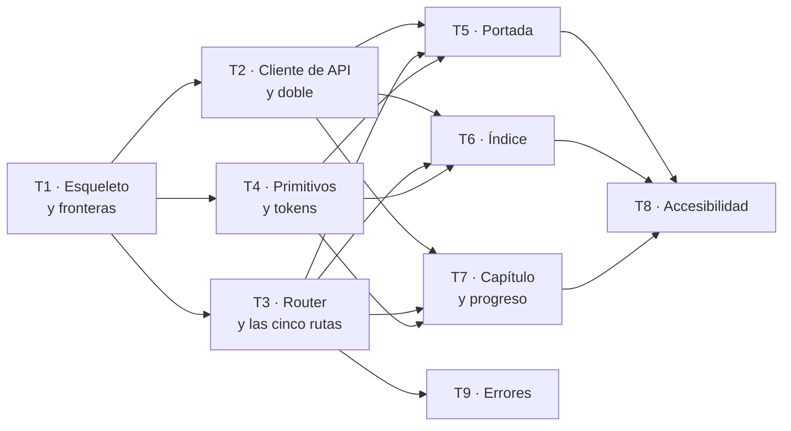

# Fase 1 — Que se pueda leer

**Objetivo:** que alguien abra un enlace y lea la novela entera. Portada con su dedicatoria, índice navegable, diez capítulos y el enlace al PDF. Nada más: aquí no hay ficha, ni correcciones, ni versiones.

**Enfoque:** Vite y TypeScript estricto desde el primer commit, las tres fronteras comprobadas por ESLint desde el primero también, y **el cliente de API generado del OpenAPI** — nunca escrito a mano. La suite corre **sin backend levantado**: la API se sustituye por un doble.

**Stack:** React 19 · TypeScript estricto · Vite · TanStack Query · React Router · Vitest + Testing Library · `axe-core` · ESLint con `import/no-restricted-paths`.

**Spec:** [`spec.md`](spec.md), aprobada por `maujimenez4` el 2026-09-24.

---

## Cuándo se ejecuta este plan: no ahora

**Decisión P-03:** el backend primero. Este plan se escribe hoy y **se implementa cuando exista la Fase 3 del backend**, que es la que publica versiones y sirve la ficha.

Conviene decir lo que eso cuesta, porque es la única pega de haberlo escrito ya: **un plan lejos de su implementación acumula desviaciones.** El OpenAPI del que sale el cliente generado todavía no existe; cuando exista, algunos nombres de campo de este plan serán otros. Eso no es un fallo del plan: es información que aún no está, y el apartado de Desviaciones está para recogerla.

**Lo que sí se gana:** cuando llegue el turno, el trabajo está pensado y se puede repartir el mismo día.

---

## Cómo se reparte entre agentes

Este plan está **diseñado para ejecutarse con varios agentes a la vez**, y por eso las tareas se cortaron por ficheros que no se pisan, no por comodidad de redacción.

### El grafo, que es lo que decide cuántos caben



**Cada columna es una ola**, y el ancho de la columna es cuántos agentes caben. Las nueve aristas del centro son lo que hace que la ola 3 no pueda empezar antes: las tres páginas necesitan el cliente, las rutas **y** los primitivos.

| Ola | Tareas | Agentes a la vez |
| --- | --- | --- |
| 1 | T1 | **1** — bloquea todo |
| 2 | T2 · T3 · T4 | **3** |
| 3 | T5 · T6 · T7 · T9 | **4** |
| 4 | T8 | 1 |

**El punto más ancho son cuatro.** Un quinto agente no acelera nada: no hay una quinta tarea sin dependencias que darle.

**Y lo que de verdad se gana aquí es más que en el backend**, por un motivo de fondo: las tres páginas de la ola 3 —portada, índice y capítulo— **no se llaman entre sí**. Cada una consume el cliente generado y pinta lo suyo. En el backend, el capítulo 5 necesitaba integrado el 4; aquí el índice no necesita nada del capítulo.

Ruta crítica: `T1 → T3 → T7 → T8`. **Cuatro eslabones para nueve tareas.**

### Las cuatro reglas que hay que imponerles

1. **Un agente por fichero.** Ninguna tarea de la misma ola toca un fichero de otra. Está comprobado tarea a tarea en el apartado **Ficheros** de cada una; si al implementar aparece un cruce, es un error del plan y se anota en Desviaciones antes de seguir.
2. **`shared/ui/primitives/` solo lo crea T4**, y esto **no se queda en una regla escrita**. Si a T5, T6 o T7 les falta un primitivo, paran y lo piden. Pero una regla escrita no es un mecanismo, así que T4 añade una regla de lint que **prohíbe colores y espaciados literales fuera de `shared/ui/`**: quien se fabrique un primitivo en su página lo hará con un `#3a2f4b` o un `padding: 14px` a mano, y ahí falla solo.

   No caza todos los casos —nada lo hace—, pero convierte «para y pídelo» en algo que se comprueba. **Esta frontera, cuatro agentes consumiendo primitivos de un quinto, es donde este plan se rompe**, y era el único punto sin nada que lo vigilara.
3. **El cliente generado no se regenera en paralelo.** `pnpm gen:api` sobrescribe `shared/api/generated/`. Lo corre T2 y nadie más.
4. **Un commit por tarea y rebase antes de empujar.** Las tareas de una ola terminan a destiempo y el último en llegar rebasa; con ficheros disjuntos no debería haber conflicto, y si lo hay es la señal de que la regla 1 se rompió.

---

## Restricciones globales

| Restricción | Valor exacto | Origen |
| --- | --- | --- |
| TypeScript | **Estricto. Nada de `any`** en producción | RNF-CAL-02 · `CLAUDE.md` §7 |
| Fronteras | `shared/` **nunca** importa de `features/` · las features **no** se importan entre sí · se entra por `index.ts` | RF-FRO-01/02/03 · `CLAUDE.md` §5.2 |
| Comprobación | Las tres fronteras las falla **ESLint**, no una revisión a mano | RF-FRO-04 |
| Cliente de API | **Generado** del OpenAPI. Un tipo de respuesta a mano es un defecto | RF-EST-03 |
| Estado | Servidor en **TanStack Query**, UI en `useState`/`useReducer`. **Sin store global que los mezcle** | RF-EST-01 |
| Peticiones | **Ningún `fetch` en un componente**: vive en `shared/api/` o en el `api/` de la feature | RF-EST-02 |
| Pruebas | **Sin backend levantado.** La API se sustituye por un doble | RNF-FIA-01 · CA-15 |
| Contenido | Las respuestas se muestran **como datos, nunca como HTML interpretado** | RF-EST-04 · CA-16 |
| Rutas | Portada, índice, capítulo y ficha en **URLs estables**: si cambian, `inspeccion_visual` del backend abre otra página y **sigue dando verde** | RNF-REN-01 · CA-25 |
| Accesibilidad | Foco visible, recorrible **solo con teclado**, etiquetas, contraste **AA**, sin desplazamiento horizontal a 360 px | RF-ACC-01..06 |
| Secreto | El **token no aparece** en el título de la página ni en ninguna traza | RNF-SEG-01 |
| Repositorio | **Ningún fragmento de manuscrito real.** Los tests usan una novela inventada | RD-04 |
| TDD | Rojo → verde → refactor. El test entra **en el mismo commit** | `CLAUDE.md` §3.4 |

**Diseño visual.** La skill `frontend-design` se carga al empezar T4 y gobierna tipografía, color y jerarquía. Su regla de fondo —**no tomar la decisión por defecto**— se aplica en T4 y se hereda en T5, T6 y T7. Pero trabaja **por encima** del suelo de accesibilidad: si una elección estética rompe `RF-ACC-04`, gana la accesibilidad (`architecture.md` §7.2).

---

## Puntos de revisión

Siete entradas que la spec implica y que **ninguna tarea probaría si no se dijeran aquí**.

| # | Entrada o condición | Qué espera una persona razonable | Tarea |
| --- | --- | --- | --- |
| R-1 | **Token inválido o caducado** en la URL | Página legible que dice que el enlace no sirve. No una pantalla en blanco ni un volcado de error | 9 |
| R-2 | Capítulo cuyo texto contiene **`<script>` o `&amp;`** | Se ve **como texto**, tal cual. El manuscrito lo escribió un modelo a partir de texto que aportó una persona | 7 |
| R-3 | Dedicatoria de **una línea** y dedicatoria de **quince** | Las dos se ven bien. Es lo primero que lee el destinatario y no puede romper la portada | 5 |
| R-4 | **`localStorage` bloqueado** —modo privado, cookies desactivadas— | La novela se lee igual. El progreso es una comodidad, no un requisito de lectura | 7 |
| R-5 | Título de capítulo **muy largo** en el índice | No desborda ni empuja la marca de «cambiado» fuera de la vista, ni a 360 px | 6 |
| R-6 | La API tarda, o **falla** | Hay estado de carga y estado de error, y del error **se sale**. Una página que se queda pensando para siempre es peor que un error | 2 |
| R-7 | **Progreso guardado corrupto**: `localStorage` disponible y con `{"leidos": "no soy un array"}` | La novela se lee igual. Es un fallo **distinto** del bloqueo de R-4 y con la misma consecuencia: `getItem` devuelve, el `catch` del almacenamiento no salta, y **el `JSON.parse` revienta fuera del `try`** | 7 |

---

## Estructura de ficheros

`src/frontend/` no existe hoy.

```
src/frontend/
  package.json · vite.config.ts · tsconfig.json · eslint.config.js
  index.html
  src/
    app/
      main.tsx            punto de entrada
      router.tsx          las cinco rutas · T3
      providers.tsx       QueryClientProvider · T3
      estilos.css         tokens de diseño · T4
    features/
      manuscrito/
        index.ts          la ÚNICA puerta de la feature
        api/lectura.ts    hooks de TanStack Query · T2
        components/Portada.tsx    · T5
        components/Indice.tsx     · T6
        components/Capitulo.tsx   · T7
        hooks/useProgreso.ts      · T7
        types/                    · T2
    shared/
      api/cliente.ts      envoltorio del generado · T2
      api/generated/      SALIDA de pnpm gen:api — no se edita a mano · T2
      api/doble.ts        doble determinista para tests · T2
      ui/primitives/      Boton, Enlace, Texto, Aviso · T4
      ui/patterns/        Pagina, EstadoVacio, EstadoError · T4 y T9
      lib/formato.ts      · T4
```

**Por qué `manuscrito` y no una feature nueva:** `CLAUDE.md` §5.2 ya la lista. Crear una feature es una pregunta al usuario (§3, punto 7).

---

## Tarea 1 · Esqueleto, TypeScript estricto y las tres fronteras

Bloquea a las ocho restantes, así que va sola y primero. No entrega interfaz: entrega **lo que rechaza el trabajo mal hecho**.

**Ficheros:**
- Crear: `src/frontend/package.json`, `vite.config.ts`, `tsconfig.json`, `eslint.config.js`, `index.html`, `src/app/main.tsx`
- Test: `src/frontend/src/app/tests/fronteras.test.ts`

**Interfaces:**
- Produce: `pnpm dev`, `pnpm build`, `pnpm test`, `pnpm typecheck`, `pnpm lint` — los consumen **todas** las tareas siguientes.

- [ ] **Paso 1: Escribir el test que falla**

```ts
// src/frontend/src/app/tests/fronteras.test.ts
import { execSync } from "node:child_process";
import { mkdtempSync, writeFileSync, rmSync } from "node:fs";
import { tmpdir } from "node:os";
import { join } from "node:path";
import { describe, expect, it } from "vitest";

function lintDeUnFichero(ruta: string, contenido: string): string {
  writeFileSync(ruta, contenido);
  try {
    execSync(`pnpm eslint ${ruta}`, { stdio: "pipe" });
    return "";
  } catch (e) {
    return String((e as { stdout: Buffer }).stdout);
  } finally {
    rmSync(ruta, { force: true });
  }
}

describe("las tres fronteras las falla ESLint, no una revision a mano", () => {
  it("shared no puede importar de features", () => {
    const salida = lintDeUnFichero(
      "src/shared/lib/_prueba.ts",
      `import { algo } from "../../features/manuscrito";\nexport const x = algo;\n`,
    );
    expect(salida).toContain("no-restricted-paths");
  });

  it("una feature no puede importar de otra", () => {
    const salida = lintDeUnFichero(
      "src/features/manuscrito/_prueba.ts",
      `import { algo } from "../canon";\nexport const x = algo;\n`,
    );
    expect(salida).toContain("no-restricted-paths");
  });

  it("no se entra a una feature por un fichero interno", () => {
    const salida = lintDeUnFichero(
      "src/app/_prueba.ts",
      `import { P } from "../features/manuscrito/components/Portada";\nexport const x = P;\n`,
    );
    expect(salida).toContain("no-restricted-paths");
  });
});
```

**`hash` tiene que ser pura, y esto no es una preferencia de estilo.** La `queryKey` se compara por valor en cada render. Si `hash` lleva sal aleatoria o depende del reloj, **la clave cambia en cada render**, TanStack lo ve como una consulta nueva cada vez y entra en *refetch* infinito. Es el fallo clásico de meter una función en una `queryKey`, y por eso el segundo test de T2 comprueba que dos renders dejan **una sola entrada en caché** — sin él, el arreglo del primer test no cubriría esto.

**Por qué el test ejecuta ESLint y no lee la configuración.** Comprobar que la regla *está escrita* no prueba que *dispare*: una ruta mal puesta en `target` deja la regla presente y desactivada, y la build sigue verde. Este test es el equivalente de `lint-imports` del backend, y como aquel **tiene que verse fallar**.

- [ ] **Paso 2: Ejecutarlo y ver que falla**

`pnpm test fronteras` → **FAIL**: no hay `package.json`.

- [ ] **Paso 3: Configuración mínima**

```jsonc
// package.json (extracto)
{
  "type": "module",
  "scripts": {
    "dev": "vite",
    "build": "tsc -b && vite build",
    "test": "vitest run",
    "typecheck": "tsc --noEmit",
    "lint": "eslint .",
    "gen:api": "openapi-typescript ../../openapi.json -o src/shared/api/generated/schema.d.ts"
  }
}
```

```jsonc
// tsconfig.json (extracto)
{
  "compilerOptions": {
    "strict": true,
    "noUncheckedIndexedAccess": true,
    "noImplicitOverride": true,
    "verbatimModuleSyntax": true,
    "jsx": "react-jsx",
    "moduleResolution": "bundler",
    "paths": { "@/*": ["./src/*"] }
  }
}
```

```js
// eslint.config.js (extracto: las tres fronteras)
import restricted from "eslint-plugin-import";

export default [
  {
    plugins: { import: restricted },
    rules: {
      "@typescript-eslint/no-explicit-any": "error",
      "import/no-restricted-paths": ["error", {
        zones: [
          { target: "./src/shared", from: "./src/features",
            message: "shared nunca importa de features (RF-FRO-01)" },
          { target: "./src/features/manuscrito", from: "./src/features/canon",
            message: "las features no se importan entre si (RF-FRO-02)" },
          { target: "./src/features/canon", from: "./src/features/manuscrito",
            message: "las features no se importan entre si (RF-FRO-02)" },
          { target: "./src/app", from: "./src/features", except: ["*/index.ts"],
            message: "se entra a una feature solo por su index.ts (RF-FRO-03)" },
        ],
      }],
    },
  },
];
```

**Sobre la cuarta zona, y por qué no es `from: "./src/features/*/!(index.ts)"`.** Esa fue la primera redacción y **implementaba a medias la regla que enuncia**: el `*` casa **un solo segmento**, así que alcanzaba `features/manuscrito/Algo.tsx` y **no** `features/manuscrito/components/Portada.tsx` — que es precisamente la forma habitual de saltarse un `index.ts`. La forma documentada es prohibir la carpeta entera y **exceptuar** los `index.ts`, que es literalmente lo que dice `RF-FRO-03`.

Y lo que lo hacía peligroso: como el test **ejecuta ESLint de verdad**, con la redacción mala el test pasa igual y uno se queda creyendo que la frontera está cerrada. Un test que ejecuta la herramienta no salva de una herramienta mal configurada.

- [ ] **Paso 4: Verde y las puertas**

```bash
pnpm install
pnpm test fronteras      # 3 PASS
pnpm typecheck && pnpm lint
```

- [ ] **Paso 5: Comprobar que el test sirve**

Quitar una de las tres zonas de `eslint.config.js` y volver a correr: **su test debe fallar**. Restaurarla. *Es la misma salvaguarda de CA-6 del backend: un test que sigue verde con la regla quitada no comprobaba nada.*

- [ ] **Paso 6: Commit**

```bash
git add src/frontend
git commit -m "Esqueleto del frontend y las tres fronteras, comprobadas por ESLint"
```

---

## Tarea 2 · El cliente generado, el doble, y qué se ve mientras carga

Cierra **RF-EST-02**, **RF-EST-03**, **RNF-FIA-01** y **R-6**.

**Ficheros:**
- Crear: `src/shared/api/cliente.ts`, `src/shared/api/doble.ts`, `src/features/manuscrito/api/lectura.ts`, `src/features/manuscrito/types/index.ts`
- Generado: `src/shared/api/generated/schema.d.ts` — **no se edita a mano**
- Test: `src/shared/api/tests/cliente.test.ts`

**Interfaces:**
- Consume: los scripts de T1.
- Produce: `hash(token) -> string` — **función pura y sin estado**. Ver el aviso de abajo.
- Produce: `useVersion(token)`, `useCapitulo(token, n)`, `useFicha(token)` — hooks de TanStack Query que **consumen T5, T6 y T7**.
- Produce: `DobleDeApi` con `respuestas`, `retraso` y `fallo` — lo consumen **todas** las tareas que prueban una página.
- Produce los tipos `Version`, `Capitulo`, `EntradaDeFicha`, **todos derivados de `schema.d.ts`**, nunca escritos a mano.

- [ ] **Paso 1: Escribir los tests que fallan**

```ts
// src/shared/api/tests/cliente.test.ts
import { renderHook, waitFor } from "@testing-library/react";
import { describe, expect, it } from "vitest";

import { DobleDeApi, conDoble } from "@/shared/api/doble";
import { useVersion } from "@/features/manuscrito";

const VERSION = { id: "v1", titulo: "El verano del 98", capitulos: [{ n: 1, titulo: "Luna" }] };

describe("el cliente de lectura", () => {
  it("pasa sin backend levantado", async () => {
    const doble = new DobleDeApi({ "/versiones/vigente": VERSION });
    const { result } = renderHook(() => useVersion("tok"), { wrapper: conDoble(doble) });
    await waitFor(() => expect(result.current.data?.titulo).toBe("El verano del 98"));
    expect(doble.llamadas).toHaveLength(1);
  });

  it("expone un estado de carga antes de tener datos", () => {
    const doble = new DobleDeApi({ "/versiones/vigente": VERSION }, { retraso: 50 });
    const { result } = renderHook(() => useVersion("tok"), { wrapper: conDoble(doble) });
    expect(result.current.isPending).toBe(true);
  });

  it("expone el error y el reintento del usuario funciona: R-6", async () => {
    const doble = new DobleDeApi({}, { fallo: "500" });
    const { result } = renderHook(() => useVersion("tok"), { wrapper: conDoble(doble) });
    await waitFor(() => expect(result.current.isError).toBe(true));

    doble.arreglar({ "/versiones/vigente": VERSION });   // el backend vuelve
    await result.current.refetch();
    await waitFor(() => expect(result.current.data?.titulo).toBe("El verano del 98"));
  });

  it("el token no aparece en ninguna queryKey: RNF-SEG-01", async () => {
    const cliente = new QueryClient();
    const doble = new DobleDeApi({ "/versiones/vigente": VERSION });
    renderHook(() => useVersion("secreto-123"), { wrapper: conDoble(doble, cliente) });
    await waitFor(() => expect(cliente.getQueryCache().getAll()).toHaveLength(1));

    const claves = cliente.getQueryCache().getAll().map((q) => JSON.stringify(q.queryKey));
    expect(claves.join(" ")).not.toContain("secreto-123");
  });

  it("la clave es estable entre renders: dos renders, una sola entrada en cache", async () => {
    const cliente = new QueryClient();
    const doble = new DobleDeApi({ "/versiones/vigente": VERSION });
    const { rerender } = renderHook(() => useVersion("tok"), { wrapper: conDoble(doble, cliente) });
    rerender(); rerender();
    await waitFor(() => expect(doble.llamadas).toHaveLength(1));
    expect(cliente.getQueryCache().getAll()).toHaveLength(1);
  });
});
```

- [ ] **Paso 2: Ejecutarlos y ver que fallan** → **5 FAIL**.

**Sobre el test del token, y por qué mira la caché y no el resultado.** La primera redacción comprobaba `JSON.stringify(result.current)`, que es lo que devuelve `useQuery` —`data`, `error`, `status`, `refetch`— y **no incluye la `queryKey`**. Ese `expect` era cierto tanto con `hash(token)` como con el token en claro: **el test no podía fallar**, y por tanto no protegía `RNF-SEG-01`. Lo encontró Nubia, y es la misma forma que `test_puerta.py` en el backend — un test con el nombre correcto que rodea el punto donde el sistema falla.

**Sobre el reintento.** `refetch` es el patrón de TanStack Query para el reintento **disparado por el usuario**, distinto del `retry` automático; aquí se quiere el botón, así que es ese. Lo que no vale es afirmar que `refetch` es una función: **siempre lo es**, con error o sin él. El test tiene que arreglar el doble y comprobar que los datos llegan.

- [ ] **Paso 3: Implementar**

`cliente.ts` envuelve `fetch` una sola vez y tipa la respuesta contra `schema.d.ts`. `lectura.ts` expone los hooks. **Ningún componente llama a `fetch`**: es lo que comprueba el lint de T1 y lo que `RF-EST-02` exige.

```ts
// src/features/manuscrito/api/lectura.ts
import { useQuery } from "@tanstack/react-query";

import { pedir } from "@/shared/api/cliente";
import type { components } from "@/shared/api/generated/schema";

export type Version = components["schemas"]["VersionPublicada"];

export function useVersion(token: string) {
  return useQuery({
    queryKey: ["version", hash(token)],   // el token no va en claro (RNF-SEG-01)
    queryFn: () => pedir<Version>(`/l/${token}/versiones/vigente`),
  });
}
```

- [ ] **Paso 4: Verde** — `pnpm test cliente` → **4 PASS**

- [ ] **Paso 5: Comprobar que el generado es el generado**

```bash
pnpm gen:api && git diff --exit-code src/shared/api/generated/
```

Si hay diferencia, alguien editó a mano lo que se genera. *Mientras el backend no exista se usa un OpenAPI de ejemplo commiteado; cuando exista, se regenera y **este paso es el que avisa** de qué campos cambiaron.*

- [ ] **Paso 6: Commit**

```bash
git add src/frontend/src/shared/api src/frontend/src/features/manuscrito/api
git commit -m "Cliente de API generado del OpenAPI, con su doble y sus estados"
```

---

## Tarea 3 · Las cinco rutas, y que no se muevan

Cierra **RI-01** a **RI-05** y **RNF-REN-01**. Es una tarea pequeña con una responsabilidad grande: **si una ruta cambia, el validador visual del backend abre otra página y sigue dando verde.**

**Ficheros:**
- Crear: `src/app/router.tsx`, `src/app/providers.tsx`
- Test: `src/app/tests/rutas.test.tsx`

**Interfaces:**
- Produce: las cinco rutas y el `RUTAS` exportado que **consumen T5, T6, T7 y T9** para enlazar sin escribir cadenas a mano.

```ts
export const RUTAS = {
  portada: (t: string) => `/l/${t}`,
  indice: (t: string) => `/l/${t}/indice`,
  capitulo: (t: string, n: number) => `/l/${t}/capitulo/${n}`,
  ficha: (t: string) => `/l/${t}/ficha`,
  novedades: (t: string) => `/l/${t}/novedades`,
} as const;
```

- [ ] **Paso 1: Escribir el test que falla**

```tsx
// src/app/tests/rutas.test.tsx
import { describe, expect, it } from "vitest";
import { RUTAS } from "@/app/router";

describe("las rutas son estables", () => {
  it("son exactamente las que el validador visual del backend abre", () => {
    expect(RUTAS.portada("T")).toBe("/l/T");
    expect(RUTAS.indice("T")).toBe("/l/T/indice");
    expect(RUTAS.capitulo("T", 4)).toBe("/l/T/capitulo/4");
    expect(RUTAS.ficha("T")).toBe("/l/T/ficha");
    expect(RUTAS.novedades("T")).toBe("/l/T/novedades");
  });
});
```

**Este test parece tonto y no lo es.** Congela un contrato que vive **fuera de este repositorio**: `RF-VAL-08` de la spec 001 abre estas URLs. Cambiar `/indice` por `/contenidos` no rompería nada aquí y dejaría al validador visual comprobando una página de error con cara de éxito.

- [ ] **Paso 2: Ejecutarlo y ver que falla** → **FAIL**, no existe `router`.
- [ ] **Paso 3: Implementar** el router con las cinco rutas apuntando a componentes vacíos, y `providers.tsx` con el `QueryClientProvider`.
- [ ] **Paso 4: Verde**, y `pnpm dev` sirve las cinco sin error de consola.
- [ ] **Paso 5: Commit** — `git commit -m "Las cinco rutas de la lectura, y un test que las congela"`

---

## Tarea 4 · Primitivos, tokens y la decisión estética

**Carga primero la skill `frontend-design`.** Esta es la tarea donde se decide cómo se ve todo lo demás, y las tres de la ola siguiente heredan lo que aquí se elija.

**Ficheros:**
- Crear: `src/app/estilos.css`, `src/shared/ui/primitives/{Boton,Enlace,Texto,Aviso}.tsx`, `src/shared/ui/patterns/Pagina.tsx`, `src/shared/lib/formato.ts`
- Test: `src/shared/ui/tests/primitives.test.tsx`

**Interfaces:**
- Produce: los cuatro primitivos y `Pagina`, que **consumen T5, T6, T7 y T9**.
- Produce los tokens CSS: `--tinta`, `--papel`, `--acento`, `--medida`, y la escala tipográfica.

**Lo que la skill pide y aquí se aplica:** tomar una **dirección estética** antes de escribir componentes, y no la decisión por defecto. Esto es una novela de regalo que se lee de una sentada en un móvil: la jerarquía la manda el **texto**, no la interfaz. `--medida` existe porque `RF-ACC-05` pide una medida de línea legible, y una novela a ancho completo de pantalla no se lee.

**Lo que la skill NO decide:** el contraste. `RF-ACC-04` exige **AA** y gana sobre cualquier elección estética (`architecture.md` §7.2).

- [ ] **Paso 1: Escribir el test que falla**

```tsx
// src/shared/ui/tests/primitives.test.tsx
import { render, screen } from "@testing-library/react";
import { axe } from "vitest-axe";
import { describe, expect, it } from "vitest";

import { Boton, Aviso } from "@/shared/ui/primitives";

describe("los primitivos", () => {
  it("el boton es accesible y tiene foco visible", async () => {
    const { container } = render(<Boton>Seguir leyendo</Boton>);
    expect(await axe(container)).toHaveNoViolations();
    const estilos = getComputedStyle(screen.getByRole("button"), ":focus-visible");
    expect(estilos.outlineStyle).not.toBe("none");
  });

  it("el aviso se anuncia a un lector de pantalla", async () => {
    render(<Aviso tono="error">No se pudo cargar</Aviso>);
    expect(screen.getByRole("alert")).toHaveTextContent("No se pudo cargar");
  });

  it("ningun primitivo importa de una feature", () => {
    // RF-FRO-01. El lint lo comprueba; esto lo deja dicho donde se lee.
    expect(true).toBe(true);
  });
});
```

- [ ] **Paso 2: Falla.** **Paso 3:** implementar tokens y primitivos. **Paso 4:** verde.
- [ ] **Paso 5: Comprobar el contraste con herramienta**, no a ojo: `axe` sobre una página de ejemplo con los tokens aplicados.
- [ ] **Paso 6: Commit** — `git commit -m "Tokens de diseno y primitivos accesibles"`

---

## Tarea 5 · Portada con la dedicatoria

Cierra **RF-POR-01**, **RF-POR-02**, **RF-POR-03**, **CA-2** y **R-3**.

**Ficheros:** crear `src/features/manuscrito/components/Portada.tsx` · test junto a él.

**Interfaces:** consume `useVersion` (T2), `RUTAS` (T3), `Pagina` y `Texto` (T4).

- [ ] **Paso 1: Escribir los tests que fallan**

```tsx
describe("la portada", () => {
  it("muestra la dedicatoria del comprador", () => {
    render(<Portada />, { wrapper: conDoble(dobleConDedicatoria("Para Marta, que nunca se rinde.")) });
    expect(screen.getByText(/Para Marta, que nunca se rinde\./)).toBeInTheDocument();
  });

  it("la dedicatoria NO es un capitulo: regla de dominio 15", () => {
    render(<Portada />, { wrapper: conDoble(dobleConDedicatoria("Para Marta.")) });
    expect(screen.queryByText(/Cap[ií]tulo 0/)).not.toBeInTheDocument();
    expect(screen.getByTestId("dedicatoria").closest("[data-capitulo]")).toBeNull();
  });

  it.each([["una linea", "Para Marta."], ["quince", "Para Marta.\n".repeat(15)]])(
    "se ve bien con dedicatoria de %s: R-3",
    (_caso, texto) => {
      render(<Portada />, { wrapper: conDoble(dobleConDedicatoria(texto)) });
      const d = screen.getByTestId("dedicatoria");
      expect(d.scrollHeight).toBeLessThanOrEqual(d.clientHeight + 1);
    },
  );

  it("desde la portada se entra al indice, a la ficha y al PDF, y a nada mas", () => {
    render(<Portada />, { wrapper: conDoble(dobleNormal()) });
    const destinos = screen.getAllByRole("link").map((a) => a.getAttribute("href"));
    expect(destinos).toEqual(["/l/tok/indice", "/l/tok/ficha", "/l/tok/versiones/v1/pdf"]);
  });
});
```

- [ ] **Pasos 2-4:** falla, implementar, verde.
- [ ] **Paso 5: Commit** — `git commit -m "Portada con la dedicatoria, que no es un capitulo"`

---

## Tarea 6 · Índice navegable y la marca de lo cambiado

Cierra **RF-IND-01**, **RF-IND-02**, **RF-IND-03**, **CA-3** y **R-5**.

**Ficheros:** crear `src/features/manuscrito/components/Indice.tsx` · test junto a él.

- [ ] **Paso 1: Escribir los tests que fallan**

```tsx
describe("el indice", () => {
  it("lista los diez capitulos y enlaza a cada uno", () => {
    render(<Indice />, { wrapper: conDoble(dobleConDiezCapitulos()) });
    expect(screen.getAllByRole("link")).toHaveLength(10);
  });

  it("marca los cambiados con el dato del backend, sin calcularlo", () => {
    render(<Indice />, { wrapper: conDoble(dobleConCambiados([4, 7])) });
    expect(screen.getByTestId("cap-4")).toHaveAttribute("data-cambiado", "true");
    expect(screen.getByTestId("cap-5")).toHaveAttribute("data-cambiado", "false");
  });

  it("en la primera version no marca ninguno", () => {
    render(<Indice />, { wrapper: conDoble(doblePrimeraVersion()) });
    expect(screen.queryByText(/cambiado/i)).not.toBeInTheDocument();
  });

  it("un titulo muy largo no expulsa la marca: R-5", () => {
    render(<Indice />, { wrapper: conDoble(dobleConTituloLargo()) });
    const marca = screen.getByTestId("marca-cap-1");
    expect(marca.getBoundingClientRect().right).toBeLessThanOrEqual(window.innerWidth);
  });
});
```

**Sobre el segundo test.** `RF-IND-02` dice que el cliente **no calcula** qué cambió: lo da el backend por diferencia de texto (`RF-PUB-06`). Un frontend que comparase textos daría otra respuesta que el `CuadroDeDefectos`, y entonces **la lectura y la página de novedades dirían cosas distintas** sobre la misma versión.

- [ ] **Pasos 2-4:** falla, implementar, verde. **Paso 5: Commit.**

---

## Tarea 7 · El capítulo, la navegación y el progreso

Cierra **RF-LEC-01**, **RF-LEC-02**, **RF-LEC-04**, **RF-LEC-05**, **RD-01**, **RD-02**, **CA-16**, **R-2** y **R-4**.

**Ficheros:** crear `components/Capitulo.tsx`, `hooks/useProgreso.ts` · tests junto a ellos.

**Interfaces:** produce `useProgreso()` con `leidos: number[]` y `marcarLeido(n)`, que **consume la Fase 2** para el revelado de la ficha.

- [ ] **Paso 1: Escribir los tests que fallan**

```tsx
describe("el capitulo", () => {
  it("el primero no ofrece anterior y el decimo no ofrece siguiente", () => {
    render(<Capitulo n={1} />, { wrapper: conDoble(d) });
    expect(screen.queryByRole("link", { name: /anterior/i })).toBeNull();
  });

  it("la prosa con HTML se muestra como texto, no se interpreta: R-2, CA-16", () => {
    const texto = 'Marta dijo: <script>alert("x")</script> y salio de casa.';
    render(<Capitulo n={1} />, { wrapper: conDoble(dobleConTexto(texto)) });
    expect(screen.getByText(texto)).toBeInTheDocument();
    expect(document.querySelector("script")).toBeNull();
  });

  it("abrir un capitulo lo marca como leido", () => {
    render(<Capitulo n={3} />, { wrapper: conDoble(d) });
    expect(leerProgreso("tok").leidos).toContain(3);
  });

  it("con localStorage bloqueado la novela se lee igual: R-4", () => {
    bloquearLocalStorage();   // lanza en get y en set
    expect(() => render(<Capitulo n={3} />, { wrapper: conDoble(d) })).not.toThrow();
    expect(screen.getByRole("article")).toBeInTheDocument();
  });

  it("con progreso corrupto la novela se lee igual: R-7", () => {
    localStorage.setItem("progreso:tok", '{"leidos": "no soy un array"}');
    expect(() => render(<Capitulo n={3} />, { wrapper: conDoble(d) })).not.toThrow();
    expect(screen.getByRole("article")).toBeInTheDocument();
    expect(leerProgreso("tok").leidos).toEqual([]);   // se descarta, no se hereda
  });
});
```

**Sobre R-4, R-7 y las tres direcciones en que esto falla.** `RD-02` dice que perder el progreso **degrada, no rompe**, y hay **tres** formas de romperlo, no dos:

| | Qué pasa | Dónde salta |
| --- | --- | --- |
| Leer | Modo privado: `getItem` lanza | `try` del almacenamiento |
| Escribir | Cuota llena o cookies bloqueadas: `setItem` lanza | `try` del almacenamiento |
| **Interpretar** | `localStorage` funciona y **contiene basura** —de una versión anterior, de otra pestaña, de una escritura a medias— | **Fuera del `try`**, en el `JSON.parse` |

La tercera es la que faltaba y la encontró Nubia. Es la peor de las tres porque **el `catch` del almacenamiento no salta**: `getItem` devuelve tranquilamente una cadena inválida. Y si eso ocurre en el inicializador de `useState`, sube durante el render y **el destinatario no abre su regalo** — que es exactamente lo que R-4 existía para evitar, resuelto solo a dos tercios.

- [ ] **Pasos 2-4:** falla, implementar con `try/catch` que envuelva **también el parse** y valide la forma antes de aceptarla, verde.
- [ ] **Paso 5: Commit** — `git commit -m "Lectura de capitulo, navegacion y progreso que degrada sin romper"`

---

## Tarea 8 · Accesibilidad sobre las páginas reales

Cierra **RF-ACC-01** a **RF-ACC-06**, **CA-12** y **CA-13**. Va la última de la fase porque necesita las tres páginas hechas.

**Ficheros:** crear `src/app/tests/accesibilidad.test.tsx`; modificar lo que haga falta de T5, T6 y T7 para pasarlo.

- [ ] **Paso 1: Escribir los tests que fallan**

```tsx
describe("accesibilidad de la lectura", () => {
  it.each(["portada", "indice", "capitulo"])("%s no tiene violaciones de axe", async (p) => {
    const { container } = render(<Pagina nombre={p} />, { wrapper: conDoble(d) });
    expect(await axe(container)).toHaveNoViolations();
  });

  it("se recorre entera solo con teclado", async () => {
    render(<Indice />, { wrapper: conDoble(d) });
    const usuario = userEvent.setup();
    const visitados: string[] = [];
    for (let i = 0; i < 12; i++) {
      await usuario.tab();
      visitados.push(document.activeElement?.textContent ?? "");
    }
    expect(visitados.filter(Boolean)).toHaveLength(12);
  });

  it("no hay desplazamiento horizontal a 360 px", () => {
    window.innerWidth = 360;
    render(<Capitulo n={1} />, { wrapper: conDoble(d) });
    expect(document.documentElement.scrollWidth).toBeLessThanOrEqual(360);
  });

  it("el titulo de la pagina cambia con la ruta, y no lleva el token", () => {
    render(<Capitulo n={4} />, { wrapper: conDoble(d) });
    expect(document.title).toContain("Capítulo 4");
    expect(document.title).not.toContain("tok");
  });
});
```

**Y aquí va escrito lo que este validador NO demuestra**, porque es el punto ciego que `verification.md` §8 declara sin suavizar: **`axe` caza una fracción de lo que encuentra una persona con un lector de pantalla.** Pasar los cuatro tests no es ser accesible, igual que renderizar no lo era. Es el suelo.

- [ ] **Pasos 2-4:** falla, corregir las páginas, verde.
- [ ] **Paso 5: Commit** — `git commit -m "Accesibilidad comprobada con herramienta sobre las tres paginas"`

---

## Tarea 9 · Que de los errores se salga

Cierra **RF-LEC-03**, **CA-19** y **R-1**. Solo depende de T3, así que puede correr en la ola 3 con las tres páginas.

**Ficheros:** crear `src/shared/ui/patterns/EstadoError.tsx`, `EstadoVacio.tsx` · test junto a ellos.

- [ ] **Paso 1: Escribir los tests que fallan**

```tsx
describe("los estados que no son el feliz", () => {
  it("un capitulo que no existe da una pagina legible, no una en blanco", () => {
    render(<Capitulo n={99} />, { wrapper: conDoble(d) });
    expect(screen.getByRole("alert")).toHaveTextContent(/no existe/i);
    expect(screen.getByRole("link", { name: /volver al [ií]ndice/i })).toBeInTheDocument();
  });

  it("un token invalido lo dice y no vuelca un error: R-1", () => {
    render(<Portada />, { wrapper: conDoble(new DobleDeApi({}, { fallo: "404" })) });
    expect(screen.getByRole("alert")).toHaveTextContent(/enlace/i);
    expect(screen.queryByText(/stack|TypeError|undefined/i)).toBeNull();
  });
});
```

**Sobre el segundo.** Un token inválido es el caso más probable de todos: el enlace se comparte por WhatsApp y se corta. Lo que no puede pasar es que el destinatario vea un volcado de error donde esperaba su regalo — ni que el mensaje le diga *por qué* falló, que es información del sistema y no suya.

- [ ] **Pasos 2-4:** falla, implementar, verde. **Paso 5: Commit.**

---

## Lo que esta fase deja cerrado

| Criterio | Qué demuestra |
| --- | --- |
| **CA-2** | La dedicatoria se ve y **no es un capítulo** |
| **CA-3** | Diez capítulos, enlazados, con la marca de cambiados del backend |
| **CA-12** · **CA-13** | Teclado, foco, contraste AA, 360 px |
| **CA-14** | Un import entre features **falla la build** |
| **CA-15** | La suite pasa **sin backend levantado** |
| **CA-16** | Un capítulo con `<script>` se muestra, no se ejecuta |
| **CA-19** | Un capítulo inexistente da página legible |
| **CA-21** *(parcial)* | Las cinco rutas responden; «anterior» y «siguiente» en sus extremos |
| **CA-22** | Ningún `fetch` en un componente; tipos generados |
| **CA-25** | Las rutas que abre el validador visual del backend **están congeladas** |

## Lo que NO hace, y no es olvido

- **No hay ficha de personajes.** Es la Fase 2, con el revelado progresivo y el `no_revelado_no_se_envia`.
- **No hay corrección, ni espera, ni novedades, ni versiones.** Es la Fase 3, y depende de la Fase 3 del backend.
- **El PDF solo se enlaza.** Lo genera el backend (`RF-PDF-02`).
- **`useProgreso` nace aquí pero se usa en la Fase 2:** aquí solo registra; allí decide qué se revela.
- **No se valida la respuesta del backend**, y esto se declara aquí en vez de descubrirse después.

**El hueco, dicho con todas las letras.** `pedir<Version>(...)` hace `await res.json()` y lo **afirma** como `Version`. Los tipos generados del OpenAPI son una **promesa de forma, no una comprobación**: si el backend devuelve un campo `null` donde el esquema decía obligatorio, o un error con otra forma, o sirve una versión del OpenAPI distinta de la que generó este cliente, **TypeScript se lo cree** y el fallo aparece tres componentes más allá como un `undefined` incomprensible.

Y hay una asimetría que conviene ver escrita: **el backend valida en su frontera con Pydantic y el frontend no valida en la suya.** El mismo proyecto trata sus dos fronteras con criterios opuestos, y la única razón de que aquí no se valide es que un validador de esquema en tiempo de ejecución sería **una dependencia nueva** que la 002 no declara (`CLAUDE.md` §3, punto 7).

Queda como riesgo declarado de esta fase. La decisión —añadirlo o asumirlo— es de quien apruebe el plan, no del plan.

---

## Desviaciones

*Se anotan **antes** de seguir, no después (`CLAUDE.md` §3.4).*

| Fecha | Paso | Qué se desvió y por qué |
| --- | --- | --- |
| 2026-09-24 | T2 · cliente generado | **El OpenAPI ya existe y no contiene nada de lo que esta tarea consume.** Levantado el esquema real de `crear_app()`: ocho rutas, todas de **generación** —`POST /entrevistas`, `POST /obras/{id}/outline`, `POST /obras/{id}/novela`, `POST /capitulos/{id}/escribir`, `GET /capitulos/{id}/contexto`, `GET /trabajos/{id}`— y quince esquemas, ninguno de lectura. **No existe `components["schemas"]["VersionPublicada"]`**, ni `Capitulo` de lectura, ni `EntradaDeFicha`. La ruta `/versiones/vigente` que el test del paso 1 llama por el doble **no existe en el backend**. `pnpm gen:api` correría hoy y produciría un `schema.d.ts` sin un solo tipo de los que T2 dice derivar, así que los tres hooks —`useVersion`, `useCapitulo`, `useFicha`— no tienen de dónde salir. No es que los nombres de campo sean otros: es que **la superficie de lectura no está publicada todavía**. |
| 2026-09-24 | T2, T5, T6, T7 | **La causa común: falta la fase del backend que publica.** Las 21 tablas del esquema no incluyen ninguna de publicación —`version_publicada` no existe— y `dedicatoria` no aparece en ningún modelo: la única coincidencia en el código es el nombre de un validador (`dedicatoria_fuera`). `RF-PUB-06` —los capítulos cambiados por diferencia de texto, que T6 pinta— y `RF-PUB-07` —el identificador no adivinable, que es el `token` de las cinco rutas de T3— **están en la spec 001 y sin implementar**. Por eso las cuatro tareas caen juntas y no por separado: no es un desajuste de nombres, es una precondición que no se cumple. |
| 2026-09-24 | T5 · portada | **La dedicatoria no existe como dato en ninguna parte del backend.** Ni tabla, ni columna, ni esquema. Los dos tests del paso 1 se pueden escribir contra el doble, pero el doble estaría fijando una forma que nadie ha decidido. Conviene no congelarla aquí: la regla de dominio 15 dice qué **no** es la dedicatoria —no es prosa del manuscrito, no entra en el ensamblado ni en la lista negra— y no dice dónde vive. |
| 2026-09-24 | T3 · las cinco rutas | **El test fija un contrato con algo que no existe.** Dice que las rutas «son exactamente las que el validador visual del backend abre», y ese validador visual **no está en el repositorio**: no hay ninguna referencia a captura de pantalla ni a navegador en `src/backend/`, en la spec 001 ni en `docs/`. Las cinco rutas en sí **se sostienen** —son del router de React y no dependen del OpenAPI—, así que la tarea es implementable; lo que no se sostiene es la justificación de por qué no pueden moverse. O el validador entra en la Fase 4 del backend y entonces el contrato es real, o la frase se corrige para no prometer un acoplamiento que nadie comprueba. |
| 2026-09-24 | Alcance de la fase | **Tres de las nueve tareas no dependen del backend y podrían firmarse hoy:** T1 (esqueleto, TypeScript estricto y las tres fronteras por ESLint), T3 (las rutas, con la corrección de arriba) y T4 (primitivos, tokens y decisión estética). Las otras seis —T2, T5, T6, T7, T8 y T9— consumen datos que no existen. **No se propone partir la fase por eso**: `CLAUDE.md` §3.3 bis pide que cada plan entregue software que funciona y se pueda probar solo, y unos cimientos sin una sola página que leer no lo son. Se anota para que la decisión de esperar sea deliberada y no un descubrimiento a mitad de T2. |

| 2026-09-24 | T2, T5, T6, T7 | **El bloqueo se levanta: la Fase 4 del backend reescribió su T9 con las cinco rutas de lectura.** `GET /lectura/{token}`, `/capitulos/{numero}`, `/ficha`, `/pdf` y `/versiones`, **ninguna con `obra_id`**, y los tres esquemas que este plan deriva. La portada trae `dedicatoria` y los diez capítulos con `titulo` y `cambiado`, y **no trae la prosa** —hay un test en negativo que lo fija—; el texto se pide capítulo a capítulo, que es lo que T7 ya asumía. Cruzado campo por campo el 2026-09-24: **T2 ya tiene de dónde salir.** |
| 2026-09-24 | T2 · nombres de campo | **Dos alias, y los dos se resuelven cambiando este plan, no el backend.** El ejemplo de T2 escribe `{ n: 1, titulo: "Luna" }` y el backend sirve **`numero`**; `CLAUDE.md` §2 dice que el mismo concepto se llama igual en el esquema, los prompts y la interfaz, así que **se adopta `numero`** en tipos, hooks y componentes. Y la marca de cambiado llega como **booleano por capítulo** (`capitulos[i].cambiado`), no como lista de números: el helper `dobleConCambiados([4, 7])` de T6 construye capítulos con `cambiado: true` en esos dos en vez de recibir la lista. Ninguno de los dos obliga a un alias raro; se anotan porque el código de test de T6 y T2 queda literalmente distinto. |
| 2026-09-24 | T3 · la quinta ruta | **`novedades` está congelada y esta fase declara que no la hace.** T3 fija las cinco rutas de la SPA y **CA-21 exige que «las cinco rutas responden»**, pero «Lo que NO hace» dice que no hay novedades ni versiones hasta la Fase 3. Las dos cosas no pueden ser ciertas a la vez: o `/l/{t}/novedades` responde algo —aunque sea una página que dice que aún no hay novedades— o CA-21 se cumple por vacío en su quinta ruta, que es el modo de fallo que este proyecto ya ha visto tres veces. La ruta de backend que la surtirá, `/lectura/{token}/versiones`, **existe desde la Fase 4** y no la consume ningún hook de T2: eso es correcto, es de la Fase 3. Lo que hay que decidir es qué responde la ruta mientras tanto. |

**El aviso de este apartado venció, y así fue.** El plan decía que se esperaba al menos una desviación porque el OpenAPI no existía aún, y que el paso 5 de T2 —`pnpm gen:api` con `git diff --exit-code`— sería quien lo destapase. Se destapó antes, releyendo el plan contra el esquema real, que es más barato que descubrirlo con el cliente ya escrito. Lo que el aviso no anticipaba es **de qué tamaño** sería: no son nombres de campo distintos, es que la mitad de la superficie que este plan consume todavía no está publicada.
