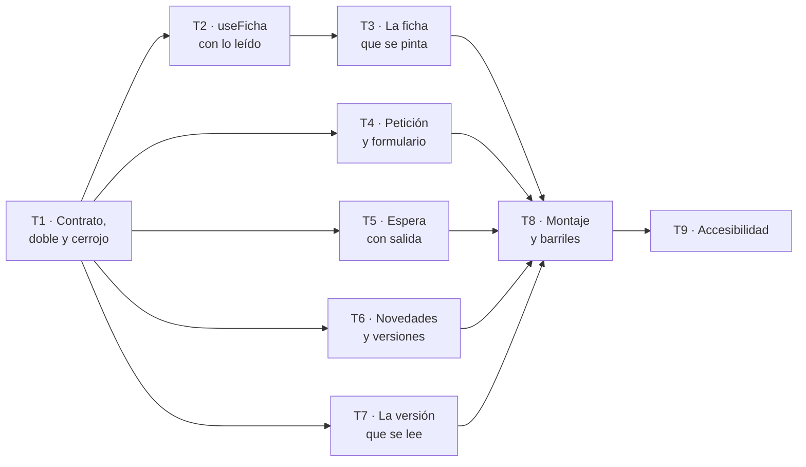

# Fase 2 — La ficha, la petición y la espera

**Objetivo:** que la ficha de personajes y lugares exista **sin contar el futuro**, que desde cada entrada se pueda pedir una corrección, que mientras se regenera haya una espera con salida, y que al terminar se vea qué cambió y se pueda leer la versión de antes.

**Enfoque:** el revelado **no es una decisión de pintado**. Lo no revelado no llega al navegador, así que la petición de la ficha viaja con lo que se ha leído y el filtro lo hace el backend. Todo lo demás cuelga de ahí: los enlaces recortados, el número de pendientes y el `hc_id` con el que viaja la petición.

**Stack:** el de la Fase 1, sin añadir nada. React 19 · TypeScript estricto · Vite · TanStack Query · React Router · Vitest + Testing Library · `axe-core` · ESLint con `import/no-restricted-paths`.

**Spec:** [`spec.md`](spec.md), aprobada por `maujimenez4` el 2026-09-24.

**Fase anterior:** [`plan-1-lectura.md`](plan-1-lectura.md). Esta fase **consume lo que aquella produce** y no lo redefine: `useProgreso()` con `leidos: number[]`, `RUTAS`, los primitivos de `shared/ui`, el cliente generado, el doble y sus estados.

---

## Cuándo se ejecuta este plan: no ahora

**Dos cosas tienen que estar antes**, y ninguna depende de este plan:

| Dependencia | Qué aporta | Estado hoy |
| --- | --- | --- |
| **Fase 1 del frontend** | `useProgreso`, `RUTAS`, primitivos, cliente y doble | plan escrito, en `borrador`, **sin implementar** |
| **Fase 5 del backend** | La petición de cambio: `RF-PET-01` a `08`, `RI-09` | **no empezada** ([`hoja-de-ruta.md`](../hoja-de-ruta.md)) |

La Fase 5 del backend es la que **construye la petición de cambio**, y sin ella tres cuartas partes de este plan no tienen contra qué probarse de punta a punta: la corrección, la espera y las novedades salen todas de ahí. La ficha sola dependería únicamente de la Fase 4 —que publica y deriva la `FichaDeLectura`—, pero partir la fase por ahí dejaría una ficha con un botón de corregir que no lleva a ningún sitio.

**Y hay algo peor que la espera, que es lo que este plan tiene que decir antes que nada:** la Fase 5 del backend, tal y como está escrita hoy, **no promete cinco de las cosas que esta fase necesita**. Están en el apartado siguiente, con nombre y con la forma exacta que hacen falta. No es una queja: es la lista que alguien tiene que firmar antes de que este plan se pueda ejecutar, y se escribe ahora porque **escribirla después sale caro** — pasó con `P-02` de la 002 y costó volver a firmar la spec 001 entera.

---

## Lo que esta fase necesita y el backend no promete

Cinco huecos. Cada uno dice el requisito que lo pide, lo que la 001 promete hoy, y la forma mínima que haría falta. **Ninguno lo puede resolver el navegador**, y ese es justamente el motivo de que estén aquí.

### H-1 · La ficha filtrada por lo leído, y el número de pendientes

**Lo pide:** `RF-FIC-03`, `RF-FIC-04`, `RF-FIC-05`, `CA-4`, `CA-5`.
**La 001 promete:** `RI-11` — `GET /obras/{id}/versiones/{v}/ficha`, y `RF-PUB-05` dice que la `FichaDeLectura` lleva **todas** las entradas, cada una con **todos** los capítulos en que aparece.
**Falta:** que ese extremo acepte **qué capítulos se han leído** y devuelva solo lo que corresponde, con los capítulos de cada entrada **ya recortados**, más la cuenta de las que quedan.

```
GET /obras/{token}/versiones/{v}/ficha?leidos=1,2,3
→ { "entradas": [ { "hc_id": …, "entidad": …, "tipo": "personaje"|"lugar",
                    "descripcion": …, "capitulos": [1,3] } ],
    "pendientes": 14 }
```

**Y hay una contradicción que alguien tiene que resolver, porque no la puede resolver un plan.** `RD-01` dice que el progreso de lectura «no es un dato del dominio **ni viaja al backend**». `RF-FIC-04` dice que lo no revelado **no se envía al navegador**. Las dos son `M`, y **no se pueden cumplir las dos a la vez**: para filtrar hay que saber por dónde va quien lee, y solo lo sabe el navegador.

La lectura que este plan propone, y que necesita firma: **`RD-01` prohíbe que el progreso se guarde en el dominio, no que se use como parámetro de una consulta.** Se envía, se usa para filtrar esa respuesta, y no se persiste ni entra en el ledger. Si la firma dice que no, la única alternativa es renunciar a `RF-FIC-04` —filtrar en el navegador con todo ya descargado—, y entonces `CA-4` no se cumple y hay que decirlo en la spec, no en el plan.

**El número de pendientes también es del backend**, por el mismo motivo: el navegador no puede contar lo que no ha recibido.

**Y un detalle pequeño que arrastra la Fase 1:** aquel plan pide `/versiones/vigente`, tratando `vigente` como un identificador de versión más. La 001 promete la **lista** (`GET /obras/{id}/versiones`) y **una por identificador**, no ese alias. Esta fase lo sigue usando —cambiarlo sería rehacer la Fase 1— y lo deja dicho: o el backend acepta `vigente` como alias, o las dos fases piden la lista primero y se quedan con la que trae `vigente: true`.

### H-2 · A cuántos capítulos afecta una corrección, antes de enviarla

**Lo pide:** `RF-PET-03` (prioridad `S`), `CA-24`.
**La 001 promete:** `RF-PET-03` determina los capítulos afectados **al atender** la petición, dentro del trabajo. No hay extremo que lo pregunte antes.
**Falta:**

```
GET /obras/{token}/hechos/{hc_id}/impacto
→ { "capitulos_afectados": 3 }
```

**Y aquí hay un spoiler de la misma familia que `CA-5`, que conviene ver antes de implementarlo.** A quien va por el capítulo 3 y corrige a un personaje, decirle «esto afecta a 3 capítulos» **le está contando que el personaje vuelve dos veces más** — exactamente lo que `CA-5` existe para impedir un nivel más arriba. No es una objeción al requisito: es que el número tiene que salir del **mismo criterio** que la ficha, contando solo capítulos leídos, o no salir.

Por eso el extremo de arriba lleva `?leidos=` también, o `RF-PET-03` se degrada. Como es `S`, la degradación está permitida: **si el backend no lo ofrece, no se muestra la cuenta, y `CA-24` se queda abierto y dicho.** Lo que no se hace es contarlo en el navegador: sería contar sobre una ficha ya recortada y daría un número falso.

### H-3 · Saber que hay una regeneración en curso sin haberla pedido

**Lo pide:** `RF-ESP-01`, `CA-26`, y sobre todo el párrafo de `D-05` que dice que quien no pidió nada **se queda sin su regalo durante minutos**.
**La 001 promete:** `RI-06` — `GET /trabajos/{id}`, por identificador de trabajo.
**Falta:** quien envió la petición tiene ese identificador; **quien abrió el enlace en otro navegador no tiene nada**. Sin esto, `RF-ESP-01` solo se cumple para una de las dos personas, que es justo la que no lo necesita.

```
GET /obras/{token}/estado
→ { "peticion_en_curso": 42 }   // o null
```

### H-4 · El avance por capítulo de una regeneración

**Lo pide:** `RF-ESP-02`, `RF-PET-05`, `CA-26` — «por capítulo, con el estado que da el backend, **no una barra de progreso inventada**».
**La 001 promete, y no es lo que parece:** `GET /trabajos/{id}` devuelve **un trabajo, que es de un solo capítulo** (`src/backend/app/features/escritura/router.py:216` — `capitulo_id`, `numero_de_capitulo`). Y `NovelaLanzada` dice con todas las letras que los identificadores de trabajo **no existen por adelantado**: «los abre el bucle, uno por capítulo».
**Falta:** algo que se pueda consultar con un solo identificador y devuelva **la lista**. `RI-10` de esta spec dice «consume `GET /trabajos/{id}` — estado de la regeneración, legible por capítulo», y eso **supone un trabajo que cubre la regeneración entera**, que no es lo que el backend tiene.

```
GET /obras/{token}/peticiones/{pid}
→ { "id": 42, "estado": "en_curso"|"publicada"|"no_aplicada",
    "motivo": null, "texto_pedido": "…", "version_resultante": null,
    "capitulos": [ { "n": 2, "estado": "hecho" }, { "n": 5, "estado": "escribiendo" } ] }
```

### H-5 · Leer una petición y su resultado

**Lo pide:** `RF-PET-06`, `RF-ESP-04`, `RF-NOV-02`, `CA-7`, `CA-27`.
**La 001 promete:** `RI-09` es **`POST`** `/obras/{id}/peticiones`, y `RF-PET-07` dice que «la petición se conserva con su resultado». Conservarla no es servirla.
**Falta:** el `GET` de H-4 cubre el caso, si lleva `motivo` cuando `estado` es `no_aplicada` — que es el «y por qué» de `RF-PET-06`. Y para `RF-NOV-02` hace falta además que la versión diga **qué petición la produjo**:

```
GET /obras/{token}/versiones
→ [ { "id": "v2", "vigente": true, "capitulos_cambiados": [2,5],
      "peticion_id": 42, "publicada_en": "…" }, … ]
```

### Lo que este plan hace mientras tanto

**Los cinco huecos se escriben en el mismo OpenAPI del que la Fase 1 genera su cliente** (T1) —hoy `openapi.json` en la raíz, o el de ejemplo si aquella fase termina manteniendo uno—, con exactamente esta forma, y el doble los sirve.

**Y conviene mirar lo que la Fase 1 acaba de anotar en sus Desviaciones el 2026-09-24**, porque agranda este apartado en vez de contradecirlo: el OpenAPI real publica **ocho rutas, todas de generación**, y ninguna de lectura. No existen `VersionPublicada`, ni la ficha, ni la dedicatoria. Es decir: los cinco huecos de esta fase **no son cinco excepciones sobre una superficie que existe** — son cinco más sobre una superficie que todavía hay que publicar entera en la Fase 4 del backend. La lista de arriba sigue siendo la que hay que firmar, porque es la parte que la 001 **no promete ni siquiera para más adelante**. Cuando la Fase 5 del backend aterrice, `pnpm gen:api && git diff --exit-code` —el paso 5 de la T2 de la Fase 1— **destapa qué se llamó de otra manera**, y `pnpm typecheck` señala cada sitio. Es el mismo mecanismo que aquella fase dejó preparado, usado para lo que se preparó.

**Una diferencia que ya se sabe:** la spec escribe `hc_id` y el backend llama a esa columna `hecho_canon_id` (`features/canon/modelos.py`). El cliente generado dirá cuál es; **el nombre que se use en el frontend será el generado**, y esta línea existe para que nadie lo escriba a mano en el sitio equivocado.

---

## Dos contradicciones de la spec que este plan interpreta

Un plan no cambia una spec (`CLAUDE.md` §3.4). Lo que puede hacer es **decir cómo la ha leído**, para que quien firme confirme o corrija.

**C-1 · `RF-PET-04` contra `RF-ESP-01`.** Aquel dice que enviada la petición «la lectura **sigue siendo legible**: la regeneración no bloquea la página»; este dice que con una petición en curso «la lectura **no se sirve**». `CA-9` y `CA-26` repiten el choque. Las dos son `M`.

*La lectura de este plan:* `RF-ESP-01` gobierna **la prosa** —no se sirve el capítulo—, y `RF-PET-04` gobierna **la página** —no hay modal que atrape, ni petición colgada, ni pantalla que se quede pensando—. La espera es una página navegable, con su estado por capítulo y su salida. Es la única lectura en que `D-05` («la lectura se detiene») y `RF-PET-04` caben a la vez, y coincide con lo que `CU-02` describe: «la página informa de que la regeneración está en curso».

**C-2 · El sitio de la petición de cambio.** `CLAUDE.md` §5.2 coloca «petición de cambio» en la feature `manuscrito`, y la ficha en `canon`. `D-02` puso la petición **dentro de la ficha**. Cumplir las dos cosas a la vez pediría que `canon` importara de `manuscrito`, que es lo que `RF-FRO-02` prohíbe.

*La solución de este plan, que no rompe nada:* **se compone en `app/`.** `canon` exporta la `Ficha` con un `onCorregir(hcId)`; `manuscrito` exporta el `DialogoDePeticion`; `app/paginas/PaginaFicha.tsx` los junta, entrando a cada feature por su `index.ts`, que es lo único que `app/` tiene permitido. Ni una feature importa de otra ni baja a `shared/` nada que sea lógica de negocio. La T8 es exactamente eso.

---

## Cómo se reparte entre agentes

Igual que la Fase 1: **tareas cortadas por ficheros que no se pisan**.

### El grafo



| Ola | Tareas | Agentes a la vez |
| --- | --- | --- |
| 1 | T1 | **1** — bloquea todo |
| 2 | T2 · T4 · T5 · T6 · T7 | **5** |
| 3 | T3 | 1 |
| 4 | T8 | 1 |
| 5 | T9 | 1 |

**El punto más ancho son cinco**, y es más que la Fase 1 por un motivo concreto: la petición, la espera, las novedades y el parámetro de versión **no se llaman entre sí**. Cada una habla con el doble y pinta lo suyo.

**La ola 3 es de uno solo, y no hay manera de ensancharla.** La ficha es la única pieza de esta fase cuyo componente no puede existir antes que su *hook*: lo que se pinta depende de lo que llegó, y lo que llega depende del filtro. Meter ahí una tarea de relleno no acortaría nada.

Ruta crítica: `T1 → T2 → T3 → T8 → T9`. **Cinco eslabones para nueve tareas.**

### Las cinco reglas que hay que imponerles

1. **Un agente por fichero.** Comprobado tarea a tarea en el apartado **Ficheros**. Un cruce al implementar es un error del plan y se anota en Desviaciones **antes** de seguir.
2. **Los `index.ts` de las features los edita solo la T8.** Es el único fichero que todas las tareas querrían tocar, así que ninguna lo toca: hasta el montaje, cada tarea prueba sus piezas **por ruta relativa dentro de su propia feature**, que es lo único que las fronteras permiten sin pasar por el barril.
3. **`shared/api/` lo toca solo la T1**, y eso incluye el OpenAPI de ejemplo, el generado y el doble. `pnpm gen:api` sobrescribe `shared/api/generated/`; lo corre T1 y nadie más. **`shared/ui/` lo toca solo la T4**, que es la única de esta fase que necesita dos piezas nuevas —el diálogo y el campo de formulario—: la regla 2 del reparto de la Fase 1 sigue viva, y un primitivo fabricado dentro de una página lo caza el lint de colores y espaciados literales.
4. **El filtro de la ficha no se copia al navegador.** Existe una vez, en el doble, y hay una regla de lint que lo impide importar desde `features/` o `app/` (T1, paso 3). Si alguien lo importa «para pintar», ha reintroducido `RF-FIC-04` como defecto.
5. **Un commit por tarea y rebase antes de empujar.** Con ficheros disjuntos no debería haber conflicto; si lo hay, la regla 1 se rompió.

---

## Restricciones globales

Las de la Fase 1 siguen vigentes enteras y no se repiten aquí (`plan-1-lectura.md` §Restricciones globales): TypeScript estricto sin `any`, las tres fronteras por ESLint, cliente generado, TanStack Query para el estado de servidor, ningún `fetch` en un componente, suite sin backend, respuestas como datos, rutas congeladas, accesibilidad, token secreto, ningún fragmento de manuscrito real, TDD.

Lo que **esta** fase añade:

| Restricción | Valor exacto | Origen |
| --- | --- | --- |
| Revelado | Lo no revelado **no se envía al navegador**, ni escondido con CSS | `RF-FIC-04` · `CA-4` |
| Enlaces de la ficha | Solo a **capítulos ya leídos**. Listarlos todos cuenta que el personaje vuelve | `RF-FIC-02` · `CA-5` |
| Criterio del revelado | **Por lo leído, no por el número de capítulo**: saltar al 10 revela lo del 10 | `RF-FIC-06` · `CA-6` |
| Petición | Viaja con el **`hc_id`** de la entrada. Cambiar el texto **no cambia** qué hecho se corrige | `RF-PET-01` · `D-02` · `CA-8` |
| Progreso | Vive **en el navegador, por token**. Perderlo **degrada, no rompe** | `RD-01` · `RD-02` |
| Avance de la regeneración | **Por capítulo, con el dato del backend.** Ninguna barra inventada | `RF-ESP-02` · `CA-26` |
| Salida de la espera | La espera **termina sola**, y si el backend calla **se puede volver a leer** | `RF-ESP-03/04/05` · `CA-28` |
| Rutas | **Las cinco de la Fase 1 y ninguna más.** Leer una versión anterior es `?v=`, no una ruta nueva | `RNF-REN-01` · `CA-25` |
| Accesibilidad | El suelo de `RF-ACC-01..06` vale también aquí: ficha, formulario, espera y novedades | `CA-12` · `CA-13` |

**Diseño visual.** `frontend-design` se carga al empezar la T3 y hereda los tokens que la T4 de la Fase 1 fijó: **no se abre una segunda dirección estética**. Y trabaja **por encima** del suelo de accesibilidad, no en su lugar: si una elección estética rompe `RF-ACC-04`, gana la accesibilidad (`architecture.md` §7.2).

---

## Puntos de revisión

Siete entradas que la spec implica y que **ninguna tarea probaría si no se dijeran aquí**.

| # | Entrada o condición | Qué espera una persona razonable | Tarea |
| --- | --- | --- | --- |
| R-1 | **Nada leído todavía** y se abre la ficha | Página que dice que aún no hay nada que mostrar y **cuántas quedan**, no una lista vacía que parezca un fallo. Y la respuesta tampoco trae nada | 3 |
| R-2 | **Dos pestañas con el mismo token** y progresos distintos: en una se lee el 5, en la otra la ficha sigue en el 2 | Cada pestaña enseña lo suyo sin romperse, y la que se quedó atrás **no adelanta** al recibir el progreso de la otra sin querer | 2 |
| R-3 | La regeneración **no termina nunca**: el backend responde `en_curso` indefinidamente | La espera tiene tope. Pasado el tope se ofrece volver a la lectura, con las mismas palabras que `RF-ESP-05` | 5 |
| R-4 | **`hc_id` que ya no existe**: se recarga y la entrada ha sido sustituida por la corrección de otro, o la versión cambió bajo los pies | El formulario lo dice y no envía. Una petición sobre un hecho muerto regenera capítulos que nadie pidió | 4 |
| R-5 | Se lee una **versión anterior** con el progreso de la vigente | La ficha de esa versión se revela con los mismos capítulos leídos, y **no da error** si la versión vieja tiene menos entradas | 7 |
| R-6 | Descripción de una entrada con **`<script>` o `&amp;`** | Se ve **como texto**. `CA-16` se escribió mirando al capítulo; la ficha viene del mismo modelo y del mismo texto aportado | 3 |
| R-7 | **Doble envío** de la petición: dos clics, o volver atrás y reenviar | Sale **una** petición. Dos regeneraciones sobre el mismo hecho dejan la segunda corrigiendo algo que ya se corrigió | 4 |

---

## Estructura de ficheros

Lo que la Fase 1 dejó, más lo de esta fase. **En negrita lo que nace aquí.**

```
src/frontend/src/
  app/
    App.tsx                         T8 — providers + puerta + router, en un solo arbol
    router.tsx                      modifica T8
    PuertaDeEspera.tsx              T8
    paginas/PaginaFicha.tsx         T8
    paginas/PaginaNovedades.tsx     T8
    tests/ayudas.ts                 T8 — dobleCompleto(), el doble de toda la lectura
    tests/montaje.test.tsx          T8
    tests/accesibilidad-fase-2.test.tsx   T9
  features/
    canon/
      index.ts                      T8 (el barril, solo T8)
      api/ficha.ts                  T2 — useFicha(token, version, leidos)
      types/index.ts                T2 — derivados de schema.d.ts
      components/Ficha.tsx          T3
      components/EntradaFicha.tsx   T3
      components/tests/ayudas.ts    T3 — dobleDeFicha(leidos, opciones?)
    manuscrito/
      index.ts                      T8 (el barril, solo T8)
      api/lectura.ts                modifica T1 — version en useVersion/useCapitulo
      api/peticion.ts               T4
      api/regeneracion.ts           T5
      api/versiones.ts              T6
      components/DialogoDePeticion.tsx  T4
      components/Espera.tsx         T5
      components/Novedades.tsx      T6
      components/{Portada,Indice,Capitulo}.tsx   modifica T7
      components/tests/version-que-se-lee.test.tsx   T7
  shared/
    api/cliente.ts                  modifica T1 — enviar()
    api/doble.ts                    modifica T1 — rutas de la Fase 2, enRuta, cuerposEnviados
    api/doble/ficha-del-backend.ts  T1 — el filtro, SOLO para el doble
    api/generated/schema.d.ts       SALIDA de pnpm gen:api — T1
    hooks/useVersionQueSeLee.ts     T7
    ui/primitives/Dialogo.tsx       T4
    ui/patterns/CampoDeFormulario.tsx   T4
  ../../openapi.json              modifica T1 — los cinco huecos (el fichero del que genera pnpm gen:api)
```

**Dónde va cada test, que aquí no es una preferencia.** `RF-FRO-01` prohíbe que `shared/` importe de `features/`, y el lint de la Fase 1 **no exceptúa los tests**: su propia T1 comprueba que `src/shared/lib/_prueba.ts` falla al importar una feature. Por eso el test que ejerce `useVersionQueSeLee` **sobre las páginas** vive dentro de `manuscrito` y no junto al *hook*; en `shared/hooks/` solo cabría un test del *hook* aislado, que no comprueba lo que `CA-17` pide. Es la clase de detalle que descubre el lint cuando ya se ha escrito el fichero.

**Dos piezas de `shared/ui` nacen aquí, y en castellano:** `Dialogo` y `CampoDeFormulario`. `CLAUDE.md` §5.2 las nombra `Dialog` y `FormField`, pero la Fase 1 ya escribió `Boton` y `Enlace` por `Button` y `Link`; mantener dos idiomas en la misma carpeta sería peor que la desviación. Queda anotada.

**Por qué la ficha va en `canon` y no en `manuscrito`:** `CLAUDE.md` §5.2 la pone ahí —«`canon/` ficha de personajes y lugares»— y crear una feature es una pregunta al usuario (§3, punto 7). La Fase 1 dejó un `useFicha(token)` de relleno en `manuscrito/api/lectura.ts`; **la T1 lo borra de ahí**, porque dejarlo obligaría a que `manuscrito` sirviera la ficha o a que `canon` importara de `manuscrito`.

---

## Tarea 1 · El contrato de la Fase 2, el doble, y el cerrojo del filtro

Va sola y primero. No entrega interfaz: entrega **el contrato contra el que se programa todo lo demás**, y la regla de lint que impide la forma más fácil de romper `RF-FIC-04`.

**Ficheros:**
- Crear: `src/shared/api/doble/ficha-del-backend.ts`
- Modificar: `src/shared/api/cliente.ts`, `src/shared/api/doble.ts`, `eslint.config.js`, el OpenAPI del que sale el cliente —el que apunte `pnpm gen:api`—, `src/features/manuscrito/api/lectura.ts`
- Generado: `src/shared/api/generated/schema.d.ts` — **no se edita a mano**
- Test: `src/shared/api/tests/contrato-fase-2.test.ts`

**Interfaces:**
- Consume: `pedir<T>(ruta)`, `hash(token)`, `DobleDeApi`, `conDoble` — de la T2 de la Fase 1.
- Produce: `enviar<T>(ruta: string, cuerpo: unknown): Promise<T>` — lo consume **T4**.
- Produce, en `shared/api/doble.ts`, cuatro cosas que **consumen T2, T4, T5, T6, T7, T8 y T9**:
  - `DobleDeApi` acepta las claves con verbo —`"GET /obras/tok/versiones"`, `"POST /obras/tok/peticiones"`— y **funciones** como respuesta, `(url: URL) => unknown`, para poder mirar los parámetros;
  - `doble.ultimoCuerpo: unknown` — lo último que sirvió, **tal cual**, que es sobre lo que afirma `CA-4`;
  - `doble.cuerposEnviados: unknown[]` — lo que se mandó en cada `POST`;
  - `enRuta(url: string)` — envoltorio de `MemoryRouter` con esa dirección, para montar una página en su ruta sin levantar el navegador. `conDoble(doble, cliente?, envoltorio?)` lo acepta como tercer argumento.
- Produce: una respuesta con `__estado: <número>` en el doble se sirve **con ese código HTTP**, para poder probar el 409 de R-4 sin inventarse otro mecanismo.
- Produce: `fichaDelBackend(ficha, leidos)` — el filtro **como lo hará el backend**. Lo consume **solo el doble**.
- Produce, en `manuscrito/api/lectura.ts`: `useVersion(token, v?)` y `useCapitulo(token, n, v?)` con el identificador de versión opcional. Los consume **T7**. Y **desaparece** el `useFicha` de relleno.

- [ ] **Paso 1: Escribir los tests que fallan**

```ts
// src/shared/api/tests/contrato-fase-2.test.ts
import { describe, expect, it } from "vitest";

import { enviar } from "@/shared/api/cliente";
import { DobleDeApi, conDoble } from "@/shared/api/doble";
import { fichaDelBackend } from "@/shared/api/doble/ficha-del-backend";

const FICHA = {
  entradas: [
    { hc_id: 1, entidad: "Marta", tipo: "personaje", descripcion: "La hermana.", capitulos: [1, 4] },
    { hc_id: 2, entidad: "Nala", tipo: "personaje", descripcion: "El perro.", capitulos: [2, 5, 9] },
    { hc_id: 3, entidad: "El faro", tipo: "lugar", descripcion: "Al norte.", capitulos: [9] },
  ],
  pendientes: 0,
};

describe("el filtro que el backend tiene que hacer (H-1)", () => {
  it("no devuelve una entrada cuyo capitulo mas temprano no se ha leido: CA-4", () => {
    const r = fichaDelBackend(FICHA, [1, 2, 3]);
    expect(r.entradas.map((e) => e.entidad)).toEqual(["Marta", "Nala"]);
    expect(JSON.stringify(r)).not.toContain("faro");
  });

  it("recorta los capitulos de cada entrada a los leidos: CA-5", () => {
    const r = fichaDelBackend(FICHA, [1, 2, 3]);
    expect(r.entradas.find((e) => e.entidad === "Nala")?.capitulos).toEqual([2]);
  });

  it("al leer el 5 aparece el 5, y el 9 sigue sin aparecer: CA-5", () => {
    const r = fichaDelBackend(FICHA, [1, 2, 3, 4, 5]);
    expect(r.entradas.find((e) => e.entidad === "Nala")?.capitulos).toEqual([2, 5]);
    expect(JSON.stringify(r)).not.toContain("faro");
  });

  it("revela por lo leido y no por el numero: saltar al 9 revela el faro: CA-6", () => {
    const r = fichaDelBackend(FICHA, [9]);
    expect(r.entradas.map((e) => e.entidad)).toEqual(["Nala", "El faro"]);
    expect(r.entradas.find((e) => e.entidad === "Nala")?.capitulos).toEqual([9]);
  });

  it("dice cuantas quedan sin decir cuales: RF-FIC-05", () => {
    const r = fichaDelBackend(FICHA, []);
    expect(r.entradas).toEqual([]);
    expect(r.pendientes).toBe(3);
    expect(JSON.stringify(r)).not.toContain("Marta");
  });
});

describe("enviar", () => {
  it("manda el cuerpo como JSON y devuelve lo que responde el backend", async () => {
    const doble = new DobleDeApi({ "POST /obras/T/peticiones": { id: 42, estado: "en_curso" } });
    const r = await conDoble(doble).ejecutar(() => enviar("/obras/T/peticiones", { hc_id: 2 }));
    expect(r).toEqual({ id: 42, estado: "en_curso" });
    expect(doble.llamadas).toEqual(["POST /obras/T/peticiones"]);
  });
});
```

**Por qué el filtro se escribe aquí y se prueba aquí, siendo trabajo del backend.** Porque es **el contrato**, y un contrato que solo vive en una frase de un plan no se puede ejecutar. Estos cinco tests son la especificación ejecutable de H-1: cuando la Fase 5 del backend lo implemente, son los casos que su suite tiene que reproducir. Y mientras tanto, son lo que hace que el doble **no mienta a favor del frontend**, que es la forma habitual en que un doble deja pasar un defecto.

- [ ] **Paso 2: Ejecutarlos y ver que fallan**

`pnpm test contrato-fase-2` → **6 FAIL**: no existe `ficha-del-backend`.

- [ ] **Paso 3: Implementar, y poner el cerrojo**

```ts
// src/shared/api/doble/ficha-del-backend.ts
// SOLO para el doble. Que esto no lo importe la aplicacion lo impide el lint
// de abajo, y el motivo es RF-FIC-04: si el navegador filtra, es que ya lo
// recibio todo, y entonces el filtro es un adorno.
import type { FichaDeLectura } from "@/shared/api/generated/tipos";

export function fichaDelBackend(ficha: FichaDeLectura, leidos: number[]): FichaDeLectura {
  const leido = new Set(leidos);
  const entradas = ficha.entradas
    .filter((e) => e.capitulos.some((c) => leido.has(c)))
    .map((e) => ({ ...e, capitulos: e.capitulos.filter((c) => leido.has(c)) }));
  return { entradas, pendientes: ficha.entradas.length - entradas.length };
}
```

```js
// eslint.config.js — se AÑADE este bloque; las zonas de la Fase 1 no se tocan
{
  files: ["src/**/*.{ts,tsx}"],
  ignores: ["**/*.test.ts", "**/*.test.tsx", "**/tests/**"],
  rules: {
    "import/no-restricted-paths": ["error", {
      zones: [
        { target: "./src/features", from: "./src/shared/api/doble",
          message: "el doble solo se usa en tests: el filtro de la ficha es del backend (RF-FIC-04)" },
        { target: "./src/app", from: "./src/shared/api/doble",
          message: "el doble solo se usa en tests: el filtro de la ficha es del backend (RF-FIC-04)" },
      ],
    }],
  },
}
```

Y en el OpenAPI del que genera `pnpm gen:api`, los cinco extremos de H-1 a H-5 con la forma exacta escrita allí. `pnpm gen:api` los convierte en tipos.

- [ ] **Paso 4: Comprobar que el cerrojo dispara, y que no estorba**

```bash
# un fichero de produccion que importa el doble: tiene que fallar
echo 'import { fichaDelBackend } from "@/shared/api/doble/ficha-del-backend";' \
  > src/features/canon/_prueba.ts
pnpm eslint src/features/canon/_prueba.ts    # ERROR: no-restricted-paths
mv src/features/canon/_prueba.ts src/features/canon/_prueba.test.ts
pnpm eslint src/features/canon/_prueba.test.ts   # sin error: es un test
rm src/features/canon/_prueba.test.ts
```

**Este paso es el que decide si la regla 4 del reparto es un mecanismo o una frase.** Si la zona estuviera mal escrita —`from` apuntando a `./src/shared/api` entero, por ejemplo— el primer comando fallaría igual y nadie notaría que además rompe el cliente. Los dos comandos hacen falta: uno comprueba que **dispara**, el otro que **no dispara de más**.

- [ ] **Paso 5: Verde y las puertas**

```bash
pnpm test contrato-fase-2      # 6 PASS
pnpm gen:api && git diff --exit-code src/shared/api/generated/
pnpm typecheck && pnpm lint
```

- [ ] **Paso 6: Commit**

```bash
git add src/frontend openapi.json
git commit -m "Contrato de la Fase 2: ficha filtrada, peticion, espera y versiones, con su doble"
```

---

## Tarea 2 · `useFicha` con lo leído, y lo que no llega

Cierra **RF-FIC-03**, **RF-FIC-04**, la mitad de **CA-4** y de **CA-5**, y **R-2**. Es la tarea donde se juega la fase.

**Ficheros:**
- Crear: `src/features/canon/api/ficha.ts`, `src/features/canon/types/index.ts`
- Test: `src/features/canon/api/tests/ficha.test.tsx`

**Interfaces:**
- Consume: `pedir` y `hash` (`shared/api/cliente`, Fase 1 T2), `DobleDeApi` y `conDoble` (T1), `useProgreso()` con `leidos: number[]` (Fase 1 T7).
- Produce: `useFicha(token: string, version: string, leidos: number[])` — la consume **T3**.
- Produce los tipos `FichaDeLectura`, `EntradaDeFicha`, `HcId`, **derivados de `schema.d.ts`**, nunca escritos a mano. Los consumen **T3, T4 y T8**.

```ts
// src/features/canon/types/index.ts
import type { components } from "@/shared/api/generated/schema";

export type FichaDeLectura = components["schemas"]["FichaDeLectura"];
export type EntradaDeFicha = FichaDeLectura["entradas"][number];
export type HcId = EntradaDeFicha["hc_id"];
```

- [ ] **Paso 1: Escribir los tests que fallan**

```tsx
// src/features/canon/api/tests/ficha.test.tsx
import { QueryClient } from "@tanstack/react-query";
import { renderHook, waitFor } from "@testing-library/react";
import { describe, expect, it } from "vitest";

import { DobleDeApi, conDoble } from "@/shared/api/doble";
import { fichaDelBackend } from "@/shared/api/doble/ficha-del-backend";
import { useFicha } from "../ficha";

const FICHA = {
  entradas: [
    { hc_id: 1, entidad: "Marta", tipo: "personaje", descripcion: "La hermana.", capitulos: [1, 4] },
    { hc_id: 2, entidad: "Nala", tipo: "personaje", descripcion: "El perro.", capitulos: [2, 5, 9] },
    { hc_id: 3, entidad: "El faro", tipo: "lugar", descripcion: "Al norte.", capitulos: [9] },
  ],
  pendientes: 0,
};

function dobleQueFiltra() {
  return new DobleDeApi({
    "GET /obras/tok/versiones/v1/ficha": (url: URL) =>
      fichaDelBackend(FICHA, (url.searchParams.get("leidos") ?? "")
        .split(",").filter(Boolean).map(Number)),
  });
}

describe("useFicha", () => {
  it("lo no revelado NO esta en el cuerpo de la respuesta: CA-4, RF-FIC-04", async () => {
    const doble = dobleQueFiltra();
    const { result } = renderHook(() => useFicha("tok", "v1", [1, 2, 3]), {
      wrapper: conDoble(doble),
    });
    await waitFor(() => expect(result.current.data).toBeDefined());

    // La afirmacion es sobre el CUERPO, no sobre el DOM: un display:none la pasaria.
    const cuerpo = JSON.stringify(doble.ultimoCuerpo);
    expect(cuerpo).not.toContain("faro");
    expect(cuerpo).not.toContain("Al norte");
  });

  it("una entrada de 2, 5 y 9 con el lector en el 3 trae solo el 2: CA-5", async () => {
    const doble = dobleQueFiltra();
    const { result } = renderHook(() => useFicha("tok", "v1", [1, 2, 3]), {
      wrapper: conDoble(doble),
    });
    await waitFor(() => expect(result.current.data).toBeDefined());

    const nala = result.current.data?.entradas.find((e) => e.entidad === "Nala");
    expect(nala?.capitulos).toEqual([2]);
    expect(JSON.stringify(doble.ultimoCuerpo)).not.toContain("9");
  });

  it("manda lo leido y no el numero del capitulo actual: RF-FIC-06", async () => {
    const doble = dobleQueFiltra();
    renderHook(() => useFicha("tok", "v1", [9]), { wrapper: conDoble(doble) });
    await waitFor(() => expect(doble.llamadas).toHaveLength(1));
    expect(doble.llamadas[0]).toContain("leidos=9");
  });

  it("el token no aparece en la queryKey: RNF-SEG-01", async () => {
    const cliente = new QueryClient();
    renderHook(() => useFicha("secreto-123", "v1", [1]), {
      wrapper: conDoble(dobleQueFiltra(), cliente),
    });
    await waitFor(() => expect(cliente.getQueryCache().getAll()).toHaveLength(1));
    const claves = cliente.getQueryCache().getAll().map((q) => JSON.stringify(q.queryKey));
    expect(claves.join(" ")).not.toContain("secreto-123");
  });

  it("la clave es estable entre renders y cambia al leer un capitulo mas", async () => {
    const cliente = new QueryClient();
    const doble = dobleQueFiltra();
    const { rerender } = renderHook(({ l }) => useFicha("tok", "v1", l), {
      wrapper: conDoble(doble, cliente),
      initialProps: { l: [3, 1, 2] },
    });
    rerender({ l: [1, 2, 3] });          // mismo conjunto, otro orden
    await waitFor(() => expect(doble.llamadas).toHaveLength(1));
    expect(cliente.getQueryCache().getAll()).toHaveLength(1);

    rerender({ l: [1, 2, 3, 5] });        // se leyo el 5: es otra consulta
    await waitFor(() => expect(doble.llamadas).toHaveLength(2));
  });

  it("dos pestanas con progresos distintos no se contaminan: R-2", async () => {
    const cliente = new QueryClient();
    const doble = dobleQueFiltra();
    const a = renderHook(() => useFicha("tok", "v1", [1, 2]), {
      wrapper: conDoble(doble, cliente),
    });
    const b = renderHook(() => useFicha("tok", "v1", [1, 2, 3, 4, 5]), {
      wrapper: conDoble(doble, cliente),
    });
    await waitFor(() => expect(a.result.current.data).toBeDefined());
    await waitFor(() => expect(b.result.current.data).toBeDefined());

    expect(a.result.current.data?.entradas.find((e) => e.entidad === "Nala")?.capitulos)
      .toEqual([2]);
    expect(b.result.current.data?.entradas.find((e) => e.entidad === "Nala")?.capitulos)
      .toEqual([2, 5]);
  });
});
```

- [ ] **Paso 2: Ejecutarlos y ver que fallan** → **6 FAIL**, no existe `ficha.ts`.

**Sobre el primer test, que es el que sostiene `CA-4`.** Mira `doble.ultimoCuerpo` y no el DOM **a propósito**. Un test que hiciera `expect(screen.queryByText("El faro")).toBeNull()` pasa igual con la entrada en el HTML y `display:none`, que es exactamente el defecto que `RF-FIC-04` describe. La diferencia entre ocultar y no enviar no la ve quien lee: la ve quien mira, y quien mira abre las herramientas del navegador. Por eso la afirmación es sobre el cuerpo.

**Sobre el quinto, y por qué el orden importa.** La `queryKey` se compara por valor. Si `leidos` entra tal cual, `[3,1,2]` y `[1,2,3]` son **dos consultas distintas** para TanStack Query y la ficha se vuelve a pedir en cada render en que el orden cambie —y cambia, porque `marcarLeido` añade al final—. La clave se construye **ordenada y unida**, y eso es lo que el test fija.

- [ ] **Paso 3: Implementar**

```ts
// src/features/canon/api/ficha.ts
import { useQuery } from "@tanstack/react-query";

import { hash, pedir } from "@/shared/api/cliente";
import type { FichaDeLectura } from "../types";

function claveDeLeidos(leidos: number[]): string {
  return [...new Set(leidos)].sort((a, b) => a - b).join(",");
}

export function useFicha(token: string, version: string, leidos: number[]) {
  const leidosOrdenados = claveDeLeidos(leidos);
  return useQuery({
    queryKey: ["ficha", hash(token), version, leidosOrdenados],
    queryFn: () =>
      pedir<FichaDeLectura>(
        `/obras/${token}/versiones/${version}/ficha?leidos=${leidosOrdenados}`,
      ),
  });
}
```

- [ ] **Paso 4: Verde** — `pnpm test ficha` → **6 PASS**, y `pnpm typecheck && pnpm lint`.

- [ ] **Paso 5: Comprobar que el test sirve**

Cambiar `fichaDelBackend` para que devuelva la ficha entera sin filtrar y volver a correr: **los tests 1, 2 y 6 deben fallar**. Restaurarlo. *Es la salvaguarda del paso 5 de la T1 de la Fase 1: un test que sigue verde con el filtro quitado no comprobaba el filtro.*

- [ ] **Paso 6: Commit**

```bash
git add src/frontend/src/features/canon
git commit -m "useFicha pide con lo leido: lo no revelado no llega al navegador"
```

---

## Tarea 3 · La ficha que se pinta

Cierra **RF-FIC-01**, **RF-FIC-02**, **RF-FIC-05**, **RF-FIC-06**, **CA-6**, **CA-18**, **R-1** y **R-6**.

**Carga primero la skill `frontend-design`**, y hereda los tokens de la T4 de la Fase 1 sin abrir una segunda dirección estética.

**Ficheros:**
- Crear: `src/features/canon/components/Ficha.tsx`, `src/features/canon/components/EntradaFicha.tsx`
- Test: `src/features/canon/components/tests/Ficha.test.tsx`, y su ayuda `src/features/canon/components/tests/ayudas.ts` con `dobleDeFicha(leidos: number[], opciones?: { descripcionDeNala?: string })`, que sirve la ficha **de la T2 filtrada con `fichaDelBackend`** — el mismo manuscrito inventado, en un solo sitio (`RD-04`)

**Interfaces:**
- Consume: `useFicha` (T2), `useProgreso()` (Fase 1 T7), `RUTAS` (Fase 1 T3), `Pagina`, `Texto`, `Enlace`, `Boton`, `EstadoVacio` (Fase 1 T4 y T9).
- Produce: `<Ficha token version onCorregir />`, donde `onCorregir?: (hcId: HcId) => void`. **La consume T8**, que es quien le engancha el diálogo de `manuscrito` (ver C-2).

- [ ] **Paso 1: Escribir los tests que fallan**

```tsx
// src/features/canon/components/tests/Ficha.test.tsx
import { render, screen } from "@testing-library/react";
import userEvent from "@testing-library/user-event";
import { describe, expect, it, vi } from "vitest";

import { conDoble } from "@/shared/api/doble";
import { Ficha } from "../Ficha";
import { dobleDeFicha } from "./ayudas";   // el mismo de la T2, sin manuscrito real

describe("la ficha", () => {
  it("lista personajes y lugares con su descripcion: RF-FIC-01", async () => {
    render(<Ficha token="tok" version="v1" />, { wrapper: conDoble(dobleDeFicha([1, 2, 3])) });
    expect(await screen.findByText("Marta")).toBeInTheDocument();
    expect(screen.getByText("El perro.")).toBeInTheDocument();
    expect(screen.queryByText("El faro")).not.toBeInTheDocument();
  });

  it("enlaza solo a los capitulos leidos: CA-5, RF-FIC-02", async () => {
    render(<Ficha token="tok" version="v1" />, { wrapper: conDoble(dobleDeFicha([1, 2, 3])) });
    const nala = await screen.findByTestId("entrada-2");
    const destinos = [...nala.querySelectorAll("a")].map((a) => a.getAttribute("href"));
    expect(destinos).toEqual(["/l/tok/capitulo/2"]);
  });

  it("saltando al 9 revela lo del 9 y nada de lo no leido: CA-6, RF-FIC-06", async () => {
    render(<Ficha token="tok" version="v1" />, { wrapper: conDoble(dobleDeFicha([9])) });
    expect(await screen.findByText("El faro")).toBeInTheDocument();
    expect(screen.queryByText("Marta")).not.toBeInTheDocument();
    const nala = screen.getByTestId("entrada-2");
    expect([...nala.querySelectorAll("a")].map((a) => a.getAttribute("href")))
      .toEqual(["/l/tok/capitulo/9"]);
  });

  it("sin nada leido dice cuantas quedan y no parece rota: R-1, CA-18, RF-FIC-05", async () => {
    render(<Ficha token="tok" version="v1" />, { wrapper: conDoble(dobleDeFicha([])) });
    expect(await screen.findByRole("status")).toHaveTextContent(/3 .*por descubrir/i);
    expect(screen.queryByRole("listitem")).toBeNull();
    expect(screen.queryByText(/error|fallo/i)).toBeNull();
  });

  it("una descripcion con HTML se muestra como texto: R-6, CA-16", async () => {
    const texto = 'Se llamaba <script>alert("x")</script> y ladraba.';
    render(<Ficha token="tok" version="v1" />, {
      wrapper: conDoble(dobleDeFicha([2], { descripcionDeNala: texto })),
    });
    expect(await screen.findByText(texto)).toBeInTheDocument();
    expect(document.querySelector("script")).toBeNull();
  });

  it("cada entrada ofrece corregir, y avisa con su hc_id: RF-PET-01", async () => {
    const corregir = vi.fn();
    render(<Ficha token="tok" version="v1" onCorregir={corregir} />, {
      wrapper: conDoble(dobleDeFicha([1, 2, 3])),
    });
    await userEvent.click(await screen.findByRole("button", { name: /corregir.*Nala/i }));
    expect(corregir).toHaveBeenCalledWith(2);
  });
});
```

- [ ] **Paso 2: Ejecutarlos y ver que fallan** → **6 FAIL**.
- [ ] **Paso 3: Implementar** `Ficha` y `EntradaFicha`, con `useProgreso()` para los leídos y `useFicha` para los datos. La lista es una `<ul>` de `<li>`, cada entrada con `data-testid="entrada-{hc_id}"`, el botón con nombre accesible que **incluye la entidad** —«Corregir Nala»—, porque diez botones que digan «Corregir» no se distinguen con un lector de pantalla (`RF-ACC-02`).
- [ ] **Paso 4: Verde**, y `pnpm typecheck && pnpm lint`.

- [ ] **Paso 5: Comprobar a mano lo que ningún test ve**

Abrir `/l/{token}/ficha` con el progreso en el capítulo 3, **inspeccionar el HTML** y buscar «faro». No debe aparecer. *Es `RF-FIC-04` verificado por Inspección, que es la mitad que su celda de verificación pide además del Test.*

- [ ] **Paso 6: Commit**

```bash
git add src/frontend/src/features/canon
git commit -m "La ficha se pinta con lo revelado y enlaza solo a lo leido"
```

**Una nota sobre `RF-FIC-05` que no es un defecto pero conviene que esté escrita.** Decir «quedan 3 por descubrir» a quien no ha leído nada **es información**: revela cuánta gente y cuántos sitios hay en la novela. La spec lo pide igual, y con razón —una ficha vacía se lee como un fallo—, así que se hace. Pero es una filtración de grano fino de la misma familia que `CA-5`, y si alguna vez se decide quitarla, este párrafo dice por qué estaba.

---

## Tarea 4 · La petición, y que viaje con el `hc_id`

Cierra **RF-PET-01**, **RF-PET-02**, **RF-PET-03**, **CA-8**, **CA-24** *(condicionado a H-2)*, **R-4** y **R-7**.

**Ficheros:**
- Crear: `src/features/manuscrito/api/peticion.ts`, `src/features/manuscrito/components/DialogoDePeticion.tsx`, `src/shared/ui/primitives/Dialogo.tsx`, `src/shared/ui/patterns/CampoDeFormulario.tsx`
- Test: `src/features/manuscrito/components/tests/DialogoDePeticion.test.tsx`

**Interfaces:**
- Consume: `enviar` (T1), `DobleDeApi` y `conDoble` (T1), `Boton` y los tokens de diseño (Fase 1 T4).
- Produce: `Dialogo` y `CampoDeFormulario` en `shared/ui`. Nadie más los consume en esta fase —**dos usos, no tres**—, y por eso van a `shared/ui` y no a la feature: son piezas **sin lógica de negocio**, que es el criterio de `CLAUDE.md` §5.2 para esa carpeta, y el umbral de tres usos de §15 gobierna lo que **sube** desde una feature, no dónde nace un primitivo. Si al revisar se decide lo contrario, bajan a `manuscrito/components/` sin tocar nada más.
- Produce: `usePedirCambio(token)` → `{ pedir(hcId, texto), estado, peticionId }`, y `useImpacto(token, hcId, leidos)`.
- Produce: `<DialogoDePeticion token hcId entidad abierto onCerrar onEnviada />`. **La consume T8.**

- [ ] **Paso 1: Escribir los tests que fallan**

```tsx
// src/features/manuscrito/components/tests/DialogoDePeticion.test.tsx
import { render, screen, waitFor } from "@testing-library/react";
import userEvent from "@testing-library/user-event";
import { describe, expect, it, vi } from "vitest";

import { DobleDeApi, conDoble } from "@/shared/api/doble";
import { DialogoDePeticion } from "../DialogoDePeticion";

function doble(extra: Record<string, unknown> = {}) {
  return new DobleDeApi({
    "GET /obras/tok/hechos/2/impacto": { capitulos_afectados: 2 },
    "POST /obras/tok/peticiones": { id: 42, estado: "en_curso" },
    ...extra,
  });
}

describe("el dialogo de peticion", () => {
  it("viaja con el hc_id, no con lo que se escribio: CA-8, RF-PET-01", async () => {
    const d = doble();
    render(<DialogoDePeticion token="tok" hcId={2} entidad="Nala" abierto onCerrar={() => {}} />,
      { wrapper: conDoble(d) });

    await userEvent.type(screen.getByLabelText(/que deberia decir/i), "Se llama Luna, no Nala");
    await userEvent.click(screen.getByRole("button", { name: /enviar/i }));

    await waitFor(() => expect(d.cuerposEnviados).toHaveLength(1));
    expect(d.cuerposEnviados[0]).toEqual({ hc_id: 2, texto_pedido: "Se llama Luna, no Nala" });
  });

  it("cambiar el texto no cambia que hecho se corrige: CA-8", async () => {
    const d = doble();
    render(<DialogoDePeticion token="tok" hcId={2} entidad="Nala" abierto onCerrar={() => {}} />,
      { wrapper: conDoble(d) });

    const campo = screen.getByLabelText(/que deberia decir/i);
    await userEvent.type(campo, "El faro esta al sur");   // habla de OTRA entrada
    await userEvent.click(screen.getByRole("button", { name: /enviar/i }));

    await waitFor(() => expect(d.cuerposEnviados).toHaveLength(1));
    expect(d.cuerposEnviados[0]).toMatchObject({ hc_id: 2 });
  });

  it("el campo tiene etiqueta asociada, no solo marcador: RF-ACC-03, RF-PET-02", () => {
    render(<DialogoDePeticion token="tok" hcId={2} entidad="Nala" abierto onCerrar={() => {}} />,
      { wrapper: conDoble(doble()) });
    const campo = screen.getByLabelText(/que deberia decir/i);
    expect(campo.getAttribute("id")).toBeTruthy();
    expect(document.querySelector(`label[for="${campo.getAttribute("id")}"]`)).not.toBeNull();
  });

  it("dice a cuantos capitulos afecta con el dato del backend: CA-24, RF-PET-03", async () => {
    render(<DialogoDePeticion token="tok" hcId={2} entidad="Nala" abierto onCerrar={() => {}} />,
      { wrapper: conDoble(doble()) });
    expect(await screen.findByText(/2 cap[ií]tulos/i)).toBeInTheDocument();
  });

  it("si el impacto no se puede saber, no se inventa una cuenta: H-2", async () => {
    render(<DialogoDePeticion token="tok" hcId={2} entidad="Nala" abierto onCerrar={() => {}} />,
      { wrapper: conDoble(new DobleDeApi({}, { fallo: "404" })) });
    await waitFor(() => expect(screen.queryByText(/cap[ií]tulos/i)).toBeNull());
    expect(screen.getByRole("button", { name: /enviar/i })).toBeEnabled();
  });

  it("un hc_id que ya no existe lo dice y no envia: R-4", async () => {
    const d = doble({ "POST /obras/tok/peticiones": { __estado: 409, motivo: "hecho_sustituido" } });
    render(<DialogoDePeticion token="tok" hcId={2} entidad="Nala" abierto onCerrar={() => {}} />,
      { wrapper: conDoble(d) });

    await userEvent.type(screen.getByLabelText(/que deberia decir/i), "Luna");
    await userEvent.click(screen.getByRole("button", { name: /enviar/i }));

    expect(await screen.findByRole("alert")).toHaveTextContent(/ha cambiado|vuelve a abrir/i);
    expect(screen.queryByText(/stack|TypeError|undefined/i)).toBeNull();
  });

  it("dos clics mandan una sola peticion: R-7", async () => {
    const d = doble();
    render(<DialogoDePeticion token="tok" hcId={2} entidad="Nala" abierto onCerrar={() => {}} />,
      { wrapper: conDoble(d) });

    await userEvent.type(screen.getByLabelText(/que deberia decir/i), "Luna");
    const boton = screen.getByRole("button", { name: /enviar/i });
    await userEvent.click(boton);
    await userEvent.click(boton);

    await waitFor(() => expect(d.cuerposEnviados).toHaveLength(1));
    expect(boton).toBeDisabled();
  });
});
```

- [ ] **Paso 2: Ejecutarlos y ver que fallan** → **7 FAIL**.

**Sobre los dos primeros, que parecen el mismo y no lo son.** El primero comprueba que el `hc_id` va; el segundo comprueba que **va el correcto aunque el texto hable de otra cosa**. Es `CA-8` entero: si la petición viajara con el texto, el backend tendría que adivinar el hecho, y habríamos reintroducido por detrás la búsqueda difusa que `D-02` descartó por delante. Un texto que menciona a otra entrada es el caso que lo destapa.

**Sobre R-7 y por qué no basta con deshabilitar el botón.** El botón deshabilitado tapa el doble clic, no el reenvío: volver atrás en el navegador y darle otra vez llega igual. La mutación se lanza **por identidad de petición** —un `hc_id` y un texto ya enviados en esta sesión no se reenvían— y el botón deshabilitado es solo la parte que se ve.

- [ ] **Paso 3: Implementar** `usePedirCambio` con `useMutation` de TanStack Query, `useImpacto` con `useQuery` que **no rompe si falla** (`RF-PET-03` es `S`), y el diálogo con `Dialog` de `shared/ui/primitives`.
- [ ] **Paso 4: Verde**, y `pnpm typecheck && pnpm lint`.
- [ ] **Paso 5: Commit** — `git commit -m "Peticion de cambio desde la ficha, con el hc_id de la entrada"`

---

## Tarea 5 · La espera, y que se pueda salir de ella

Cierra **RF-ESP-01** a **RF-ESP-05**, **RF-PET-05**, **RF-PET-06**, **CA-26**, **CA-27**, **CA-28** y **R-3**.

**Ficheros:**
- Crear: `src/features/manuscrito/api/regeneracion.ts`, `src/features/manuscrito/components/Espera.tsx`
- Test: `src/features/manuscrito/components/tests/Espera.test.tsx`

**Interfaces:**
- Consume: `pedir`, `hash` (Fase 1 T2), `DobleDeApi`, `conDoble` (T1), `Aviso`, `Boton`, `Pagina` (Fase 1 T4).
- Produce: `useRegeneracionEnCurso(token)` → `{ peticionId: number | null }` — consulta H-3. **La consume T8** para la puerta.
- Produce: `useEstadoDePeticion(token, peticionId)` → `{ estado, motivo, capitulos, versionResultante }`, con sondeo y espera creciente.
- Produce: `<Espera token peticionId onTerminar />`. **La consume T8.**

- [ ] **Paso 1: Escribir los tests que fallan**

```tsx
// src/features/manuscrito/components/tests/Espera.test.tsx
import { render, screen, waitFor } from "@testing-library/react";
import userEvent from "@testing-library/user-event";
import { describe, expect, it, vi } from "vitest";

import { DobleDeApi, conDoble } from "@/shared/api/doble";
import { Espera } from "../Espera";

const EN_CURSO = {
  id: 42, estado: "en_curso", motivo: null, texto_pedido: "Se llama Luna",
  version_resultante: null,
  capitulos: [{ n: 2, estado: "hecho" }, { n: 5, estado: "escribiendo" }],
};

describe("la espera", () => {
  it("muestra el avance por capitulo con el dato del backend: CA-26, RF-ESP-02", async () => {
    const d = new DobleDeApi({ "GET /obras/tok/peticiones/42": EN_CURSO });
    render(<Espera token="tok" peticionId={42} onTerminar={() => {}} />, { wrapper: conDoble(d) });

    expect(await screen.findByTestId("cap-2")).toHaveAttribute("data-estado", "hecho");
    expect(screen.getByTestId("cap-5")).toHaveAttribute("data-estado", "escribiendo");
    expect(screen.queryByRole("progressbar")).toBeNull();   // ninguna barra inventada
  });

  it("termina sola cuando se publica, sin recargar: RF-ESP-03", async () => {
    const d = new DobleDeApi({ "GET /obras/tok/peticiones/42": EN_CURSO });
    const terminar = vi.fn();
    render(<Espera token="tok" peticionId={42} onTerminar={terminar} />, { wrapper: conDoble(d) });
    await screen.findByTestId("cap-2");

    d.arreglar({ "GET /obras/tok/peticiones/42": { ...EN_CURSO, estado: "publicada", version_resultante: "v2" } });
    await waitFor(() => expect(terminar).toHaveBeenCalledWith({ estado: "publicada", version: "v2" }));
  });

  it("si acaba sin publicar, la espera acaba igual y dice por que: CA-27, RF-ESP-04", async () => {
    const d = new DobleDeApi({
      "GET /obras/tok/peticiones/42": {
        ...EN_CURSO, estado: "no_aplicada", version_resultante: null,
        motivo: "defecto introducido en el capitulo 5: CAN-01",
      },
    });
    const terminar = vi.fn();
    render(<Espera token="tok" peticionId={42} onTerminar={terminar} />, { wrapper: conDoble(d) });

    expect(await screen.findByRole("alert")).toHaveTextContent(/no se pudo aplicar/i);
    expect(screen.getByRole("alert")).toHaveTextContent(/cap[ií]tulo 5/);
    await waitFor(() => expect(terminar).toHaveBeenCalledWith({ estado: "no_aplicada", version: null }));
  });

  it("si el backend calla, se reintenta y se ofrece volver a leer: CA-28, RF-ESP-05", async () => {
    vi.useFakeTimers();
    const d = new DobleDeApi({}, { fallo: "500" });
    render(<Espera token="tok" peticionId={42} onTerminar={() => {}} />, { wrapper: conDoble(d) });

    await vi.advanceTimersByTimeAsync(60_000);
    const salida = await screen.findByRole("link", { name: /volver a la lectura/i });
    expect(salida).toHaveAttribute("href", "/l/tok");
    vi.useRealTimers();
  });

  it("una regeneracion que no acaba nunca tiene tope y salida: R-3", async () => {
    vi.useFakeTimers();
    const d = new DobleDeApi({ "GET /obras/tok/peticiones/42": EN_CURSO });
    render(<Espera token="tok" peticionId={42} onTerminar={() => {}} />, { wrapper: conDoble(d) });

    await vi.advanceTimersByTimeAsync(15 * 60_000);
    expect(await screen.findByRole("link", { name: /volver a la lectura/i })).toBeInTheDocument();
    vi.useRealTimers();
  });

  it("la espera es una pagina navegable, no un modal que atrapa: C-1, RF-PET-04", async () => {
    const d = new DobleDeApi({ "GET /obras/tok/peticiones/42": EN_CURSO });
    render(<Espera token="tok" peticionId={42} onTerminar={() => {}} />, { wrapper: conDoble(d) });
    await screen.findByTestId("cap-2");

    expect(screen.queryByRole("dialog")).toBeNull();
    await userEvent.tab();
    expect(document.activeElement).not.toBe(document.body);
  });
});
```

- [ ] **Paso 2: Ejecutarlos y ver que fallan** → **6 FAIL**.

**Sobre el tope de R-3, y por qué no es lo mismo que `RF-ESP-05`.** Aquel cubre que el backend **no responda**; este cubre que responda siempre lo mismo. Son dos fallos distintos con la misma consecuencia para quien espera —una pantalla sin salida— y solo uno de los dos estaba en la spec. Diez capítulos regenerados con dos reintentos dirigidos cada uno no bajan de varios minutos, así que el tope se pone **en quince minutos** y **no cancela nada**: solo ofrece salir. La regeneración sigue en el backend, que es donde vive.

**Sobre el último test, que es donde se hace visible C-1.** La espera no es un `role="dialog"`: es una página con foco alcanzable y una salida. Esa es la lectura de `RF-PET-04` que este plan propone, y este test la fija para que quien firme vea qué se implementó.

- [ ] **Paso 3: Implementar** con `refetchInterval` de TanStack Query, espera creciente ante error (`retry` con `retryDelay` exponencial), tope de fallos y tope de duración.
- [ ] **Paso 4: Verde**, y `pnpm typecheck && pnpm lint`.
- [ ] **Paso 5: Commit** — `git commit -m "Pantalla de espera por capitulo, que termina sola y de la que se sale"`

---

## Tarea 6 · Novedades y versiones anteriores

Cierra **RF-NOV-01** a **RF-NOV-04**, **CA-10** y **CA-11**.

**Ficheros:**
- Crear: `src/features/manuscrito/api/versiones.ts`, `src/features/manuscrito/components/Novedades.tsx`
- Test: `src/features/manuscrito/components/tests/Novedades.test.tsx`

**Interfaces:**
- Consume: `pedir`, `hash` (Fase 1 T2), `RUTAS` (Fase 1 T3), `DobleDeApi` (T1), `Pagina`, `Enlace`, `EstadoVacio` (Fase 1 T4 y T9).
- Produce: `useVersiones(token)` → lista con `{ id, vigente, capitulos_cambiados, peticion_id }`. **La consume T7.**
- Produce: `<Novedades token />`. **La consume T8.**

- [ ] **Paso 1: Escribir los tests que fallan**

```tsx
// src/features/manuscrito/components/tests/Novedades.test.tsx
import { render, screen } from "@testing-library/react";
import { describe, expect, it } from "vitest";

import { DobleDeApi, conDoble } from "@/shared/api/doble";
import { Novedades } from "../Novedades";

const DOS_VERSIONES = [
  { id: "v2", vigente: true, capitulos_cambiados: [2, 5], peticion_id: 42, publicada_en: "2026-09-24" },
  { id: "v1", vigente: false, capitulos_cambiados: [], peticion_id: null, publicada_en: "2026-09-20" },
];

function doble(versiones = DOS_VERSIONES) {
  return new DobleDeApi({
    "GET /obras/tok/versiones": versiones,
    "GET /obras/tok/peticiones/42": {
      id: 42, estado: "publicada", motivo: null,
      texto_pedido: "El perro se llama Luna, no Nala",
      version_resultante: "v2", capitulos: [],
    },
  });
}

describe("novedades", () => {
  it("lista los capitulos cambiados con enlace: CA-10, RF-NOV-01", async () => {
    render(<Novedades token="tok" />, { wrapper: conDoble(doble()) });
    const enlaces = await screen.findAllByRole("link", { name: /cap[ií]tulo/i });
    expect(enlaces.map((a) => a.getAttribute("href")))
      .toEqual(["/l/tok/capitulo/2", "/l/tok/capitulo/5"]);
  });

  it("dice que peticion lo causo, con el texto que se pidio: RF-NOV-02", async () => {
    render(<Novedades token="tok" />, { wrapper: conDoble(doble()) });
    expect(await screen.findByText(/El perro se llama Luna, no Nala/)).toBeInTheDocument();
  });

  it("deja abrir la version anterior: CA-10, RF-NOV-03", async () => {
    render(<Novedades token="tok" />, { wrapper: conDoble(doble()) });
    const anterior = await screen.findByRole("link", { name: /versi[oó]n anterior/i });
    expect(anterior).toHaveAttribute("href", "/l/tok?v=v1");
  });

  it("una sola version no muestra novedades y no da error: CA-11, RF-NOV-04", async () => {
    const una = [{ id: "v1", vigente: true, capitulos_cambiados: [], peticion_id: null, publicada_en: "2026-09-20" }];
    render(<Novedades token="tok" />, { wrapper: conDoble(doble(una)) });
    expect(await screen.findByRole("status")).toHaveTextContent(/nada ha cambiado|primera versi[oó]n/i);
    expect(screen.queryByRole("alert")).toBeNull();
  });

  it("el texto de la peticion se muestra como texto, no como HTML", async () => {
    const d = doble();
    d.arreglar({
      "GET /obras/tok/peticiones/42": {
        id: 42, estado: "publicada", motivo: null,
        texto_pedido: 'Se llama <b>Luna</b>', version_resultante: "v2", capitulos: [],
      },
    });
    render(<Novedades token="tok" />, { wrapper: conDoble(d) });
    expect(await screen.findByText("Se llama <b>Luna</b>")).toBeInTheDocument();
    expect(document.querySelector("b")).toBeNull();
  });
});
```

- [ ] **Paso 2: Ejecutarlos y ver que fallan** → **5 FAIL**.

**Sobre el último.** `RF-EST-04` habla de las respuestas del backend en general, y `CA-16` se escribió mirando al capítulo. El texto de una petición lo escribió **una persona, en un campo libre**, y llega de vuelta al navegador: es la entrada menos confiable de toda la lectura y la única que no pasó por ningún validador del backend.

**Sobre `?v=v1` y por qué no una ruta.** `CA-25` congela las cinco rutas porque `RF-VAL-08` de la 001 las abre desde fuera de este repositorio. Añadir `/l/{token}/version/{v}/capitulo/{n}` habría sido más limpio de leer y **habría movido las rutas**. El parámetro deja los cinco caminos idénticos.

- [ ] **Paso 3: Implementar.** La versión vigente es la que trae `vigente: true`; la anterior, la siguiente de la lista. La petición se lee con `useEstadoDePeticion`… **no**: eso lo produce la T5 y esta tarea no puede importarlo de otra tarea de su misma ola sin acoplarse. `versiones.ts` hace su propia consulta a `GET /obras/{token}/peticiones/{pid}` con su `queryKey` propia; TanStack Query las une en caché si coinciden, y si no, es una petición de más en una página que se abre una vez.
- [ ] **Paso 4: Verde**, y `pnpm typecheck && pnpm lint`.
- [ ] **Paso 5: Commit** — `git commit -m "Pagina de novedades con su peticion y la version anterior"`

---

## Tarea 7 · La versión que se está leyendo

Cierra **RF-LEC-05** para versiones anteriores, **RF-PDF-01**, **CA-17** y **R-5**.

**Ficheros:**
- Crear: `src/shared/hooks/useVersionQueSeLee.ts`
- Modificar: `src/features/manuscrito/components/Portada.tsx`, `Indice.tsx`, `Capitulo.tsx`
- Test: `src/features/manuscrito/components/tests/version-que-se-lee.test.tsx` — **dentro de la feature, no junto al *hook***: un test en `shared/` que importara `Capitulo` rompería `RF-FRO-01`, y el lint de la Fase 1 no exceptúa los tests

**Interfaces:**
- Consume: `useVersion(token, v?)` y `useCapitulo(token, n, v?)` (T1), `useSearchParams` de React Router.
- Produce: `useVersionQueSeLee(): string | undefined` — lee `?v=` de la URL. **La consumen T8 y las tres páginas de la Fase 1.** Va en `shared/hooks/` y no en una feature porque lo usan cinco sitios de **dos** features distintas, que es más que el umbral de tres usos de `CLAUDE.md` §15.

- [ ] **Paso 1: Escribir los tests que fallan**

```tsx
// src/features/manuscrito/components/tests/version-que-se-lee.test.tsx
import { render, screen } from "@testing-library/react";
import { describe, expect, it } from "vitest";

import { DobleDeApi, conDoble, enRuta } from "@/shared/api/doble";
import { Capitulo } from "../Capitulo";
import { Portada } from "../Portada";

const d = new DobleDeApi({
  "GET /obras/tok/versiones/v1/capitulos/3": { n: 3, titulo: "El faro", texto: "Texto viejo." },
  "GET /obras/tok/versiones/v2/capitulos/3": { n: 3, titulo: "El faro", texto: "Texto nuevo." },
  "GET /obras/tok/versiones/v1": { id: "v1", titulo: "El verano del 98", dedicatoria: "Para Marta." },
  "GET /obras/tok/versiones/vigente": { id: "v2", titulo: "El verano del 98", dedicatoria: "Para Marta." },
});

describe("la version que se lee", () => {
  it("sin ?v= se lee la vigente", async () => {
    render(<Capitulo n={3} />, { wrapper: conDoble(d, undefined, enRuta("/l/tok/capitulo/3")) });
    expect(await screen.findByText("Texto nuevo.")).toBeInTheDocument();
  });

  it("con ?v=v1 se lee la anterior, y es el mismo texto de siempre: RF-LEC-05", async () => {
    render(<Capitulo n={3} />, { wrapper: conDoble(d, undefined, enRuta("/l/tok/capitulo/3?v=v1")) });
    expect(await screen.findByText("Texto viejo.")).toBeInTheDocument();
    expect(screen.queryByText("Texto nuevo.")).toBeNull();
  });

  it("el PDF es el de la version que se lee, no el de la vigente: CA-17, RF-PDF-01", async () => {
    render(<Portada />, { wrapper: conDoble(d, undefined, enRuta("/l/tok?v=v1")) });
    const pdf = await screen.findByRole("link", { name: /pdf/i });
    expect(pdf).toHaveAttribute("href", "/obras/tok/versiones/v1/pdf");
  });

  it("la navegacion dentro de una version anterior conserva el ?v=", async () => {
    render(<Capitulo n={3} />, { wrapper: conDoble(d, undefined, enRuta("/l/tok/capitulo/3?v=v1")) });
    const siguiente = await screen.findByRole("link", { name: /siguiente/i });
    expect(siguiente).toHaveAttribute("href", "/l/tok/capitulo/4?v=v1");
  });

  it("leer una version anterior con el progreso de la vigente no rompe: R-5", async () => {
    localStorage.setItem("progreso:tok", JSON.stringify({ leidos: [1, 2, 3, 9] }));
    const parcial = new DobleDeApi({
      "GET /obras/tok/versiones/v1/ficha": { entradas: [], pendientes: 2 },
      "GET /obras/tok/versiones/v1/capitulos/3": { n: 3, titulo: "El faro", texto: "Texto viejo." },
    });
    render(<Capitulo n={3} />, { wrapper: conDoble(parcial, undefined, enRuta("/l/tok/capitulo/3?v=v1")) });
    expect(await screen.findByText("Texto viejo.")).toBeInTheDocument();
  });
});
```

- [ ] **Paso 2: Ejecutarlos y ver que fallan** → **5 FAIL**.

**Sobre R-5, y la pregunta que la spec no responde.** El progreso es una lista de **números de capítulo** guardada por token, no por versión (`RD-01`). Al abrir una versión anterior, esos números apuntan a un texto distinto del que se leyó. Este plan **no inventa una respuesta nueva**: usa los mismos leídos, porque la numeración es la misma y el personaje que apareció en el 2 sigue apareciendo en el 2 —lo que cambió es la prosa, no el outline—. Lo que el test fija es que **no rompe**, que es lo que `RD-02` exige; si alguna vez se decide que el progreso sea por versión, este párrafo dice qué se asumió.

- [ ] **Paso 3: Implementar** `useVersionQueSeLee` con `useSearchParams`, y pasar el resultado a `useVersion`/`useCapitulo` y a los `href` de las tres páginas.
- [ ] **Paso 4: Verde**, y `pnpm typecheck && pnpm lint`.
- [ ] **Paso 5: Commit** — `git commit -m "Leer una version anterior con ?v=, sin mover las cinco rutas"`

---

## Tarea 8 · Montaje: la página de ficha, la puerta de espera y los barriles

Cierra **CA-1**, **CA-9**, y completa **CA-21** y **CA-26**. Es la tarea que resuelve **C-2** sin romper ninguna frontera.

**Ficheros:**
- Crear: `src/app/App.tsx`, `src/app/paginas/PaginaFicha.tsx`, `src/app/paginas/PaginaNovedades.tsx`, `src/app/PuertaDeEspera.tsx`
- Modificar: `src/app/router.tsx`, `src/app/main.tsx`, `src/features/canon/index.ts`, `src/features/manuscrito/index.ts`
- Test: `src/app/tests/montaje.test.tsx`, y su ayuda `src/app/tests/ayudas.ts` con `dobleCompleto(opciones?: { peticion_en_curso?: number | null })`, que sirve **las ocho rutas** de la lectura sobre el mismo manuscrito inventado

`App.tsx` es lo que hoy arma `main.tsx` a mano: `providers` → `PuertaDeEspera` → `router`. Se extrae para poder montarlo en un test sin arrancar Vite, y `main.tsx` pasa a renderizar `<App />` y nada más.

**Interfaces:**
- Consume, **solo por los `index.ts`**: `Ficha` (T3), `DialogoDePeticion` (T4), `Espera` y `useRegeneracionEnCurso` (T5), `Novedades` (T6), `useVersionQueSeLee` (T7).
- Produce: las cinco rutas de la Fase 1 con su contenido real, envueltas por la puerta.

- [ ] **Paso 1: Escribir los tests que fallan**

```tsx
// src/app/tests/montaje.test.tsx
import { render, screen, waitFor } from "@testing-library/react";
import userEvent from "@testing-library/user-event";
import { describe, expect, it } from "vitest";

import { conDoble, enRuta } from "@/shared/api/doble";
import { App } from "@/app/App";
import { dobleCompleto } from "./ayudas";

describe("el montaje", () => {
  it("desde la ficha se pide una correccion, y sale con el hc_id: CA-1", async () => {
    const d = dobleCompleto();
    render(<App />, { wrapper: conDoble(d, undefined, enRuta("/l/tok/ficha")) });

    await userEvent.click(await screen.findByRole("button", { name: /corregir.*Nala/i }));
    await userEvent.type(screen.getByLabelText(/que deberia decir/i), "Se llama Luna");
    await userEvent.click(screen.getByRole("button", { name: /enviar/i }));

    await waitFor(() => expect(d.cuerposEnviados[0]).toMatchObject({ hc_id: 2 }));
  });

  it("con una peticion en curso, la lectura no se sirve: CA-26, RF-ESP-01", async () => {
    const d = dobleCompleto({ peticion_en_curso: 42 });
    render(<App />, { wrapper: conDoble(d, undefined, enRuta("/l/tok/capitulo/3")) });

    expect(await screen.findByTestId("cap-2")).toBeInTheDocument();   // el avance
    expect(screen.queryByRole("article")).toBeNull();                  // la prosa NO
  });

  it("la puerta se abre cuando la peticion termina, sin recargar: RF-ESP-03", async () => {
    const d = dobleCompleto({ peticion_en_curso: 42 });
    render(<App />, { wrapper: conDoble(d, undefined, enRuta("/l/tok/capitulo/3")) });
    await screen.findByTestId("cap-2");

    d.arreglar({ "GET /obras/tok/estado": { peticion_en_curso: null } });
    expect(await screen.findByRole("article")).toBeInTheDocument();
  });

  it("sin peticion en curso, la lectura se sirve entera: CA-21", async () => {
    const d = dobleCompleto();
    for (const ruta of ["/l/tok", "/l/tok/indice", "/l/tok/capitulo/1", "/l/tok/ficha", "/l/tok/novedades"]) {
      const { unmount } = render(<App />, { wrapper: conDoble(d, undefined, enRuta(ruta)) });
      await waitFor(() => expect(screen.queryByRole("alert")).toBeNull());
      unmount();
    }
  });

  it("enviada la peticion la pagina sigue navegable: CA-9, C-1", async () => {
    const d = dobleCompleto();
    render(<App />, { wrapper: conDoble(d, undefined, enRuta("/l/tok/ficha")) });
    await userEvent.click(await screen.findByRole("button", { name: /corregir.*Nala/i }));
    await userEvent.type(screen.getByLabelText(/que deberia decir/i), "Luna");
    await userEvent.click(screen.getByRole("button", { name: /enviar/i }));

    expect(await screen.findByTestId("cap-2")).toBeInTheDocument();
    expect(screen.getByRole("link", { name: /volver a la lectura|[ií]ndice/i })).toBeInTheDocument();
  });
});
```

- [ ] **Paso 2: Ejecutarlos y ver que fallan** → **5 FAIL**.

- [ ] **Paso 3: Implementar**

```tsx
// src/app/paginas/PaginaFicha.tsx — aqui se resuelve C-2
import { useState } from "react";

import { Ficha, type HcId } from "@/features/canon";
import { DialogoDePeticion } from "@/features/manuscrito";
import { useVersionQueSeLee } from "@/shared/hooks/useVersionQueSeLee";

export function PaginaFicha({ token }: { token: string }) {
  const version = useVersionQueSeLee() ?? "vigente";
  const [corrigiendo, setCorrigiendo] = useState<HcId | null>(null);
  return (
    <>
      <Ficha token={token} version={version} onCorregir={setCorrigiendo} />
      {corrigiendo !== null && (
        <DialogoDePeticion
          token={token}
          hcId={corrigiendo}
          abierto
          onCerrar={() => setCorrigiendo(null)}
        />
      )}
    </>
  );
}
```

`PuertaDeEspera` envuelve el árbol de rutas: si `useRegeneracionEnCurso(token)` devuelve un identificador, pinta `<Espera>` en lugar de las rutas; si no, las deja pasar.

- [ ] **Paso 4: Verde**, y `pnpm typecheck && pnpm lint`.

- [ ] **Paso 5: Comprobar que las fronteras siguen cerradas**

```bash
pnpm lint                     # las cuatro zonas de la Fase 1 y las dos de la T1
pnpm test fronteras           # los tres tests de la T1 de la Fase 1, en verde
```

Este paso existe porque **la T8 es la única tarea de las dos fases que importa de dos features a la vez**. Si la composición se hubiera hecho mal —`canon` importando `manuscrito`—, es aquí donde se ve.

- [ ] **Paso 6: Commit** — `git commit -m "Montaje: la ficha con su dialogo, la puerta de espera y los barriles"`

---

## Tarea 9 · Accesibilidad de lo que nace en esta fase

Cierra **CA-12** y **CA-13** para las páginas nuevas, y **RF-ACC-01** a **RF-ACC-06** sobre ellas. Va la última porque necesita las cuatro páginas montadas.

**Ficheros:**
- Crear: `src/app/tests/accesibilidad-fase-2.test.tsx`
- Modificar: lo que haga falta de T3, T4, T5 y T6 para pasarlo

- [ ] **Paso 1: Escribir los tests que fallan**

```tsx
// src/app/tests/accesibilidad-fase-2.test.tsx
import { render, screen } from "@testing-library/react";
import userEvent from "@testing-library/user-event";
import { axe } from "vitest-axe";
import { describe, expect, it } from "vitest";

import { conDoble, enRuta } from "@/shared/api/doble";
import { App } from "@/app/App";
import { dobleCompleto } from "./ayudas";

describe("accesibilidad de la ficha, la peticion y la espera", () => {
  it.each(["/l/tok/ficha", "/l/tok/novedades"])("%s no tiene violaciones de axe", async (ruta) => {
    const { container } = render(<App />, { wrapper: conDoble(dobleCompleto(), undefined, enRuta(ruta)) });
    await screen.findByRole("main");
    expect(await axe(container)).toHaveNoViolations();
  });

  it("el dialogo de correccion no tiene violaciones y devuelve el foco al cerrar", async () => {
    const { container } = render(<App />, { wrapper: conDoble(dobleCompleto(), undefined, enRuta("/l/tok/ficha")) });
    const boton = await screen.findByRole("button", { name: /corregir.*Nala/i });
    await userEvent.click(boton);
    expect(await axe(container)).toHaveNoViolations();

    await userEvent.keyboard("{Escape}");
    expect(document.activeElement).toBe(boton);
  });

  it("la espera no tiene violaciones y se anuncia: RF-ESP-02", async () => {
    const { container } = render(<App />, {
      wrapper: conDoble(dobleCompleto({ peticion_en_curso: 42 }), undefined, enRuta("/l/tok/capitulo/3")),
    });
    await screen.findByTestId("cap-2");
    expect(await axe(container)).toHaveNoViolations();
    expect(screen.getByRole("status")).toBeInTheDocument();
  });

  it("la ficha se recorre entera solo con teclado: CA-12", async () => {
    render(<App />, { wrapper: conDoble(dobleCompleto(), undefined, enRuta("/l/tok/ficha")) });
    await screen.findByRole("main");
    const usuario = userEvent.setup();
    const paradas: string[] = [];
    for (let i = 0; i < 10; i++) {
      await usuario.tab();
      paradas.push(document.activeElement?.textContent ?? "");
    }
    expect(paradas.filter(Boolean)).toHaveLength(10);
  });

  it("no hay desplazamiento horizontal a 360 px: CA-13", async () => {
    window.innerWidth = 360;
    render(<App />, { wrapper: conDoble(dobleCompleto(), undefined, enRuta("/l/tok/ficha")) });
    await screen.findByRole("main");
    expect(document.documentElement.scrollWidth).toBeLessThanOrEqual(360);
  });

  it("el titulo de la pagina cambia con la ruta y no lleva el token: RF-ACC-06, RNF-SEG-01", async () => {
    render(<App />, { wrapper: conDoble(dobleCompleto(), undefined, enRuta("/l/tok/ficha")) });
    await screen.findByRole("main");
    expect(document.title).toMatch(/ficha|personajes/i);
    expect(document.title).not.toContain("tok");
  });
});
```

- [ ] **Paso 2: Ejecutarlos y ver que fallan.**
- [ ] **Paso 3: Corregir las páginas** hasta que pasen. **Paso 4: Verde.**
- [ ] **Paso 5: Commit** — `git commit -m "Accesibilidad de la ficha, el dialogo y la espera, comprobada con herramienta"`

**Y aquí va escrito otra vez lo que este validador NO demuestra**, porque el punto ciego no cambia por repetirse: **`axe` caza una fracción de lo que encuentra una persona con un lector de pantalla** (`verification.md` §8). El diálogo de corrección es la parte de toda la lectura donde más fácil es hacerlo mal —foco atrapado, cierre que no devuelve el foco, campo sin etiqueta— y la parte donde un test mecánico menos ayuda. Pasar los seis tests es el suelo.

---

## Lo que esta fase deja cerrado

| Criterio | Qué demuestra |
| --- | --- |
| **CA-1** | Desde la ficha se pide una corrección, y sale con el `hc_id` |
| **CA-4** | Lo no revelado **no está en el cuerpo de la respuesta** |
| **CA-5** | Una entrada de 2, 5 y 9 con el lector en el 3 enlaza **solo al 2** |
| **CA-6** | Saltar al último revela lo de ese capítulo y nada más |
| **CA-7** · **CA-27** | Una regeneración que no se publica deja el texto de siempre, y se explica |
| **CA-8** | Cambiar el texto del formulario **no cambia** qué hecho se corrige |
| **CA-9** | Enviada la petición, la página sigue navegable *(con la lectura C-1)* |
| **CA-10** · **CA-11** | Novedades con su petición y su versión anterior; una sola versión no da error |
| **CA-17** | El PDF es el de la versión que se lee |
| **CA-18** | Sin progreso, la ficha aparece vacía **con su aviso**, no rota |
| **CA-21** | Las cinco rutas pintan contenido real |
| **CA-26** · **CA-28** | La lectura se detiene con avance por capítulo, y de la espera se sale |
| **CA-12** · **CA-13** | Teclado, foco, contraste y 360 px en las páginas nuevas |

**Condicionado:** **CA-24** se cierra **solo si el backend implementa H-2**. Si no, `RF-PET-03` se degrada —es `S`— y el criterio queda abierto, dicho aquí y no descubierto en la entrega.

## Lo que NO hace, y no es olvido

- **No valida la respuesta del backend.** El hueco que la Fase 1 declaró sigue abierto, y aquí **pesa más**: `useFicha` confía en que lo que llega ya viene filtrado. Si el backend implementa H-1 mal, el frontend **no se entera** y el spoiler llega sin que falle nada. Es el mismo riesgo declarado de la Fase 1 aplicado al sitio donde más cuesta.
- **No filtra en el navegador por si acaso.** Sería tapar exactamente el defecto del punto anterior, y dejaría `RF-FIC-04` incumplido sin síntoma. La decisión de añadir un validador de esquema en tiempo de ejecución —una dependencia nueva, `CLAUDE.md` §3 punto 7— es de quien apruebe este plan.
- **No hay panel del Autor, ni selección de prosa, ni editor.** Están fuera de alcance en la spec.
- **No revierte una versión.** `RI-10` de la 001 (`POST …/revertir`) existe en el backend y **esta spec no lo consume**: desde la lectura se **abre** la anterior, no se hace vigente.
- **No comprueba que la ficha no destripe por otra vía.** Un título de capítulo en el índice puede contar lo mismo, y esos vienen del outline. La spec lo declara y nada dentro de esta fase lo cubre.

---

## Desviaciones

*Se anotan **antes** de seguir, no después (`CLAUDE.md` §3.4).*

| Fecha | Paso | Qué se desvió y por qué |
| --- | --- | --- |
| — | — | — |

**Se esperan al menos tres, y conviene decirlas ya:**

1. **Los cinco huecos H-1 a H-5.** Si la Fase 5 del backend los resuelve con otros nombres o con otra forma, `pnpm gen:api` y `pnpm typecheck` señalan dónde. Si los resuelve **de otra manera** —por ejemplo, la ficha sin `?leidos=`— esto deja de ser una desviación y vuelve a ser una pregunta para la spec.
2. **`useFicha` cambia de sitio y de firma.** La Fase 1 lo previó en `manuscrito/api/lectura.ts` con `useFicha(token)`; aquí vive en `canon/api/ficha.ts` con `useFicha(token, version, leidos)`. La T1 lo borra de donde estaba.
3. **`hc_id` contra `hecho_canon_id`.** La spec escribe uno y el backend el otro. Manda el generado.
4. **El alias `vigente`.** Si el backend no lo acepta como identificador de versión, `useFicha`, `useVersion`, `useCapitulo` y `PaginaFicha` piden antes la lista. Es un cambio de una línea en cada sitio y de ninguno en los tests, porque todos nombran una versión concreta.
</content>
</invoke>
