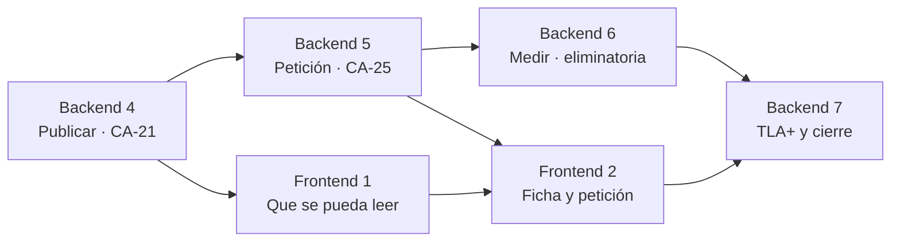

# Hoja de ruta

**Qué es este fichero.** El reparto de lo que queda en **planes por fase**, para los dos tracks. No dice cómo se implementa nada —eso es cada plan— ni qué falta en detalle —eso es [`estado-del-entregable.md`](estado-del-entregable.md)—: dice **cuántos planes quedan, qué entrega cada uno y en qué orden**.

Se escribe porque después de tres fases hay **cincuenta requisitos de backend y una spec de frontend sin empezar**, y `CLAUDE.md` §3.3 bis avisa de lo que pasa con un plan demasiado grande: «no se lee» y «se escribe demasiado pronto».

**El criterio del corte es el de §3.3 bis, no el número de requisitos:** cada plan **entrega software que funciona y se puede probar solo**.

---

## Los dos tracks, y por qué van en paralelo

| | Spec | Estado | Planes hechos | Planes que faltan |
| --- | --- | --- | --- | --- |
| **Backend** | [`001-backend-v1`](001-backend-v1/spec.md) | `aprobada` | 3, completados | **4** |
| **Frontend** | [`002-frontend`](002-frontend/spec.md) | `aprobada` | 0 | **2** |

**No comparten un solo fichero.** El backend vive en `src/backend/`, el frontend en `src/frontend/`, que aún no existe. La única atadura es el **OpenAPI**: `RI-11` está descrito literalmente como «lo que consume la 002», y el plan del frontend ya prevé generar su cliente de ahí.

**Y el frontend es el único sitio del proyecto donde el paralelismo da más de 2×.** Su propio plan lo explica: «las tres páginas de la ola 3 no se llaman entre sí». En el backend, medido tres veces, la ganancia fue **~2×** porque la ruta crítica es una cadena.

---

## Backend · cuatro planes

### Fase 4 — **Publicar**  ·  cierra `CA-21`

**Entrega:** de una novela de diez capítulos integrados sale una **`VersionPublicada` inmutable**, y una cronología imposible **impide publicarla**.

| | |
| --- | --- |
| Requisitos | `RF-PUB-01` a `08` · `RF-FOR-01` a `04` · `RI-08`, `RI-11` |
| Criterios | **`CA-21`** (Lean detiene una publicación) · `CA-23` · `CA-24` |
| Herramienta nueva | **Lean 4**, aprobada en bloque por P-01 y **sin instalar** |

**Por qué primero.** `CA-21` es uno de los cinco criterios que deciden si el sistema existe, y **la publicación es lo que el frontend lee**: sin ella, la Fase 1 del frontend no tiene qué mostrar. Es el desbloqueo de los dos tracks a la vez.

**Lo que hay que mirar antes de empezar:** la cronología ya existe como **vista derivada del ledger** desde la Fase 2, que es justo lo que §5c pide como entrada del fichero Lean. No se parte de cero.

---

### Fase 5 — **Atender al lector**  ·  cierra `CA-25`

**Entrega:** una petición de cambio sobre un hecho **regenera solo los capítulos que lo usan**, y si introduce un defecto nuevo **no se publica** — pero uno preexistente no lo impide.

| | |
| --- | --- |
| Requisitos | `RF-PET-01` a `08` · `RI-09`, `RI-10` · `RNF-REN-01` |
| Criterios | **`CA-25`** (el quinto de los cinco) |

**Aquí vencen tres deudas a la vez**, y por eso van en este plan y no antes: `evento` y `hecho_canon` **no tienen `run_id`** —hoy es exacto y deja de serlo al regenerar—, `resumen_capitulo` tiene `UNIQUE(capitulo_id)` y **siempre inserta**, y `hecho_canon.sustituye_a` existe desde la Fase 3 **y nadie lo ha ejercitado todavía**. Las tres están en [`problemas-abiertos.md`](problemas-abiertos.md).

---

### Fase 6 — **Medir**  ·  la condición eliminatoria

**Entrega:** hay **números** sobre el sistema, y se sabe de dónde salen.

| | |
| --- | --- |
| Requisitos | `RF-EVA-01` a `04` · `RF-OBS-01` a `07` · `RF-JUZ-01` a `07` · `RF-VAL-01` *(la mitad que falta: el* score *)* |
| Criterios | `CA-18`, `CA-19`, `CA-20`, `CA-26`, `CA-37` |
| Herramienta nueva | **Langfuse**, aprobada por P-01 y sin instalar |

**Es una de las dos condiciones que el encargo escribe como eliminatorias**, y arrastra tres cosas que hoy están a medias: ningún validador emite su *score*, el juez con rúbrica no existe (decisión **P-B**: no entraba hasta poder calibrarse) y la revisión humana tampoco.

**Va después de la 5 y no antes** porque las evals corren sobre el sistema entero: cinco briefs que llegan hasta publicar, y uno de ellos con **trampa temporal que debe cazar Lean**. Sin la Fase 4 no hay qué medir.

---

### Fase 7 — **Probar el harness**  ·  `TLA+` y el cierre

**Entrega:** la máquina del sistema está **verificada formalmente**, y el repositorio tiene lo que el encargo pide como entregable.

| | |
| --- | --- |
| Requisitos | `RF-FOR-05` a `08` · `RF-GUA-07` *(el hook de policy)* · `RF-VAL-08` *(la validación visual)* |
| Criterios | `CA-22`, `CA-27` |
| Ficheros del encargo | `README.md`, `.env.example`, `.claude/mcp.json`, `/presentacion/`, `/ejemplos/novela-ejemplo.pdf` |

**Va la última por dependencia, no por importancia.** `RF-VAL-08` abre la lectura **en un navegador**: necesita el frontend. Y el PDF de la novela de ejemplo —«la evidencia de que el sistema funciona de principio a fin»— necesita **publicación, frontend y una corrida real**.

**Lo que ahorra trabajo:** la máquina de estados ya está en código y cerrada —`features/escritura/maquina.py`, con su tabla de transiciones explícita y 64 tests— y `checkpoint.py` fija tres precondiciones más. **El `.tla` se escribe contra eso, no contra una pizarra.**

---

## Frontend · dos planes

### Fase 1 — **Que se pueda leer**  ·  ya escrito, en `borrador`

**El plan existe:** [`002-frontend/plan-1-lectura.md`](002-frontend/plan-1-lectura.md), cortado para cuatro agentes, con su grafo y sus nueve tareas. Lleva en `borrador` desde el primer día.

**Entrega:** alguien abre un enlace y lee la novela entera — portada con dedicatoria, índice navegable, diez capítulos y el enlace al PDF.

**Antes de aprobarlo hay que releerlo**, y no por desconfianza: se escribió **antes de que existiera el backend**, y su propio plan dice que usa «un OpenAPI de ejemplo commiteado» mientras tanto. Ahora el OpenAPI es real y publica ocho rutas. **Ese paso es el que avisa de qué campos cambiaron.**

---

### Fase 2 — **La ficha y la petición del lector**

**Entrega:** la ficha de personajes y lugares **con enlaces al capítulo donde aparece cada uno**, y la petición de cambio desde la propia página.

**El dato ya existe en el backend:** `hecho_usado_en` registra en qué capítulos se apoya cada hecho desde la Fase 2, que es exactamente lo que §2 del encargo pide para la ficha. Lo que falta es leerlo y pintarlo.

**Depende de la Fase 5 del backend**, que es la que construye la petición de cambio.

---

## El orden, y las dos ataduras entre tracks

**Dos ataduras, y solo dos:**

1. **`Backend 4 → Frontend 1`.** El frontend no tiene qué leer hasta que exista `VersionPublicada`.
2. **`Frontend 2 → Backend 7`.** `RF-VAL-08` abre la lectura en un navegador, y el PDF de ejemplo necesita las dos cosas.

**Entre medias, los dos tracks corren sueltos.** Con la Fase 4 del backend cerrada, `Frontend 1` y `Backend 5` pueden ir a la vez sin tocarse.

---

## Lo que NO es un plan, y conviene decirlo

**Los seis documentos de `/docs` que el encargo exige** —spec inicial, *trade-offs*, *explainers*, diagramas, registro de iteraciones y *red-team log*— **no son una fase**: son extracción de material que ya existe. Las tablas de **Desviaciones** de los tres planes son el registro de iteraciones —más de ciento cincuenta filas con causa y efecto—, los *trade-offs* son las decisiones **P-01 a P-08** de la spec, y los diagramas están en `architecture.md`.

**Es eliminatorio y es lo más barato que queda.** Se hace una vez, no por fase, y no espera a nadie: **puede empezarse hoy, en paralelo con cualquier cosa.**
