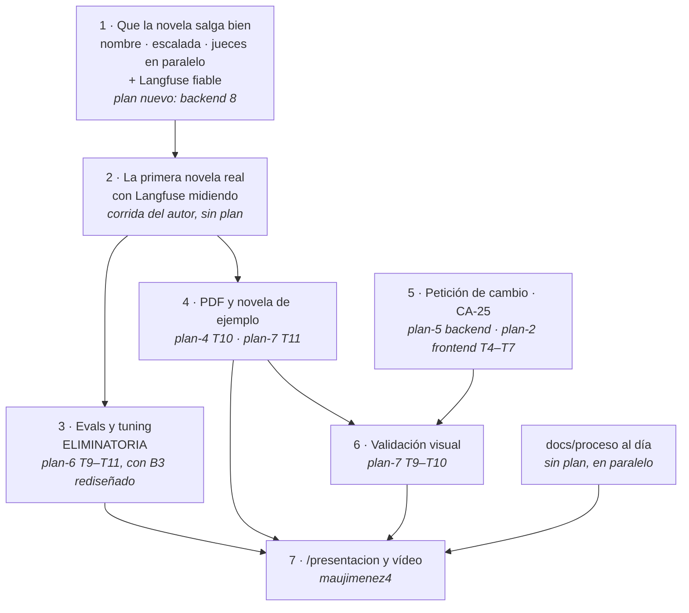

# Hoja de ruta

**Qué es este fichero.** El orden de lo que queda, en **tramos**, y qué plan cubre cada uno. No dice cómo se implementa nada —eso es cada plan— ni qué falta en detalle —eso es [`estado-del-entregable.md`](estado-del-entregable.md)—: dice **qué viene, en qué orden y por qué ese**.

**Reescrito el 2026-09-24 por la tarde.** La versión anterior ordenaba las Fases 4 a 7 del backend y dos planes de frontend que no habían empezado. Hoy casi todo eso está hecho, y el orden correcto ya no lo dictan las fases sino **una sola pregunta: qué falta para que salga una novela de verdad**, porque de ella cuelgan las evals —eliminatorias—, el PDF de ejemplo y la revisión humana.

**El criterio del corte sigue siendo el de `CLAUDE.md` §3.3 bis:** cada plan entrega software que funciona y se puede probar solo. Y **ningún agente aprueba un plan**.

---

## Dónde están los planes, de verdad

La columna `estado` es la del fichero; la de la derecha es lo que dice `git log` y el código.

### Backend · [`001-backend-v1`](001-backend-v1/spec.md), `aprobada`

| Plan | `estado` | Lo que hay de verdad |
| --- | --- | --- |
| 1 · Encargo | `completado` | — |
| 2 · Capítulo | `completado` | — |
| 3 · Novela | `completado` | — |
| 4 · Publicar | `aprobado` | **T1–T9 hechas** (`3b618f7` … `dfea95c`, `4c6ff5c`). **Falta T10, el PDF**, firmada aparte en `24a915f` |
| 5 · Petición | `aprobado` | **Ninguna tarea hecha.** Ni `vigente`, ni `run_id` en `evento`/`hecho_canon`, ni endpoints |
| 6 · Medir | `aprobado` | **T1–T8 hechas.** Faltan **T9** (revisión humana: tablas sí, servicio y rutas no), **T10** (los cinco briefs) y **T11** (*tuning*) |
| 7 · Harness | `aprobado` | **T1–T8 hechas** (TLA+, correspondencia, hook de policy, README, `.env.example`, `mcp.json`). Faltan **T9** (validación visual), **T10** (browser MCP documentado) y **T11** (PDF de ejemplo y presentación) |

### Frontend · [`002-frontend`](002-frontend/spec.md), `aprobada`

| Plan | `estado` | Lo que hay de verdad |
| --- | --- | --- |
| 1 · Lectura | `aprobado` | T1, T3 y T4 tienen commit propio (`93fca70`, `30fe817`, `94fff2a`); el resto no tiene commit con su nombre, y el plan 3 invirtió sus cinco rutas en una. **Nadie ha cotejado tarea a tarea qué queda** |
| 2 · Ficha y petición | `aprobado` | La ficha sí (`QuienEsQuien`). **La petición, la espera de una regeneración y las novedades (T4–T7) no** |
| 3 · Una página | **`borrador`** | **Implementado** (`fccc576`, `e306770`) **sin firma**. Es la puerta Código de §3.2 cruzada sin abrir (P-29) |
| 4 · Apariencia | `completado` | Con la revisión visual de `maujimenez4` (`1b1cb45`) |

**Tres planes necesitan que alguien cambie su `estado`** —4 del backend y 1 del frontend a `completado` cuando proceda, 3 del frontend a firmado o a rehecho—, y eso lo hace `maujimenez4`, no un agente.

---

## El orden, desde hoy

### Tramo 1 · Que la novela salga bien  ·  **plan nuevo, sin escribir**

**Entrega:** un capítulo que, contra el modelo real, sale con el nombre del destinatario, y que si escala deja el texto y los defectos que lo hicieron escalar.

| Pieza | Problema | Por qué aquí |
| --- | --- | --- |
| **El marcador del nombre** | P-19 | Sin esto la novela no es entregable, por bien que esté escrita. La solución acordada —los agentes escriben un marcador, el código lo sustituye al servir, el canon guarda el marcador— **toca el prompt de cinco roles, los vetos, `nombres_literales` y el vocabulario**: `marcador` no está en `docs/definitions.md` y `CLAUDE.md` §2 exige confirmarlo antes |
| **La evidencia de la escalada** | P-20 | Hoy un `ESCALADA` para la novela y borra lo único que permitiría decidir. Guardar texto y defectos es **esquema nuevo** (§3 regla 7: pregunta primero) |
| **Continuista y Crítico en paralelo** | P-21 | Estimado en 10–15 minutos menos por novela, sobre ~80–90 medidos. **Antes de hacerlo hay que resolver qué cuenta el techo concurrente**: hay dos medidas de la sobrecarga del CLI que difieren en un orden de magnitud |
| **Langfuse fiable** | P-22 | El criterio en el nombre del *score*, `flush` al apagar y `prompt_id`/versión/hash en cada span. **Va antes de la corrida**, no después: una corrida con trazas que pierden el criterio y la versión de plantilla es una corrida que hay que repetir |

**Por qué un plan nuevo y no una tarea suelta:** las cuatro piezas cambian esquema, prompts o vocabulario, y ninguna está en los planes 5–7. Se propone `001-backend-v1/plan-8-corrida-real.md`, escrito ahora y con el código delante, que es lo que §3.3 bis pide. **Si toca un requisito de la spec** —el marcador probablemente sí—, vuelve a firma como pasó con P-07.

### Tramo 2 · La primera novela real  ·  **sin plan: la lanza el autor**

**Entrega:** una obra con diez capítulos integrados y publicada, con su sesión en Langfuse.

No es código: es gastar cuota con el brief del `README.md` y mirar. **Es la primera vez que los capítulos 2 a 10 pasan por el modelo**, así que lo esperable es que salga algo nuevo; lo que salga va a `problemas-abiertos.md` y, si es un cambio, al `registro-de-iteraciones.md`.

Depende de: tramo 1, y de que la cuenta tenga cuota. Una novela son ~80–90 minutos.

### Tramo 3 · Evals y *tuning*  ·  **ELIMINATORIO**  ·  plan-6 T9, T10, T11

**Entrega:** `evals/RESULTADOS.md` con la tabla de los cinco briefs y el antes/después de `continuista.v1` contra `v2`; `docs/proceso/evaluacion.md` con el razonamiento.

**El plan existe y está firmado, pero hay que tocarlo antes de ejecutarlo:**

- **B3 no fallaría donde el plan dice.** Está diseñado para el invariante de edad contra fecha de nacimiento, y la plantilla Lean **no lo incluye**, razonadamente (P-27). O se rediseña B3 contra `sinUbicuidad` o `sinReaparecidos`, o se añade el invariante con fechas de nacimiento. Las dos cosas son decisión de `maujimenez4`, y la segunda cierra además el hueco de §5c.
- **T11 da por hecho que los spans llevan `prompt_id`, `prompt_version` y `prompt_hash`**, y hoy no los llevan: lo resuelve el tramo 1.
- **Cinco briefs por dos versiones son diez novelas**, unas 15 horas de reloj en serie y diez veces la cuota. Conviene decidir antes si el *tuning* corre sobre los cinco o sobre un subconjunto, y escribirlo.

**T9 (revisión humana)** va aquí porque la pide §5b y porque necesita una novela: la del tramo 2.

### Tramo 4 · El PDF y la novela de ejemplo  ·  plan-4 T10 y plan-7 T11

**Entrega:** `GET /lectura/{token}/pdf` deja de dar `501`, y `ejemplos/novela-ejemplo.pdf` existe, generada con el brief del `README.md`.

La tarea del PDF **está escrita y firmada** (`24a915f`): imprimir desde el Chromium de Playwright, sin dependencia nueva. Depende del tramo 2 solo para tener qué imprimir; la implementación puede ir en paralelo con el tramo 3.

### Tramo 5 · La petición de cambio  ·  **`CA-25`**  ·  plan-5 del backend y plan-2 T4–T7 del frontend

**Entrega:** una petición sobre un hecho regenera solo los capítulos que lo usan, no publica si introduce un defecto nuevo, y la lectura marca lo cambiado y conserva lo anterior.

**No es eliminatoria, pero §2 la exige** para la opción web, y es el único requisito de §2 que no tiene nada construido. Los dos planes están **aprobados y sin empezar**, y **no comparten fichero**: backend y frontend pueden ir a la vez. El plan-5 paga P-6, P-7 y P-8, y reabre `CA-33` (faltan `RI-09`, `RI-10` y `RI-12`).

**Por qué va después de los tramos 3 y 4 y no antes:** una regeneración cuesta como un capítulo por cada capítulo afectado, y sin la novela del tramo 2 no hay nada que regenerar. Si el plazo aprieta, **es el tramo que se recorta**, y se escribe en `docs/proceso/trade-offs.md` que se recortó y por qué.

### Tramo 6 · La validación visual  ·  plan-7 T9 y T10

**Entrega:** un validador que abre la lectura en un navegador y comprueba índice, ficha y portada, y la inspección real con el browser MCP documentada en `/docs`.

Necesita una novela publicada (tramo 2) y conviene que la ficha tenga ya sus enlaces (P-24) y el PDF (tramo 4). Es barato una vez hay qué abrir.

### Tramo 7 · `/presentacion/` y el vídeo  ·  **`maujimenez4`**

Deck en PDF y editable, anexos, `README.md` de la carpeta y vídeo de demo. **No lo escribe un agente.** Es lo último porque cuenta lo que salió de los tramos 3 y 4.

---

## Lo que no es un tramo, y va en paralelo

| Qué | Por qué no espera | Quién |
| --- | --- | --- |
| **`docs/proceso/` al día** | Es eliminatorio y está desactualizado (P-30): el registro dice «no hay `.tla`» y no recoge la corrida de hoy | Cualquier sesión, con `coherencia-docs` |
| **Las firmas de estado de los planes** | P-29: el plan 3 del frontend está implementado en `borrador` | `maujimenez4` |
| **Los flecos del frontend** | P-24: el enlace de la ficha, la posición guardada, `Lectura.tsx` y `Muestra.tsx` muertos | Una sesión de frontend, en una hora |
| **`ruff format` y `PLANTILLA_V1`** | P-26: dos ficheros | Quien toque `obra` o `escena` |
| **`openapi.json` con test** | P-23: ya se desincronizó una vez hoy (`ee5a265`) | Quien toque un endpoint |

---

## Lo que ya no está en esta hoja, y estaba

Para que el salto se lea: la versión anterior tenía como pendiente la Fase 4 entera (salvo el PDF, hecha), Langfuse (hecho en código), TLA+ (hecho), el hook de policy (hecho), el Continuista sin llamar (corriendo), el juez (puntuando), `README.md`, `.env.example`, `.claude/mcp.json` (hechos), los seis documentos de `docs/proceso/` (hechos) y **el frontend entero** (hecho salvo petición, novedades y PDF).
